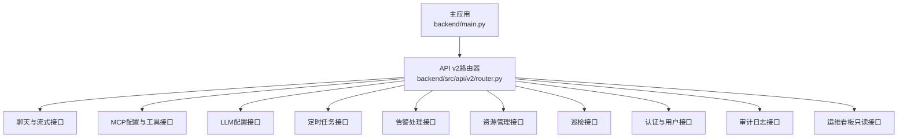
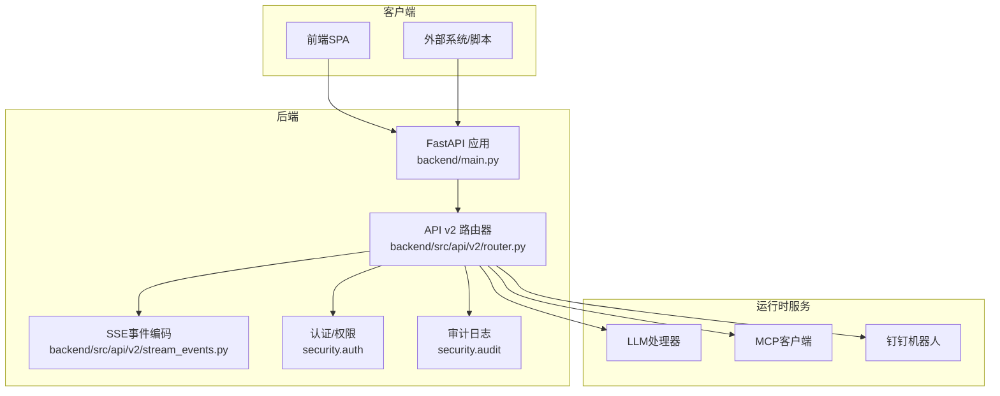
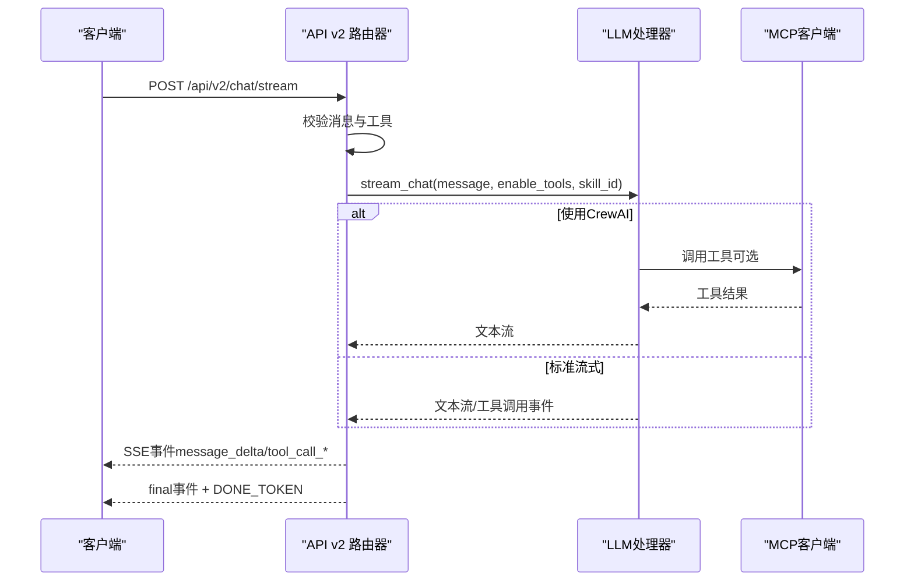
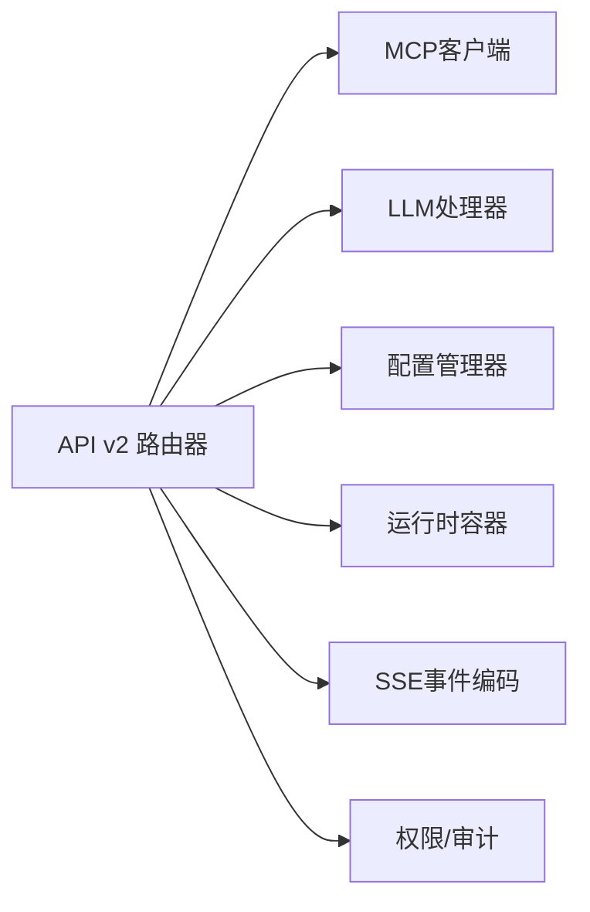

# API接口参考

<cite>
**本文档引用的文件**
- [main.py](file://backend/main.py)
- [router.py](file://backend/src/api/v2/router.py)
- [stream_events.py](file://backend/src/api/v2/stream_events.py)
- [auth.py](file://backend/src/api/v2/endpoints/auth.py)
- [users.py](file://backend/src/api/v2/endpoints/users.py)
- [mcp.py](file://backend/src/api/v2/endpoints/mcp.py)
- [llm_config.py](file://backend/src/api/v2/endpoints/llm_config.py)
- [scheduler.py](file://backend/src/api/v2/endpoints/scheduler.py)
- [alerts.py](file://backend/src/api/v2/endpoints/alerts.py)
- [resources.py](file://backend/src/api/v2/endpoints/resources.py)
- [inspection.py](file://backend/src/api/v2/endpoints/inspection.py)
- [ops.py](file://backend/src/api/v2/endpoints/ops.py)
- [audit.py](file://backend/src/api/v2/endpoints/audit.py)
- [standard.py](file://backend/src/api/v2/standard.py)
</cite>

## 目录
1. [简介](#简介)
2. [项目结构](#项目结构)
3. [核心组件](#核心组件)
4. [架构总览](#架构总览)
5. [详细组件分析](#详细组件分析)
6. [依赖分析](#依赖分析)
7. [性能考虑](#性能考虑)
8. [故障排查指南](#故障排查指南)
9. [结论](#结论)
10. [附录](#附录)

## 简介
本文件为“钉钉K8s运维机器人”的完整API接口参考文档，覆盖聊天接口、工具管理、MCP服务器管理、LLM配置、定时任务、用户认证与审计、资源管理、告警处理、巡检与运维看板等全部RESTful端点。文档提供每个接口的HTTP方法、URL模式、请求/响应结构、认证要求、错误码说明，并对流式聊天（Server-Sent Events）协议进行详细说明。同时给出API版本管理策略、向后兼容性、使用限制、性能考量与最佳实践建议。

## 项目结构
后端采用FastAPI框架，API v2路由挂载在 /api/v2 前缀下，核心入口位于主应用文件中，统一注册各业务模块端点。前端通过SPA提供交互界面，后端亦可独立作为纯API服务运行。

图表来源
- [main.py:421-422](file://backend/main.py#L421-L422)
- [router.py:45](file://backend/src/api/v2/router.py#L45)

章节来源
- [main.py:301-422](file://backend/main.py#L301-L422)
- [router.py:45-550](file://backend/src/api/v2/router.py#L45-L550)

## 核心组件
- API v2路由器：集中定义所有端点、权限依赖、响应封装与流式事件编码。
- 流式事件编码：统一SSE事件格式，兼容前端消费。
- 标准响应封装：统一success/error响应体结构，包含请求ID、时间戳与元信息。
- 运行时容器：集中管理LLM处理器、MCP客户端、钉钉机器人等服务实例。

章节来源
- [router.py:22-29](file://backend/src/api/v2/router.py#L22-L29)
- [stream_events.py:13-160](file://backend/src/api/v2/stream_events.py#L13-L160)
- [standard.py:21-65](file://backend/src/api/v2/standard.py#L21-L65)

## 架构总览
系统围绕“聊天+工具+LLM+运维”一体化设计，API层负责编排MCP工具调用与LLM推理，结合钉钉通知形成闭环。

图表来源
- [main.py:301-422](file://backend/main.py#L301-L422)
- [router.py:16-42](file://backend/src/api/v2/router.py#L16-L42)

## 详细组件分析

### 聊天与流式接口
- 普通聊天（非流式）
  - 方法：POST
  - 路径：/api/v2/chat
  - 权限：chat:send
  - 请求体：包含message（必填）、context（可选）、tools（可选）、enable_tools（可选）、skill_id（可选）
  - 响应：包含response、message_id、timestamp
  - 错误：500（处理失败）

- 流式对话（Server-Sent Events）
  - 方法：POST
  - 路径：/api/v2/chat/stream
  - 权限：chat:send
  - 请求体：同上
  - 响应：text/event-stream，事件类型包括：
    - message_delta：增量文本片段
    - tool_call_start/tool_call_result：工具调用开始/结果
    - final：对话结束事件，携带tool_call_count
    - error：错误事件，包含code、message、recoverable、suggestions
  - 特殊帧：DONE_TOKEN（兼容标记）
  - 头部：Cache-Control/no-cache、Access-Control-Allow-*、X-Accel-Buffering/no、X-Content-Type-Options/nosniff
  - 错误：400（工具不存在）、500（初始化失败）、503（MCP不可用）

- 技能与工具
  - GET /api/v2/skills：列出项目内Skill（只读）
  - GET /api/v2/tools：获取MCP工具列表
  - POST /api/v2/tools/refresh：刷新MCP工具列表
  - POST /api/v2/tools/{tool_name}/call：调用MCP工具（受权限控制）

- 流式事件协议
  - 事件编码：encode_sse_event/encode_done
  - 事件归一化：normalize_stream_chunk/_normalize_dict_event
  - 参数解析：_parse_arguments

图表来源
- [router.py:175-344](file://backend/src/api/v2/router.py#L175-L344)
- [stream_events.py:13-160](file://backend/src/api/v2/stream_events.py#L13-L160)

章节来源
- [router.py:48-58](file://backend/src/api/v2/router.py#L48-L58)
- [router.py:158-174](file://backend/src/api/v2/router.py#L158-L174)
- [router.py:175-344](file://backend/src/api/v2/router.py#L175-L344)
- [router.py:346-422](file://backend/src/api/v2/router.py#L346-L422)
- [stream_events.py:13-160](file://backend/src/api/v2/stream_events.py#L13-L160)

### 用户认证与权限
- 登录
  - 方法：POST
  - 路径：/api/v2/auth/login
  - 请求体：username、password
  - 响应：access_token、token_type、expires_in、user
  - 错误：401（凭据无效）

- 当前用户
  - 方法：GET
  - 路径：/api/v2/auth/me
  - 响应：user公共信息

- 退出登录
  - 方法：POST
  - 路径：/api/v2/auth/logout
  - 响应：message

- 用户管理（管理员）
  - GET /api/v2/users：用户列表、角色与权限
  - POST /api/v2/users：创建用户
  - PATCH /api/v2/users/{user_id}：更新用户
  - DELETE /api/v2/users/{user_id}：停用用户
  - GET /api/v2/users/roles：角色与权限

- 权限模型
  - chat:send、chat:read
  - mcp:read、mcp:write
  - llm:read、llm:write
  - scheduler:read、scheduler:write、scheduler:run
  - users:read、users:write
  - audit:read
  - alerts:read、alerts:write
  - resources:read、resources:write
  - inspection:run
  - ops:read

章节来源
- [auth.py:16-88](file://backend/src/api/v2/endpoints/auth.py#L16-L88)
- [users.py:17-163](file://backend/src/api/v2/endpoints/users.py#L17-L163)

### MCP服务器与工具管理
- 配置管理
  - GET /api/v2/mcp/config：获取MCP配置
  - POST /api/v2/mcp/config：更新MCP配置
  - POST /api/v2/mcp/config/reload：重新加载配置
  - GET /api/v2/mcp/config/validate：验证配置

- 服务器管理
  - GET /api/v2/mcp/runtime/servers：运行时服务器状态（兼容）
  - GET /api/v2/mcp/servers/status：服务器状态
  - POST /api/v2/mcp/servers/batch-toggle：批量切换服务器上下文范围
  - GET /api/v2/mcp/servers：服务器列表
  - GET /api/v2/mcp/servers/{server_name}：服务器详情
  - POST /api/v2/mcp/servers/{server_name}/enable：启用
  - POST /api/v2/mcp/servers/{server_name}/disable：禁用
  - POST /api/v2/mcp/servers/{server_name}/connect：连接
  - POST /api/v2/mcp/servers/{server_name}/disconnect：断开
  - POST /api/v2/mcp/servers/{server_name}/reconnect：重连
  - GET /api/v2/mcp/categories：工具分类统计

- 工具管理
  - GET /api/v2/mcp/tools：工具列表
  - GET /api/v2/mcp/tools/{tool_name}：工具详情
  - POST /api/v2/mcp/tools/{tool_name}/enable：启用
  - POST /api/v2/mcp/tools/{tool_name}/disable：禁用
  - GET /api/v2/mcp/status：MCP客户端状态

章节来源
- [mcp.py:70-628](file://backend/src/api/v2/endpoints/mcp.py#L70-L628)

### LLM配置管理
- 简化版配置接口（v2）
  - GET /api/v2/config/llm/providers：获取LLM配置（简化版）
  - POST /api/v2/config/llm/providers：LLM配置更新（暂不支持）
  - GET /api/v2/config/llm/providers/templates：模板（暂不支持）
  - GET /api/v2/llm/providers/available：可用供应商列表
  - POST /api/v2/llm/providers/switch：切换供应商（暂不支持）
  - GET /api/v2/llm/providers/stats：供应商统计

- 文件化配置接口（LLM配置管理）
  - GET /api/v2/llm/config/current：当前配置
  - POST /api/v2/llm/config/update：更新配置
  - GET /api/v2/llm/config/overview：配置概览
  - GET /api/v2/llm/config/providers：提供商列表
  - POST /api/v2/llm/config/providers：创建提供商
  - PUT /api/v2/llm/config/providers/{provider_id}：更新提供商
  - DELETE /api/v2/llm/config/providers/{provider_id}：删除提供商
  - GET /api/v2/llm/config/backups：备份列表
  - POST /api/v2/llm/config/restore/{backup_name}：恢复备份
  - POST /api/v2/llm/config/validate：验证配置
  - GET /api/v2/llm/config/export：导出配置
  - POST /api/v2/llm/config/import：导入配置
  - GET /api/v2/llm/config/file-watcher/status：文件监控状态
  - POST /api/v2/llm/config/file-watcher/toggle：启用/禁用文件监控
  - POST /api/v2/llm/config/file-watcher/restart：重启文件监控

章节来源
- [router.py:551-784](file://backend/src/api/v2/router.py#L551-L784)
- [llm_config.py:94-473](file://backend/src/api/v2/endpoints/llm_config.py#L94-L473)

### 定时任务管理
- 任务管理
  - GET /api/v2/scheduler/tasks：任务列表（分页、过滤）
  - POST /api/v2/scheduler/tasks：创建任务
  - GET /api/v2/scheduler/tasks/{task_id}：任务详情
  - PUT /api/v2/scheduler/tasks/{task_id}：更新任务
  - DELETE /api/v2/scheduler/tasks/{task_id}：删除任务
  - GET /api/v2/scheduler/tasks/{task_id}/executions：执行历史（分页）
  - POST /api/v2/scheduler/tasks/{task_id}/run：手动执行

- 统计与状态
  - GET /api/v2/scheduler/stats：任务统计
  - GET /api/v2/scheduler/running：运行中任务
  - GET /api/v2/scheduler/task-types：任务类型与模板
  - GET /api/v2/scheduler/cron-templates：Cron模板
  - POST /api/v2/scheduler/validate-cron：Cron表达式验证
  - GET /api/v2/scheduler/config/validate/{task_type}：任务配置验证
  - GET /api/v2/scheduler/config/template/{task_type}：任务配置模板
  - GET /api/v2/scheduler/status：调度器状态
  - GET /api/v2/scheduler/maintenance/cleanup：清理旧数据
  - POST /api/v2/scheduler/maintenance/reset-stats：重置执行统计

章节来源
- [scheduler.py:99-661](file://backend/src/api/v2/endpoints/scheduler.py#L99-L661)

### 资源管理与指标
- 指标更新
  - POST /api/v2/resources/update-metrics：批量更新指标（支持14d/1d周期）
  - GET /api/v2/resources/metrics-coverage：指标覆盖情况报告
  - POST /api/v2/resources/force-aggregation：强制触发指标聚合

章节来源
- [resources.py:139-433](file://backend/src/api/v2/endpoints/resources.py#L139-L433)

### 告警处理
- 资源告警
  - POST /api/v2/alerts/resource：接收并处理资源告警（异步LLM分析+钉钉通知）
  - GET /api/v2/alerts/stats：告警处理统计
  - POST /api/v2/alerts/test：测试告警处理

章节来源
- [alerts.py:92-692](file://backend/src/api/v2/endpoints/alerts.py#L92-L692)

### 巡检与运维看板
- 巡检
  - POST /api/v2/inspection/run：执行集群巡检（生成Markdown报告，可选钉钉推送）
- 运维看板（只读）
  - GET /api/v2/ops/overview：运维工作台概览（只读聚合）

章节来源
- [inspection.py:242-262](file://backend/src/api/v2/endpoints/inspection.py#L242-L262)
- [ops.py:87-313](file://backend/src/api/v2/endpoints/ops.py#L87-L313)

### 审计日志
- GET /api/v2/audit/logs：操作日志（支持actor/action/result过滤）

章节来源
- [audit.py:14-36](file://backend/src/api/v2/endpoints/audit.py#L14-L36)

### 健康检查与状态
- GET /api/v2/status：API v2状态信息（版本、特性、兼容性）
- GET /api/v2/health：组件健康检查（MCP、LLM、钉钉、工具数量）
- GET /health：后端整体健康检查

章节来源
- [router.py:83-156](file://backend/src/api/v2/router.py#L83-L156)
- [main.py:464-474](file://backend/main.py#L464-L474)

## 依赖分析
- 路由器依赖
  - 依赖EnhancedMCPClient、EnhancedLLMProcessor、ConfigManager、RuntimeContainer
  - 依赖权限装饰器require_permission与CurrentUser
- 流式事件
  - 统一事件编码与归一化，兼容历史事件类型
- 标准响应
  - success_envelope/error_envelope统一响应结构，包含request_id、timestamp、meta

图表来源
- [router.py:16-42](file://backend/src/api/v2/router.py#L16-L42)

章节来源
- [router.py:16-42](file://backend/src/api/v2/router.py#L16-L42)
- [standard.py:21-65](file://backend/src/api/v2/standard.py#L21-L65)

## 性能考虑
- 流式输出
  - 使用SSE，避免一次性大响应；前端按事件增量渲染
  - 设置X-Accel-Buffering=no与no-cache，确保实时性
- 工具调用
  - 仅在前端启用工具且MCP可用时启用工具链；否则走纯LLM对话
  - 工具调用失败不影响对话流，错误事件会返回并结束流
- 超时与降级
  - 资源指标更新工具设置10分钟超时；超时返回408
  - MCP不可用时，工具端点返回503；LLM不可用时，巡检回退为最小Markdown
- 并发与限速
  - 建议前端对高频请求做节流与去抖
  - 后端未内置速率限制，可在网关层配置

## 故障排查指南
- 常见错误码
  - 400：参数校验失败、工具不存在、任务配置无效
  - 401：未认证或令牌无效
  - 403：权限不足
  - 404：资源不存在（用户、任务、工具、服务器）
  - 408：请求超时（资源指标更新）
  - 422：请求体验证失败
  - 500：内部错误
  - 502：MCP工具调用失败
  - 503：MCP/LLM不可用
- 审计与追踪
  - 所有v2请求均封装在success_envelope/error_envelope中，包含request_id与timestamp
  - 可通过审计日志接口查询操作轨迹
- 建议排查步骤
  - 检查MCP连接状态与工具列表
  - 校验LLM配置与供应商可用性
  - 查看SSE事件是否正常到达（final与DONE）
  - 使用/ops/overview快速定位运行时组件状态

章节来源
- [main.py:311-345](file://backend/main.py#L311-L345)
- [audit.py:14-36](file://backend/src/api/v2/endpoints/audit.py#L14-L36)

## 结论
本API参考文档覆盖了从聊天、工具、LLM配置到定时任务、资源管理、告警、巡检与运维看板的完整能力矩阵。通过SSE流式协议与统一响应封装，系统实现了可观测、可审计、可扩展的运维智能体平台。建议在生产环境中配合网关层进行鉴权、限流与TLS终止，并定期维护LLM与MCP配置，确保告警与巡检链路稳定。

## 附录

### API版本管理与向后兼容
- 版本前缀：/api/v2
- 特性：streaming、config_management、real_time_chat
- 兼容性：/api/v2/status中声明compatible_with=v1
- 兼容端点：
  - GET /api/v2/config/llm（兼容性接口）
  - GET /api/v2/llm/config/current（文件化配置）
  - GET /api/v2/mcp/runtime/servers（兼容性端点）

章节来源
- [router.py:83-96](file://backend/src/api/v2/router.py#L83-L96)
- [router.py:692-784](file://backend/src/api/v2/router.py#L692-L784)

### 认证与授权
- 认证方式：Bearer Token（登录后获得）
- 权限粒度：按资源与动作划分（chat、mcp、llm、scheduler、users、audit、alerts、resources、inspection、ops）
- 审计：所有v2请求均记录操作审计

章节来源
- [auth.py:21-88](file://backend/src/api/v2/endpoints/auth.py#L21-L88)
- [users.py:32-163](file://backend/src/api/v2/endpoints/users.py#L32-L163)
- [main.py:348-395](file://backend/main.py#L348-L395)

### 流式聊天事件类型说明
- message_delta：文本增量
- tool_call_start：工具调用开始
- tool_call_result：工具调用结果（包含success、result、duration、error等）
- final：对话结束，携带tool_call_count
- error：错误事件，包含code、message、recoverable、suggestions

章节来源
- [stream_events.py:23-160](file://backend/src/api/v2/stream_events.py#L23-L160)