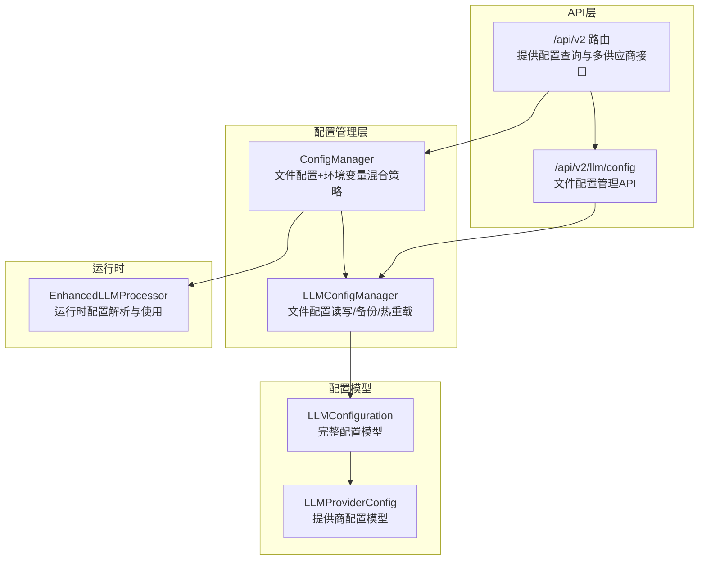
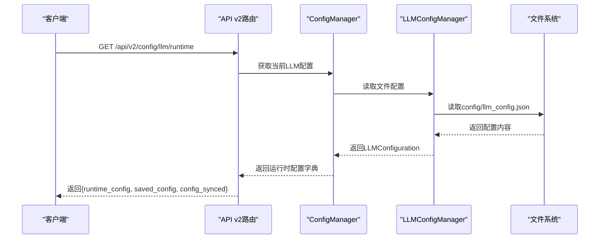
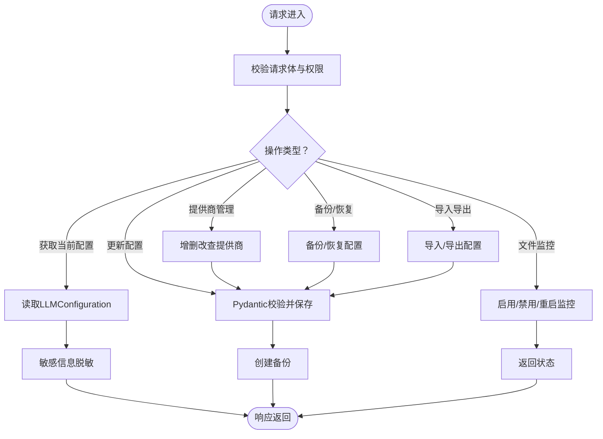
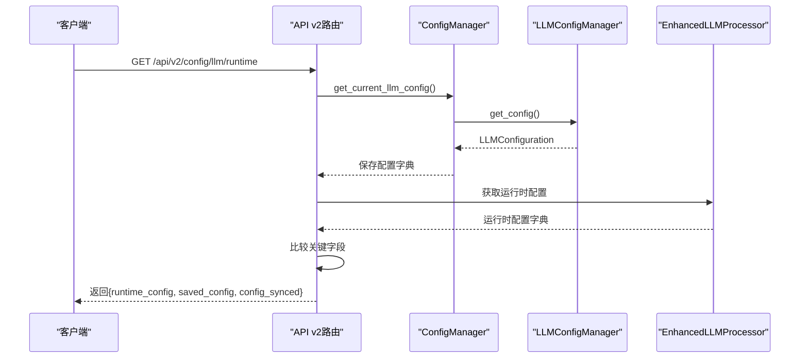
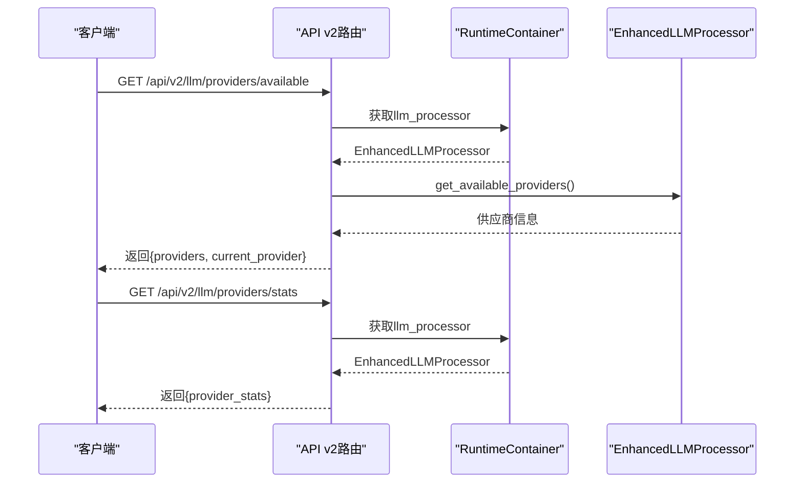
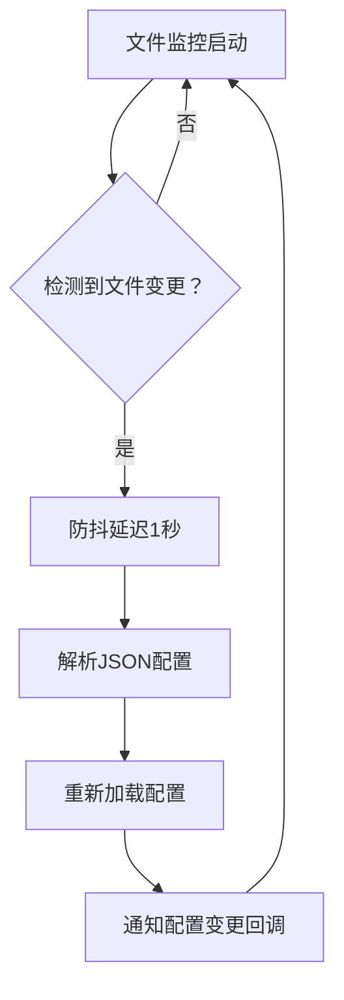
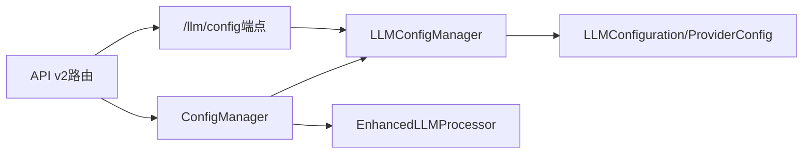

# LLM配置接口

<cite>
**本文档引用的文件**
- [llm_config.py](file://backend/src/api/v2/endpoints/llm_config.py)
- [config_manager.py](file://backend/src/llm/config_manager.py)
- [config.py](file://backend/src/llm/config.py)
- [router.py](file://backend/src/api/v2/router.py)
- [manager.py](file://backend/src/config/manager.py)
- [llm_config.example.json](file://config/llm_config.example.json)
- [processor.py](file://backend/src/llm/processor.py)
</cite>

## 目录
1. [简介](#简介)
2. [项目结构](#项目结构)
3. [核心组件](#核心组件)
4. [架构总览](#架构总览)
5. [详细组件分析](#详细组件分析)
6. [依赖关系分析](#依赖关系分析)
7. [性能考量](#性能考量)
8. [故障排除指南](#故障排除指南)
9. [结论](#结论)
10. [附录](#附录)

## 简介
本文件为LLM配置管理系统的API文档，覆盖以下核心接口：
- LLM配置获取接口：/api/v2/config/llm/providers、/api/v2/config/llm
- 运行时配置查询接口：/api/v2/config/llm/runtime
- 多供应商能力接口：/api/v2/llm/providers/available、/api/v2/llm/providers/switch、/api/v2/llm/providers/stats

文档详细说明配置数据结构、字段含义、配置验证与错误处理、热重载机制以及运行时配置与保存配置的同步状态。同时提供最佳实践与安全注意事项。

## 项目结构
本系统采用分层架构，核心围绕“配置文件 + 环境变量”的混合策略，提供两类配置来源：
- 文件配置：基于config/llm_config.json的持久化配置，支持备份、导入导出、文件监控热重载
- 环境变量配置：作为文件配置的回退方案，便于容器化部署与快速切换

**图表来源**
- [router.py:551-784](file://backend/src/api/v2/router.py#L551-L784)
- [llm_config.py:1-473](file://backend/src/api/v2/endpoints/llm_config.py#L1-L473)
- [config_manager.py:150-760](file://backend/src/llm/config_manager.py#L150-L760)
- [config.py:15-360](file://backend/src/llm/config.py#L15-L360)
- [manager.py:35-221](file://backend/src/config/manager.py#L35-L221)

**章节来源**
- [router.py:551-784](file://backend/src/api/v2/router.py#L551-L784)
- [config_manager.py:150-760](file://backend/src/llm/config_manager.py#L150-L760)
- [config.py:15-360](file://backend/src/llm/config.py#L15-L360)
- [manager.py:35-221](file://backend/src/config/manager.py#L35-L221)

## 核心组件
- LLM配置管理器（LLMConfigManager）：负责文件配置的读取、保存、备份、导入导出、热重载与文件监控
- 配置管理器（ConfigManager）：统一协调文件配置与环境变量配置，提供运行时配置查询
- LLM配置模型（LLMConfiguration/LLMProviderConfig）：定义配置的数据结构与字段约束
- 运行时处理器（EnhancedLLMProcessor）：从配置解析运行时参数，支持当前供应商信息查询

**章节来源**
- [config_manager.py:150-760](file://backend/src/llm/config_manager.py#L150-L760)
- [manager.py:35-221](file://backend/src/config/manager.py#L35-L221)
- [config.py:15-360](file://backend/src/llm/config.py#L15-L360)
- [processor.py:30-200](file://backend/src/llm/processor.py#L30-L200)

## 架构总览
系统通过API层暴露两类能力：
- 文件配置管理：提供/llm/config下的完整配置管理能力（增删改查、导入导出、备份恢复、文件监控）
- 运行时配置查询：通过/llm/config/runtime接口对比“保存配置”与“运行时配置”，并提供多供应商相关接口

**图表来源**
- [router.py:714-783](file://backend/src/api/v2/router.py#L714-L783)
- [manager.py:73-174](file://backend/src/config/manager.py#L73-L174)
- [config_manager.py:411-431](file://backend/src/llm/config_manager.py#L411-L431)

**章节来源**
- [router.py:714-783](file://backend/src/api/v2/router.py#L714-L783)
- [manager.py:73-174](file://backend/src/config/manager.py#L73-L174)
- [config_manager.py:411-431](file://backend/src/llm/config_manager.py#L411-L431)

## 详细组件分析

### 文件配置管理API（/api/v2/llm/config）
- 接口范围：提供基于文件的LLM配置管理，包括当前配置获取、配置更新、提供商管理、备份与恢复、导入导出、文件监控控制等
- 关键特性：
  - 配置更新：接收LLMConfiguration结构，进行Pydantic校验后保存
  - 提供商管理：支持增删改查提供商，合并自定义配置
  - 备份与恢复：自动创建备份，最多保留5个最近备份
  - 文件监控：支持启用/禁用/重启文件监控，检测配置文件变更并热重载
  - 验证与导入导出：提供配置验证与JSON导入导出能力

**图表来源**
- [llm_config.py:94-473](file://backend/src/api/v2/endpoints/llm_config.py#L94-L473)
- [config_manager.py:452-742](file://backend/src/llm/config_manager.py#L452-L742)

**章节来源**
- [llm_config.py:94-473](file://backend/src/api/v2/endpoints/llm_config.py#L94-L473)
- [config_manager.py:452-742](file://backend/src/llm/config_manager.py#L452-L742)

### 运行时配置查询接口（/api/v2/config/llm/runtime）
- 功能概述：对比“保存配置”与“运行时配置”，判断两者是否同步
- 数据来源：
  - 保存配置：来自文件配置管理器（LLMConfigManager）解析的LLMConfiguration
  - 运行时配置：来自运行时处理器（EnhancedLLMProcessor）的config字典
- 同步判定：对关键字段（enabled、provider、model、timeout、temperature、max_tokens）进行逐项比对
- 敏感信息处理：对返回数据进行脱敏

**图表来源**
- [router.py:714-783](file://backend/src/api/v2/router.py#L714-L783)
- [manager.py:73-174](file://backend/src/config/manager.py#L73-L174)
- [config_manager.py:473-477](file://backend/src/llm/config_manager.py#L473-L477)
- [processor.py:121-143](file://backend/src/llm/processor.py#L121-L143)

**章节来源**
- [router.py:714-783](file://backend/src/api/v2/router.py#L714-L783)
- [manager.py:73-174](file://backend/src/config/manager.py#L73-L174)
- [config_manager.py:473-477](file://backend/src/llm/config_manager.py#L473-L477)
- [processor.py:121-143](file://backend/src/llm/processor.py#L121-L143)

### 多供应商配置支持接口
- 获取可用供应商列表：/api/v2/llm/providers/available
  - 依赖运行时处理器的get_available_providers方法，返回当前可用供应商信息
- 供应商切换：/api/v2/llm/providers/switch
  - 当前版本暂不支持，返回提示信息（需修改环境变量后重启服务）
- 供应商统计：/api/v2/llm/providers/stats
  - 返回运行时处理器的provider_stats（当前版本仅支持单供应商，统计信息为空）

**图表来源**
- [router.py:598-690](file://backend/src/api/v2/router.py#L598-L690)
- [processor.py:129-143](file://backend/src/llm/processor.py#L129-L143)

**章节来源**
- [router.py:598-690](file://backend/src/api/v2/router.py#L598-L690)
- [processor.py:129-143](file://backend/src/llm/processor.py#L129-L143)

### 配置数据结构与字段说明
- LLMConfiguration（完整配置）
  - version/name/description：配置元信息
  - enabled：是否启用LLM功能
  - providers：提供商列表（LLMProviderConfig数组）
  - default_provider：默认提供商ID
  - global_defaults：全局默认参数
  - security/logging/cache/monitoring：安全、日志、缓存、监控配置
- LLMProviderConfig（提供商配置）
  - id/name/enabled：提供商标识、显示名、启用状态
  - model/api_key/base_url：模型名与API凭据
  - deployment_name/api_version：Azure OpenAI特有
  - organization：OpenAI组织ID
  - temperature/max_tokens/top_p/frequency_penalty/presence_penalty：模型参数
  - timeout/max_retries/retry_delay：连接与重试配置
  - stream/stream_timeout：流式输出配置
  - custom_headers/proxy_url/verify_ssl：高级配置
  - supports_functions/supports_vision/supports_streaming：功能支持
  - cost_per_token/rate_limit_rpm/rate_limit_tpm：成本与速率限制

**章节来源**
- [config.py:95-360](file://backend/src/llm/config.py#L95-L360)

### 配置验证与错误处理
- 配置验证：
  - Pydantic模型校验：在配置更新时对LLMConfiguration进行校验
  - 文件配置验证：在导入导出时进行JSON格式与结构校验
- 错误处理：
  - HTTP 400：配置验证失败、提供商不存在等
  - HTTP 500：文件读写、监控启动、处理器不可用等异常
  - 敏感信息脱敏：对返回数据进行脱敏处理

**章节来源**
- [llm_config.py:107-130](file://backend/src/api/v2/endpoints/llm_config.py#L107-L130)
- [config_manager.py:539-551](file://backend/src/llm/config_manager.py#L539-L551)

### 热重载机制与文件监控
- 文件监控：
  - 使用watchdog库监控config/llm_config.json所在目录
  - 防抖机制：文件变更后延迟重载，避免频繁重载
  - 热重载流程：检测到变更后，尝试解析JSON并重新加载配置，记录变更并通知回调
- 状态控制：
  - 支持启用/禁用/重启文件监控
  - 提供监控状态查询接口

**图表来源**
- [config_manager.py:38-148](file://backend/src/llm/config_manager.py#L38-L148)
- [config_manager.py:628-742](file://backend/src/llm/config_manager.py#L628-L742)

**章节来源**
- [config_manager.py:38-148](file://backend/src/llm/config_manager.py#L38-L148)
- [config_manager.py:628-742](file://backend/src/llm/config_manager.py#L628-L742)

## 依赖关系分析
- API v2路由依赖配置管理器与LLM配置管理器
- 配置管理器依赖LLM配置管理器与环境变量
- LLM配置管理器依赖配置模型与文件系统
- 运行时处理器依赖配置字典与外部LLM服务

**图表来源**
- [router.py:551-784](file://backend/src/api/v2/router.py#L551-L784)
- [manager.py:35-221](file://backend/src/config/manager.py#L35-L221)
- [config_manager.py:150-760](file://backend/src/llm/config_manager.py#L150-L760)
- [config.py:15-360](file://backend/src/llm/config.py#L15-L360)
- [processor.py:30-200](file://backend/src/llm/processor.py#L30-L200)

**章节来源**
- [router.py:551-784](file://backend/src/api/v2/router.py#L551-L784)
- [manager.py:35-221](file://backend/src/config/manager.py#L35-L221)
- [config_manager.py:150-760](file://backend/src/llm/config_manager.py#L150-L760)
- [config.py:15-360](file://backend/src/llm/config.py#L15-L360)
- [processor.py:30-200](file://backend/src/llm/processor.py#L30-L200)

## 性能考量
- 文件监控防抖：减少频繁重载带来的I/O压力
- 备份策略：最多保留5个最近备份，平衡存储与恢复需求
- 配置解析：JSON解析失败时立即终止重载，避免无效配置影响性能
- 运行时配置比较：仅对关键字段进行同步性检查，避免深度比较开销

## 故障排除指南
- 配置文件监控不可用：
  - watchdog未安装：系统会记录警告并禁用热重载功能
  - 目录不存在：启动监控时会记录警告
- 配置更新失败：
  - JSON格式错误：解析失败时记录错误并跳过重载
  - 权限不足：检查文件写入权限
- 运行时配置不同步：
  - 修改了环境变量但未更新文件配置：运行时配置仍会回退到环境变量
  - 文件监控未启用：需手动重启服务或启用监控

**章节来源**
- [config_manager.py:20-26](file://backend/src/llm/config_manager.py#L20-L26)
- [config_manager.py:628-667](file://backend/src/llm/config_manager.py#L628-L667)
- [router.py:754-762](file://backend/src/api/v2/router.py#L754-L762)

## 结论
本系统通过“文件配置 + 环境变量”的混合策略，提供了稳定可靠的LLM配置管理能力。文件配置支持完整的CRUD、备份与热重载，运行时查询接口清晰展示了保存配置与实际生效配置的差异。多供应商接口目前处于简化实现阶段，未来版本将支持动态切换与更丰富的供应商管理功能。

## 附录

### API接口清单与说明
- 获取LLM配置（简化版）：/api/v2/config/llm/providers
  - 用途：从环境变量获取当前LLM配置（兼容性接口）
  - 权限：llm:read
- 更新LLM配置（暂不支持）：/api/v2/config/llm/providers（POST）
  - 用途：暂不支持，返回提示信息
  - 权限：llm:write
- 获取可用供应商列表：/api/v2/llm/providers/available
  - 用途：返回当前可用供应商信息
  - 权限：llm:read
- 切换供应商（暂不支持）：/api/v2/llm/providers/switch（POST）
  - 用途：暂不支持，需修改环境变量后重启服务
  - 权限：llm:write
- 供应商统计：/api/v2/llm/providers/stats
  - 用途：返回供应商统计信息
  - 权限：llm:read
- 获取运行时配置：/api/v2/config/llm/runtime
  - 用途：对比保存配置与运行时配置，判断同步状态
  - 权限：llm:read

**章节来源**
- [router.py:552-690](file://backend/src/api/v2/router.py#L552-L690)
- [router.py:714-783](file://backend/src/api/v2/router.py#L714-L783)

### 配置示例
- 示例配置文件：config/llm_config.example.json
  - 包含版本、名称、描述、启用状态、默认提供商、提供商列表、全局默认参数、安全与日志配置等

**章节来源**
- [llm_config.example.json:1-45](file://config/llm_config.example.json#L1-L45)