# MCP工具接口

<cite>
**本文档引用的文件**
- [mcp.py](file://backend/src/api/v2/endpoints/mcp.py)
- [router.py](file://backend/src/api/v2/router.py)
- [types.py](file://backend/src/mcp/types.py)
- [enhanced_client.py](file://backend/src/mcp/enhanced_client.py)
- [config_manager.py](file://backend/src/mcp/config_manager.py)
- [config.py](file://backend/src/mcp/config.py)
- [runtime.py](file://backend/src/mcp/runtime.py)
- [mcp_config.py](file://backend/src/api/v2/endpoints/mcp_config.py)
- [tool_registry.py](file://backend/src/k8s_mcp/core/tool_registry.py)
- [tool_registry.py](file://backend/src/ecs_mcp/core/tool_registry.py)
</cite>

## 目录
1. [简介](#简介)
2. [项目结构](#项目结构)
3. [核心组件](#核心组件)
4. [架构概览](#架构概览)
5. [详细组件分析](#详细组件分析)
6. [依赖关系分析](#依赖关系分析)
7. [性能考虑](#性能考虑)
8. [故障排除指南](#故障排除指南)
9. [结论](#结论)

## 简介

MCP（Model Context Protocol）工具系统是一个基于FastAPI构建的现代化工具管理平台，支持多服务器连接、工具路由和权限控制。该系统提供了完整的工具生命周期管理，包括工具发现、调用、监控和安全控制。

系统的核心特性包括：
- 多服务器连接支持（SSE、HTTP、WebSocket、本地）
- 动态工具发现和路由
- 细粒度的权限控制机制
- 完整的错误处理和重试机制
- 性能监控和日志记录
- 数据脱敏和安全防护

## 项目结构

MCP工具系统的整体架构采用分层设计，主要分为以下几个层次：

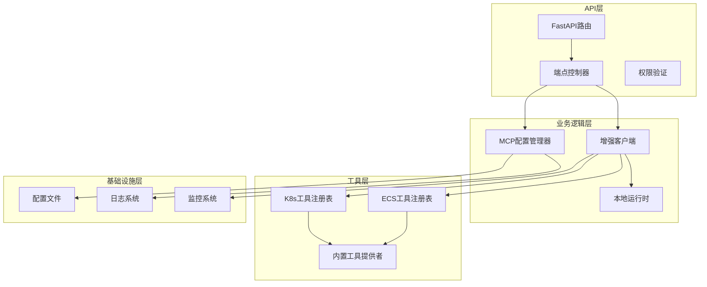

**图表来源**
- [mcp.py:1-628](file://backend/src/api/v2/endpoints/mcp.py#L1-628)
- [enhanced_client.py:1-800](file://backend/src/mcp/enhanced_client.py#L1-800)
- [config_manager.py:1-800](file://backend/src/mcp/config_manager.py#L1-800)

**章节来源**
- [mcp.py:1-628](file://backend/src/api/v2/endpoints/mcp.py#L1-628)
- [enhanced_client.py:1-800](file://backend/src/mcp/enhanced_client.py#L1-800)
- [config_manager.py:1-800](file://backend/src/mcp/config_manager.py#L1-800)

## 核心组件

### MCP工具调用请求模型

MCPToolCallRequest是工具调用的核心请求模型，定义了工具调用所需的完整参数结构：

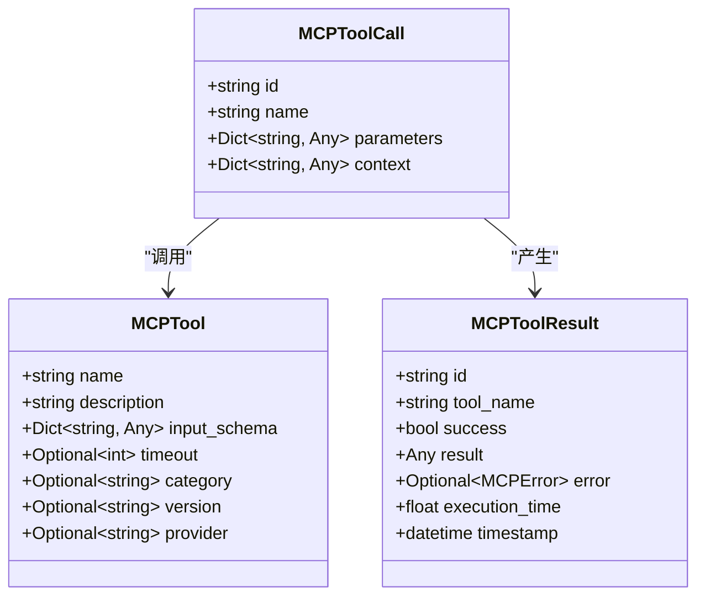

**图表来源**
- [types.py:30-54](file://backend/src/mcp/types.py#L30-54)

### 工具权限控制机制

系统实现了基于工具类型的权限控制机制，区分只读工具和可写工具：

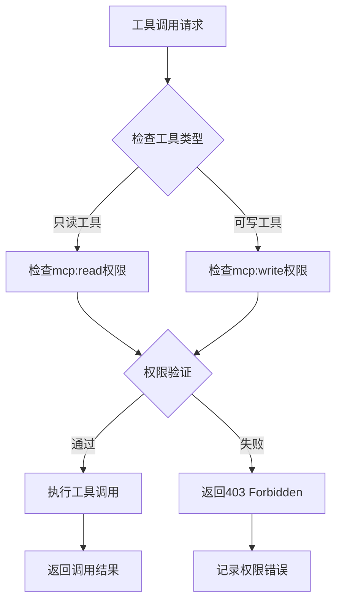

**图表来源**
- [router.py:425-488](file://backend/src/api/v2/router.py#L425-488)

**章节来源**
- [types.py:30-54](file://backend/src/mcp/types.py#L30-54)
- [router.py:425-488](file://backend/src/api/v2/router.py#L425-488)

## 架构概览

MCP工具系统的整体架构采用事件驱动的设计模式，支持多种传输协议和工具类型：

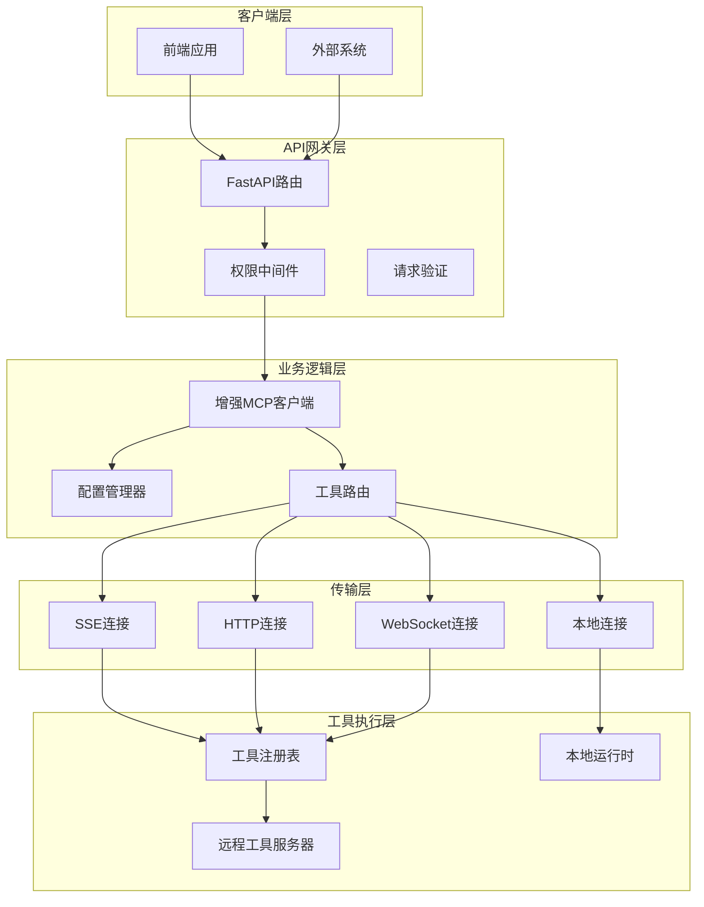

**图表来源**
- [enhanced_client.py:33-57](file://backend/src/mcp/enhanced_client.py#L33-57)
- [config_manager.py:41-800](file://backend/src/mcp/config_manager.py#L41-800)

## 详细组件分析

### 工具列表查询接口

工具列表查询接口提供对系统中所有可用工具的访问能力，支持多种过滤条件和排序选项。

#### 接口规范

- **端点**: `GET /api/v2/tools`
- **权限**: `mcp:read`
- **功能**: 返回系统中所有工具的详细信息

#### 查询参数

| 参数名 | 类型 | 必需 | 描述 |
|--------|------|------|------|
| category | string | 否 | 工具分类过滤 |
| enabled | boolean | 否 | 工具启用状态过滤 |

#### 响应结构

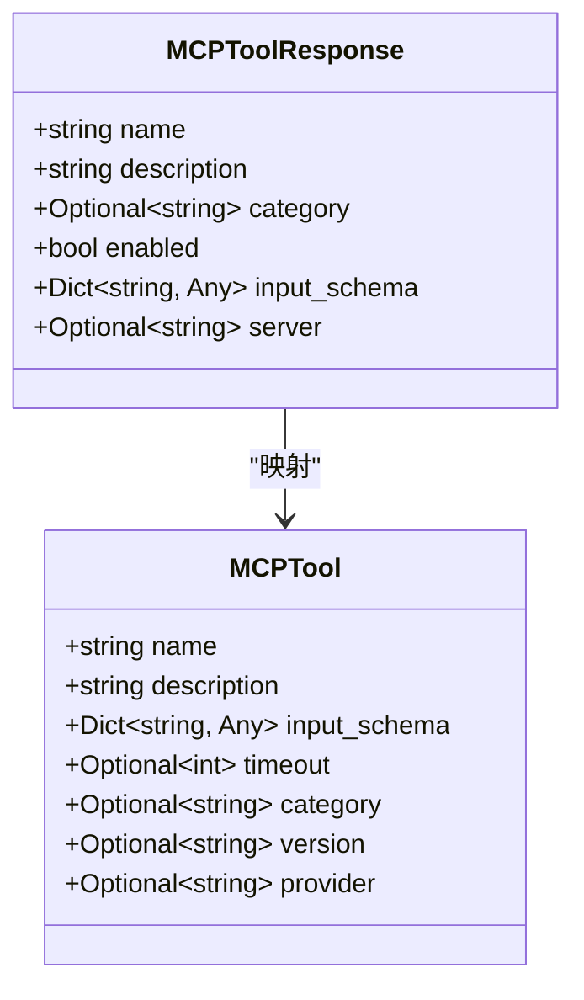

**图表来源**
- [mcp.py:301-334](file://backend/src/api/v2/endpoints/mcp.py#L301-334)

#### 实现流程

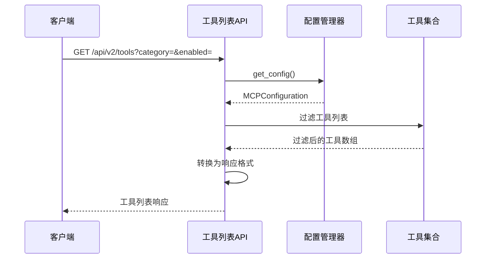

**图表来源**
- [mcp.py:301-334](file://backend/src/api/v2/endpoints/mcp.py#L301-334)

**章节来源**
- [mcp.py:301-334](file://backend/src/api/v2/endpoints/mcp.py#L301-334)

### 工具刷新接口

工具刷新接口负责重新发现和更新系统中的工具列表，确保工具信息的实时性和准确性。

#### 接口规范

- **端点**: `POST /api/v2/tools/refresh`
- **权限**: `mcp:write`
- **功能**: 强制刷新所有MCP服务器中的工具列表

#### 实现机制

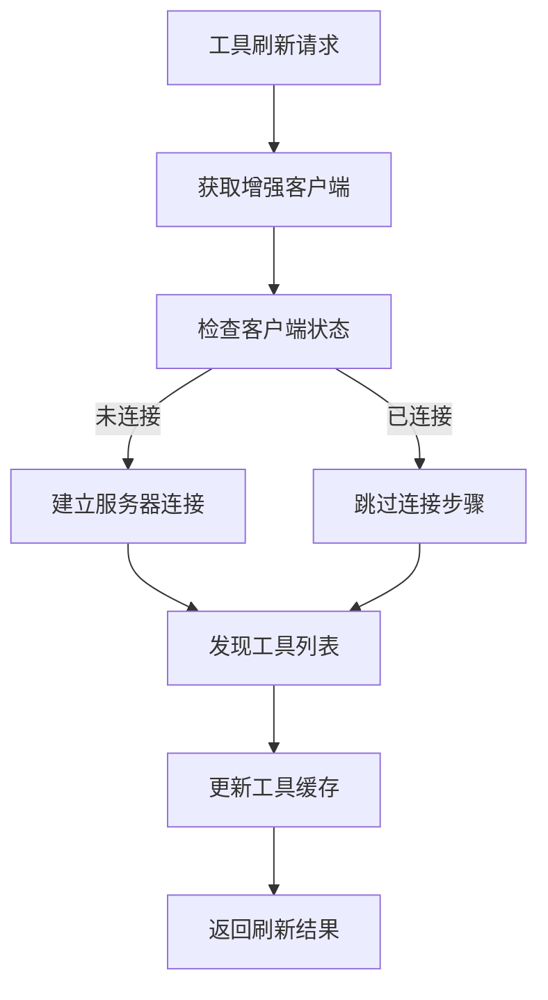

**图表来源**
- [enhanced_client.py:527-568](file://backend/src/mcp/enhanced_client.py#L527-568)

**章节来源**
- [enhanced_client.py:527-568](file://backend/src/mcp/enhanced_client.py#L527-568)

### 工具调用接口

工具调用接口是MCP系统的核心功能，支持对各种类型工具的调用和管理。

#### 接口规范

- **端点**: `POST /api/v2/tools/{tool_name}/call`
- **权限**: 
  - 只读工具: `mcp:read`
  - 可写工具: `mcp:write`
- **功能**: 调用指定的MCP工具并返回执行结果

#### 请求模型

MCPToolCallRequest定义了工具调用的完整请求结构：

| 字段名 | 类型 | 必需 | 描述 |
|--------|------|------|------|
| id | string | 是 | 调用唯一标识符 |
| name | string | 是 | 工具名称 |
| parameters | Dict[string, Any] | 是 | 工具调用参数 |
| context | Dict[string, Any] | 否 | 调用上下文信息 |

#### 调用流程

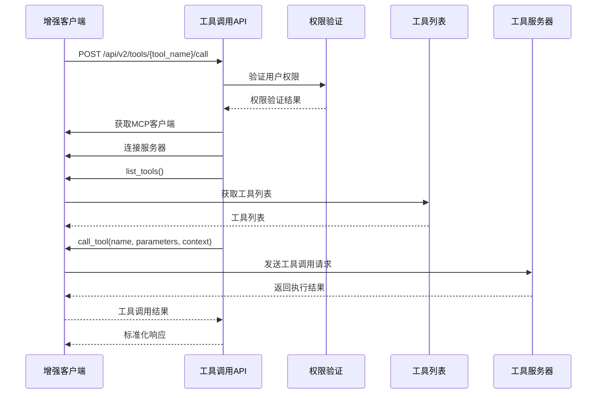

**图表来源**
- [router.py:425-488](file://backend/src/api/v2/router.py#L425-488)

#### 权限控制机制

系统实现了基于工具类型的细粒度权限控制：

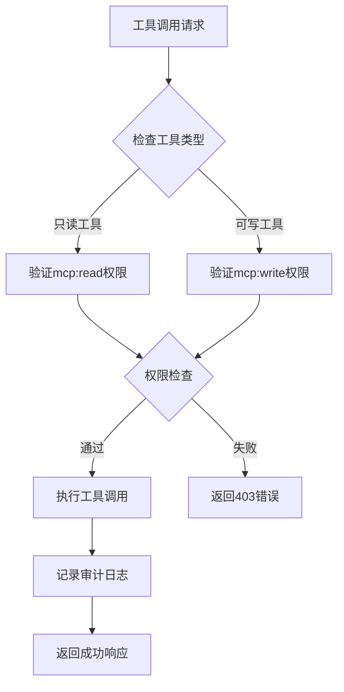

**图表来源**
- [router.py:442-443](file://backend/src/api/v2/router.py#L442-443)

**章节来源**
- [router.py:425-488](file://backend/src/api/v2/router.py#L425-488)

### 工具发现和路由机制

MCP系统实现了智能的工具发现和路由机制，支持多服务器连接和负载均衡策略。

#### 工具发现流程

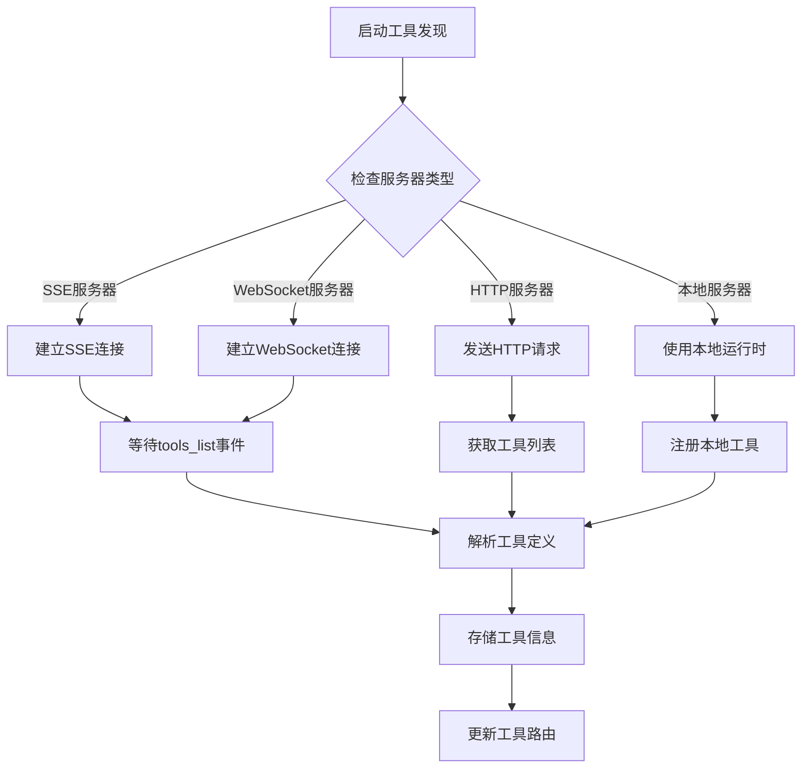

**图表来源**
- [enhanced_client.py:527-568](file://backend/src/mcp/enhanced_client.py#L527-568)

#### 工具路由策略

系统支持多种工具路由策略：

1. **基于名称的路由**: `k8s-*` → kubernetes服务器
2. **基于分类的路由**: `monitoring-*` → 监控专用服务器  
3. **基于权限的路由**: `admin-*` → 管理员专用服务器

**章节来源**
- [enhanced_client.py:527-568](file://backend/src/mcp/enhanced_client.py#L527-568)
- [config_manager.py:41-800](file://backend/src/mcp/config_manager.py#L41-800)

## 依赖关系分析

MCP工具系统的依赖关系呈现清晰的分层结构，各组件之间的耦合度较低，便于维护和扩展。

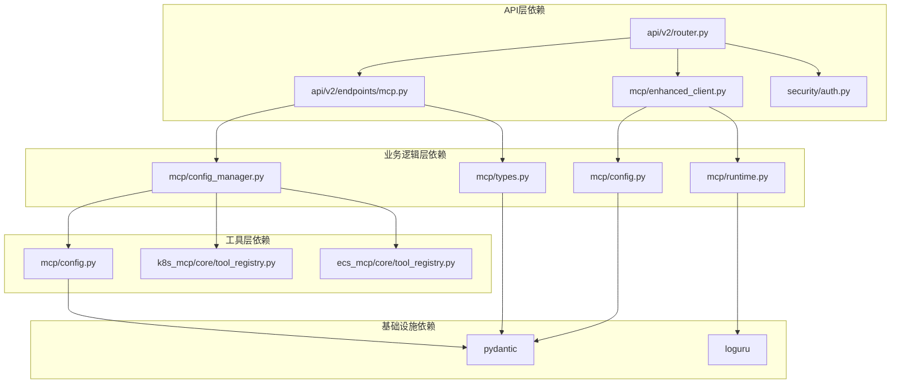

**图表来源**
- [router.py:1-1059](file://backend/src/api/v2/router.py#L1-1059)
- [mcp.py:1-628](file://backend/src/api/v2/endpoints/mcp.py#L1-628)

### 关键依赖组件

| 组件 | 作用 | 版本要求 |
|------|------|----------|
| FastAPI | Web框架 | >=0.100.0 |
| Pydantic | 数据验证 | >=2.0.0 |
| Loguru | 日志记录 | >=0.7.0 |
| Websockets | WebSocket支持 | >=11.0.0 |
| Aiohttp | 异步HTTP客户端 | >=3.8.0 |

**章节来源**
- [router.py:1-1059](file://backend/src/api/v2/router.py#L1-1059)
- [mcp.py:1-628](file://backend/src/api/v2/endpoints/mcp.py#L1-628)

## 性能考虑

MCP工具系统在设计时充分考虑了性能优化，采用了多种技术和策略来提升系统的响应速度和吞吐量。

### 并发处理机制

系统支持高并发的工具调用，通过以下机制保证性能：

1. **异步I/O处理**: 使用async/await模式处理所有网络请求
2. **连接池管理**: 复用HTTP和WebSocket连接，减少连接开销
3. **工具缓存**: 缓存工具定义和服务器状态信息
4. **批量操作**: 支持批量工具发现和更新操作

### 负载均衡策略

系统实现了智能的负载均衡策略：

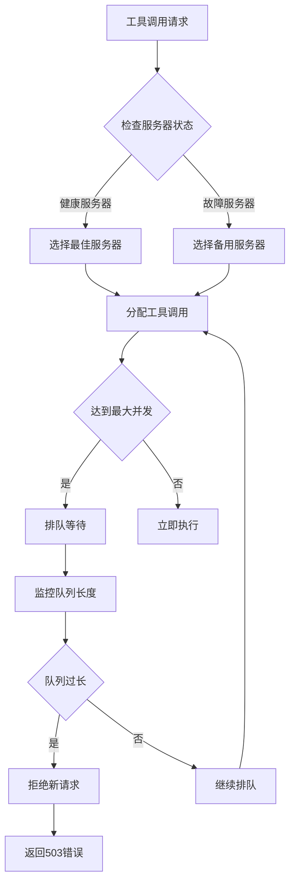

### 性能监控指标

系统收集以下关键性能指标：

| 指标类型 | 指标名称 | 描述 |
|----------|----------|------|
| 基础指标 | 响应时间 | 工具调用的平均响应时间 |
| 基础指标 | 吞吐量 | 每秒处理的工具调用数量 |
| 基础指标 | 错误率 | 工具调用失败的比例 |
| 连接指标 | 连接数 | 当前活跃的服务器连接数 |
| 连接指标 | 连接成功率 | 服务器连接建立的成功率 |
| 工具指标 | 工具执行时间 | 单个工具的平均执行时间 |
| 工具指标 | 工具成功率 | 工具执行成功的比例 |

## 故障排除指南

### 常见问题诊断

#### 工具调用失败

**症状**: 工具调用返回502错误或超时

**诊断步骤**:
1. 检查服务器连接状态
2. 验证工具参数格式
3. 查看服务器日志
4. 检查网络连接

**解决方案**:
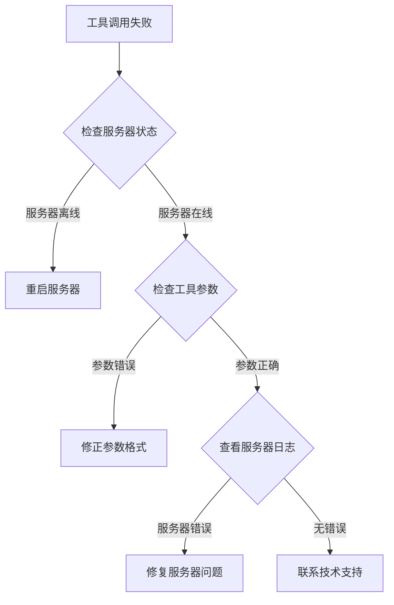

#### 权限访问问题

**症状**: 工具调用返回403错误

**诊断步骤**:
1. 确认用户权限级别
2. 检查工具类型（只读vs可写）
3. 验证工具路由配置
4. 查看权限策略

**解决方案**:
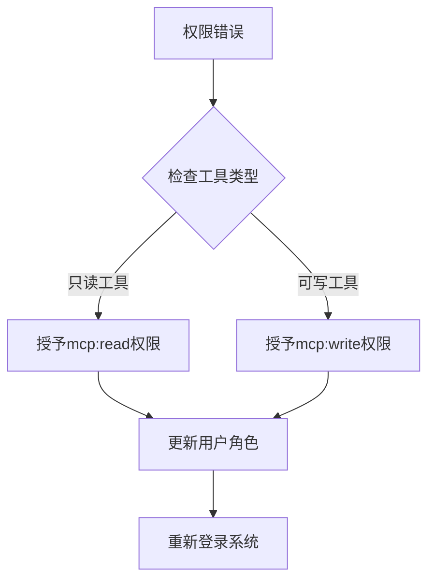

#### 性能问题

**症状**: 工具调用响应缓慢

**诊断步骤**:
1. 检查服务器负载
2. 分析工具执行时间
3. 监控连接池使用情况
4. 查看系统资源使用

**优化方案**:
1. 增加服务器实例数量
2. 优化工具执行算法
3. 调整并发限制
4. 实施缓存策略

**章节来源**
- [router.py:482-487](file://backend/src/api/v2/router.py#L482-487)
- [enhanced_client.py:89-94](file://backend/src/mcp/enhanced_client.py#L89-94)

## 结论

MCP工具系统是一个功能完整、架构清晰的现代化工具管理平台。系统通过合理的分层设计、完善的权限控制和高效的性能优化，为用户提供了一个稳定可靠的工具调用环境。

### 主要优势

1. **架构设计**: 清晰的分层架构，良好的模块化设计
2. **功能完整性**: 支持多种工具类型和传输协议
3. **安全性**: 细粒度的权限控制和审计机制
4. **性能优化**: 异步处理、连接复用、缓存策略
5. **可扩展性**: 模块化设计，易于添加新功能

### 未来发展方向

1. **监控增强**: 集成更全面的性能监控和告警系统
2. **自动化**: 实现工具的自动发现和配置管理
3. **安全性**: 加强数据加密和访问控制
4. **用户体验**: 优化前端界面和交互体验
5. **集成能力**: 提供更多第三方系统集成选项

该系统为MCP工具的管理和使用提供了坚实的技术基础，能够满足企业级应用的各种需求。