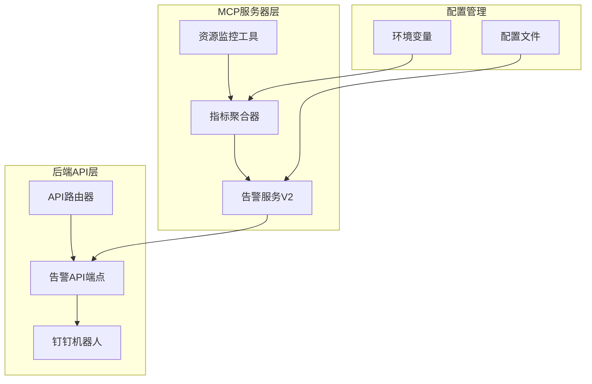
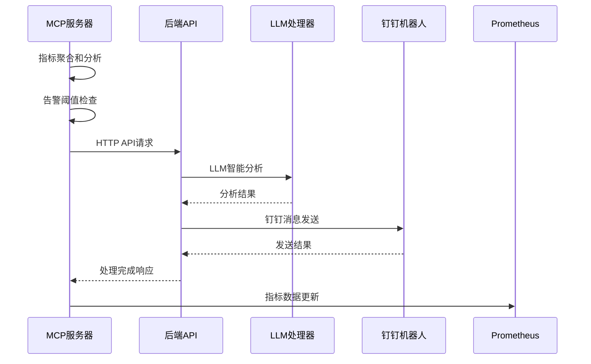
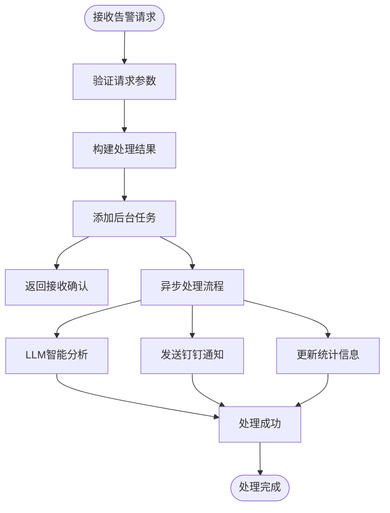
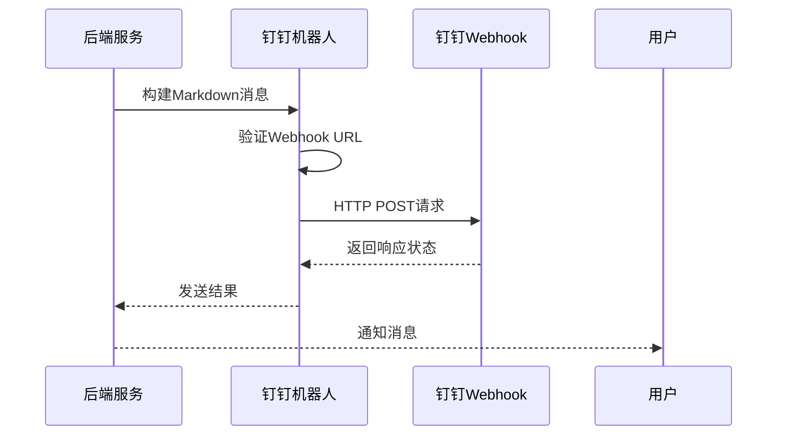
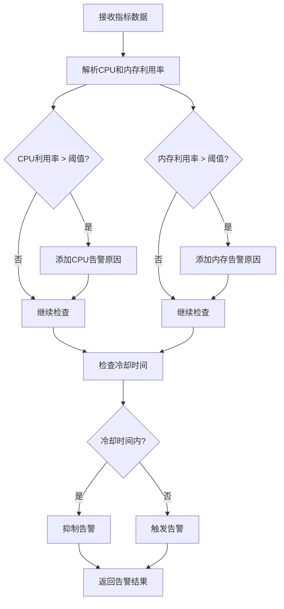
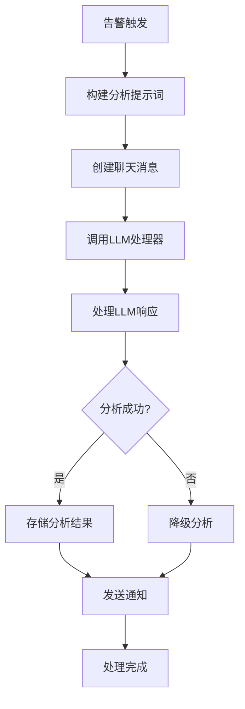
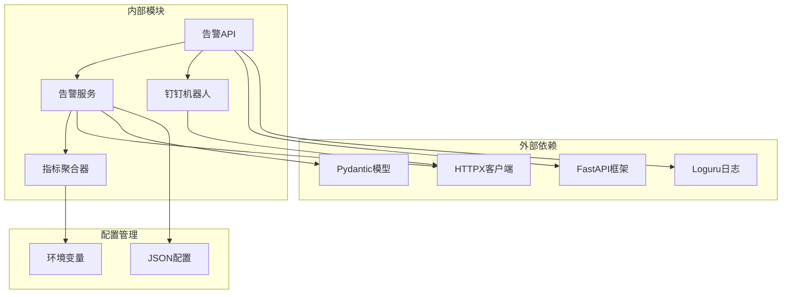

# 告警管理接口

<cite>
**本文档引用的文件**
- [alerts.py](file://backend/src/api/v2/endpoints/alerts.py)
- [router.py](file://backend/src/api/v2/router.py)
- [bot.py](file://backend/src/dingtalk/bot.py)
- [resource_alert_service_v2.py](file://backend/src/k8s_mcp/core/resource_alert_service_v2.py)
- [resource_alert_service.py](file://backend/src/k8s_mcp/core/resource_alert_service.py)
- [metrics_aggregator.py](file://backend/src/k8s_mcp/core/metrics_aggregator.py)
- [metrics_collector.py](file://backend/src/k8s_mcp/core/metrics_collector.py)
- [k8s_resource_monitor.py](file://backend/src/k8s_mcp/tools/k8s_resource_monitor.py)
- [resource-alert-configuration-v2.md](file://archived/k8s-mcp-standalone/docs/resource-alert-configuration-v2.md)
- [mcp_config.example.json](file://config/mcp_config.example.json)
</cite>

## 目录
1. [简介](#简介)
2. [项目结构](#项目结构)
3. [核心组件](#核心组件)
4. [架构概览](#架构概览)
5. [详细组件分析](#详细组件分析)
6. [依赖关系分析](#依赖关系分析)
7. [性能考虑](#性能考虑)
8. [故障排查指南](#故障排查指南)
9. [结论](#结论)

## 简介

本文档详细说明了基于K8s MCP服务器的告警管理系统API接口。该系统实现了资源告警的自动化检测、LLM智能分析和钉钉通知发送的完整流程。系统采用前后端分离架构，MCP服务器负责资源监控和告警检测，后端API服务负责业务处理和通知发送。

## 项目结构

告警管理系统主要分布在以下模块中：

**图表来源**
- [alerts.py:1-692](file://backend/src/api/v2/endpoints/alerts.py#L1-L692)
- [router.py:1-800](file://backend/src/api/v2/router.py#L1-L800)
- [resource_alert_service_v2.py:1-352](file://backend/src/k8s_mcp/core/resource_alert_service_v2.py#L1-L352)

**章节来源**
- [alerts.py:1-692](file://backend/src/api/v2/endpoints/alerts.py#L1-L692)
- [router.py:1-800](file://backend/src/api/v2/router.py#L1-L800)

## 核心组件

### 告警API端点

告警API提供了完整的RESTful接口，包括资源告警处理、统计查询和测试功能：

- **POST /api/v2/alerts/resource**: 处理资源告警请求
- **GET /api/v2/alerts/stats**: 获取告警处理统计信息  
- **POST /api/v2/alerts/test**: 测试告警处理功能

### 钉钉通知服务

钉钉机器人集成提供了多种消息发送方式：

- **Markdown消息**: 支持富文本格式的通知
- **主动消息**: 支持@用户和@全体成员
- **签名验证**: 支持钉钉机器人安全验证

### 资源告警服务

实现了两套告警处理机制：

- **V1版本**: 集成LLM分析和钉钉发送的完整告警服务
- **V2版本**: 专注告警检测，通过HTTP API与后端通信

**章节来源**
- [alerts.py:92-692](file://backend/src/api/v2/endpoints/alerts.py#L92-L692)
- [bot.py:412-472](file://backend/src/dingtalk/bot.py#L412-L472)
- [resource_alert_service_v2.py:67-352](file://backend/src/k8s_mcp/core/resource_alert_service_v2.py#L67-L352)

## 架构概览

系统采用分层架构设计，实现了职责分离和高可用性：

**图表来源**
- [metrics_aggregator.py:387-453](file://backend/src/k8s_mcp/core/metrics_aggregator.py#L387-L453)
- [alerts.py:159-184](file://backend/src/api/v2/endpoints/alerts.py#L159-L184)

### 数据流设计

系统实现了标准化的数据流处理：

1. **指标采集**: 从Prometheus获取K8s资源使用率数据
2. **阈值检测**: 比较CPU和内存利用率与配置阈值
3. **告警触发**: 检查冷却时间，防止重复告警
4. **异步处理**: 通过后台任务处理LLM分析和通知发送
5. **状态跟踪**: 记录告警历史和处理统计

**章节来源**
- [metrics_aggregator.py:167-211](file://backend/src/k8s_mcp/core/metrics_aggregator.py#L167-L211)
- [resource_alert_service_v2.py:102-182](file://backend/src/k8s_mcp/core/resource_alert_service_v2.py#L102-L182)

## 详细组件分析

### 资源告警API端点

#### 资源告警处理接口

**图表来源**
- [alerts.py:92-157](file://backend/src/api/v2/endpoints/alerts.py#L92-L157)
- [alerts.py:159-184](file://backend/src/api/v2/endpoints/alerts.py#L159-L184)

#### 告警数据模型

告警系统使用标准化的数据模型：

| 字段名 | 类型 | 必填 | 描述 |
|--------|------|------|------|
| resource_id | string | 是 | 资源标识符，格式: deployment/namespace/name |
| metrics | object | 是 | 资源指标数据 |
| timestamp | string | 是 | 告警时间戳 |
| source | string | 否 | 告警来源，默认: k8s-mcp-server |
| alert_reasons | array | 否 | 告警原因列表 |
| thresholds | object | 否 | 告警阈值配置 |
| current_utilization | object | 否 | 当前利用率数据 |

**章节来源**
- [alerts.py:57-76](file://backend/src/api/v2/endpoints/alerts.py#L57-L76)

### 钉钉通知机制

#### 消息发送流程

**图表来源**
- [bot.py:412-472](file://backend/src/dingtalk/bot.py#L412-L472)

#### 消息格式规范

系统支持多种消息格式：

1. **Markdown格式**: 支持标题、列表、表格等富文本格式
2. **文本格式**: 简单的纯文本消息
3. **分片发送**: 大消息自动分片，避免钉钉限制

**章节来源**
- [bot.py:23-29](file://backend/src/dingtalk/bot.py#L23-L29)
- [bot.py:412-472](file://backend/src/dingtalk/bot.py#L412-L472)

### 告警检测机制

#### 阈值检查算法

**图表来源**
- [resource_alert_service_v2.py:183-206](file://backend/src/k8s_mcp/core/resource_alert_service_v2.py#L183-L206)
- [resource_alert_service_v2.py:208-242](file://backend/src/k8s_mcp/core/resource_alert_service_v2.py#L208-L242)

#### 冷却机制

系统实现了智能的告警冷却机制：

- **独立冷却**: 每个资源ID独立的冷却计时器
- **可配置冷却**: 支持自定义冷却时间（默认5分钟）
- **内存缓存**: 使用字典缓存最后告警时间

**章节来源**
- [resource_alert_service_v2.py:208-242](file://backend/src/k8s_mcp/core/resource_alert_service_v2.py#L208-L242)

### LLM智能分析

#### 分析流程

**图表来源**
- [alerts.py:186-270](file://backend/src/api/v2/endpoints/alerts.py#L186-L270)

#### 提示词构建

LLM分析使用专门的提示词模板：

- **系统角色**: Kubernetes运维专家
- **分析维度**: 根因分析、影响评估、风险等级、优化建议
- **输出格式**: 结构化的Markdown报告
- **约束条件**: 控制回复长度，使用专业术语

**章节来源**
- [alerts.py:214-270](file://backend/src/api/v2/endpoints/alerts.py#L214-L270)

## 依赖关系分析

### 组件耦合度

**图表来源**
- [router.py:45-549](file://backend/src/api/v2/router.py#L45-L549)
- [alerts.py:12-18](file://backend/src/api/v2/endpoints/alerts.py#L12-L18)

### 关键依赖关系

1. **权限控制**: 所有告警相关接口都需要`alerts:read`和`alerts:write`权限
2. **容器注入**: 通过运行时容器获取LLM处理器和钉钉机器人实例
3. **异步处理**: 使用BackgroundTasks实现非阻塞的异步处理
4. **配置管理**: 支持环境变量和JSON配置文件两种配置方式

**章节来源**
- [router.py:45-549](file://backend/src/api/v2/router.py#L45-L549)
- [alerts.py:12-54](file://backend/src/api/v2/endpoints/alerts.py#L12-L54)

## 性能考虑

### 异步处理优化

系统采用了多层次的异步处理机制：

- **后台任务**: 使用BackgroundTasks处理LLM分析和通知发送
- **异步HTTP**: 使用HTTPX异步客户端处理后端API通信
- **并发控制**: 通过信号量控制同时执行的任务数量
- **内存管理**: 合理的缓存策略和内存清理机制

### 监控指标

系统提供了全面的性能监控：

- **处理时间**: 记录API请求处理时间和LLM分析耗时
- **成功率统计**: 统计LLM分析和钉钉发送的成功率
- **错误率监控**: 监控各类错误的发生频率
- **资源使用**: 监控CPU、内存等系统资源使用情况

**章节来源**
- [metrics_collector.py:88-446](file://backend/src/k8s_mcp/core/metrics_collector.py#L88-L446)
- [alerts.py:78-89](file://backend/src/api/v2/endpoints/alerts.py#L78-L89)

## 故障排查指南

### 常见问题诊断

#### 告警未触发

1. **检查阈值配置**: 确认MEMORY_ALERT_THRESHOLD和CPU_ALERT_THRESHOLD设置合理
2. **验证指标数据**: 确认Prometheus能够正常获取指标数据
3. **检查冷却时间**: 验证ALERT_COOLDOWN_SECONDS配置是否过长
4. **查看日志**: 检查MCP服务器日志中的告警检测信息

#### 通知发送失败

1. **验证Webhook URL**: 确认DINGTALK_WEBHOOK_URL配置正确
2. **检查网络连接**: 验证后端服务能够访问钉钉API
3. **查看签名配置**: 确认DINGTALK_SECRET配置正确
4. **监控重试机制**: 查看钉钉机器人的重试统计

#### LLM分析异常

1. **检查模型配置**: 验证LLM提供商配置和API密钥
2. **查看超时设置**: 确认LLM_ANALYSIS_TIMEOUT配置合理
3. **监控错误日志**: 分析LLM调用失败的具体原因
4. **降级处理**: 系统会自动使用降级分析方案

**章节来源**
- [resource-alert-configuration-v2.md:239-291](file://archived/k8s-mcp-standalone/docs/resource-alert-configuration-v2.md#L239-L291)

### 性能优化建议

1. **合理设置阈值**: 根据业务需求调整CPU和内存告警阈值
2. **优化冷却时间**: 在告警频率和准确性之间找到平衡点
3. **配置重试参数**: 根据网络环境调整API重试次数和延迟
4. **监控资源使用**: 定期检查系统资源使用情况，避免性能瓶颈

## 结论

告警管理系统实现了完整的资源监控、智能分析和通知发送功能。通过前后端分离的设计，系统具有良好的可扩展性和维护性。关键特性包括：

- **自动化告警**: 基于阈值检测的自动化告警机制
- **智能分析**: LLM驱动的智能分析和优化建议
- **多渠道通知**: 支持钉钉等多种通知渠道
- **高可用性**: 异步处理和错误重试机制确保系统稳定运行
- **可观测性**: 全面的监控指标和日志记录

系统为Kubernetes集群提供了可靠的资源告警解决方案，能够有效提升运维效率和系统稳定性。