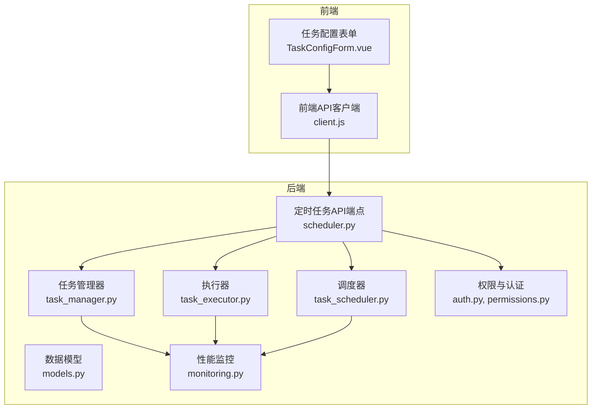
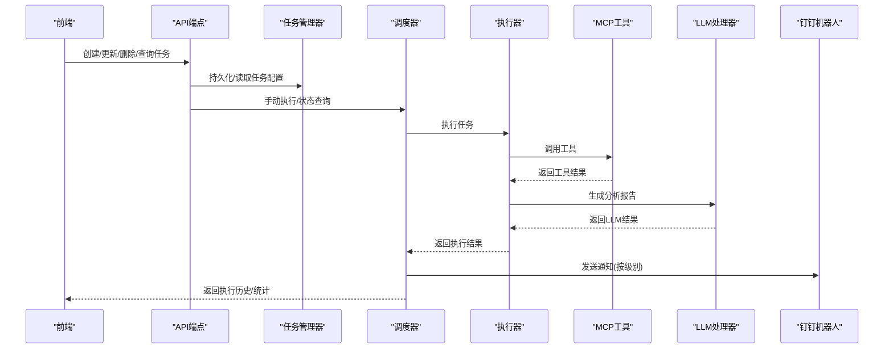
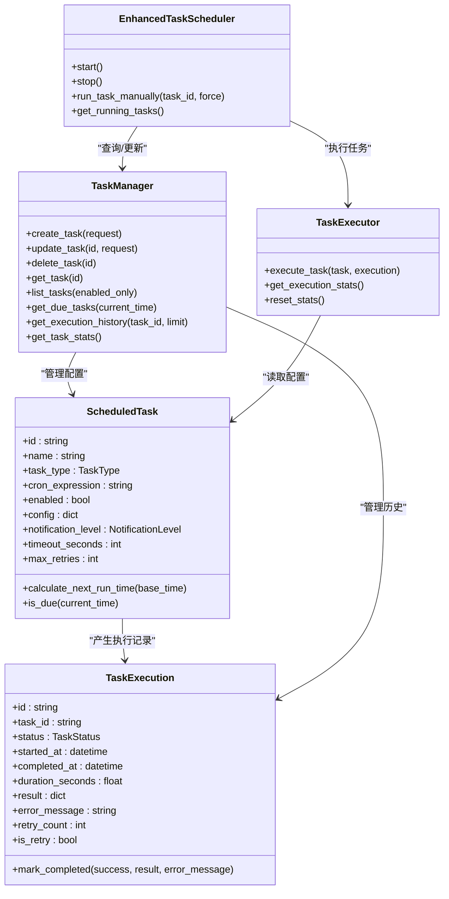

# 定时任务接口

<cite>
**本文引用的文件**
- [scheduler.py](file://backend/src/api/v2/endpoints/scheduler.py)
- [models.py](file://backend/src/scheduler/models.py)
- [task_manager.py](file://backend/src/scheduler/task_manager.py)
- [task_scheduler.py](file://backend/src/scheduler/task_scheduler.py)
- [task_executor.py](file://backend/src/scheduler/task_executor.py)
- [auth.py](file://backend/src/security/auth.py)
- [permissions.py](file://backend/src/security/permissions.py)
- [client.js](file://frontend-v2/src/api/client.js)
- [TaskConfigForm.vue](file://frontend-v2/src/components/TaskConfigForm.vue)
- [scheduled_tasks.example.json](file://config/scheduled_tasks.example.json)
- [monitoring.py](file://backend/src/utils/monitoring.py)
</cite>

## 目录
1. [简介](#简介)
2. [项目结构](#项目结构)
3. [核心组件](#核心组件)
4. [架构总览](#架构总览)
5. [详细组件分析](#详细组件分析)
6. [依赖关系分析](#依赖关系分析)
7. [性能考量](#性能考量)
8. [故障排查指南](#故障排查指南)
9. [结论](#结论)
10. [附录](#附录)

## 简介
本文件为定时任务系统的完整API接口文档，涵盖任务的创建、查询、更新、删除、手动执行、历史查询与统计、Cron表达式校验、通知与告警、权限控制、配置模板与示例、以及调度器性能监控与资源管理。系统采用FastAPI构建后端API，结合前端Vue组件与Axios客户端，提供可视化的任务配置界面与实时状态展示。

## 项目结构
定时任务系统位于后端的scheduler子模块，前端通过API客户端封装与后端交互。核心文件组织如下：
- 后端API端点：/backend/src/api/v2/endpoints/scheduler.py
- 数据模型与枚举：/backend/src/scheduler/models.py
- 任务配置管理：/backend/src/scheduler/task_manager.py
- 调度器：/backend/src/scheduler/task_scheduler.py
- 任务执行器：/backend/src/scheduler/task_executor.py
- 权限与认证：/backend/src/security/auth.py, /backend/src/security/permissions.py
- 前端API客户端：/frontend-v2/src/api/client.js
- 前端配置表单：/frontend-v2/src/components/TaskConfigForm.vue
- 示例配置：/config/scheduled_tasks.example.json
- 性能监控：/backend/src/utils/monitoring.py

图表来源
- [scheduler.py:1-661](file://backend/src/api/v2/endpoints/scheduler.py#L1-L661)
- [models.py:1-444](file://backend/src/scheduler/models.py#L1-L444)
- [task_manager.py:1-657](file://backend/src/scheduler/task_manager.py#L1-L657)
- [task_scheduler.py:1-487](file://backend/src/scheduler/task_scheduler.py#L1-L487)
- [task_executor.py:1-736](file://backend/src/scheduler/task_executor.py#L1-L736)
- [auth.py:1-182](file://backend/src/security/auth.py#L1-L182)
- [permissions.py:1-95](file://backend/src/security/permissions.py#L1-L95)
- [client.js:1-865](file://frontend-v2/src/api/client.js#L1-L865)
- [TaskConfigForm.vue:1-746](file://frontend-v2/src/components/TaskConfigForm.vue#L1-L746)
- [monitoring.py:1-396](file://backend/src/utils/monitoring.py#L1-L396)

章节来源
- [scheduler.py:1-661](file://backend/src/api/v2/endpoints/scheduler.py#L1-L661)
- [models.py:1-444](file://backend/src/scheduler/models.py#L1-L444)
- [task_manager.py:1-657](file://backend/src/scheduler/task_manager.py#L1-L657)
- [task_scheduler.py:1-487](file://backend/src/scheduler/task_scheduler.py#L1-L487)
- [task_executor.py:1-736](file://backend/src/scheduler/task_executor.py#L1-L736)
- [auth.py:1-182](file://backend/src/security/auth.py#L1-L182)
- [permissions.py:1-95](file://backend/src/security/permissions.py#L1-L95)
- [client.js:1-865](file://frontend-v2/src/api/client.js#L1-L865)
- [TaskConfigForm.vue:1-746](file://frontend-v2/src/components/TaskConfigForm.vue#L1-L746)
- [monitoring.py:1-396](file://backend/src/utils/monitoring.py#L1-L396)

## 核心组件
- API端点层：提供RESTful接口，负责请求路由、参数校验、权限控制与响应封装。
- 数据模型层：定义任务、执行记录、状态枚举、请求/响应模型及默认配置模板。
- 任务管理器：负责任务配置的持久化、热重载、备份、执行历史管理与统计。
- 调度器：基于异步循环扫描到期任务，控制并发与重试，触发通知。
- 任务执行器：根据任务类型调用MCP工具与LLM，生成报告并记录结果。
- 权限与认证：基于JWT的Bearer Token认证与细粒度权限控制。
- 前端客户端：封装Axios请求、错误处理、批量操作与格式化工具。
- 性能监控：采集请求指标、系统资源与执行统计，支持可视化与告警。

章节来源
- [scheduler.py:99-661](file://backend/src/api/v2/endpoints/scheduler.py#L99-L661)
- [models.py:14-444](file://backend/src/scheduler/models.py#L14-L444)
- [task_manager.py:133-657](file://backend/src/scheduler/task_manager.py#L133-L657)
- [task_scheduler.py:23-487](file://backend/src/scheduler/task_scheduler.py#L23-L487)
- [task_executor.py:20-736](file://backend/src/scheduler/task_executor.py#L20-L736)
- [auth.py:172-182](file://backend/src/security/auth.py#L172-L182)
- [permissions.py:7-95](file://backend/src/security/permissions.py#L7-L95)
- [client.js:334-413](file://frontend-v2/src/api/client.js#L334-L413)
- [monitoring.py:51-396](file://backend/src/utils/monitoring.py#L51-L396)

## 架构总览
定时任务系统采用“API端点—调度器—执行器—工具链”的分层架构。API端点负责对外暴露REST接口；调度器通过异步循环扫描到期任务并并发执行；执行器根据任务类型调用MCP工具与LLM生成报告；任务管理器负责配置持久化与历史归档；权限系统保障接口访问安全；前端通过API客户端与表单组件提供可视化配置与状态展示。

图表来源
- [scheduler.py:134-374](file://backend/src/api/v2/endpoints/scheduler.py#L134-L374)
- [task_manager.py:338-453](file://backend/src/scheduler/task_manager.py#L338-L453)
- [task_scheduler.py:158-283](file://backend/src/scheduler/task_scheduler.py#L158-L283)
- [task_executor.py:47-317](file://backend/src/scheduler/task_executor.py#L47-L317)
- [monitoring.py:51-144](file://backend/src/utils/monitoring.py#L51-L144)

## 详细组件分析

### API端点与权限控制
- 权限依赖：
  - 读取任务：scheduler:read
  - 写入任务：scheduler:write
  - 执行任务：scheduler:run
- 授权流程：Bearer Token解码，用户信息注入到请求上下文，按权限判断放行或拒绝。

章节来源
- [scheduler.py:35-41](file://backend/src/api/v2/endpoints/scheduler.py#L35-L41)
- [auth.py:172-182](file://backend/src/security/auth.py#L172-L182)
- [permissions.py:7-28](file://backend/src/security/permissions.py#L7-L28)

### 数据模型与任务类型
- 任务状态：pending、running、success、failed、cancelled
- 任务类型：cluster_check、resource_analysis、health_monitor、custom
- 通知级别：none、error_only、all
- 关键字段：任务ID、名称、描述、类型、Cron表达式、时区、启用状态、配置、通知级别、超时、最大重试、重试延迟、时间戳、下次/上次执行时间、最后执行记录ID
- 执行记录：包含状态、开始/结束时间、耗时、结果、错误信息、重试次数、是否重试、通知状态等

章节来源
- [models.py:14-135](file://backend/src/scheduler/models.py#L14-L135)
- [models.py:137-192](file://backend/src/scheduler/models.py#L137-L192)

### 任务管理器（配置持久化与热重载）
- 功能：
  - 任务CRUD：创建、更新、删除、查询、按类型过滤、到期任务筛选
  - 配置持久化：JSON文件存储，自动备份与清理
  - 热重载：基于watchdog监控配置文件变更，防抖重载
  - 执行历史：内存缓存+异步落盘，按月分目录归档
  - 统计：任务总数、启用数、类型分布、最后更新时间
  - 维护：清理旧备份与历史
- 并发与可靠性：异步保存、防抖、异常捕获与日志记录

章节来源
- [task_manager.py:133-657](file://backend/src/scheduler/task_manager.py#L133-L657)

### 调度器（并发执行与重试）
- 核心逻辑：
  - 每分钟扫描到期任务，创建执行协程
  - 信号量控制并发（默认最多5个）
  - 执行成功/失败后更新任务状态与下次执行时间
  - 重试机制：按最大重试次数与延迟时间安排重试
  - 通知：按通知级别向钉钉群发送Markdown通知
- 运行状态：运行中任务列表、调度器状态查询

章节来源
- [task_scheduler.py:23-487](file://backend/src/scheduler/task_scheduler.py#L23-L487)

### 任务执行器（类型化执行与报告生成）
- 类型化执行：
  - 集群巡检：调用现有巡检逻辑，返回分析ID、Markdown与工具负载
  - 资源分析：调用Prometheus工具，生成LLM分析报告
  - 健康监控：检查服务/部署/Pod/节点，汇总问题并生成报告
  - 自定义任务：支持多工具调用与可选LLM分析
- 统计与重置：执行次数、成功/失败次数、成功率、平均耗时、最近执行时间

章节来源
- [task_executor.py:20-736](file://backend/src/scheduler/task_executor.py#L20-L736)

### Cron表达式与模板
- Cron校验：使用croniter验证表达式合法性，返回5次未来执行时间与人类可读描述
- 常用模板：每分钟、每5/15/30分钟、每小时、每2/6/12小时、每日午夜/9点、每周日、每月1号等
- 前端：Cron编辑器与格式化工具

章节来源
- [scheduler.py:492-531](file://backend/src/api/v2/endpoints/scheduler.py#L492-L531)
- [models.py:395-444](file://backend/src/scheduler/models.py#L395-L444)
- [client.js:594-609](file://frontend-v2/src/api/client.js#L594-L609)

### 通知与告警（钉钉机器人）
- 通知触发条件：按通知级别（none/error/all）决定是否发送
- 通知内容：任务名称、类型、执行时间、耗时、重试次数、错误摘要或结果摘要
- 通知渠道：默认钉钉群Webhook，需在运行时容器中配置

章节来源
- [task_scheduler.py:285-391](file://backend/src/scheduler/task_scheduler.py#L285-L391)

### 前端API与配置表单
- API封装：统一响应解包、错误处理、批量操作、格式化与验证工具
- 配置表单：支持四种任务类型，动态生成配置面板，Cron表达式校验与模板选择
- 常量与默认值：分页、超时、重试、常用Cron表达式

章节来源
- [client.js:334-413](file://frontend-v2/src/api/client.js#L334-L413)
- [TaskConfigForm.vue:1-746](file://frontend-v2/src/components/TaskConfigForm.vue#L1-L746)

## 依赖关系分析

图表来源
- [models.py:38-192](file://backend/src/scheduler/models.py#L38-L192)
- [task_manager.py:338-498](file://backend/src/scheduler/task_manager.py#L338-L498)
- [task_scheduler.py:23-487](file://backend/src/scheduler/task_scheduler.py#L23-L487)
- [task_executor.py:20-736](file://backend/src/scheduler/task_executor.py#L20-L736)

章节来源
- [models.py:1-444](file://backend/src/scheduler/models.py#L1-L444)
- [task_manager.py:1-657](file://backend/src/scheduler/task_manager.py#L1-L657)
- [task_scheduler.py:1-487](file://backend/src/scheduler/task_scheduler.py#L1-L487)
- [task_executor.py:1-736](file://backend/src/scheduler/task_executor.py#L1-L736)

## 性能考量
- 并发控制：调度器使用信号量限制同时执行的任务数，避免资源争用。
- 异步执行：基于asyncio的调度循环与任务执行，减少阻塞。
- 执行统计：执行器维护最近100次耗时，计算成功率与平均耗时，便于容量规划。
- 系统监控：性能监控器采集CPU/内存/磁盘/活跃连接等指标，支持告警与可视化。
- IO优化：执行历史按月分目录落盘，限制内存中保留数量，降低IO压力。

章节来源
- [task_scheduler.py:53-56](file://backend/src/scheduler/task_scheduler.py#L53-L56)
- [task_executor.py:680-709](file://backend/src/scheduler/task_executor.py#L680-L709)
- [monitoring.py:51-144](file://backend/src/utils/monitoring.py#L51-L144)

## 故障排查指南
- 权限错误：检查Bearer Token与所需权限（scheduler:read/write/run），确认用户角色包含对应权限。
- Cron表达式错误：使用校验接口验证表达式，参考常用模板与人类可读描述。
- 任务未执行：检查任务启用状态、下次执行时间、调度器运行状态与并发上限。
- 执行失败：查看执行历史中的错误信息与重试次数，确认MCP工具可用性与参数正确性。
- 通知失败：检查钉钉机器人Webhook配置与通知级别设置。
- 性能问题：关注系统监控指标与执行统计，调整并发数与超时时间。

章节来源
- [auth.py:172-182](file://backend/src/security/auth.py#L172-L182)
- [permissions.py:7-28](file://backend/src/security/permissions.py#L7-L28)
- [scheduler.py:492-531](file://backend/src/api/v2/endpoints/scheduler.py#L492-L531)
- [task_scheduler.py:285-391](file://backend/src/scheduler/task_scheduler.py#L285-L391)
- [monitoring.py:207-242](file://backend/src/utils/monitoring.py#L207-L242)

## 结论
定时任务系统提供了完善的任务生命周期管理、灵活的Cron调度、强大的类型化执行能力与可视化配置界面。通过细粒度权限控制、通知与告警、性能监控与资源管理，系统在保证安全性的同时具备良好的可观测性与可维护性。建议在生产环境中合理配置并发数、超时与重试策略，并定期清理历史与备份以维持系统性能。

## 附录

### API接口清单与示例

- 获取任务列表
  - 方法：GET
  - 路径：/v2/scheduler/tasks
  - 查询参数：page、page_size、enabled_only、task_type
  - 权限：scheduler:read
  - 示例：[scheduler.py:99-129](file://backend/src/api/v2/endpoints/scheduler.py#L99-L129)

- 创建任务
  - 方法：POST
  - 路径：/v2/scheduler/tasks
  - 请求体：TaskCreateRequest
  - 权限：scheduler:write
  - 示例：[scheduler.py:134-174](file://backend/src/api/v2/endpoints/scheduler.py#L134-L174)

- 获取单个任务
  - 方法：GET
  - 路径：/v2/scheduler/tasks/{task_id}
  - 权限：scheduler:read
  - 示例：[scheduler.py:175-208](file://backend/src/api/v2/endpoints/scheduler.py#L175-L208)

- 更新任务
  - 方法：PUT
  - 路径：/v2/scheduler/tasks/{task_id}
  - 请求体：TaskUpdateRequest
  - 权限：scheduler:write
  - 示例：[scheduler.py:209-253](file://backend/src/api/v2/endpoints/scheduler.py#L209-L253)

- 删除任务
  - 方法：DELETE
  - 路径：/v2/scheduler/tasks/{task_id}
  - 权限：scheduler:write
  - 示例：[scheduler.py:254-279](file://backend/src/api/v2/endpoints/scheduler.py#L254-L279)

- 获取任务执行历史
  - 方法：GET
  - 路径：/v2/scheduler/tasks/{task_id}/executions
  - 查询参数：page、page_size
  - 权限：scheduler:read
  - 示例：[scheduler.py:280-332](file://backend/src/api/v2/endpoints/scheduler.py#L280-L332)

- 手动执行任务
  - 方法：POST
  - 路径：/v2/scheduler/tasks/{task_id}/run
  - 请求体：TaskRunRequest
  - 权限：scheduler:run
  - 示例：[scheduler.py:333-374](file://backend/src/api/v2/endpoints/scheduler.py#L333-L374)

- 获取任务统计
  - 方法：GET
  - 路径：/v2/scheduler/stats
  - 权限：scheduler:read
  - 示例：[scheduler.py:375-404](file://backend/src/api/v2/endpoints/scheduler.py#L375-L404)

- 获取运行中任务
  - 方法：GET
  - 路径：/v2/scheduler/running
  - 权限：scheduler:read
  - 示例：[scheduler.py:405-429](file://backend/src/api/v2/endpoints/scheduler.py#L405-L429)

- 获取任务类型与默认配置
  - 方法：GET
  - 路径：/v2/scheduler/task-types
  - 权限：scheduler:read
  - 示例：[scheduler.py:433-468](file://backend/src/api/v2/endpoints/scheduler.py#L433-L468)

- 获取Cron模板
  - 方法：GET
  - 路径：/v2/scheduler/cron-templates
  - 权限：scheduler:read
  - 示例：[scheduler.py:469-491](file://backend/src/api/v2/endpoints/scheduler.py#L469-L491)

- 验证Cron表达式
  - 方法：POST
  - 路径：/v2/scheduler/validate-cron
  - 请求体：CronValidationRequest
  - 权限：scheduler:read
  - 示例：[scheduler.py:492-531](file://backend/src/api/v2/endpoints/scheduler.py#L492-L531)

- 验证任务配置
  - 方法：GET
  - 路径：/v2/scheduler/config/validate/{task_type}
  - 查询参数：config
  - 权限：scheduler:read
  - 示例：[scheduler.py:533-554](file://backend/src/api/v2/endpoints/scheduler.py#L533-L554)

- 获取任务配置模板
  - 方法：GET
  - 路径：/v2/scheduler/config/template/{task_type}
  - 权限：scheduler:read
  - 示例：[scheduler.py:555-570](file://backend/src/api/v2/endpoints/scheduler.py#L555-L570)

- 获取调度器状态
  - 方法：GET
  - 路径：/v2/scheduler/status
  - 权限：scheduler:read
  - 示例：[scheduler.py:577-601](file://backend/src/api/v2/endpoints/scheduler.py#L577-L601)

- 清理旧数据
  - 方法：POST
  - 路径：/v2/scheduler/maintenance/cleanup
  - 查询参数：keep_days
  - 权限：scheduler:write
  - 示例：[scheduler.py:606-632](file://backend/src/api/v2/endpoints/scheduler.py#L606-L632)

- 重置执行统计
  - 方法：POST
  - 路径：/v2/scheduler/maintenance/reset-stats
  - 权限：scheduler:write
  - 示例：[scheduler.py:633-661](file://backend/src/api/v2/endpoints/scheduler.py#L633-L661)

### 任务配置示例
- 示例配置文件位置：config/scheduled_tasks.example.json
- 默认空配置，复制为config/scheduled_tasks.json后启用调度器
- 前端表单支持四种任务类型，动态生成配置面板与Cron模板选择

章节来源
- [scheduled_tasks.example.json:1-8](file://config/scheduled_tasks.example.json#L1-L8)
- [TaskConfigForm.vue:397-506](file://frontend-v2/src/components/TaskConfigForm.vue#L397-L506)

### Cron表达式使用方法
- 格式：5段式表达式（分/时/日/月/周），校验器会验证合法性并生成未来执行时间
- 常用模板：每分钟、每5/15/30分钟、每小时、每2/6/12小时、每日午夜/9点、每周日、每月1号
- 前端Cron编辑器与格式化工具，支持模板选择与校验提示

章节来源
- [scheduler.py:492-531](file://backend/src/api/v2/endpoints/scheduler.py#L492-L531)
- [models.py:395-444](file://backend/src/scheduler/models.py#L395-L444)
- [client.js:594-609](file://frontend-v2/src/api/client.js#L594-L609)

### 任务执行历史与结果获取
- 历史查询：按任务ID分页查询执行历史，包含状态、耗时、结果与错误信息
- 结果获取：执行器返回结构化结果，包含任务类型、摘要与详细数据
- 历史归档：按月分目录存储，限制保留数量，定期清理旧历史

章节来源
- [scheduler.py:280-332](file://backend/src/api/v2/endpoints/scheduler.py#L280-L332)
- [task_manager.py:516-552](file://backend/src/scheduler/task_manager.py#L516-L552)
- [task_executor.py:100-317](file://backend/src/scheduler/task_executor.py#L100-L317)

### 优先级、重试机制与错误处理
- 优先级：通过并发信号量与任务队列控制，避免高优先级任务饥饿
- 重试机制：失败时按最大重试次数与延迟时间安排重试，支持父子执行记录关联
- 错误处理：捕获异常并记录错误信息，更新执行状态与通知状态，必要时发送失败通知

章节来源
- [task_scheduler.py:218-283](file://backend/src/scheduler/task_scheduler.py#L218-L283)
- [task_executor.py:93-99](file://backend/src/scheduler/task_executor.py#L93-L99)

### 安全与权限控制
- 权限集合：scheduler:read、scheduler:write、scheduler:run
- 角色内置：admin（全权限）、operator（运维相关）、viewer（只读）
- 授权流程：Bearer Token解码，校验签名与过期，注入用户信息并进行权限判断

章节来源
- [permissions.py:7-95](file://backend/src/security/permissions.py#L7-L95)
- [auth.py:172-182](file://backend/src/security/auth.py#L172-L182)

### 通知与告警
- 通知级别：none（无）、error_only（仅错误）、all（全部）
- 通知内容：任务名称、类型、执行时间、耗时、重试次数、错误摘要或结果摘要
- 通知渠道：钉钉群Webhook，需在运行时容器中配置

章节来源
- [task_scheduler.py:285-391](file://backend/src/scheduler/task_scheduler.py#L285-L391)

### 调度器性能监控与资源管理
- 性能监控：CPU/内存/磁盘/活跃连接、请求统计、错误率、端点耗时
- 资源管理：并发上限、超时控制、IO归档、备份清理
- 可视化：前端展示统计信息与运行状态

章节来源
- [monitoring.py:51-242](file://backend/src/utils/monitoring.py#L51-L242)
- [task_scheduler.py:53-56](file://backend/src/scheduler/task_scheduler.py#L53-L56)
- [task_executor.py:680-709](file://backend/src/scheduler/task_executor.py#L680-L709)