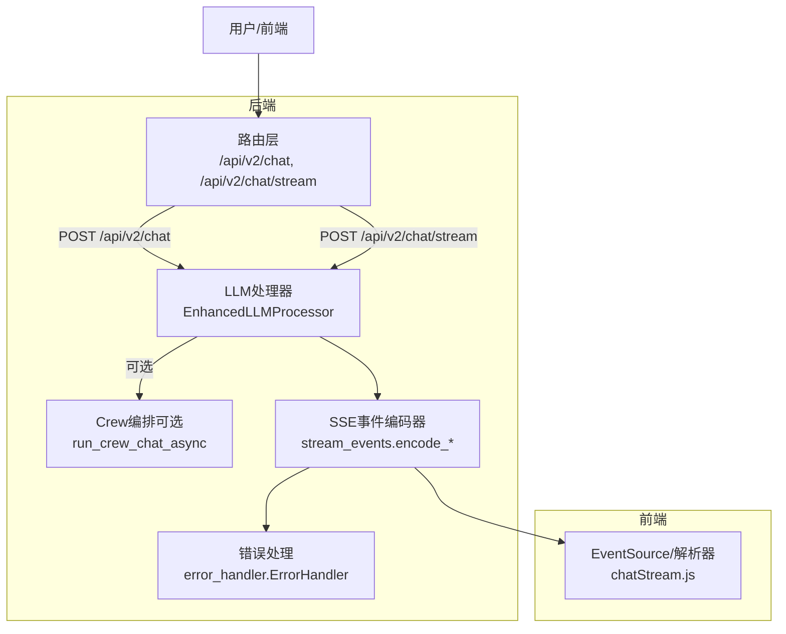
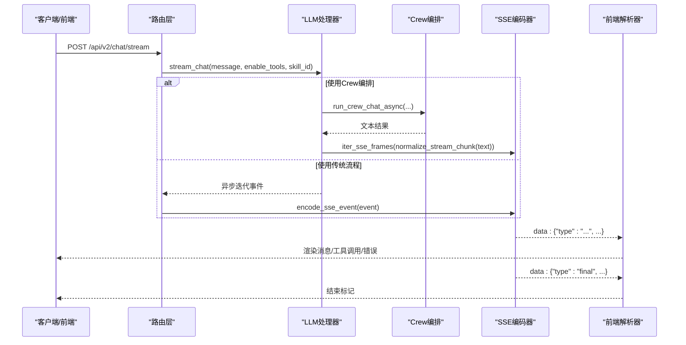
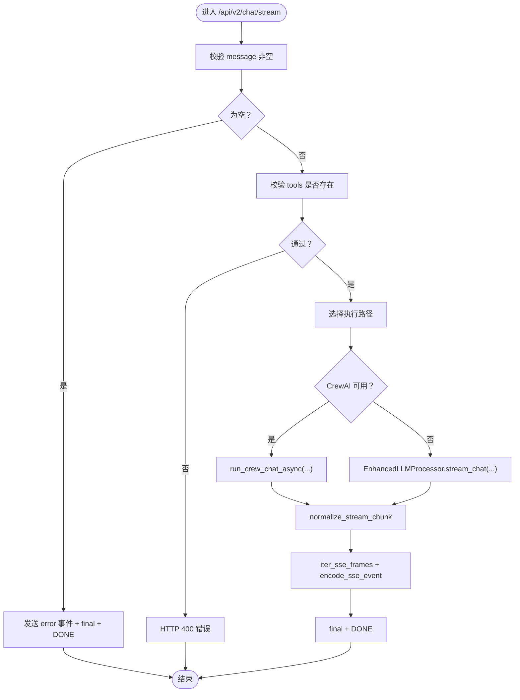
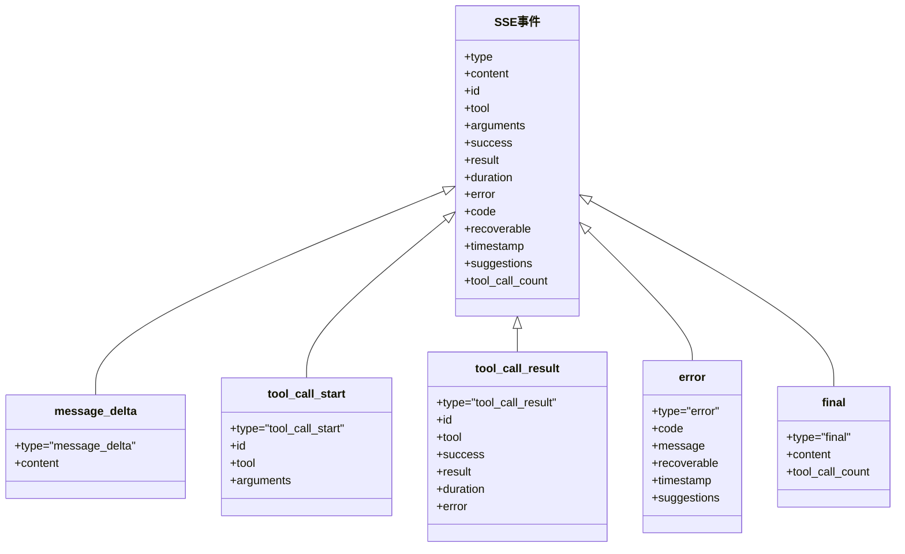
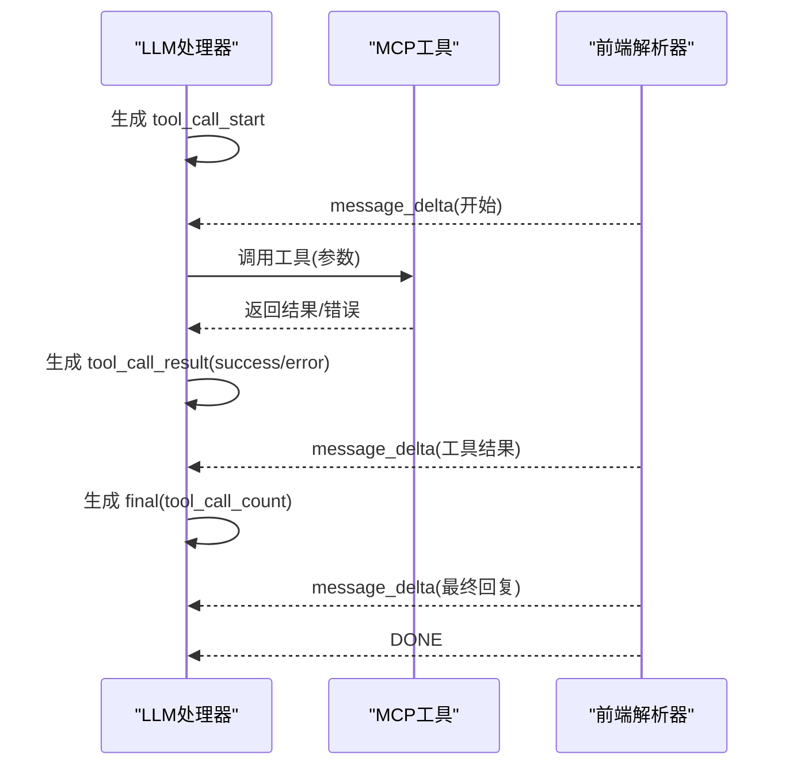
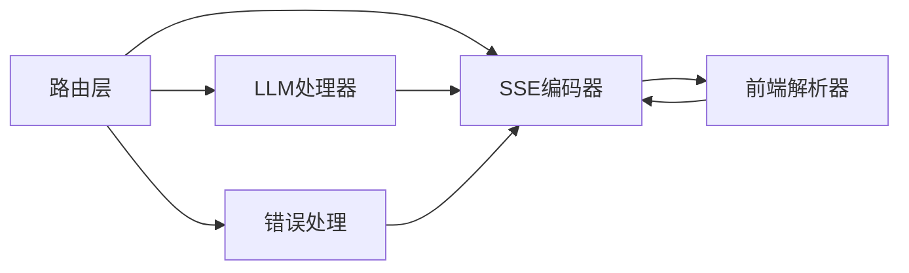

# 聊天接口

<cite>
**本文引用的文件**
- [router.py](file://backend/src/api/v2/router.py)
- [stream_events.py](file://backend/src/api/v2/stream_events.py)
- [processor.py](file://backend/src/llm/processor.py)
- [crew_orchestrator.py](file://backend/src/llm/crew_orchestrator.py)
- [chatStream.js](file://frontend-v2/src/shared/stream/chatStream.js)
- [chat-stream-contract.md](file://project_document/chat-stream-contract.md)
- [error_handler.py](file://backend/src/utils/error_handler.py)
</cite>

## 目录
1. [简介](#简介)
2. [项目结构](#项目结构)
3. [核心组件](#核心组件)
4. [架构总览](#架构总览)
5. [详细组件分析](#详细组件分析)
6. [依赖分析](#依赖分析)
7. [性能考量](#性能考量)
8. [故障排查指南](#故障排查指南)
9. [结论](#结论)
10. [附录](#附录)

## 简介
本文档面向钉钉K8s运维机器人后端的聊天接口，重点覆盖：
- 流式聊天接口（/api/v2/chat/stream）与普通聊天接口（/api/v2/chat）的实现与差异
- ChatRequest 请求模型字段说明（message、stream、context、tools、enable_tools、skill_id）
- Server-Sent Events（SSE）流式响应的事件类型、数据格式与错误处理
- 工具调用在流式响应中的集成（tool_call_start、tool_call_result、final、error 等）
- 典型请求/响应示例与最佳实践

## 项目结构
后端聊天接口位于 FastAPI 路由模块中，结合 LLM 处理器与工具编排能力，形成“请求解析 → 流式生成 → SSE 编码 → 前端解析”的完整链路。

图表来源
- [router.py:158-344](file://backend/src/api/v2/router.py#L158-L344)
- [processor.py:536-757](file://backend/src/llm/processor.py#L536-L757)
- [crew_orchestrator.py:31-124](file://backend/src/llm/crew_orchestrator.py#L31-L124)
- [stream_events.py:13-87](file://backend/src/api/v2/stream_events.py#L13-L87)
- [chatStream.js:35-85](file://frontend-v2/src/shared/stream/chatStream.js#L35-L85)

章节来源
- [router.py:158-344](file://backend/src/api/v2/router.py#L158-L344)

## 核心组件
- 路由与请求模型
  - ChatRequest：定义 message、stream、context、tools、enable_tools、skill_id 等字段
  - /api/v2/chat：普通非流式接口
  - /api/v2/chat/stream：流式接口，返回 text/event-stream
- SSE事件编码
  - message_delta、tool_call_start、tool_call_result、error、final 等事件类型
  - DONE标记兼容
- LLM处理器
  - EnhancedLLMProcessor.stream_chat：两阶段流式处理（工具决策与执行、LLM回复生成）
  - Crew编排（可选）：通过 CrewAI 协调工具调用
- 前端解析
  - chatStream.js：解析 data: 行，标准化事件，识别 [DONE] 结束信号

章节来源
- [router.py:48-58](file://backend/src/api/v2/router.py#L48-L58)
- [router.py:158-344](file://backend/src/api/v2/router.py#L158-L344)
- [stream_events.py:13-87](file://backend/src/api/v2/stream_events.py#L13-L87)
- [processor.py:536-757](file://backend/src/llm/processor.py#L536-L757)
- [crew_orchestrator.py:31-124](file://backend/src/llm/crew_orchestrator.py#L31-L124)
- [chatStream.js:35-85](file://frontend-v2/src/shared/stream/chatStream.js#L35-L85)

## 架构总览
后端路由层负责权限校验、参数校验与流式生成器的组装；LLM处理器负责与LLM与MCP工具交互；SSE编码器负责事件序列化；前端通过 EventSource 接收并解析事件。

图表来源
- [router.py:181-338](file://backend/src/api/v2/router.py#L181-L338)
- [processor.py:536-757](file://backend/src/llm/processor.py#L536-L757)
- [crew_orchestrator.py:31-124](file://backend/src/llm/crew_orchestrator.py#L31-L124)
- [stream_events.py:84-87](file://backend/src/api/v2/stream_events.py#L84-L87)
- [chatStream.js:3-33](file://frontend-v2/src/shared/stream/chatStream.js#L3-L33)

## 详细组件分析

### 请求模型 ChatRequest 字段说明
- message
  - 类型：字符串
  - 作用：用户输入的自然语言消息
  - 示例：查看集群状态、查询Pod日志、扩缩容部署
- stream
  - 类型：布尔
  - 作用：是否启用流式响应（默认开启）
  - 影响：控制路由层返回 StreamingResponse 或普通JSON
- context
  - 类型：可选字典
  - 作用：携带上下文信息（如历史消息、用户会话、技能上下文）
  - 影响：可用于增强LLM理解与工具调用参数
- tools
  - 类型：可选字符串数组
  - 作用：显式指定本次对话使用的工具集合
  - 校验：后端会检查工具名是否存在于可用工具列表
- enable_tools
  - 类型：布尔
  - 作用：是否启用MCP工具调用
  - 影响：关闭时走纯LLM对话路径
- skill_id
  - 类型：可选字符串
  - 作用：限制可调用工具的技能ID（来自 config/skills.json）
  - 影响：通过技能注册表过滤工具集合

章节来源
- [router.py:48-58](file://backend/src/api/v2/router.py#L48-L58)

### 流式接口 /api/v2/chat/stream 实现要点
- 参数校验
  - message非空校验：空消息返回 error 事件与 final 事件
  - tools存在性校验：若指定工具不在可用工具列表中，返回HTTP 400
- 工具启用策略
  - enable_tools 且 MCP客户端可用时启用工具；否则走纯LLM路径
  - 支持可选的 CrewAI 编排（当 USE_CREWAI=1 且可用时）
- 事件生成与编码
  - normalize_stream_chunk：将处理器输出标准化为事件对象
  - iter_sse_frames：将事件对象编码为SSE帧
  - final：结束事件，携带 tool_call_count
  - DONE：兼容标记
- 错误处理
  - 统一通过 ErrorHandler.format_error_response 生成错误事件
  - 返回 HTTP 5xx 或 4xx（依据错误类型）

图表来源
- [router.py:181-338](file://backend/src/api/v2/router.py#L181-L338)
- [stream_events.py:60-87](file://backend/src/api/v2/stream_events.py#L60-L87)

章节来源
- [router.py:181-338](file://backend/src/api/v2/router.py#L181-L338)

### 普通接口 /api/v2/chat 实现要点
- 简单封装：直接调用 LLM 处理器的 process_message
- 返回结构：包含 response、message_id、timestamp
- 无工具调用：enable_tools=false 的简化路径

章节来源
- [router.py:158-174](file://backend/src/api/v2/router.py#L158-L174)
- [processor.py:520-535](file://backend/src/llm/processor.py#L520-L535)

### SSE事件类型与数据格式
- message_delta
  - 作用：LLM文本增量
  - 字段：type、content
- tool_call_start
  - 作用：工具开始执行
  - 字段：type、id、tool、arguments
- tool_call_result（标准化）
  - 作用：工具执行完成（兼容旧事件类型）
  - 字段：type、id、tool、success、result、duration（可选）、error（可选）
- error
  - 作用：错误事件
  - 字段：type、code、message、recoverable、timestamp、suggestions（可选）
- final
  - 作用：一次回复结束
  - 字段：type、content、tool_call_count

图表来源
- [stream_events.py:23-58](file://backend/src/api/v2/stream_events.py#L23-L58)
- [stream_events.py:89-146](file://backend/src/api/v2/stream_events.py#L89-L146)

章节来源
- [stream_events.py:13-87](file://backend/src/api/v2/stream_events.py#L13-L87)
- [chat-stream-contract.md:26-105](file://project_document/chat-stream-contract.md#L26-L105)

### 工具调用在流式响应中的集成
- 第一阶段：LLM决策与工具执行
  - 生成 tool_call_start 事件，携带工具名与参数
  - 工具执行过程中可产生 tool_call_update（标准化为 tool_call_result）
  - 工具完成后产生 tool_call_complete，携带结果与更新后的对话历史
- 第二阶段：基于工具结果生成LLM回复
  - 将工具调用结果汇总为提示词，调用LLM生成最终回复
  - 输出 message_delta 文本增量，最终以 final 结束
- 前端解析
  - chatStream.js 将 data: 行解析为事件对象，标准化 tool_call_result，识别 [DONE] 结束

图表来源
- [processor.py:844-944](file://backend/src/llm/processor.py#L844-L944)
- [stream_events.py:89-146](file://backend/src/api/v2/stream_events.py#L89-L146)
- [chatStream.js:35-85](file://frontend-v2/src/shared/stream/chatStream.js#L35-L85)

章节来源
- [processor.py:758-1057](file://backend/src/llm/processor.py#L758-L1057)
- [stream_events.py:89-146](file://backend/src/api/v2/stream_events.py#L89-L146)
- [chatStream.js:35-85](file://frontend-v2/src/shared/stream/chatStream.js#L35-L85)

### 请求/响应示例（典型场景）
- 场景1：普通对话（无工具）
  - 请求：POST /api/v2/chat/stream
  - body：{"message":"你好","stream":true,"enable_tools":false}
  - 响应：message_delta(文本片段) → final
- 场景2：工具调用（K8s Pod查询）
  - 请求：POST /api/v2/chat/stream
  - body：{"message":"列出default命名空间的Pod","stream":true,"enable_tools":true,"skill_id":"k8s_ops"}
  - 响应：
    - tool_call_start(id, tool, arguments)
    - tool_call_result(id, tool, success, result, duration)
    - message_delta(最终回复)
    - final(tool_call_count)
- 场景3：空消息
  - 请求：POST /api/v2/chat/stream
  - body：{"message":"","stream":true}
  - 响应：error(code, message, recoverable, suggestions) → final → DONE

章节来源
- [router.py:191-221](file://backend/src/api/v2/router.py#L191-L221)
- [stream_events.py:41-58](file://backend/src/api/v2/stream_events.py#L41-L58)
- [chat-stream-contract.md:26-105](file://project_document/chat-stream-contract.md#L26-L105)

## 依赖分析
- 路由层依赖
  - EnhancedLLMProcessor：消息处理与流式生成
  - EnhancedMCPClient：工具列表与调用（可选）
  - ErrorHandler：统一错误格式化
- SSE编码器
  - normalize_stream_chunk：兼容旧格式与新事件
  - iter_sse_frames：事件到SSE帧
- 前端解析器
  - parseChatStreamLine：解析 data: 行
  - normalizeChatStreamEvent：标准化事件对象

图表来源
- [router.py:158-344](file://backend/src/api/v2/router.py#L158-L344)
- [stream_events.py:60-87](file://backend/src/api/v2/stream_events.py#L60-L87)
- [chatStream.js:3-33](file://frontend-v2/src/shared/stream/chatStream.js#L3-L33)

章节来源
- [router.py:158-344](file://backend/src/api/v2/router.py#L158-L344)
- [stream_events.py:60-87](file://backend/src/api/v2/stream_events.py#L60-L87)
- [chatStream.js:3-33](file://frontend-v2/src/shared/stream/chatStream.js#L3-L33)

## 性能考量
- 流式输出
  - 使用 StreamingResponse 与 text/event-stream，降低首字节延迟
  - 前端逐行解析，避免一次性缓冲
- 工具调用
  - 限制最大工具调用轮次，防止无限循环
  - 工具结果过大时进行关键信息提炼，减少上下文负担
- 上下文优化
  - 估算token，裁剪历史消息，保留关键对话循环
- 超时与重试
  - LLM调用与工具调用设置合理超时，避免阻塞
- Crew编排
  - 可选启用，当环境满足时提升工具编排效率

章节来源
- [processor.py:459-518](file://backend/src/llm/processor.py#L459-L518)
- [processor.py:645-744](file://backend/src/llm/processor.py#L645-L744)
- [crew_orchestrator.py:17-29](file://backend/src/llm/crew_orchestrator.py#L17-L29)

## 故障排查指南
- 常见错误类型与建议
  - 网络错误：检查网络连通性、代理设置
  - 认证/授权错误：核对API密钥与权限范围
  - 速率限制：降低请求频率或升级套餐
  - 服务器错误：等待服务恢复或查看日志
  - MCP错误：检查MCP服务器状态与工具配置
  - 流式传输错误：检查SSE支持与浏览器兼容性
  - 配置错误：核对LLM/MCP配置与环境变量
- 错误事件格式
  - error 事件包含 code、message、recoverable、timestamp、suggestions
  - 前端解析器可识别并展示
- 日志与追踪
  - ErrorHandler 记录错误类型、上下文与时间戳
  - 建议在生产环境开启详细日志以便定位

章节来源
- [error_handler.py:13-26](file://backend/src/utils/error_handler.py#L13-L26)
- [error_handler.py:71-157](file://backend/src/utils/error_handler.py#L71-L157)
- [error_handler.py:218-244](file://backend/src/utils/error_handler.py#L218-L244)

## 结论
- /api/v2/chat/stream 提供稳定的SSE流式对话能力，支持工具调用与错误处理
- ChatRequest 字段清晰定义了消息、工具启用、上下文与技能限制
- SSE事件契约明确，前后端解耦，便于演进与维护
- 建议在生产环境启用合理的超时、限流与日志策略，保障稳定性与可观测性

## 附录

### SSE事件契约（摘要）
- message_delta：文本增量
- tool_call_start：工具开始
- tool_call_result：工具完成（兼容旧事件）
- error：错误
- final：结束

章节来源
- [chat-stream-contract.md:26-105](file://project_document/chat-stream-contract.md#L26-L105)