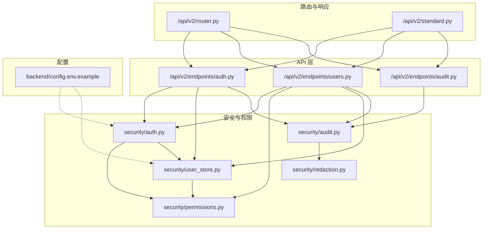
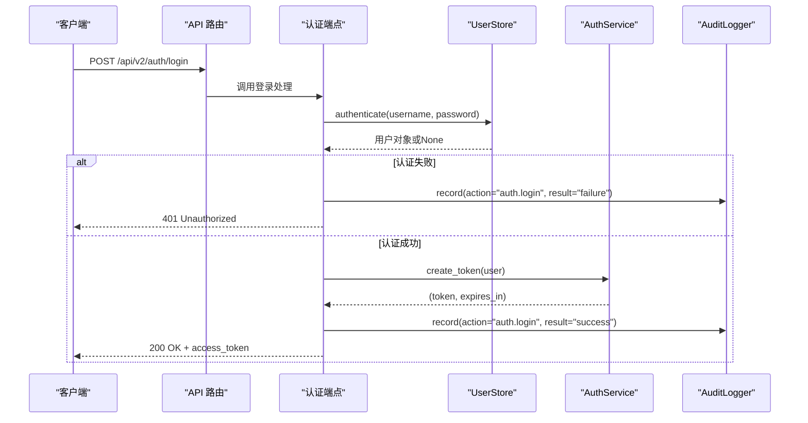
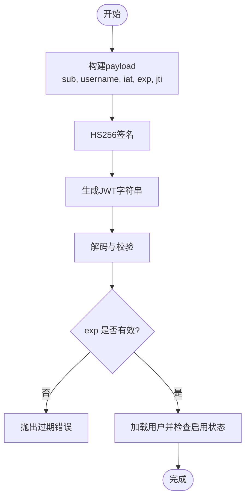
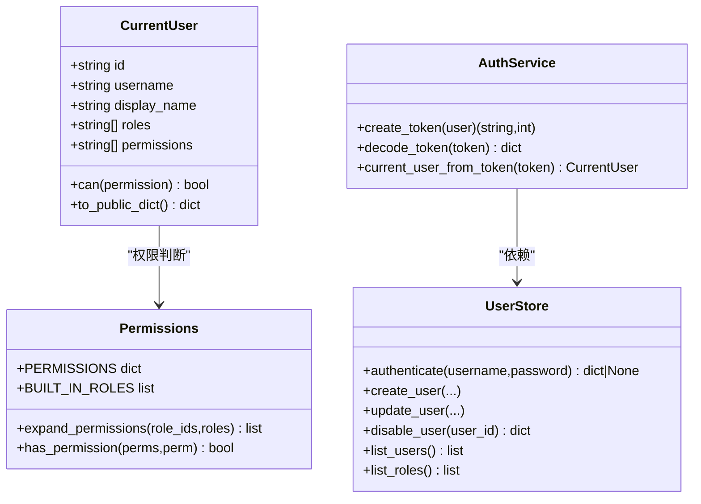
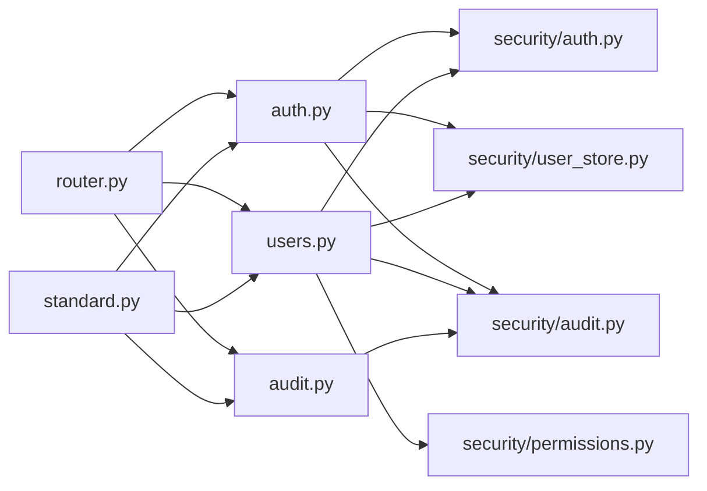

# 认证与授权接口

<cite>
**本文引用的文件**
- [backend/src/api/v2/endpoints/auth.py](file://backend/src/api/v2/endpoints/auth.py)
- [backend/src/api/v2/endpoints/users.py](file://backend/src/api/v2/endpoints/users.py)
- [backend/src/api/v2/endpoints/audit.py](file://backend/src/api/v2/endpoints/audit.py)
- [backend/src/api/v2/router.py](file://backend/src/api/v2/router.py)
- [backend/src/api/v2/standard.py](file://backend/src/api/v2/standard.py)
- [backend/src/security/auth.py](file://backend/src/security/auth.py)
- [backend/src/security/permissions.py](file://backend/src/security/permissions.py)
- [backend/src/security/user_store.py](file://backend/src/security/user_store.py)
- [backend/src/security/audit.py](file://backend/src/security/audit.py)
- [backend/src/security/redaction.py](file://backend/src/security/redaction.py)
- [backend/config.env.example](file://backend/config.env.example)
</cite>

## 目录
1. [简介](#简介)
2. [项目结构](#项目结构)
3. [核心组件](#核心组件)
4. [架构总览](#架构总览)
5. [详细组件分析](#详细组件分析)
6. [依赖分析](#依赖分析)
7. [性能考虑](#性能考虑)
8. [故障排查指南](#故障排查指南)
9. [结论](#结论)
10. [附录](#附录)

## 简介
本文件面向认证与授权系统，聚焦以下目标：
- 详述用户认证接口（/api/v2/auth/login、/api/v2/auth/logout、/api/v2/auth/me）的实现与使用方法
- 解释JWT令牌的生成、验证与当前实现下的“刷新”策略
- 说明用户管理接口（/api/v2/users）的功能与RBAC权限控制模型
- 提供会话管理与状态保持机制说明
- 总结安全最佳实践（密码加密、令牌安全、防暴力破解建议）
- 说明审计日志接口与操作记录功能

## 项目结构
认证与授权相关代码主要分布在以下模块：
- API层：/api/v2/endpoints 下的 auth.py、users.py、audit.py
- 安全与权限：security/auth.py、security/permissions.py、security/user_store.py、security/audit.py、security/redaction.py
- 路由聚合：/api/v2/router.py
- 统一响应封装：/api/v2/standard.py
- 环境配置示例：backend/config.env.example

图表来源
- [backend/src/api/v2/router.py:547-549](file://backend/src/api/v2/router.py#L547-L549)
- [backend/src/api/v2/endpoints/auth.py:13](file://backend/src/api/v2/endpoints/auth.py#L13)
- [backend/src/api/v2/endpoints/users.py:14](file://backend/src/api/v2/endpoints/users.py#L14)
- [backend/src/api/v2/endpoints/audit.py:11](file://backend/src/api/v2/endpoints/audit.py#L11)
- [backend/src/security/auth.py:1](file://backend/src/security/auth.py#L1)
- [backend/src/security/permissions.py:1](file://backend/src/security/permissions.py#L1)
- [backend/src/security/user_store.py:1](file://backend/src/security/user_store.py#L1)
- [backend/src/security/audit.py:1](file://backend/src/security/audit.py#L1)
- [backend/src/security/redaction.py:1](file://backend/src/security/redaction.py#L1)
- [backend/config.env.example:1](file://backend/config.env.example#L1)

章节来源
- [backend/src/api/v2/router.py:547-549](file://backend/src/api/v2/router.py#L547-L549)
- [backend/src/api/v2/endpoints/auth.py:13](file://backend/src/api/v2/endpoints/auth.py#L13)
- [backend/src/api/v2/endpoints/users.py:14](file://backend/src/api/v2/endpoints/users.py#L14)
- [backend/src/api/v2/endpoints/audit.py:11](file://backend/src/api/v2/endpoints/audit.py#L11)

## 核心组件
- JWT与会话：AuthService负责令牌生成与解码；CurrentUser封装当前用户上下文；HTTP Bearer方案解析与校验
- 用户与角色：UserStore提供用户增删改查、角色与权限展开、密码哈希与校验
- 权限模型：PERMISSIONS常量与内置角色BUILT_IN_ROLES；has_permission与expand_permissions实现RBAC
- 审计日志：AuditLogger写入JSONL文件，支持过滤查询
- 统一响应：success_envelope/error_envelope标准化返回结构

章节来源
- [backend/src/security/auth.py:73-135](file://backend/src/security/auth.py#L73-L135)
- [backend/src/security/user_store.py:61-292](file://backend/src/security/user_store.py#L61-L292)
- [backend/src/security/permissions.py:7-95](file://backend/src/security/permissions.py#L7-L95)
- [backend/src/security/audit.py:21-96](file://backend/src/security/audit.py#L21-L96)
- [backend/src/api/v2/standard.py:21-65](file://backend/src/api/v2/standard.py#L21-L65)

## 架构总览
认证与授权的整体流程如下：
- 登录：前端提交用户名/密码，UserStore校验并记录审计日志，AuthService生成JWT返回
- 访问受控接口：中间件解析Authorization头，AuthService解码并校验，注入CurrentUser
- RBAC：require_permission依赖get_current_user，校验用户权限集合
- 审计：各接口记录操作日志，审计接口提供查询

图表来源
- [backend/src/api/v2/endpoints/auth.py:21-66](file://backend/src/api/v2/endpoints/auth.py#L21-L66)
- [backend/src/security/user_store.py:188-199](file://backend/src/security/user_store.py#L188-L199)
- [backend/src/security/auth.py:79-100](file://backend/src/security/auth.py#L79-L100)
- [backend/src/security/audit.py:27-61](file://backend/src/security/audit.py#L27-L61)

## 详细组件分析

### 认证接口
- 接口路径与方法
  - POST /api/v2/auth/login：登录，返回access_token、token_type、expires_in与用户信息
  - GET /api/v2/auth/me：获取当前用户信息
  - POST /api/v2/auth/logout：退出登录（记录审计日志并返回成功信息）

- 关键行为
  - 登录：UserStore.authenticate校验凭据；成功后AuthService.create_token生成JWT；记录审计日志
  - 当前用户：get_current_user解析Authorization头，AuthService.decode_token校验签名与过期时间，返回CurrentUser
  - 退出登录：记录审计日志后返回成功信息

- 请求与响应要点
  - Authorization: Bearer <token> 用于受控接口访问
  - 成功响应包含统一结构success_envelope，包含request_id、timestamp等元信息

章节来源
- [backend/src/api/v2/endpoints/auth.py:21-87](file://backend/src/api/v2/endpoints/auth.py#L21-L87)
- [backend/src/security/auth.py:151-169](file://backend/src/security/auth.py#L151-L169)
- [backend/src/api/v2/standard.py:21-38](file://backend/src/api/v2/standard.py#L21-L38)

### JWT令牌生成、验证与“刷新”
- 生成
  - AuthService.create_token基于用户ID、用户名、签发时间、过期时间与随机jti构造payload，使用HS256签名生成JWT
  - 过期时间由APP_SESSION_EXPIRES_SECONDS控制，默认一天

- 验证
  - AuthService.decode_token拆分三段，计算签名并与期望签名比对，再校验exp
  - get_current_user在解析到token后，调用current_user_from_token加载用户并检查启用状态

- 刷新
  - 当前实现未提供专用的刷新接口；建议客户端在access_token即将过期时重新登录获取新token

图表来源
- [backend/src/security/auth.py:79-121](file://backend/src/security/auth.py#L79-L121)
- [backend/src/security/auth.py:123-134](file://backend/src/security/auth.py#L123-L134)

章节来源
- [backend/src/security/auth.py:79-134](file://backend/src/security/auth.py#L79-L134)

### 用户管理接口（/api/v2/users）
- 接口与权限
  - GET /api/v2/users：需要users:read权限，返回用户列表、角色与权限清单
  - POST /api/v2/users：需要users:write权限，创建用户（用户名、显示名、密码、角色、启用状态）
  - PATCH /api/v2/users/{user_id}：需要users:write权限，更新用户（可选字段：显示名、密码、角色、启用状态）
  - DELETE /api/v2/users/{user_id}：需要users:write权限，停用用户
  - GET /api/v2/users/roles：需要users:read权限，返回角色与权限清单

- 数据模型
  - 用户创建请求：username、display_name、password、roles（默认viewer）、enabled（默认True）
  - 用户更新请求：display_name、password（可选）、roles（可选）、enabled（可选）

- 审计
  - 创建/更新/停用用户均记录审计日志，包含actor、action、resource、resource_id、result、请求元信息与详情

章节来源
- [backend/src/api/v2/endpoints/users.py:32-162](file://backend/src/api/v2/endpoints/users.py#L32-L162)
- [backend/src/security/permissions.py:24-28](file://backend/src/security/permissions.py#L24-L28)

### 权限控制模型与RBAC
- 权限常量
  - PERMISSIONS定义了细粒度权限键值对，涵盖运维、对话、LLM/MCP配置、资源指标、巡检、告警、调度、审计、用户管理、调试等

- 内置角色
  - admin：拥有全部权限
  - operator：具备运维与调度能力，但不管理用户
  - viewer：只读访问

- 权限展开与判断
  - expand_permissions根据角色ID展开为权限列表；has_permission判断用户权限集合是否包含某权限或通配符

- 接口依赖
  - require_permission(permission)依赖get_current_user，未满足权限则返回403

图表来源
- [backend/src/security/auth.py:52-134](file://backend/src/security/auth.py#L52-L134)
- [backend/src/security/permissions.py:7-95](file://backend/src/security/permissions.py#L7-L95)
- [backend/src/security/user_store.py:155-170](file://backend/src/security/user_store.py#L155-L170)

章节来源
- [backend/src/security/permissions.py:7-95](file://backend/src/security/permissions.py#L7-L95)
- [backend/src/security/auth.py:172-181](file://backend/src/security/auth.py#L172-L181)

### 审计日志接口与操作记录
- 接口
  - GET /api/v2/audit/logs：需要audit:read权限，按actor、action、result过滤，返回最近N条日志（上限500）

- 存储
  - AuditLogger将每条日志以JSONL格式追加写入文件，路径由OPERATION_AUDIT_LOG_PATH控制，默认logs/operation_audit.jsonl
  - 日志字段包含：id、timestamp、actor、action、resource、resource_id、result、request_id、method、path、ip、user_agent、details（详情会被脱敏）

- 脱敏
  - redaction模块对敏感键与值进行脱敏，避免日志泄露

章节来源
- [backend/src/api/v2/endpoints/audit.py:14-35](file://backend/src/api/v2/endpoints/audit.py#L14-L35)
- [backend/src/security/audit.py:21-96](file://backend/src/security/audit.py#L21-L96)
- [backend/src/security/redaction.py:48-79](file://backend/src/security/redaction.py#L48-L79)

### 会话管理与状态保持
- 会话密钥
  - 会话密钥通过APP_SESSION_SECRET或APP_SESSION_SECRET_FILE加载；若不存在则自动生成并设置严格权限
- 令牌有效期
  - 由APP_SESSION_EXPIRES_SECONDS控制，默认一天
- 状态保持
  - 前端需在后续请求中携带Authorization: Bearer <token>；服务端通过get_current_user解析并校验

章节来源
- [backend/src/security/auth.py:36-49](file://backend/src/security/auth.py#L36-L49)
- [backend/src/security/auth.py:77](file://backend/src/security/auth.py#L77)
- [backend/src/security/auth.py:151-169](file://backend/src/security/auth.py#L151-L169)

## 依赖分析
- 组件耦合
  - API端点依赖security/auth.py与security/user_store.py；用户管理端点还依赖security/permissions.py
  - 审计日志统一由security/audit.py提供，日志内容经security/redaction.py脱敏
  - 路由聚合器将各端点注册到/api/v2前缀下

图表来源
- [backend/src/api/v2/router.py:547-549](file://backend/src/api/v2/router.py#L547-L549)
- [backend/src/api/v2/endpoints/auth.py:8-11](file://backend/src/api/v2/endpoints/auth.py#L8-L11)
- [backend/src/api/v2/endpoints/users.py:8-12](file://backend/src/api/v2/endpoints/users.py#L8-L12)
- [backend/src/api/v2/endpoints/audit.py:7-9](file://backend/src/api/v2/endpoints/audit.py#L7-L9)

章节来源
- [backend/src/api/v2/router.py:547-549](file://backend/src/api/v2/router.py#L547-L549)
- [backend/src/api/v2/endpoints/auth.py:8-11](file://backend/src/api/v2/endpoints/auth.py#L8-L11)
- [backend/src/api/v2/endpoints/users.py:8-12](file://backend/src/api/v2/endpoints/users.py#L8-L12)
- [backend/src/api/v2/endpoints/audit.py:7-9](file://backend/src/api/v2/endpoints/audit.py#L7-L9)

## 性能考虑
- 缓存
  - AuthService与UserStore、AuditLogger均使用lru_cache缓存实例，减少重复初始化开销
- 锁保护
  - UserStore使用线程锁保护对users.json的读写，保证并发安全
- 响应一致性
  - 统一响应封装确保所有接口返回结构一致，便于前端处理

章节来源
- [backend/src/security/auth.py:137-139](file://backend/src/security/auth.py#L137-L139)
- [backend/src/security/user_store.py:23](file://backend/src/security/user_store.py#L23)
- [backend/src/security/audit.py:93-95](file://backend/src/security/audit.py#L93-L95)
- [backend/src/api/v2/standard.py:21-38](file://backend/src/api/v2/standard.py#L21-L38)

## 故障排查指南
- 401 未登录或登录已过期
  - 检查Authorization头是否正确携带Bearer token
  - 确认token未过期，必要时重新登录
- 403 缺少权限
  - 确认当前用户角色与所需权限匹配；可通过GET /api/v2/users/roles查看权限清单
- 用户不存在或已停用
  - AuthService在解码后会校验用户存在且启用
- 审计日志为空
  - 检查OPERATION_AUDIT_LOG_PATH配置与文件权限；确认日志写入线程锁未阻塞

章节来源
- [backend/src/security/auth.py:157-169](file://backend/src/security/auth.py#L157-L169)
- [backend/src/security/auth.py:126-127](file://backend/src/security/auth.py#L126-L127)
- [backend/src/api/v2/endpoints/audit.py:63-90](file://backend/src/api/v2/endpoints/audit.py#L63-L90)

## 结论
本系统采用JWT与RBAC结合的认证与授权方案：用户通过登录获取短期令牌，受控接口通过require_permission进行权限校验；用户管理与审计日志贯穿全链路，保障可追溯性。当前未提供专用的令牌刷新接口，建议客户端在过期前重新登录。

## 附录

### 环境变量与配置要点
- 会话密钥与有效期
  - APP_SESSION_SECRET 或 APP_SESSION_SECRET_FILE：会话密钥来源
  - APP_SESSION_EXPIRES_SECONDS：令牌有效期（秒）
- 审计日志路径
  - OPERATION_AUDIT_LOG_PATH：审计日志文件路径（默认logs/operation_audit.jsonl）
- 用户存储路径
  - IAM_USERS_PATH：用户与角色数据文件路径（默认config/security/users.json）
- 示例配置文件
  - backend/config.env.example：系统运行示例配置

章节来源
- [backend/config.env.example:1](file://backend/config.env.example#L1)
- [backend/src/security/auth.py:36-49](file://backend/src/security/auth.py#L36-L49)
- [backend/src/security/audit.py:17-18](file://backend/src/security/audit.py#L17-L18)
- [backend/src/security/user_store.py:30-31](file://backend/src/security/user_store.py#L30-L31)