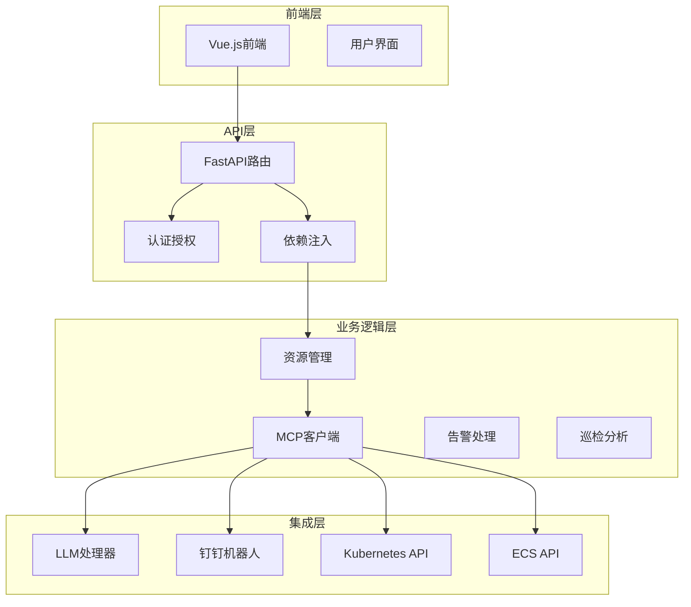
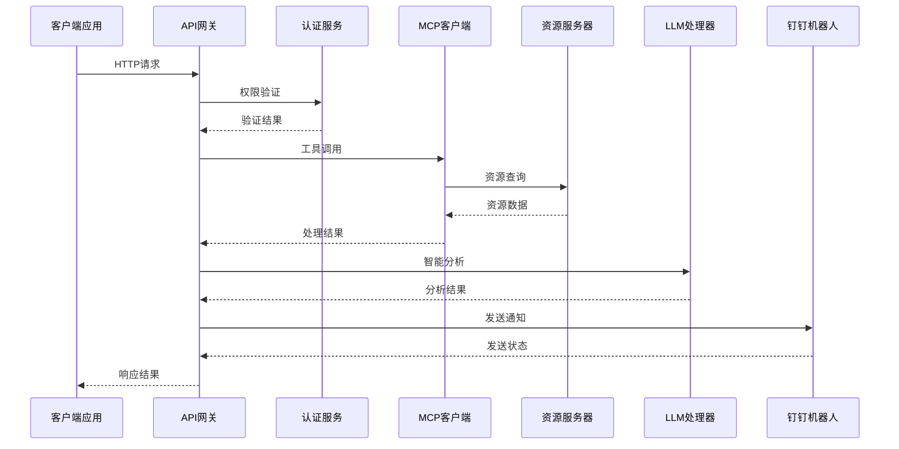
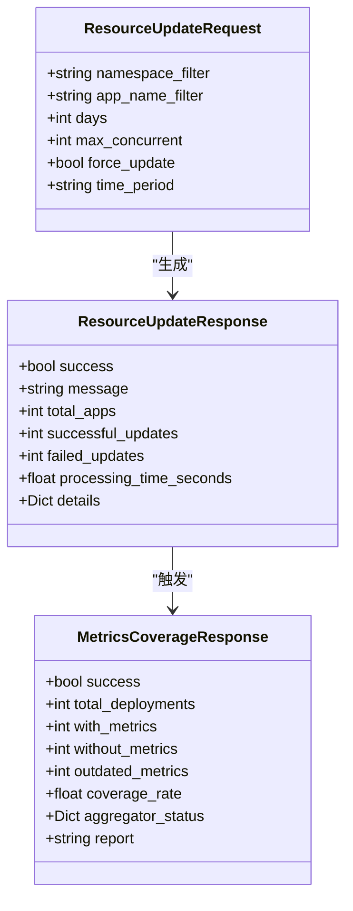
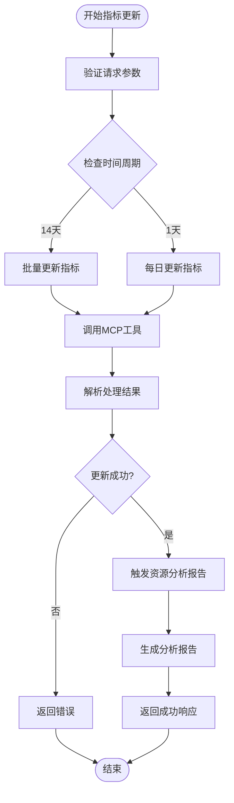
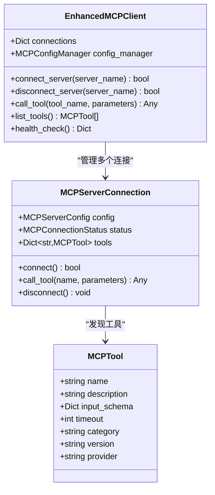
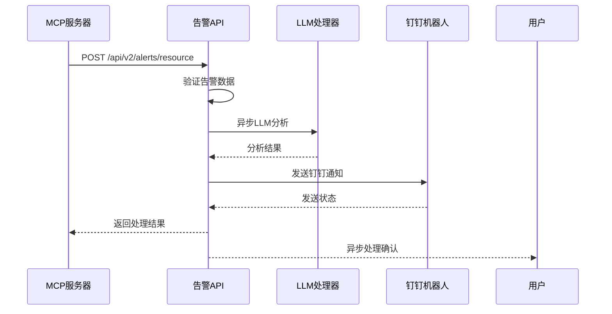
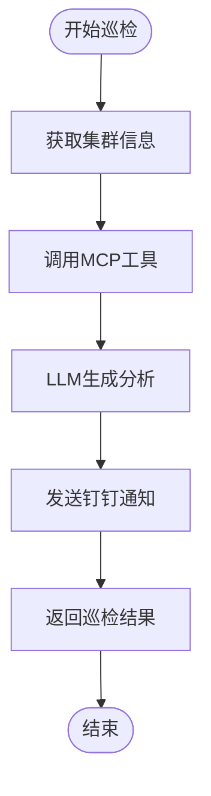
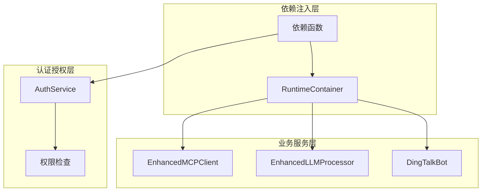
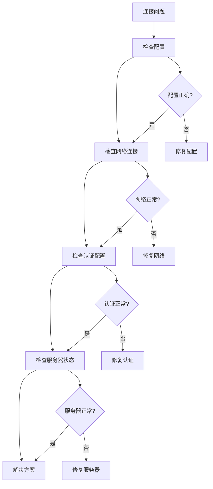

# 资源管理接口

<cite>
**本文档引用的文件**
- [resources.py](file://backend/src/api/v2/endpoints/resources.py)
- [mcp.py](file://backend/src/api/v2/endpoints/mcp.py)
- [alerts.py](file://backend/src/api/v2/endpoints/alerts.py)
- [inspection.py](file://backend/src/api/v2/endpoints/inspection.py)
- [router.py](file://backend/src/api/v2/router.py)
- [enhanced_client.py](file://backend/src/mcp/enhanced_client.py)
- [auth.py](file://backend/src/security/auth.py)
- [dependencies.py](file://backend/src/api/v2/dependencies.py)
- [container.py](file://backend/src/app/container.py)
- [types.py](file://backend/src/mcp/types.py)
- [api-usage-guide.md](file://archived/k8s-mcp-standalone/project_document/api-usage-guide.md)
- [resource-alert-configuration-v2.md](file://archived/k8s-mcp-standalone/docs/resource-alert-configuration-v2.md)
</cite>

## 目录
1. [简介](#简介)
2. [项目结构](#项目结构)
3. [核心组件](#核心组件)
4. [架构概览](#架构概览)
5. [详细组件分析](#详细组件分析)
6. [依赖关系分析](#依赖关系分析)
7. [性能考虑](#性能考虑)
8. [故障排除指南](#故障排除指南)
9. [结论](#结论)

## 简介

资源管理系统是一个基于Kubernetes和ECS的现代化资源管理平台，集成了MCP（Model Context Protocol）工具系统、LLM智能分析和钉钉通知功能。该系统提供了完整的资源查询、管理和监控能力，支持集群状态查询、节点管理、Pod操作、Service管理等核心功能。

系统采用前后端分离架构，后端基于FastAPI框架，通过MCP协议与多个资源管理服务器通信，实现了高度模块化和可扩展的设计。系统支持实时监控、智能告警、资源关系查询和拓扑分析等功能。

## 项目结构

资源管理系统采用分层架构设计，主要包含以下层次：

**图表来源**
- [router.py:45-550](file://backend/src/api/v2/router.py#L45-L550)
- [dependencies.py:10-36](file://backend/src/api/v2/dependencies.py#L10-L36)

系统的核心模块包括：

- **API路由层**: 提供RESTful API接口，支持资源管理、MCP配置、告警处理等功能
- **认证授权层**: 基于JWT的权限控制系统，支持细粒度的资源访问控制
- **MCP客户端层**: 实现与多个资源管理服务器的通信，支持工具发现和调用
- **业务逻辑层**: 包含资源管理、监控分析、巡检报告等核心业务功能
- **集成服务层**: 提供LLM智能分析和钉钉通知等外部服务集成

**章节来源**
- [router.py:1-1059](file://backend/src/api/v2/router.py#L1-L1059)
- [dependencies.py:1-36](file://backend/src/api/v2/dependencies.py#L1-L36)

## 核心组件

### 资源管理API端点

系统提供了完整的Kubernetes资源管理API，主要包括以下功能：

- **资源查询**: 支持获取节点、Pod、Service、Deployment等资源信息
- **资源更新**: 支持批量更新资源指标和状态
- **指标监控**: 提供资源利用率和性能指标查询
- **关系查询**: 支持资源间的关联关系分析和拓扑查询

### MCP配置管理

MCP（Model Context Protocol）配置管理系统提供了灵活的工具服务器管理能力：

- **服务器管理**: 支持多服务器连接、启停控制和状态监控
- **工具管理**: 提供工具发现、启用/禁用和权限控制
- **配置管理**: 支持配置文件的动态加载和热重载
- **安全控制**: 实现工具调用的权限验证和审计日志

### 告警处理系统

告警处理系统实现了智能化的资源监控和通知机制：

- **告警检测**: 基于阈值的资源使用率监控和异常检测
- **智能分析**: LLM驱动的告警分析和根因诊断
- **通知机制**: 支持钉钉等多种通知渠道
- **统计监控**: 提供告警处理的统计和性能监控

**章节来源**
- [resources.py:1-433](file://backend/src/api/v2/endpoints/resources.py#L1-L433)
- [mcp.py:1-628](file://backend/src/api/v2/endpoints/mcp.py#L1-L628)
- [alerts.py:1-692](file://backend/src/api/v2/endpoints/alerts.py#L1-L692)

## 架构概览

系统采用微服务架构，通过MCP协议实现松耦合的组件通信：

**图表来源**
- [router.py:158-345](file://backend/src/api/v2/router.py#L158-L345)
- [enhanced_client.py:587-800](file://backend/src/mcp/enhanced_client.py#L587-L800)

### 数据流架构

系统实现了完整的数据流处理管道：

1. **请求处理**: 客户端请求通过API网关进入系统
2. **权限验证**: 基于JWT的认证和授权检查
3. **工具调用**: MCP客户端根据请求类型调用相应工具
4. **数据处理**: 资源数据经过LLM智能分析处理
5. **结果返回**: 处理结果通过钉钉机器人发送通知

**章节来源**
- [router.py:83-157](file://backend/src/api/v2/router.py#L83-L157)
- [enhanced_client.py:1-800](file://backend/src/mcp/enhanced_client.py#L1-L800)

## 详细组件分析

### 资源管理组件

资源管理组件提供了完整的Kubernetes资源操作能力：

#### 资源查询接口

系统支持多种资源类型的查询操作：

**图表来源**
- [resources.py:106-137](file://backend/src/api/v2/endpoints/resources.py#L106-L137)

#### 指标更新流程

资源指标更新流程支持批量处理和智能分析：

**图表来源**
- [resources.py:139-285](file://backend/src/api/v2/endpoints/resources.py#L139-L285)

**章节来源**
- [resources.py:139-433](file://backend/src/api/v2/endpoints/resources.py#L139-L433)

### MCP客户端组件

MCP客户端实现了与多个资源管理服务器的高效通信：

#### 多服务器连接管理

**图表来源**
- [enhanced_client.py:33-800](file://backend/src/mcp/enhanced_client.py#L33-L800)
- [types.py:19-54](file://backend/src/mcp/types.py#L19-L54)

#### 工具调用机制

MCP客户端支持多种工具调用方式：

1. **同步调用**: 直接等待工具执行完成
2. **异步调用**: 支持长时间运行的工具
3. **批量调用**: 支持并发执行多个工具
4. **缓存机制**: 自动缓存工具结果提高性能

**章节来源**
- [enhanced_client.py:587-800](file://backend/src/mcp/enhanced_client.py#L587-L800)
- [types.py:178-186](file://backend/src/mcp/types.py#L178-L186)

### 告警处理组件

告警处理系统实现了智能化的资源监控和通知机制：

#### 告警处理流程

**图表来源**
- [alerts.py:92-157](file://backend/src/api/v2/endpoints/alerts.py#L92-L157)

#### LLM智能分析

告警系统集成了LLM智能分析功能：

1. **根因分析**: 基于告警数据进行深度分析
2. **建议生成**: 提供具体的处理建议和解决方案
3. **风险评估**: 评估告警的影响范围和严重程度
4. **格式化输出**: 生成结构化的分析报告

**章节来源**
- [alerts.py:159-270](file://backend/src/api/v2/endpoints/alerts.py#L159-L270)
- [resource-alert-configuration-v2.md:145-188](file://archived/k8s-mcp-standalone/docs/resource-alert-configuration-v2.md#L145-L188)

### 巡检分析组件

巡检分析组件提供了全面的集群健康检查和分析能力：

#### 巡检流程

**图表来源**
- [inspection.py:66-196](file://backend/src/api/v2/endpoints/inspection.py#L66-L196)

**章节来源**
- [inspection.py:1-262](file://backend/src/api/v2/endpoints/inspection.py#L1-L262)

## 依赖关系分析

系统采用了清晰的依赖注入架构，实现了松耦合的设计：

**图表来源**
- [container.py:15-54](file://backend/src/app/container.py#L15-L54)
- [dependencies.py:10-36](file://backend/src/api/v2/dependencies.py#L10-L36)

### 权限控制机制

系统实现了基于角色的权限控制系统：

1. **JWT认证**: 使用HMAC签名的JWT令牌进行身份验证
2. **权限检查**: 基于用户权限的角色访问控制
3. **资源保护**: 对不同API端点实施细粒度的访问控制
4. **审计日志**: 记录所有权限相关的操作

**章节来源**
- [auth.py:1-182](file://backend/src/security/auth.py#L1-L182)
- [router.py:172-182](file://backend/src/api/v2/router.py#L172-L182)

## 性能考虑

系统在设计时充分考虑了性能优化和最佳实践：

### 并发处理

- **异步I/O**: 使用asyncio实现非阻塞的网络请求
- **连接池**: 复用HTTP连接减少建立连接的开销
- **批量处理**: 支持批量工具调用提高效率
- **缓存机制**: 自动缓存工具结果减少重复计算

### 资源管理

- **内存优化**: 使用生成器和流式处理减少内存占用
- **连接管理**: 智能的连接池管理和超时控制
- **错误恢复**: 自动重试和故障转移机制
- **监控指标**: 实时监控系统性能和资源使用情况

### 最佳实践

1. **合理的超时设置**: 根据工具类型设置合适的超时时间
2. **连接复用**: 在可能的情况下复用现有的连接
3. **批量操作**: 尽量使用批量操作减少网络往返
4. **错误处理**: 实现完善的错误处理和重试机制

## 故障排除指南

### 常见问题诊断

#### MCP连接问题

#### 告警处理问题

1. **LLM分析失败**: 检查LLM服务配置和网络连接
2. **钉钉通知失败**: 验证钉钉Webhook配置和网络连通性
3. **工具调用超时**: 检查MCP服务器性能和网络延迟
4. **权限拒绝**: 验证用户权限和工具访问控制

**章节来源**
- [resource-alert-configuration-v2.md:239-333](file://archived/k8s-mcp-standalone/docs/resource-alert-configuration-v2.md#L239-L333)

### 监控和调试

系统提供了完善的监控和调试功能：

1. **健康检查**: 定期检查各组件的运行状态
2. **性能监控**: 实时监控API响应时间和系统资源使用
3. **错误日志**: 详细的错误日志记录和分析
4. **调试模式**: 支持调试模式下的详细日志输出

## 结论

资源管理系统通过集成MCP工具协议、LLM智能分析和钉钉通知功能，为Kubernetes和ECS资源管理提供了完整的解决方案。系统采用现代化的架构设计，具有良好的可扩展性和维护性。

主要优势包括：

- **模块化设计**: 清晰的分层架构便于功能扩展和维护
- **智能分析**: LLM驱动的告警分析提供深度洞察
- **灵活集成**: 支持多种通知渠道和外部服务集成
- **性能优化**: 多种性能优化技术确保系统高效运行
- **安全可靠**: 完善的权限控制和审计机制保障系统安全

系统为现代云原生环境下的资源管理提供了强大的技术支持，能够满足复杂场景下的资源监控、管理和分析需求。