# 运维操作接口

<cite>
**本文档引用的文件**
- [backend/src/api/v2/endpoints/ops.py](file://backend/src/api/v2/endpoints/ops.py)
- [backend/src/api/v2/endpoints/inspection.py](file://backend/src/api/v2/endpoints/inspection.py)
- [backend/src/api/v2/endpoints/alerts.py](file://backend/src/api/v2/endpoints/alerts.py)
- [backend/src/api/v2/endpoints/audit.py](file://backend/src/api/v2/endpoints/audit.py)
- [backend/src/dingtalk/bot.py](file://backend/src/dingtalk/bot.py)
- [backend/src/security/audit.py](file://backend/src/security/audit.py)
- [backend/src/scheduler/task_manager.py](file://backend/src/scheduler/task_manager.py)
- [backend/src/api/v2/router.py](file://backend/src/api/v2/router.py)
- [backend/main.py](file://backend/main.py)
- [backend/src/utils/monitoring.py](file://backend/src/utils/monitoring.py)
- [backend/src/api/v2/endpoints/resources.py](file://backend/src/api/v2/endpoints/resources.py)
- [backend/src/api/v2/endpoints/mcp.py](file://backend/src/api/v2/endpoints/mcp.py)
- [backend/config.env.example](file://backend/config.env.example)
- [config/scheduled_tasks.example.json](file://config/scheduled_tasks.example.json)
- [backend/src/security/auth.py](file://backend/src/security/auth.py)
</cite>

## 目录
1. [简介](#简介)
2. [项目结构](#项目结构)
3. [核心组件](#核心组件)
4. [架构总览](#架构总览)
5. [详细组件分析](#详细组件分析)
6. [依赖关系分析](#依赖关系分析)
7. [性能考虑](#性能考虑)
8. [故障排查指南](#故障排查指南)
9. [结论](#结论)
10. [附录](#附录)

## 简介
本文件为运维操作接口的完整API文档，涵盖系统状态查询、健康检查、性能监控与诊断、钉钉机器人集成（消息推送、事件通知、交互式操作）、运维工具调用与参数配置、日志审计、自动化工作流与任务编排、以及监控可视化与报表生成等能力。文档面向不同技术背景的读者，既提供高层概览，也包含代码级的结构与数据流说明。

## 项目结构
后端采用FastAPI框架，API v2路由集中于src/api/v2，核心业务模块包括：
- 运维总览与只读诊断：/api/v2/ops
- 巡检与报告：/api/v2/inspection
- 资源告警与通知：/api/v2/alerts
- 操作审计：/api/v2/audit
- 资源管理与指标更新：/api/v2/resources
- MCP配置与工具管理：/api/v2/mcp
- 任务调度与编排：/api/v2/scheduler
- 钉钉机器人集成：src/dingtalk/bot.py
- 安全与权限：src/security/auth.py、src/security/audit.py
- 性能监控与调试：src/utils/monitoring.py
- 应用入口与生命周期：backend/main.py

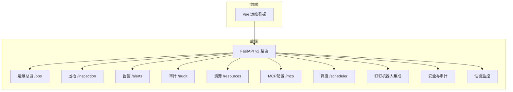

图表来源
- [backend/src/api/v2/router.py:45-549](file://backend/src/api/v2/router.py#L45-L549)
- [backend/src/dingtalk/bot.py:51-527](file://backend/src/dingtalk/bot.py#L51-L527)
- [backend/src/security/audit.py:21-96](file://backend/src/security/audit.py#L21-L96)
- [backend/src/utils/monitoring.py:51-396](file://backend/src/utils/monitoring.py#L51-L396)

章节来源
- [backend/src/api/v2/router.py:45-549](file://backend/src/api/v2/router.py#L45-L549)

## 核心组件
- 运维总览与只读诊断：提供系统健康状态、工具可用性、通知链路、拓扑图等聚合视图，支持只读模式下的快速诊断。
- 巡检与报告：基于MCP工具聚合集群信息，结合LLM生成Markdown巡检报告，支持钉钉推送。
- 资源告警：接收来自K8s MCP服务器的资源告警，异步LLM分析并发送钉钉通知，提供统计与测试接口。
- 操作审计：记录API访问与操作行为，支持查询与筛选。
- 资源管理：批量更新指标、生成覆盖率报告、触发分析报告。
- MCP配置与工具：管理MCP服务器、工具启用/禁用、连接状态、健康检查。
- 任务调度：定时任务的创建、更新、执行、统计、清理与维护。
- 钉钉机器人：Webhook接收、消息处理、Markdown/文本响应、签名验证、主动消息推送。
- 安全与权限：基于JWT的认证、权限校验、审计中间件。
- 性能监控：请求追踪、系统指标采集、调试信息收集。

章节来源
- [backend/src/api/v2/endpoints/ops.py:19-313](file://backend/src/api/v2/endpoints/ops.py#L19-L313)
- [backend/src/api/v2/endpoints/inspection.py:66-262](file://backend/src/api/v2/endpoints/inspection.py#L66-L262)
- [backend/src/api/v2/endpoints/alerts.py:92-692](file://backend/src/api/v2/endpoints/alerts.py#L92-L692)
- [backend/src/api/v2/endpoints/audit.py:14-36](file://backend/src/api/v2/endpoints/audit.py#L14-L36)
- [backend/src/api/v2/endpoints/resources.py:139-433](file://backend/src/api/v2/endpoints/resources.py#L139-L433)
- [backend/src/api/v2/endpoints/mcp.py:70-628](file://backend/src/api/v2/endpoints/mcp.py#L70-L628)
- [backend/src/dingtalk/bot.py:51-527](file://backend/src/dingtalk/bot.py#L51-L527)
- [backend/src/security/audit.py:21-96](file://backend/src/security/audit.py#L21-L96)
- [backend/src/utils/monitoring.py:51-396](file://backend/src/utils/monitoring.py#L51-L396)

## 架构总览
系统采用“前端看板 + FastAPI后端 + LLM + MCP工具 + 钉钉机器人”的架构。后端通过运行时容器挂载MCP客户端、LLM处理器与钉钉机器人，提供统一的API入口与权限控制。

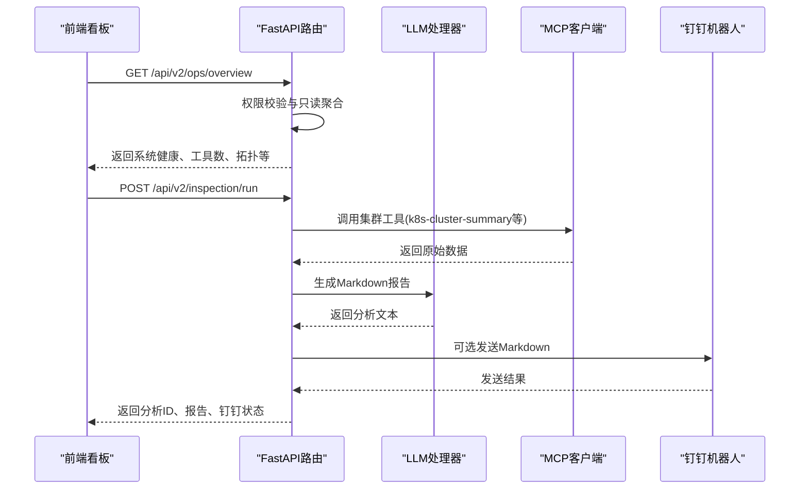

图表来源
- [backend/src/api/v2/endpoints/ops.py:87-313](file://backend/src/api/v2/endpoints/ops.py#L87-L313)
- [backend/src/api/v2/endpoints/inspection.py:242-262](file://backend/src/api/v2/endpoints/inspection.py#L242-L262)
- [backend/src/dingtalk/bot.py:412-473](file://backend/src/dingtalk/bot.py#L412-L473)

## 详细组件分析

### 运维总览与只读诊断
- 功能要点
  - 聚合LLM/MCP/钉钉状态，计算健康级别
  - 统计可用工具数量与来源
  - 生成拓扑图与运行时快照
  - 仅返回只读聚合，不触发写操作
- 关键接口
  - GET /api/v2/ops/overview：返回运维总览与健康状态
- 数据来源
  - 运行时容器、MCP客户端、LLM处理器、钉钉机器人

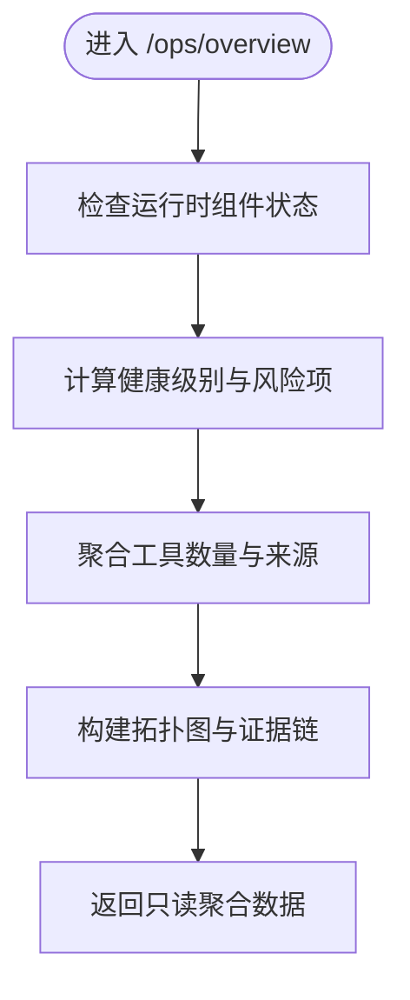

图表来源
- [backend/src/api/v2/endpoints/ops.py:87-313](file://backend/src/api/v2/endpoints/ops.py#L87-L313)

章节来源
- [backend/src/api/v2/endpoints/ops.py:87-313](file://backend/src/api/v2/endpoints/ops.py#L87-L313)

### 巡检与报告
- 功能要点
  - 支持命名空间范围、深度查询、摘要类型、异常检测、输出大小限制
  - 主工具失败时自动回退到备用工具组合
  - LLM生成Markdown报告，支持钉钉分片推送
- 关键接口
  - POST /api/v2/inspection/run：执行巡检并返回分析结果与钉钉状态
- 参数与选项
  - scope：命名空间/深度
  - options：是否推送钉钉、摘要类型、是否包含异常、最大输出KB、可选覆盖模型

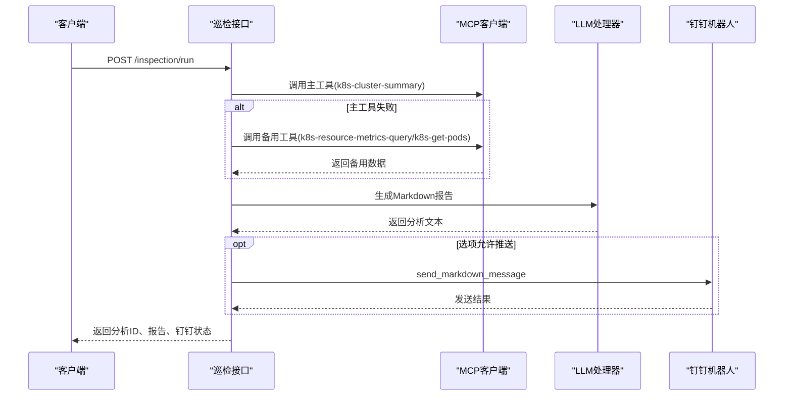

图表来源
- [backend/src/api/v2/endpoints/inspection.py:66-196](file://backend/src/api/v2/endpoints/inspection.py#L66-L196)
- [backend/src/dingtalk/bot.py:412-473](file://backend/src/dingtalk/bot.py#L412-L473)

章节来源
- [backend/src/api/v2/endpoints/inspection.py:66-262](file://backend/src/api/v2/endpoints/inspection.py#L66-L262)

### 资源告警与通知
- 功能要点
  - 接收来自K8s MCP服务器的资源告警数据
  - 异步LLM分析与钉钉通知，支持统计与测试
  - 紧急度计算与退化分析
- 关键接口
  - POST /api/v2/alerts/resource：处理资源告警
  - GET /api/v2/alerts/stats：获取告警处理统计
  - POST /api/v2/alerts/test：测试告警处理
- 数据模型
  - ResourceAlertData：资源ID、指标、时间戳、来源、阈值、利用率
  - AlertProcessResult：处理结果与耗时

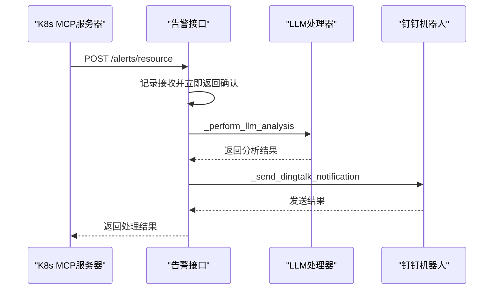

图表来源
- [backend/src/api/v2/endpoints/alerts.py:92-184](file://backend/src/api/v2/endpoints/alerts.py#L92-L184)
- [backend/src/api/v2/endpoints/alerts.py:186-270](file://backend/src/api/v2/endpoints/alerts.py#L186-L270)
- [backend/src/api/v2/endpoints/alerts.py:437-513](file://backend/src/api/v2/endpoints/alerts.py#L437-L513)

章节来源
- [backend/src/api/v2/endpoints/alerts.py:92-692](file://backend/src/api/v2/endpoints/alerts.py#L92-L692)

### 操作审计
- 功能要点
  - 异步记录API访问与操作，支持actor、action、resource、result等维度查询
  - 敏感信息脱敏
- 关键接口
  - GET /api/v2/audit/logs：分页查询审计日志

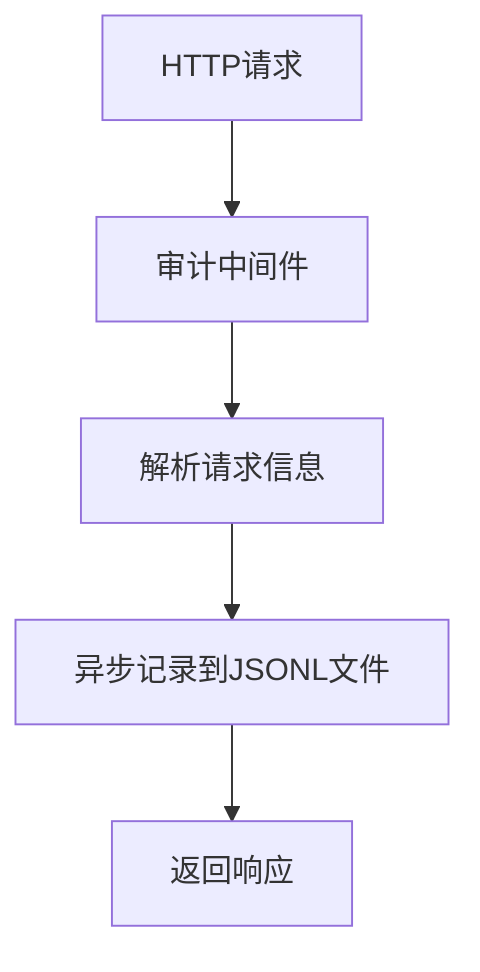

图表来源
- [backend/main.py:348-395](file://backend/main.py#L348-L395)
- [backend/src/security/audit.py:21-96](file://backend/src/security/audit.py#L21-L96)

章节来源
- [backend/src/api/v2/endpoints/audit.py:14-36](file://backend/src/api/v2/endpoints/audit.py#L14-L36)
- [backend/src/security/audit.py:21-96](file://backend/src/security/audit.py#L21-L96)

### 资源管理与指标更新
- 功能要点
  - 批量更新知识图谱指标，支持并发与时间周期
  - 生成覆盖率报告与分析报告
  - 强制触发指标聚合
- 关键接口
  - POST /api/v2/resources/update-metrics：更新指标并可触发分析报告
  - GET /api/v2/resources/metrics-coverage：获取覆盖率报告
  - POST /api/v2/resources/force-aggregation：强制聚合

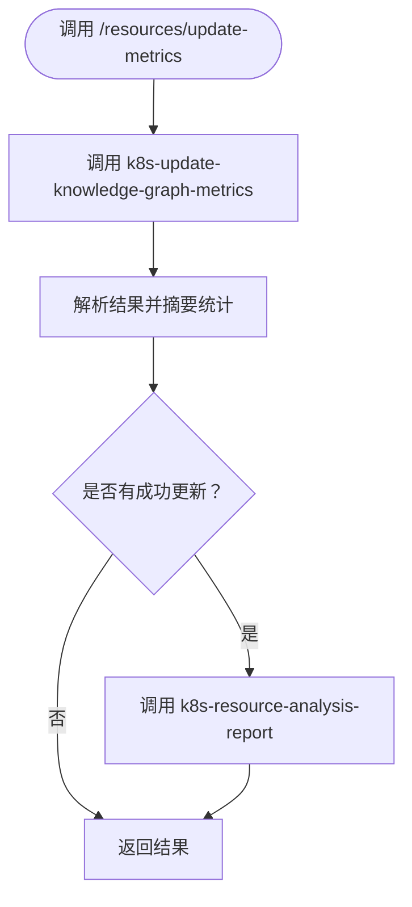

图表来源
- [backend/src/api/v2/endpoints/resources.py:139-285](file://backend/src/api/v2/endpoints/resources.py#L139-L285)

章节来源
- [backend/src/api/v2/endpoints/resources.py:139-433](file://backend/src/api/v2/endpoints/resources.py#L139-L433)

### MCP配置与工具管理
- 功能要点
  - 获取/更新MCP配置、验证配置
  - 获取服务器状态、批量切换服务器纳入AI上下文范围
  - 获取工具列表、启用/禁用工具
  - 连接/断开/重连服务器
- 关键接口
  - GET/POST /api/v2/mcp/config
  - GET /api/v2/mcp/servers/status
  - POST /api/v2/mcp/servers/batch-toggle
  - GET /api/v2/mcp/tools
  - POST /api/v2/mcp/tools/{tool_name}/enable|disable
  - POST /api/v2/mcp/servers/{server_name}/connect|disconnect|reconnect

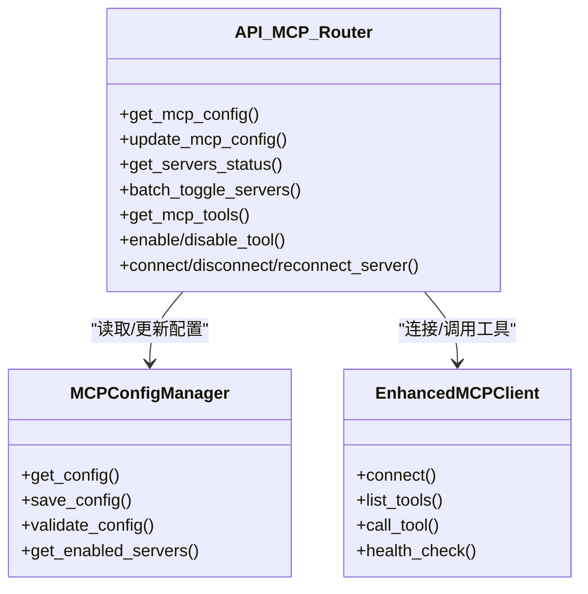

图表来源
- [backend/src/api/v2/endpoints/mcp.py:70-628](file://backend/src/api/v2/endpoints/mcp.py#L70-L628)

章节来源
- [backend/src/api/v2/endpoints/mcp.py:70-628](file://backend/src/api/v2/endpoints/mcp.py#L70-L628)

### 任务调度与编排
- 功能要点
  - 任务的创建、更新、删除、查询、执行历史查询
  - 手动执行、统计信息、运行中任务查询
  - Cron表达式模板与验证、配置模板与验证
  - 维护清理与统计重置
- 关键接口
  - GET/POST /api/v2/scheduler/tasks
  - GET/PUT/DELETE /api/v2/scheduler/tasks/{task_id}
  - GET /api/v2/scheduler/tasks/{task_id}/executions
  - POST /api/v2/scheduler/tasks/{task_id}/run
  - GET /api/v2/scheduler/stats
  - GET /api/v2/scheduler/running
  - GET /api/v2/scheduler/task-types
  - GET /api/v2/scheduler/cron-templates
  - POST /api/v2/scheduler/validate-cron
  - GET /api/v2/scheduler/config/validate/{task_type}
  - GET /api/v2/scheduler/config/template/{task_type}
  - GET /api/v2/scheduler/status
  - POST /api/v2/scheduler/maintenance/cleanup
  - POST /api/v2/scheduler/maintenance/reset-stats

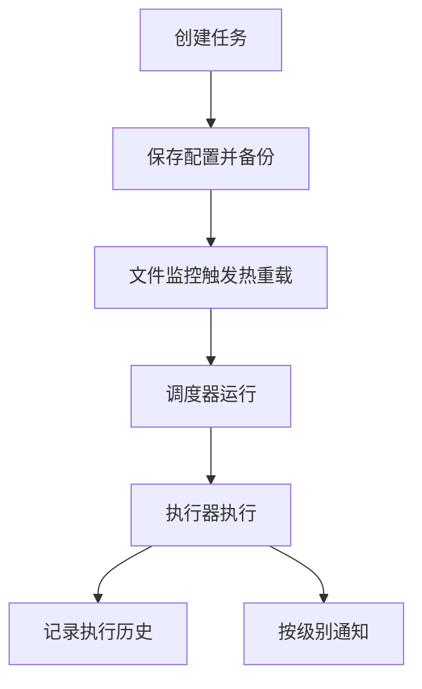

图表来源
- [backend/src/scheduler/task_manager.py:133-657](file://backend/src/scheduler/task_manager.py#L133-L657)

章节来源
- [backend/src/api/v2/endpoints/scheduler.py:98-661](file://backend/src/api/v2/endpoints/scheduler.py#L98-L661)
- [backend/src/scheduler/task_manager.py:133-657](file://backend/src/scheduler/task_manager.py#L133-L657)

### 钉钉机器人集成
- 功能要点
  - Webhook接收与签名验证
  - 普通消息与快捷指令分流处理
  - LLM处理与MCP工具调用
  - Markdown/文本响应与分片推送
  - 主动消息推送与@提醒
- 关键接口
  - Webhook处理：process_webhook
  - 快捷指令：_process_shortcut_command
  - LLM处理：_process_with_llm
  - Markdown推送：send_markdown_message
  - 主动消息：send_proactive_message

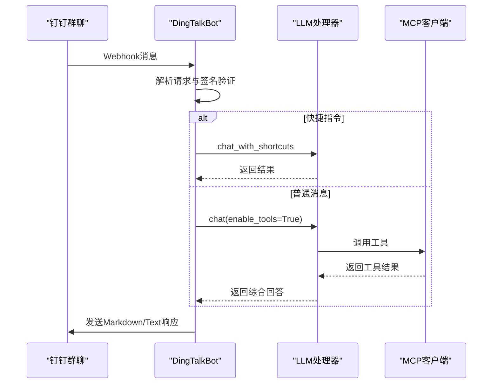

图表来源
- [backend/src/dingtalk/bot.py:64-220](file://backend/src/dingtalk/bot.py#L64-L220)
- [backend/src/dingtalk/bot.py:412-473](file://backend/src/dingtalk/bot.py#L412-L473)

章节来源
- [backend/src/dingtalk/bot.py:51-527](file://backend/src/dingtalk/bot.py#L51-L527)

### 安全与权限
- 功能要点
  - JWT签发与解码、用户角色与权限
  - FastAPI依赖require_permission进行细粒度权限控制
  - 审计中间件记录API访问
- 关键接口
  - require_permission：权限依赖
  - 操作审计中间件：记录actor、action、resource、result

章节来源
- [backend/src/security/auth.py:172-182](file://backend/src/security/auth.py#L172-L182)
- [backend/main.py:348-395](file://backend/main.py#L348-L395)

### 性能监控与调试
- 功能要点
  - 请求追踪：开始/结束记录、端点统计、错误计数
  - 系统指标：CPU、内存、磁盘、活跃连接、请求速率
  - 调试信息：日志队列、上下文数据
- 关键接口
  - performance_monitor：性能监控器
  - debug_collector：调试信息收集器
  - request_tracking：请求追踪上下文管理器

章节来源
- [backend/src/utils/monitoring.py:51-396](file://backend/src/utils/monitoring.py#L51-L396)

## 依赖关系分析
- 组件耦合
  - API v2路由依赖运行时容器获取MCP客户端、LLM处理器、钉钉机器人
  - 巡检与告警依赖MCP工具链与LLM处理器
  - 任务调度依赖TaskManager与文件监控
  - 审计中间件依赖权限服务与审计日志
- 外部依赖
  - 钉钉Webhook、K8s MCP服务器、LLM服务
  - 配置文件：config.env、config/scheduled_tasks.json

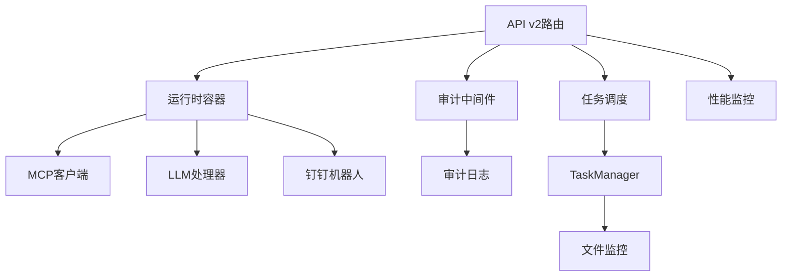

图表来源
- [backend/src/api/v2/router.py:30-80](file://backend/src/api/v2/router.py#L30-L80)
- [backend/main.py:137-270](file://backend/main.py#L137-L270)
- [backend/src/scheduler/task_manager.py:133-177](file://backend/src/scheduler/task_manager.py#L133-L177)

章节来源
- [backend/src/api/v2/router.py:30-80](file://backend/src/api/v2/router.py#L30-L80)
- [backend/main.py:137-270](file://backend/main.py#L137-L270)

## 性能考虑
- 流式响应：/api/v2/chat/stream支持SSE流式输出，降低前端等待时间
- 工具调用：READ_ONLY_MCP_TOOLS白名单限制写操作，避免高风险工具
- 超时与降级：巡检与告警均具备超时与回退策略
- 监控与告警：性能监控器与系统指标采集，便于定位瓶颈
- 配置热重载：任务配置文件监控，减少重启成本

## 故障排查指南
- 健康检查
  - GET /api/v2/health：检查MCP、LLM、钉钉状态
  - GET /health：应用级健康检查
- 常见问题
  - MCP未连接：检查MCP配置与服务器状态
  - LLM不可用：检查LLM配置与提供商可用性
  - 钉钉推送失败：检查Webhook URL与签名配置
  - 巡检/告警失败：查看回退逻辑与日志
- 审计与日志
  - 查询审计日志：GET /api/v2/audit/logs
  - 查看应用日志：logs/app.log
- 任务调度
  - 查看调度器状态：GET /api/v2/scheduler/status
  - 清理旧数据：POST /api/v2/scheduler/maintenance/cleanup

章节来源
- [backend/src/api/v2/router.py:116-157](file://backend/src/api/v2/router.py#L116-L157)
- [backend/main.py:464-474](file://backend/main.py#L464-L474)
- [backend/src/api/v2/endpoints/audit.py:14-36](file://backend/src/api/v2/endpoints/audit.py#L14-L36)
- [backend/src/api/v2/endpoints/scheduler.py:577-601](file://backend/src/api/v2/endpoints/scheduler.py#L577-L601)

## 结论
本运维操作接口通过统一的API v2路由整合了系统状态查询、健康检查、巡检报告、资源告警、审计日志、MCP工具管理、任务调度与钉钉机器人集成，形成完整的运维自动化与可视化体系。配合权限控制与性能监控，能够满足生产环境的可观测性与可操作性需求。

## 附录

### 运维场景示例
- 故障排查
  - 使用/inspection/run执行一次集群巡检，获取Markdown报告并通过钉钉推送
  - 使用/resources/metrics-coverage查看指标覆盖率，定位缺失监控的应用
- 性能优化
  - 使用/resources/update-metrics批量更新指标，触发资源分析报告，按建议进行扩缩容
  - 通过/scheduler创建定时任务，定期执行巡检与指标更新
- 容量规划
  - 结合告警统计与覆盖率报告，评估资源使用趋势与监控覆盖情况
  - 使用/scheduler维护清理策略，控制历史数据规模

### 安全控制与权限管理
- 权限模型
  - ops:read、inspection:run、alerts:read/write、audit:read、resources:read/write、mcp:read/write、scheduler:read/write/run
- 实施方式
  - require_permission依赖在各端点上进行权限校验
  - 审计中间件记录所有API访问

章节来源
- [backend/src/security/auth.py:172-182](file://backend/src/security/auth.py#L172-L182)
- [backend/src/api/v2/router.py:65-74](file://backend/src/api/v2/router.py#L65-L74)

### 配置与环境变量
- 示例配置文件
  - backend/config.env.example：LLM、钉钉、K8s、MCP、脱敏等配置
  - config/scheduled_tasks.example.json：任务调度配置示例
- 关键变量
  - DINGTALK_WEBHOOK_URL、DINGTALK_SECRET：钉钉机器人配置
  - LLM_*：LLM提供商与模型配置
  - INSPECTION_*：定时巡检开关与推送配置
  - SCHEDULER_ENABLED：调度器开关

章节来源
- [backend/config.env.example:1-51](file://backend/config.env.example#L1-L51)
- [config/scheduled_tasks.example.json:1-8](file://config/scheduled_tasks.example.json#L1-L8)