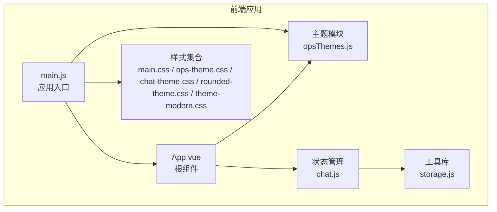
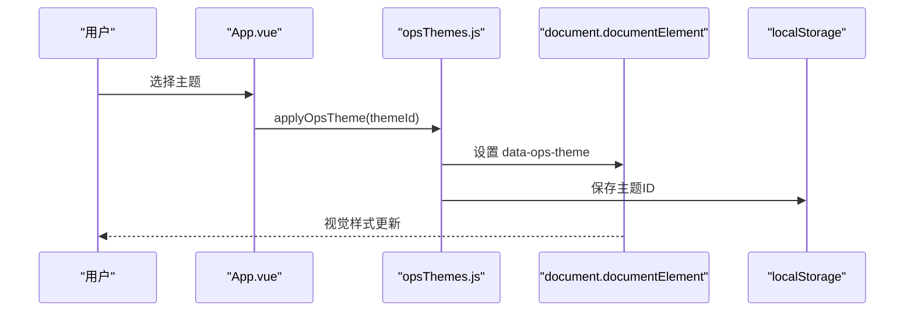
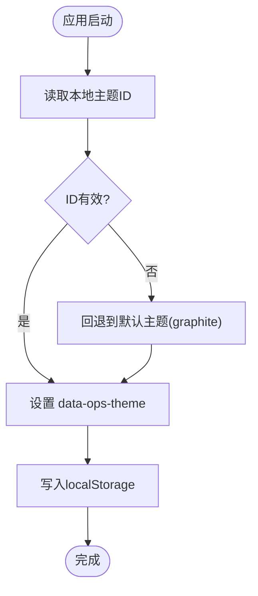
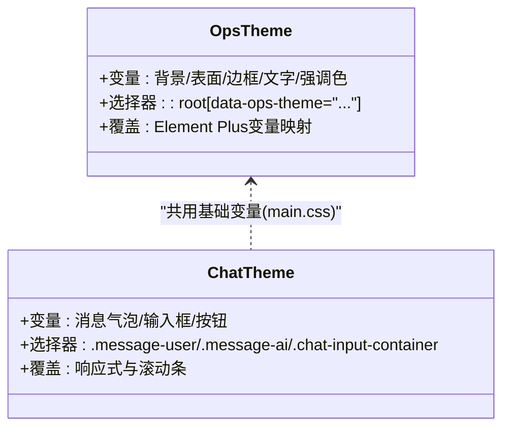
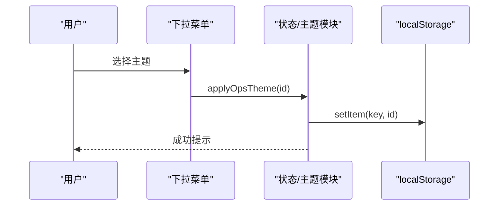
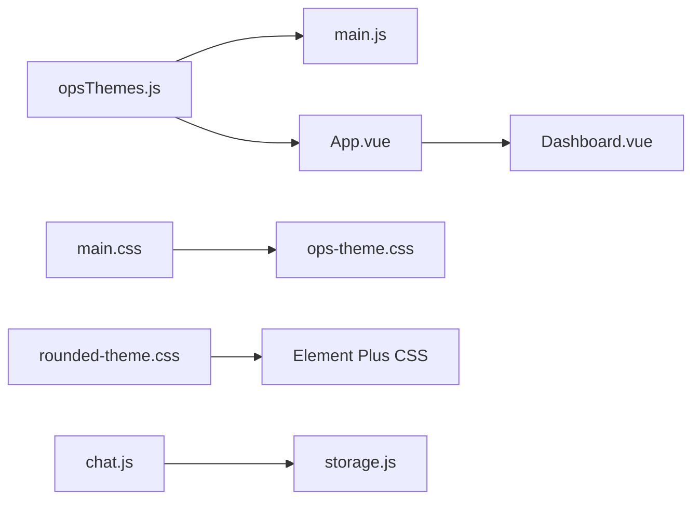

# UI主题与定制

<cite>
**本文档引用的文件**
- [opsThemes.js](file://frontend-v2/src/theme/opsThemes.js)
- [ops-theme.css](file://frontend-v2/src/assets/css/ops-theme.css)
- [chat-theme.css](file://frontend-v2/src/assets/css/chat-theme.css)
- [main.css](file://frontend-v2/src/assets/css/main.css)
- [rounded-theme.css](file://frontend-v2/src/assets/css/rounded-theme.css)
- [theme-modern.css](file://frontend-v2/src/assets/css/theme-modern.css)
- [App.vue](file://frontend-v2/src/App.vue)
- [main.js](file://frontend-v2/src/main.js)
- [storage.js](file://frontend-v2/src/utils/storage.js)
- [chat.js](file://frontend-v2/src/stores/chat.js)
- [Dashboard.vue](file://frontend-v2/src/views/Dashboard.vue)
- [package.json](file://frontend-v2/package.json)
- [vite.config.js](file://frontend-v2/vite.config.js)
</cite>

## 目录
1. [简介](#简介)
2. [项目结构](#项目结构)
3. [核心组件](#核心组件)
4. [架构总览](#架构总览)
5. [详细组件分析](#详细组件分析)
6. [依赖关系分析](#依赖关系分析)
7. [性能考虑](#性能考虑)
8. [故障排除指南](#故障排除指南)
9. [结论](#结论)
10. [附录](#附录)

## 简介
本文件系统性梳理钉钉K8s运维机器人的UI主题与定制体系，重点覆盖以下方面：
- opsThemes主题系统的设计与实现
- Element Plus主题定制与CSS变量映射
- 聊天界面主题与运维主题的差异化设计规范
- 主题切换机制与用户偏好持久化
- CSS模块化与样式组织策略
- 响应式设计与移动端适配
- 颜色系统、字体系统与间距系统的统一管理
- 主题扩展与自定义最佳实践

## 项目结构
前端采用Vite + Vue 3 + Pinia + Element Plus技术栈，主题系统通过CSS变量与运行时dataset驱动，结合本地存储实现用户偏好的持久化。

**图表来源**
- [main.js:1-52](file://frontend-v2/src/main.js#L1-L52)
- [App.vue:128-292](file://frontend-v2/src/App.vue#L128-L292)
- [opsThemes.js:1-33](file://frontend-v2/src/theme/opsThemes.js#L1-L33)
- [main.css:1-151](file://frontend-v2/src/assets/css/main.css#L1-L151)
- [ops-theme.css:1-389](file://frontend-v2/src/assets/css/ops-theme.css#L1-L389)
- [chat-theme.css:1-280](file://frontend-v2/src/assets/css/chat-theme.css#L1-L280)
- [rounded-theme.css:1-272](file://frontend-v2/src/assets/css/rounded-theme.css#L1-L272)
- [theme-modern.css:1-66](file://frontend-v2/src/assets/css/theme-modern.css#L1-L66)
- [chat.js:1-2051](file://frontend-v2/src/stores/chat.js#L1-L2051)
- [storage.js:1-579](file://frontend-v2/src/utils/storage.js#L1-L579)

**章节来源**
- [main.js:1-52](file://frontend-v2/src/main.js#L1-L52)
- [package.json:1-41](file://frontend-v2/package.json#L1-L41)
- [vite.config.js:1-55](file://frontend-v2/vite.config.js#L1-L55)

## 核心组件
- 主题定义与切换
  - 主题常量与默认值：[OPS_THEMES:3-16](file://frontend-v2/src/theme/opsThemes.js#L3-L16)
  - 用户偏好存储键名：[OPS_THEME_STORAGE_KEY](file://frontend-v2/src/theme/opsThemes.js#L1)
  - 获取已保存主题：[getSavedOpsTheme:18-21](file://frontend-v2/src/theme/opsThemes.js#L18-L21)
  - 应用主题并持久化：[applyOpsTheme:23-28](file://frontend-v2/src/theme/opsThemes.js#L23-L28)
  - 主题名称解析：[getThemeName:30-32](file://frontend-v2/src/theme/opsThemes.js#L30-L32)

- 样式系统
  - 运维主题CSS变量与选择器映射：[ops-theme.css:1-389](file://frontend-v2/src/assets/css/ops-theme.css#L1-L389)
  - 聊天界面极简主题：[chat-theme.css:1-280](file://frontend-v2/src/assets/css/chat-theme.css#L1-L280)
  - 基础样式与变量别名：[main.css:1-151](file://frontend-v2/src/assets/css/main.css#L1-L151)
  - Element Plus圆角覆盖：[rounded-theme.css:1-272](file://frontend-v2/src/assets/css/rounded-theme.css#L1-L272)
  - 现代化主题示例：[theme-modern.css:1-66](file://frontend-v2/src/assets/css/theme-modern.css#L1-L66)

- 应用入口与主题初始化
  - 入口文件加载顺序与主题初始化：[main.js:9-15](file://frontend-v2/src/main.js#L9-L15)
  - 根组件集成主题切换UI：[App.vue:133-271](file://frontend-v2/src/App.vue#L133-L271)

- 用户偏好持久化
  - 本地存储封装与错误处理：[storage.js:1-579](file://frontend-v2/src/utils/storage.js#L1-L579)
  - 聊天会话持久化中间件：[chat.js:24-80](file://frontend-v2/src/stores/chat.js#L24-L80)

**章节来源**
- [opsThemes.js:1-33](file://frontend-v2/src/theme/opsThemes.js#L1-L33)
- [ops-theme.css:1-389](file://frontend-v2/src/assets/css/ops-theme.css#L1-L389)
- [chat-theme.css:1-280](file://frontend-v2/src/assets/css/chat-theme.css#L1-L280)
- [main.css:1-151](file://frontend-v2/src/assets/css/main.css#L1-L151)
- [rounded-theme.css:1-272](file://frontend-v2/src/assets/css/rounded-theme.css#L1-L272)
- [theme-modern.css:1-66](file://frontend-v2/src/assets/css/theme-modern.css#L1-L66)
- [main.js:9-15](file://frontend-v2/src/main.js#L9-L15)
- [App.vue:133-271](file://frontend-v2/src/App.vue#L133-L271)
- [storage.js:1-579](file://frontend-v2/src/utils/storage.js#L1-L579)
- [chat.js:24-80](file://frontend-v2/src/stores/chat.js#L24-L80)

## 架构总览
主题系统以CSS变量为核心，通过dataset驱动主题切换，并将用户偏好持久化至localStorage。Element Plus通过CSS变量与自定义覆盖样式实现一致的主题体验。

**图表来源**
- [App.vue:236-242](file://frontend-v2/src/App.vue#L236-L242)
- [opsThemes.js:23-28](file://frontend-v2/src/theme/opsThemes.js#L23-L28)

**章节来源**
- [App.vue:236-242](file://frontend-v2/src/App.vue#L236-L242)
- [opsThemes.js:23-28](file://frontend-v2/src/theme/opsThemes.js#L23-L28)

## 详细组件分析

### 主题系统实现与配置机制
- 主题枚举与默认值
  - 图标化主题ID与名称：[OPS_THEMES:3-16](file://frontend-v2/src/theme/opsThemes.js#L3-L16)
  - 默认回退逻辑：当存储值不存在或非法时回退到graphite
- 主题切换流程
  - 写入dataset：[applyOpsTheme:23-28](file://frontend-v2/src/theme/opsThemes.js#L23-L28)
  - 本地持久化：同上
  - 名称解析：[getThemeName:30-32](file://frontend-v2/src/theme/opsThemes.js#L30-L32)
- 样式映射
  - 运维主题CSS变量：[ops-theme.css:1-75](file://frontend-v2/src/assets/css/ops-theme.css#L1-L75)
  - Element Plus变量映射：同上第55-75行
  - 元素级覆盖：下拉、按钮、表格等组件的圆角与边框覆盖：[rounded-theme.css:1-272](file://frontend-v2/src/assets/css/rounded-theme.css#L1-L272)

**图表来源**
- [opsThemes.js:18-28](file://frontend-v2/src/theme/opsThemes.js#L18-L28)

**章节来源**
- [opsThemes.js:1-33](file://frontend-v2/src/theme/opsThemes.js#L1-L33)
- [ops-theme.css:1-75](file://frontend-v2/src/assets/css/ops-theme.css#L1-L75)
- [rounded-theme.css:1-272](file://frontend-v2/src/assets/css/rounded-theme.css#L1-L272)

### Element Plus主题定制与CSS变量
- CSS变量映射
  - Element Plus核心变量映射：[ops-theme.css:55-75](file://frontend-v2/src/assets/css/ops-theme.css#L55-L75)
  - 基础变量别名与兼容：[main.css:42-151](file://frontend-v2/src/assets/css/main.css#L42-L151)
- 组件级覆盖
  - 卡片、按钮、输入框、下拉、标签、对话框、消息提示、通知、表格、菜单、分页、开关、进度条、上传、警告框、折叠面板、日期选择器、Popover、下拉菜单等圆角与边框：[rounded-theme.css:1-272](file://frontend-v2/src/assets/css/rounded-theme.css#L1-L272)
- 深色模式支持
  - Element Plus暗色CSS变量引入：[main.js](file://frontend-v2/src/main.js#L5)

**章节来源**
- [ops-theme.css:55-75](file://frontend-v2/src/assets/css/ops-theme.css#L55-L75)
- [main.css:42-151](file://frontend-v2/src/assets/css/main.css#L42-L151)
- [rounded-theme.css:1-272](file://frontend-v2/src/assets/css/rounded-theme.css#L1-L272)
- [main.js:5](file://frontend-v2/src/main.js#L5)

### 聊天界面主题与运维主题差异
- 运维主题（Ops Theme）
  - 以深色为主，强调对比度与可读性，适用于仪表盘与运维场景：[ops-theme.css:1-389](file://frontend-v2/src/assets/css/ops-theme.css#L1-L389)
  - 根元素与大量组件容器的背景/边框/文字色绑定：同上第131-177行
- 聊天主题（Chat Theme）
  - 面向对话的极简风格，突出消息气泡与输入区域的层次感：[chat-theme.css:1-280](file://frontend-v2/src/assets/css/chat-theme.css#L1-L280)
  - 用户消息与AI消息的视觉区分、代码块与表格样式、滚动条与响应式优化

**图表来源**
- [ops-theme.css:1-389](file://frontend-v2/src/assets/css/ops-theme.css#L1-L389)
- [chat-theme.css:1-280](file://frontend-v2/src/assets/css/chat-theme.css#L1-L280)
- [main.css:1-151](file://frontend-v2/src/assets/css/main.css#L1-L151)

**章节来源**
- [ops-theme.css:1-389](file://frontend-v2/src/assets/css/ops-theme.css#L1-L389)
- [chat-theme.css:1-280](file://frontend-v2/src/assets/css/chat-theme.css#L1-L280)
- [main.css:1-151](file://frontend-v2/src/assets/css/main.css#L1-L151)

### 主题切换实现原理与用户偏好保存
- 切换入口
  - 根组件下拉菜单触发：[App.vue:236-242](file://frontend-v2/src/App.vue#L236-L242)
  - 主题选项渲染：同上第54-59行
- 切换流程
  - 调用主题模块应用并持久化：[App.vue](file://frontend-v2/src/App.vue#L239)
  - 主题名称提示：同上第240行
- 偏好持久化
  - 主题ID写入localStorage：[opsThemes.js](file://frontend-v2/src/theme/opsThemes.js#L26)
  - 应用启动时读取并应用：[main.js](file://frontend-v2/src/main.js#L15)

**图表来源**
- [App.vue:236-242](file://frontend-v2/src/App.vue#L236-L242)
- [opsThemes.js:23-28](file://frontend-v2/src/theme/opsThemes.js#L23-L28)

**章节来源**
- [App.vue:236-242](file://frontend-v2/src/App.vue#L236-L242)
- [opsThemes.js:23-28](file://frontend-v2/src/theme/opsThemes.js#L23-L28)
- [main.js:15](file://frontend-v2/src/main.js#L15)

### CSS模块化与样式组织策略
- 文件职责分离
  - 基础与变量：[main.css:1-151](file://frontend-v2/src/assets/css/main.css#L1-L151)
  - 运维主题：[ops-theme.css:1-389](file://frontend-v2/src/assets/css/ops-theme.css#L1-L389)
  - 聊天主题：[chat-theme.css:1-280](file://frontend-v2/src/assets/css/chat-theme.css#L1-L280)
  - Element Plus圆角覆盖：[rounded-theme.css:1-272](file://frontend-v2/src/assets/css/rounded-theme.css#L1-L272)
  - 现代化主题示例：[theme-modern.css:1-66](file://frontend-v2/src/assets/css/theme-modern.css#L1-L66)
- 引入顺序
  - 入口按需引入，确保变量在组件样式之前生效：[main.js:9-12](file://frontend-v2/src/main.js#L9-L12)
- 组件内样式
  - 作用域样式绑定主题变量：[Dashboard.vue:460-475](file://frontend-v2/src/views/Dashboard.vue#L460-L475)

**章节来源**
- [main.css:1-151](file://frontend-v2/src/assets/css/main.css#L1-L151)
- [ops-theme.css:1-389](file://frontend-v2/src/assets/css/ops-theme.css#L1-L389)
- [chat-theme.css:1-280](file://frontend-v2/src/assets/css/chat-theme.css#L1-L280)
- [rounded-theme.css:1-272](file://frontend-v2/src/assets/css/rounded-theme.css#L1-L272)
- [theme-modern.css:1-66](file://frontend-v2/src/assets/css/theme-modern.css#L1-L66)
- [main.js:9-12](file://frontend-v2/src/main.js#L9-L12)
- [Dashboard.vue:460-475](file://frontend-v2/src/views/Dashboard.vue#L460-L475)

### 响应式设计与移动端适配
- 移动端导航
  - 顶部栏与侧边栏在小屏隐藏，使用移动顶部栏替代：[App.vue:418-470](file://frontend-v2/src/App.vue#L418-L470)
- 聊天主题响应式
  - 最大宽度与按钮尺寸调整：[chat-theme.css:265-279](file://frontend-v2/src/assets/css/chat-theme.css#L265-L279)
- 通用表格响应式
  - 屏幕宽度小于768px时的表格优化：[main.css:300-316](file://frontend-v2/src/assets/css/main.css#L300-L316)

**章节来源**
- [App.vue:418-470](file://frontend-v2/src/App.vue#L418-L470)
- [chat-theme.css:265-279](file://frontend-v2/src/assets/css/chat-theme.css#L265-L279)
- [main.css:300-316](file://frontend-v2/src/assets/css/main.css#L300-L316)

### 颜色系统、字体系统与间距系统
- 颜色系统
  - 运维主题变量：[ops-theme.css:1-75](file://frontend-v2/src/assets/css/ops-theme.css#L1-L75)
  - 基础别名与扩展色：[main.css:42-88](file://frontend-v2/src/assets/css/main.css#L42-L88)
  - Element Plus映射：同上第55-75行
- 字体系统
  - 基础字体族与抗锯齿：[main.css:8-14](file://frontend-v2/src/assets/css/main.css#L8-L14)
  - 通用排版优化：同上第397-L406
- 间距系统
  - 圆角与过渡统一：同上第142-L151
  - 通用间距工具类：[main.css:153-176](file://frontend-v2/src/assets/css/main.css#L153-L176)

**章节来源**
- [ops-theme.css:1-75](file://frontend-v2/src/assets/css/ops-theme.css#L1-L75)
- [main.css:8-14](file://frontend-v2/src/assets/css/main.css#L8-L14)
- [main.css:42-88](file://frontend-v2/src/assets/css/main.css#L42-L88)
- [main.css:142-151](file://frontend-v2/src/assets/css/main.css#L142-L151)
- [main.css:153-176](file://frontend-v2/src/assets/css/main.css#L153-L176)

### 主题扩展与自定义方法
- 新增主题步骤
  - 在主题枚举中添加新主题：[opsThemes.js:3-16](file://frontend-v2/src/theme/opsThemes.js#L3-L16)
  - 在运维主题CSS中新增对应`:root[data-ops-theme="..."]`块：[ops-theme.css:1-389](file://frontend-v2/src/assets/css/ops-theme.css#L1-L389)
  - 如需Element Plus覆盖，补充圆角覆盖样式：[rounded-theme.css:1-272](file://frontend-v2/src/assets/css/rounded-theme.css#L1-L272)
- 自定义颜色与变量
  - 基于现有变量别名扩展：[main.css:42-151](file://frontend-v2/src/assets/css/main.css#L42-L151)
  - Element Plus变量映射保持一致：同上第55-75行
- 聊天主题扩展
  - 在聊天主题中增加新的选择器与规则：[chat-theme.css:1-280](file://frontend-v2/src/assets/css/chat-theme.css#L1-L280)

**章节来源**
- [opsThemes.js:3-16](file://frontend-v2/src/theme/opsThemes.js#L3-L16)
- [ops-theme.css:1-389](file://frontend-v2/src/assets/css/ops-theme.css#L1-L389)
- [rounded-theme.css:1-272](file://frontend-v2/src/assets/css/rounded-theme.css#L1-L272)
- [main.css:42-151](file://frontend-v2/src/assets/css/main.css#L42-L151)
- [chat-theme.css:1-280](file://frontend-v2/src/assets/css/chat-theme.css#L1-L280)

## 依赖关系分析
- 主题依赖
  - 主题模块依赖：[opsThemes.js:1-33](file://frontend-v2/src/theme/opsThemes.js#L1-L33)
  - 样式依赖：[main.js:9-12](file://frontend-v2/src/main.js#L9-L12)
- 组件依赖
  - 根组件依赖主题模块与状态管理：[App.vue:133-271](file://frontend-v2/src/App.vue#L133-L271)
  - 视图组件依赖主题变量：[Dashboard.vue:460-475](file://frontend-v2/src/views/Dashboard.vue#L460-L475)
- 构建与打包
  - Vite配置与分包策略：[vite.config.js:35-42](file://frontend-v2/vite.config.js#L35-L42)
  - 依赖声明：[package.json:24-32](file://frontend-v2/package.json#L24-L32)

**图表来源**
- [opsThemes.js:1-33](file://frontend-v2/src/theme/opsThemes.js#L1-L33)
- [main.js:9-12](file://frontend-v2/src/main.js#L9-L12)
- [App.vue:133-271](file://frontend-v2/src/App.vue#L133-L271)
- [main.css:1-151](file://frontend-v2/src/assets/css/main.css#L1-L151)
- [ops-theme.css:1-389](file://frontend-v2/src/assets/css/ops-theme.css#L1-L389)
- [rounded-theme.css:1-272](file://frontend-v2/src/assets/css/rounded-theme.css#L1-L272)
- [Dashboard.vue:460-475](file://frontend-v2/src/views/Dashboard.vue#L460-L475)
- [chat.js:1-2051](file://frontend-v2/src/stores/chat.js#L1-L2051)
- [storage.js:1-579](file://frontend-v2/src/utils/storage.js#L1-L579)

**章节来源**
- [vite.config.js:35-42](file://frontend-v2/vite.config.js#L35-L42)
- [package.json:24-32](file://frontend-v2/package.json#L24-L32)

## 性能考虑
- 样式体积控制
  - Vite分包策略将Element Plus独立打包，减少重复依赖：[vite.config.js:37-41](file://frontend-v2/vite.config.js#L37-L41)
- 主题切换开销
  - 仅修改dataset与CSS变量，避免全量重绘：[opsThemes.js:23-28](file://frontend-v2/src/theme/opsThemes.js#L23-L28)
- 存储与会话
  - 聊天会话持久化采用防抖与批量保存策略，降低I/O频率：[chat.js:12-80](file://frontend-v2/src/stores/chat.js#L12-L80)
  - 存储管理器具备配额监控与备份恢复能力：[storage.js:374-479](file://frontend-v2/src/utils/storage.js#L374-L479)

**章节来源**
- [vite.config.js:35-42](file://frontend-v2/vite.config.js#L35-L42)
- [opsThemes.js:23-28](file://frontend-v2/src/theme/opsThemes.js#L23-L28)
- [chat.js:12-80](file://frontend-v2/src/stores/chat.js#L12-L80)
- [storage.js:374-479](file://frontend-v2/src/utils/storage.js#L374-L479)

## 故障排除指南
- 主题切换无效
  - 检查dataset是否正确设置：[opsThemes.js](file://frontend-v2/src/theme/opsThemes.js#L25)
  - 确认CSS变量是否在目标选择器中生效：[ops-theme.css:131-177](file://frontend-v2/src/assets/css/ops-theme.css#L131-L177)
- 主题名称显示异常
  - 核对主题ID是否在枚举中：[opsThemes.js:3-16](file://frontend-v2/src/theme/opsThemes.js#L3-L16)
  - 解析函数返回值：[getThemeName:30-32](file://frontend-v2/src/theme/opsThemes.js#L30-L32)
- 存储相关问题
  - QuotaExceededError/SecurityError处理：[storage.js:156-162](file://frontend-v2/src/utils/storage.js#L156-L162)
  - 备份与恢复流程：同上第273-L333
- Element Plus样式冲突
  - 检查圆角覆盖是否正确引入：[rounded-theme.css:1-272](file://frontend-v2/src/assets/css/rounded-theme.css#L1-L272)
  - 确保Element Plus暗色CSS已加载：[main.js](file://frontend-v2/src/main.js#L5)

**章节来源**
- [opsThemes.js:25](file://frontend-v2/src/theme/opsThemes.js#L25)
- [ops-theme.css:131-177](file://frontend-v2/src/assets/css/ops-theme.css#L131-L177)
- [opsThemes.js:3-16](file://frontend-v2/src/theme/opsThemes.js#L3-L16)
- [opsThemes.js:30-32](file://frontend-v2/src/theme/opsThemes.js#L30-L32)
- [storage.js:156-162](file://frontend-v2/src/utils/storage.js#L156-L162)
- [storage.js:273-333](file://frontend-v2/src/utils/storage.js#L273-L333)
- [rounded-theme.css:1-272](file://frontend-v2/src/assets/css/rounded-theme.css#L1-L272)
- [main.js:5](file://frontend-v2/src/main.js#L5)

## 结论
该主题系统通过CSS变量与dataset实现了轻量、可维护且高性能的主题切换；结合Element Plus的CSS变量映射与圆角覆盖，保证了组件层面的一致性；配合本地存储与会话持久化中间件，兼顾了用户体验与数据安全。建议在扩展新主题时遵循“变量优先、覆盖最小化”的原则，并在样式文件中明确职责边界，以维持长期可演进性。

## 附录
- 主题变量速查
  - 运维主题关键变量：[ops-theme.css:1-75](file://frontend-v2/src/assets/css/ops-theme.css#L1-L75)
  - 基础变量别名：[main.css:42-151](file://frontend-v2/src/assets/css/main.css#L42-L151)
- 示例主题
  - 现代化主题（玻璃拟态）：[theme-modern.css:1-66](file://frontend-v2/src/assets/css/theme-modern.css#L1-L66)