# Vue.js应用结构

<cite>
**本文档引用的文件**
- [package.json](file://frontend-v2/package.json)
- [vite.config.js](file://frontend-v2/vite.config.js)
- [main.js](file://frontend-v2/src/main.js)
- [App.vue](file://frontend-v2/src/App.vue)
- [router/index.js](file://frontend-v2/src/router/index.js)
- [stores/auth.js](file://frontend-v2/src/stores/auth.js)
- [theme/opsThemes.js](file://frontend-v2/src/theme/opsThemes.js)
- [assets/css/main.css](file://frontend-v2/src/assets/css/main.css)
- [utils/auth.js](file://frontend-v2/src/utils/auth.js)
- [api/client.js](file://frontend-v2/src/api/client.js)
- [views/Login.vue](file://frontend-v2/src/views/Login.vue)
- [stores/chat.js](file://frontend-v2/src/stores/chat.js)
- [components/StreamChat.vue](file://frontend-v2/src/components/StreamChat.vue)
- [start-dev.sh](file://frontend-v2/start-dev.sh)
</cite>

## 目录
1. [简介](#简介)
2. [项目结构](#项目结构)
3. [核心组件](#核心组件)
4. [架构总览](#架构总览)
5. [详细组件分析](#详细组件分析)
6. [依赖关系分析](#依赖关系分析)
7. [性能考虑](#性能考虑)
8. [故障排除指南](#故障排除指南)
9. [结论](#结论)
10. [附录](#附录)

## 简介
本项目是一个基于 Vue.js 3 的钉钉K8s运维机器人前端应用，采用现代化的前端技术栈，集成了 Element Plus UI 库、Pinia 状态管理、Vue Router 路由系统以及 Vite 构建工具。应用提供了运维指挥台、智能对话、自动化任务、配置中心、访问控制和操作日志等核心功能模块，支持多主题切换和深色模式体验。

## 项目结构
前端应用位于 `frontend-v2` 目录下，采用典型的 Vue 3 单页应用结构：

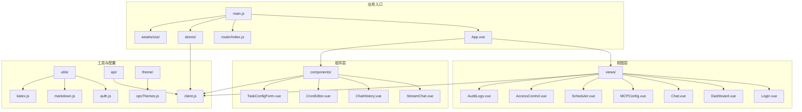

**图表来源**
- [main.js:1-52](file://frontend-v2/src/main.js#L1-L52)
- [router/index.js:1-194](file://frontend-v2/src/router/index.js#L1-L194)
- [App.vue:1-126](file://frontend-v2/src/App.vue#L1-L126)

**章节来源**
- [package.json:1-41](file://frontend-v2/package.json#L1-L41)
- [vite.config.js:1-55](file://frontend-v2/vite.config.js#L1-L55)

## 核心组件
本节详细介绍应用的核心初始化流程和关键组件。

### 应用初始化流程
应用启动时的完整初始化序列如下：

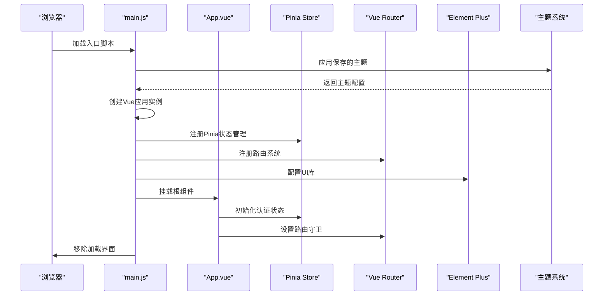

**图表来源**
- [main.js:17-44](file://frontend-v2/src/main.js#L17-L44)
- [App.vue:283-291](file://frontend-v2/src/App.vue#L283-L291)

### 插件注册与全局配置
应用在启动时注册了以下核心插件：

1. **Pinia 状态管理**：提供响应式状态管理和持久化存储
2. **Vue Router 路由系统**：支持路由守卫和权限控制
3. **Element Plus UI 库**：提供丰富的组件库和主题系统

**章节来源**
- [main.js:20-31](file://frontend-v2/src/main.js#L20-L31)

### 全局错误处理机制
应用实现了全局错误处理，确保应用稳定性：

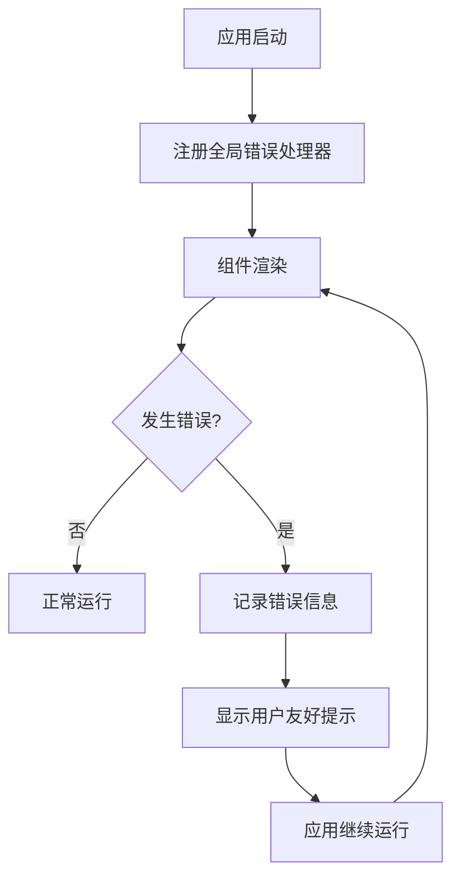

**图表来源**
- [main.js:33-37](file://frontend-v2/src/main.js#L33-L37)

**章节来源**
- [main.js:33-37](file://frontend-v2/src/main.js#L33-L37)

## 架构总览
应用采用模块化的架构设计，各模块职责清晰：

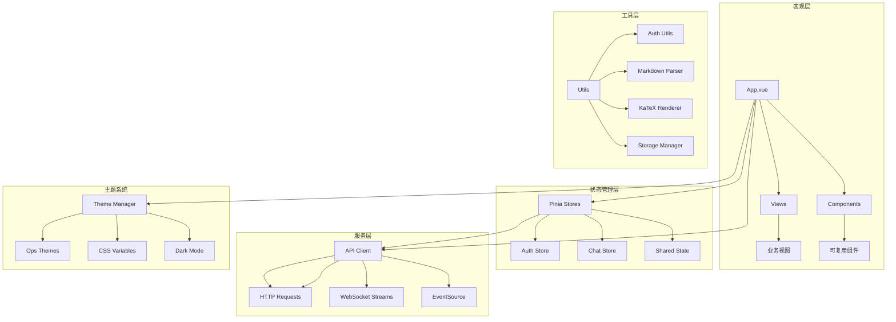

**图表来源**
- [App.vue:128-292](file://frontend-v2/src/App.vue#L128-L292)
- [stores/auth.js:19-129](file://frontend-v2/src/stores/auth.js#L19-L129)
- [api/client.js:102-174](file://frontend-v2/src/api/client.js#L102-L174)

## 详细组件分析

### Element Plus UI 集成与配置
应用深度集成了 Element Plus UI 库，实现了完整的主题定制和组件样式系统：

#### 主题配置
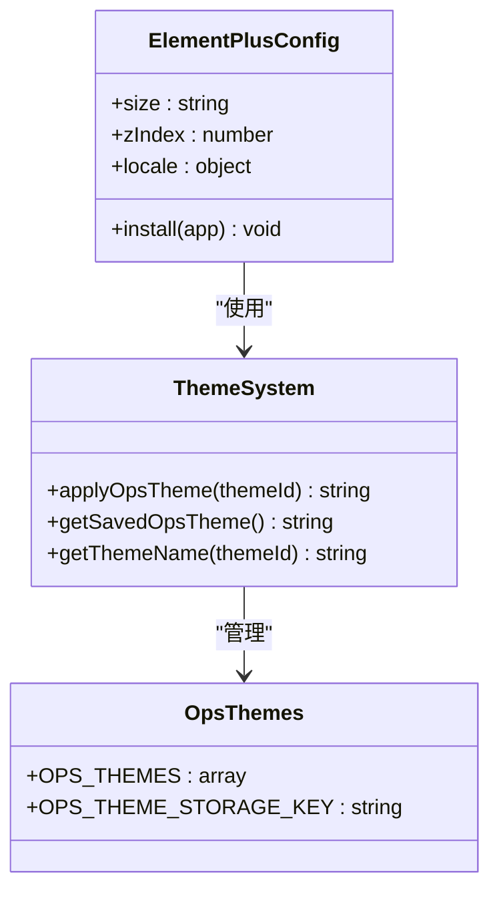

**图表来源**
- [main.js:26-31](file://frontend-v2/src/main.js#L26-L31)
- [theme/opsThemes.js:1-33](file://frontend-v2/src/theme/opsThemes.js#L1-L33)

#### 组件样式定制
应用通过 CSS 变量系统实现了统一的主题风格：

**章节来源**
- [main.js:26-31](file://frontend-v2/src/main.js#L26-L31)
- [theme/opsThemes.js:18-28](file://frontend-v2/src/theme/opsThemes.js#L18-L28)

### Pinia 状态管理集成
应用使用 Pinia 实现了模块化的状态管理：

#### 认证状态管理
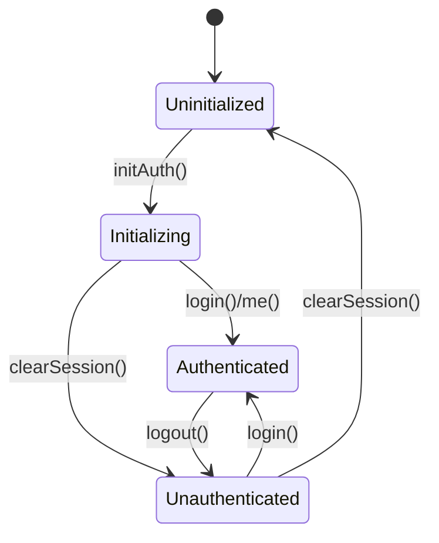

**图表来源**
- [stores/auth.js:81-100](file://frontend-v2/src/stores/auth.js#L81-L100)

#### 聊天状态管理
应用实现了复杂的聊天状态管理，支持流式消息处理：

**章节来源**
- [stores/auth.js:19-129](file://frontend-v2/src/stores/auth.js#L19-L129)
- [stores/chat.js:82-800](file://frontend-v2/src/stores/chat.js#L82-L800)

### Vue Router 配置与路由守卫
应用的路由系统实现了完善的权限控制和导航管理：

#### 路由配置
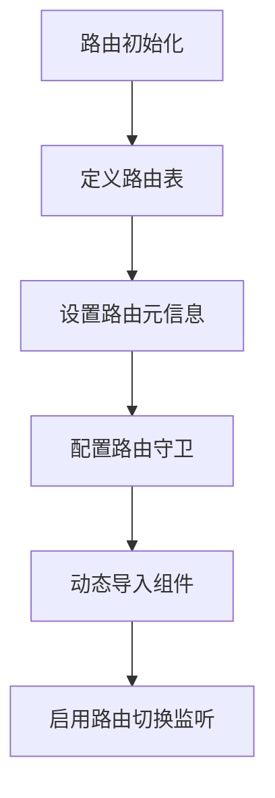

**图表来源**
- [router/index.js:12-146](file://frontend-v2/src/router/index.js#L12-L146)

#### 路由守卫机制
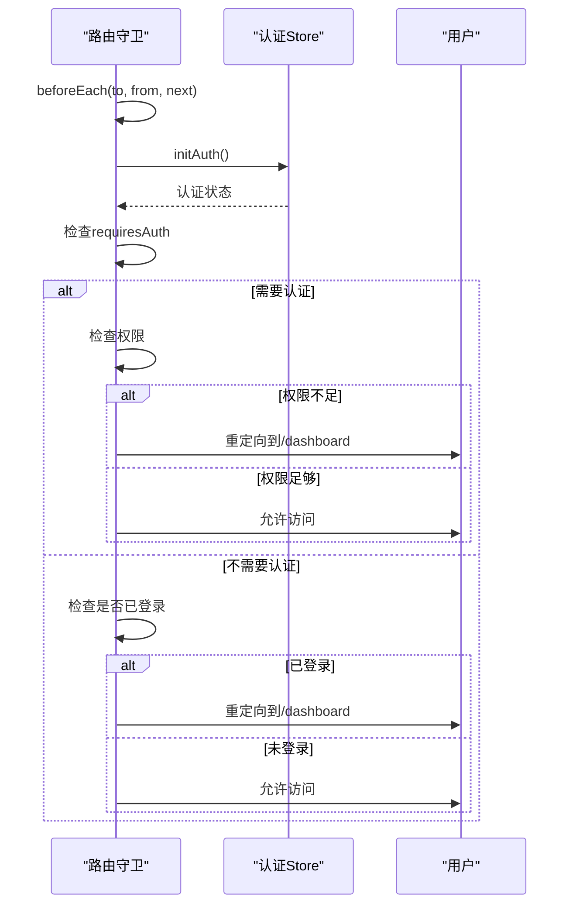

**图表来源**
- [router/index.js:148-186](file://frontend-v2/src/router/index.js#L148-L186)

**章节来源**
- [router/index.js:148-186](file://frontend-v2/src/router/index.js#L148-L186)

### Vite 构建工具配置
应用使用 Vite 作为构建工具，提供了高效的开发体验：

#### 开发服务器配置
```mermaid
flowchart TD
A[Vite配置] --> B[开发服务器]
B --> C[端口3000]
B --> D[代理配置]
D --> E[/api -> 8000]
D --> F[/dingtalk -> 8000]
A --> G[构建配置]
G --> H[输出目录 ../backend/static/spa]
G --> I[手动分包策略]
I --> J[vendor: vue, router, pinia]
I --> K[elementplus: element-plus]
```

**图表来源**
- [vite.config.js:13-29](file://frontend-v2/vite.config.js#L13-L29)
- [vite.config.js:30-47](file://frontend-v2/vite.config.js#L30-L47)

**章节来源**
- [vite.config.js:13-54](file://frontend-v2/vite.config.js#L13-L54)

### 全局CSS样式与主题系统
应用实现了完整的主题系统，支持多主题切换和深色模式：

#### 主题变量系统
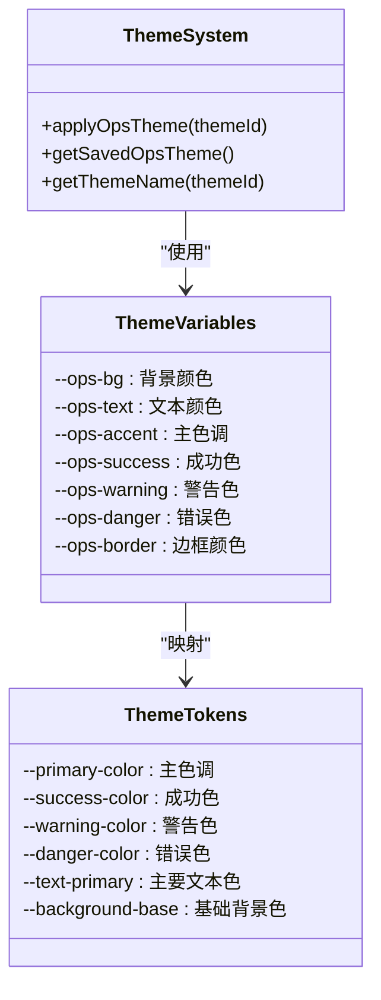

**图表来源**
- [assets/css/main.css:42-151](file://frontend-v2/src/assets/css/main.css#L42-L151)
- [theme/opsThemes.js:18-32](file://frontend-v2/src/theme/opsThemes.js#L18-L32)

**章节来源**
- [assets/css/main.css:42-151](file://frontend-v2/src/assets/css/main.css#L42-L151)
- [theme/opsThemes.js:18-32](file://frontend-v2/src/theme/opsThemes.js#L18-L32)

### 应用启动流程详解
应用的启动流程经过精心设计，确保了良好的用户体验：

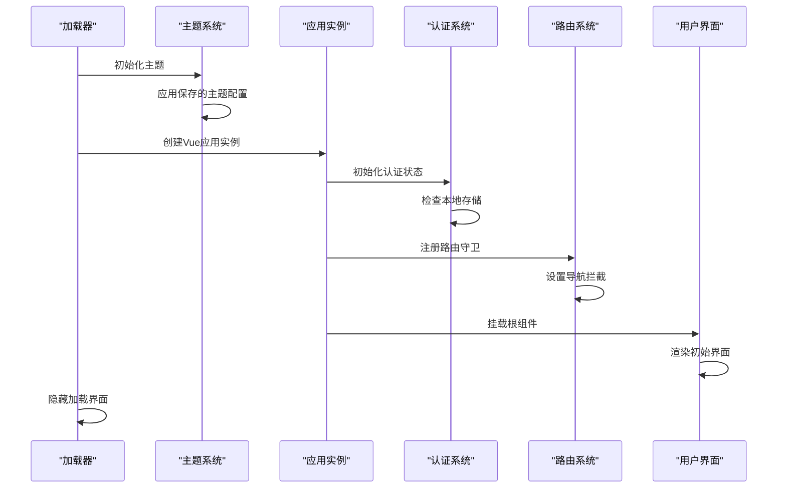

**图表来源**
- [main.js:17-44](file://frontend-v2/src/main.js#L17-L44)
- [App.vue:283-291](file://frontend-v2/src/App.vue#L283-L291)

**章节来源**
- [main.js:17-44](file://frontend-v2/src/main.js#L17-L44)

## 依赖关系分析

### 核心依赖关系
```mermaid
graph TB
subgraph "运行时依赖"
A[vue@^3.4.0] --> B[Vue 3 Runtime]
C[pinia@^2.1.0] --> D[状态管理]
E[vue-router@^4.2.0] --> F[路由管理]
G[element-plus@^2.4.0] --> H[UI组件库]
I[axios@^1.6.0] --> J[HTTP客户端]
end
subgraph "开发依赖"
K[@vitejs/plugin-vue@^4.5.0] --> L[Vite插件]
M[vite@^5.0.0] --> N[构建工具]
O[@iconify/vue@^4.1.0] --> P[图标组件]
end
subgraph "应用层"
Q[main.js] --> A
Q --> C
Q --> E
Q --> G
Q --> I
R[router/index.js] --> E
S[stores/] --> C
T[api/client.js] --> I
end
```

**图表来源**
- [package.json:24-39](file://frontend-v2/package.json#L24-L39)

### 组件间依赖关系
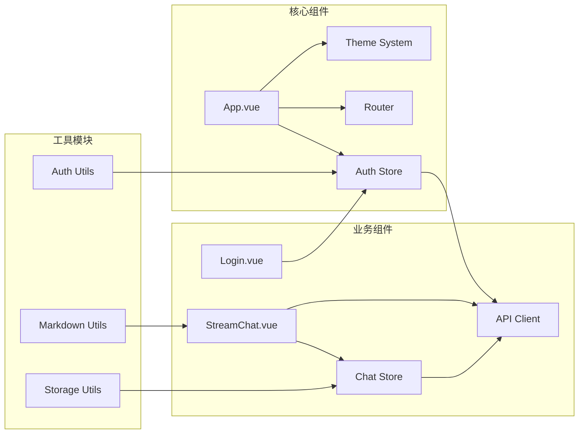

**图表来源**
- [App.vue:128-142](file://frontend-v2/src/App.vue#L128-L142)
- [views/Login.vue:87-98](file://frontend-v2/src/views/Login.vue#L87-L98)
- [components/StreamChat.vue:244-255](file://frontend-v2/src/components/StreamChat.vue#L244-L255)

**章节来源**
- [package.json:24-39](file://frontend-v2/package.json#L24-L39)

## 性能考虑
应用在性能方面采用了多项优化策略：

### 代码分割与懒加载
- 路由级别的组件懒加载，减少首屏加载时间
- 手动分包策略，将核心依赖分离到独立chunk
- Element Plus 按需加载，避免全量引入

### 状态管理优化
- Pinia Store 的响应式数据管理
- 会话状态的持久化存储
- 防抖和批处理机制减少不必要的重渲染

### 网络请求优化
- Axios 拦截器统一处理请求和响应
- 超时配置和重试机制
- 流式数据处理支持长时间运行的操作

## 故障排除指南

### 常见问题与解决方案

#### 认证相关问题
- **登录失败**：检查用户名密码是否正确，确认后端服务正常运行
- **会话过期**：应用会在后台自动检测并清理过期会话
- **权限不足**：检查用户角色和权限配置

#### 路由导航问题
- **页面空白**：检查路由守卫逻辑和认证状态
- **循环重定向**：检查路由元信息配置
- **权限控制异常**：确认权限检查逻辑和用户状态

#### API 请求问题
- **跨域问题**：检查 Vite 代理配置
- **认证失败**：确认 Token 存储和请求头设置
- **网络超时**：调整超时配置或检查网络连接

**章节来源**
- [api/client.js:111-174](file://frontend-v2/src/api/client.js#L111-L174)
- [router/index.js:148-186](file://frontend-v2/src/router/index.js#L148-L186)

## 结论
本项目展示了现代 Vue.js 应用的最佳实践，通过合理的架构设计和组件化开发，实现了功能丰富、性能优良的运维机器人前端应用。应用采用的技术栈成熟稳定，状态管理清晰，路由控制完善，主题系统灵活，为后续的功能扩展和维护奠定了良好的基础。

## 附录

### 开发环境配置
- **Node.js 版本要求**：>=20 <23
- **NPM 版本要求**：>=10 <12
- **开发服务器端口**：3000
- **后端API端口**：8000

### 生产环境部署
- **构建输出目录**：../backend/static/spa
- **基础路径**：/spa/
- **代码分割策略**：手动分包优化
- **源码映射**：生产环境关闭

**章节来源**
- [package.json:6-9](file://frontend-v2/package.json#L6-L9)
- [vite.config.js:30-47](file://frontend-v2/vite.config.js#L30-L47)
- [start-dev.sh:14-19](file://frontend-v2/start-dev.sh#L14-L19)