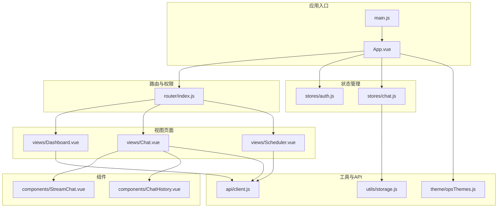
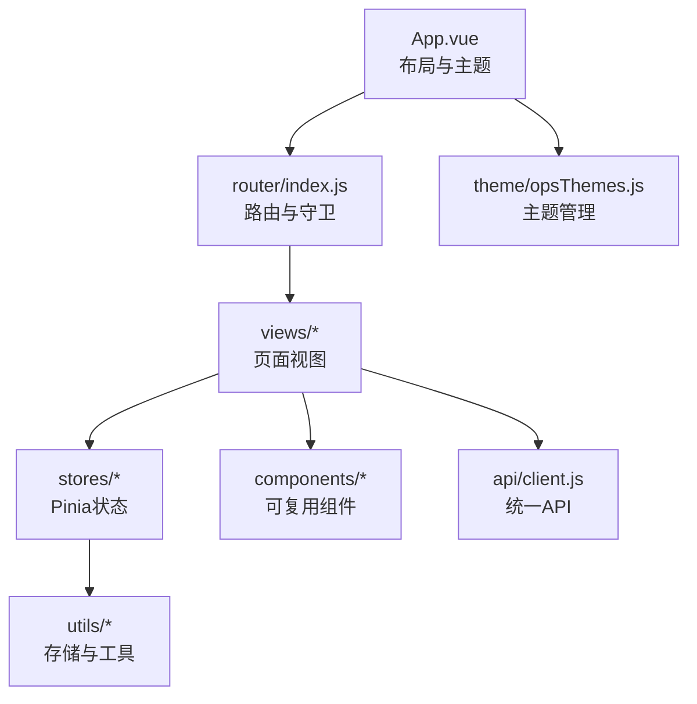
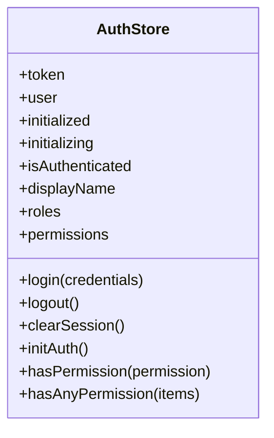
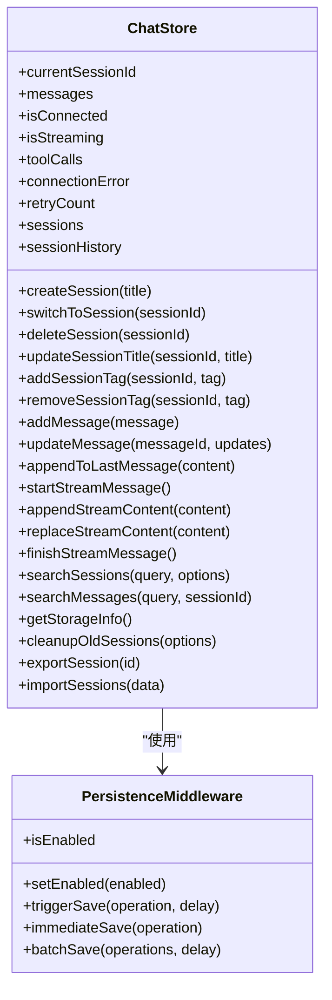
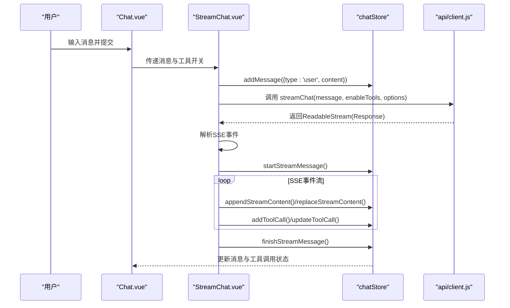
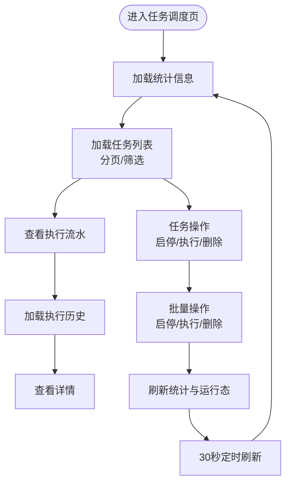
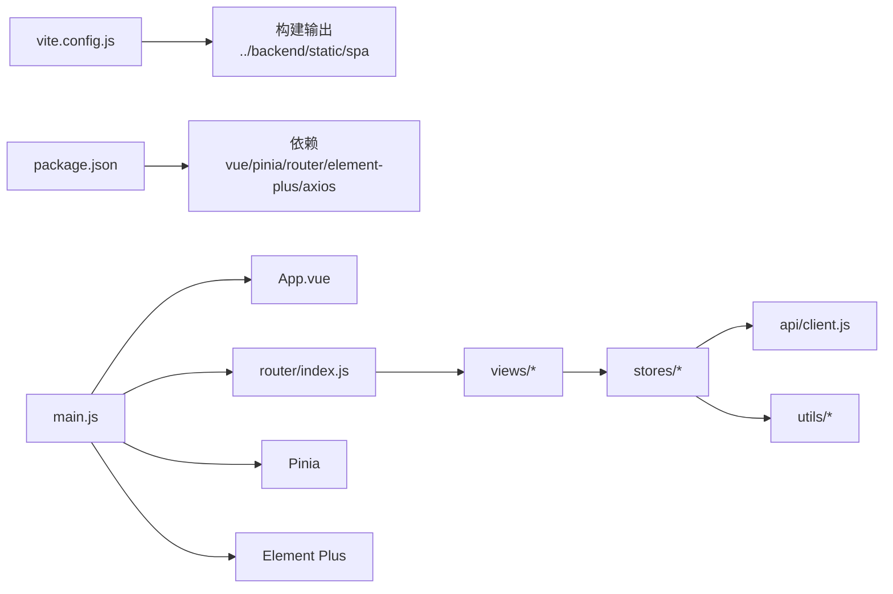

# 前端架构

<cite>
**本文档引用的文件**
- [package.json](file://frontend-v2/package.json)
- [vite.config.js](file://frontend-v2/vite.config.js)
- [main.js](file://frontend-v2/src/main.js)
- [App.vue](file://frontend-v2/src/App.vue)
- [router/index.js](file://frontend-v2/src/router/index.js)
- [stores/auth.js](file://frontend-v2/src/stores/auth.js)
- [stores/chat.js](file://frontend-v2/src/stores/chat.js)
- [views/Chat.vue](file://frontend-v2/src/views/Chat.vue)
- [views/Dashboard.vue](file://frontend-v2/src/views/Dashboard.vue)
- [views/Scheduler.vue](file://frontend-v2/src/views/Scheduler.vue)
- [components/StreamChat.vue](file://frontend-v2/src/components/StreamChat.vue)
- [components/ChatHistory.vue](file://frontend-v2/src/components/ChatHistory.vue)
- [utils/storage.js](file://frontend-v2/src/utils/storage.js)
- [api/client.js](file://frontend-v2/src/api/client.js)
- [theme/opsThemes.js](file://frontend-v2/src/theme/opsThemes.js)
</cite>

## 目录
1. [简介](#简介)
2. [项目结构](#项目结构)
3. [核心组件](#核心组件)
4. [架构总览](#架构总览)
5. [详细组件分析](#详细组件分析)
6. [依赖关系分析](#依赖关系分析)
7. [性能考虑](#性能考虑)
8. [故障排除指南](#故障排除指南)
9. [结论](#结论)
10. [附录](#附录)

## 简介
本文件面向钉钉K8s运维机器人的前端架构，基于Vue.js 3 + Pinia + Vue Router + Element Plus，构建现代化的运维指挥与智能对话界面。系统采用模块化设计，围绕状态管理（Pinia）、路由守卫与权限控制、组件化UI、流式聊天与任务调度等核心能力展开，提供可审计、可追踪、可扩展的前端体验。

## 项目结构
前端位于 `frontend-v2/` 目录，采用典型的Vue 3单页应用结构：
- 入口与应用初始化：main.js、App.vue
- 路由与权限：router/index.js
- 状态管理：stores/{auth, chat}.js
- 视图页面：views/{Chat,DashBoard,Scheduler}.vue
- 可复用组件：components/{StreamChat, ChatHistory, ...}.vue
- 工具与API：utils/{storage}.js、api/client.js
- 主题与样式：theme/opsThemes.js、assets/css/*.css
- 构建配置：vite.config.js、package.json

**图表来源**
- [main.js:1-52](file://frontend-v2/src/main.js#L1-L52)
- [App.vue:1-126](file://frontend-v2/src/App.vue#L1-L126)
- [router/index.js:1-194](file://frontend-v2/src/router/index.js#L1-L194)
- [stores/auth.js:1-130](file://frontend-v2/src/stores/auth.js#L1-L130)
- [stores/chat.js:1-800](file://frontend-v2/src/stores/chat.js#L1-L800)
- [views/Chat.vue:1-443](file://frontend-v2/src/views/Chat.vue#L1-L443)
- [views/Dashboard.vue:1-235](file://frontend-v2/src/views/Dashboard.vue#L1-L235)
- [views/Scheduler.vue:1-332](file://frontend-v2/src/views/Scheduler.vue#L1-L332)
- [components/StreamChat.vue:1-242](file://frontend-v2/src/components/StreamChat.vue#L1-L242)
- [components/ChatHistory.vue:1-299](file://frontend-v2/src/components/ChatHistory.vue#L1-L299)
- [utils/storage.js:1-579](file://frontend-v2/src/utils/storage.js#L1-L579)
- [api/client.js:1-865](file://frontend-v2/src/api/client.js#L1-L865)
- [theme/opsThemes.js:1-33](file://frontend-v2/src/theme/opsThemes.js#L1-L33)

**章节来源**
- [package.json:1-41](file://frontend-v2/package.json#L1-L41)
- [vite.config.js:1-55](file://frontend-v2/vite.config.js#L1-L55)
- [main.js:1-52](file://frontend-v2/src/main.js#L1-L52)
- [App.vue:1-126](file://frontend-v2/src/App.vue#L1-L126)

## 核心组件
- 应用壳与布局：App.vue提供侧边栏、顶部导航、面包屑、移动端适配与主题切换。
- 路由与守卫：router/index.js定义页面路由、标题设置、动态权限校验与登录拦截。
- 认证与权限：stores/auth.js封装Token与用户信息持久化、权限判定、会话初始化与失效处理。
- 聊天与会话：stores/chat.js提供会话管理、消息流式处理、工具调用追踪、持久化中间件与搜索索引。
- 页面视图：Dashboard提供运维指挥台概览、Chat提供智能对话与历史管理、Scheduler提供任务调度与执行流水。
- 可复用组件：StreamChat负责流式渲染与SSE事件解析；ChatHistory负责会话历史、搜索与标签管理。
- API与工具：api/client.js统一Axios实例、拦截器、错误处理与调度器API工具；utils/storage.js提供存储管理与配额监控；theme/opsThemes.js提供主题切换。

**章节来源**
- [App.vue:128-292](file://frontend-v2/src/App.vue#L128-L292)
- [router/index.js:12-194](file://frontend-v2/src/router/index.js#L12-L194)
- [stores/auth.js:19-130](file://frontend-v2/src/stores/auth.js#L19-L130)
- [stores/chat.js:82-800](file://frontend-v2/src/stores/chat.js#L82-L800)
- [views/Chat.vue:445-800](file://frontend-v2/src/views/Chat.vue#L445-L800)
- [views/Dashboard.vue:237-457](file://frontend-v2/src/views/Dashboard.vue#L237-L457)
- [views/Scheduler.vue:334-758](file://frontend-v2/src/views/Scheduler.vue#L334-L758)
- [components/StreamChat.vue:244-800](file://frontend-v2/src/components/StreamChat.vue#L244-L800)
- [components/ChatHistory.vue:301-653](file://frontend-v2/src/components/ChatHistory.vue#L301-L653)
- [utils/storage.js:27-579](file://frontend-v2/src/utils/storage.js#L27-L579)
- [api/client.js:102-416](file://frontend-v2/src/api/client.js#L102-L416)
- [theme/opsThemes.js:18-32](file://frontend-v2/src/theme/opsThemes.js#L18-L32)

## 架构总览
前端采用“应用壳 + 路由 + 状态管理 + 视图 + 组件 + 工具”的分层架构：
- 应用壳：集中处理全局主题、用户菜单、导航与布局。
- 路由层：统一设置页面标题、权限校验、登录拦截与重定向。
- 状态层：Pinia Store管理认证与聊天会话状态，提供持久化与中间件。
- 视图层：页面组件负责业务逻辑与数据展示。
- 组件层：可复用组件封装交互与渲染细节。
- 工具层：API封装、存储管理、主题切换与格式化工具。

**图表来源**
- [App.vue:1-126](file://frontend-v2/src/App.vue#L1-L126)
- [router/index.js:148-194](file://frontend-v2/src/router/index.js#L148-L194)
- [stores/chat.js:82-800](file://frontend-v2/src/stores/chat.js#L82-L800)
- [api/client.js:176-416](file://frontend-v2/src/api/client.js#L176-L416)
- [utils/storage.js:27-579](file://frontend-v2/src/utils/storage.js#L27-L579)
- [theme/opsThemes.js:18-32](file://frontend-v2/src/theme/opsThemes.js#L18-L32)

## 详细组件分析

### 认证与权限（Pinia Store）
- 设计要点
  - Token与用户信息持久化，支持登录、登出、会话初始化与失效清理。
  - 权限判定：支持通配符与精确权限匹配，路由守卫结合权限控制页面访问。
  - 初始化状态与并发保护，避免重复初始化。
- 关键实现
  - 认证状态计算属性：isAuthenticated、displayName、roles、permissions。
  - 登录/登出/清空会话流程，配合后端鉴权与401自动失效处理。
  - 与路由守卫协作：动态导入store、初始化认证、权限校验与重定向。

**图表来源**
- [stores/auth.js:19-130](file://frontend-v2/src/stores/auth.js#L19-L130)

**章节来源**
- [stores/auth.js:19-130](file://frontend-v2/src/stores/auth.js#L19-L130)
- [router/index.js:148-194](file://frontend-v2/src/router/index.js#L148-L194)

### 聊天与会话（Pinia Store + 组件）
- 设计要点
  - 会话管理：创建、切换、删除、标题与标签管理，历史列表维护与排序。
  - 消息流式处理：支持SSE事件解析、增量内容更新、工具调用状态追踪。
  - 持久化中间件：防抖保存、批量保存、立即保存、最小保存间隔控制。
  - 搜索与索引：基于词条与会话元数据的索引构建与查询。
  - 存储管理：localStorage/sessionStorage/内存存储三段式降级、配额监控、备份与恢复。
- 关键实现
  - StreamChat组件：SSE流解析、事件分发、工具调用卡片、Markdown渲染与点击处理。
  - ChatHistory组件：会话列表、搜索、过滤、标签管理、导入导出与清空。
  - 聊天视图：命令条、上下文面板、工具开关、设置对话框与存储管理。

**图表来源**
- [stores/chat.js:82-800](file://frontend-v2/src/stores/chat.js#L82-L800)
- [utils/storage.js:27-579](file://frontend-v2/src/utils/storage.js#L27-L579)

**图表来源**
- [views/Chat.vue:564-694](file://frontend-v2/src/views/Chat.vue#L564-L694)
- [components/StreamChat.vue:450-533](file://frontend-v2/src/components/StreamChat.vue#L450-L533)
- [stores/chat.js:694-800](file://frontend-v2/src/stores/chat.js#L694-L800)
- [api/client.js:282-311](file://frontend-v2/src/api/client.js#L282-L311)

**章节来源**
- [stores/chat.js:82-800](file://frontend-v2/src/stores/chat.js#L82-L800)
- [components/StreamChat.vue:244-800](file://frontend-v2/src/components/StreamChat.vue#L244-L800)
- [components/ChatHistory.vue:301-653](file://frontend-v2/src/components/ChatHistory.vue#L301-L653)
- [views/Chat.vue:445-800](file://frontend-v2/src/views/Chat.vue#L445-L800)
- [utils/storage.js:27-579](file://frontend-v2/src/utils/storage.js#L27-L579)

### 任务调度（页面与API）
- 设计要点
  - 任务矩阵：按类型与启用状态筛选、批量操作、分页与状态统计。
  - 执行流水：按任务筛选、刷新流水、查看详情。
  - 运行态监控：调度器、任务管理器、执行器状态与正在运行任务。
  - API工具：格式化、验证、批量操作、可取消请求与重试机制。
- 关键实现
  - 视图组件：命令条、指标面板、侧栏导航、表格与卡片布局。
  - 交互逻辑：任务启停、手动执行、删除确认、批量操作、分页与过滤。
  - 定时刷新：30秒自动刷新统计与运行态。

**图表来源**
- [views/Scheduler.vue:334-758](file://frontend-v2/src/views/Scheduler.vue#L334-L758)
- [api/client.js:334-412](file://frontend-v2/src/api/client.js#L334-L412)

**章节来源**
- [views/Scheduler.vue:334-758](file://frontend-v2/src/views/Scheduler.vue#L334-L758)
- [api/client.js:451-662](file://frontend-v2/src/api/client.js#L451-L662)

### 运维指挥台（页面）
- 设计要点
  - 指令中心：自然语言诊断入口、工具追踪、消息流与证据展示。
  - 上下文栈：指标网格、MCP运行态、拓扑图与风险雷达。
  - 时间线与自动化队列：事故时间线与只读/需确认/已审计的自动化动作。
  - Fallback机制：后端接口不可用时使用本地数据兜底。
- 关键实现
  - 数据归一化：normalizeOverview、normalizeList、normalizeMcpRuntime。
  - 交互：命令提交、打开完整对话、刷新数据与错误提示。

**章节来源**
- [views/Dashboard.vue:237-457](file://frontend-v2/src/views/Dashboard.vue#L237-L457)

### 主题与响应式设计
- 主题系统：OPS_THEMES枚举、主题持久化与应用，支持三种主题切换。
- 响应式布局：移动端顶部栏、侧边栏折叠、网格布局与卡片式设计。
- 样式体系：Element Plus暗色主题、自定义CSS变量与scoped样式隔离。

**章节来源**
- [theme/opsThemes.js:1-33](file://frontend-v2/src/theme/opsThemes.js#L1-L33)
- [App.vue:1-126](file://frontend-v2/src/App.vue#L1-L126)

## 依赖关系分析
- 构建与运行时
  - Vite提供开发服务器、代理与打包，配置别名@指向src目录，输出到后端静态目录。
  - 生产构建启用分包策略（vendor、elementplus），设置base路径与sourcemap策略。
- 依赖生态
  - Vue 3、Pinia、Vue Router、Element Plus为核心UI与状态管理框架。
  - Axios用于REST请求，自定义拦截器与错误处理。
  - Highlight.js、KaTeX、Marked用于富文本与公式渲染。
- 外部集成
  - 代理到后端API与钉钉webhook，开发环境便于联调。

**图表来源**
- [vite.config.js:1-55](file://frontend-v2/vite.config.js#L1-L55)
- [package.json:24-39](file://frontend-v2/package.json#L24-L39)
- [main.js:1-41](file://frontend-v2/src/main.js#L1-L41)

**章节来源**
- [vite.config.js:1-55](file://frontend-v2/vite.config.js#L1-L55)
- [package.json:1-41](file://frontend-v2/package.json#L1-L41)
- [main.js:1-41](file://frontend-v2/src/main.js#L1-L41)

## 性能考虑
- 构建优化
  - 分包策略：将vue、router、pinia与element-plus拆分为独立chunk，提升缓存命中率。
  - 输出目录：构建产物输出到后端静态目录，减少跨域与路径复杂度。
  - Sourcemap：生产默认关闭，兼顾体积与调试成本。
- 运行时优化
  - Pinia持久化中间件：防抖保存、批量保存与最小保存间隔，降低频繁写入。
  - 搜索索引：基于词条与会话元数据的索引，加速会话与消息检索。
  - 组件懒加载：路由组件懒加载，减少首屏体积。
  - 图标与第三方库：按需引入与CDN策略（如Iconify），减少bundle体积。
- 网络与错误处理
  - Axios拦截器统一处理401失效、权限不足与网络错误，避免重复错误提示。
  - SSE流式渲染：增量内容更新与工具调用状态卡片，减少重绘与DOM操作。

[本节为通用指导，无需特定文件引用]

## 故障排除指南
- 认证失效
  - 现象：401错误后自动清理本地Token并跳转登录。
  - 排查：检查本地Token是否存在、后端会话是否过期、路由守卫是否正确触发。
- 聊天流式渲染异常
  - 现象：SSE连接断开、事件解析失败、工具调用状态不更新。
  - 排查：确认后端SSE接口可用性、事件格式一致性、StreamChat事件分发逻辑。
- 存储空间不足
  - 现象：localStorage/sessionStorage写入失败、QuotaExceededError。
  - 排查：清理旧会话、检查配额、启用备份与恢复流程。
- 路由与权限
  - 现象：未登录跳转登录、权限不足跳转首页。
  - 排查：核对路由meta.permission、authStore.hasPermission实现与权限下发。

**章节来源**
- [api/client.js:133-174](file://frontend-v2/src/api/client.js#L133-L174)
- [stores/auth.js:81-101](file://frontend-v2/src/stores/auth.js#L81-L101)
- [components/StreamChat.vue:535-764](file://frontend-v2/src/components/StreamChat.vue#L535-L764)
- [utils/storage.js:141-164](file://frontend-v2/src/utils/storage.js#L141-L164)

## 结论
该前端架构以Vue 3为核心，结合Pinia实现清晰的状态管理，通过路由守卫与权限模型保障安全访问，组件化设计提升了可维护性与复用性。流式聊天与任务调度两大核心场景分别体现了SSE事件处理与REST API集成的最佳实践。配合完善的构建配置与错误处理机制，整体具备良好的可扩展性与可运维性。

## 附录
- 开发与构建
  - 开发：npm脚本启动Vite开发服务器，支持热更新与代理。
  - 构建：Vite打包输出到后端静态目录，配置base路径与分包策略。
- 调试技巧
  - 开启浏览器开发者工具，关注Network面板SSE事件与XHR请求。
  - 利用Pinia Devtools查看store状态与变更。
  - 在App.vue中打印路由变化与认证状态，定位权限问题。
- 最佳实践
  - 组件职责单一，通过props与events通信。
  - Pinia Store集中管理可变状态，避免跨组件共享复杂数据。
  - API封装统一错误处理，避免在视图层分散处理。
  - 使用工具函数与格式化器，保持视图层简洁。

**章节来源**
- [package.json:10-15](file://frontend-v2/package.json#L10-L15)
- [vite.config.js:30-54](file://frontend-v2/vite.config.js#L30-L54)
- [App.vue:273-291](file://frontend-v2/src/App.vue#L273-L291)