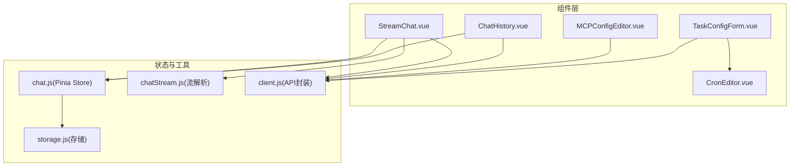
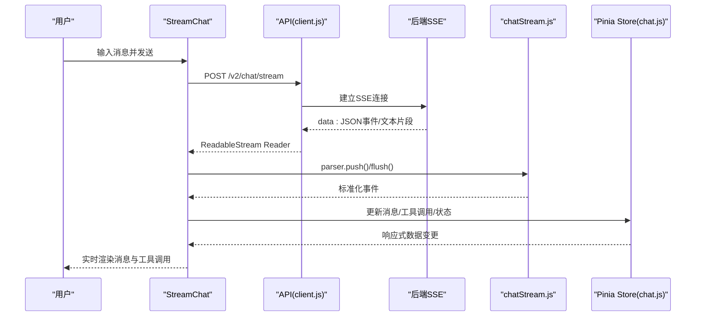
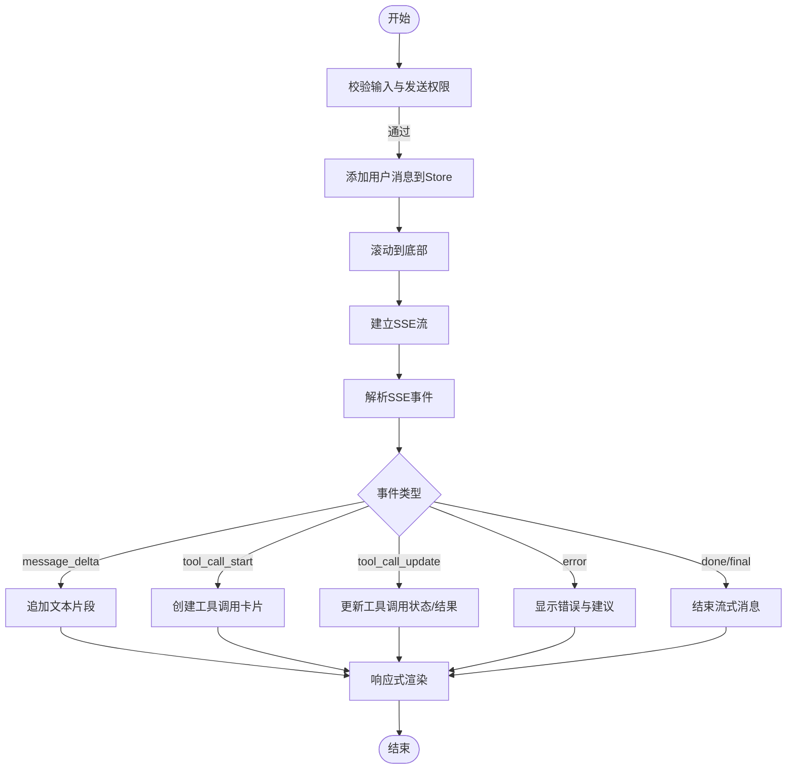
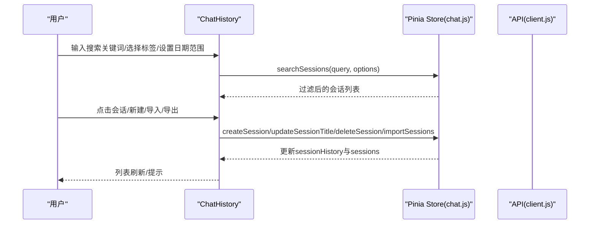
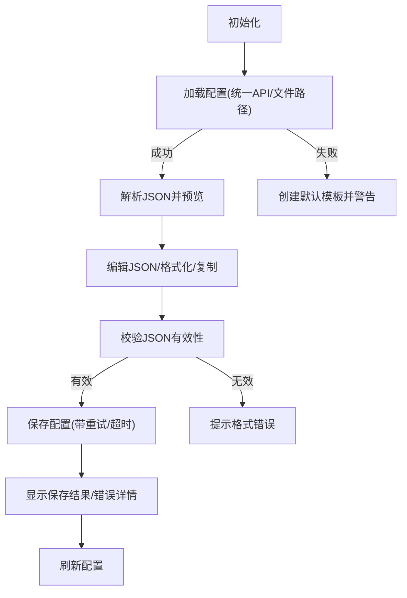
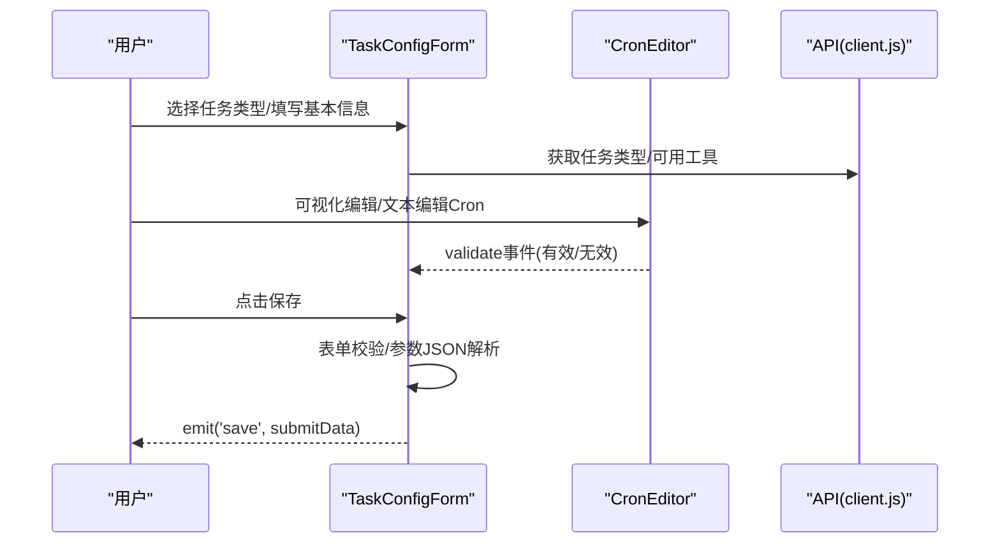
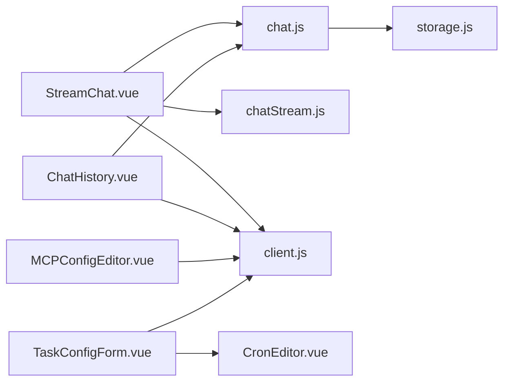

# 核心组件

<cite>
**本文引用的文件**
- [StreamChat.vue](file://frontend-v2/src/components/StreamChat.vue)
- [ChatHistory.vue](file://frontend-v2/src/components/ChatHistory.vue)
- [MCPConfigEditor.vue](file://frontend-v2/src/components/MCPConfigEditor.vue)
- [TaskConfigForm.vue](file://frontend-v2/src/components/TaskConfigForm.vue)
- [chat.js](file://frontend-v2/src/stores/chat.js)
- [chatStream.js](file://frontend-v2/src/shared/stream/chatStream.js)
- [CronEditor.vue](file://frontend-v2/src/components/CronEditor.vue)
- [storage.js](file://frontend-v2/src/utils/storage.js)
- [client.js](file://frontend-v2/src/api/client.js)
</cite>

## 目录
1. [简介](#简介)
2. [项目结构](#项目结构)
3. [核心组件](#核心组件)
4. [架构总览](#架构总览)
5. [详细组件分析](#详细组件分析)
6. [依赖关系分析](#依赖关系分析)
7. [性能考量](#性能考量)
8. [故障排查指南](#故障排查指南)
9. [结论](#结论)
10. [附录](#附录)

## 简介
本文件面向钉钉K8s运维机器人前端核心组件，聚焦以下四个组件：
- StreamChat：实时消息流聊天组件，负责接收后端SSE流、解析事件、渲染消息与工具调用轨迹，并提供用户交互与UI渲染。
- ChatHistory：聊天历史组件，负责会话检索、过滤、标签管理、导入导出与切换。
- MCPConfigEditor：MCP配置编辑器，负责加载/校验/保存MCP配置，提供JSON编辑与预览。
- TaskConfigForm：任务配置表单，负责任务类型选择、Cron表达式校验、表单验证与数据绑定。

文档将从架构、数据流、处理逻辑、组件间通信、事件与插槽、复用与扩展、测试与调试等方面进行深入剖析。

## 项目结构
前端核心组件位于 frontend-v2/src/components，配合 Pinia 状态管理、流式解析器、API 客户端与本地存储工具。

图表来源
- [StreamChat.vue:1-800](file://frontend-v2/src/components/StreamChat.vue#L1-L800)
- [ChatHistory.vue:1-800](file://frontend-v2/src/components/ChatHistory.vue#L1-L800)
- [MCPConfigEditor.vue:1-667](file://frontend-v2/src/components/MCPConfigEditor.vue#L1-L667)
- [TaskConfigForm.vue:1-746](file://frontend-v2/src/components/TaskConfigForm.vue#L1-L746)
- [chat.js:1-800](file://frontend-v2/src/stores/chat.js#L1-L800)
- [chatStream.js:1-129](file://frontend-v2/src/shared/stream/chatStream.js#L1-L129)
- [client.js:1-865](file://frontend-v2/src/api/client.js#L1-L865)
- [storage.js:1-579](file://frontend-v2/src/utils/storage.js#L1-L579)

章节来源
- [StreamChat.vue:1-800](file://frontend-v2/src/components/StreamChat.vue#L1-L800)
- [ChatHistory.vue:1-800](file://frontend-v2/src/components/ChatHistory.vue#L1-L800)
- [MCPConfigEditor.vue:1-667](file://frontend-v2/src/components/MCPConfigEditor.vue#L1-L667)
- [TaskConfigForm.vue:1-746](file://frontend-v2/src/components/TaskConfigForm.vue#L1-L746)
- [chat.js:1-800](file://frontend-v2/src/stores/chat.js#L1-L800)
- [chatStream.js:1-129](file://frontend-v2/src/shared/stream/chatStream.js#L1-L129)
- [client.js:1-865](file://frontend-v2/src/api/client.js#L1-L865)
- [storage.js:1-579](file://frontend-v2/src/utils/storage.js#L1-L579)

## 核心组件
- StreamChat：实时消息流处理、工具调用轨迹展示、Markdown渲染、打字机效果、连接状态与重连、示例问题引导。
- ChatHistory：会话检索与过滤、标签管理、导入导出、新建/复制/删除会话、标题编辑。
- MCPConfigEditor：MCP配置加载/保存、JSON格式校验、配置预览、警告提示、重试与错误处理。
- TaskConfigForm：任务类型选择、Cron表达式可视化/文本编辑、表单验证、任务特定配置、数据绑定与提交。

章节来源
- [StreamChat.vue:1-800](file://frontend-v2/src/components/StreamChat.vue#L1-L800)
- [ChatHistory.vue:1-800](file://frontend-v2/src/components/ChatHistory.vue#L1-L800)
- [MCPConfigEditor.vue:1-667](file://frontend-v2/src/components/MCPConfigEditor.vue#L1-L667)
- [TaskConfigForm.vue:1-746](file://frontend-v2/src/components/TaskConfigForm.vue#L1-L746)

## 架构总览
整体架构围绕“组件-状态-流解析-API-存储”五层协作：
- 组件层：负责UI与交互；StreamChat负责流式渲染；ChatHistory负责历史管理；MCPConfigEditor负责配置编辑；TaskConfigForm负责任务配置。
- 状态层：Pinia Store(chat.js)集中管理消息、会话、工具调用、连接状态、持久化中间件。
- 流解析层：chatStream.js将SSE文本行解析为标准化事件，支持旧格式与新格式兼容。
- API层：client.js统一封装Axios与fetch，处理鉴权、错误、SSE流式聊天、任务调度等。
- 存储层：storage.js提供本地/会话/内存三段式存储与配额监控、备份恢复、元数据追踪。

图表来源
- [StreamChat.vue:473-533](file://frontend-v2/src/components/StreamChat.vue#L473-L533)
- [chatStream.js:87-111](file://frontend-v2/src/shared/stream/chatStream.js#L87-L111)
- [client.js:282-311](file://frontend-v2/src/api/client.js#L282-L311)
- [chat.js:765-800](file://frontend-v2/src/stores/chat.js#L765-L800)

## 详细组件分析

### StreamChat 组件
- 功能要点
  - 实时消息流：通过 fetch + ReadableStream + TextDecoder + 自定义解析器处理SSE。
  - 事件解析：兼容 legacy_content_update 与标准化事件，支持 message_delta、tool_call_*、error、status 等。
  - 工具调用轨迹：按消息聚合工具调用，支持展开/折叠、状态指示、参数/结果/错误展示。
  - Markdown渲染：支持代码块复制、目录锚点平滑滚动。
  - 连接与重连：连接错误时显示提示与重连按钮，维护重试计数。
  - 交互与UI：欢迎面板、示例问题、输入区域、发送按钮、清空、工具开关状态提示。
- 关键流程
  - 发送消息：添加用户消息 → 滚动到底部 → 调用 startStreamChat → 建立SSE → 解析事件 → 更新store → 渲染。
  - 工具调用：tool_call_start 创建卡片，tool_call_update/tool_call_result 更新状态/结果/耗时/错误。
  - 内容更新：__UPDATE_CONTENT__/__END_UPDATE__ 指令触发 replaceStreamContent。
- 组件间通信
  - 通过 Pinia Store(chat.js) 管理消息、工具调用、连接状态。
  - 通过 chatStream.js 解析SSE事件，统一转换为标准化事件。
  - 通过 API(client.js) 的 chat.streamChat 接口发起流式请求。
- Props/Events/Slots
  - Props: autoConnect(Boolean, 默认true)、enableTools(Boolean, 默认true)、mcpContextCount(Number)、mcpTotalCount(Number)、skillId(String, 默认"k8s_readonly")。
  - Emits: 无显式定义，内部通过 store 与父组件通信。
  - Slots: 无插槽。
- 最佳实践
  - 使用 debounce/saveQueue 与持久化中间件减少频繁写入。
  - 对SSE错误进行分类处理，区分网络/认证/业务错误。
  - 工具调用状态与UI解耦，通过 store 管理状态，组件只负责渲染。
  - 文本片段合并与换行折叠，避免渲染抖动。

图表来源
- [StreamChat.vue:450-764](file://frontend-v2/src/components/StreamChat.vue#L450-L764)
- [chatStream.js:35-85](file://frontend-v2/src/shared/stream/chatStream.js#L35-L85)

章节来源
- [StreamChat.vue:1-800](file://frontend-v2/src/components/StreamChat.vue#L1-L800)
- [chatStream.js:1-129](file://frontend-v2/src/shared/stream/chatStream.js#L1-L129)
- [client.js:282-311](file://frontend-v2/src/api/client.js#L282-L311)
- [chat.js:765-800](file://frontend-v2/src/stores/chat.js#L765-L800)

### ChatHistory 组件
- 功能要点
  - 会话列表：按最后活动时间排序，支持标题双击编辑、标签展示。
  - 搜索与过滤：关键词、标签、日期范围、消息数量范围。
  - 标签管理：新增/移除标签、建议标签、批量管理。
  - 导入导出：全部历史、单会话导出、导入文件。
  - 会话操作：新建、复制、删除、重命名、切换。
- 数据管理
  - 通过 Pinia Store(chat.js) 的 sessionHistory 与 sessions 管理。
  - 支持搜索索引构建与回退搜索，提升大体量历史检索性能。
- 组件间通信
  - 通过 emits(session-switched, collapse) 与父组件通信。
  - 通过 API(client.js) 的 scheduler 接口获取模板/验证Cron等（在其他表单中使用）。
- Props/Events/Slots
  - Props: visible(Boolean, 默认true)。
  - Emits: session-switched(String), collapse(void)。
  - Slots: 无。
- 最佳实践
  - 使用防抖与索引优化搜索性能。
  - 标签管理采用对话框，避免列表内嵌复杂交互。
  - 导入导出采用Blob下载，注意文件格式校验。

图表来源
- [ChatHistory.vue:363-652](file://frontend-v2/src/components/ChatHistory.vue#L363-L652)
- [chat.js:534-658](file://frontend-v2/src/stores/chat.js#L534-L658)
- [client.js:334-412](file://frontend-v2/src/api/client.js#L334-L412)

章节来源
- [ChatHistory.vue:1-800](file://frontend-v2/src/components/ChatHistory.vue#L1-L800)
- [chat.js:1-800](file://frontend-v2/src/stores/chat.js#L1-L800)
- [client.js:334-412](file://frontend-v2/src/api/client.js#L334-L412)

### MCPConfigEditor 组件
- 功能要点
  - 配置加载：优先从统一API端点加载，失败则尝试文件路径加载，最终回退到默认模板。
  - JSON编辑：支持格式化、复制、实时校验与警告提示。
  - 配置预览：基本信息、服务器列表、工具列表概览。
  - 保存：带重试与超时控制，返回保存结果与错误详情。
- 数据管理
  - 使用响应式 ref 管理配置JSON、原始配置、错误与警告。
  - 通过 API(client.js) 的 /v2/mcp/config/current 与 /v2/mcp/config/update 接口。
- 组件间通信
  - 通过 emits 与父组件通信（如保存后刷新）。
- Props/Events/Slots
  - Props: 无。
  - Emits: 无。
  - Slots: 无。
- 最佳实践
  - 保存前进行JSON有效性校验，避免无效配置写入。
  - 保存失败时提供详细错误信息与重试机制。
  - 配置缺失关键字段时给出明确警告，指导用户完善。

图表来源
- [MCPConfigEditor.vue:225-480](file://frontend-v2/src/components/MCPConfigEditor.vue#L225-L480)
- [client.js:241-255](file://frontend-v2/src/api/client.js#L241-L255)

章节来源
- [MCPConfigEditor.vue:1-667](file://frontend-v2/src/components/MCPConfigEditor.vue#L1-L667)
- [client.js:241-255](file://frontend-v2/src/api/client.js#L241-L255)

### TaskConfigForm 组件
- 功能要点
  - 基本信息：任务名称、描述、任务类型。
  - 调度配置：Cron表达式可视化/文本编辑、启用状态。
  - 执行配置：超时时间、最大重试、通知级别。
  - 任务特定配置：根据任务类型动态渲染（集群巡检、资源分析、健康监控、自定义工具）。
- 表单验证与数据绑定
  - 使用 Element Plus Form 与 rules 进行必填/范围/格式校验。
  - Cron表达式通过 CronEditor 组件校验，返回验证结果。
  - 自定义任务的工具参数以JSON字符串形式输入，保存前解析为对象。
- 组件间通信
  - 通过 emits(save, cancel) 与父组件通信。
  - 通过 API(client.js) 的 scheduler 接口获取任务类型、模板、验证等。
- Props/Events/Slots
  - Props: task(Object|null), isEditing(Boolean,default=false)。
  - Emits: save(Object), cancel(void)。
  - Slots: 无。
- 最佳实践
  - 任务类型切换时初始化对应配置，避免脏数据。
  - Cron表达式校验失败时给出明确错误提示。
  - 自定义工具参数JSON解析失败时捕获语法错误并提示。

图表来源
- [TaskConfigForm.vue:331-592](file://frontend-v2/src/components/TaskConfigForm.vue#L331-L592)
- [CronEditor.vue:221-446](file://frontend-v2/src/components/CronEditor.vue#L221-L446)
- [client.js:334-412](file://frontend-v2/src/api/client.js#L334-L412)

章节来源
- [TaskConfigForm.vue:1-746](file://frontend-v2/src/components/TaskConfigForm.vue#L1-L746)
- [CronEditor.vue:1-631](file://frontend-v2/src/components/CronEditor.vue#L1-L631)
- [client.js:334-412](file://frontend-v2/src/api/client.js#L334-L412)

## 依赖关系分析
- 组件到状态：StreamChat/ChatHistory 依赖 Pinia Store(chat.js)。
- 组件到流解析：StreamChat 依赖 chatStream.js。
- 组件到API：StreamChat/MCPConfigEditor/TaskConfigForm 依赖 client.js。
- 状态到存储：chat.js 依赖 storage.js 进行持久化与备份恢复。
- 组件到组件：TaskConfigForm 内部使用 CronEditor。

图表来源
- [StreamChat.vue:1-800](file://frontend-v2/src/components/StreamChat.vue#L1-L800)
- [ChatHistory.vue:1-800](file://frontend-v2/src/components/ChatHistory.vue#L1-L800)
- [MCPConfigEditor.vue:1-667](file://frontend-v2/src/components/MCPConfigEditor.vue#L1-L667)
- [TaskConfigForm.vue:1-746](file://frontend-v2/src/components/TaskConfigForm.vue#L1-L746)
- [chat.js:1-800](file://frontend-v2/src/stores/chat.js#L1-L800)
- [chatStream.js:1-129](file://frontend-v2/src/shared/stream/chatStream.js#L1-L129)
- [client.js:1-865](file://frontend-v2/src/api/client.js#L1-L865)
- [storage.js:1-579](file://frontend-v2/src/utils/storage.js#L1-L579)

章节来源
- [StreamChat.vue:1-800](file://frontend-v2/src/components/StreamChat.vue#L1-L800)
- [ChatHistory.vue:1-800](file://frontend-v2/src/components/ChatHistory.vue#L1-L800)
- [MCPConfigEditor.vue:1-667](file://frontend-v2/src/components/MCPConfigEditor.vue#L1-L667)
- [TaskConfigForm.vue:1-746](file://frontend-v2/src/components/TaskConfigForm.vue#L1-L746)
- [chat.js:1-800](file://frontend-v2/src/stores/chat.js#L1-L800)
- [chatStream.js:1-129](file://frontend-v2/src/shared/stream/chatStream.js#L1-L129)
- [client.js:1-865](file://frontend-v2/src/api/client.js#L1-L865)
- [storage.js:1-579](file://frontend-v2/src/utils/storage.js#L1-L579)

## 性能考量
- 流式渲染优化
  - 文本片段合并与换行折叠，避免频繁DOM更新。
  - 工具调用展开状态按消息维度管理，减少全局状态开销。
- 搜索与索引
  - chat.js 提供搜索索引与回退方案，大体量历史场景下显著提升检索性能。
- 存储与持久化
  - storage.js 提供三段式存储与配额监控，自动备份与恢复，降低数据丢失风险。
- API与重试
  - client.js 提供统一错误处理与重试策略，SSE长连接超时设置合理。

[本节为通用性能讨论，无需特定文件引用]

## 故障排查指南
- 流式聊天无响应
  - 检查后端SSE连接与鉴权头；确认 API(client.js) 的 streamChat 是否返回 401 并触发会话失效处理。
  - 查看 StreamChat 中的连接错误提示与重连按钮。
- 工具调用状态异常
  - 确认 chatStream.js 的事件标准化是否正确；检查 store 中 toolCalls 的 id/状态映射。
- 配置保存失败
  - 查看 MCPConfigEditor 的错误详情弹窗；确认 JSON 格式与后端返回的错误信息。
- 任务表单校验失败
  - Cron表达式校验失败时，CronEditor 会弹出错误提示；检查 TaskConfigForm 的 rules 与 validateCronExpression。
- 本地存储异常
  - storage.js 提供详细的错误类型与配额监控，关注 QuotaExceededError/SecurityError 等。

章节来源
- [StreamChat.vue:167-188](file://frontend-v2/src/components/StreamChat.vue#L167-L188)
- [chatStream.js:35-85](file://frontend-v2/src/shared/stream/chatStream.js#L35-L85)
- [client.js:127-174](file://frontend-v2/src/api/client.js#L127-L174)
- [MCPConfigEditor.vue:425-479](file://frontend-v2/src/components/MCPConfigEditor.vue#L425-L479)
- [TaskConfigForm.vue:523-573](file://frontend-v2/src/components/TaskConfigForm.vue#L523-L573)
- [storage.js:141-164](file://frontend-v2/src/utils/storage.js#L141-L164)

## 结论
上述四个核心组件围绕“实时消息流、历史管理、配置编辑、任务配置”四大场景，形成清晰的职责边界与稳定的组件间协作。通过 Pinia Store 统一状态、chatStream.js 标准化事件、client.js 统一封装API与错误处理、storage.js 提供鲁棒存储，整体具备良好的可维护性与扩展性。建议在后续迭代中持续完善事件解析兼容性、搜索索引与性能优化、以及配置/任务的模板化与自动化校验能力。

[本节为总结性内容，无需特定文件引用]

## 附录
- 组件复用与扩展最佳实践
  - 将通用UI模式（如加载/错误/警告）抽象为可复用的弹窗/提示组件。
  - 将事件解析与状态更新逻辑下沉到 store 或工具模块，组件只负责渲染。
  - 为表单与编辑器提供统一的校验与错误提示机制。
- 组件测试与调试技巧
  - 为 StreamChat 提供事件注入测试，模拟 legacy_content_update 与标准化事件。
  - 为 MCPConfigEditor 提供 JSON 有效性与保存失败场景测试。
  - 为 TaskConfigForm 提供不同任务类型的配置初始化与校验测试。
  - 使用浏览器开发者工具的 Network 面板观察SSE与API请求，结合 Console 查看错误与日志。

[本节为通用建议，无需特定文件引用]