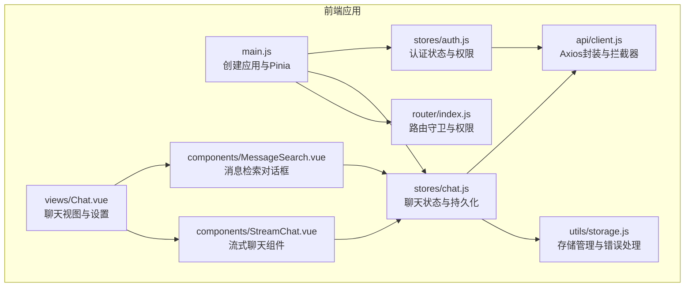
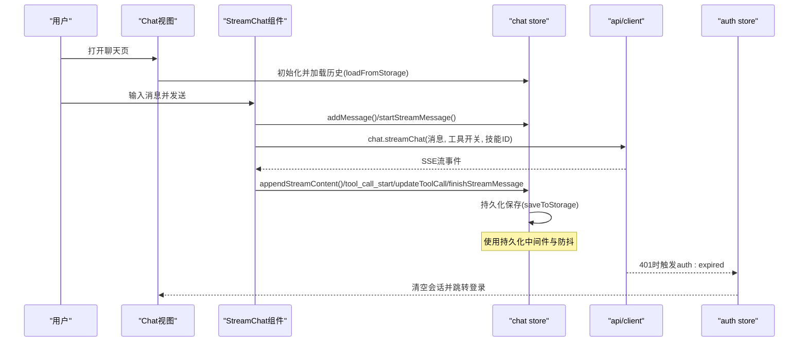
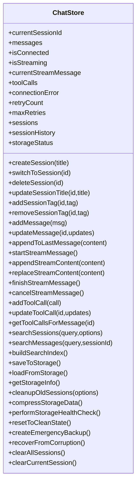
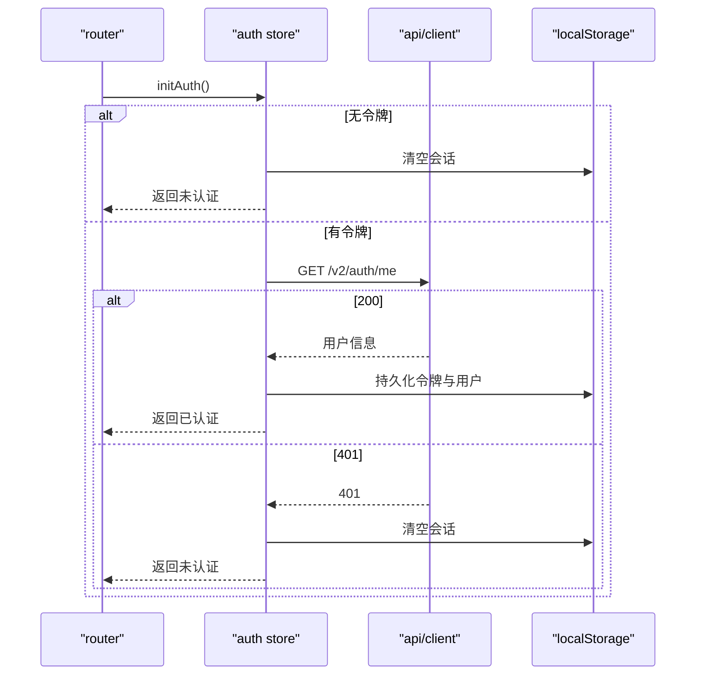
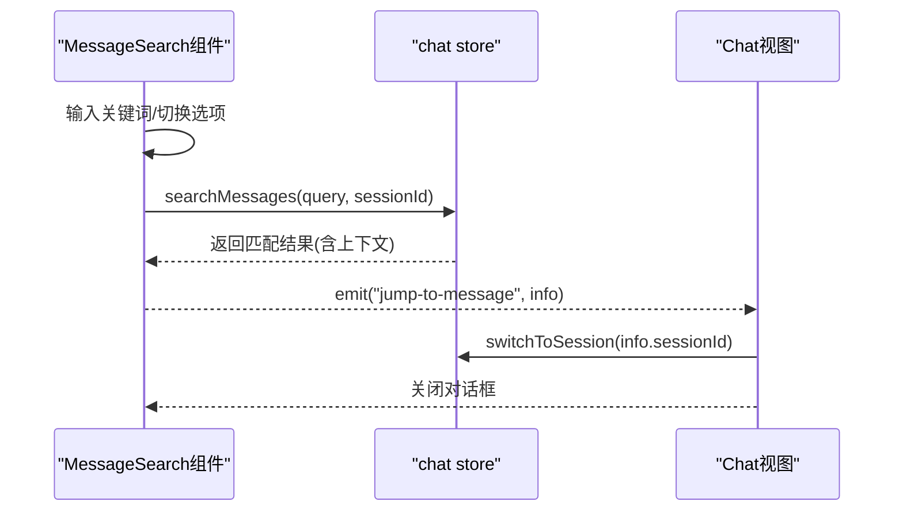
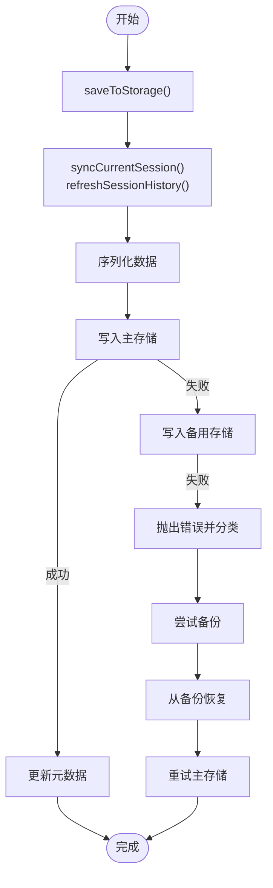
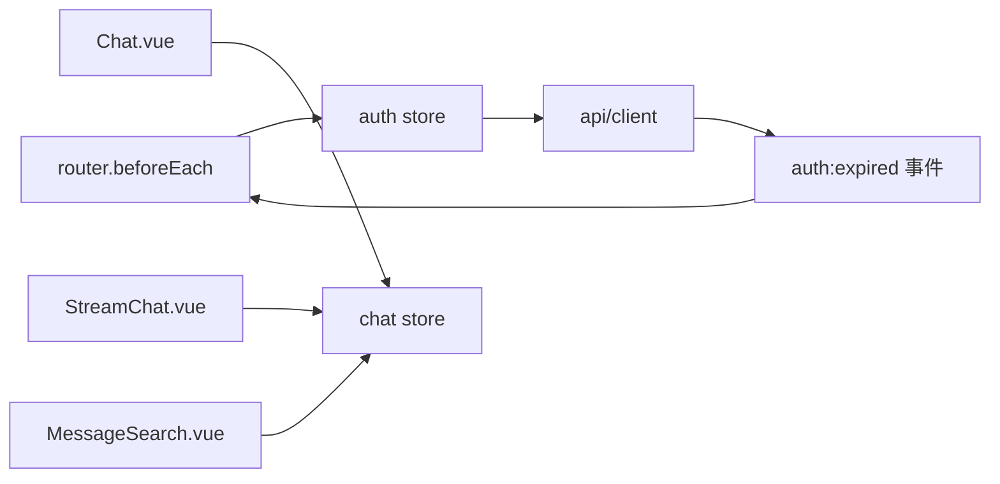

# 状态管理

<cite>
**本文引用的文件**
- [frontend-v2/src/stores/chat.js](file://frontend-v2/src/stores/chat.js)
- [frontend-v2/src/stores/auth.js](file://frontend-v2/src/stores/auth.js)
- [frontend-v2/src/utils/storage.js](file://frontend-v2/src/utils/storage.js)
- [frontend-v2/src/api/client.js](file://frontend-v2/src/api/client.js)
- [frontend-v2/src/components/MessageSearch.vue](file://frontend-v2/src/components/MessageSearch.vue)
- [frontend-v2/src/views/Chat.vue](file://frontend-v2/src/views/Chat.vue)
- [frontend-v2/src/components/StreamChat.vue](file://frontend-v2/src/components/StreamChat.vue)
- [frontend-v2/src/main.js](file://frontend-v2/src/main.js)
- [frontend-v2/src/router/index.js](file://frontend-v2/src/router/index.js)
</cite>

## 目录
1. [简介](#简介)
2. [项目结构](#项目结构)
3. [核心组件](#核心组件)
4. [架构总览](#架构总览)
5. [详细组件分析](#详细组件分析)
6. [依赖分析](#依赖分析)
7. [性能考量](#性能考量)
8. [故障排查指南](#故障排查指南)
9. [结论](#结论)
10. [附录](#附录)

## 简介
本文件面向“钉钉K8s运维机器人”的前端状态管理，围绕 Pinia 状态库的使用与配置，系统性梳理以下方面：
- chat store 的聊天状态管理：消息队列、会话历史、用户输入状态、流式消息与工具调用追踪
- auth store 的认证状态管理：登录状态、JWT 令牌管理、权限校验
- messageSearch 组件的消息检索能力与与 chat store 的协作
- store 之间的依赖关系与数据共享机制
- 状态持久化与本地存储策略（含备份、恢复、健康检查）
- 最佳实践与性能优化建议
- 状态调试与开发工具使用方法

## 项目结构
前端采用 Vue 3 + Pinia + Element Plus 架构，状态管理集中在 stores 目录，核心文件如下：
- chat store：负责聊天会话、消息、流式状态、工具调用、搜索索引与持久化
- auth store：负责用户认证、令牌与权限
- storage 工具：封装 localStorage/sessionStorage/memory 的鲁棒存储与错误处理
- API 客户端：统一的 axios 实例与响应/请求拦截器，承载鉴权与错误处理
- 组件层：MessageSearch、StreamChat、Chat 视图等与 store 深度绑定

图表来源
- [frontend-v2/src/main.js:1-52](file://frontend-v2/src/main.js#L1-L52)
- [frontend-v2/src/router/index.js:1-194](file://frontend-v2/src/router/index.js#L1-L194)
- [frontend-v2/src/stores/chat.js:1-2051](file://frontend-v2/src/stores/chat.js#L1-L2051)
- [frontend-v2/src/stores/auth.js:1-130](file://frontend-v2/src/stores/auth.js#L1-L130)
- [frontend-v2/src/utils/storage.js:1-579](file://frontend-v2/src/utils/storage.js#L1-L579)
- [frontend-v2/src/api/client.js:1-865](file://frontend-v2/src/api/client.js#L1-L865)
- [frontend-v2/src/components/MessageSearch.vue:1-616](file://frontend-v2/src/components/MessageSearch.vue#L1-L616)
- [frontend-v2/src/views/Chat.vue:1-1823](file://frontend-v2/src/views/Chat.vue#L1-L1823)
- [frontend-v2/src/components/StreamChat.vue:1-2858](file://frontend-v2/src/components/StreamChat.vue#L1-L2858)

章节来源
- [frontend-v2/src/main.js:1-52](file://frontend-v2/src/main.js#L1-L52)
- [frontend-v2/src/router/index.js:1-194](file://frontend-v2/src/router/index.js#L1-L194)

## 核心组件
- chat store（聊天状态）
  - 会话管理：创建、切换、删除、标签与标题管理
  - 消息管理：新增、更新、流式内容追加/替换、工具调用关联
  - 搜索与索引：会话与消息的全文检索、前缀匹配、标签过滤
  - 持久化：本地存储、批量/防抖保存、备份与恢复、健康检查
  - 存储工具：配额监控、清理、压缩、重置
- auth store（认证状态）
  - 登录/登出/初始化：与后端 API 交互，维护 JWT 令牌与用户信息
  - 权限校验：基于角色与权限集合的细粒度控制
- storage 工具（存储管理）
  - 多级存储后备：localStorage → sessionStorage → memory
  - 错误分类与恢复：配额不足、安全限制、数据损坏
  - 备份与恢复：自动备份、版本迁移、损坏恢复
- API 客户端（鉴权与错误处理）
  - 请求头注入 Bearer Token
  - 统一响应解包与错误提示
  - 401 自动失效通知

章节来源
- [frontend-v2/src/stores/chat.js:82-2051](file://frontend-v2/src/stores/chat.js#L82-L2051)
- [frontend-v2/src/stores/auth.js:1-130](file://frontend-v2/src/stores/auth.js#L1-L130)
- [frontend-v2/src/utils/storage.js:1-579](file://frontend-v2/src/utils/storage.js#L1-L579)
- [frontend-v2/src/api/client.js:1-865](file://frontend-v2/src/api/client.js#L1-L865)

## 架构总览
Pinia 在应用入口创建并注入，各页面组件通过组合式 API 访问 store。聊天视图与消息检索组件直接依赖 chat store；认证状态贯穿路由守卫与 API 客户端。

图表来源
- [frontend-v2/src/views/Chat.vue:1-1823](file://frontend-v2/src/views/Chat.vue#L1-L1823)
- [frontend-v2/src/components/StreamChat.vue:1-2858](file://frontend-v2/src/components/StreamChat.vue#L1-L2858)
- [frontend-v2/src/stores/chat.js:766-804](file://frontend-v2/src/stores/chat.js#L766-L804)
- [frontend-v2/src/api/client.js:112-174](file://frontend-v2/src/api/client.js#L112-L174)
- [frontend-v2/src/stores/auth.js:81-101](file://frontend-v2/src/stores/auth.js#L81-L101)

## 详细组件分析

### chat store：聊天状态管理
- 会话与消息
  - currentSessionId/currentSession/messages/toolCalls 管理当前会话
  - createSession/switchToSession/deleteSession/updateSessionTitle/addSessionTag/removeSessionTag
  - addMessage/updateMessage/appendToLastMessage/startStreamMessage/appendStreamContent/replaceStreamContent/finishStreamMessage/cancelStreamMessage
- 搜索与索引
  - buildSearchIndex/searchSessions/searchMessages：支持文本、标签、时间范围、消息数过滤
  - searchIndex/sessionIndex：Map 索引加速
- 持久化与可靠性
  - PersistenceMiddleware：延迟、批量、立即保存，防抖与最小保存间隔
  - saveToStorage/loadFromStorage：版本兼容、渐进式加载、备份恢复、损坏修复
  - validateSession/repairSession/atomicSessionOperation：数据完整性与原子操作
  - getStorageInfo/cleanupOldSessions/compressStorageData/performStorageHealthCheck/resetToCleanState/createEmergencyBackup/recoverFromCorruption：存储治理
- 存储状态
  - storageStatus：存储类型、配额、错误、回退能力

图表来源
- [frontend-v2/src/stores/chat.js:82-2051](file://frontend-v2/src/stores/chat.js#L82-L2051)

章节来源
- [frontend-v2/src/stores/chat.js:82-2051](file://frontend-v2/src/stores/chat.js#L82-L2051)

### auth store：认证状态管理
- 关键状态
  - token/user/initialized/initializing
  - computed: isAuthenticated/username/displayName/roles/permissions
- 核心方法
  - login({username,password})：调用后端 /v2/auth/login，持久化令牌与用户信息
  - logout()：调用 /v2/auth/logout，清除本地会话
  - clearSession()：强制清除本地会话
  - initAuth()：无令牌或失效时回退；有令牌时调用 /v2/auth/me 校验并持久化
  - hasPermission/hasAnyPermission：权限判定（支持通配符）
- 与 API 客户端协作
  - 请求拦截器自动附加 Authorization: Bearer
  - 响应拦截器对 401 触发 auth:expired 并清理本地令牌

图表来源
- [frontend-v2/src/stores/auth.js:81-101](file://frontend-v2/src/stores/auth.js#L81-L101)
- [frontend-v2/src/api/client.js:112-174](file://frontend-v2/src/api/client.js#L112-L174)
- [frontend-v2/src/router/index.js:149-186](file://frontend-v2/src/router/index.js#L149-L186)

章节来源
- [frontend-v2/src/stores/auth.js:1-130](file://frontend-v2/src/stores/auth.js#L1-L130)
- [frontend-v2/src/api/client.js:112-174](file://frontend-v2/src/api/client.js#L112-L174)
- [frontend-v2/src/router/index.js:149-186](file://frontend-v2/src/router/index.js#L149-L186)

### messageSearch：消息检索功能
- 与 chat store 的协作
  - 通过 useChatStore().searchMessages(query, sessionId) 查询
  - 支持区分大小写、仅当前会话、上下文展示
- UI 行为
  - 防抖搜索、结果高亮、导出 JSON、跳转到消息
- 与 Chat 视图联动
  - Chat.vue 中通过 v-model 控制弹窗显隐，接收 jump-to-message 事件

图表来源
- [frontend-v2/src/components/MessageSearch.vue:195-258](file://frontend-v2/src/components/MessageSearch.vue#L195-L258)
- [frontend-v2/src/stores/chat.js:660-691](file://frontend-v2/src/stores/chat.js#L660-L691)
- [frontend-v2/src/views/Chat.vue:569-582](file://frontend-v2/src/views/Chat.vue#L569-L582)

章节来源
- [frontend-v2/src/components/MessageSearch.vue:1-616](file://frontend-v2/src/components/MessageSearch.vue#L1-L616)
- [frontend-v2/src/stores/chat.js:660-691](file://frontend-v2/src/stores/chat.js#L660-L691)
- [frontend-v2/src/views/Chat.vue:569-582](file://frontend-v2/src/views/Chat.vue#L569-L582)

### 存储与持久化策略
- 存储管理器
  - 多级后备：localStorage → sessionStorage → memory
  - 错误分类：StorageError/StorageQuotaError/StorageSecurityError
  - 备份与恢复：save 前自动备份，load 失败时从备份恢复
  - 配额监控：navigator.storage.estimate 或估算
- chat store 的持久化
  - saveToStorage/loadFromStorage：版本兼容、渐进式加载、损坏修复
  - 持久化中间件：triggerSave/immediateSave/batchSave
  - 健康检查：validateSession/repairSession/performStorageHealthCheck
  - 存储治理：cleanupOldSessions/compressStorageData/resetToCleanState

图表来源
- [frontend-v2/src/stores/chat.js:885-921](file://frontend-v2/src/stores/chat.js#L885-L921)
- [frontend-v2/src/utils/storage.js:112-164](file://frontend-v2/src/utils/storage.js#L112-L164)
- [frontend-v2/src/utils/storage.js:273-333](file://frontend-v2/src/utils/storage.js#L273-L333)

章节来源
- [frontend-v2/src/utils/storage.js:1-579](file://frontend-v2/src/utils/storage.js#L1-L579)
- [frontend-v2/src/stores/chat.js:885-1055](file://frontend-v2/src/stores/chat.js#L885-L1055)

## 依赖分析
- 组件与 store 的耦合
  - StreamChat 与 MessageSearch 直接依赖 chat store
  - Chat 视图通过 useChatStore() 管理设置、存储管理、导入导出
- 路由与认证
  - router.beforeEach 动态导入 auth store，统一校验 requiresAuth 与权限
- API 与认证
  - api.client 注入 Authorization 头，401 触发 auth:expired 事件
  - auth.store.initAuth() 与后端 /v2/auth/me 协作完成令牌校验

图表来源
- [frontend-v2/src/router/index.js:149-186](file://frontend-v2/src/router/index.js#L149-L186)
- [frontend-v2/src/stores/auth.js:81-101](file://frontend-v2/src/stores/auth.js#L81-L101)
- [frontend-v2/src/api/client.js:112-174](file://frontend-v2/src/api/client.js#L112-L174)
- [frontend-v2/src/views/Chat.vue:1-1823](file://frontend-v2/src/views/Chat.vue#L1-L1823)
- [frontend-v2/src/components/StreamChat.vue:1-2858](file://frontend-v2/src/components/StreamChat.vue#L1-L2858)
- [frontend-v2/src/components/MessageSearch.vue:1-616](file://frontend-v2/src/components/MessageSearch.vue#L1-L616)

章节来源
- [frontend-v2/src/router/index.js:149-186](file://frontend-v2/src/router/index.js#L149-L186)
- [frontend-v2/src/stores/auth.js:81-101](file://frontend-v2/src/stores/auth.js#L81-L101)
- [frontend-v2/src/api/client.js:112-174](file://frontend-v2/src/api/client.js#L112-L174)

## 性能考量
- 搜索性能
  - 使用 searchIndex/sessionIndex Map 索引，避免全量扫描
  - query 分词、精确匹配与前缀匹配结合
- 持久化性能
  - 防抖与批量保存：debouncedSave/PersistenceMiddleware
  - 渐进式加载：大数据集分批加载，后台补全
- 存储治理
  - 压缩长消息内容，减少存储占用
  - 定期清理旧会话，控制 sessionHistory 长度
- UI 体验
  - 流式渲染：appendStreamContent/replaceStreamContent
  - 自动滚动与时间戳显示可配置

[本节为通用指导，无需特定文件引用]

## 故障排查指南
- 401 会话过期
  - 现象：API 响应 401，弹出错误提示并清理本地令牌
  - 处理：auth.store.initAuth() 回退到未认证；路由守卫重定向至登录
- 存储异常
  - 现象：保存失败、配额不足、访问被阻止
  - 处理：StorageQuotaError/StorageSecurityError 分类处理；自动备份与恢复；必要时重置到干净状态
- 数据损坏
  - 现象：加载失败、数据格式错误
  - 处理：validateSession/repairSession；performStorageHealthCheck；createEmergencyBackup/recoverFromCorruption
- 页面卸载前保存
  - 通过 beforeunload/visibilitychange 事件触发同步保存，确保数据不丢失

章节来源
- [frontend-v2/src/api/client.js:134-174](file://frontend-v2/src/api/client.js#L134-L174)
- [frontend-v2/src/stores/auth.js:81-101](file://frontend-v2/src/stores/auth.js#L81-L101)
- [frontend-v2/src/utils/storage.js:156-163](file://frontend-v2/src/utils/storage.js#L156-L163)
- [frontend-v2/src/stores/chat.js:1678-1819](file://frontend-v2/src/stores/chat.js#L1678-L1819)
- [frontend-v2/src/stores/chat.js:1879-1911](file://frontend-v2/src/stores/chat.js#L1879-L1911)

## 结论
本项目以 Pinia 为核心，结合自研存储管理与完善的错误处理机制，实现了：
- 高可用的聊天状态管理：会话、消息、流式内容与工具调用的全生命周期管理
- 稳健的认证与权限体系：令牌管理、会话校验与细粒度权限控制
- 高效的检索与持久化：索引加速、渐进式加载、备份恢复与健康检查
- 良好的开发体验：清晰的组件边界、统一的 API 客户端与完善的调试手段

[本节为总结，无需特定文件引用]

## 附录
- 开发与调试
  - 在开发环境可通过浏览器控制台观察持久化中间件日志与存储状态
  - 使用 Chat 视图的“存储管理”对话框查看配额与执行治理操作
  - 路由守卫与 auth:expired 事件可用于定位认证问题
- 最佳实践
  - 优先使用 PersistenceMiddleware 的批量/防抖保存
  - 搜索场景尽量启用索引；对大文本内容考虑压缩
  - 定期执行 performStorageHealthCheck 与 cleanupOldSessions
  - 在 beforeunload 中确保关键状态落盘

[本节为通用指导，无需特定文件引用]