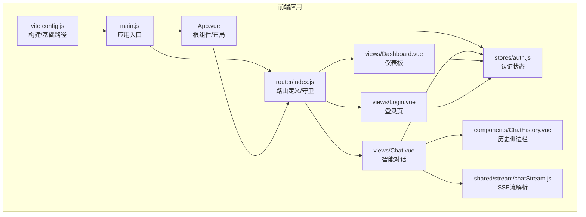
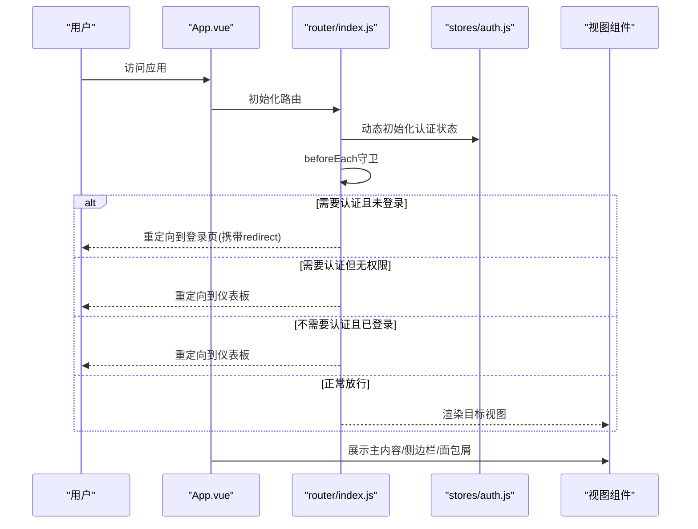
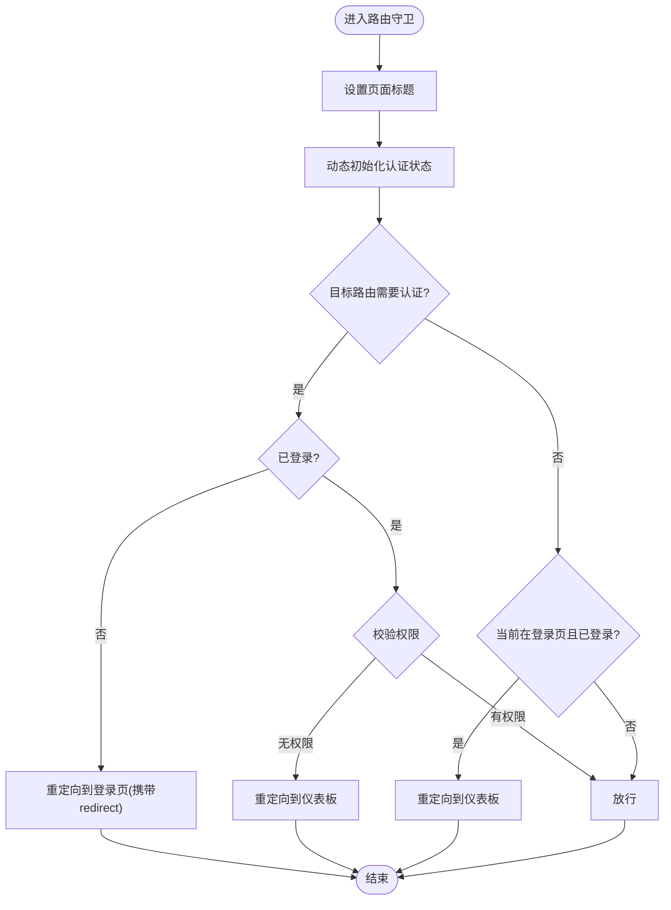
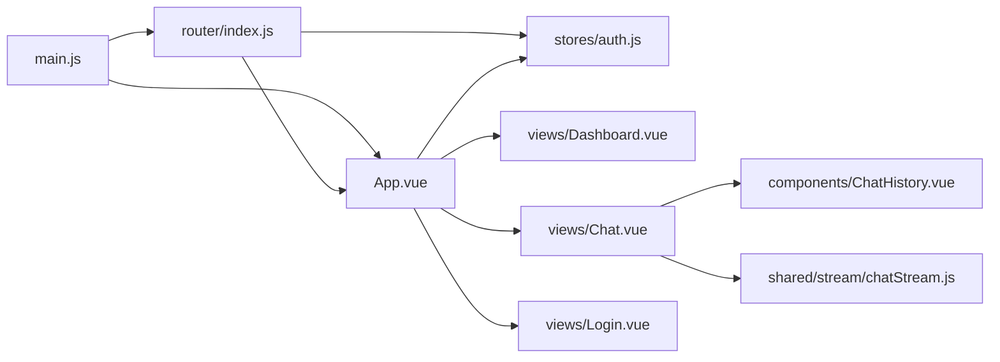

# 路由与导航

<cite>
**本文引用的文件**   
- [frontend-v2/src/router/index.js](file://frontend-v2/src/router/index.js)
- [frontend-v2/src/main.js](file://frontend-v2/src/main.js)
- [frontend-v2/src/App.vue](file://frontend-v2/src/App.vue)
- [frontend-v2/src/stores/auth.js](file://frontend-v2/src/stores/auth.js)
- [frontend-v2/src/views/Login.vue](file://frontend-v2/src/views/Login.vue)
- [frontend-v2/src/views/Dashboard.vue](file://frontend-v2/src/views/Dashboard.vue)
- [frontend-v2/src/views/Chat.vue](file://frontend-v2/src/views/Chat.vue)
- [frontend-v2/src/components/ChatHistory.vue](file://frontend-v2/src/components/ChatHistory.vue)
- [frontend-v2/src/shared/stream/chatStream.js](file://frontend-v2/src/shared/stream/chatStream.js)
- [frontend-v2/vite.config.js](file://frontend-v2/vite.config.js)
- [frontend-v2/README.md](file://frontend-v2/README.md)
</cite>

## 目录
1. [简介](#简介)
2. [项目结构](#项目结构)
3. [核心组件](#核心组件)
4. [架构总览](#架构总览)
5. [详细组件分析](#详细组件分析)
6. [依赖分析](#依赖分析)
7. [性能考虑](#性能考虑)
8. [故障排除指南](#故障排除指南)
9. [结论](#结论)
10. [附录](#附录)

## 简介
本章节面向“钉钉K8s运维机器人”的前端路由与导航系统，围绕 Vue Router 的配置与路由规则、路由守卫与权限校验、页面视图组件组织、路由参数与查询字符串处理、程序化导航与跳转、路由懒加载与代码分割、导航菜单与面包屑实现、路由调试与错误处理、以及 SEO 与元数据管理等方面进行系统化说明。文档同时结合实际源码路径，帮助开发者快速定位实现细节。

## 项目结构
前端采用 Vue 3 + Vite + Element Plus 技术栈，路由与导航相关的核心文件分布如下：
- 路由定义与守卫：frontend-v2/src/router/index.js
- 应用入口与插件注册：frontend-v2/src/main.js
- 根组件与布局、导航、面包屑：frontend-v2/src/App.vue
- 认证状态与权限判断：frontend-v2/src/stores/auth.js
- 登录页视图：frontend-v2/src/views/Login.vue
- 仪表板视图：frontend-v2/src/views/Dashboard.vue
- 智能对话视图：frontend-v2/src/views/Chat.vue
- 聊天历史侧边栏组件：frontend-v2/src/components/ChatHistory.vue
- 聊天流解析工具：frontend-v2/src/shared/stream/chatStream.js
- 构建与基础路径配置：frontend-v2/vite.config.js
- 前端功能与构建说明：frontend-v2/README.md

图表来源
- [frontend-v2/src/main.js:1-52](file://frontend-v2/src/main.js#L1-L52)
- [frontend-v2/src/router/index.js:1-194](file://frontend-v2/src/router/index.js#L1-L194)
- [frontend-v2/src/App.vue:1-292](file://frontend-v2/src/App.vue#L1-L292)
- [frontend-v2/src/stores/auth.js:1-130](file://frontend-v2/src/stores/auth.js#L1-L130)
- [frontend-v2/src/views/Login.vue:1-330](file://frontend-v2/src/views/Login.vue#L1-L330)
- [frontend-v2/src/views/Dashboard.vue:1-800](file://frontend-v2/src/views/Dashboard.vue#L1-L800)
- [frontend-v2/src/views/Chat.vue:1-800](file://frontend-v2/src/views/Chat.vue#L1-L800)
- [frontend-v2/src/components/ChatHistory.vue:1-800](file://frontend-v2/src/components/ChatHistory.vue#L1-L800)
- [frontend-v2/src/shared/stream/chatStream.js:1-129](file://frontend-v2/src/shared/stream/chatStream.js#L1-L129)
- [frontend-v2/vite.config.js:1-55](file://frontend-v2/vite.config.js#L1-L55)

章节来源
- [frontend-v2/src/router/index.js:1-194](file://frontend-v2/src/router/index.js#L1-L194)
- [frontend-v2/src/main.js:1-52](file://frontend-v2/src/main.js#L1-L52)
- [frontend-v2/src/App.vue:1-292](file://frontend-v2/src/App.vue#L1-L292)
- [frontend-v2/vite.config.js:1-55](file://frontend-v2/vite.config.js#L1-L55)

## 核心组件
- 路由器与路由表：在路由模块中定义了登录、仪表板、智能对话、拓扑、事故、审计、MCP配置、LLM设置、定时任务、访问控制、操作日志等路由，并通过 meta 字段声明标题、图标、认证需求与权限标识。
- 路由守卫：在 beforeEach 中动态初始化认证状态、设置页面标题、执行登录态与权限校验，并在 afterEach 中记录路由切换日志。
- 根组件与布局：App.vue 提供侧边栏导航、移动端顶部导航、头部面包屑、主内容区与过渡动画，同时封装了程序化导航方法 navigateTo。
- 认证与权限：Pinia 认证 Store 提供登录、登出、初始化、权限判断等能力，支持通配符权限与细粒度权限校验。
- 视图组件：Login、Dashboard、Chat 等视图分别承载登录、运维指挥台、智能对话等业务场景。
- 聊天历史侧边栏：ChatHistory 提供会话历史管理、搜索、筛选、标签管理等功能，与 Chat 视图配合使用。
- 构建与基础路径：Vite 配置设置基础路径为 “/spa/”，并进行代码分割与代理配置，便于与后端集成。

章节来源
- [frontend-v2/src/router/index.js:12-141](file://frontend-v2/src/router/index.js#L12-L141)
- [frontend-v2/src/router/index.js:148-191](file://frontend-v2/src/router/index.js#L148-L191)
- [frontend-v2/src/App.vue:145-224](file://frontend-v2/src/App.vue#L145-L224)
- [frontend-v2/src/stores/auth.js:19-129](file://frontend-v2/src/stores/auth.js#L19-L129)
- [frontend-v2/src/views/Login.vue:87-127](file://frontend-v2/src/views/Login.vue#L87-L127)
- [frontend-v2/src/views/Dashboard.vue:237-290](file://frontend-v2/src/views/Dashboard.vue#L237-L290)
- [frontend-v2/src/views/Chat.vue:445-731](file://frontend-v2/src/views/Chat.vue#L445-L731)
- [frontend-v2/src/components/ChatHistory.vue:301-653](file://frontend-v2/src/components/ChatHistory.vue#L301-L653)
- [frontend-v2/vite.config.js:30-47](file://frontend-v2/vite.config.js#L30-L47)

## 架构总览
下图展示了路由与导航的整体交互关系：应用启动后注册路由与守卫，根组件负责布局与导航，视图组件承载业务逻辑，认证 Store 提供权限判断，构建配置决定基础路径与代码分割策略。

图表来源
- [frontend-v2/src/router/index.js:148-186](file://frontend-v2/src/router/index.js#L148-L186)
- [frontend-v2/src/App.vue:188-281](file://frontend-v2/src/App.vue#L188-L281)
- [frontend-v2/src/stores/auth.js:81-101](file://frontend-v2/src/stores/auth.js#L81-L101)

章节来源
- [frontend-v2/src/router/index.js:143-186](file://frontend-v2/src/router/index.js#L143-L186)
- [frontend-v2/src/App.vue:188-281](file://frontend-v2/src/App.vue#L188-L281)
- [frontend-v2/src/stores/auth.js:81-101](file://frontend-v2/src/stores/auth.js#L81-L101)

## 详细组件分析

### 路由配置与规则
- 路由懒加载：通过动态 import 将视图组件按需加载，减少首屏体积。
- 路由表：包含登录、仪表板、智能对话、拓扑、事故、审计、MCP配置、LLM设置、定时任务、访问控制、操作日志等路由；部分路由使用 redirect 将外部路径映射到内部锚点或查询参数。
- 元信息：每个路由通过 meta 字段声明标题、图标、是否需要认证、所需权限等，便于守卫与布局组件复用。

章节来源
- [frontend-v2/src/router/index.js:3-11](file://frontend-v2/src/router/index.js#L3-L11)
- [frontend-v2/src/router/index.js:12-141](file://frontend-v2/src/router/index.js#L12-L141)

### 路由守卫与权限验证
- 页面标题：根据路由 meta.title 设置 document.title。
- 认证初始化：动态导入认证 Store 并执行 initAuth，确保登录态与用户信息可用。
- 登录态校验：若目标路由 requiresAuth 非 false 且未登录，则重定向到登录页并携带 redirect 参数。
- 权限校验：若目标路由包含 permission，调用 hasPermission 判断；无权限则重定向到仪表板。
- 已登录用户访问登录页：重定向到仪表板。
- 路由切换后日志：afterEach 记录 from->to 路径。

图表来源
- [frontend-v2/src/router/index.js:148-186](file://frontend-v2/src/router/index.js#L148-L186)

章节来源
- [frontend-v2/src/router/index.js:148-186](file://frontend-v2/src/router/index.js#L148-L186)

### 页面视图组件组织
- Login 登录页：处理用户名/密码输入、调用认证 Store 登录、成功后根据 redirect 或默认跳转到仪表板。
- Dashboard 仪表板：展示运维指挥台概览、命令区、拓扑、事故时间线、自动化队列等；支持从命令区跳转到 Chat 并传递查询参数。
- Chat 智能对话：主聊天界面，包含历史侧边栏、上下文与工具总线、设置对话框、存储管理等；与 ChatHistory 组件协作。
- ChatHistory 聊天历史：提供会话列表、搜索、筛选、标签管理、导入导出等能力。
- 其他视图：MCP配置、定时任务、访问控制、操作日志等，均通过路由懒加载按需加载。

章节来源
- [frontend-v2/src/views/Login.vue:87-127](file://frontend-v2/src/views/Login.vue#L87-L127)
- [frontend-v2/src/views/Dashboard.vue:237-290](file://frontend-v2/src/views/Dashboard.vue#L237-L290)
- [frontend-v2/src/views/Chat.vue:445-731](file://frontend-v2/src/views/Chat.vue#L445-L731)
- [frontend-v2/src/components/ChatHistory.vue:301-653](file://frontend-v2/src/components/ChatHistory.vue#L301-L653)

### 导航菜单与面包屑
- 侧边栏与移动端导航：App.vue 中定义 railItems，根据认证 Store 的权限动态过滤显示；navigateTo 方法支持字符串或对象形式的目标，支持 hash 定位与滚动。
- 面包屑：根据当前路由 path 计算 breadcrumbTitle，提供清晰的层级提示。
- 仪表板特殊处理：isOpsRoute 控制主内容区样式，Dashboard 内部通过 hash 定位到特定区块。

章节来源
- [frontend-v2/src/App.vue:145-186](file://frontend-v2/src/App.vue#L145-L186)
- [frontend-v2/src/App.vue:198-224](file://frontend-v2/src/App.vue#L198-L224)

### 路由参数传递与查询字符串处理
- 程序化导航：App.vue 的 navigateTo 支持传入字符串或对象，自动处理 path、hash 与 query；当目标为 Dashboard 时默认滚动到命令区。
- 查询参数：Dashboard 将命令作为查询参数传递给 Chat，实现从仪表板直达对话并携带初始消息。
- 重定向：部分路由使用 redirect 携带 hash 或 query，实现锚点跳转或参数透传。

章节来源
- [frontend-v2/src/App.vue:198-224](file://frontend-v2/src/App.vue#L198-L224)
- [frontend-v2/src/views/Dashboard.vue:284-289](file://frontend-v2/src/views/Dashboard.vue#L284-L289)
- [frontend-v2/src/router/index.js:49-79](file://frontend-v2/src/router/index.js#L49-L79)

### 程序化导航与编程式路由跳转
- App.vue 提供 navigateTo，统一处理跳转与滚动，避免重复逻辑。
- 登录成功后根据 query.redirect 或默认跳转到仪表板。
- 退出登录时统一跳转到登录页。

章节来源
- [frontend-v2/src/App.vue:198-224](file://frontend-v2/src/App.vue#L198-L224)
- [frontend-v2/src/views/Login.vue:110-126](file://frontend-v2/src/views/Login.vue#L110-L126)

### 路由懒加载与代码分割
- 路由懒加载：视图组件通过动态 import 实现按需加载。
- 构建代码分割：Vite 配置 manualChunks 将 vue、vue-router、pinia、element-plus 等拆分为独立 chunk，提升缓存命中率。
- 基础路径：base 设置为 “/spa/”，确保后端静态资源正确提供。

章节来源
- [frontend-v2/src/router/index.js:3-11](file://frontend-v2/src/router/index.js#L3-L11)
- [frontend-v2/vite.config.js:30-47](file://frontend-v2/vite.config.js#L30-L47)
- [frontend-v2/vite.config.js:48-49](file://frontend-v2/vite.config.js#L48-L49)

### 聊天流解析与导航联动
- SSE流解析：chatStream.js 提供 parseChatStreamLine 与 normalizeChatStreamEvent，统一处理结构化事件与文本增量。
- 导航联动：Chat.vue 与 ChatHistory.vue 通过 Pinia store 管理会话与消息，配合导航组件实现历史浏览与跳转。

章节来源
- [frontend-v2/src/shared/stream/chatStream.js:1-129](file://frontend-v2/src/shared/stream/chatStream.js#L1-L129)
- [frontend-v2/src/views/Chat.vue:445-731](file://frontend-v2/src/views/Chat.vue#L445-L731)
- [frontend-v2/src/components/ChatHistory.vue:301-653](file://frontend-v2/src/components/ChatHistory.vue#L301-L653)

## 依赖分析
- 应用入口依赖：main.js 注册 Vue、Pinia、Element Plus 与 Router。
- 路由依赖：router/index.js 依赖 App.vue 与 stores/auth.js，实现守卫与导航。
- 视图依赖：各视图依赖 Pinia store 与 Element Plus 组件；Chat.vue 依赖 ChatHistory 与 StreamChat。
- 构建依赖：vite.config.js 影响基础路径、代理与代码分割。

图表来源
- [frontend-v2/src/main.js:1-52](file://frontend-v2/src/main.js#L1-L52)
- [frontend-v2/src/router/index.js:1-194](file://frontend-v2/src/router/index.js#L1-L194)
- [frontend-v2/src/App.vue:1-292](file://frontend-v2/src/App.vue#L1-L292)
- [frontend-v2/src/stores/auth.js:1-130](file://frontend-v2/src/stores/auth.js#L1-L130)
- [frontend-v2/src/views/Dashboard.vue:1-800](file://frontend-v2/src/views/Dashboard.vue#L1-L800)
- [frontend-v2/src/views/Chat.vue:1-800](file://frontend-v2/src/views/Chat.vue#L1-L800)
- [frontend-v2/src/views/Login.vue:1-330](file://frontend-v2/src/views/Login.vue#L1-L330)
- [frontend-v2/src/components/ChatHistory.vue:1-800](file://frontend-v2/src/components/ChatHistory.vue#L1-L800)
- [frontend-v2/src/shared/stream/chatStream.js:1-129](file://frontend-v2/src/shared/stream/chatStream.js#L1-L129)

章节来源
- [frontend-v2/src/main.js:1-52](file://frontend-v2/src/main.js#L1-L52)
- [frontend-v2/src/router/index.js:1-194](file://frontend-v2/src/router/index.js#L1-L194)
- [frontend-v2/src/App.vue:1-292](file://frontend-v2/src/App.vue#L1-L292)

## 性能考虑
- 路由懒加载：按需加载视图组件，降低首屏 JavaScript 体积。
- 代码分割：manualChunks 将核心库拆分，提升缓存复用与并行加载效率。
- 基础路径：base 为 “/spa/” 与后端静态资源目录对齐，避免额外重定向开销。
- 组件懒加载：ChatHistory 等复杂组件按需加载，减少初始渲染压力。
- 路由守卫异步：动态导入认证 Store 并初始化，避免阻塞主线程。

章节来源
- [frontend-v2/src/router/index.js:3-11](file://frontend-v2/src/router/index.js#L3-L11)
- [frontend-v2/vite.config.js:30-47](file://frontend-v2/vite.config.js#L30-L47)
- [frontend-v2/vite.config.js:48-49](file://frontend-v2/vite.config.js#L48-L49)

## 故障排除指南
- 登录后仍被重定向到登录页
  - 检查路由守卫中的 requiresAuth 与 permission 设置，确认认证 Store 初始化是否成功。
  - 确认登录页成功后是否正确设置 redirect 并执行 replace。
- 无权限访问某路由
  - 检查目标路由 meta.permission 与认证 Store 的 hasPermission 实现，确认用户权限集合是否包含所需权限或通配符。
- 路由切换无反应或白屏
  - 检查路由懒加载是否正确，确认组件路径与导出名称一致。
  - 检查构建输出目录与 base 路径是否与后端静态资源提供一致。
- 聊天流解析异常
  - 使用 chatStream.js 的解析函数，确认后端 SSE 消息格式符合预期；必要时在前端控制台打印原始数据进行排查。

章节来源
- [frontend-v2/src/router/index.js:148-186](file://frontend-v2/src/router/index.js#L148-L186)
- [frontend-v2/src/stores/auth.js:103-110](file://frontend-v2/src/stores/auth.js#L103-L110)
- [frontend-v2/src/views/Login.vue:110-126](file://frontend-v2/src/views/Login.vue#L110-L126)
- [frontend-v2/src/shared/stream/chatStream.js:1-129](file://frontend-v2/src/shared/stream/chatStream.js#L1-L129)
- [frontend-v2/vite.config.js:30-47](file://frontend-v2/vite.config.js#L30-L47)

## 结论
该路由与导航系统通过 Vue Router 的懒加载与守卫机制，结合 Pinia 认证 Store 的权限判断，实现了安全、灵活且高性能的前端导航体验。根组件 App.vue 提供统一的布局、导航与面包屑，视图组件与聊天历史组件协同完成业务闭环。构建配置与基础路径设置确保了与后端静态资源的一致性与可维护性。

## 附录
- 前端功能与构建说明可参考前端 README，其中包含开发指南、构建输出、代理配置与部署要点。
- 常见问题与调试技巧可参考前端 README 的“调试技巧”与“常见问题”。

章节来源
- [frontend-v2/README.md:56-84](file://frontend-v2/README.md#L56-L84)
- [frontend-v2/README.md:181-226](file://frontend-v2/README.md#L181-L226)