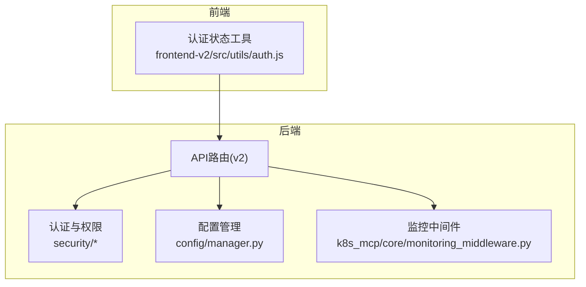
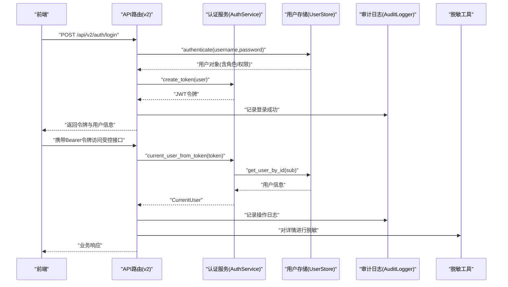
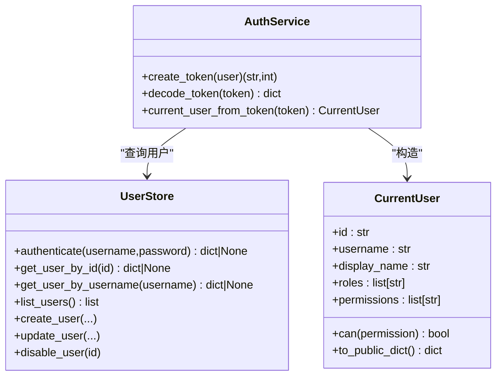
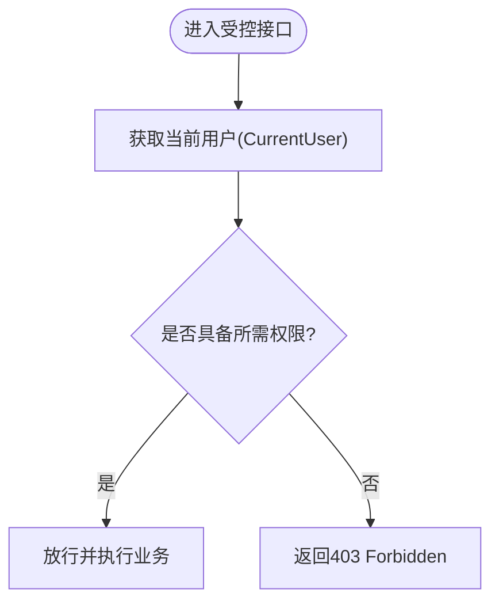
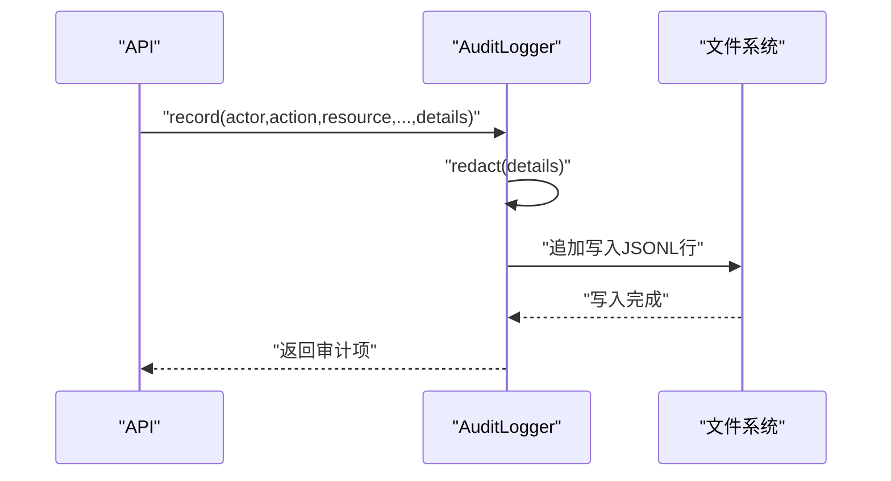
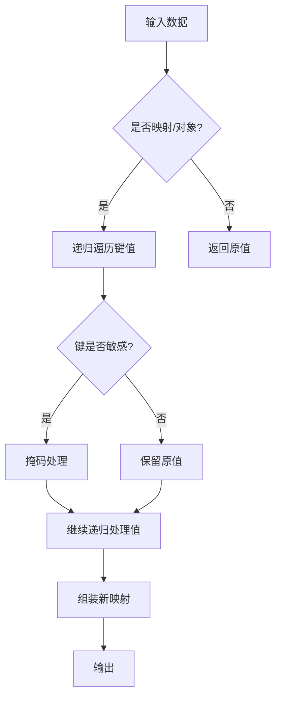
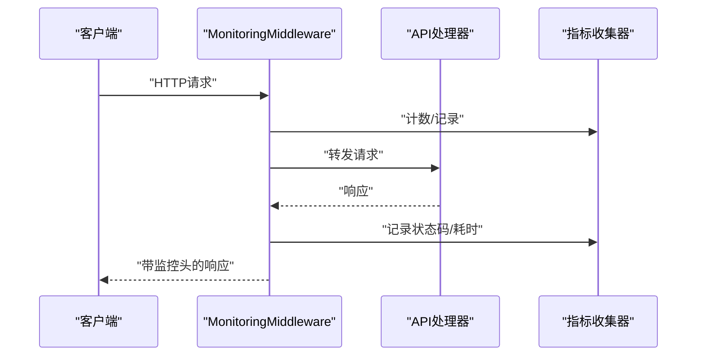
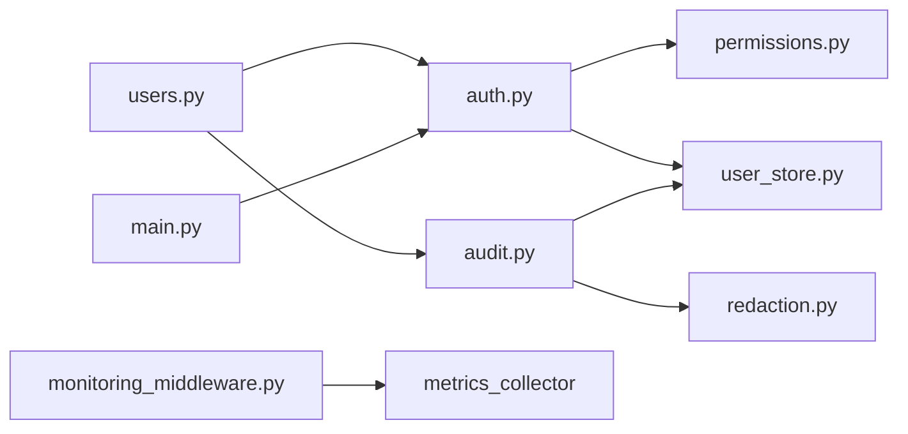

# 安全与权限

<cite>
**本文引用的文件**
- [backend/src/security/auth.py](file://backend/src/security/auth.py)
- [backend/src/security/permissions.py](file://backend/src/security/permissions.py)
- [backend/src/security/audit.py](file://backend/src/security/audit.py)
- [backend/src/security/redaction.py](file://backend/src/security/redaction.py)
- [backend/src/security/user_store.py](file://backend/src/security/user_store.py)
- [backend/src/api/v2/endpoints/auth.py](file://backend/src/api/v2/endpoints/auth.py)
- [backend/src/api/v2/endpoints/users.py](file://backend/src/api/v2/endpoints/users.py)
- [backend/src/api/v2/endpoints/audit.py](file://backend/src/api/v2/endpoints/audit.py)
- [backend/src/config/manager.py](file://backend/src/config/manager.py)
- [frontend-v2/src/utils/auth.js](file://frontend-v2/src/utils/auth.js)
- [backend/src/k8s_mcp/core/monitoring_middleware.py](file://backend/src/k8s_mcp/core/monitoring_middleware.py)
- [backend/main.py](file://backend/main.py)
- [backend/config.env.example](file://backend/config.env.example)
- [config/llm_config.example.json](file://config/llm_config.example.json)
</cite>

## 目录
1. [引言](#引言)
2. [项目结构](#项目结构)
3. [核心组件](#核心组件)
4. [架构总览](#架构总览)
5. [详细组件分析](#详细组件分析)
6. [依赖关系分析](#依赖关系分析)
7. [性能考量](#性能考量)
8. [故障排查指南](#故障排查指南)
9. [结论](#结论)
10. [附录](#附录)

## 引言
本文件面向“钉钉K8s运维机器人”的安全与权限体系，系统化阐述认证与会话、权限控制（RBAC）、操作审计与脱敏、数据安全与传输保护、安全中间件与配置最佳实践、安全威胁防护策略、合规与审计机制，以及安全测试与渗透测试指导。内容以仓库中的实际代码为依据，辅以可视化图示帮助不同背景读者理解。

## 项目结构
后端采用FastAPI框架，安全相关能力集中在独立的security包内，并通过API路由在v2版本中暴露。前端提供基础的登录状态管理与本地脱敏展示辅助。监控中间件用于运行时指标采集与异常观测。

**图表来源**
- [backend/src/api/v2/endpoints/auth.py:1-88](file://backend/src/api/v2/endpoints/auth.py#L1-L88)
- [backend/src/security/auth.py:1-182](file://backend/src/security/auth.py#L1-L182)
- [backend/src/config/manager.py:1-221](file://backend/src/config/manager.py#L1-L221)
- [backend/src/k8s_mcp/core/monitoring_middleware.py:1-84](file://backend/src/k8s_mcp/core/monitoring_middleware.py#L1-L84)
- [frontend-v2/src/utils/auth.js:1-95](file://frontend-v2/src/utils/auth.js#L1-L95)

**章节来源**
- [backend/src/api/v2/endpoints/auth.py:1-88](file://backend/src/api/v2/endpoints/auth.py#L1-L88)
- [backend/src/security/auth.py:1-182](file://backend/src/security/auth.py#L1-L182)
- [backend/src/config/manager.py:1-221](file://backend/src/config/manager.py#L1-L221)
- [backend/src/k8s_mcp/core/monitoring_middleware.py:1-84](file://backend/src/k8s_mcp/core/monitoring_middleware.py#L1-L84)
- [frontend-v2/src/utils/auth.js:1-95](file://frontend-v2/src/utils/auth.js#L1-L95)

## 核心组件
- 认证与会话：基于对称签名的JWT令牌生成与校验，结合用户存储进行身份解析；提供当前用户依赖注入与权限校验依赖。
- 权限控制：内置角色与权限常量，支持通配符授权与角色到权限的展开。
- 用户与角色存储：本地JSON文件存储用户、角色与密码哈希，支持增删改查与登录时间追踪。
- 操作审计：追加式JSONL审计日志，支持过滤查询与敏感信息脱敏。
- 数据脱敏：针对键名与值的敏感信息进行掩码处理，避免日志泄露。
- 前端认证状态：基于localStorage的简单登录态与过期控制。
- 监控中间件：统一采集HTTP请求指标，便于安全事件与异常检测。

**章节来源**
- [backend/src/security/auth.py:73-182](file://backend/src/security/auth.py#L73-L182)
- [backend/src/security/permissions.py:1-95](file://backend/src/security/permissions.py#L1-L95)
- [backend/src/security/user_store.py:61-292](file://backend/src/security/user_store.py#L61-L292)
- [backend/src/security/audit.py:21-96](file://backend/src/security/audit.py#L21-L96)
- [backend/src/security/redaction.py:1-79](file://backend/src/security/redaction.py#L1-L79)
- [frontend-v2/src/utils/auth.js:1-95](file://frontend-v2/src/utils/auth.js#L1-L95)
- [backend/src/k8s_mcp/core/monitoring_middleware.py:24-84](file://backend/src/k8s_mcp/core/monitoring_middleware.py#L24-L84)

## 架构总览
下图展示了从客户端到后端API、认证与权限、用户存储、审计与脱敏的整体交互流程。

**图表来源**
- [backend/src/api/v2/endpoints/auth.py:21-66](file://backend/src/api/v2/endpoints/auth.py#L21-L66)
- [backend/src/security/auth.py:79-134](file://backend/src/security/auth.py#L79-L134)
- [backend/src/security/user_store.py:188-199](file://backend/src/security/user_store.py#L188-L199)
- [backend/src/security/audit.py:27-61](file://backend/src/security/audit.py#L27-L61)
- [backend/src/security/redaction.py:48-74](file://backend/src/security/redaction.py#L48-L74)

## 详细组件分析

### 认证系统与会话管理
- 令牌生成：使用HS256对称签名，载荷包含子、用户名、签发时间、过期时间与唯一ID；签名材料由Header与Payload编码拼接后以密钥计算。
- 令牌校验：拆分三段，重算签名并与携带签名比较，同时校验过期时间；失败时抛出明确错误。
- 当前用户解析：从令牌载荷解析用户ID，查询用户存储并构造当前用户对象；禁用用户将拒绝访问。
- 依赖注入：提供FastAPI依赖以解析请求头中的Bearer令牌，未提供或无效时返回未授权。
- 会话密钥：优先从环境变量读取，否则从指定文件生成并限制权限；支持缓存复用。

**图表来源**
- [backend/src/security/auth.py:73-134](file://backend/src/security/auth.py#L73-L134)
- [backend/src/security/user_store.py:188-292](file://backend/src/security/user_store.py#L188-L292)

**章节来源**
- [backend/src/security/auth.py:36-134](file://backend/src/security/auth.py#L36-L134)
- [backend/src/api/v2/endpoints/auth.py:21-66](file://backend/src/api/v2/endpoints/auth.py#L21-L66)

### 权限控制体系（RBAC）
- 权限常量：定义细粒度操作权限，覆盖运维指挥台、对话、LLM/MCP配置、资源指标、巡检、告警、调度、审计、用户管理等。
- 角色定义：内置管理员、运维工程师、只读观察员三类角色，支持通配符授权。
- 权限展开：根据用户角色集合展开为权限集合，若包含通配符则直接授予全部权限。
- 接口依赖：提供require_permission依赖，未满足权限时返回禁止访问。

**图表来源**
- [backend/src/security/permissions.py:7-95](file://backend/src/security/permissions.py#L7-L95)
- [backend/src/security/auth.py:172-182](file://backend/src/security/auth.py#L172-L182)

**章节来源**
- [backend/src/security/permissions.py:1-95](file://backend/src/security/permissions.py#L1-L95)
- [backend/src/api/v2/endpoints/users.py:48-149](file://backend/src/api/v2/endpoints/users.py#L48-L149)

### 操作审计与访问控制列表
- 审计日志：以JSONL格式追加写入，字段包含操作者、动作、资源、结果、请求ID、方法、路径、IP、UA、详情等；详情在落盘前进行脱敏。
- 查询接口：支持按演员、动作、结果与上限过滤，限制最大返回条目。
- 控制列表：用户与角色管理接口均需具备相应权限才可访问。

**图表来源**
- [backend/src/security/audit.py:27-61](file://backend/src/security/audit.py#L27-L61)
- [backend/src/security/redaction.py:48-74](file://backend/src/security/redaction.py#L48-L74)

**章节来源**
- [backend/src/security/audit.py:1-96](file://backend/src/security/audit.py#L1-L96)
- [backend/src/api/v2/endpoints/audit.py:14-35](file://backend/src/api/v2/endpoints/audit.py#L14-L35)
- [backend/src/api/v2/endpoints/users.py:32-149](file://backend/src/api/v2/endpoints/users.py#L32-L149)

### 数据安全措施（脱敏、加密存储与传输）
- 敏感键识别与掩码：对常见敏感键（如API Key、Authorization、Token等）进行识别与掩码；对字符串值匹配长文本进行部分掩码。
- 存储安全：用户密码采用PBKDF2-HMAC-SHA256加盐哈希；用户与角色数据文件写入时临时文件+原子替换，且尽量设置严格权限；会话密钥文件亦限制权限。
- 传输保护：建议在生产环境强制HTTPS；当前代码未见TLS配置逻辑，部署时应启用反向代理或服务端TLS。

**图表来源**
- [backend/src/security/redaction.py:48-74](file://backend/src/security/redaction.py#L48-L74)

**章节来源**
- [backend/src/security/redaction.py:1-79](file://backend/src/security/redaction.py#L1-L79)
- [backend/src/security/user_store.py:34-58](file://backend/src/security/user_store.py#L34-L58)
- [backend/src/security/user_store.py:117-131](file://backend/src/security/user_store.py#L117-L131)
- [backend/src/security/auth.py:36-49](file://backend/src/security/auth.py#L36-L49)

### 安全中间件与配置
- 监控中间件：拦截HTTP请求，统计请求数、响应时间、状态码分布与错误率，并在响应头附加请求ID与耗时；支持排除健康检查与指标端点。
- 配置管理：优先从配置文件读取，回退到环境变量；LLM/MCP配置均支持环境变量覆盖。
- 主程序集成：在主入口对API v2路径进行审计与匿名/有效令牌识别。

**图表来源**
- [backend/src/k8s_mcp/core/monitoring_middleware.py:45-84](file://backend/src/k8s_mcp/core/monitoring_middleware.py#L45-L84)

**章节来源**
- [backend/src/k8s_mcp/core/monitoring_middleware.py:1-84](file://backend/src/k8s_mcp/core/monitoring_middleware.py#L1-L84)
- [backend/src/config/manager.py:35-221](file://backend/src/config/manager.py#L35-L221)
- [backend/main.py:354-368](file://backend/main.py#L354-L368)

### 前端认证状态与会话
- 基于localStorage维护登录态与登录时间戳，超过24小时自动登出并清理状态。
- 提供刷新登录时间、初始化认证状态等工具函数，配合后端令牌有效期使用。

**章节来源**
- [frontend-v2/src/utils/auth.js:1-95](file://frontend-v2/src/utils/auth.js#L1-L95)

## 依赖关系分析
- 认证服务依赖用户存储与权限判断；API层通过依赖注入获取当前用户并进行权限校验。
- 审计日志依赖脱敏工具；用户管理与审计接口均受权限保护。
- 监控中间件独立于业务逻辑，仅负责指标采集与响应头注入。

**图表来源**
- [backend/src/security/auth.py:21-22](file://backend/src/security/auth.py#L21-L22)
- [backend/src/security/permissions.py:1-95](file://backend/src/security/permissions.py#L1-L95)
- [backend/src/security/user_store.py:20-20](file://backend/src/security/user_store.py#L20-L20)
- [backend/src/api/v2/endpoints/users.py:8-11](file://backend/src/api/v2/endpoints/users.py#L8-L11)
- [backend/src/security/audit.py:14-14](file://backend/src/security/audit.py#L14-L14)
- [backend/src/security/redaction.py:1-79](file://backend/src/security/redaction.py#L1-L79)
- [backend/main.py:359-368](file://backend/main.py#L359-L368)
- [backend/src/k8s_mcp/core/monitoring_middleware.py:21-21](file://backend/src/k8s_mcp/core/monitoring_middleware.py#L21-L21)

**章节来源**
- [backend/src/security/auth.py:1-182](file://backend/src/security/auth.py#L1-L182)
- [backend/src/api/v2/endpoints/users.py:1-163](file://backend/src/api/v2/endpoints/users.py#L1-L163)
- [backend/src/security/audit.py:1-96](file://backend/src/security/audit.py#L1-L96)
- [backend/src/security/redaction.py:1-79](file://backend/src/security/redaction.py#L1-L79)
- [backend/main.py:354-368](file://backend/main.py#L354-L368)
- [backend/src/k8s_mcp/core/monitoring_middleware.py:1-84](file://backend/src/k8s_mcp/core/monitoring_middleware.py#L1-L84)

## 性能考量
- 令牌生成与校验：HS256签名与时间戳校验开销极低，适合高并发场景。
- 用户存储：采用锁保护的原子写入，避免竞态；建议在高并发下减少频繁写操作。
- 审计日志：追加写入，I/O开销可控；建议将日志路径置于高性能磁盘并定期轮转。
- 监控中间件：仅统计与计数，对延迟影响较小；注意排除健康检查与指标端点以降低噪音。

[本节为通用性能讨论，不直接分析具体文件]

## 故障排查指南
- 令牌无效/过期
  - 现象：返回未授权，提示令牌无效或已过期。
  - 排查：确认令牌签名密钥一致、时间同步、过期时间设置合理。
  - 参考：[backend/src/security/auth.py:102-121](file://backend/src/security/auth.py#L102-L121)
- 用户不存在或被停用
  - 现象：解析令牌后找不到用户或用户不可用。
  - 排查：检查用户存储文件、用户状态与角色权限。
  - 参考：[backend/src/security/auth.py:123-134](file://backend/src/security/auth.py#L123-L134)
- 权限不足
  - 现象：返回禁止访问，提示缺少权限。
  - 排查：确认用户角色与权限展开结果，检查接口依赖require_permission。
  - 参考：[backend/src/security/auth.py:172-182](file://backend/src/security/auth.py#L172-L182)
- 审计日志缺失或乱码
  - 现象：日志文件为空或非JSON。
  - 排查：确认文件路径权限、写入锁、JSON序列化；检查详情是否被正确脱敏。
  - 参考：[backend/src/security/audit.py:27-61](file://backend/src/security/audit.py#L27-L61)
- 密码哈希不匹配
  - 现象：登录失败。
  - 排查：确认PBKDF2迭代次数与算法一致性。
  - 参考：[backend/src/security/user_store.py:45-58](file://backend/src/security/user_store.py#L45-L58)
- 前端登录态异常
  - 现象：页面显示未登录或自动登出。
  - 排查：检查localStorage键值、登录时间戳与过期阈值。
  - 参考：[frontend-v2/src/utils/auth.js:20-42](file://frontend-v2/src/utils/auth.js#L20-L42)

**章节来源**
- [backend/src/security/auth.py:102-134](file://backend/src/security/auth.py#L102-L134)
- [backend/src/security/user_store.py:45-58](file://backend/src/security/user_store.py#L45-L58)
- [backend/src/security/audit.py:27-61](file://backend/src/security/audit.py#L27-L61)
- [frontend-v2/src/utils/auth.js:20-42](file://frontend-v2/src/utils/auth.js#L20-L42)

## 结论
该系统以轻量级本地存储为基础，提供了完整的认证、权限、审计与脱敏能力，并通过监控中间件实现可观测性。建议在生产环境中强化传输安全（HTTPS）、密钥与配置文件权限、日志轮转与集中化存储，并结合CI/CD与安全扫描完善安全基线。

[本节为总结性内容，不直接分析具体文件]

## 附录

### 安全配置最佳实践
- 会话密钥与文件权限
  - 使用强随机密钥，避免明文存储；密钥文件权限设为仅所有者可读写。
  - 参考：[backend/src/security/auth.py:36-49](file://backend/src/security/auth.py#L36-L49)
- 密码哈希强度
  - 使用PBKDF2-HMAC-SHA256并设置足够迭代次数；避免弱口令。
  - 参考：[backend/src/security/user_store.py:34-42](file://backend/src/security/user_store.py#L34-L42)
- 审计日志落盘
  - 将日志目录置于独立分区，开启权限控制与定期轮转；避免在容器日志中打印敏感信息。
  - 参考：[backend/src/security/audit.py:27-61](file://backend/src/security/audit.py#L27-L61)
- 传输保护
  - 强制HTTPS，启用TLS 1.2+；在反向代理层统一证书管理。
  - 参考：[backend/config.env.example:1-51](file://backend/config.env.example#L1-L51)
- LLM配置与脱敏
  - 在配置文件中启用数据脱敏与敏感数据掩码；避免在日志中输出凭证。
  - 参考：[config/llm_config.example.json:32-43](file://config/llm_config.example.json#L32-L43)

### 安全威胁防护策略
- 防暴力破解：限制登录尝试频率、引入验证码或二次验证。
- 防重放攻击：缩短令牌有效期、使用一次性JTI并在服务端缓存已用JTI。
- 防越权：严格RBAC校验、最小权限原则、审计所有特权操作。
- 防日志泄露：统一脱敏策略、禁止记录完整凭证、敏感字段打码。
- 防中间人：强制HTTPS、校验证书链、禁用弱加密套件。

### 合规性与安全审计
- 审计范围：覆盖登录、用户管理、配置变更、高危操作（巡检、告警处理、调度执行）。
- 审计保留：制定日志保留周期与归档策略，满足合规要求。
- 审计查询：提供基于演员、动作、结果的检索接口，支持导出与告警联动。

**章节来源**
- [backend/src/api/v2/endpoints/audit.py:14-35](file://backend/src/api/v2/endpoints/audit.py#L14-L35)
- [backend/src/security/audit.py:63-91](file://backend/src/security/audit.py#L63-L91)

### 安全测试与渗透测试指导
- 单元测试：覆盖令牌生成/校验、权限展开、用户认证、审计记录与脱敏逻辑。
- 集成测试：模拟越权访问、伪造令牌、异常输入、高并发写入。
- 渗透测试：重点检查认证绕过、权限提升、敏感信息泄露、配置注入与文件上传风险。
- 威胁建模：识别关键数据流（令牌、凭证、审计日志），评估攻击面与缓解措施。

[本节为通用指导，不直接分析具体文件]