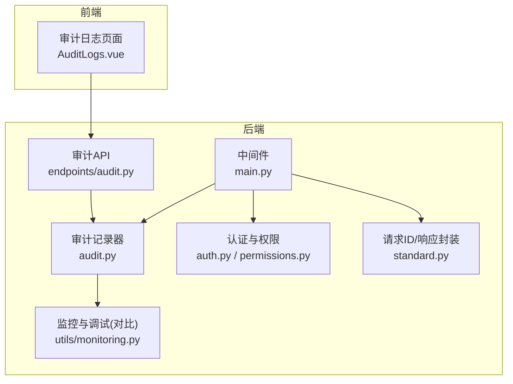
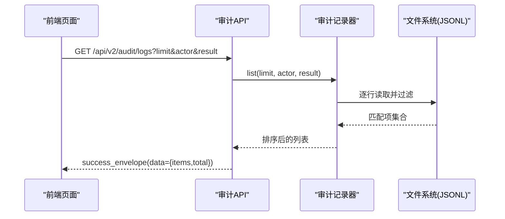
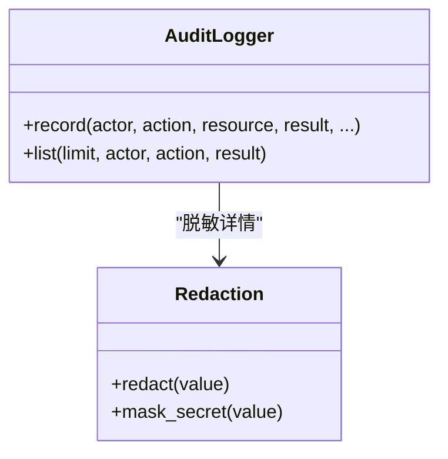
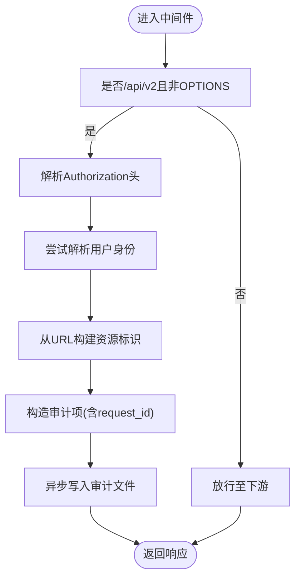
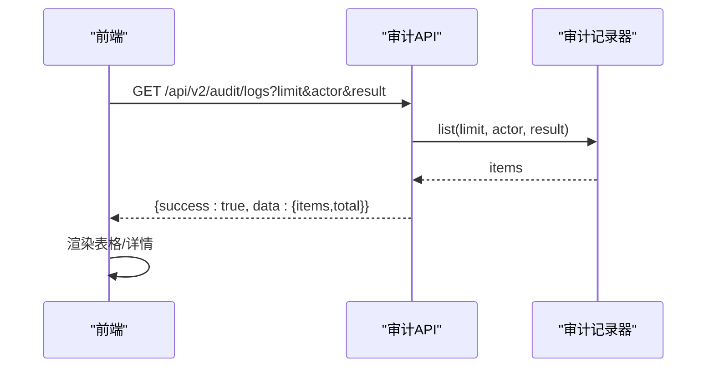
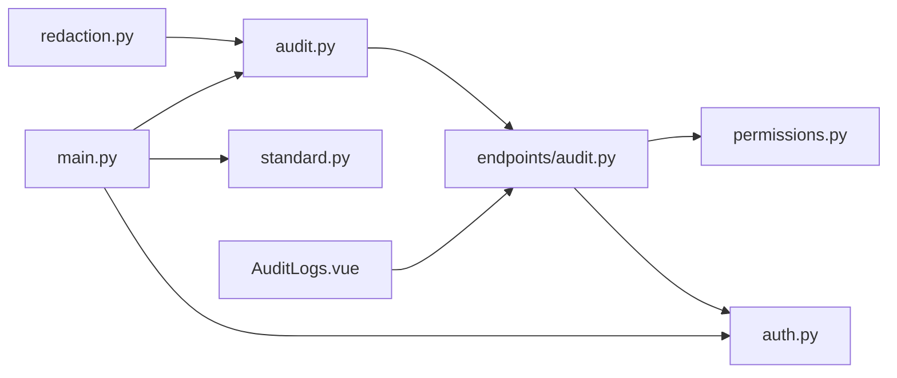

# 审计日志

<cite>
**本文引用的文件**
- [backend/src/security/audit.py](file://backend/src/security/audit.py)
- [backend/src/security/redaction.py](file://backend/src/security/redaction.py)
- [backend/src/api/v2/endpoints/audit.py](file://backend/src/api/v2/endpoints/audit.py)
- [backend/src/api/v2/standard.py](file://backend/src/api/v2/standard.py)
- [backend/src/security/auth.py](file://backend/src/security/auth.py)
- [backend/src/security/permissions.py](file://backend/src/security/permissions.py)
- [backend/src/utils/monitoring.py](file://backend/src/utils/monitoring.py)
- [backend/main.py](file://backend/main.py)
- [frontend-v2/src/views/AuditLogs.vue](file://frontend-v2/src/views/AuditLogs.vue)
- [backend/tests/test_iam_audit.py](file://backend/tests/test_iam_audit.py)
- [backend/config.env.example](file://backend/config.env.example)
</cite>

## 目录
1. [简介](#简介)
2. [项目结构](#项目结构)
3. [核心组件](#核心组件)
4. [架构总览](#架构总览)
5. [组件详细分析](#组件详细分析)
6. [依赖关系分析](#依赖关系分析)
7. [性能与容量考虑](#性能与容量考虑)
8. [故障排查指南](#故障排查指南)
9. [结论](#结论)
10. [附录](#附录)

## 简介
本文件面向“钉钉K8s运维机器人”的审计日志系统，提供从设计原理、数据结构、存储格式、查询与分析、策略配置到API使用与合规落地的完整说明。系统通过中间件自动采集API调用行为，结合敏感信息脱敏与权限控制，形成可追溯、可查询、可合规的操作审计能力，并配套前端页面支持日常审计查看。

## 项目结构
围绕审计日志的关键代码分布在以下模块：
- 审计记录与查询：backend/src/security/audit.py
- 敏感信息脱敏：backend/src/security/redaction.py
- 审计API端点：backend/src/api/v2/endpoints/audit.py
- 请求ID与响应封装：backend/src/api/v2/standard.py
- 身份认证与权限：backend/src/security/auth.py、backend/src/security/permissions.py
- 中间件自动审计：backend/main.py
- 前端审计页面：frontend-v2/src/views/AuditLogs.vue
- 监控与调试（对比参考）：backend/src/utils/monitoring.py
- 测试用例：backend/tests/test_iam_audit.py
- 环境配置示例：backend/config.env.example

图表来源
- [backend/main.py:350-395](file://backend/main.py#L350-L395)
- [backend/src/security/audit.py:21-95](file://backend/src/security/audit.py#L21-L95)
- [backend/src/api/v2/endpoints/audit.py:14-35](file://backend/src/api/v2/endpoints/audit.py#L14-L35)
- [backend/src/security/auth.py:151-182](file://backend/src/security/auth.py#L151-L182)
- [backend/src/api/v2/standard.py:12-38](file://backend/src/api/v2/standard.py#L12-L38)
- [backend/src/utils/monitoring.py:51-261](file://backend/src/utils/monitoring.py#L51-L261)
- [frontend-v2/src/views/AuditLogs.vue:78-113](file://frontend-v2/src/views/AuditLogs.vue#L78-L113)

章节来源
- [backend/src/security/audit.py:1-96](file://backend/src/security/audit.py#L1-L96)
- [backend/src/api/v2/endpoints/audit.py:1-36](file://backend/src/api/v2/endpoints/audit.py#L1-L36)
- [backend/main.py:350-395](file://backend/main.py#L350-L395)
- [frontend-v2/src/views/AuditLogs.vue:1-160](file://frontend-v2/src/views/AuditLogs.vue#L1-L160)

## 核心组件
- 审计记录器：负责将一次操作写入本地JSONL文件，字段包含唯一ID、时间戳、操作者、动作、资源、结果、请求ID、方法、路径、IP、UA、详情等；详情内容会进行敏感信息脱敏。
- 审计API：提供分页查询接口，支持按操作者、动作关键字、结果过滤。
- 中间件自动审计：在每个/api/v2请求完成后异步记录一次操作审计，自动识别用户身份、资源类型、结果状态与耗时等。
- 权限与认证：审计查询需具备“audit:read”权限；用户身份来自JWT解析。
- 前端页面：提供筛选条件（操作者、动作、结果、数量），展示列表并支持查看详情弹窗。
- 脱敏策略：对常见敏感键与敏感值进行掩码处理，避免日志泄露。

章节来源
- [backend/src/security/audit.py:21-95](file://backend/src/security/audit.py#L21-L95)
- [backend/src/api/v2/endpoints/audit.py:14-35](file://backend/src/api/v2/endpoints/audit.py#L14-L35)
- [backend/main.py:350-395](file://backend/main.py#L350-L395)
- [backend/src/security/auth.py:151-182](file://backend/src/security/auth.py#L151-L182)
- [frontend-v2/src/views/AuditLogs.vue:78-113](file://frontend-v2/src/views/AuditLogs.vue#L78-L113)
- [backend/src/security/redaction.py:48-79](file://backend/src/security/redaction.py#L48-L79)

## 架构总览
审计流程分为“自动审计”和“手动查询”两条主线：
- 自动审计：请求经中间件拦截，解析用户身份，构造审计项，异步落盘。
- 手动查询：前端发起查询，后端API根据参数过滤，返回JSON列表。

图表来源
- [frontend-v2/src/views/AuditLogs.vue:92-105](file://frontend-v2/src/views/AuditLogs.vue#L92-L105)
- [backend/src/api/v2/endpoints/audit.py:14-35](file://backend/src/api/v2/endpoints/audit.py#L14-L35)
- [backend/src/security/audit.py:63-90](file://backend/src/security/audit.py#L63-L90)
- [backend/src/api/v2/standard.py:21-38](file://backend/src/api/v2/standard.py#L21-L38)

## 组件详细分析

### 审计记录器与数据模型
- 存储介质：本地JSON Lines文件，默认路径可通过环境变量配置。
- 写入方式：追加写，线程安全锁保护。
- 字段定义：
  - id：UUID十六进制字符串
  - timestamp：Unix秒时间戳
  - actor：操作者（用户名或匿名/无效令牌）
  - action：动作（如api.get、api.post等）
  - resource：资源（从URL路径推断）
  - resource_id：资源ID（当前为空）
  - result：结果（success/failure）
  - request_id：请求ID（来自标准封装）
  - method/path/ip/user_agent：请求上下文
  - details：附加详情（含状态码、耗时等），会进行脱敏
- 查询逻辑：按actor/action/result过滤，限制最大返回条数，返回最新在前。

图表来源
- [backend/src/security/audit.py:21-95](file://backend/src/security/audit.py#L21-L95)
- [backend/src/security/redaction.py:48-79](file://backend/src/security/redaction.py#L48-L79)

章节来源
- [backend/src/security/audit.py:17-95](file://backend/src/security/audit.py#L17-L95)
- [backend/src/security/redaction.py:9-79](file://backend/src/security/redaction.py#L9-L79)

### 中间件自动审计流程
- 触发时机：所有/api/v2的非OPTIONS请求在响应后触发。
- 用户识别：从Authorization头解析Bearer Token，尝试解析用户；失败则标记为无效令牌。
- 资源识别：从URL路径提取资源段。
- 结果判定：依据HTTP状态码判断success/failure。
- 异步落盘：使用线程池异步写入，不影响主请求链路。

图表来源
- [backend/main.py:354-395](file://backend/main.py#L354-L395)
- [backend/src/api/v2/standard.py:12-18](file://backend/src/api/v2/standard.py#L12-L18)
- [backend/src/security/auth.py:151-182](file://backend/src/security/auth.py#L151-L182)

章节来源
- [backend/main.py:350-395](file://backend/main.py#L350-L395)
- [backend/src/api/v2/standard.py:12-18](file://backend/src/api/v2/standard.py#L12-L18)
- [backend/src/security/auth.py:151-182](file://backend/src/security/auth.py#L151-L182)

### 审计API与前端交互
- API端点：GET /api/v2/audit/logs，支持limit、actor、action、result参数，返回items与total。
- 权限控制：需要audit:read权限。
- 前端页面：提供筛选表单与表格展示，支持按操作者、动作、结果、数量筛选，点击“查看”显示事件详情。

图表来源
- [backend/src/api/v2/endpoints/audit.py:14-35](file://backend/src/api/v2/endpoints/audit.py#L14-L35)
- [backend/src/security/audit.py:63-90](file://backend/src/security/audit.py#L63-L90)
- [frontend-v2/src/views/AuditLogs.vue:92-113](file://frontend-v2/src/views/AuditLogs.vue#L92-L113)

章节来源
- [backend/src/api/v2/endpoints/audit.py:14-35](file://backend/src/api/v2/endpoints/audit.py#L14-L35)
- [frontend-v2/src/views/AuditLogs.vue:78-113](file://frontend-v2/src/views/AuditLogs.vue#L78-L113)

### 敏感信息脱敏策略
- 敏感键集合与正则：覆盖常见密钥、令牌、授权头等。
- 脱敏规则：
  - 映射对象：对敏感键对应的值进行掩码，其他键递归处理。
  - 字符串：若匹配敏感模式且较长，整串替换为掩码。
  - 其他类型：按数据结构递归处理（dataclass、model_dump、__dict__等）。
- 日志输出：details字段在写入前统一脱敏，避免泄露。

章节来源
- [backend/src/security/redaction.py:9-79](file://backend/src/security/redaction.py#L9-L79)

### 权限与认证
- 权限常量与内置角色：包含audit:read等权限，内置admin/operator/viewer三类角色。
- 认证依赖：基于Bearer Token解析用户身份，注入到请求状态。
- 审计查询依赖：require_permission("audit:read")确保只有具备审计读取权限的用户可查询。

章节来源
- [backend/src/security/permissions.py:7-75](file://backend/src/security/permissions.py#L7-L75)
- [backend/src/security/auth.py:151-182](file://backend/src/security/auth.py#L151-L182)
- [backend/src/api/v2/endpoints/audit.py:21](file://backend/src/api/v2/endpoints/audit.py#L21)

## 依赖关系分析
- 审计记录器依赖脱敏模块，保证详情字段安全。
- 审计API依赖认证与权限模块，确保访问控制。
- 中间件依赖标准请求ID生成与认证服务，确保审计项具备可追踪性。
- 前端依赖审计API，实现可视化查询。

图表来源
- [backend/src/security/audit.py:14](file://backend/src/security/audit.py#L14)
- [backend/src/api/v2/endpoints/audit.py:7-8](file://backend/src/api/v2/endpoints/audit.py#L7-L8)
- [backend/src/security/auth.py:21-22](file://backend/src/security/auth.py#L21-L22)
- [backend/src/security/permissions.py:21](file://backend/src/security/permissions.py#L21)
- [backend/src/api/v2/standard.py:12-18](file://backend/src/api/v2/standard.py#L12-L18)
- [backend/main.py:357-389](file://backend/main.py#L357-L389)
- [frontend-v2/src/views/AuditLogs.vue:80](file://frontend-v2/src/views/AuditLogs.vue#L80)

章节来源
- [backend/src/security/audit.py:14-14](file://backend/src/security/audit.py#L14-L14)
- [backend/src/api/v2/endpoints/audit.py:7-8](file://backend/src/api/v2/endpoints/audit.py#L7-L8)
- [backend/src/security/auth.py:21-22](file://backend/src/security/auth.py#L21-L22)
- [backend/src/security/permissions.py:21](file://backend/src/security/permissions.py#L21)
- [backend/src/api/v2/standard.py:12-18](file://backend/src/api/v2/standard.py#L12-L18)
- [backend/main.py:357-389](file://backend/main.py#L357-L389)
- [frontend-v2/src/views/AuditLogs.vue:80](file://frontend-v2/src/views/AuditLogs.vue#L80)

## 性能与容量考虑
- 写入性能：采用追加写+线程锁，适合单机本地文件；高并发下建议评估磁盘IO与文件大小。
- 查询性能：顺序扫描文件并过滤，适合中小规模日志；大规模场景建议引入索引或外部存储。
- 异步落盘：中间件使用异步任务写入，避免阻塞请求响应。
- 限制与边界：列表查询限制最大返回条数，防止一次性拉取过大。

章节来源
- [backend/src/security/audit.py:73-73](file://backend/src/security/audit.py#L73-L73)
- [backend/main.py:373-391](file://backend/main.py#L373-L391)

## 故障排查指南
- 审计文件未生成
  - 检查环境变量是否正确设置审计文件路径。
  - 确认中间件是否拦截到/api/v2请求。
- 查询无结果
  - 确认查询参数是否与记录中的字段一致（如action关键字匹配）。
  - 检查文件是否存在且可读。
- 权限不足
  - 确认当前用户具备audit:read权限。
- 敏感信息泄露风险
  - 确认脱敏规则覆盖了相关键名与值。
- 单元测试参考
  - 可参考测试用例验证审计读取与脱敏效果。

章节来源
- [backend/src/security/audit.py:71-72](file://backend/src/security/audit.py#L71-L72)
- [backend/src/security/permissions.py:23](file://backend/src/security/permissions.py#L23)
- [backend/src/security/redaction.py:48-79](file://backend/src/security/redaction.py#L48-L79)
- [backend/tests/test_iam_audit.py:77-106](file://backend/tests/test_iam_audit.py#L77-L106)

## 结论
该审计日志系统以轻量、易部署为目标，通过中间件自动采集与API手动查询相结合的方式，实现了对用户操作、系统事件的可追溯记录。配合敏感信息脱敏与细粒度权限控制，满足基本的合规与审计需求。对于更大规模或更复杂的审计场景，可考虑引入集中式日志存储与查询引擎。

## 附录

### 审计日志字段定义与含义
- id：事件唯一标识
- timestamp：事件发生时间（秒）
- actor：操作者（用户名/匿名/无效令牌）
- action：动作（如api.get、api.post等）
- resource：资源（从URL路径推断）
- resource_id：资源ID（当前为空）
- result：结果（success/failure）
- request_id：请求ID
- method/path/ip/user_agent：请求上下文
- details：附加详情（含状态码、耗时等），已脱敏

章节来源
- [backend/src/security/audit.py:42-56](file://backend/src/security/audit.py#L42-L56)

### 审计策略配置与管理
- 文件路径：通过环境变量配置审计日志文件路径。
- 查询限制：最大返回条数限制，防止过度消耗资源。
- 权限策略：仅具备audit:read权限的用户可查询。
- 脱敏策略：对敏感键与敏感值进行掩码处理。

章节来源
- [backend/src/security/audit.py:17-18](file://backend/src/security/audit.py#L17-L18)
- [backend/src/security/audit.py:73-73](file://backend/src/security/audit.py#L73-L73)
- [backend/src/security/permissions.py:23](file://backend/src/security/permissions.py#L23)
- [backend/src/security/redaction.py:48-79](file://backend/src/security/redaction.py#L48-L79)

### 审计日志API使用示例
- 查询最近100条日志，按操作者过滤
  - GET /api/v2/audit/logs?limit=100&actor=admin
- 查询失败事件
  - GET /api/v2/audit/logs?result=failure
- 查询包含特定动作关键字的日志
  - GET /api/v2/audit/logs?action=users

章节来源
- [backend/src/api/v2/endpoints/audit.py:14-35](file://backend/src/api/v2/endpoints/audit.py#L14-L35)

### 审计分析工具集成方法
- 本地文件：审计日志为JSON Lines格式，可直接接入通用日志平台或批处理脚本进行统计分析。
- 建议：在生产环境中将审计文件纳入集中日志采集与归档策略，设置轮转与保留周期。

章节来源
- [backend/src/security/audit.py:17-18](file://backend/src/security/audit.py#L17-L18)

### 审计合规性与报告
- 合规要点：确保操作者身份、动作、资源、结果、时间戳、请求上下文完整记录；对敏感信息进行脱敏。
- 报告建议：基于API查询结果生成周期性报告，包含高频操作、失败趋势、关键资源变更等维度。

章节来源
- [backend/src/security/audit.py:42-56](file://backend/src/security/audit.py#L42-L56)
- [backend/src/security/redaction.py:48-79](file://backend/src/security/redaction.py#L48-L79)