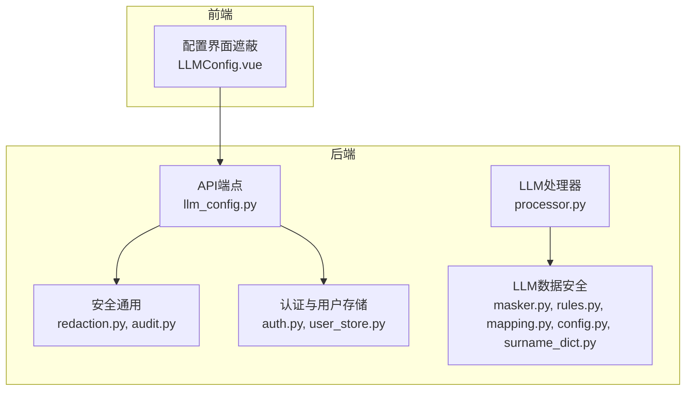
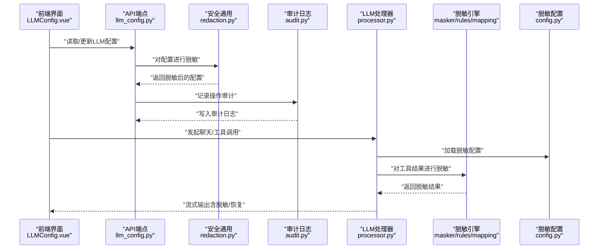
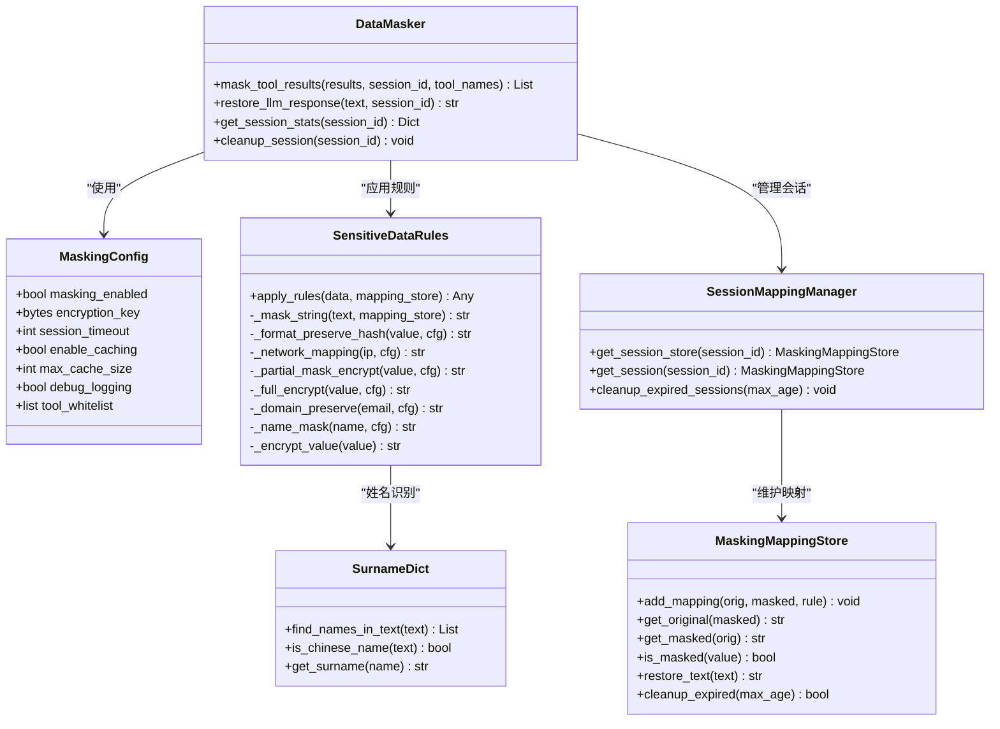
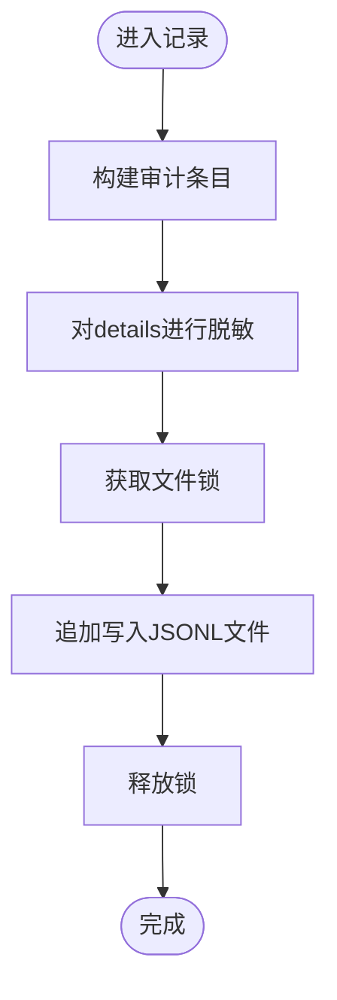
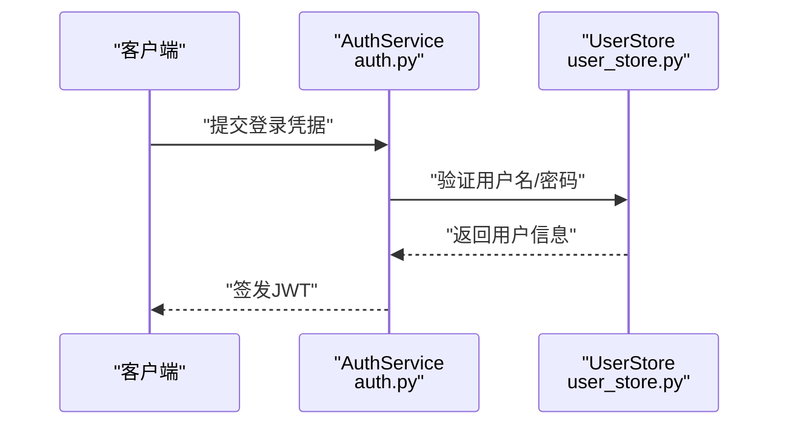
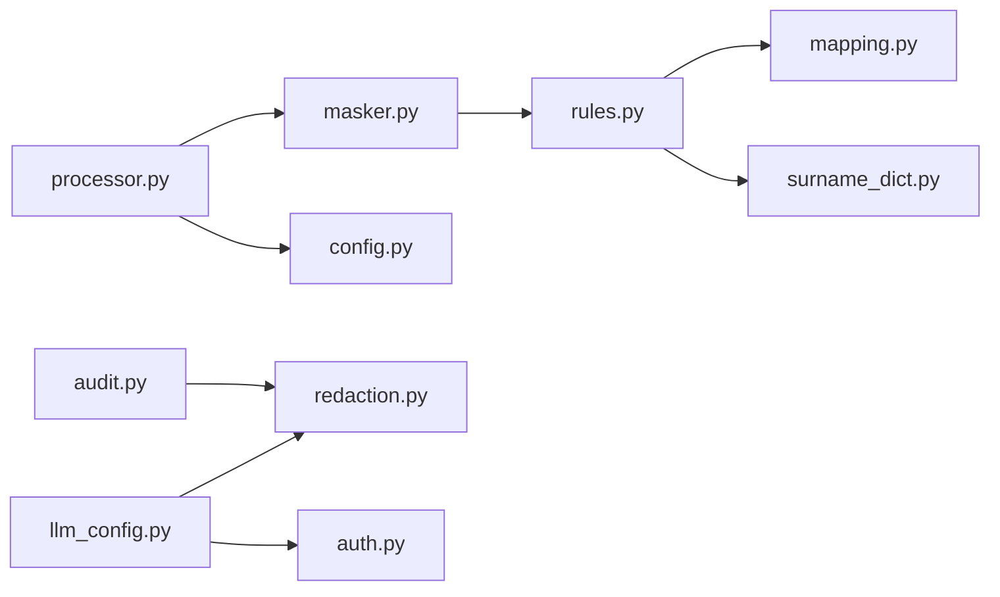

# 数据安全

<cite>
**本文引用的文件**
- [redaction.py](file://backend/src/security/redaction.py)
- [audit.py](file://backend/src/security/audit.py)
- [auth.py](file://backend/src/security/auth.py)
- [user_store.py](file://backend/src/security/user_store.py)
- [masker.py](file://backend/src/llm/security/masker.py)
- [rules.py](file://backend/src/llm/security/rules.py)
- [mapping.py](file://backend/src/llm/security/mapping.py)
- [config.py](file://backend/src/llm/security/config.py)
- [surname_dict.py](file://backend/src/llm/security/surname_dict.py)
- [processor.py](file://backend/src/llm/processor.py)
- [llm_config.py](file://backend/src/api/v2/endpoints/llm_config.py)
- [LLMConfig.vue](file://frontend-v2/src/views/LLMConfig.vue)
- [README.md](file://config/README.md)
</cite>

## 目录
1. [简介](#简介)
2. [项目结构](#项目结构)
3. [核心组件](#核心组件)
4. [架构总览](#架构总览)
5. [详细组件分析](#详细组件分析)
6. [依赖关系分析](#依赖关系分析)
7. [性能考量](#性能考量)
8. [故障排查指南](#故障排查指南)
9. [结论](#结论)
10. [附录](#附录)

## 简介
本文件面向“钉钉K8s运维机器人”的数据安全体系，围绕敏感数据脱敏、加密存储与传输、显示层遮蔽、数据恢复层还原、安全配置与最佳实践、泄露防护与审计等方面进行系统化说明。文档同时给出代码级架构图与流程图，帮助读者快速理解实现细节与落地方法。

## 项目结构
本项目在后端与前端分别实现了数据安全能力：
- 后端安全能力
  - 通用脱敏与审计：redaction、audit
  - 认证与用户存储：auth、user_store
  - LLM数据安全：masker、rules、mapping、config、surname_dict
  - LLM处理器集成：processor
  - API端点：llm_config
- 前端安全能力
  - 配置界面的敏感信息遮蔽：LLMConfig.vue

**图表来源**
- [redaction.py:1-79](file://backend/src/security/redaction.py#L1-L79)
- [audit.py:1-96](file://backend/src/security/audit.py#L1-L96)
- [auth.py:1-182](file://backend/src/security/auth.py#L1-L182)
- [user_store.py:1-292](file://backend/src/security/user_store.py#L1-L292)
- [masker.py:1-150](file://backend/src/llm/security/masker.py#L1-L150)
- [rules.py:1-233](file://backend/src/llm/security/rules.py#L1-L233)
- [mapping.py:1-152](file://backend/src/llm/security/mapping.py#L1-L152)
- [config.py:1-37](file://backend/src/llm/security/config.py#L1-L37)
- [surname_dict.py:1-93](file://backend/src/llm/security/surname_dict.py#L1-L93)
- [processor.py:1-800](file://backend/src/llm/processor.py#L1-L800)
- [llm_config.py:1-473](file://backend/src/api/v2/endpoints/llm_config.py#L1-L473)
- [LLMConfig.vue:344-362](file://frontend-v2/src/views/LLMConfig.vue#L344-L362)

**章节来源**
- [redaction.py:1-79](file://backend/src/security/redaction.py#L1-L79)
- [audit.py:1-96](file://backend/src/security/audit.py#L1-L96)
- [auth.py:1-182](file://backend/src/security/auth.py#L1-L182)
- [user_store.py:1-292](file://backend/src/security/user_store.py#L1-L292)
- [masker.py:1-150](file://backend/src/llm/security/masker.py#L1-L150)
- [rules.py:1-233](file://backend/src/llm/security/rules.py#L1-L233)
- [mapping.py:1-152](file://backend/src/llm/security/mapping.py#L1-L152)
- [config.py:1-37](file://backend/src/llm/security/config.py#L1-L37)
- [surname_dict.py:1-93](file://backend/src/llm/security/surname_dict.py#L1-L93)
- [processor.py:1-800](file://backend/src/llm/processor.py#L1-L800)
- [llm_config.py:1-473](file://backend/src/api/v2/endpoints/llm_config.py#L1-L473)
- [LLMConfig.vue:344-362](file://frontend-v2/src/views/LLMConfig.vue#L344-L362)

## 核心组件
- 敏感数据脱敏与恢复
  - 通用脱敏：redaction.py 提供键值敏感性判定与递归脱敏
  - LLM专用脱敏：masker.py、rules.py、mapping.py、config.py、surname_dict.py 实现多规则脱敏、会话映射与恢复
- 审计与日志
  - audit.py 提供只追加的本地操作审计日志，自动对敏感字段进行脱敏
- 认证与用户存储
  - auth.py 提供基于HMAC-SHA256的JWT签发与校验、会话密钥管理
  - user_store.py 提供PBKDF2-HMAC密码哈希、用户与角色持久化
- 显示层遮蔽
  - LLMConfig.vue 对配置界面中的敏感键进行遮蔽显示
- API与处理器集成
  - llm_config.py 在读取/返回配置时使用redact进行脱敏
  - processor.py 在两阶段LLM处理中集成脱敏器，确保工具结果与响应在输出前完成脱敏/恢复

**章节来源**
- [redaction.py:1-79](file://backend/src/security/redaction.py#L1-L79)
- [audit.py:1-96](file://backend/src/security/audit.py#L1-L96)
- [auth.py:1-182](file://backend/src/security/auth.py#L1-L182)
- [user_store.py:1-292](file://backend/src/security/user_store.py#L1-L292)
- [masker.py:1-150](file://backend/src/llm/security/masker.py#L1-L150)
- [rules.py:1-233](file://backend/src/llm/security/rules.py#L1-L233)
- [mapping.py:1-152](file://backend/src/llm/security/mapping.py#L1-L152)
- [config.py:1-37](file://backend/src/llm/security/config.py#L1-L37)
- [surname_dict.py:1-93](file://backend/src/llm/security/surname_dict.py#L1-L93)
- [llm_config.py:79-91](file://backend/src/api/v2/endpoints/llm_config.py#L79-L91)
- [processor.py:50-57](file://backend/src/llm/processor.py#L50-L57)

## 架构总览
下图展示了数据在系统中的流动路径：从API读取配置、到LLM处理器执行工具、再到脱敏/恢复与最终输出；同时贯穿审计日志与前端遮蔽。

**图表来源**
- [llm_config.py:79-91](file://backend/src/api/v2/endpoints/llm_config.py#L79-L91)
- [redaction.py:48-79](file://backend/src/security/redaction.py#L48-L79)
- [audit.py:27-61](file://backend/src/security/audit.py#L27-L61)
- [processor.py:50-57](file://backend/src/llm/processor.py#L50-L57)
- [masker.py:25-75](file://backend/src/llm/security/masker.py#L25-L75)
- [config.py:9-37](file://backend/src/llm/security/config.py#L9-L37)

## 详细组件分析

### 敏感数据脱敏与恢复（LLM专用）
- 多规则脱敏
  - IP地址：网络映射，保留末位或唯一映射，避免冲突
  - 主机名：格式保持哈希，保留后缀编号
  - 电话/令牌：部分掩码+加密，或完全加密
  - 中文姓名：基于姓氏词典的精确识别与遮蔽
  - 邮箱：域名保持，本地部分掩码
- 会话映射与恢复
  - 通过会话存储记录original→masked映射，支持在恢复阶段按规则精确替换
  - 提供清理过期会话与统计接口
- 配置与白名单
  - 支持开关、密钥、缓存、调试、工具白名单等配置项

**图表来源**
- [masker.py:12-150](file://backend/src/llm/security/masker.py#L12-L150)
- [rules.py:13-233](file://backend/src/llm/security/rules.py#L13-L233)
- [mapping.py:9-152](file://backend/src/llm/security/mapping.py#L9-L152)
- [config.py:9-37](file://backend/src/llm/security/config.py#L9-L37)
- [surname_dict.py:10-93](file://backend/src/llm/security/surname_dict.py#L10-L93)

**章节来源**
- [masker.py:25-109](file://backend/src/llm/security/masker.py#L25-L109)
- [rules.py:23-151](file://backend/src/llm/security/rules.py#L23-L151)
- [mapping.py:46-112](file://backend/src/llm/security/mapping.py#L46-L112)
- [config.py:12-37](file://backend/src/llm/security/config.py#L12-L37)
- [surname_dict.py:37-84](file://backend/src/llm/security/surname_dict.py#L37-L84)

### 通用脱敏与审计
- redaction.py
  - 敏感键集合与正则匹配，支持字符串、映射、列表/元组/集合、数据类、Pydantic模型、对象等类型的递归脱敏
  - 对字符串值进行长度与模式判断，避免过度脱敏
- audit.py
  - 本地只追加JSONL审计日志，线程安全，支持按条件检索
  - 在记录时对details进行脱敏

**图表来源**
- [audit.py:27-61](file://backend/src/security/audit.py#L27-L61)
- [redaction.py:48-79](file://backend/src/security/redaction.py#L48-L79)

**章节来源**
- [redaction.py:9-79](file://backend/src/security/redaction.py#L9-L79)
- [audit.py:21-96](file://backend/src/security/audit.py#L21-L96)

### 认证与用户存储
- auth.py
  - JWT签发与校验，使用HMAC-SHA256签名，支持从环境变量或文件加载会话密钥
  - 提供当前用户解析与权限依赖注入
- user_store.py
  - PBKDF2-HMAC密码哈希，支持用户增删改查、角色合并、登录时间追踪
  - 初始管理员密码生成与引导提示

**图表来源**
- [auth.py:73-135](file://backend/src/security/auth.py#L73-L135)
- [user_store.py:188-200](file://backend/src/security/user_store.py#L188-L200)

**章节来源**
- [auth.py:73-182](file://backend/src/security/auth.py#L73-L182)
- [user_store.py:61-292](file://backend/src/security/user_store.py#L61-L292)

### 显示层数据遮蔽（前端）
- LLMConfig.vue
  - 对配置对象进行递归遮蔽，敏感键（如API Key、Token、密码等）统一替换为占位符

**章节来源**
- [LLMConfig.vue:347-360](file://frontend-v2/src/views/LLMConfig.vue#L347-L360)

### API与处理器集成
- llm_config.py
  - 在返回当前配置时，使用redact对敏感字段进行脱敏
- processor.py
  - 初始化DataMasker，集成脱敏器到两阶段LLM处理流程
  - 在工具结果阶段执行mask_tool_results，在流式输出前执行restore_llm_response

**章节来源**
- [llm_config.py:79-91](file://backend/src/api/v2/endpoints/llm_config.py#L79-L91)
- [processor.py:50-57](file://backend/src/llm/processor.py#L50-L57)

## 依赖关系分析
- 组件耦合
  - processor依赖masker与config，形成“配置→规则→映射”的链路
  - llm_config.py依赖redaction与auth，保障配置读取与鉴权
  - audit依赖redaction，确保审计日志不泄露敏感信息
- 外部依赖
  - cryptography库用于AES加密
  - loguru用于日志记录
  - fastapi、pydantic用于API与配置模型

**图表来源**
- [processor.py:24-27](file://backend/src/llm/processor.py#L24-L27)
- [masker.py:15-19](file://backend/src/llm/security/masker.py#L15-L19)
- [rules.py:8-11](file://backend/src/llm/security/rules.py#L8-L11)
- [mapping.py:9-11](file://backend/src/llm/security/mapping.py#L9-L11)
- [surname_dict.py:10-11](file://backend/src/llm/security/surname_dict.py#L10-L11)
- [llm_config.py:20-22](file://backend/src/api/v2/endpoints/llm_config.py#L20-L22)
- [audit.py:14-14](file://backend/src/security/audit.py#L14-L14)

**章节来源**
- [processor.py:24-27](file://backend/src/llm/processor.py#L24-L27)
- [masker.py:15-19](file://backend/src/llm/security/masker.py#L15-L19)
- [rules.py:8-11](file://backend/src/llm/security/rules.py#L8-L11)
- [mapping.py:9-11](file://backend/src/llm/security/mapping.py#L9-L11)
- [surname_dict.py:10-11](file://backend/src/llm/security/surname_dict.py#L10-L11)
- [llm_config.py:20-22](file://backend/src/api/v2/endpoints/llm_config.py#L20-L22)
- [audit.py:14-14](file://backend/src/security/audit.py#L14-L14)

## 性能考量
- 脱敏性能
  - 正则匹配与字典查找的复杂度与输入规模相关，建议控制单次处理的数据量
  - 会话映射按长度降序替换，减少歧义匹配带来的重复扫描
- 缓存与会话
  - config支持缓存开关与容量限制，结合会话超时清理，平衡内存占用与命中率
- 日志与审计
  - 审计日志为只追加写入，避免随机写入开销；建议合理设置日志路径与轮转策略

[本节为通用指导，无需列出具体文件来源]

## 故障排查指南
- 脱敏未生效
  - 检查masking_enabled与工具白名单配置
  - 确认会话ID正确传递，映射表是否建立
- 恢复不准确
  - 检查映射表是否过期清理，确认恢复顺序（按长度降序）
- 审计日志缺失
  - 检查审计日志路径与权限，确认details是否为空
- 认证失败
  - 检查会话密钥文件权限与内容，确认JWT签名与过期时间

**章节来源**
- [masker.py:127-136](file://backend/src/llm/security/masker.py#L127-L136)
- [mapping.py:114-123](file://backend/src/llm/security/mapping.py#L114-L123)
- [audit.py:17-25](file://backend/src/security/audit.py#L17-L25)
- [auth.py:36-49](file://backend/src/security/auth.py#L36-L49)

## 结论
本系统通过“规则驱动的多层脱敏、会话级映射恢复、只追加审计、前端遮蔽与强认证”构建了完整的数据安全闭环。建议在生产环境中严格管理密钥与会话配置，定期清理过期映射与审计日志，持续优化脱敏规则与性能参数。

[本节为总结性内容，无需列出具体文件来源]

## 附录

### 数据安全配置指南
- 脱敏配置
  - LLM_MASKING_ENABLED：启用/禁用脱敏
  - LLM_MASKING_KEY：Base64编码的32字节密钥，建议持久化存储
  - LLM_MASKING_SESSION_TIMEOUT：会话超时秒数
  - LLM_MASKING_CACHE/LLM_MASKING_CACHE_SIZE：缓存开关与容量
  - LLM_MASKING_DEBUG：调试日志开关
  - LLM_MASKING_TOOL_WHITELIST：工具白名单，逗号分隔
- 审计日志
  - OPERATION_AUDIT_LOG_PATH：审计日志文件路径
- 密钥与会话
  - APP_SESSION_SECRET 或 APP_SESSION_SECRET_FILE：会话密钥
  - APP_SESSION_EXPIRES_SECONDS：会话过期时间

**章节来源**
- [config.py:12-37](file://backend/src/llm/security/config.py#L12-L37)
- [audit.py:17-18](file://backend/src/security/audit.py#L17-L18)
- [auth.py:36-49](file://backend/src/security/auth.py#L36-L49)
- [README.md:15-16](file://config/README.md#L15-L16)

### 敏感数据处理最佳实践
- 输入侧
  - 对所有外部输入进行最小必要脱敏，避免在日志中打印原始敏感数据
- 处理侧
  - 使用会话映射表进行可逆恢复，仅在必要时解密
  - 控制工具结果大小，必要时进行摘要提炼
- 输出侧
  - 前端对敏感键进行遮蔽显示
  - API返回前再次脱敏，确保不泄露敏感字段

**章节来源**
- [redaction.py:48-79](file://backend/src/security/redaction.py#L48-L79)
- [llm_config.py:79-91](file://backend/src/api/v2/endpoints/llm_config.py#L79-L91)
- [LLMConfig.vue:347-360](file://frontend-v2/src/views/LLMConfig.vue#L347-L360)

### 数据泄露防护与审计实施
- 泄露防护
  - 严格控制密钥与会话密钥的读写权限，避免明文存储
  - 对外输出前统一脱敏，禁止在日志中打印敏感字段
- 审计实施
  - 审计日志采用只追加模式，支持按actor/action/result过滤
  - 审计字段包含请求ID、方法、路径、IP、UA等，便于溯源

**章节来源**
- [audit.py:27-91](file://backend/src/security/audit.py#L27-L91)
- [auth.py:36-49](file://backend/src/security/auth.py#L36-L49)