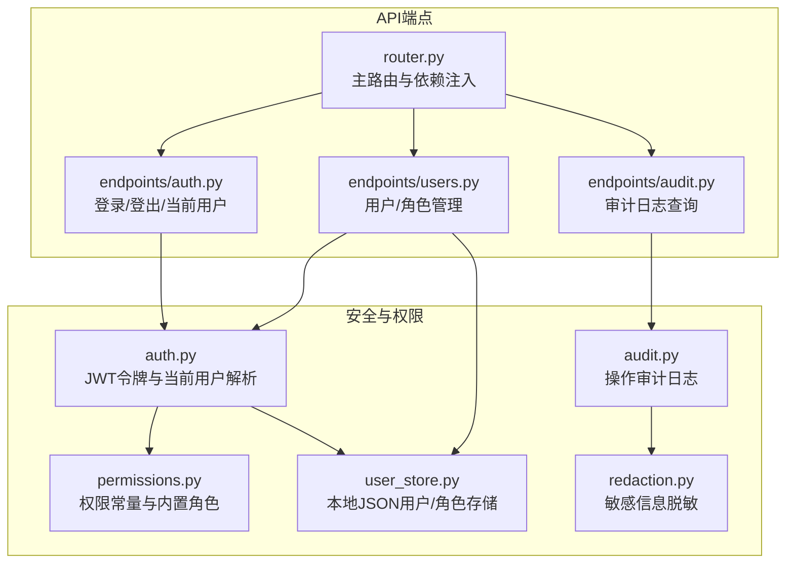
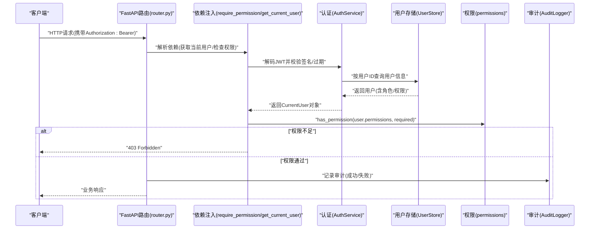
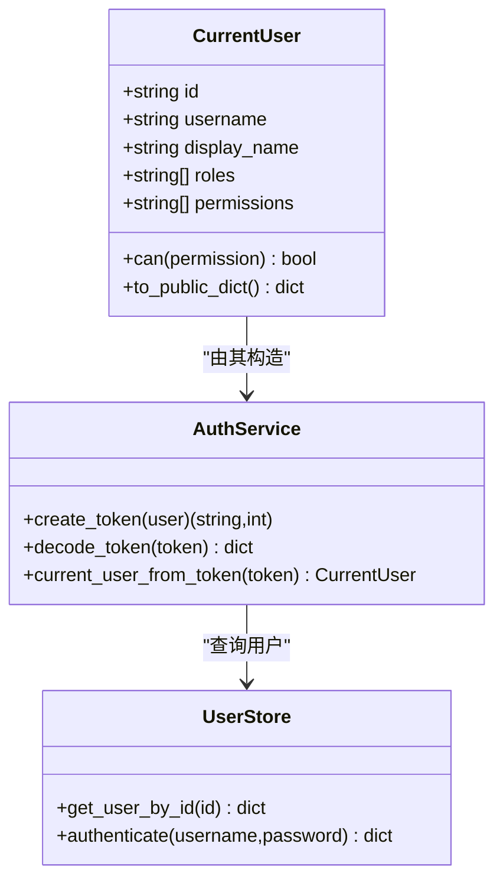
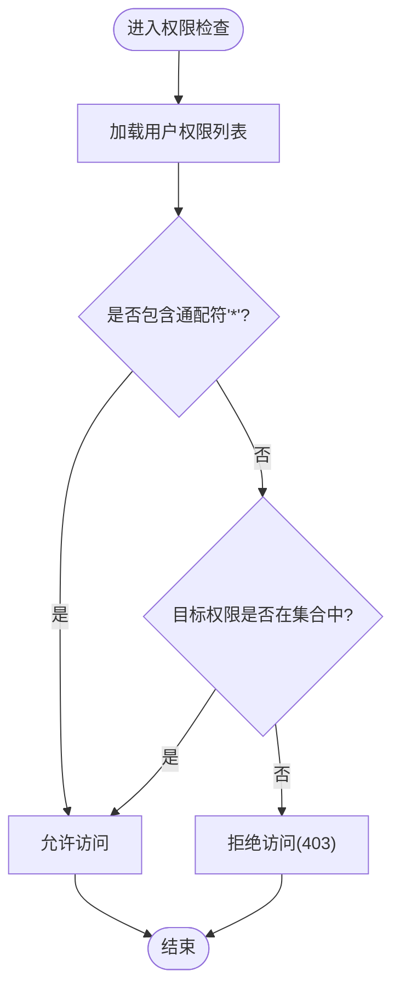
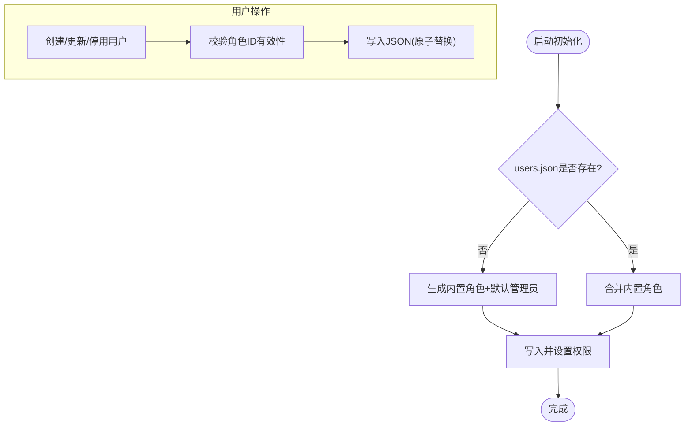
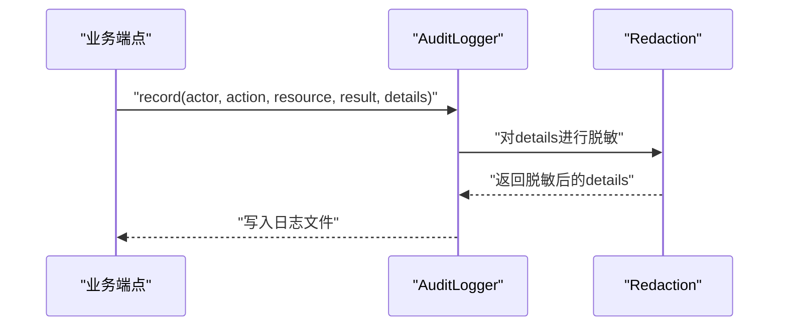
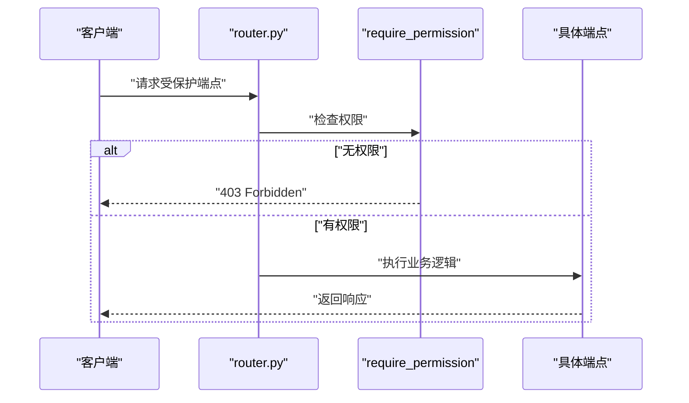
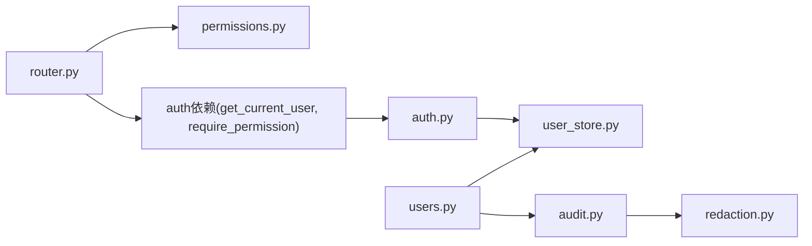

# 权限控制

<cite>
**本文引用的文件**
- [backend/src/security/auth.py](file://backend/src/security/auth.py)
- [backend/src/security/permissions.py](file://backend/src/security/permissions.py)
- [backend/src/security/user_store.py](file://backend/src/security/user_store.py)
- [backend/src/security/audit.py](file://backend/src/security/audit.py)
- [backend/src/security/redaction.py](file://backend/src/security/redaction.py)
- [backend/src/api/v2/endpoints/auth.py](file://backend/src/api/v2/endpoints/auth.py)
- [backend/src/api/v2/endpoints/users.py](file://backend/src/api/v2/endpoints/users.py)
- [backend/src/api/v2/endpoints/audit.py](file://backend/src/api/v2/endpoints/audit.py)
- [backend/src/api/v2/router.py](file://backend/src/api/v2/router.py)
- [backend/tests/test_iam_audit.py](file://backend/tests/test_iam_audit.py)
- [backend/tests/test_iam_security_regressions.py](file://backend/tests/test_iam_security_regressions.py)
- [config/README.md](file://config/README.md)
</cite>

## 目录
1. [简介](#简介)
2. [项目结构](#项目结构)
3. [核心组件](#核心组件)
4. [架构总览](#架构总览)
5. [详细组件分析](#详细组件分析)
6. [依赖关系分析](#依赖关系分析)
7. [性能考量](#性能考量)
8. [故障排查指南](#故障排查指南)
9. [结论](#结论)
10. [附录](#附录)

## 简介
本文件面向“钉钉K8s运维机器人”的权限控制系统，系统采用基于角色的访问控制（RBAC）模型，结合会话令牌与细粒度权限常量，实现对后端API的受控访问。本文档覆盖以下主题：
- RBAC权限模型：角色定义、权限分配与访问控制规则
- 权限验证机制：请求拦截、权限检查与授权决策流程
- 用户角色管理：角色创建、权限授予与内置角色合并策略
- 权限中间件与依赖注入：如何在FastAPI中使用require_permission与get_current_user
- 权限配置示例与最佳实践
- 常见问题排查与安全加固建议

## 项目结构
围绕权限控制的关键目录与文件如下：
- 安全与权限核心：security子模块（认证、权限常量、用户存储、审计、脱敏）
- API端点：v2路由下的认证、用户与审计端点
- 测试：IAM审计与安全回归测试，验证匿名访问拒绝、敏感数据脱敏与权限边界

图表来源
- [backend/src/api/v2/router.py:35-549](file://backend/src/api/v2/router.py#L35-L549)
- [backend/src/api/v2/endpoints/auth.py:1-88](file://backend/src/api/v2/endpoints/auth.py#L1-L88)
- [backend/src/api/v2/endpoints/users.py:1-163](file://backend/src/api/v2/endpoints/users.py#L1-L163)
- [backend/src/api/v2/endpoints/audit.py:1-36](file://backend/src/api/v2/endpoints/audit.py#L1-L36)
- [backend/src/security/auth.py:1-182](file://backend/src/security/auth.py#L1-L182)
- [backend/src/security/permissions.py:1-95](file://backend/src/security/permissions.py#L1-L95)
- [backend/src/security/user_store.py:1-292](file://backend/src/security/user_store.py#L1-L292)
- [backend/src/security/audit.py:1-96](file://backend/src/security/audit.py#L1-L96)
- [backend/src/security/redaction.py:1-79](file://backend/src/security/redaction.py#L1-L79)

章节来源
- [backend/src/api/v2/router.py:35-549](file://backend/src/api/v2/router.py#L35-L549)
- [backend/src/api/v2/endpoints/auth.py:1-88](file://backend/src/api/v2/endpoints/auth.py#L1-L88)
- [backend/src/api/v2/endpoints/users.py:1-163](file://backend/src/api/v2/endpoints/users.py#L1-L163)
- [backend/src/api/v2/endpoints/audit.py:1-36](file://backend/src/api/v2/endpoints/audit.py#L1-L36)
- [backend/src/security/auth.py:1-182](file://backend/src/security/auth.py#L1-L182)
- [backend/src/security/permissions.py:1-95](file://backend/src/security/permissions.py#L1-L95)
- [backend/src/security/user_store.py:1-292](file://backend/src/security/user_store.py#L1-L292)
- [backend/src/security/audit.py:1-96](file://backend/src/security/audit.py#L1-L96)
- [backend/src/security/redaction.py:1-79](file://backend/src/security/redaction.py#L1-L79)

## 核心组件
- 认证与令牌
  - JWT签名算法与载荷校验，过期时间控制，会话密钥管理
  - 当前用户对象封装角色与权限，提供can(permission)便捷判断
- 权限与角色
  - 权限常量集合与内置角色（管理员、运维工程师、只读观察员）
  - 角色到权限的展开与通配符“*”快速授权
- 用户存储
  - 单节点本地JSON存储，含内置角色合并、PBKDF2密码哈希、并发写入保护
  - 用户增删改查、角色分配与权限计算
- 审计日志
  - 追加式JSONL审计日志，线程锁保护，支持按条件检索
  - 敏感信息自动脱敏
- API依赖与中间件
  - FastAPI依赖：get_current_user解析Bearer Token；require_permission进行授权决策
  - 路由层对敏感端点统一添加权限依赖

章节来源
- [backend/src/security/auth.py:52-182](file://backend/src/security/auth.py#L52-L182)
- [backend/src/security/permissions.py:7-95](file://backend/src/security/permissions.py#L7-L95)
- [backend/src/security/user_store.py:61-292](file://backend/src/security/user_store.py#L61-L292)
- [backend/src/security/audit.py:21-96](file://backend/src/security/audit.py#L21-L96)
- [backend/src/security/redaction.py:48-79](file://backend/src/security/redaction.py#L48-L79)
- [backend/src/api/v2/router.py:41-42](file://backend/src/api/v2/router.py#L41-L42)

## 架构总览
下图展示从HTTP请求到权限决策与审计记录的整体流程。

图表来源
- [backend/src/api/v2/router.py:41-42](file://backend/src/api/v2/router.py#L41-L42)
- [backend/src/security/auth.py:151-182](file://backend/src/security/auth.py#L151-L182)
- [backend/src/security/user_store.py:188-200](file://backend/src/security/user_store.py#L188-L200)
- [backend/src/security/permissions.py:93-95](file://backend/src/security/permissions.py#L93-L95)
- [backend/src/security/audit.py:27-61](file://backend/src/security/audit.py#L27-L61)

## 详细组件分析

### 组件A：认证与令牌（AuthService、CurrentUser、依赖注入）
- JWT载荷包含sub、username、iat、exp、jti等，签名使用HMAC-SHA256
- 会话密钥来源优先级：环境变量 > 秘钥文件（自动创建并设置权限）
- 当前用户对象在获取时从用户存储加载角色与权限，并提供can(permission)判断
- FastAPI依赖链：
  - get_current_user：解析Authorization头，解码并校验token，注入CurrentUser
  - require_permission(permission)：在路由层作为依赖，若无权限则抛403

图表来源
- [backend/src/security/auth.py:52-135](file://backend/src/security/auth.py#L52-L135)
- [backend/src/security/user_store.py:180-200](file://backend/src/security/user_store.py#L180-L200)

章节来源
- [backend/src/security/auth.py:36-182](file://backend/src/security/auth.py#L36-L182)
- [backend/src/api/v2/endpoints/auth.py:21-88](file://backend/src/api/v2/endpoints/auth.py#L21-L88)

### 组件B：权限与角色（PERMISSIONS、BUILT_IN_ROLES、expand_permissions、has_permission）
- 权限常量涵盖运维指挥台、对话、LLM/MCP配置、资源指标、巡检、告警、调度、审计、用户管理、调试等
- 内置角色：
  - 系统管理员：拥有全部权限（通配符“*”）
  - 运维工程师：具备日常运维所需读写能力
  - 只读观察员：仅读取权限
- 展开策略：角色权限集合并去重，若任一角色包含“*”，则用户获得全部权限

图表来源
- [backend/src/security/permissions.py:78-95](file://backend/src/security/permissions.py#L78-L95)

章节来源
- [backend/src/security/permissions.py:7-95](file://backend/src/security/permissions.py#L7-L95)

### 组件C：用户存储与角色管理（UserStore）
- 初始化：若用户文件不存在，自动生成内置角色与默认管理员账户，密码写入引导文件
- 并发安全：读写均使用锁保护，写入采用临时文件+原子替换
- 密码安全：PBKDF2-HMAC-SHA256，迭代次数固定
- 角色合并：启动时将内置角色与现有角色比对，保持内置角色最新
- 用户管理：创建、更新、停用用户，角色校验，权限展开

图表来源
- [backend/src/security/user_store.py:69-154](file://backend/src/security/user_store.py#L69-L154)
- [backend/src/security/user_store.py:212-287](file://backend/src/security/user_store.py#L212-L287)

章节来源
- [backend/src/security/user_store.py:61-292](file://backend/src/security/user_store.py#L61-L292)
- [backend/src/api/v2/endpoints/users.py:32-163](file://backend/src/api/v2/endpoints/users.py#L32-L163)

### 组件D：审计与脱敏（AuditLogger、redaction）
- 审计日志：追加式JSONL，记录操作者、动作、资源、结果、请求上下文与详情
- 脱敏策略：对敏感键（如api_key、authorization、token等）与敏感值进行掩码处理
- 日志查询：支持按actor/action/result过滤，限制返回条数

图表来源
- [backend/src/security/audit.py:27-61](file://backend/src/security/audit.py#L27-L61)
- [backend/src/security/redaction.py:48-79](file://backend/src/security/redaction.py#L48-L79)

章节来源
- [backend/src/security/audit.py:21-96](file://backend/src/security/audit.py#L21-L96)
- [backend/src/security/redaction.py:1-79](file://backend/src/security/redaction.py#L1-L79)
- [backend/src/api/v2/endpoints/audit.py:14-36](file://backend/src/api/v2/endpoints/audit.py#L14-L36)

### 组件E：API路由与权限中间件（router、endpoints）
- 路由层对敏感端点统一添加require_permission依赖，例如：
  - 聊天发送：chat:send
  - MCP工具调用：mcp:read（部分工具需要mcp:write）
  - LLM配置读取：llm:read
  - 用户管理：users:read/users:write
  - 审计日志：audit:read
- 登录/登出/当前用户端点由auth.py提供依赖与服务

图表来源
- [backend/src/api/v2/router.py:102-103](file://backend/src/api/v2/router.py#L102-L103)
- [backend/src/api/v2/router.py:179-180](file://backend/src/api/v2/router.py#L179-L180)
- [backend/src/api/v2/router.py:350-351](file://backend/src/api/v2/router.py#L350-L351)
- [backend/src/api/v2/router.py:429-430](file://backend/src/api/v2/router.py#L429-L430)
- [backend/src/api/v2/router.py:555-556](file://backend/src/api/v2/router.py#L555-L556)
- [backend/src/api/v2/router.py:696-697](file://backend/src/api/v2/router.py#L696-L697)
- [backend/src/api/v2/router.py:787-788](file://backend/src/api/v2/router.py#L787-L788)
- [backend/src/api/v2/endpoints/auth.py:21-88](file://backend/src/api/v2/endpoints/auth.py#L21-L88)
- [backend/src/api/v2/endpoints/users.py:32-163](file://backend/src/api/v2/endpoints/users.py#L32-L163)
- [backend/src/api/v2/endpoints/audit.py:14-36](file://backend/src/api/v2/endpoints/audit.py#L14-L36)

章节来源
- [backend/src/api/v2/router.py:41-549](file://backend/src/api/v2/router.py#L41-L549)
- [backend/src/api/v2/endpoints/auth.py:1-88](file://backend/src/api/v2/endpoints/auth.py#L1-L88)
- [backend/src/api/v2/endpoints/users.py:1-163](file://backend/src/api/v2/endpoints/users.py#L1-L163)
- [backend/src/api/v2/endpoints/audit.py:1-36](file://backend/src/api/v2/endpoints/audit.py#L1-L36)

## 依赖关系分析
- 组件耦合
  - 路由层依赖权限常量与依赖注入函数
  - 认证服务依赖用户存储与权限展开
  - 用户管理端点依赖用户存储与审计
  - 审计依赖脱敏模块
- 外部依赖
  - FastAPI依赖注入机制
  - 环境变量与文件系统（会话密钥、用户存储路径、审计日志路径）

图表来源
- [backend/src/api/v2/router.py:41-42](file://backend/src/api/v2/router.py#L41-L42)
- [backend/src/security/auth.py:21-22](file://backend/src/security/auth.py#L21-L22)
- [backend/src/security/user_store.py](file://backend/src/security/user_store.py#L20)
- [backend/src/security/audit.py](file://backend/src/security/audit.py#L14)
- [backend/src/security/redaction.py](file://backend/src/security/redaction.py#L6)

章节来源
- [backend/src/api/v2/router.py:35-549](file://backend/src/api/v2/router.py#L35-L549)
- [backend/src/security/auth.py:1-182](file://backend/src/security/auth.py#L1-L182)
- [backend/src/security/user_store.py:1-292](file://backend/src/security/user_store.py#L1-L292)
- [backend/src/security/audit.py:1-96](file://backend/src/security/audit.py#L1-L96)
- [backend/src/security/redaction.py:1-79](file://backend/src/security/redaction.py#L1-L79)

## 性能考量
- 缓存与延迟加载
  - 认证服务与用户存储、审计日志均使用LRU缓存，减少重复初始化开销
- 并发与持久化
  - 用户存储写入采用原子替换，避免部分写导致的数据损坏
- 审计日志
  - 追加写入，线程锁保护，建议将日志路径置于高性能磁盘并定期轮转

[本节为通用指导，无需特定文件来源]

## 故障排查指南
- 无法登录或401未登录/过期
  - 检查Authorization头格式与Bearer令牌有效性
  - 核对会话密钥与令牌签名，确认未过期
  - 参考测试用例断言行为
- 403权限不足
  - 确认当前用户角色与目标权限映射
  - 对于MCP工具调用，区分只读工具与需要mcp:write的工具
- 审计日志缺失或敏感信息泄露
  - 检查审计日志路径与权限
  - 确认脱敏规则覆盖了敏感键与长字符串
- 配置与路径
  - config目录仅提交示例文件，运行时需复制为实际命名
  - 不要提交包含密钥、凭证或集群配置的文件

章节来源
- [backend/src/api/v2/endpoints/auth.py:21-88](file://backend/src/api/v2/endpoints/auth.py#L21-L88)
- [backend/src/api/v2/endpoints/users.py:48-163](file://backend/src/api/v2/endpoints/users.py#L48-L163)
- [backend/src/api/v2/router.py:442-443](file://backend/src/api/v2/router.py#L442-L443)
- [backend/src/security/audit.py:27-61](file://backend/src/security/audit.py#L27-L61)
- [backend/src/security/redaction.py:48-79](file://backend/src/security/redaction.py#L48-L79)
- [backend/tests/test_iam_audit.py:26-107](file://backend/tests/test_iam_audit.py#L26-L107)
- [backend/tests/test_iam_security_regressions.py:28-76](file://backend/tests/test_iam_security_regressions.py#L28-L76)
- [config/README.md:1-17](file://config/README.md#L1-L17)

## 结论
该权限控制系统以RBAC为核心，结合JWT令牌与细粒度权限常量，实现了对后端API的受控访问。通过统一的依赖注入与路由层权限依赖，确保每个敏感端点均经过身份验证与授权决策。内置角色与权限展开机制简化了权限管理，而审计与脱敏进一步提升了系统的可观测性与安全性。建议在生产环境中配合网络隔离、最小权限原则与定期审计，持续强化安全基线。

[本节为总结，无需特定文件来源]

## 附录

### 权限配置示例与最佳实践
- 示例：创建用户并授予只读观察员角色
  - 使用/users端点创建用户，roles传入["viewer"]
  - 系统自动展开为只读权限集合
- 最佳实践
  - 优先使用内置角色，避免手工拼装权限
  - 严格区分只读工具与变更类工具，必要时提升至mcp:write
  - 审计日志开启并定期轮转，敏感信息自动脱敏
  - 会话密钥与用户存储文件设置严格权限（600）
  - 配置文件遵循“示例文件提交，运行时复制”的原则

章节来源
- [backend/src/api/v2/endpoints/users.py:48-78](file://backend/src/api/v2/endpoints/users.py#L48-L78)
- [backend/src/security/user_store.py:117-132](file://backend/src/security/user_store.py#L117-L132)
- [backend/src/security/audit.py:27-61](file://backend/src/security/audit.py#L27-L61)
- [config/README.md:8-13](file://config/README.md#L8-L13)