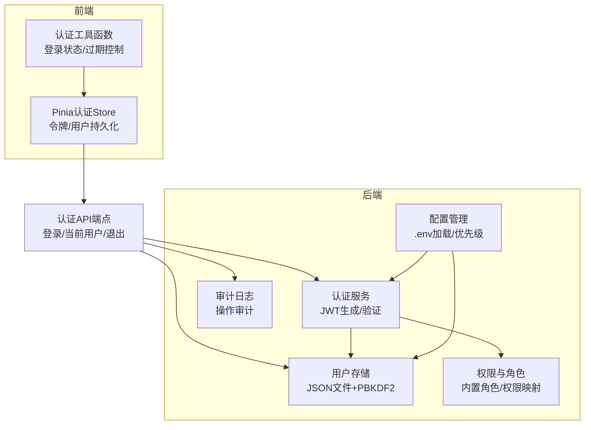
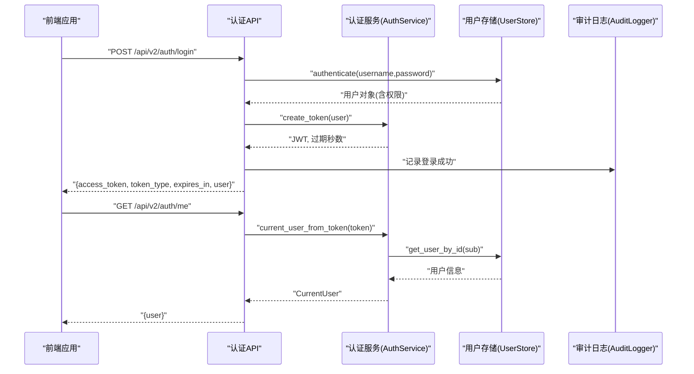
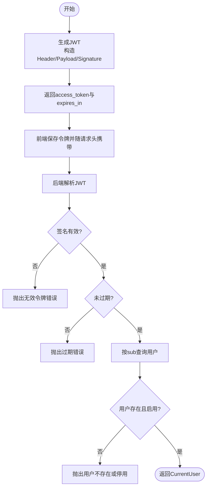
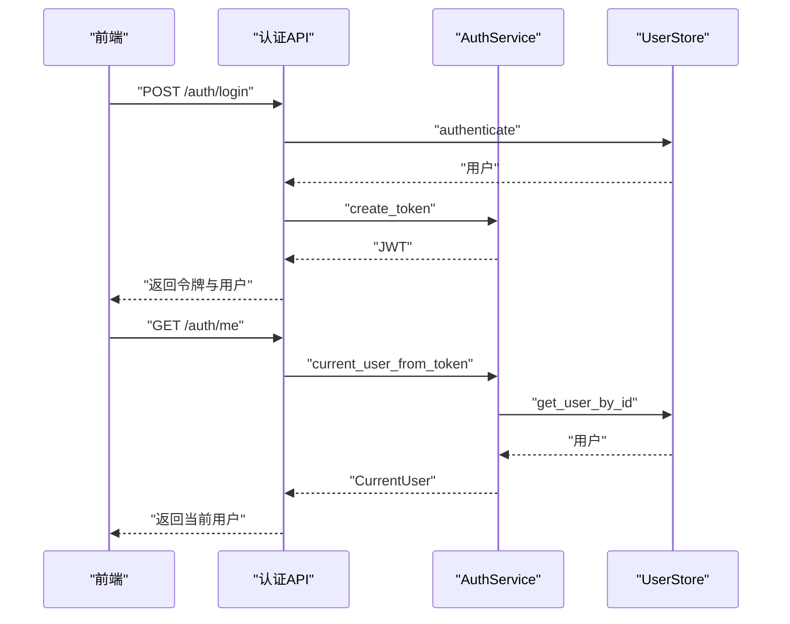
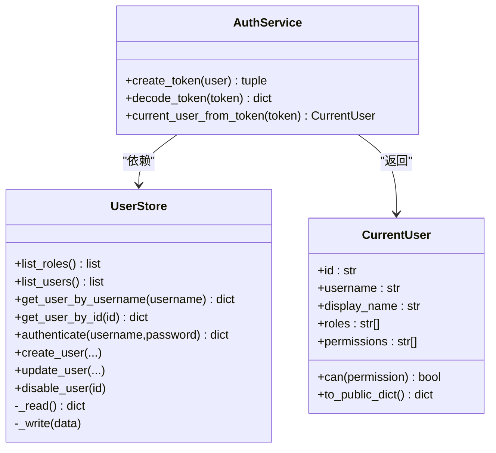
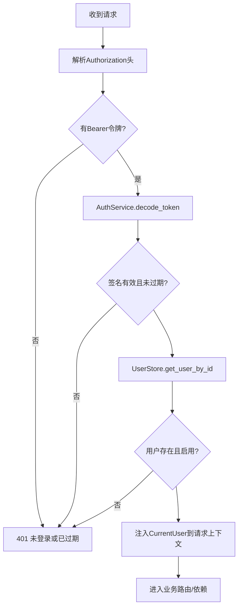
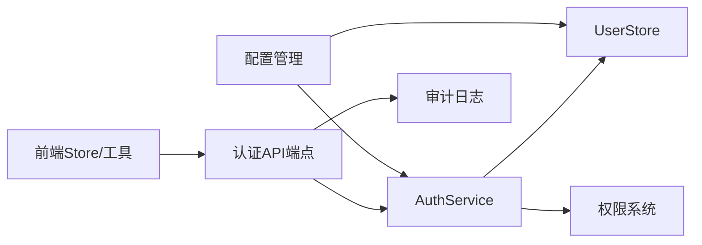

# 认证系统

<cite>
**本文引用的文件**
- [backend/src/security/auth.py](file://backend/src/security/auth.py)
- [backend/src/security/user_store.py](file://backend/src/security/user_store.py)
- [backend/src/api/v2/endpoints/auth.py](file://backend/src/api/v2/endpoints/auth.py)
- [backend/src/security/permissions.py](file://backend/src/security/permissions.py)
- [backend/src/security/audit.py](file://backend/src/security/audit.py)
- [backend/src/security/redaction.py](file://backend/src/security/redaction.py)
- [frontend-v2/src/stores/auth.js](file://frontend-v2/src/stores/auth.js)
- [frontend-v2/src/utils/auth.js](file://frontend-v2/src/utils/auth.js)
- [backend/src/config/manager.py](file://backend/src/config/manager.py)
- [backend/config.env.example](file://backend/config.env.example)
- [backend/tests/test_iam_audit.py](file://backend/tests/test_iam_audit.py)
</cite>

## 目录
1. [简介](#简介)
2. [项目结构](#项目结构)
3. [核心组件](#核心组件)
4. [架构总览](#架构总览)
5. [组件详解](#组件详解)
6. [依赖关系分析](#依赖关系分析)
7. [性能考量](#性能考量)
8. [故障排查指南](#故障排查指南)
9. [结论](#结论)
10. [附录](#附录)

## 简介
本文件面向“钉钉K8s运维机器人”的认证与授权体系，围绕以下目标展开：JWT令牌的生成、验证、过期处理；用户认证流程（登录、会话与状态维护）；用户存储设计（用户信息、密码加密、数据管理）；认证中间件与依赖注入的工作方式；认证API的使用示例与最佳实践；以及安全配置与常见问题的解决方案。文档同时兼顾非技术读者的理解需求，通过图示与分层讲解帮助快速掌握系统。

## 项目结构
认证相关代码主要分布在后端安全模块与前端状态管理模块：
- 后端安全模块：认证服务、用户存储、权限与审计
- 前端状态模块：Pinia Store与工具函数，负责令牌与用户状态持久化、初始化与权限判断
- 配置与环境：环境变量与配置文件加载，影响会话密钥、令牌过期时间等

图表来源
- [backend/src/security/auth.py:1-182](file://backend/src/security/auth.py#L1-L182)
- [backend/src/security/user_store.py:1-292](file://backend/src/security/user_store.py#L1-L292)
- [backend/src/security/permissions.py:1-95](file://backend/src/security/permissions.py#L1-L95)
- [backend/src/security/audit.py:1-96](file://backend/src/security/audit.py#L1-L96)
- [backend/src/config/manager.py:1-221](file://backend/src/config/manager.py#L1-L221)
- [frontend-v2/src/stores/auth.js:1-130](file://frontend-v2/src/stores/auth.js#L1-L130)
- [frontend-v2/src/utils/auth.js:1-95](file://frontend-v2/src/utils/auth.js#L1-L95)
- [backend/src/api/v2/endpoints/auth.py:1-88](file://backend/src/api/v2/endpoints/auth.py#L1-L88)

章节来源
- [backend/src/security/auth.py:1-182](file://backend/src/security/auth.py#L1-L182)
- [backend/src/security/user_store.py:1-292](file://backend/src/security/user_store.py#L1-L292)
- [backend/src/security/permissions.py:1-95](file://backend/src/security/permissions.py#L1-L95)
- [backend/src/security/audit.py:1-96](file://backend/src/security/audit.py#L1-L96)
- [backend/src/config/manager.py:1-221](file://backend/src/config/manager.py#L1-L221)
- [frontend-v2/src/stores/auth.js:1-130](file://frontend-v2/src/stores/auth.js#L1-L130)
- [frontend-v2/src/utils/auth.js:1-95](file://frontend-v2/src/utils/auth.js#L1-L95)
- [backend/src/api/v2/endpoints/auth.py:1-88](file://backend/src/api/v2/endpoints/auth.py#L1-L88)

## 核心组件
- 认证服务（AuthService）：负责JWT生成、解码与校验，结合用户存储解析当前用户
- 用户存储（UserStore）：基于JSON文件的本地用户与角色存储，采用PBKDF2进行密码哈希
- 权限系统（permissions）：内置角色与权限映射，支持通配符权限
- 审计日志（AuditLogger）：记录登录/登出等关键操作，敏感信息脱敏
- 前端认证Store与工具：负责令牌与用户信息的本地持久化、初始化与权限判断
- 配置管理（ConfigManager）：加载.env并提供配置读取能力，间接影响认证行为

章节来源
- [backend/src/security/auth.py:73-139](file://backend/src/security/auth.py#L73-L139)
- [backend/src/security/user_store.py:61-292](file://backend/src/security/user_store.py#L61-L292)
- [backend/src/security/permissions.py:7-95](file://backend/src/security/permissions.py#L7-L95)
- [backend/src/security/audit.py:21-96](file://backend/src/security/audit.py#L21-L96)
- [frontend-v2/src/stores/auth.js:19-130](file://frontend-v2/src/stores/auth.js#L19-L130)
- [frontend-v2/src/utils/auth.js:1-95](file://frontend-v2/src/utils/auth.js#L1-L95)
- [backend/src/config/manager.py:35-221](file://backend/src/config/manager.py#L35-L221)

## 架构总览
下图展示认证系统的端到端交互：前端通过认证API登录，后端返回JWT，前端持久化令牌并在后续请求中携带；后端中间件解析令牌，校验签名与过期，解析用户并注入到请求上下文。

图表来源
- [backend/src/api/v2/endpoints/auth.py:21-71](file://backend/src/api/v2/endpoints/auth.py#L21-L71)
- [backend/src/security/auth.py:79-134](file://backend/src/security/auth.py#L79-L134)
- [backend/src/security/user_store.py:188-200](file://backend/src/security/user_store.py#L188-L200)
- [backend/src/security/audit.py:27-61](file://backend/src/security/audit.py#L27-L61)

## 组件详解

### JWT令牌管理机制
- 令牌生成
  - 使用对称签名算法（HS256），头部包含算法与类型，负载包含子(subject)、用户名、签发时间、过期时间与唯一标识
  - 签名由会话密钥与签名输入计算得出
  - 过期时间由环境变量控制，默认一天
- 令牌验证
  - 解析三段式结构，重算签名并与携带签名比较
  - 校验过期时间，拒绝过期令牌
  - 从用户存储按sub获取用户，校验用户存在且启用
- 令牌刷新与过期处理
  - 当前实现不提供刷新接口；前端可基于本地令牌与过期时间做轮询提示，建议在后端新增刷新端点以提升安全性

图表来源
- [backend/src/security/auth.py:79-134](file://backend/src/security/auth.py#L79-L134)

章节来源
- [backend/src/security/auth.py:73-139](file://backend/src/security/auth.py#L73-L139)
- [backend/src/api/v2/endpoints/auth.py:46-66](file://backend/src/api/v2/endpoints/auth.py#L46-L66)

### 用户认证流程与会话管理
- 登录流程
  - 前端调用登录接口，提交用户名与密码
  - 后端用户存储验证凭据，记录审计日志
  - 成功则生成JWT并返回给前端
- 会话与状态维护
  - 前端Store持久化令牌与用户信息
  - 初始化时尝试调用“当前用户”接口校验令牌有效性
  - 退出登录时调用后端登出接口并清理本地状态

图表来源
- [backend/src/api/v2/endpoints/auth.py:21-71](file://backend/src/api/v2/endpoints/auth.py#L21-L71)
- [backend/src/security/auth.py:123-134](file://backend/src/security/auth.py#L123-L134)
- [backend/src/security/user_store.py:188-200](file://backend/src/security/user_store.py#L188-L200)

章节来源
- [backend/src/api/v2/endpoints/auth.py:21-88](file://backend/src/api/v2/endpoints/auth.py#L21-L88)
- [frontend-v2/src/stores/auth.js:51-101](file://frontend-v2/src/stores/auth.js#L51-L101)

### 用户存储系统设计
- 数据结构
  - 用户包含：唯一ID、用户名、显示名、密码哈希、角色列表、启用状态、时间戳
  - 角色包含：ID、名称、描述、权限列表（支持通配符）
- 密码加密
  - 使用PBKDF2-HMAC-SHA256，迭代次数固定，盐随机生成
  - 验证时拆分编码字符串，按相同参数重算并安全比较
- 数据管理
  - 支持列出角色/用户、按用户名或ID查询、认证、更新用户信息、禁用用户
  - 写入采用临时文件+原子替换，保证一致性与最小权限

图表来源
- [backend/src/security/user_store.py:61-292](file://backend/src/security/user_store.py#L61-L292)
- [backend/src/security/auth.py:73-139](file://backend/src/security/auth.py#L73-L139)

章节来源
- [backend/src/security/user_store.py:34-58](file://backend/src/security/user_store.py#L34-L58)
- [backend/src/security/user_store.py:188-274](file://backend/src/security/user_store.py#L188-L274)
- [backend/src/security/permissions.py:30-95](file://backend/src/security/permissions.py#L30-L95)

### 权限模型与中间件
- 权限模型
  - 内置角色：系统管理员、运维工程师、只读观察员
  - 权限映射：每个角色映射到一组权限，支持通配符“*”
  - 授权判断：用户权限包含通配符或目标权限即允许
- 中间件与依赖
  - FastAPI依赖：Bearer令牌解析、当前用户解析、权限依赖
  - 中间件职责：从请求头提取Bearer令牌，解码并注入当前用户；按需校验权限

图表来源
- [backend/src/security/auth.py:142-170](file://backend/src/security/auth.py#L142-L170)
- [backend/src/security/auth.py:172-182](file://backend/src/security/auth.py#L172-L182)
- [backend/src/security/permissions.py:78-95](file://backend/src/security/permissions.py#L78-L95)

章节来源
- [backend/src/security/auth.py:142-182](file://backend/src/security/auth.py#L142-L182)
- [backend/src/security/permissions.py:7-95](file://backend/src/security/permissions.py#L7-L95)

### 审计与安全配置
- 审计日志
  - 记录操作者、动作、资源、结果、请求ID、IP、UA等
  - 敏感字段与值会被脱敏，避免泄露
- 安全配置要点
  - 会话密钥：支持环境变量或密钥文件自动初始化
  - 令牌过期：通过环境变量控制，默认一天
  - 用户文件权限：写入时设置严格权限，防止泄露
  - 审计日志路径：可通过环境变量配置

章节来源
- [backend/src/security/audit.py:21-96](file://backend/src/security/audit.py#L21-L96)
- [backend/src/security/redaction.py:9-79](file://backend/src/security/redaction.py#L9-L79)
- [backend/src/security/auth.py:36-49](file://backend/src/security/auth.py#L36-L49)
- [backend/src/security/user_store.py:117-132](file://backend/src/security/user_store.py#L117-L132)

### 认证API使用示例与最佳实践
- 登录
  - 请求：POST /api/v2/auth/login
  - 成功响应：包含access_token、token_type、expires_in与用户信息
  - 建议：前端保存令牌于安全存储，随后续请求附带Authorization: Bearer
- 查询当前用户
  - 请求：GET /api/v2/auth/me
  - 用途：初始化时校验令牌有效性
- 退出登录
  - 请求：POST /api/v2/auth/logout
  - 建议：前端清理本地状态，后端记录审计

最佳实践
- 令牌存储：仅在内存或受保护的本地存储中保存，避免明文落盘
- 过期策略：根据业务风险调整过期时间；考虑引入刷新令牌机制
- 权限控制：尽量使用require_permission依赖，避免硬编码权限判断
- 审计覆盖：所有敏感操作均应记录审计日志

章节来源
- [backend/src/api/v2/endpoints/auth.py:21-88](file://backend/src/api/v2/endpoints/auth.py#L21-L88)
- [frontend-v2/src/stores/auth.js:51-101](file://frontend-v2/src/stores/auth.js#L51-L101)

## 依赖关系分析
- 组件耦合
  - 认证API依赖认证服务与用户存储
  - 认证服务依赖用户存储与权限系统
  - 前端Store依赖API客户端，间接依赖后端认证端点
- 外部依赖
  - FastAPI依赖注入与HTTP安全方案
  - 环境变量与配置文件加载
  - 日志与脱敏工具

图表来源
- [backend/src/api/v2/endpoints/auth.py:1-88](file://backend/src/api/v2/endpoints/auth.py#L1-L88)
- [backend/src/security/auth.py:1-182](file://backend/src/security/auth.py#L1-L182)
- [backend/src/security/user_store.py:1-292](file://backend/src/security/user_store.py#L1-L292)
- [backend/src/security/permissions.py:1-95](file://backend/src/security/permissions.py#L1-L95)
- [backend/src/security/audit.py:1-96](file://backend/src/security/audit.py#L1-L96)
- [backend/src/config/manager.py:1-221](file://backend/src/config/manager.py#L1-L221)

章节来源
- [backend/src/api/v2/endpoints/auth.py:1-88](file://backend/src/api/v2/endpoints/auth.py#L1-L88)
- [backend/src/security/auth.py:1-182](file://backend/src/security/auth.py#L1-L182)
- [backend/src/security/user_store.py:1-292](file://backend/src/security/user_store.py#L1-L292)
- [backend/src/security/permissions.py:1-95](file://backend/src/security/permissions.py#L1-L95)
- [backend/src/security/audit.py:1-96](file://backend/src/security/audit.py#L1-L96)
- [backend/src/config/manager.py:1-221](file://backend/src/config/manager.py#L1-L221)

## 性能考量
- 缓存策略
  - 认证服务与用户存储、审计日志均使用LRU缓存，减少重复初始化开销
- 锁与并发
  - 用户存储写入使用可重入锁，保障多线程写入一致性
- I/O优化
  - 用户文件写入采用临时文件+原子替换，降低损坏风险
- 建议
  - 在高并发场景下，可考虑引入Redis等外部缓存以减轻磁盘压力
  - 对频繁的权限判断可增加本地缓存（注意失效策略）

章节来源
- [backend/src/security/auth.py:137-139](file://backend/src/security/auth.py#L137-L139)
- [backend/src/security/user_store.py:23-132](file://backend/src/security/user_store.py#L23-L132)
- [backend/src/security/audit.py:25-26](file://backend/src/security/audit.py#L25-L26)

## 故障排查指南
- 常见问题
  - 401 未登录或登录已过期：检查前端是否正确保存令牌，确认后端会话密钥一致
  - 401 token 签名无效/401 token 已过期：核对令牌生成与解析过程，检查系统时间同步
  - 用户不存在或已停用：确认用户ID与角色权限映射
  - 密码错误：确认PBKDF2迭代次数与哈希算法一致
  - 审计日志缺失：检查审计日志路径与权限
- 测试与验证
  - 可参考测试用例对认证与审计进行集成验证，确保标准响应体与缓存清理逻辑正常

章节来源
- [backend/src/security/auth.py:102-134](file://backend/src/security/auth.py#L102-L134)
- [backend/src/security/user_store.py:188-200](file://backend/src/security/user_store.py#L188-L200)
- [backend/src/security/audit.py:17-18](file://backend/src/security/audit.py#L17-L18)
- [backend/tests/test_iam_audit.py:12-33](file://backend/tests/test_iam_audit.py#L12-L33)

## 结论
该认证系统以JWT为核心，结合本地JSON用户存储与内置权限模型，提供了完整的登录、鉴权与审计能力。前端通过Store与工具函数实现会话持久化与初始化校验。建议在生产环境中完善令牌刷新机制、强化密钥管理与审计日志的合规性，并持续评估性能与扩展性需求。

## 附录

### 环境变量与配置要点
- 会话密钥与过期
  - APP_SESSION_SECRET 或 APP_SESSION_SECRET_FILE：会话密钥来源
  - APP_SESSION_EXPIRES_SECONDS：令牌过期秒数，默认一天
- 用户存储
  - IAM_USERS_PATH：用户与角色数据文件路径
- 审计日志
  - OPERATION_AUDIT_LOG_PATH：审计日志文件路径
- 示例配置文件
  - backend/config.env.example 提供了项目配置示例

章节来源
- [backend/src/security/auth.py:36-49](file://backend/src/security/auth.py#L36-L49)
- [backend/src/security/user_store.py:30-31](file://backend/src/security/user_store.py#L30-L31)
- [backend/src/security/audit.py:17-18](file://backend/src/security/audit.py#L17-L18)
- [backend/config.env.example:1-51](file://backend/config.env.example#L1-L51)