# 代码架构与设计模式

<cite>
**本文档引用的文件**
- [backend/src/app/container.py](file://backend/src/app/container.py)
- [backend/main.py](file://backend/main.py)
- [backend/src/api/v2/router.py](file://backend/src/api/v2/router.py)
- [backend/src/api/v2/dependencies.py](file://backend/src/api/v2/dependencies.py)
- [backend/src/mcp/runtime.py](file://backend/src/mcp/runtime.py)
- [backend/src/mcp/enhanced_client.py](file://backend/src/mcp/enhanced_client.py)
- [backend/src/llm/processor.py](file://backend/src/llm/processor.py)
- [backend/src/scheduler/task_scheduler.py](file://backend/src/scheduler/task_scheduler.py)
- [backend/src/scheduler/task_manager.py](file://backend/src/scheduler/task_manager.py)
- [backend/src/tools/registry.py](file://backend/src/tools/registry.py)
- [frontend-v2/src/main.js](file://frontend-v2/src/main.js)
- [frontend-v2/src/App.vue](file://frontend-v2/src/App.vue)
- [README.md](file://README.md)
</cite>

## 目录
1. [简介](#简介)
2. [项目结构](#项目结构)
3. [核心组件](#核心组件)
4. [架构概览](#架构概览)
5. [详细组件分析](#详细组件分析)
6. [依赖分析](#依赖分析)
7. [性能考虑](#性能考虑)
8. [故障排除指南](#故障排除指南)
9. [结论](#结论)
10. [附录](#附录)

## 简介

钉钉K8s运维机器人是一个基于钉钉的智能Kubernetes运维平台，支持通过自然语言进行K8s集群管理和运维操作。该项目采用现代化的分层架构设计，结合多种设计模式，实现了高内聚、低耦合的系统架构。

该系统的核心特点包括：
- **智能对话**：自然语言交互，理解运维意图
- **K8s管理**：Pod、Service、Deployment等资源管理
- **实时监控**：集群状态、资源使用情况监控
- **MCP协议**：可扩展的工具系统
- **Web界面**：现代化Vue3聊天界面，流式响应体验
- **会话持久化**：对话历史自动保存
- **数据安全**：IP/主机名/人名脱敏

## 项目结构

项目采用清晰的模块化组织结构，主要分为以下几个层次：

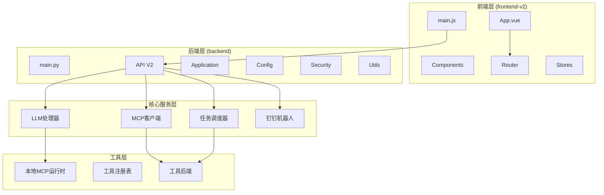

**图表来源**
- [backend/main.py:1-494](file://backend/main.py#L1-L494)
- [frontend-v2/src/main.js:1-52](file://frontend-v2/src/main.js#L1-L52)

**章节来源**
- [README.md:64-76](file://README.md#L64-L76)

## 核心组件

### 运行时容器 (RuntimeContainer)

RuntimeContainer是系统的核心依赖注入容器，负责管理所有长期运行的服务实例：

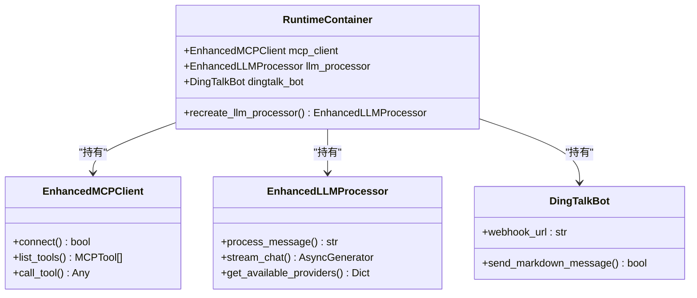

**图表来源**
- [backend/src/app/container.py:15-54](file://backend/src/app/container.py#L15-L54)

### API路由系统

API V2路由器提供了统一的RESTful接口，支持流式响应和工具调用：

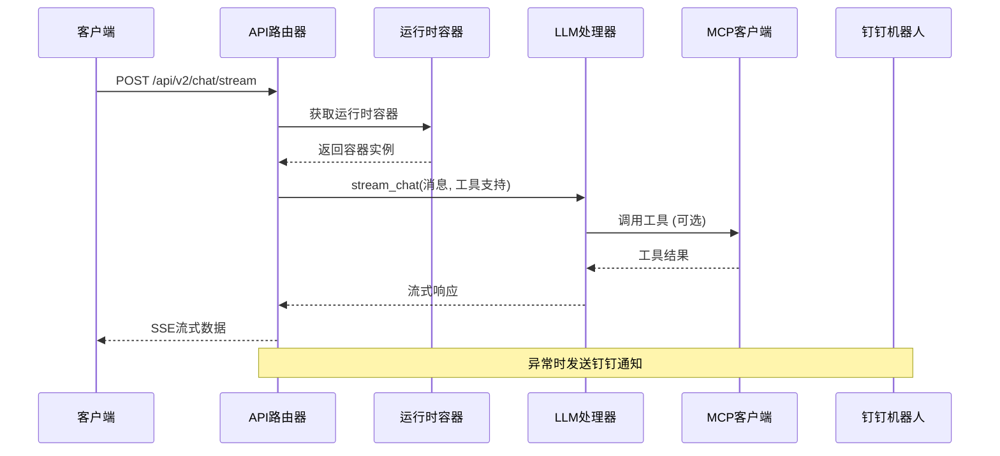

**图表来源**
- [backend/src/api/v2/router.py:158-345](file://backend/src/api/v2/router.py#L158-L345)

**章节来源**
- [backend/src/app/container.py:15-54](file://backend/src/app/container.py#L15-L54)
- [backend/src/api/v2/router.py:158-345](file://backend/src/api/v2/router.py#L158-L345)

## 架构概览

系统采用分层架构设计，结合多种设计模式：

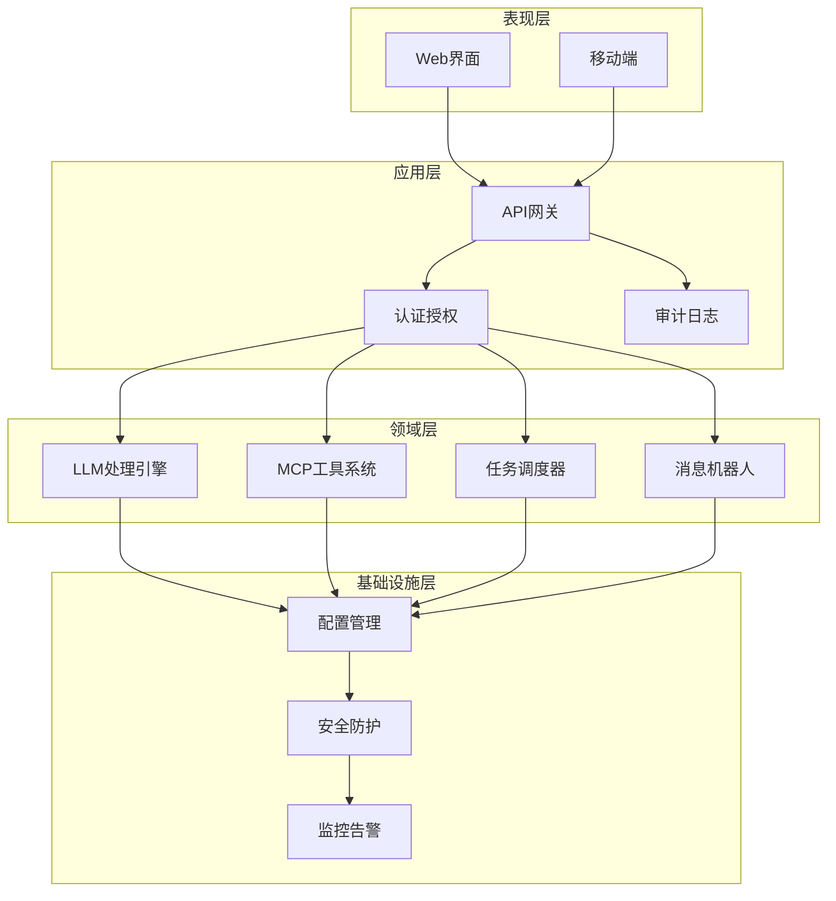

**图表来源**
- [backend/main.py:302-494](file://backend/main.py#L302-L494)
- [backend/src/api/v2/router.py:1-1059](file://backend/src/api/v2/router.py#L1-L1059)

## 详细组件分析

### 依赖注入容器设计

系统采用显式的依赖注入模式，通过RuntimeContainer实现：

#### 容器设计模式

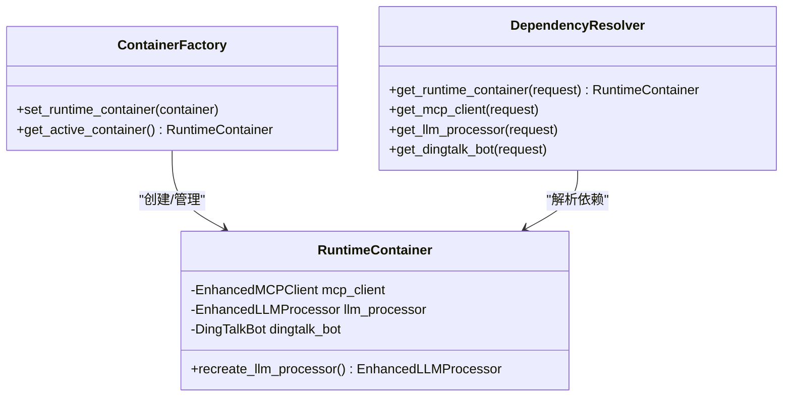

**图表来源**
- [backend/src/app/container.py:15-54](file://backend/src/app/container.py#L15-L54)
- [backend/src/api/v2/dependencies.py:10-36](file://backend/src/api/v2/dependencies.py#L10-L36)

#### 依赖注入流程

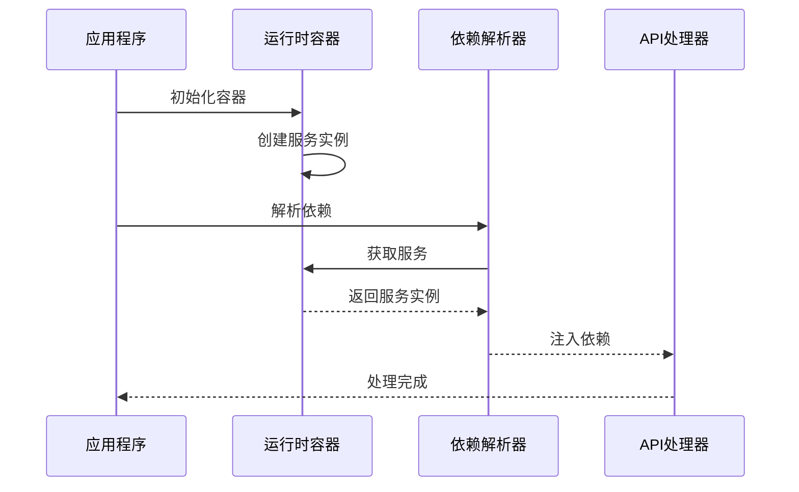

**图表来源**
- [backend/main.py:137-136](file://backend/main.py#L137-L136)
- [backend/src/api/v2/dependencies.py:10-36](file://backend/src/api/v2/dependencies.py#L10-L36)

**章节来源**
- [backend/src/app/container.py:15-54](file://backend/src/app/container.py#L15-L54)
- [backend/src/api/v2/dependencies.py:10-36](file://backend/src/api/v2/dependencies.py#L10-L36)

### LLM处理器架构

LLM处理器实现了策略模式和装饰器模式的结合：

#### 处理器策略模式

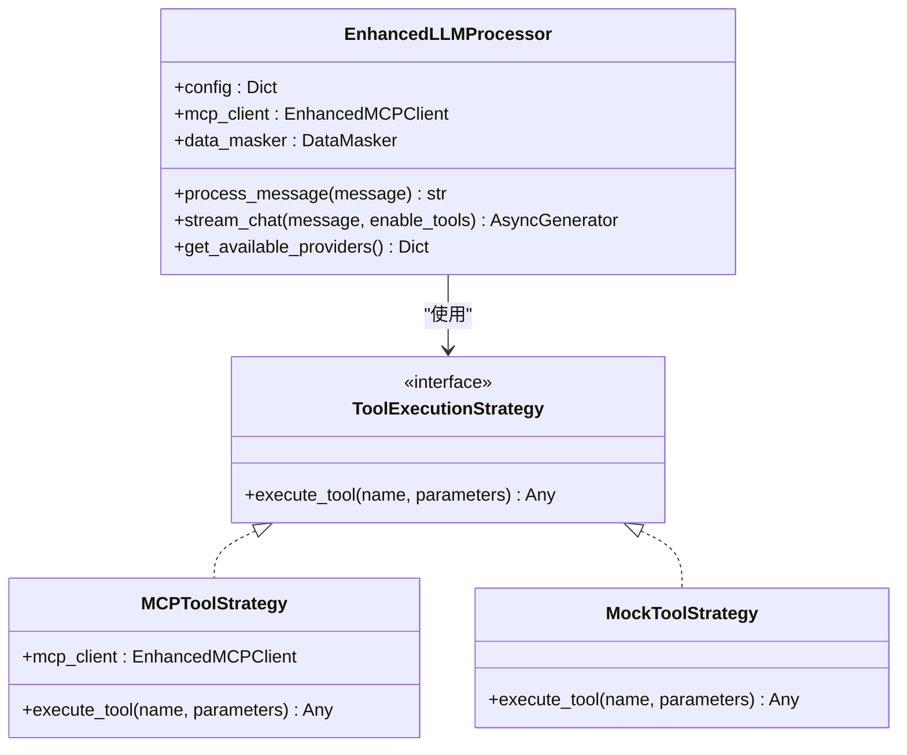

**图表来源**
- [backend/src/llm/processor.py:30-800](file://backend/src/llm/processor.py#L30-L800)

#### 流式处理流程

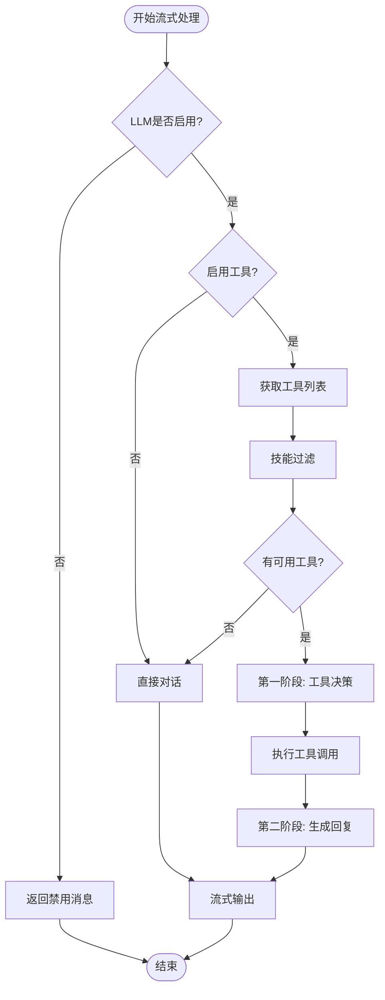

**图表来源**
- [backend/src/llm/processor.py:536-757](file://backend/src/llm/processor.py#L536-L757)

**章节来源**
- [backend/src/llm/processor.py:30-800](file://backend/src/llm/processor.py#L30-L800)

### MCP客户端架构

MCP客户端实现了工厂模式和适配器模式：

#### 客户端工厂模式

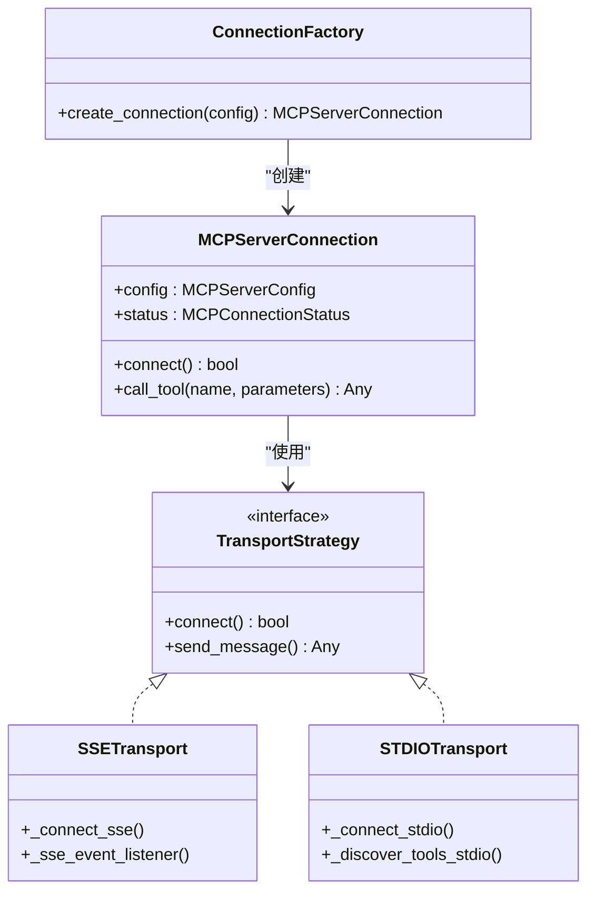

**图表来源**
- [backend/src/mcp/enhanced_client.py:33-800](file://backend/src/mcp/enhanced_client.py#L33-L800)

#### 工具执行后端

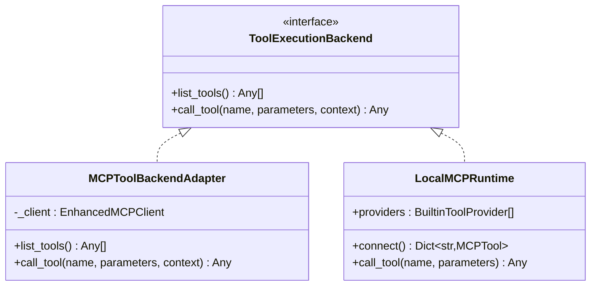

**图表来源**
- [backend/src/tools/registry.py:12-54](file://backend/src/tools/registry.py#L12-L54)
- [backend/src/mcp/runtime.py:31-119](file://backend/src/mcp/runtime.py#L31-L119)

**章节来源**
- [backend/src/mcp/enhanced_client.py:33-800](file://backend/src/mcp/enhanced_client.py#L33-L800)
- [backend/src/tools/registry.py:12-54](file://backend/src/tools/registry.py#L12-L54)
- [backend/src/mcp/runtime.py:31-119](file://backend/src/mcp/runtime.py#L31-L119)

### 任务调度器架构

任务调度器实现了观察者模式和策略模式：

#### 调度器观察者模式

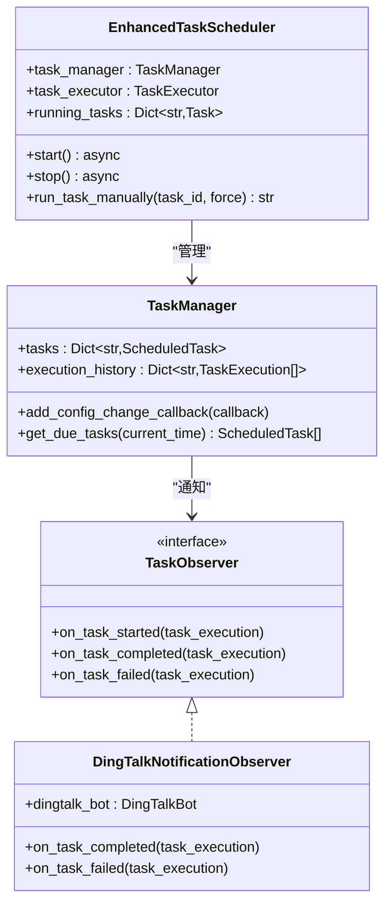

**图表来源**
- [backend/src/scheduler/task_scheduler.py:23-487](file://backend/src/scheduler/task_scheduler.py#L23-L487)
- [backend/src/scheduler/task_manager.py:133-657](file://backend/src/scheduler/task_manager.py#L133-L657)

#### 任务执行流程

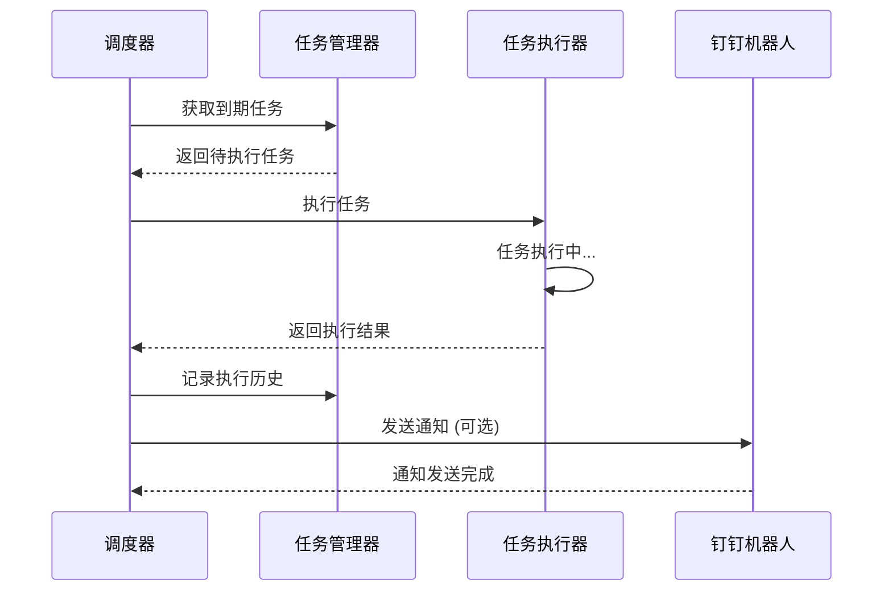

**图表来源**
- [backend/src/scheduler/task_scheduler.py:108-284](file://backend/src/scheduler/task_scheduler.py#L108-L284)

**章节来源**
- [backend/src/scheduler/task_scheduler.py:23-487](file://backend/src/scheduler/task_scheduler.py#L23-L487)
- [backend/src/scheduler/task_manager.py:133-657](file://backend/src/scheduler/task_manager.py#L133-L657)

### 前端MVC架构

前端采用Vue.js的MVVM模式，结合Pinia状态管理：

#### 前端架构模式

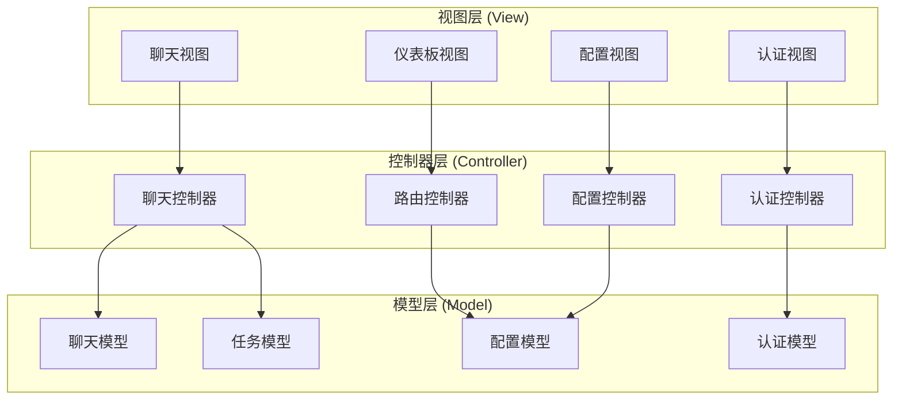

**图表来源**
- [frontend-v2/src/App.vue:128-292](file://frontend-v2/src/App.vue#L128-L292)
- [frontend-v2/src/main.js:1-52](file://frontend-v2/src/main.js#L1-L52)

**章节来源**
- [frontend-v2/src/App.vue:128-292](file://frontend-v2/src/App.vue#L128-L292)
- [frontend-v2/src/main.js:1-52](file://frontend-v2/src/main.js#L1-L52)

## 依赖分析

系统采用模块化依赖管理，通过明确的接口边界实现松耦合：

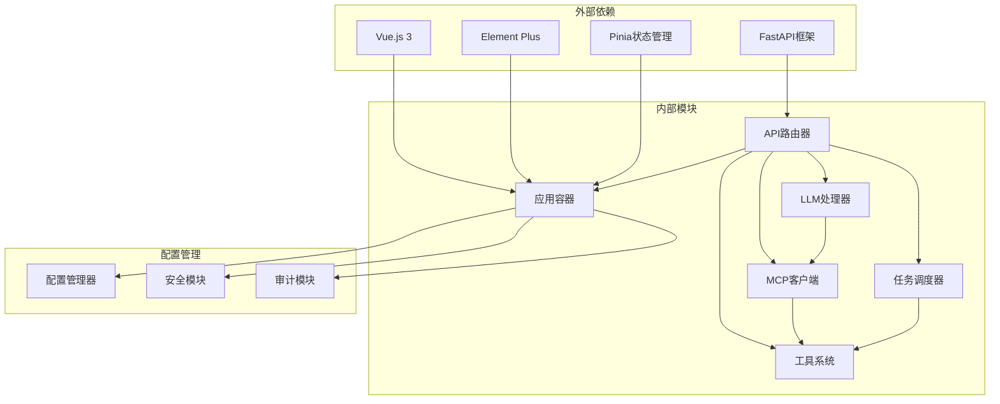

**图表来源**
- [backend/main.py:29-35](file://backend/main.py#L29-L35)
- [frontend-v2/src/main.js:1-52](file://frontend-v2/src/main.js#L1-L52)

**章节来源**
- [backend/main.py:29-35](file://backend/main.py#L29-L35)
- [frontend-v2/src/main.js:1-52](file://frontend-v2/src/main.js#L1-L52)

## 性能考虑

系统在多个层面进行了性能优化：

### 异步处理优化
- 使用asyncio实现非阻塞I/O操作
- 流式响应减少内存占用
- 并发控制防止资源竞争

### 缓存策略
- 工具结果缓存减少重复调用
- 配置文件热重载避免频繁磁盘IO
- 连接池管理数据库连接

### 监控与日志
- 性能指标收集和分析
- 错误追踪和告警
- 请求链路追踪

## 故障排除指南

### 常见问题诊断

#### LLM配置问题
- 检查API密钥和网络连接
- 验证模型参数配置
- 查看代理设置和防火墙规则

#### MCP工具问题
- 确认工具服务器连接状态
- 检查工具权限和认证
- 验证工具参数格式

#### 前端通信问题
- 检查CORS配置
- 验证API端点可达性
- 查看浏览器开发者工具

**章节来源**
- [backend/main.py:62-129](file://backend/main.py#L62-L129)
- [backend/src/llm/processor.py:100-120](file://backend/src/llm/processor.py#L100-L120)

## 结论

钉钉K8s运维机器人通过精心设计的架构和多种设计模式的综合运用，实现了高度模块化、可扩展的运维平台。系统的主要优势包括：

1. **清晰的分层架构**：表现层、应用层、领域层、基础设施层职责分明
2. **灵活的依赖注入**：RuntimeContainer提供统一的服务管理
3. **强大的工具系统**：MCP协议支持可扩展的工具生态
4. **现代化的前端架构**：Vue.js + Pinia实现响应式用户体验
5. **完善的监控体系**：全面的日志记录和性能监控

未来发展方向：
- 进一步优化LLM集成和工具调用效率
- 增强安全性和权限控制
- 扩展更多运维场景和工具
- 提升系统的可测试性和可观测性

## 附录

### 设计模式总结

| 设计模式 | 实现位置 | 作用 |
|---------|---------|------|
| 依赖注入 | RuntimeContainer | 统一服务管理，降低耦合 |
| 工厂模式 | ConnectionFactory | 创建不同传输方式的连接 |
| 策略模式 | ToolExecutionStrategy | 支持多种工具执行策略 |
| 观察者模式 | TaskObserver | 任务执行状态通知 |
| 适配器模式 | MCPToolBackendAdapter | 统一工具后端接口 |
| 装饰器模式 | DataMasker | 数据脱敏处理 |

### 架构演进历史

系统经历了从独立MCP服务器到一体化应用的演进过程：

1. **独立MCP阶段**：`archived/k8s-mcp-standalone` 和 `archived/ecs-mcp-standalone`
2. **集成阶段**：将K8s/ECS工具并入主应用进程
3. **现代化阶段**：采用Vue3前端，增强的API设计

**章节来源**
- [README.md:57-57](file://README.md#L57-L57)