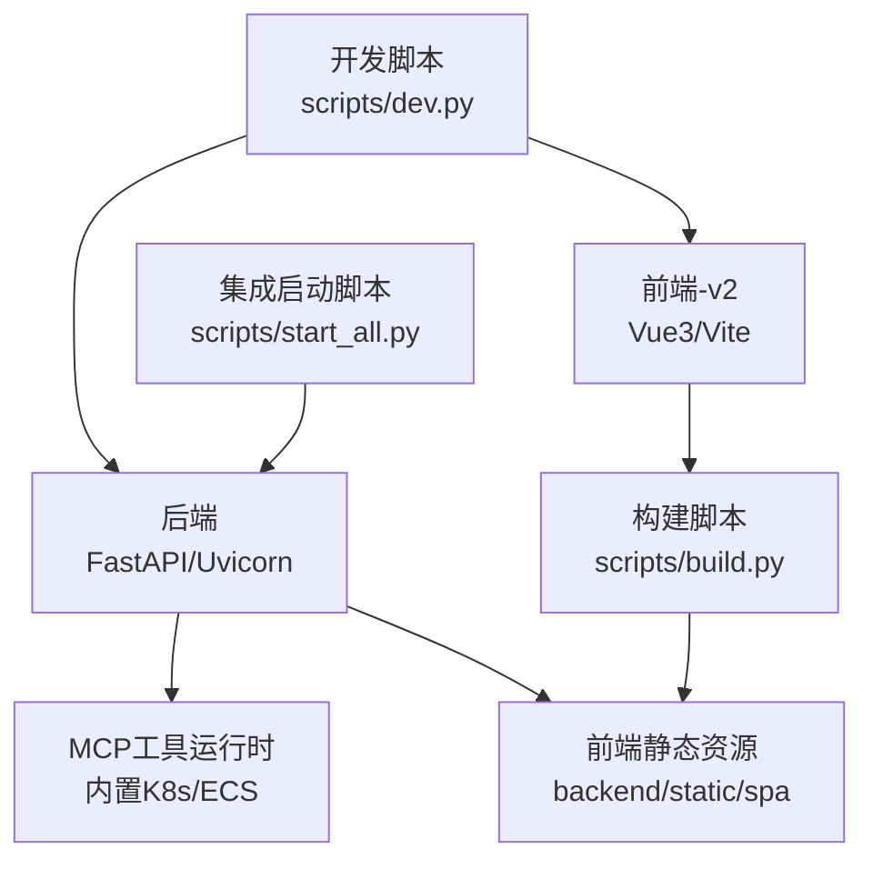
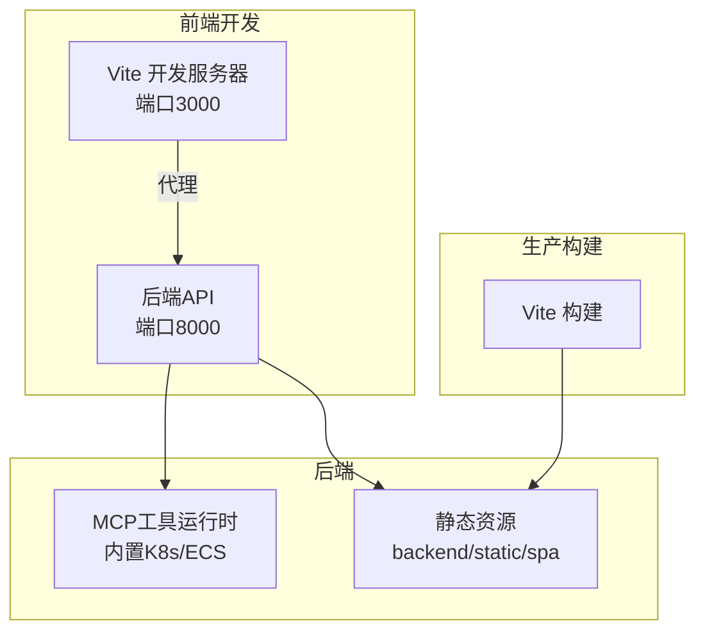
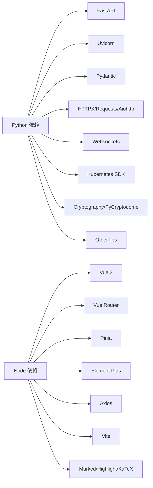

# 代码贡献流程

<cite>
**本文引用的文件**
- [README.md](file://README.md)
- [pyproject.toml](file://pyproject.toml)
- [poetry.toml](file://poetry.toml)
- [package.json](file://frontend-v2/package.json)
- [scripts/dev.py](file://scripts/dev.py)
- [scripts/build.py](file://scripts/build.py)
- [scripts/start_all.py](file://scripts/start_all.py)
- [scripts/setup.py](file://scripts/setup.py)
- [backend/tests/test_api_standard_runtime_ops.py](file://backend/tests/test_api_standard_runtime_ops.py)
- [config/README.md](file://config/README.md)
- [config/llm_config.example.json](file://config/llm_config.example.json)
- [config/mcp_config.example.json](file://config/mcp_config.example.json)
- [frontend-v2/README.md](file://frontend-v2/README.md)
</cite>

## 目录
1. [简介](#简介)
2. [项目结构](#项目结构)
3. [核心组件](#核心组件)
4. [架构总览](#架构总览)
5. [详细组件分析](#详细组件分析)
6. [依赖分析](#依赖分析)
7. [性能考虑](#性能考虑)
8. [故障排查指南](#故障排查指南)
9. [结论](#结论)
10. [附录](#附录)

## 简介
本文件面向贡献者，提供“钉钉K8s运维机器人”的完整代码贡献流程，涵盖开发环境搭建、Python/Poetry/Node.js配置、代码规范、Git工作流、代码审查标准、CI与自动化测试、以及常见问题与最佳实践。目标是帮助新老贡献者快速上手、高质量交付与维护代码。

## 项目结构
项目采用前后端分离与统一构建的组织方式：
- 后端：FastAPI + Uvicorn，提供API与MCP工具运行时（内置K8s/ECS工具），位于 backend/src。
- 前端：Vue 3 + Vite，位于 frontend-v2，构建产物集成到后端 static/spa。
- 配置：config/ 目录存放运行时JSON配置模板，示例文件需复制为实际运行配置。
- 脚本：scripts/ 提供开发、构建、启动、清理等自动化脚本。

图表来源
- [scripts/dev.py:1-219](file://scripts/dev.py#L1-L219)
- [scripts/build.py:1-181](file://scripts/build.py#L1-L181)
- [scripts/start_all.py:1-306](file://scripts/start_all.py#L1-L306)

章节来源
- [README.md:64-76](file://README.md#L64-L76)
- [frontend-v2/README.md:26-54](file://frontend-v2/README.md#L26-L54)

## 核心组件
- 开发环境脚本：scripts/dev.py 提供后端热重载与前端开发服务器并行启动，自动代理API。
- 构建脚本：scripts/build.py 负责前端构建并将产物放入 backend/static/spa，同时生成根重定向页。
- 集成启动脚本：scripts/start_all.py 启动后端主服务，MCP子进程已并入主进程，无需独立启动。
- 配置管理：config/ 目录提供运行时配置模板，示例文件需复制为实际配置，且不应提交敏感信息。
- 测试：backend/tests/ 提供API标准运行时与权限相关的测试样例，便于验证行为一致性。

章节来源
- [scripts/dev.py:92-155](file://scripts/dev.py#L92-L155)
- [scripts/build.py:71-179](file://scripts/build.py#L71-L179)
- [scripts/start_all.py:225-270](file://scripts/start_all.py#L225-L270)
- [config/README.md:1-17](file://config/README.md#L1-L17)
- [backend/tests/test_api_standard_runtime_ops.py:99-252](file://backend/tests/test_api_standard_runtime_ops.py#L99-L252)

## 架构总览
整体架构围绕“后端API + 内置MCP工具 + 前端SPA”的模式展开。前端通过Vite开发服务器与后端API进行代理通信；生产环境下前端构建产物由后端统一提供。

图表来源
- [frontend-v2/README.md:97-113](file://frontend-v2/README.md#L97-L113)
- [scripts/build.py:107-143](file://scripts/build.py#L107-L143)
- [scripts/dev.py:117-127](file://scripts/dev.py#L117-L127)

## 详细组件分析

### 开发环境搭建与脚本
- Python与Poetry
  - Python版本要求：3.11 ≤ Python < 3.14；若Poetry误用3.14，需切换到3.13后再安装依赖。
  - Poetry安装与依赖：先指定Python版本，再执行安装；开发依赖包含pytest、black、flake8、mypy。
  - Poetry行为优化：通过poetry.toml限制并发下载，缓解弱网超时。
- Node.js与前端
  - Node版本：20 ≤ Node < 23；前端依赖通过npm install安装。
  - 开发脚本：scripts/dev.py 支持后端热重载与前端并行启动，自动代理API请求。
  - 构建脚本：scripts/build.py 自动安装前端依赖、执行构建、生成SPA静态资源与根重定向页。
  - 集成启动：scripts/start_all.py 启动后端主服务，MCP子进程已并入主进程，无需独立启动。

章节来源
- [README.md:17-28](file://README.md#L17-L28)
- [pyproject.toml:9-52](file://pyproject.toml#L9-L52)
- [poetry.toml:1-7](file://poetry.toml#L1-L7)
- [package.json:6-9](file://frontend-v2/package.json#L6-L9)
- [scripts/dev.py:28-50](file://scripts/dev.py#L28-L50)
- [scripts/dev.py:92-155](file://scripts/dev.py#L92-L155)
- [scripts/build.py:24-48](file://scripts/build.py#L24-L48)
- [scripts/build.py:71-104](file://scripts/build.py#L71-L104)
- [scripts/start_all.py:162-164](file://scripts/start_all.py#L162-L164)

### 配置与密钥管理
- 配置目录：config/ 仅提交 *.example.json，运行时复制为实际配置文件。
- LLM配置：config/llm_config.example.json，包含提供商、模型、温度、超时、流式等参数，以及数据脱敏与日志开关。
- MCP配置：config/mcp_config.example.json，描述全局配置、服务器规格、工具清单、安全与日志等。
- 安全原则：不要提交包含API Key、Webhook Token、云凭证、kubeconfig路径、本地集群详情等敏感信息的文件。

章节来源
- [config/README.md:1-17](file://config/README.md#L1-L17)
- [config/llm_config.example.json:1-45](file://config/llm_config.example.json#L1-L45)
- [config/mcp_config.example.json:1-66](file://config/mcp_config.example.json#L1-L66)

### 测试与质量保障
- 测试范围：覆盖API标准运行时、MCP工具调用权限、SPA回退行为等。
- 测试方法：使用FastAPI TestClient与依赖注入，构造Fake MCP客户端与用户角色，验证返回结构与权限控制。
- 建议：新增功能需配套单元测试，确保标准响应体、权限校验、工具调用链路稳定。

章节来源
- [backend/tests/test_api_standard_runtime_ops.py:99-252](file://backend/tests/test_api_standard_runtime_ops.py#L99-L252)

### 前后端集成与开发流程
- 前端开发：npm run dev 启动Vite，自动代理 /api 到后端8000端口。
- 构建集成：npm run build 输出到 ../backend/static/spa，后端统一提供静态资源。
- 开发脚本：poetry run dev 并行启动后端热重载与前端开发服务器，便于联调。

章节来源
- [frontend-v2/README.md:67-84](file://frontend-v2/README.md#L67-L84)
- [frontend-v2/README.md:97-113](file://frontend-v2/README.md#L97-L113)
- [scripts/dev.py:117-139](file://scripts/dev.py#L117-L139)
- [scripts/build.py:107-143](file://scripts/build.py#L107-L143)

## 依赖分析
- Python生态：FastAPI、Uvicorn、Pydantic、HTTPX、Requests、Aiohttp、Websockets、Kubernetes SDK、Cryptography、Watchdog、Croniter、CrewAI（条件安装）等。
- 前端生态：Vue 3、Vue Router、Pinia、Element Plus、Axios、Vite、Marked、Highlight.js、KaTeX等。
- 开发工具：pytest、black、flake8、mypy，用于测试、格式化与类型检查。

图表来源
- [pyproject.toml:9-52](file://pyproject.toml#L9-L52)
- [package.json:24-39](file://frontend-v2/package.json#L24-L39)

章节来源
- [pyproject.toml:9-52](file://pyproject.toml#L9-L52)
- [package.json:24-39](file://frontend-v2/package.json#L24-L39)

## 性能考虑
- 弱网与下载稳定性：通过poetry.toml降低并发下载数，减少连接重置概率。
- 前端构建与缓存：构建脚本自动清理旧产物并生成SPA静态资源，建议在CI中缓存node_modules与Poetry虚拟环境以提升速度。
- 运行时并发：MCP配置中的并发调用上限与缓存超时可按场景调整，避免对集群造成过大压力。
- 日志与脱敏：LLM配置提供日志级别与敏感数据脱敏选项，生产环境建议开启脱敏并限制请求/响应日志量。

章节来源
- [poetry.toml:4-7](file://poetry.toml#L4-L7)
- [scripts/build.py:96-104](file://scripts/build.py#L96-L104)
- [config/llm_config.example.json:32-43](file://config/llm_config.example.json#L32-L43)
- [config/mcp_config.example.json:5-12](file://config/mcp_config.example.json#L5-L12)

## 故障排查指南
- Python版本不兼容
  - 现象：启动失败或提示版本不满足。
  - 处理：使用 poetry env use 指定Python 3.13，再执行 poetry install。
- 前端依赖缺失
  - 现象：构建或开发启动报错。
  - 处理：在frontend-v2目录执行 npm install，或使用构建脚本自动安装。
- 端口占用或服务未就绪
  - 现象：开发脚本或集成启动脚本报错。
  - 处理：确认端口8000（后端）、3000（前端）未被占用；集成启动脚本会等待端口可用。
- SPA静态资源缺失
  - 现象：访问 /spa/ 返回404。
  - 处理：执行构建脚本生成 backend/static/spa；或在开发时确认Vite代理正确。
- 权限与工具调用
  - 现象：只读用户无法调用写操作工具。
  - 处理：根据测试用例验证权限映射与允许列表，确保非白名单工具需要写权限。

章节来源
- [scripts/dev.py:28-50](file://scripts/dev.py#L28-L50)
- [scripts/dev.py:117-127](file://scripts/dev.py#L117-L127)
- [scripts/build.py:24-48](file://scripts/build.py#L24-L48)
- [scripts/build.py:107-143](file://scripts/build.py#L107-L143)
- [backend/tests/test_api_standard_runtime_ops.py:201-235](file://backend/tests/test_api_standard_runtime_ops.py#L201-L235)

## 结论
本贡献流程文档提供了从环境搭建、开发调试、构建部署到测试与故障排查的全流程指导。遵循本文规范，可显著提升协作效率与代码质量，确保前后端与MCP工具链的稳定运行。

## 附录

### 代码规范与风格指南
- Python
  - 格式化：使用 black，行宽88，目标版本3.11。
  - 类型检查：使用 mypy，严格模式（禁止未标注定义）。
  - Linter：使用 flake8。
  - 命名约定：模块与类遵循PEP 8；常量大写；函数/变量小驼峰或下划线。
  - 注释规范：函数/类使用清晰docstring；复杂逻辑添加简要注释。
- JavaScript/Vue
  - 组件命名：PascalCase，如 StreamChat.vue。
  - 状态管理：统一使用 Pinia；避免在组件中直接操作store。
  - API调用：统一在 src/api/ 定义，使用 axios 实例。
  - 样式：优先使用 Element Plus；自定义样式使用 scoped CSS；使用CSS变量管理主题色。
- Git与提交
  - 分支策略：主分支保护；功能开发在feature/*；修复hotfix/*；发布release/*
  - 提交规范：类型: 简要描述；正文解释动机与影响；引用Issue编号。
  - Pull Request：必须包含测试、变更说明与风险评估；至少一名审查者批准。

章节来源
- [pyproject.toml:94-116](file://pyproject.toml#L94-L116)
- [frontend-v2/README.md:227-245](file://frontend-v2/README.md#L227-L245)
- [README.md:17-28](file://README.md#L17-L28)

### 代码审查（Checks）要求与标准
- 代码质量
  - 通过 black、flake8、mypy 的静态检查。
  - 新增功能必须配套单元测试，覆盖率不低于现有水平。
- 安全与隐私
  - 不在配置文件中提交敏感信息；使用示例文件与环境变量。
  - LLM与MCP日志级别与脱敏策略符合生产要求。
- 兼容性与性能
  - Python版本与依赖版本满足要求；前端Node版本满足要求。
  - 避免阻塞主线程；合理设置MCP并发与缓存。
- 文档与可维护性
  - 关键变更需补充或更新文档；PR描述包含背景、方案、测试与回滚预案。

章节来源
- [pyproject.toml:94-116](file://pyproject.toml#L94-L116)
- [config/README.md:1-17](file://config/README.md#L1-L17)
- [config/llm_config.example.json:32-43](file://config/llm_config.example.json#L32-L43)
- [config/mcp_config.example.json:5-12](file://config/mcp_config.example.json#L5-L12)

### 持续集成（CI）与自动化测试
- 触发条件
  - push到feature/*、hotfix/*、release/* 分支；PR触发。
- 步骤建议
  - Python：安装Poetry → 安装依赖 → black/flake8/mypy → pytest。
  - Node.js：安装Node 20/22 → npm install → 构建前端 → 静态资源校验。
  - 集成：后端API健康检查；SPA可用性检查；关键接口回归测试。
- 缓存策略
  - 缓存 Poetry venv 与 node_modules，缩短流水线时间。
- 报告与门禁
  - 失败即阻断合并；报告需包含测试覆盖率与静态检查摘要。

章节来源
- [pyproject.toml:53-58](file://pyproject.toml#L53-L58)
- [package.json:6-9](file://frontend-v2/package.json#L6-L9)
- [scripts/build.py:24-48](file://scripts/build.py#L24-L48)
- [backend/tests/test_api_standard_runtime_ops.py:99-252](file://backend/tests/test_api_standard_runtime_ops.py#L99-L252)

### 常见开发问题与最佳实践
- 问题：Python版本不符导致安装失败
  - 处理：使用 poetry env use 指定Python 3.13，再poetry install。
- 问题：前端热重载无效或代理失败
  - 处理：确认Vite代理配置指向后端8000端口；检查跨域与CORS。
- 问题：构建后SPA空白
  - 处理：确认构建产物输出到 backend/static/spa；检查基础路径 base: '/spa/'。
- 最佳实践：每次提交前先运行 black + flake8 + mypy；新增功能先写测试再实现；PR前自测API与SPA关键路径。

章节来源
- [scripts/dev.py:117-139](file://scripts/dev.py#L117-L139)
- [frontend-v2/README.md:97-113](file://frontend-v2/README.md#L97-L113)
- [scripts/build.py:107-143](file://scripts/build.py#L107-L143)