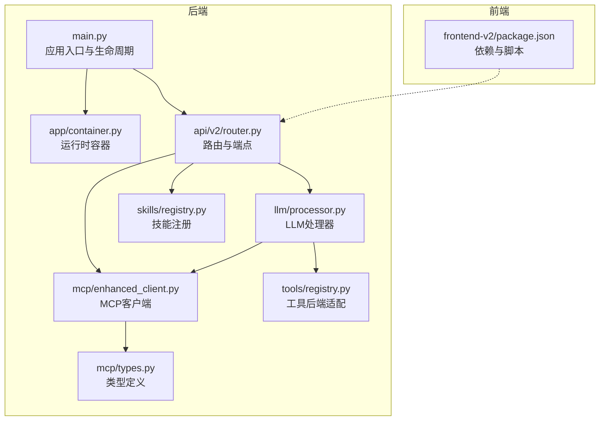
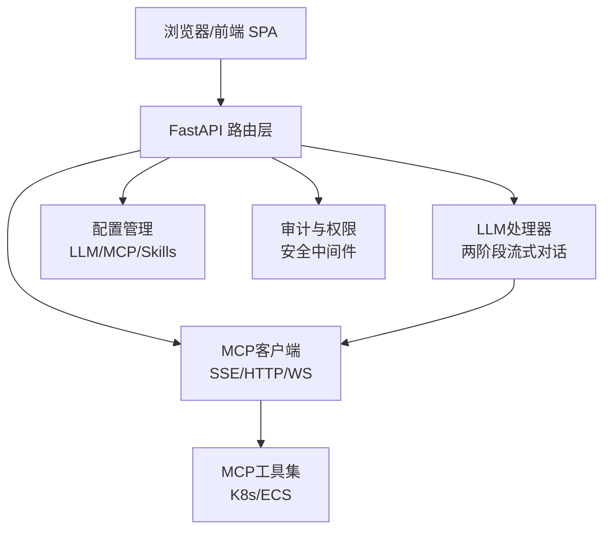
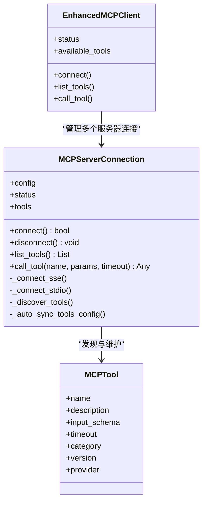
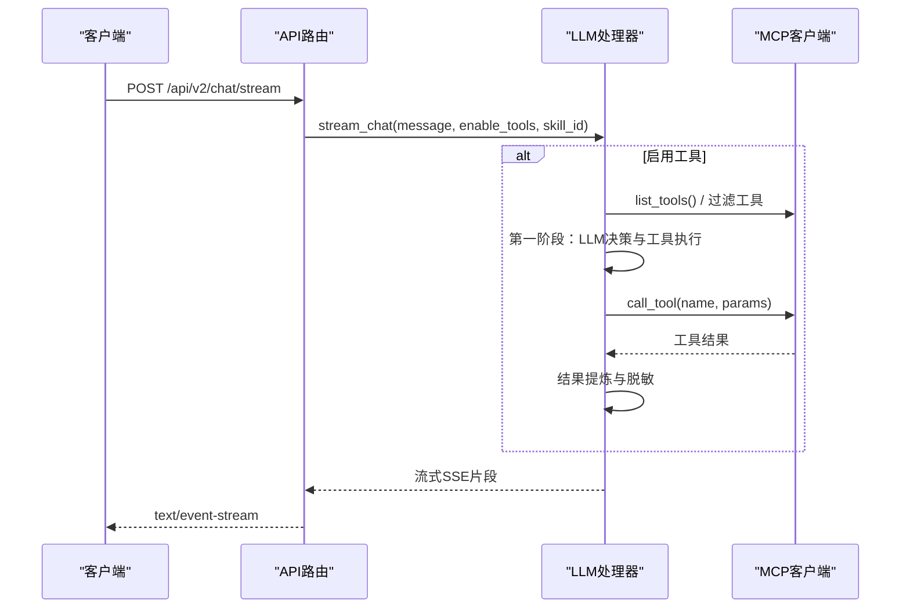
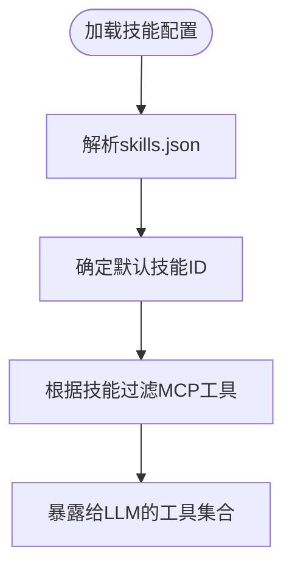
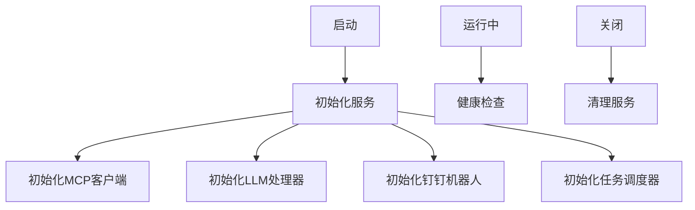
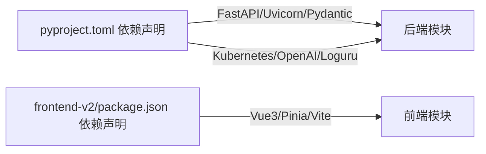

# 开发指南

<cite>
**本文引用的文件**
- [README.md](file://README.md)
- [pyproject.toml](file://pyproject.toml)
- [backend/main.py](file://backend/main.py)
- [frontend-v2/package.json](file://frontend-v2/package.json)
- [scripts/dev.py](file://scripts/dev.py)
- [backend/src/app/container.py](file://backend/src/app/container.py)
- [backend/src/mcp/enhanced_client.py](file://backend/src/mcp/enhanced_client.py)
- [backend/src/llm/processor.py](file://backend/src/llm/processor.py)
- [backend/src/tools/registry.py](file://backend/src/tools/registry.py)
- [backend/src/skills/registry.py](file://backend/src/skills/registry.py)
- [backend/src/api/v2/router.py](file://backend/src/api/v2/router.py)
- [backend/src/mcp/types.py](file://backend/src/mcp/types.py)
- [config/llm_config.example.json](file://config/llm_config.example.json)
- [config/mcp_config.example.json](file://config/mcp_config.example.json)
- [backend/tests/test_api_standard_runtime_ops.py](file://backend/tests/test_api_standard_runtime_ops.py)
</cite>

## 目录
1. [简介](#简介)
2. [项目结构](#项目结构)
3. [核心组件](#核心组件)
4. [架构总览](#架构总览)
5. [详细组件分析](#详细组件分析)
6. [依赖关系分析](#依赖关系分析)
7. [性能考虑](#性能考虑)
8. [故障排查指南](#故障排查指南)
9. [结论](#结论)
10. [附录](#附录)

## 简介
本指南面向贡献者，提供钉钉K8s运维机器人的开发流程、代码规范、测试要求、插件开发机制、前端扩展、设计模式与依赖注入、单元与集成测试编写、代码审查与质量保障、调试与开发工具、性能分析与优化、以及常见问题与最佳实践。项目采用后端FastAPI + 前端Vue3的双端架构，结合MCP协议的工具系统与LLM对话能力，支持Kubernetes与ECS资源管理与运维。

## 项目结构
- 后端（Python 3.11–3.13，Poetry管理）：src/ 下包含API路由、MCP客户端、LLM处理器、工具与技能注册、配置管理、安全与审计、调度器等模块。
- 前端（Vue3 + Vite）：frontend-v2/ 提供现代化聊天界面与工作台组件。
- 配置：config/ 提供LLM/MCP/Skills/定时任务等示例配置文件。
- 脚本：scripts/ 提供开发、构建、启动、清理等自动化脚本。
- 归档：archived/ 保留历史独立MCP工程，便于理解演进。

图表来源
- [backend/main.py:1-494](file://backend/main.py#L1-L494)
- [backend/src/app/container.py:1-54](file://backend/src/app/container.py#L1-L54)
- [backend/src/api/v2/router.py:1-1059](file://backend/src/api/v2/router.py#L1-L1059)
- [backend/src/mcp/enhanced_client.py:1-800](file://backend/src/mcp/enhanced_client.py#L1-L800)
- [backend/src/llm/processor.py:1-800](file://backend/src/llm/processor.py#L1-L800)
- [backend/src/skills/registry.py:1-116](file://backend/src/skills/registry.py#L1-L116)
- [backend/src/tools/registry.py:1-54](file://backend/src/tools/registry.py#L1-L54)
- [backend/src/mcp/types.py:1-186](file://backend/src/mcp/types.py#L1-L186)
- [frontend-v2/package.json:1-41](file://frontend-v2/package.json#L1-L41)

章节来源
- [README.md:64-76](file://README.md#L64-L76)
- [pyproject.toml:1-116](file://pyproject.toml#L1-L116)

## 核心组件
- 应用入口与生命周期：负责日志、环境变量、配置迁移、服务初始化与清理、CORS、静态文件挂载、健康检查、根路径重定向与SPA路由。
- 运行时容器：集中持有MCP客户端、LLM处理器、钉钉机器人等长生命周期服务，并支持LLM处理器热重建。
- API路由：提供聊天（普通/流式）、工具列表与调用、配置管理、巡检、调度、资源与告警等端点。
- MCP客户端：支持SSE/HTTP/WS等传输，自动发现工具、过滤与路由、超时与重试、消息队列与SSE事件处理。
- LLM处理器：两阶段流式对话（工具决策与结果汇总）、上下文优化、结果提炼、脱敏与安全策略。
- 技能注册：基于配置限制可调用的MCP工具集合，支持前缀与精确名白名单。
- 工具后端适配：将MCP客户端适配为统一工具后端接口，便于未来迁移到进程内工具注册。
- 类型定义：MCP协议与LLM消息结构的强类型定义，确保跨模块一致性。

章节来源
- [backend/main.py:137-270](file://backend/main.py#L137-L270)
- [backend/src/app/container.py:15-54](file://backend/src/app/container.py#L15-L54)
- [backend/src/api/v2/router.py:158-345](file://backend/src/api/v2/router.py#L158-L345)
- [backend/src/mcp/enhanced_client.py:33-800](file://backend/src/mcp/enhanced_client.py#L33-L800)
- [backend/src/llm/processor.py:30-800](file://backend/src/llm/processor.py#L30-L800)
- [backend/src/skills/registry.py:18-116](file://backend/src/skills/registry.py#L18-L116)
- [backend/src/tools/registry.py:12-54](file://backend/src/tools/registry.py#L12-L54)
- [backend/src/mcp/types.py:11-186](file://backend/src/mcp/types.py#L11-L186)

## 架构总览
系统采用“后端主进程 + 前端SPA”的架构，后端通过FastAPI提供REST与SSE流式接口，MCP工具在进程内或远端运行，LLM负责对话与工具调用决策，安全与审计贯穿请求链路。

图表来源
- [backend/src/api/v2/router.py:158-345](file://backend/src/api/v2/router.py#L158-L345)
- [backend/src/llm/processor.py:520-757](file://backend/src/llm/processor.py#L520-L757)
- [backend/src/mcp/enhanced_client.py:61-800](file://backend/src/mcp/enhanced_client.py#L61-L800)
- [backend/main.py:348-396](file://backend/main.py#L348-L396)

## 详细组件分析

### 组件A：MCP客户端与工具系统
- 连接与发现：支持SSE/stdio等传输，自动发现工具并过滤启用/禁用列表，支持自动同步工具配置到MCP配置文件。
- 工具调用：根据配置类型选择调用路径（WebSocket/HTTP/SSE/HTTP流），内置超时与重试，消息队列等待SSE结果。
- 状态与可观测：连接状态枚举、统计信息、心跳检测、活跃工具调用跟踪。

图表来源
- [backend/src/mcp/enhanced_client.py:33-800](file://backend/src/mcp/enhanced_client.py#L33-L800)
- [backend/src/mcp/types.py:19-28](file://backend/src/mcp/types.py#L19-L28)

章节来源
- [backend/src/mcp/enhanced_client.py:61-800](file://backend/src/mcp/enhanced_client.py#L61-L800)
- [backend/src/mcp/types.py:11-74](file://backend/src/mcp/types.py#L11-L74)

### 组件B：LLM处理器与两阶段流式对话
- 两阶段处理：第一阶段由LLM判断是否调用工具并执行，第二阶段基于工具结果生成自然语言回复。
- 上下文优化：估算Token、裁剪历史消息、保留关键摘要，避免超出模型上下文限制。
- 结果提炼：针对K8s/ECS/日志等场景提炼关键信息，必要时给出分页与筛选建议。
- 脱敏与安全：对工具结果进行脱敏处理，记录审计日志。

图表来源
- [backend/src/api/v2/router.py:175-345](file://backend/src/api/v2/router.py#L175-L345)
- [backend/src/llm/processor.py:520-757](file://backend/src/llm/processor.py#L520-L757)
- [backend/src/mcp/enhanced_client.py:587-800](file://backend/src/mcp/enhanced_client.py#L587-L800)

章节来源
- [backend/src/llm/processor.py:520-800](file://backend/src/llm/processor.py#L520-L800)
- [backend/src/api/v2/router.py:175-345](file://backend/src/api/v2/router.py#L175-L345)

### 组件C：技能与工具后端适配
- 技能注册：从配置文件加载技能定义，支持默认技能、前缀白名单与精确名白名单，过滤MCP工具集合。
- 工具后端：将MCP客户端适配为统一接口，便于后续迁移到进程内工具注册。

图表来源
- [backend/src/skills/registry.py:39-106](file://backend/src/skills/registry.py#L39-L106)
- [backend/src/tools/registry.py:26-54](file://backend/src/tools/registry.py#L26-L54)

章节来源
- [backend/src/skills/registry.py:18-116](file://backend/src/skills/registry.py#L18-L116)
- [backend/src/tools/registry.py:12-54](file://backend/src/tools/registry.py#L12-L54)

### 组件D：应用入口与运行时容器
- 生命周期：应用启动时初始化MCP客户端、LLM处理器、钉钉机器人、定时巡检与任务调度；关闭时清理。
- 容器：集中管理服务实例，支持LLM处理器热重建，保持钉钉机器人实例同步。

图表来源
- [backend/main.py:137-270](file://backend/main.py#L137-L270)
- [backend/src/app/container.py:23-36](file://backend/src/app/container.py#L23-L36)

章节来源
- [backend/main.py:137-270](file://backend/main.py#L137-L270)
- [backend/src/app/container.py:15-54](file://backend/src/app/container.py#L15-L54)

## 依赖关系分析
- 后端依赖：FastAPI、Uvicorn、Pydantic、httpx/aiohttp/websockets、Kubernetes客户端、NetworkX、OpenAI SDK、Loguru、Tenacity、Cron表达式、Cryptography等。
- 开发依赖：pytest、black、flake8、mypy。
- 前端依赖：Vue3、Element Plus、Pinia、Vue Router、Axios、Marked、KaTeX等。

图表来源
- [pyproject.toml:9-51](file://pyproject.toml#L9-L51)
- [frontend-v2/package.json:24-39](file://frontend-v2/package.json#L24-L39)

章节来源
- [pyproject.toml:1-116](file://pyproject.toml#L1-L116)
- [frontend-v2/package.json:1-41](file://frontend-v2/package.json#L1-L41)

## 性能考虑
- 上下文优化：LLM处理器估算Token并裁剪历史消息，避免超限。
- 结果提炼：对大结果进行关键信息提炼，减少LLM负载。
- 并发与超时：MCP客户端为工具调用设置超时与重试，SSE事件监听支持指数退避。
- 缓存与路由：MCP配置支持缓存与工具路由，降低重复调用成本。
- 前端流式渲染：SSE流式事件提升交互体验，避免一次性渲染大量内容。

章节来源
- [backend/src/llm/processor.py:463-518](file://backend/src/llm/processor.py#L463-L518)
- [backend/src/mcp/enhanced_client.py:165-244](file://backend/src/mcp/enhanced_client.py#L165-L244)
- [config/mcp_config.example.json:5-12](file://config/mcp_config.example.json#L5-L12)

## 故障排查指南
- 启动与环境
  - Python版本：确保在3.11–3.13范围内，Poetry环境与依赖安装正确。
  - 前端Node版本：遵循package.json引擎约束。
- 配置
  - LLM配置：复制示例文件至config/llm_config.json，填写真实凭据；也可通过环境变量迁移。
  - MCP配置：复制示例文件至config/mcp_config.json，启用所需服务器与工具。
- 连接与工具
  - MCP连接失败：检查SSE/HTTP端点可达性、认证头与超时设置；查看SSE事件监听日志。
  - 工具调用超时：调整MCP配置中的超时与重试参数；确认工具本身执行耗时。
- 安全与审计
  - 权限不足：工具调用需要相应权限（如mcp:write），只读工具允许白名单内工具。
  - 审计记录：操作审计中间件记录请求与响应元数据，便于追踪。
- 前端
  - SPA缺失：若静态资源未构建，后端返回API-only模式；构建前端或提供静态资源。

章节来源
- [README.md:15-55](file://README.md#L15-L55)
- [backend/main.py:62-129](file://backend/main.py#L62-L129)
- [backend/src/mcp/enhanced_client.py:114-244](file://backend/src/mcp/enhanced_client.py#L114-L244)
- [backend/src/api/v2/router.py:424-488](file://backend/src/api/v2/router.py#L424-L488)
- [backend/main.py:348-396](file://backend/main.py#L348-L396)

## 结论
本项目通过清晰的模块划分与强类型定义，实现了LLM驱动的K8s/ECS运维机器人。MCP工具系统与技能白名单机制提供了灵活的安全控制，两阶段流式对话提升了交互效率与安全性。建议贡献者遵循本文的开发流程、代码规范与测试要求，持续完善系统的稳定性与可维护性。

## 附录

### A. 开发环境配置与常用命令
- Python与Poetry：使用3.11–3.13，安装依赖与脚本。
- 前端：Node版本满足要求，安装依赖。
- 启动方式：一键启动、仅后端、开发环境（后端热重载+前端）。
- 常用命令：start-all、serve、dev、build、clean。

章节来源
- [README.md:15-86](file://README.md#L15-L86)
- [pyproject.toml:59-78](file://pyproject.toml#L59-L78)
- [scripts/dev.py:92-155](file://scripts/dev.py#L92-L155)

### B. 代码贡献流程与规范
- 代码风格：使用Black（行宽88，Python 3.11），mypy严格模式。
- 提交前检查：运行pytest、flake8、mypy；确保通过。
- 分支与合并：遵循仓库分支策略，提交PR并至少一名维护者审核。

章节来源
- [pyproject.toml:94-116](file://pyproject.toml#L94-L116)

### C. 插件开发机制
- 自定义工具开发
  - 进程内工具：在k8s_mcp/tools或ecs_mcp/tools中新增工具，遵循MCP工具schema。
  - 远端MCP服务器：在MCP配置中添加服务器条目，启用对应工具。
- LLM提供商集成
  - 当前简化版：从环境变量解析单一提供商配置；未来可扩展多供应商。
  - 配置文件：参考llm_config.example.json，填充提供商凭据与参数。
- 前端组件扩展
  - 新增页面/组件：在frontend-v2/src/views/components中扩展，注意与后端API契约一致。
  - 主题与样式：通过assets/css与theme目录统一管理。

章节来源
- [config/llm_config.example.json:1-45](file://config/llm_config.example.json#L1-L45)
- [config/mcp_config.example.json:1-66](file://config/mcp_config.example.json#L1-L66)
- [backend/src/mcp/enhanced_client.py:292-504](file://backend/src/mcp/enhanced_client.py#L292-L504)

### D. 设计模式与依赖注入
- 依赖注入：通过FastAPI依赖系统与运行时容器注入MCP客户端、LLM处理器、权限与审计服务。
- 工厂模式：MCP配置管理器与LLM配置解析器负责创建与更新处理器实例。
- 观察者模式：SSE事件监听作为观察者，接收工具执行状态与结果。
- 单例/全局：运行时容器作为进程级单例，提供服务访问边界。

章节来源
- [backend/src/api/v2/router.py:30-42](file://backend/src/api/v2/router.py#L30-L42)
- [backend/src/app/container.py:15-54](file://backend/src/app/container.py#L15-L54)
- [backend/src/mcp/enhanced_client.py:157-244](file://backend/src/mcp/enhanced_client.py#L157-L244)

### E. 单元测试与集成测试编写指南
- 单元测试
  - 路由依赖：使用TestClient与dependency_overrides模拟用户权限与MCP客户端。
  - 场景覆盖：健康检查、工具调用权限、配置读取、SSE事件流。
- 集成测试
  - 端到端：启动应用，调用流式聊天端点，验证SSE事件与最终完成事件。
  - 配置变更：模拟LLM配置热重载，验证运行时容器重建处理器。

章节来源
- [backend/tests/test_api_standard_runtime_ops.py:12-252](file://backend/tests/test_api_standard_runtime_ops.py#L12-L252)
- [backend/src/api/v2/router.py:175-345](file://backend/src/api/v2/router.py#L175-L345)

### F. 代码审查流程与质量保证
- 审查要点：模块职责、异常处理、日志与审计、安全与权限、性能与可维护性。
- 质量工具：pytest（单元/集成）、flake8（风格）、mypy（类型）、black（格式）。
- 审查流程：提交PR → 自动检查 → 人工审查 → 合并。

章节来源
- [pyproject.toml:53-57](file://pyproject.toml#L53-L57)

### G. 调试技巧与开发工具
- 后端
  - 日志：Loguru统一输出，控制台与文件分离，支持旋转与保留策略。
  - 异常：统一错误封装与SSE错误事件，便于前端展示。
  - 热重载：开发脚本并行启动后端与前端，支持Ctrl+C优雅退出。
- 前端
  - Vite开发服务器：热重载、代理API、预览与本地服务。
  - 组件与主题：按模块拆分，主题与样式集中管理。

章节来源
- [backend/main.py:38-52](file://backend/main.py#L38-L52)
- [backend/main.py:311-345](file://backend/main.py#L311-L345)
- [scripts/dev.py:156-219](file://scripts/dev.py#L156-L219)
- [frontend-v2/package.json:10-15](file://frontend-v2/package.json#L10-L15)

### H. 性能分析与优化指导
- 上下文裁剪：根据Token估算与消息数量裁剪历史，保留系统消息与最新对话循环。
- 结果提炼：针对K8s/ECS/日志场景提炼关键信息，必要时给出分页与筛选建议。
- 并发与超时：合理设置MCP工具超时与重试，避免阻塞；SSE事件监听指数退避。
- 缓存策略：启用MCP配置缓存，减少重复查询；工具路由按前缀快速定位。

章节来源
- [backend/src/llm/processor.py:463-518](file://backend/src/llm/processor.py#L463-L518)
- [backend/src/llm/processor.py:426-457](file://backend/src/llm/processor.py#L426-L457)
- [backend/src/mcp/enhanced_client.py:165-244](file://backend/src/mcp/enhanced_client.py#L165-L244)
- [config/mcp_config.example.json:5-12](file://config/mcp_config.example.json#L5-L12)

### I. 常见开发问题与最佳实践
- Python版本冲突：确保使用3.11–3.13，避免3.14上游依赖限制。
- 前端依赖安装失败：检查Node版本与包管理器版本，必要时更换镜像源。
- LLM不可用：检查API密钥、代理设置与网络连通性；查看详细错误日志。
- MCP工具不可用：确认服务器启用、工具已发现并加入启用列表；检查SSE端点与认证。
- 权限与审计：为高风险工具配置写权限；开启审计日志以便追溯。

章节来源
- [README.md:19-28](file://README.md#L19-L28)
- [backend/src/llm/processor.py:103-120](file://backend/src/llm/processor.py#L103-L120)
- [backend/src/mcp/enhanced_client.py:114-156](file://backend/src/mcp/enhanced_client.py#L114-L156)
- [backend/src/api/v2/router.py:424-488](file://backend/src/api/v2/router.py#L424-L488)