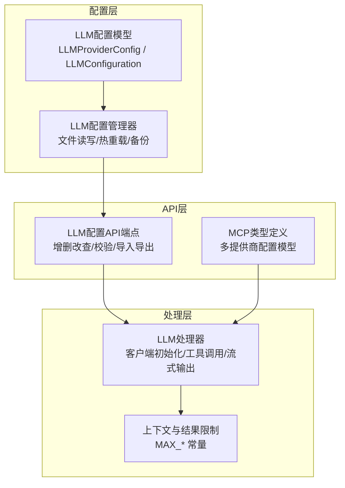
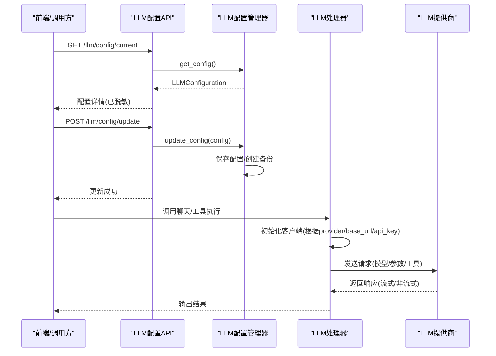
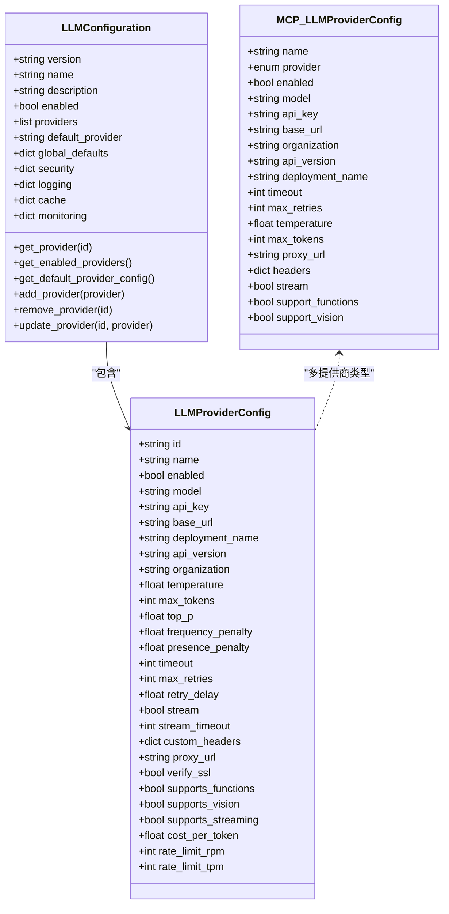
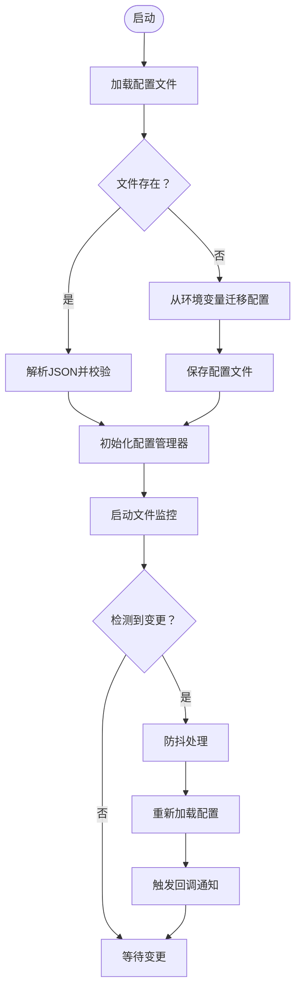
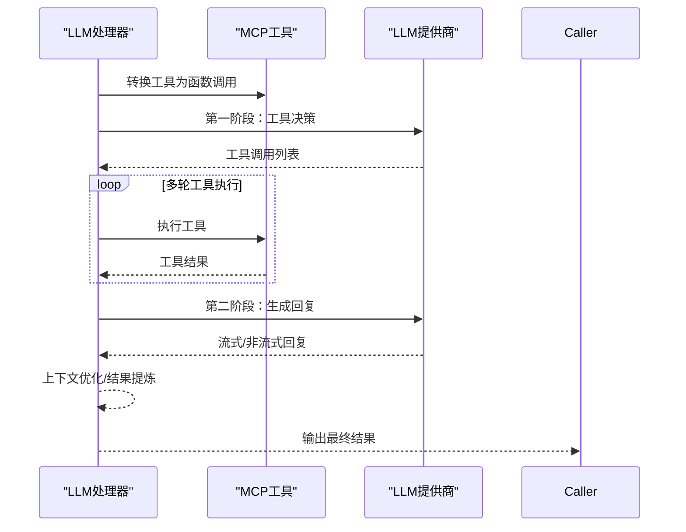
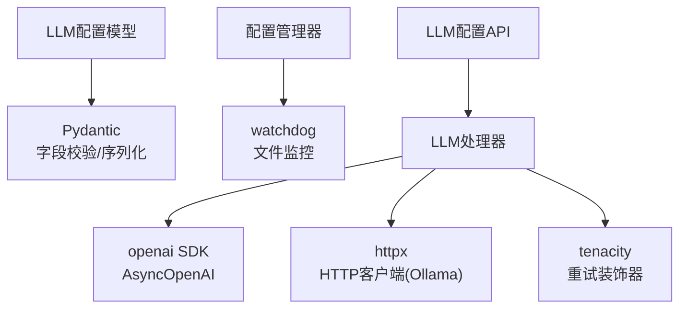

# LLM提供商集成

<cite>
**本文档引用的文件**
- [config.py](file://backend/src/llm/config.py)
- [config_manager.py](file://backend/src/llm/config_manager.py)
- [llm_config.py](file://backend/src/api/v2/endpoints/llm_config.py)
- [processor.py](file://backend/src/llm/processor.py)
- [processor_limits.py](file://backend/src/llm/processor_limits.py)
- [types.py](file://backend/src/mcp/types.py)
- [ollama_adapter.py](file://backend/src/k8s_mcp/llm/ollama_adapter.py)
- [llm_config.example.json](file://config/llm_config.example.json)
- [router.py](file://backend/src/api/v2/router.py)
- [migrate_llm_config.py](file://scripts/migrate_llm_config.py)
</cite>

## 目录
1. [简介](#简介)
2. [项目结构](#项目结构)
3. [核心组件](#核心组件)
4. [架构总览](#架构总览)
5. [详细组件分析](#详细组件分析)
6. [依赖关系分析](#依赖关系分析)
7. [性能考量](#性能考量)
8. [故障排查指南](#故障排查指南)
9. [结论](#结论)
10. [附录](#附录)

## 简介
本指南面向为钉钉K8s运维机器人集成LLM提供商的开发者，系统阐述LLM配置模型、多提供商管理、适配流程、配置示例与最佳实践。文档覆盖OpenAI、Azure OpenAI、Anthropic、智谱（Zhipu）、通义（Qwen）、DeepSeek、Moonshot、Ollama等主流LLM提供商的接入要点，并提供自定义LLM提供商的适配步骤、认证方式、请求格式转换、多提供商切换机制、负载均衡与故障转移策略、性能优化、缓存与成本控制建议。

## 项目结构
LLM相关能力由三层组成：
- 配置层：定义LLM配置模型与文件管理器，支持从文件与环境变量加载、热重载、备份与导入导出。
- 处理层：封装LLM客户端与调用流程，支持工具调用、流式输出、上下文优化与结果提炼。
- API层：提供LLM配置管理的REST接口，支持增删改查、校验、导入导出与文件监控状态查询。

**图表来源**
- [config.py:15-360](file://backend/src/llm/config.py#L15-L360)
- [config_manager.py:150-760](file://backend/src/llm/config_manager.py#L150-L760)
- [llm_config.py:1-473](file://backend/src/api/v2/endpoints/llm_config.py#L1-L473)
- [processor.py:30-800](file://backend/src/llm/processor.py#L30-L800)
- [processor_limits.py:1-35](file://backend/src/llm/processor_limits.py#L1-L35)
- [types.py:105-186](file://backend/src/mcp/types.py#L105-L186)

**章节来源**
- [config.py:1-360](file://backend/src/llm/config.py#L1-L360)
- [config_manager.py:1-760](file://backend/src/llm/config_manager.py#L1-L760)
- [llm_config.py:1-473](file://backend/src/api/v2/endpoints/llm_config.py#L1-L473)
- [processor.py:1-800](file://backend/src/llm/processor.py#L1-L800)
- [processor_limits.py:1-35](file://backend/src/llm/processor_limits.py#L1-L35)
- [types.py:105-186](file://backend/src/mcp/types.py#L105-L186)

## 核心组件
- LLMProviderConfig：定义单个LLM提供商的配置项，包括基础参数（id、name、enabled、model、api_key、base_url）、Azure/OpenAI特有参数（deployment_name、api_version、organization）、模型参数（temperature、max_tokens、top_p、频率/存在惩罚）、连接与重试（timeout、max_retries、retry_delay）、流式输出（stream、stream_timeout）、高级选项（custom_headers、proxy_url、verify_ssl）、功能支持（supports_functions、supports_vision、supports_streaming）、成本与限流（cost_per_token、rate_limit_rpm、rate_limit_tpm）。
- LLMConfiguration：定义完整LLM配置，包含版本、名称、描述、全局启用状态、提供商列表、默认提供商、全局默认配置、安全/日志/缓存/监控配置，以及提供商查询与增删改查方法。
- LLMConfigManager：负责配置文件的读取、保存、备份、热重载、导入导出、文件监控与回调通知，支持从环境变量迁移配置。
- EnhancedLLMProcessor：封装LLM客户端初始化与调用流程，支持OpenAI/Ollama等客户端，工具调用、流式输出、上下文优化与结果提炼。
- LLMConfig API端点：提供LLM配置的增删改查、概览、校验、导入导出、备份管理与文件监控状态查询。

**章节来源**
- [config.py:15-360](file://backend/src/llm/config.py#L15-L360)
- [config_manager.py:150-760](file://backend/src/llm/config_manager.py#L150-L760)
- [llm_config.py:1-473](file://backend/src/api/v2/endpoints/llm_config.py#L1-L473)
- [processor.py:30-800](file://backend/src/llm/processor.py#L30-L800)

## 架构总览
下图展示从配置到调用的端到端流程：

**图表来源**
- [llm_config.py:94-131](file://backend/src/api/v2/endpoints/llm_config.py#L94-L131)
- [config_manager.py:472-552](file://backend/src/llm/config_manager.py#L472-L552)
- [processor.py:59-120](file://backend/src/llm/processor.py#L59-L120)

## 详细组件分析

### 数据结构定义：LLMConfig 与 LLMProviderConfig
- LLMProviderConfig（文件配置）：支持基础参数、Azure/OpenAI特有参数、模型参数、连接与重试、流式输出、高级选项、功能支持、成本与限流，并内置字段校验（ID格式、模型名称、base_url协议）。
- LLMConfiguration（文件配置）：包含版本、名称、描述、全局启用状态、提供商列表、默认提供商、全局默认配置、安全/日志/缓存/监控配置，以及提供商查询与增删改查方法。
- LLMProviderConfig（多提供商类型）：在MCP类型定义中，提供多提供商配置模型，字段包含name/provider/enabled/model/api_key/base_url/organization/api_version/deployment_name/timeout/max_retries/temperature/max_tokens/proxy_url/headers/stream，以及功能支持标记。

**图表来源**
- [config.py:15-360](file://backend/src/llm/config.py#L15-L360)
- [types.py:105-186](file://backend/src/mcp/types.py#L105-L186)

**章节来源**
- [config.py:15-360](file://backend/src/llm/config.py#L15-L360)
- [types.py:105-186](file://backend/src/mcp/types.py#L105-L186)

### 配置管理器：文件读写、热重载与备份
- 文件读取/保存：支持从文件加载配置、保存配置到文件，提供默认配置创建与校验。
- 环境变量迁移：当配置文件不存在时，从环境变量读取并创建初始配置。
- 热重载：基于watchdog监控配置文件变更，防抖处理与JSON格式校验，支持回调通知。
- 备份与导入导出：自动创建备份，支持备份列表查询、恢复与配置导入导出。
- 文件监控状态：提供监控开关、重启与状态查询。

**图表来源**
- [config_manager.py:411-470](file://backend/src/llm/config_manager.py#L411-L470)
- [config_manager.py:627-742](file://backend/src/llm/config_manager.py#L627-L742)

**章节来源**
- [config_manager.py:150-760](file://backend/src/llm/config_manager.py#L150-L760)

### LLM处理器：客户端初始化与调用流程
- 客户端初始化：根据provider选择AsyncOpenAI客户端，支持OpenAI与Ollama，其余提供者走通用OpenAI客户端路径；记录诊断日志与错误堆栈。
- 工具调用：将MCP工具转换为OpenAI格式函数调用，支持多轮工具执行与结果汇总。
- 流式输出：支持两阶段流式聊天（工具决策 + LLM回复），并提供回退机制。
- 上下文优化：估算token、限制历史消息数量与上下文大小，避免超出限制。
- 结果提炼：对过大结果进行关键信息提炼与分页建议。

**图表来源**
- [processor.py:59-120](file://backend/src/llm/processor.py#L59-L120)
- [processor.py:758-800](file://backend/src/llm/processor.py#L758-L800)

**章节来源**
- [processor.py:30-800](file://backend/src/llm/processor.py#L30-L800)
- [processor_limits.py:1-35](file://backend/src/llm/processor_limits.py#L1-L35)

### API端点：LLM配置管理
- 当前配置：获取当前LLM配置（已脱敏）。
- 更新配置：接收配置数据并校验后更新，自动创建备份。
- 概览：统计提供商数量、启用数量、默认提供商与分组信息。
- 提供商管理：列表、创建、更新、删除提供商。
- 备份管理：备份列表、恢复指定备份。
- 配置验证：检查提供商缺失、默认提供商有效性、告警提示。
- 导入导出：导出配置文件与导入配置文件。
- 文件监控：状态查询、开关切换、重启监控。

**章节来源**
- [llm_config.py:94-473](file://backend/src/api/v2/endpoints/llm_config.py#L94-L473)

### 多提供商支持与适配
- 多提供商类型：MCP类型定义中提供多提供商配置模型，支持openai/azure/anthropic/zhipu/qwen/deepseek/moonshot/ollama/custom等。
- 支持的提供商列表：API提供支持的提供商清单，包含必填/可选字段与默认模型列表。
- 切换机制：当前简化处理器仅支持单供应商，多供应商切换功能在规划中；可通过修改环境变量后重启服务实现切换。

**章节来源**
- [types.py:105-186](file://backend/src/mcp/types.py#L105-L186)
- [router.py:885-968](file://backend/src/api/v2/router.py#L885-L968)

### 自定义LLM提供商适配流程
- API接口映射：遵循OpenAI兼容格式（/v1/chat/completions），设置base_url与model；若非OpenAI格式，需在适配层做请求格式转换。
- 认证方式：优先使用api_key；对于本地Ollama等无需密钥的服务，可固定api_key或使用空值。
- 请求格式转换：在适配层统一请求参数（模型名、温度、最大token、工具函数等），并在响应层统一解析与错误处理。
- 功能支持：根据提供商能力设置supports_functions/supports_vision/supports_streaming；对不支持的功能进行降级处理。
- 代理与SSL：通过proxy_url与verify_ssl控制网络访问与证书校验。
- 成本与限流：结合cost_per_token与rate_limit_rpm/tpm进行成本控制与速率限制。

**章节来源**
- [config.py:15-360](file://backend/src/llm/config.py#L15-L360)
- [processor.py:59-120](file://backend/src/llm/processor.py#L59-L120)

### 主流LLM提供商集成要点
- OpenAI：设置base_url为官方API地址，填写api_key与model；可选organization。
- Azure OpenAI：设置base_url、api_key、deployment_name、api_version；模型名通常为gpt-35-turbo等。
- Anthropic：使用官方base_url与api_key，模型名遵循其规范。
- 智谱（Zhipu）：设置base_url为官方PAAS接口，填写api_key与model。
- 通义（Qwen）：设置base_url为兼容模式接口，填写api_key与model。
- DeepSeek：设置base_url与api_key，模型名遵循其规范。
- Moonshot：设置base_url与api_key，模型名遵循其规范。
- Ollama：设置base_url为本地服务地址（如http://localhost:11434/v1），模型名填写本地已拉取模型；无需api_key或可使用固定值。

**章节来源**
- [config.py:209-256](file://backend/src/llm/config.py#L209-L256)
- [router.py:885-968](file://backend/src/api/v2/router.py#L885-L968)
- [processor.py:75-96](file://backend/src/llm/processor.py#L75-L96)

### 配置示例与最佳实践
- 配置文件示例：参考示例文件，填充api_key、base_url、model、temperature、max_tokens、timeout、max_retries、stream等字段。
- 环境变量回退：当文件配置不可用或未启用时，系统会回退到环境变量配置，便于容器化部署。
- 安全与脱敏：API响应与日志输出均进行敏感信息脱敏处理。
- 缓存策略：配置中提供cache字段，可启用缓存并设置TTL与最大容量；同时在工具查询中也有缓存实现思路（可借鉴）。
- 性能优化：限制上下文大小与历史消息数量，估算token，对过大结果进行提炼与分页建议。
- 成本控制：通过cost_per_token与rate_limit_rpm/tpm进行成本与速率控制；结合缓存减少重复请求。

**章节来源**
- [llm_config.example.json:1-45](file://config/llm_config.example.json#L1-L45)
- [config.py:142-161](file://backend/src/llm/config.py#L142-L161)
- [processor_limits.py:8-35](file://backend/src/llm/processor_limits.py#L8-L35)

### 多提供商切换、负载均衡与故障转移
- 切换机制：当前简化处理器仅支持单供应商；多供应商切换功能在规划中，暂可通过修改环境变量后重启服务实现切换。
- 负载均衡：可在外部网关或SDK层实现多提供商负载均衡，按权重或延迟选择最优提供商。
- 故障转移：在调用失败时自动切换到备用提供商，结合重试与熔断策略提升可用性。

**章节来源**
- [router.py:653-664](file://backend/src/api/v2/router.py#L653-L664)

## 依赖关系分析
- 配置模型依赖Pydantic进行字段校验与序列化。
- 配置管理器依赖watchdog进行文件监控，支持热重载与回调通知。
- LLM处理器依赖openai SDK与httpx（Ollama适配器），并结合tenacity实现重试。
- API端点依赖FastAPI路由与权限校验，提供配置管理与校验能力。

**图表来源**
- [config.py:11-12](file://backend/src/llm/config.py#L11-L12)
- [config_manager.py:21-26](file://backend/src/llm/config_manager.py#L21-L26)
- [processor.py:13-27](file://backend/src/llm/processor.py#L13-L27)

**章节来源**
- [config.py:1-360](file://backend/src/llm/config.py#L1-L360)
- [config_manager.py:1-760](file://backend/src/llm/config_manager.py#L1-L760)
- [processor.py:1-800](file://backend/src/llm/processor.py#L1-L800)

## 性能考量
- 上下文与结果限制：通过MAX_CONTEXT_TOKENS、MAX_HISTORY_MESSAGES、MAX_RESULT_SIZE、MAX_RESULT_LINES与SUMMARY_TARGET_SIZE控制内存与带宽占用。
- 结果提炼：对过大结果进行关键信息提炼与分页建议，降低传输与渲染压力。
- 流式输出：开启stream可显著改善交互体验，减少首字节延迟。
- 重试与超时：合理设置timeout与max_retries，避免长时间阻塞。
- 缓存：启用缓存可减少重复请求，建议结合TTL与最大容量控制内存占用。

**章节来源**
- [processor_limits.py:8-35](file://backend/src/llm/processor_limits.py#L8-L35)
- [processor.py:459-518](file://backend/src/llm/processor.py#L459-L518)

## 故障排查指南
- 配置文件错误：检查JSON格式、字段完整性与base_url协议；使用配置验证端点获取错误与告警信息。
- 环境变量迁移：确认环境变量是否正确设置，系统会在配置文件不存在时自动迁移。
- 文件监控：检查watchdog是否可用，查看文件监控状态与回调数量；必要时重启监控。
- 客户端初始化失败：查看诊断日志与错误堆栈，检查代理设置与SSL证书；关注socks/proxy相关错误提示。
- 工具调用失败：确认MCP客户端连接状态与工具过滤；检查工具结果有效性与错误标志位。

**章节来源**
- [llm_config.py:323-360](file://backend/src/api/v2/endpoints/llm_config.py#L323-L360)
- [config_manager.py:627-742](file://backend/src/llm/config_manager.py#L627-L742)
- [processor.py:103-120](file://backend/src/llm/processor.py#L103-L120)

## 结论
本指南提供了从数据结构、配置管理、处理器实现到API接口的完整LLM提供商集成方案。通过标准化的配置模型与文件管理器，结合灵活的处理器与API端点，可快速对接OpenAI、Azure OpenAI、Anthropic、智谱、通义、DeepSeek、Moonshot、Ollama等主流LLM提供商，并为自定义提供商提供清晰的适配路径。配合性能优化、缓存与成本控制策略，可在保证稳定性的同时提升用户体验与资源利用率。

## 附录
- 配置迁移脚本：提供从环境变量到文件配置的迁移与回退能力，支持备份与日志记录。
- Ollama适配器：提供结构化输出与伪工具调用能力，支持YAML生成与需求分析。

**章节来源**
- [migrate_llm_config.py:154-231](file://scripts/migrate_llm_config.py#L154-L231)
- [migrate_llm_config.py:283-316](file://scripts/migrate_llm_config.py#L283-L316)
- [ollama_adapter.py:1-298](file://backend/src/k8s_mcp/llm/ollama_adapter.py#L1-L298)