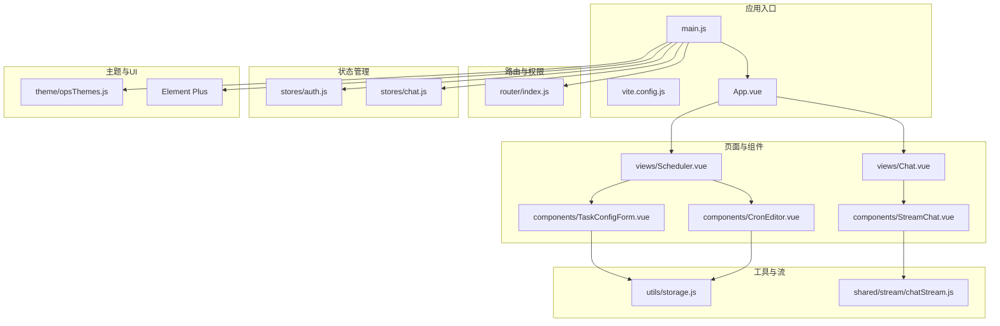
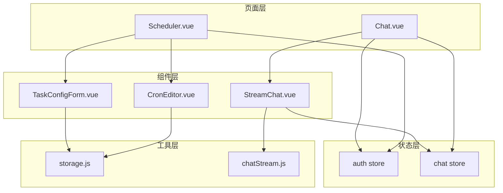
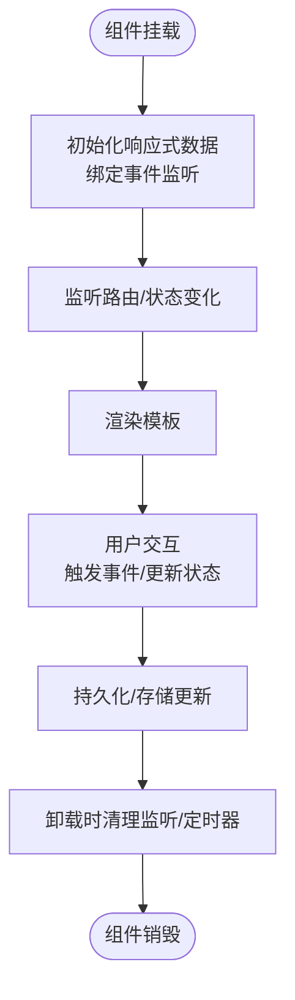
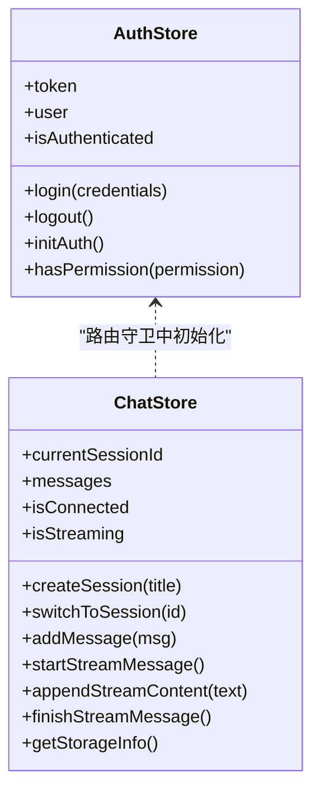
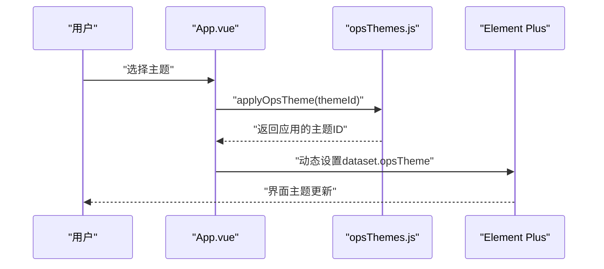
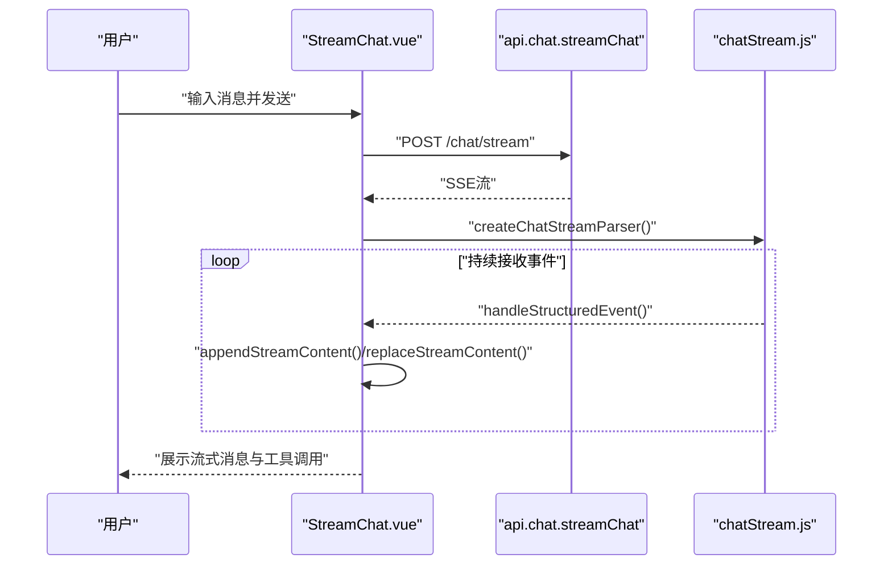
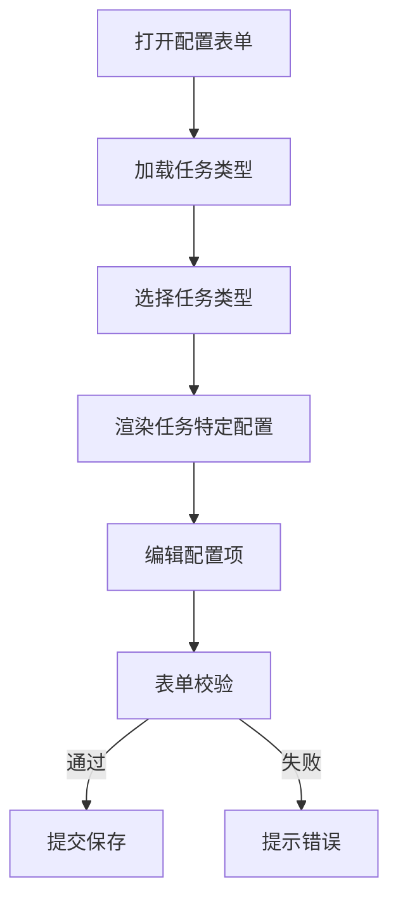
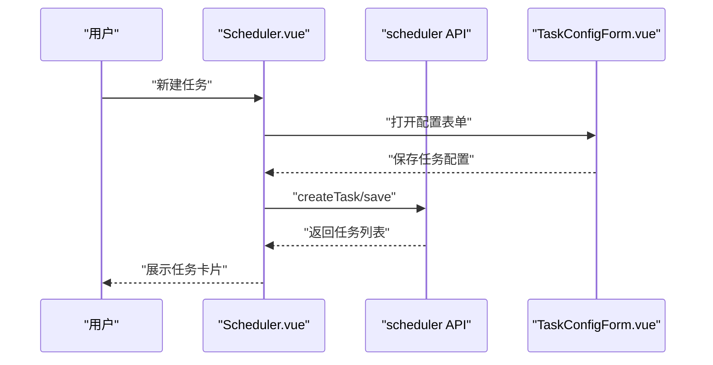
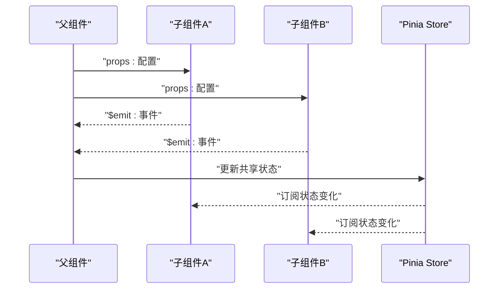
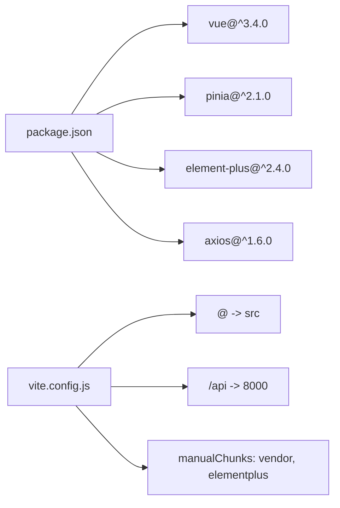

# 前端组件扩展

<cite>
**本文档引用的文件**
- [package.json](file://frontend-v2/package.json)
- [main.js](file://frontend-v2/src/main.js)
- [vite.config.js](file://frontend-v2/vite.config.js)
- [App.vue](file://frontend-v2/src/App.vue)
- [router/index.js](file://frontend-v2/src/router/index.js)
- [stores/auth.js](file://frontend-v2/src/stores/auth.js)
- [stores/chat.js](file://frontend-v2/src/stores/chat.js)
- [theme/opsThemes.js](file://frontend-v2/src/theme/opsThemes.js)
- [components/StreamChat.vue](file://frontend-v2/src/components/StreamChat.vue)
- [components/TaskConfigForm.vue](file://frontend-v2/src/components/TaskConfigForm.vue)
- [components/CronEditor.vue](file://frontend-v2/src/components/CronEditor.vue)
- [utils/storage.js](file://frontend-v2/src/utils/storage.js)
- [shared/stream/chatStream.js](file://frontend-v2/src/shared/stream/chatStream.js)
- [views/Chat.vue](file://frontend-v2/src/views/Chat.vue)
- [views/Scheduler.vue](file://frontend-v2/src/views/Scheduler.vue)
</cite>

## 目录
1. [简介](#简介)
2. [项目结构](#项目结构)
3. [核心组件](#核心组件)
4. [架构总览](#架构总览)
5. [详细组件分析](#详细组件分析)
6. [依赖关系分析](#依赖关系分析)
7. [性能考虑](#性能考虑)
8. [故障排除指南](#故障排除指南)
9. [结论](#结论)
10. [附录](#附录)

## 简介
本指南面向钉钉K8s运维机器人前端团队，提供Vue.js 3组件扩展的最佳实践与完整示例，涵盖：
- Vue.js 3组件开发模式：结构、props、事件、生命周期
- Pinia状态管理：store定义、状态更新、异步操作
- Element Plus UI集成：主题配置、样式覆盖、响应式设计
- 完整组件示例：聊天界面、配置管理、任务调度
- 组件间通信：父子、兄弟、跨组件状态共享
- 测试、性能优化与可访问性最佳实践

## 项目结构
前端采用Vite构建，基于Vue 3 + Pinia + Element Plus，模块化组织如下：
- 应用入口与全局配置：main.js、vite.config.js
- 根组件与主题：App.vue、theme/opsThemes.js
- 路由与权限：router/index.js
- 状态管理：stores/auth.js、stores/chat.js
- 工具与流式处理：utils/storage.js、shared/stream/chatStream.js
- 页面与组件：views/Chat.vue、views/Scheduler.vue、components/StreamChat.vue、components/TaskConfigForm.vue、components/CronEditor.vue

**图表来源**
- [main.js:1-52](file://frontend-v2/src/main.js#L1-L52)
- [vite.config.js:1-55](file://frontend-v2/vite.config.js#L1-L55)
- [App.vue:1-126](file://frontend-v2/src/App.vue#L1-L126)
- [router/index.js:1-194](file://frontend-v2/src/router/index.js#L1-L194)
- [stores/auth.js:1-130](file://frontend-v2/src/stores/auth.js#L1-L130)
- [stores/chat.js:1-200](file://frontend-v2/src/stores/chat.js#L1-L200)
- [theme/opsThemes.js:1-33](file://frontend-v2/src/theme/opsThemes.js#L1-L33)
- [views/Chat.vue:1-120](file://frontend-v2/src/views/Chat.vue#L1-L120)
- [views/Scheduler.vue:1-120](file://frontend-v2/src/views/Scheduler.vue#L1-L120)
- [components/StreamChat.vue:1-120](file://frontend-v2/src/components/StreamChat.vue#L1-L120)
- [components/TaskConfigForm.vue:1-120](file://frontend-v2/src/components/TaskConfigForm.vue#L1-L120)
- [components/CronEditor.vue:1-120](file://frontend-v2/src/components/CronEditor.vue#L1-L120)
- [utils/storage.js:1-120](file://frontend-v2/src/utils/storage.js#L1-L120)
- [shared/stream/chatStream.js:1-60](file://frontend-v2/src/shared/stream/chatStream.js#L1-L60)

**章节来源**
- [package.json:1-41](file://frontend-v2/package.json#L1-L41)
- [main.js:1-52](file://frontend-v2/src/main.js#L1-L52)
- [vite.config.js:1-55](file://frontend-v2/vite.config.js#L1-L55)

## 核心组件
- 应用根组件与布局：App.vue负责导航、面包屑、用户下拉菜单与主题切换
- 认证与权限：stores/auth.js提供登录、登出、权限校验与会话持久化
- 聊天状态：stores/chat.js提供会话管理、消息流式处理、持久化中间件
- 页面视图：views/Chat.vue与views/Scheduler.vue承载业务功能
- 通用组件：components/StreamChat.vue、TaskConfigForm.vue、CronEditor.vue

**章节来源**
- [App.vue:128-292](file://frontend-v2/src/App.vue#L128-L292)
- [stores/auth.js:19-129](file://frontend-v2/src/stores/auth.js#L19-L129)
- [stores/chat.js:82-200](file://frontend-v2/src/stores/chat.js#L82-L200)
- [views/Chat.vue:445-520](file://frontend-v2/src/views/Chat.vue#L445-L520)
- [views/Scheduler.vue:334-420](file://frontend-v2/src/views/Scheduler.vue#L334-L420)

## 架构总览
整体采用“页面-组件-工具”分层：
- 页面层：Chat、Scheduler等视图组件
- 组件层：StreamChat、TaskConfigForm、CronEditor等可复用UI组件
- 工具层：storage.js提供存储抽象，chatStream.js提供SSE解析
- 状态层：Pinia store管理认证与聊天状态
- UI层：Element Plus + 自定义主题

**图表来源**
- [views/Chat.vue:110-117](file://frontend-v2/src/views/Chat.vue#L110-L117)
- [views/Scheduler.vue:289-302](file://frontend-v2/src/views/Scheduler.vue#L289-L302)
- [components/StreamChat.vue:251-279](file://frontend-v2/src/components/StreamChat.vue#L251-L279)
- [components/TaskConfigForm.vue:331-351](file://frontend-v2/src/components/TaskConfigForm.vue#L331-L351)
- [components/CronEditor.vue:221-235](file://frontend-v2/src/components/CronEditor.vue#L221-L235)
- [stores/chat.js:82-120](file://frontend-v2/src/stores/chat.js#L82-L120)
- [utils/storage.js:27-80](file://frontend-v2/src/utils/storage.js#L27-L80)
- [shared/stream/chatStream.js:87-111](file://frontend-v2/src/shared/stream/chatStream.js#L87-L111)

## 详细组件分析

### 组件开发模式与生命周期
- 组件结构：使用<script setup>组合式API，声明式模板与响应式数据
- Props定义：通过defineProps接收父组件传入的配置与行为开关
- 事件处理：通过defineEmits声明事件，向父组件传递状态变更
- 生命周期：onMounted/onUnmounted处理初始化与清理，watch监听路由与状态变化

**图表来源**
- [components/StreamChat.vue:244-292](file://frontend-v2/src/components/StreamChat.vue#L244-L292)
- [views/Chat.vue:744-757](file://frontend-v2/src/views/Chat.vue#L744-L757)

**章节来源**
- [components/StreamChat.vue:244-320](file://frontend-v2/src/components/StreamChat.vue#L244-L320)
- [views/Chat.vue:445-520](file://frontend-v2/src/views/Chat.vue#L445-L520)

### Pinia状态管理
- 认证store：useAuthStore提供登录、登出、权限校验与会话持久化
- 聊天store：useChatStore提供会话管理、消息流式处理、持久化中间件与搜索索引

**图表来源**
- [stores/auth.js:19-129](file://frontend-v2/src/stores/auth.js#L19-L129)
- [stores/chat.js:82-200](file://frontend-v2/src/stores/chat.js#L82-L200)

**章节来源**
- [stores/auth.js:19-129](file://frontend-v2/src/stores/auth.js#L19-L129)
- [stores/chat.js:82-200](file://frontend-v2/src/stores/chat.js#L82-L200)

### Element Plus UI集成与主题定制
- 全局安装：main.js中注册Element Plus与主题CSS
- 主题切换：opsThemes.js提供主题枚举、保存与应用逻辑
- 样式覆盖：App.vue中大量使用:deep选择器覆盖Element Plus组件样式

**图表来源**
- [main.js:26-31](file://frontend-v2/src/main.js#L26-L31)
- [theme/opsThemes.js:23-28](file://frontend-v2/src/theme/opsThemes.js#L23-L28)
- [App.vue:494-590](file://frontend-v2/src/App.vue#L494-L590)

**章节来源**
- [main.js:1-52](file://frontend-v2/src/main.js#L1-L52)
- [theme/opsThemes.js:1-33](file://frontend-v2/src/theme/opsThemes.js#L1-L33)
- [App.vue:494-590](file://frontend-v2/src/App.vue#L494-L590)

### 聊天界面组件（StreamChat）
- 功能要点：欢迎消息、消息卡片、工具调用折叠面板、Markdown渲染、流式内容更新、错误处理与重连
- Props：autoConnect、enableTools、mcpContextCount、mcpTotalCount、skillId
- 事件：通过defineEmits与父组件通信（如工具调用状态）

**图表来源**
- [components/StreamChat.vue:450-533](file://frontend-v2/src/components/StreamChat.vue#L450-L533)
- [shared/stream/chatStream.js:87-111](file://frontend-v2/src/shared/stream/chatStream.js#L87-L111)

**章节来源**
- [components/StreamChat.vue:257-279](file://frontend-v2/src/components/StreamChat.vue#L257-L279)
- [components/StreamChat.vue:450-533](file://frontend-v2/src/components/StreamChat.vue#L450-L533)
- [shared/stream/chatStream.js:1-129](file://frontend-v2/src/shared/stream/chatStream.js#L1-L129)

### 配置管理组件（TaskConfigForm）
- 功能要点：任务类型选择、Cron表达式编辑、执行配置（超时、重试、通知）、任务特定配置（巡检、分析、监控、自定义）
- 交互：根据任务类型动态渲染配置项，表单校验与保存

**图表来源**
- [components/TaskConfigForm.vue:396-496](file://frontend-v2/src/components/TaskConfigForm.vue#L396-L496)
- [components/TaskConfigForm.vue:529-542](file://frontend-v2/src/components/TaskConfigForm.vue#L529-L542)

**章节来源**
- [components/TaskConfigForm.vue:331-351](file://frontend-v2/src/components/TaskConfigForm.vue#L331-L351)
- [components/TaskConfigForm.vue:396-496](file://frontend-v2/src/components/TaskConfigForm.vue#L396-L496)
- [components/TaskConfigForm.vue:529-542](file://frontend-v2/src/components/TaskConfigForm.vue#L529-L542)

### 任务调度组件（Scheduler）
- 功能要点：任务矩阵、执行流水、运行态监控；支持批量启停、执行、删除
- 与TaskConfigForm联动：通过对话框创建/编辑任务

**图表来源**
- [views/Scheduler.vue:497-508](file://frontend-v2/src/views/Scheduler.vue#L497-L508)
- [views/Scheduler.vue:677-694](file://frontend-v2/src/views/Scheduler.vue#L677-L694)
- [components/TaskConfigForm.vue:544-573](file://frontend-v2/src/components/TaskConfigForm.vue#L544-L573)

**章节来源**
- [views/Scheduler.vue:334-420](file://frontend-v2/src/views/Scheduler.vue#L334-L420)
- [views/Scheduler.vue:497-508](file://frontend-v2/src/views/Scheduler.vue#L497-L508)
- [views/Scheduler.vue:677-694](file://frontend-v2/src/views/Scheduler.vue#L677-L694)

### 组件间通信机制
- 父子通信：通过props向下传递配置，通过defineEmits向上抛出事件
- 兄弟通信：通过共同父组件的事件总线或Pinia共享状态
- 跨组件状态：Pinia store集中管理，如聊天状态、认证状态

**图表来源**
- [components/StreamChat.vue:257-279](file://frontend-v2/src/components/StreamChat.vue#L257-L279)
- [components/TaskConfigForm.vue:350-351](file://frontend-v2/src/components/TaskConfigForm.vue#L350-L351)
- [stores/chat.js:82-120](file://frontend-v2/src/stores/chat.js#L82-L120)

**章节来源**
- [components/StreamChat.vue:257-279](file://frontend-v2/src/components/StreamChat.vue#L257-L279)
- [components/TaskConfigForm.vue:350-351](file://frontend-v2/src/components/TaskConfigForm.vue#L350-L351)
- [stores/chat.js:82-120](file://frontend-v2/src/stores/chat.js#L82-L120)

## 依赖关系分析
- 依赖管理：package.json声明Vue、Pinia、Element Plus、Axios等核心依赖
- 构建优化：vite.config.js配置别名、代理、分包与sourcemap
- 运行时注入：main.js注册Element Plus、Pinia、路由与全局错误处理

**图表来源**
- [package.json:24-32](file://frontend-v2/package.json#L24-L32)
- [vite.config.js:8-42](file://frontend-v2/vite.config.js#L8-L42)

**章节来源**
- [package.json:1-41](file://frontend-v2/package.json#L1-L41)
- [vite.config.js:1-55](file://frontend-v2/vite.config.js#L1-L55)

## 性能考虑
- 持久化中间件：聊天store内置防抖与批量保存，减少频繁写入
- 存储抽象：storage.js提供主备存储、配额监控与备份恢复
- 构建优化：手动分包vendor与element-plus，减小首屏体积
- 流式渲染：SSE解析与增量更新，避免大文档重绘
- 路由守卫：按需动态导入store，减少初始加载

**章节来源**
- [stores/chat.js:11-80](file://frontend-v2/src/stores/chat.js#L11-L80)
- [utils/storage.js:27-80](file://frontend-v2/src/utils/storage.js#L27-L80)
- [vite.config.js:37-42](file://frontend-v2/vite.config.js#L37-L42)
- [shared/stream/chatStream.js:87-111](file://frontend-v2/src/shared/stream/chatStream.js#L87-L111)
- [router/index.js:157-160](file://frontend-v2/src/router/index.js#L157-L160)

## 故障排除指南
- 全局错误处理：main.js设置Vue.config.errorHandler统一捕获组件错误
- 聊天连接错误：StreamChat.vue提供重连按钮与错误提示
- 存储异常：storage.js区分QuotaExceededError、SecurityError并抛出自定义异常
- 路由权限：router/index.js在beforeEach中校验登录与权限，未登录重定向至登录页

**章节来源**
- [main.js:34-37](file://frontend-v2/src/main.js#L34-L37)
- [components/StreamChat.vue:167-187](file://frontend-v2/src/components/StreamChat.vue#L167-L187)
- [utils/storage.js:156-163](file://frontend-v2/src/utils/storage.js#L156-L163)
- [router/index.js:162-183](file://frontend-v2/src/router/index.js#L162-L183)

## 结论
本指南提供了从架构到组件实现的完整前端扩展路径，结合Pinia状态管理、Element Plus UI与SSE流式处理，形成可维护、可扩展、可测试的前端体系。建议在新增组件时遵循本文档的模式，确保一致的开发体验与质量标准。

## 附录
- 开发与构建
  - 启动开发服务器：npm脚本dev
  - 构建产物输出：backend/static/spa
  - 代理配置：/api与/dingtalk转发至后端8000端口
- 路由守卫与权限
  - requiresAuth与permission字段控制页面访问
  - 登录后自动跳转至/dashboard
- 主题系统
  - 支持Graphite、Forest、Mono三种主题
  - 通过dataset.opsTheme切换，本地持久化

**章节来源**
- [package.json:10-14](file://frontend-v2/package.json#L10-L14)
- [vite.config.js:13-28](file://frontend-v2/vite.config.js#L13-L28)
- [router/index.js:12-25](file://frontend-v2/src/router/index.js#L12-L25)
- [theme/opsThemes.js:18-28](file://frontend-v2/src/theme/opsThemes.js#L18-L28)