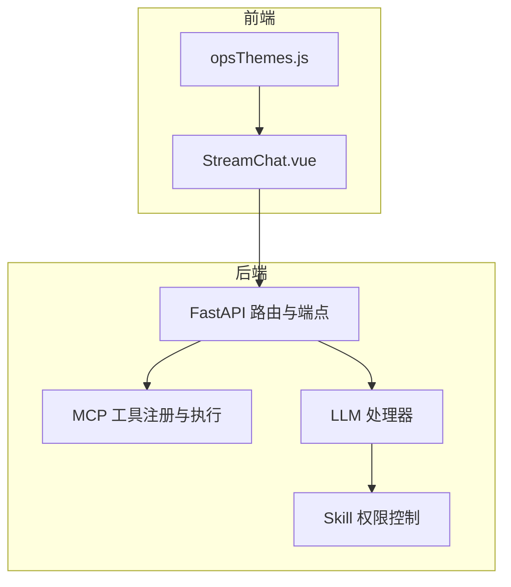
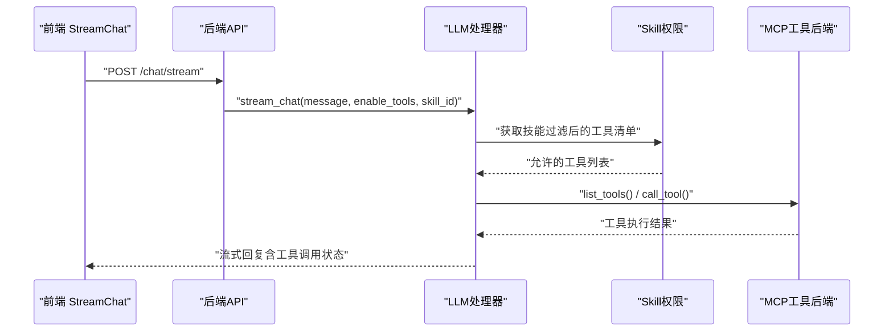
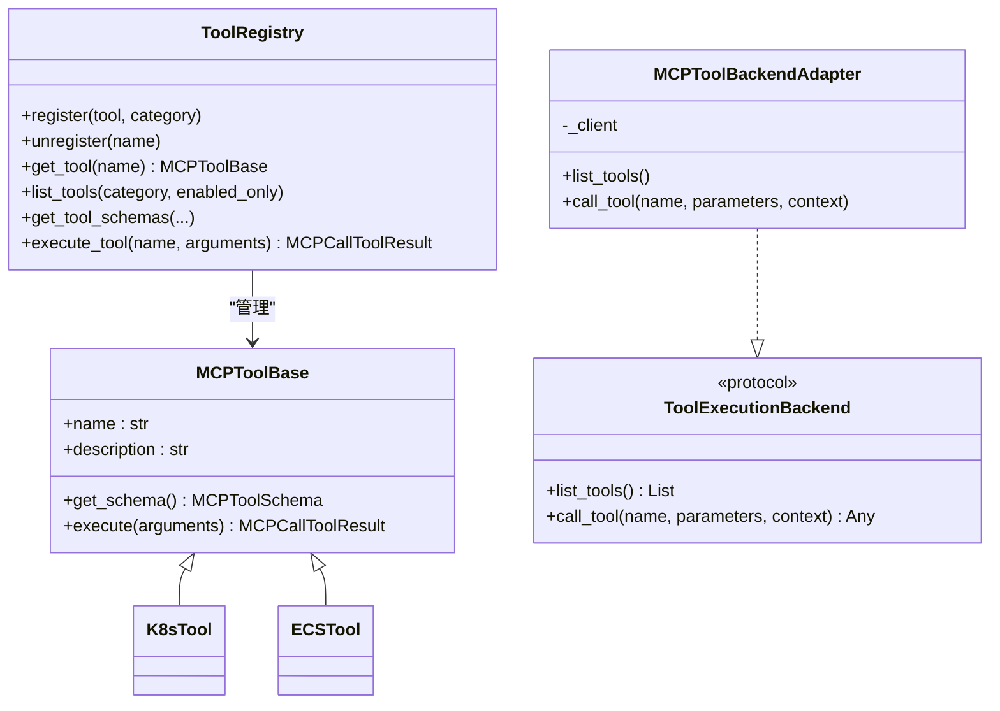
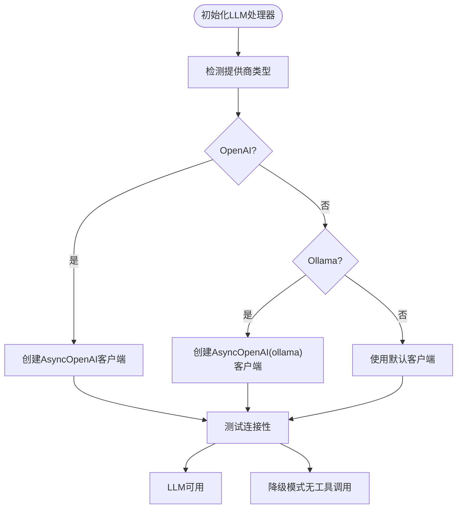
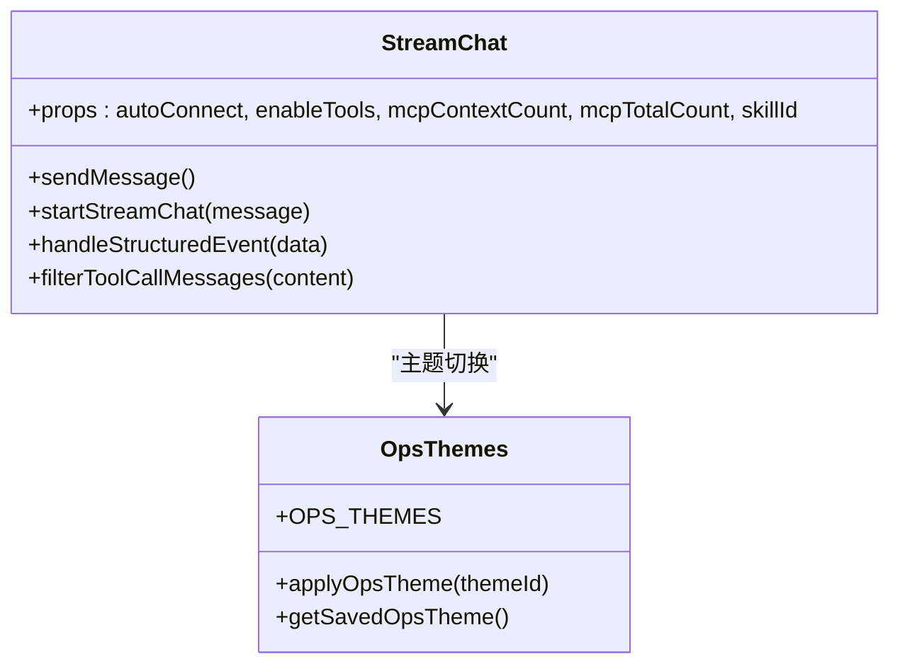
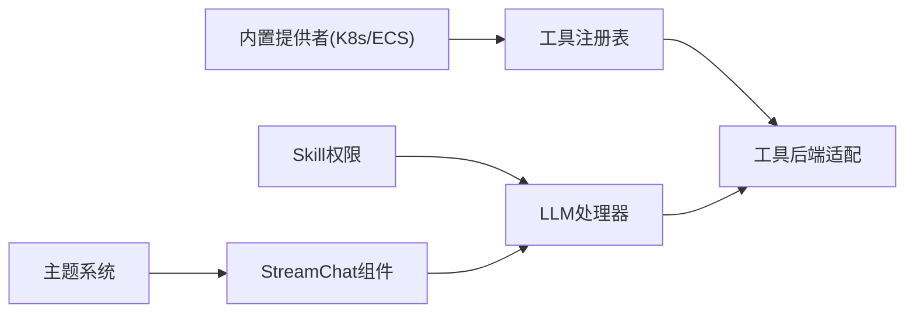

# 插件开发指南

<cite>
**本文引用的文件**
- [backend/src/tools/registry.py](file://backend/src/tools/registry.py)
- [backend/src/skills/registry.py](file://backend/src/skills/registry.py)
- [backend/src/mcp/builtin/providers.py](file://backend/src/mcp/builtin/providers.py)
- [backend/src/k8s_mcp/core/tool_registry.py](file://backend/src/k8s_mcp/core/tool_registry.py)
- [backend/src/ecs_mcp/core/tool_registry.py](file://backend/src/ecs_mcp/core/tool_registry.py)
- [backend/src/mcp/types.py](file://backend/src/mcp/types.py)
- [backend/src/llm/processor.py](file://backend/src/llm/processor.py)
- [backend/src/llm/crew_orchestrator.py](file://backend/src/llm/crew_orchestrator.py)
- [config/skills.example.json](file://config/skills.example.json)
- [frontend-v2/src/components/StreamChat.vue](file://frontend-v2/src/components/StreamChat.vue)
- [frontend-v2/src/theme/opsThemes.js](file://frontend-v2/src/theme/opsThemes.js)
- [frontend-v2/package.json](file://frontend-v2/package.json)
- [scripts/build.py](file://scripts/build.py)
</cite>

## 目录
1. [简介](#简介)
2. [项目结构](#项目结构)
3. [核心组件](#核心组件)
4. [架构总览](#架构总览)
5. [详细组件分析](#详细组件分析)
6. [依赖分析](#依赖分析)
7. [性能考量](#性能考量)
8. [故障排查指南](#故障排查指南)
9. [结论](#结论)
10. [附录](#附录)

## 简介
本指南面向希望为“钉钉K8s运维机器人”开发插件（工具与LLM适配）的开发者，涵盖以下主题：
- 自定义工具的开发流程：工具接口定义、参数schema设计、工具注册机制
- LLM提供商集成：OpenAI、本地Ollama等不同提供商的适配方法
- 前端组件扩展：Vue.js组件开发、UI组件集成、主题定制
- 工具开发最佳实践：错误处理、性能优化、安全性考虑
- 插件的打包、发布与版本管理流程
- 完整开发示例与调试技巧

## 项目结构
该项目采用前后端分离架构：
- 后端（Python/FastAPI）：提供API、MCP工具注册与执行、LLM处理、安全与审计等能力
- 前端（Vue 3 + Element Plus）：提供聊天界面、工具调用展示、主题切换等
- 构建脚本：将前端产物编译并集成到后端静态资源目录，便于统一部署

**图表来源**
- [frontend-v2/src/components/StreamChat.vue:1-800](file://frontend-v2/src/components/StreamChat.vue#L1-L800)
- [backend/src/llm/processor.py:520-757](file://backend/src/llm/processor.py#L520-L757)
- [backend/src/skills/registry.py:27-116](file://backend/src/skills/registry.py#L27-L116)

**章节来源**
- [frontend-v2/package.json:1-41](file://frontend-v2/package.json#L1-L41)
- [scripts/build.py:71-181](file://scripts/build.py#L71-L181)

## 核心组件
- 工具执行后端抽象与适配：统一工具执行接口，支持MCP客户端适配
- 工具注册表：K8s/ECS工具注册、发现、执行、统计与分类
- 内置工具提供者：进程内K8s/ECS工具提供者，负责工具枚举与执行
- Skill权限控制：基于配置的工具访问白名单与前缀过滤
- LLM处理器：OpenAI/Ollama等多提供商适配，两阶段流式对话与工具调用
- 前端组件：StreamChat聊天组件、主题管理与UI集成

**章节来源**
- [backend/src/tools/registry.py:12-54](file://backend/src/tools/registry.py#L12-L54)
- [backend/src/k8s_mcp/core/tool_registry.py:15-401](file://backend/src/k8s_mcp/core/tool_registry.py#L15-L401)
- [backend/src/ecs_mcp/core/tool_registry.py:15-140](file://backend/src/ecs_mcp/core/tool_registry.py#L15-L140)
- [backend/src/mcp/builtin/providers.py:53-171](file://backend/src/mcp/builtin/providers.py#L53-L171)
- [backend/src/skills/registry.py:18-116](file://backend/src/skills/registry.py#L18-L116)
- [backend/src/llm/processor.py:30-800](file://backend/src/llm/processor.py#L30-L800)
- [frontend-v2/src/components/StreamChat.vue:1-800](file://frontend-v2/src/components/StreamChat.vue#L1-L800)

## 架构总览
整体交互流程：前端发起聊天请求，后端通过LLM处理器进行两阶段处理（工具决策与工具执行、LLM回复生成），期间通过Skill权限控制暴露的工具集合，并通过MCP工具后端执行。

**图表来源**
- [backend/src/llm/processor.py:536-757](file://backend/src/llm/processor.py#L536-L757)
- [backend/src/skills/registry.py:90-106](file://backend/src/skills/registry.py#L90-L106)
- [backend/src/tools/registry.py:32-45](file://backend/src/tools/registry.py#L32-L45)

## 详细组件分析

### 工具接口与注册机制
- 工具基类与注册表
  - K8s工具注册表提供工具基类、注册、发现、执行、统计与分类能力
  - ECS工具注册表提供只读查询工具的注册与执行能力
- 工具后端适配
  - ToolExecutionBackend协议与MCPToolBackendAdapter将MCP客户端适配为统一工具后端
- 内置工具提供者
  - K8s/ECS内置提供者负责注册工具、导出MCPTool定义、执行工具并转换结果

**图表来源**
- [backend/src/k8s_mcp/core/tool_registry.py:15-401](file://backend/src/k8s_mcp/core/tool_registry.py#L15-L401)
- [backend/src/ecs_mcp/core/tool_registry.py:15-140](file://backend/src/ecs_mcp/core/tool_registry.py#L15-L140)
- [backend/src/tools/registry.py:12-54](file://backend/src/tools/registry.py#L12-L54)

**章节来源**
- [backend/src/k8s_mcp/core/tool_registry.py:75-401](file://backend/src/k8s_mcp/core/tool_registry.py#L75-L401)
- [backend/src/ecs_mcp/core/tool_registry.py:60-140](file://backend/src/ecs_mcp/core/tool_registry.py#L60-L140)
- [backend/src/tools/registry.py:26-54](file://backend/src/tools/registry.py#L26-L54)

### LLM提供商集成（OpenAI、本地模型等）
- LLM类型定义
  - LLMProviderConfig与LLMConfig支持多提供商配置（OpenAI、Azure、Anthropic、Qwen、DeepSeek、Moonshot、Ollama、Custom）
- 简化LLM处理器
  - 直接基于环境变量配置，支持OpenAI与Ollama；具备结果提炼、上下文优化、流式输出等能力
- CrewAI编排（可选）
  - 通过环境变量启用，提供多智能体编排与MCP桥接工具

**图表来源**
- [backend/src/llm/processor.py:59-120](file://backend/src/llm/processor.py#L59-L120)
- [backend/src/mcp/types.py:105-156](file://backend/src/mcp/types.py#L105-L156)

**章节来源**
- [backend/src/mcp/types.py:105-156](file://backend/src/mcp/types.py#L105-L156)
- [backend/src/llm/processor.py:59-120](file://backend/src/llm/processor.py#L59-L120)
- [backend/src/llm/crew_orchestrator.py:31-124](file://backend/src/llm/crew_orchestrator.py#L31-L124)

### 前端组件扩展（Vue.js）
- StreamChat组件
  - 负责渲染消息、工具调用状态、流式输出、错误处理与Markdown渲染
  - 支持工具调用的折叠/展开、参数与结果展示
- 主题定制
  - opsThemes提供主题枚举、持久化存储与动态应用

**图表来源**
- [frontend-v2/src/components/StreamChat.vue:244-800](file://frontend-v2/src/components/StreamChat.vue#L244-L800)
- [frontend-v2/src/theme/opsThemes.js:1-33](file://frontend-v2/src/theme/opsThemes.js#L1-L33)

**章节来源**
- [frontend-v2/src/components/StreamChat.vue:1-800](file://frontend-v2/src/components/StreamChat.vue#L1-L800)
- [frontend-v2/src/theme/opsThemes.js:1-33](file://frontend-v2/src/theme/opsThemes.js#L1-L33)

### 工具开发最佳实践
- 接口与Schema
  - 工具需实现get_schema返回MCPToolSchema，input_schema定义参数约束
  - 使用register装饰器或直接注册到ToolRegistry
- 错误处理
  - 工具执行异常应返回MCPCallToolResult.error或抛出MCPException
  - 后端统一捕获并转换为标准错误格式
- 性能优化
  - 控制工具结果大小，必要时进行关键信息提炼
  - 合理设置超时与并发，避免阻塞
- 安全性
  - 使用Skill权限控制工具暴露范围
  - 前端展示时注意过滤工具调用细节，避免泄露内部实现

**章节来源**
- [backend/src/k8s_mcp/core/tool_registry.py:235-268](file://backend/src/k8s_mcp/core/tool_registry.py#L235-L268)
- [backend/src/mcp/types.py:178-186](file://backend/src/mcp/types.py#L178-L186)
- [backend/src/skills/registry.py:90-106](file://backend/src/skills/registry.py#L90-L106)
- [backend/src/llm/processor.py:383-408](file://backend/src/llm/processor.py#L383-L408)

### 插件打包、发布与版本管理
- 构建流程
  - 安装前端依赖 → 前端构建 → 清理旧静态资源 → 生成SPA静态文件 → 创建根index.html重定向
- 发布建议
  - 将前端dist产物集成至后端static/spa目录，统一由后端提供静态资源
  - 版本管理：前端package.json版本号与后端版本号保持一致，便于追踪
- 部署
  - 通过scripts/build.py完成一键构建与集成，随后启动后端服务

**章节来源**
- [scripts/build.py:24-181](file://scripts/build.py#L24-L181)
- [frontend-v2/package.json:1-41](file://frontend-v2/package.json#L1-L41)

## 依赖分析
- 工具侧
  - ToolExecutionBackend协议与MCPToolBackendAdapter解耦MCP客户端与工具执行
  - 内置提供者聚合K8s/ECS工具，统一导出MCPTool定义
- LLM侧
  - LLMConfig/LLMProviderConfig集中管理多提供商配置
  - EnhancedLLMProcessor负责两阶段流式处理与上下文优化
- 前端侧
  - StreamChat组件与主题系统解耦UI与业务逻辑

**图表来源**
- [backend/src/mcp/builtin/providers.py:157-171](file://backend/src/mcp/builtin/providers.py#L157-L171)
- [backend/src/tools/registry.py:26-54](file://backend/src/tools/registry.py#L26-L54)
- [backend/src/llm/processor.py:536-757](file://backend/src/llm/processor.py#L536-L757)
- [frontend-v2/src/components/StreamChat.vue:1-800](file://frontend-v2/src/components/StreamChat.vue#L1-L800)

**章节来源**
- [backend/src/mcp/builtin/providers.py:157-171](file://backend/src/mcp/builtin/providers.py#L157-L171)
- [backend/src/skills/registry.py:27-116](file://backend/src/skills/registry.py#L27-L116)
- [backend/src/llm/processor.py:536-757](file://backend/src/llm/processor.py#L536-L757)

## 性能考量
- 上下文优化：估算token并裁剪历史消息，保留关键对话循环
- 结果提炼：对过大工具结果进行关键信息抽取，减少LLM输入
- 并发与超时：合理设置工具超时与最大并发，避免阻塞
- 缓存与重试：MCP客户端配置支持缓存与重试，提升稳定性

**章节来源**
- [backend/src/llm/processor.py:459-518](file://backend/src/llm/processor.py#L459-L518)
- [backend/src/llm/processor.py:383-408](file://backend/src/llm/processor.py#L383-L408)
- [backend/src/mcp/types.py:56-64](file://backend/src/mcp/types.py#L56-L64)

## 故障排查指南
- LLM客户端初始化失败
  - 检查API密钥、代理设置与网络连通性
  - 查看详细错误日志与堆栈信息
- 工具执行异常
  - 检查工具Schema与参数校验
  - 关注MCPCallToolResult.error与MCPException
- 前端连接问题
  - 检查StreamChat的SSE连接与事件解析
  - 确认后端API可达与CORS配置

**章节来源**
- [backend/src/llm/processor.py:103-120](file://backend/src/llm/processor.py#L103-L120)
- [backend/src/k8s_mcp/core/tool_registry.py:265-268](file://backend/src/k8s_mcp/core/tool_registry.py#L265-L268)
- [backend/src/mcp/types.py:178-186](file://backend/src/mcp/types.py#L178-L186)
- [frontend-v2/src/components/StreamChat.vue:473-533](file://frontend-v2/src/components/StreamChat.vue#L473-L533)

## 结论
通过统一的工具接口、灵活的Skill权限控制与强大的LLM处理能力，本项目为插件开发提供了清晰的扩展路径。遵循本文档的接口规范、Schema设计与最佳实践，即可快速实现自定义工具与LLM提供商适配，并在前端进行友好集成与主题定制。

## 附录
- 配置参考
  - skills.json示例：定义技能ID、显示名、描述与允许的工具前缀
- 开发示例
  - 自定义工具：实现get_schema与execute，使用register装饰器注册
  - LLM提供商：在LLMConfig中新增提供商条目，或使用简化处理器直接配置
- 调试技巧
  - 启用详细日志，关注工具执行耗时与结果大小
  - 前端使用StreamChat的工具调用状态卡片定位问题

**章节来源**
- [config/skills.example.json:1-53](file://config/skills.example.json#L1-L53)
- [backend/src/k8s_mcp/core/tool_registry.py:348-365](file://backend/src/k8s_mcp/core/tool_registry.py#L348-L365)
- [backend/src/llm/processor.py:59-120](file://backend/src/llm/processor.py#L59-L120)
- [frontend-v2/src/components/StreamChat.vue:698-764](file://frontend-v2/src/components/StreamChat.vue#L698-L764)