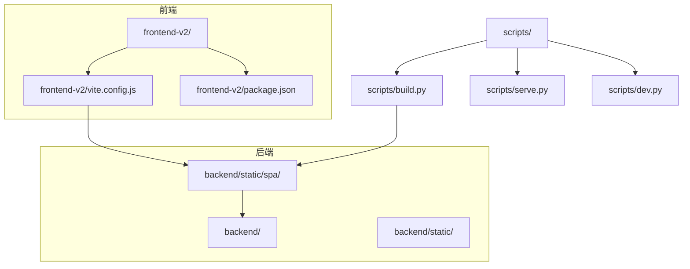
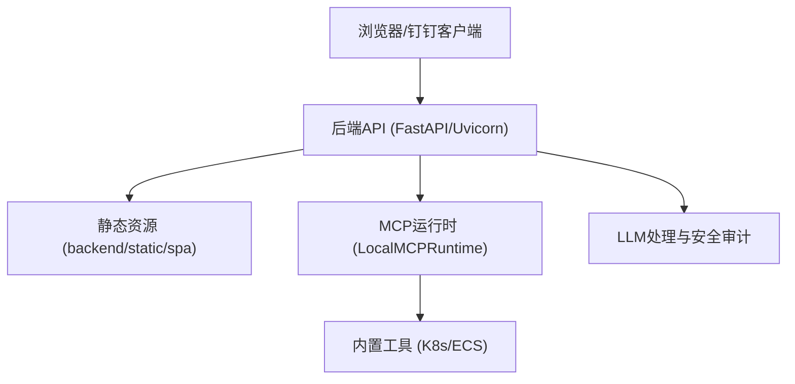
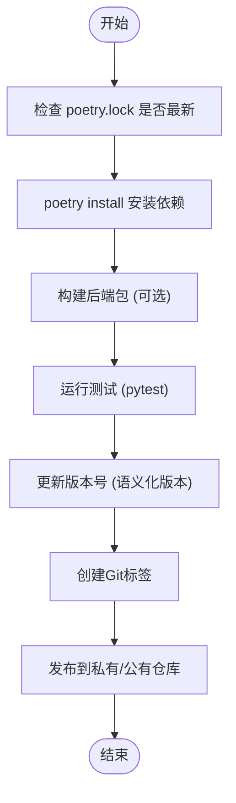
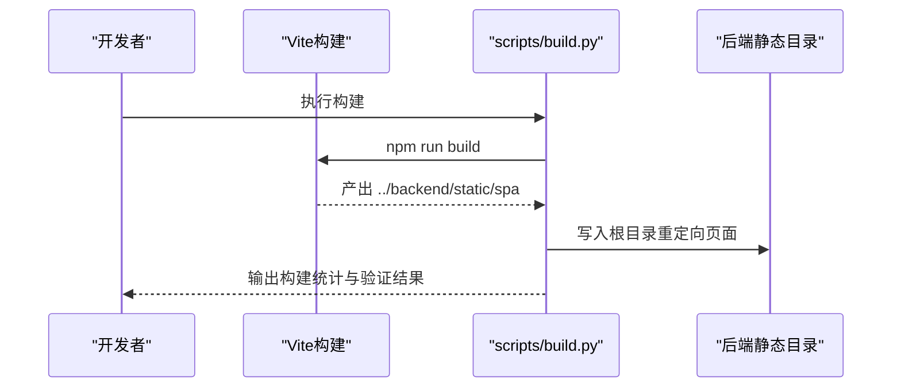
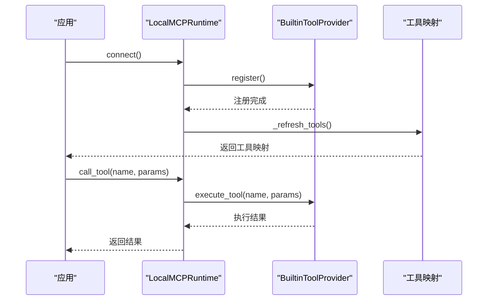
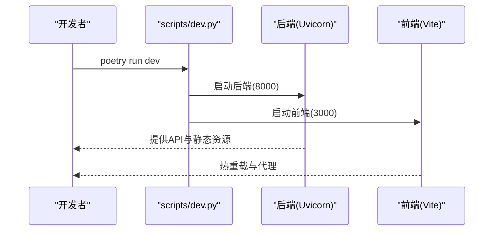
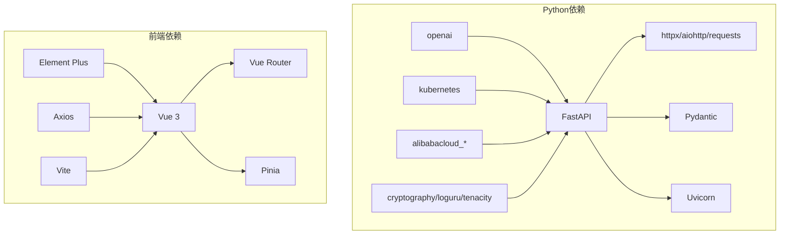

# 插件打包与发布

<cite>
**本文引用的文件**
- [pyproject.toml](file://pyproject.toml)
- [poetry.toml](file://poetry.toml)
- [poetry.lock](file://poetry.lock)
- [package.json](file://frontend-v2/package.json)
- [vite.config.js](file://frontend-v2/vite.config.js)
- [build.py](file://scripts/build.py)
- [dev.py](file://scripts/dev.py)
- [serve.py](file://scripts/serve.py)
- [builtin_k8s_ecs.py](file://backend/src/mcp/builtin_k8s_ecs.py)
- [runtime.py](file://backend/src/mcp/runtime.py)
- [types.py](file://backend/src/mcp/types.py)
- [README.md](file://README.md)
- [frontend-v2/README.md](file://frontend-v2/README.md)
</cite>

## 目录
1. [简介](#简介)
2. [项目结构](#项目结构)
3. [核心组件](#核心组件)
4. [架构概览](#架构概览)
5. [详细组件分析](#详细组件分析)
6. [依赖关系分析](#依赖关系分析)
7. [性能考虑](#性能考虑)
8. [故障排查指南](#故障排查指南)
9. [结论](#结论)
10. [附录](#附录)

## 简介
本指南面向“钉钉K8s运维机器人”的插件打包与发布流程，覆盖Python后端插件与前端插件两类插件的打包、版本管理、发布与分发策略。项目采用Poetry管理Python依赖，Vite构建前端资源，通过统一的构建脚本将前端产物集成到后端静态目录，形成单端口运行的完整服务。

## 项目结构
- 后端（Python）：位于 backend/，包含 FastAPI 应用、MCP 内置工具、LLM 安全与审计等模块。
- 前端（Vue 3 + Vite）：位于 frontend-v2/，构建产物输出到后端 backend/static/spa/。
- 构建与发布：scripts/ 目录下的脚本负责前端构建、后端服务启动与环境校验。

图表来源
- [vite.config.js:30-47](file://frontend-v2/vite.config.js#L30-L47)
- [build.py:71-179](file://scripts/build.py#L71-L179)
- [serve.py:63-119](file://scripts/serve.py#L63-L119)
- [dev.py:92-155](file://scripts/dev.py#L92-L155)

章节来源
- [README.md:64-76](file://README.md#L64-L76)
- [frontend-v2/README.md:26-54](file://frontend-v2/README.md#L26-L54)

## 核心组件
- Python后端插件体系
  - MCP 内置工具注册与执行：通过 LocalMCPRuntime 将 K8s/ECS 工具注册为本地可执行工具，支持查询、冲突检测与异步调用。
  - 插件开关与跳过规则：通过环境变量控制内置工具启用状态与远程服务器跳过集合。
- 前端插件体系
  - 基于 Vue 3 + Vite 的单页应用，构建产物输出到 backend/static/spa/，由后端统一提供静态资源。
  - 代码分割与第三方库分包：通过 manualChunks 将 Vue 生态与 Element Plus 分离，提升缓存命中率。
- 构建与发布
  - 前端构建脚本：自动安装依赖、构建并输出到后端静态目录，同时生成根目录重定向页面。
  - 生产服务脚本：校验构建产物存在性，启动 Uvicorn 服务。

章节来源
- [builtin_k8s_ecs.py:25-92](file://backend/src/mcp/builtin_k8s_ecs.py#L25-L92)
- [runtime.py:31-119](file://backend/src/mcp/runtime.py#L31-L119)
- [types.py:11-186](file://backend/src/mcp/types.py#L11-L186)
- [vite.config.js:30-47](file://frontend-v2/vite.config.js#L30-L47)
- [build.py:24-179](file://scripts/build.py#L24-L179)
- [serve.py:12-119](file://scripts/serve.py#L12-L119)

## 架构概览
后端作为统一入口，提供 API 与静态资源服务；前端通过 Vite 构建并集成到后端静态目录，形成单端口部署方案。MCP 内置工具在后端进程中注册，支持与 LLM 对话协作。

图表来源
- [serve.py:85-109](file://scripts/serve.py#L85-L109)
- [runtime.py:46-98](file://backend/src/mcp/runtime.py#L46-L98)
- [builtin_k8s_ecs.py:49-92](file://backend/src/mcp/builtin_k8s_ecs.py#L49-L92)

## 详细组件分析

### Python后端插件打包与版本管理
- 依赖与版本锁定
  - 使用 Poetry 管理依赖与锁定版本，确保构建一致性。
  - 安装器行为可通过 poetry.toml 控制并行度，缓解弱网下载问题。
- 版本号与发布
  - 版本号在 pyproject.toml 的 [tool.poetry] 段落中定义，遵循语义化版本控制。
  - 发布前建议更新版本号与变更日志，保持向后兼容性。
- 依赖管理最佳实践
  - 使用 poetry.lock 固定依赖树，避免上游版本波动影响构建。
  - 在 dev 分组中维护开发工具链，隔离生产依赖。

图表来源
- [pyproject.toml:1-116](file://pyproject.toml#L1-L116)
- [poetry.toml:1-7](file://poetry.toml#L1-L7)
- [poetry.lock:1-120](file://poetry.lock#L1-L120)

章节来源
- [pyproject.toml:1-116](file://pyproject.toml#L1-L116)
- [poetry.toml:1-7](file://poetry.toml#L1-L7)
- [poetry.lock:1-120](file://poetry.lock#L1-L120)

### 前端插件构建与打包
- 构建配置
  - 输出目录：../backend/static/spa，与后端静态资源目录对齐。
  - 代码分割：manualChunks 将 vue、vue-router、pinia 与 element-plus 分离，减少首屏体积。
  - 基础路径：base 设置为 /spa/，确保生产环境路由正确。
- 开发与代理
  - 开发服务器端口 3000，代理 /api 与 /dingtalk 到后端 8000 端口。
- 构建脚本
  - scripts/build.py 自动安装前端依赖、执行构建、生成根目录重定向页面，并统计构建产物。

图表来源
- [vite.config.js:30-47](file://frontend-v2/vite.config.js#L30-L47)
- [build.py:24-179](file://scripts/build.py#L24-L179)

章节来源
- [vite.config.js:1-55](file://frontend-v2/vite.config.js#L1-L55)
- [package.json:1-41](file://frontend-v2/package.json#L1-L41)
- [build.py:24-179](file://scripts/build.py#L24-L179)
- [frontend-v2/README.md:73-78](file://frontend-v2/README.md#L73-L78)

### MCP插件注册与执行流程
- 注册流程
  - 通过环境变量控制内置工具启用状态，连接本地运行时，注册 Provider 并刷新工具映射。
- 执行流程
  - 根据工具名查找 Provider，异步执行工具并返回结果；若工具不存在则抛出 MCP 异常。

图表来源
- [builtin_k8s_ecs.py:49-92](file://backend/src/mcp/builtin_k8s_ecs.py#L49-L92)
- [runtime.py:46-98](file://backend/src/mcp/runtime.py#L46-L98)
- [types.py:178-186](file://backend/src/mcp/types.py#L178-L186)

章节来源
- [builtin_k8s_ecs.py:25-92](file://backend/src/mcp/builtin_k8s_ecs.py#L25-L92)
- [runtime.py:31-119](file://backend/src/mcp/runtime.py#L31-L119)
- [types.py:11-186](file://backend/src/mcp/types.py#L11-L186)

### 开发与生产环境启动
- 开发环境
  - scripts/dev.py 并行启动后端（Uvicorn）与前端（Vite），支持热重载与实时日志输出。
- 生产环境
  - scripts/serve.py 校验构建产物，设置生产环境变量并启动 Uvicorn 服务。

图表来源
- [dev.py:92-155](file://scripts/dev.py#L92-L155)
- [serve.py:63-119](file://scripts/serve.py#L63-L119)

章节来源
- [dev.py:92-155](file://scripts/dev.py#L92-L155)
- [serve.py:12-119](file://scripts/serve.py#L12-L119)

## 依赖关系分析
- Python 依赖
  - 核心框架：FastAPI、Uvicorn、Pydantic
  - HTTP 客户端：httpx、aiohttp、requests
  - MCP 与 AI：openai、crewai（条件安装）
  - Kubernetes 与 ECS：kubernetes、networkx、alibabacloud_* 系列
  - 安全与工具：cryptography、loguru、tenacity、psutil、watchdog
- 前端依赖
  - Vue 3、Vue Router、Pinia、Element Plus、Axios
  - Vite 与 Vue 插件

图表来源
- [pyproject.toml:9-51](file://pyproject.toml#L9-L51)
- [package.json:24-39](file://frontend-v2/package.json#L24-L39)

章节来源
- [pyproject.toml:9-51](file://pyproject.toml#L9-L51)
- [package.json:24-39](file://frontend-v2/package.json#L24-L39)

## 性能考虑
- 前端构建优化
  - 代码分割：将 Vue 生态与 Element Plus 分离，提升缓存命中率与加载性能。
  - 基础路径：/spa/ 与手动分包配合，减少重复下载。
  - Source Map：生产环境关闭，降低体积与解析开销。
- 后端性能
  - Uvicorn 单进程模式用于开发，生产环境可按需调整 workers 数量。
  - 依赖锁定与固定版本，避免运行时性能波动。

章节来源
- [vite.config.js:35-47](file://frontend-v2/vite.config.js#L35-L47)
- [serve.py:85-109](file://scripts/serve.py#L85-L109)
- [poetry.lock:1-120](file://poetry.lock#L1-L120)

## 故障排查指南
- 构建失败
  - 前端依赖缺失：scripts/build.py 会在构建前自动安装 node_modules。
  - 构建产物缺失：scripts/serve.py 会检查 backend/static/spa 与根 index.html 是否存在。
- 开发环境问题
  - Python 版本不兼容：scripts/dev.py 会校验 3.11-3.13 范围。
  - 端口占用：确认 8000（后端）与 3000（前端）未被占用。
- MCP 插件问题
  - 工具未注册：检查环境变量 BUILTIN_K8S_ECS_TOOLS 与 MCP_SKIP_REMOTE_SERVER_NAMES。
  - 工具冲突：LocalMCPRuntime 会记录同名工具冲突并警告。

章节来源
- [build.py:24-179](file://scripts/build.py#L24-L179)
- [serve.py:12-37](file://scripts/serve.py#L12-L37)
- [dev.py:28-50](file://scripts/dev.py#L28-L50)
- [builtin_k8s_ecs.py:25-46](file://backend/src/mcp/builtin_k8s_ecs.py#L25-L46)
- [runtime.py:78-86](file://backend/src/mcp/runtime.py#L78-L86)

## 结论
本指南提供了从 Python 后端插件到前端插件的完整打包与发布流程，结合 Poetry 依赖管理、Vite 构建与统一的构建脚本，实现了前后端一体化交付。通过语义化版本控制、依赖锁定与生产环境校验，确保发布质量与可回滚性。

## 附录

### 版本管理策略
- 语义化版本控制
  - 主版本：破坏性变更
  - 次版本：新增功能且向后兼容
  - 修订版本：修复问题且向后兼容
- 变更日志维护
  - 建议在每次发布前更新 CHANGELOG 或对应文档，记录变更摘要与兼容性说明。
- 向后兼容性
  - Python 依赖范围限定在 3.11-3.13，避免新版本 Python 带来的兼容风险。
  - 前端基础路径 /spa/ 与代码分割策略确保升级时的稳定性。

章节来源
- [pyproject.toml:10-11](file://pyproject.toml#L10-L11)
- [vite.config.js:48-49](file://frontend-v2/vite.config.js#L48-L49)

### 发布流程（测试-构建-上传-部署）
- 测试验证
  - 运行 pytest（dev 分组）与前端单元/集成测试。
- 打包构建
  - Python：poetry build（可选）或直接打包 dist。
  - 前端：npm run build，产物写入 backend/static/spa。
- 上传发布
  - 私有仓库：PyPI 私有索引或企业 Nexus/Artifactory。
  - 公有仓库：PyPI（谨慎处理敏感信息）。
- 安装部署
  - 生产环境：poetry run serve 启动服务，访问 http://localhost:8000。
  - 回滚：保留上一版本静态目录，必要时替换 backend/static/spa。

章节来源
- [pyproject.toml:53-78](file://pyproject.toml#L53-L78)
- [build.py:106-179](file://scripts/build.py#L106-L179)
- [serve.py:63-119](file://scripts/serve.py#L63-L119)
- [frontend-v2/README.md:259-265](file://frontend-v2/README.md#L259-L265)

### 分发方式
- 私有仓库：企业内部 PyPI/Nexus/Artifactory，前端静态资源随后端包分发。
- 公有仓库：PyPI（仅公开非敏感信息），前端静态资源随后端包分发。
- 离线安装：打包后端与前端产物，通过离线介质部署。

章节来源
- [README.md:15-55](file://README.md#L15-L55)
- [frontend-v2/README.md:246-265](file://frontend-v2/README.md#L246-L265)

### 安全检查、完整性验证与回滚
- 安全检查
  - 依赖审计：定期更新 cryptography、cryptography 等安全相关依赖。
  - 代码扫描：使用 bandit/flake8/mypy/black 等工具进行静态检查。
- 完整性验证
  - 使用 poetry.lock 固定依赖树，避免上游依赖变更导致的不一致。
  - 前端构建产物校验：scripts/build.py 会验证关键文件存在性。
- 回滚机制
  - 前端：保留 backend/static/spa.old，必要时回滚。
  - 后端：版本化发布，回滚到上一版本包。

章节来源
- [poetry.lock:1-120](file://poetry.lock#L1-L120)
- [build.py:161-173](file://scripts/build.py#L161-L173)
- [frontend-v2/README.md:259-265](file://frontend-v2/README.md#L259-L265)