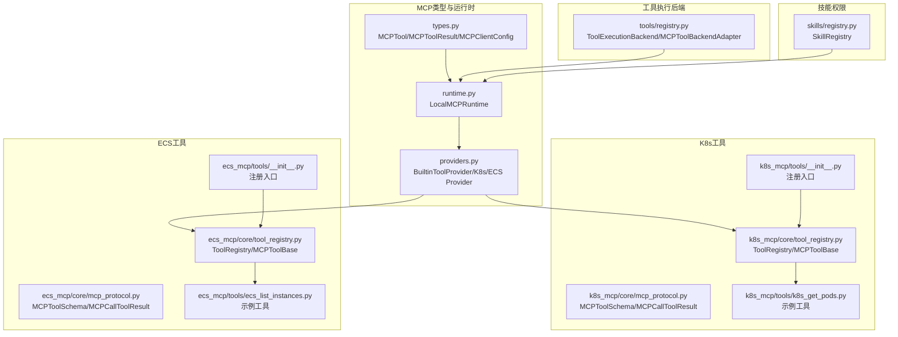
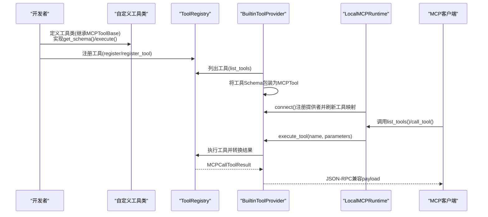
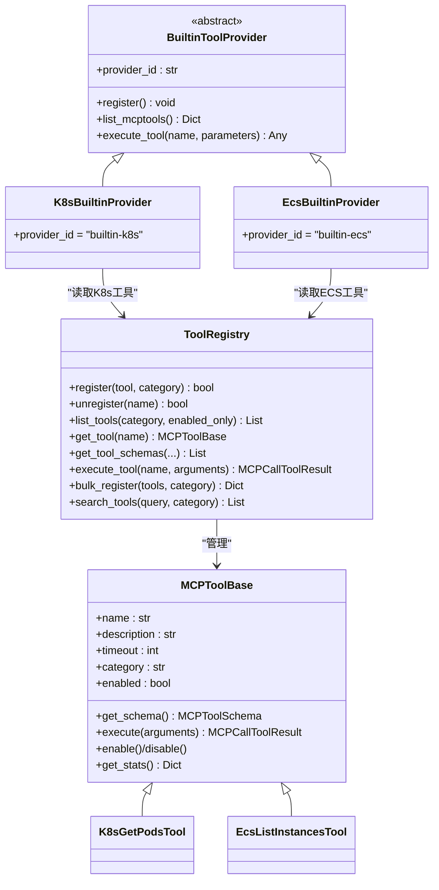
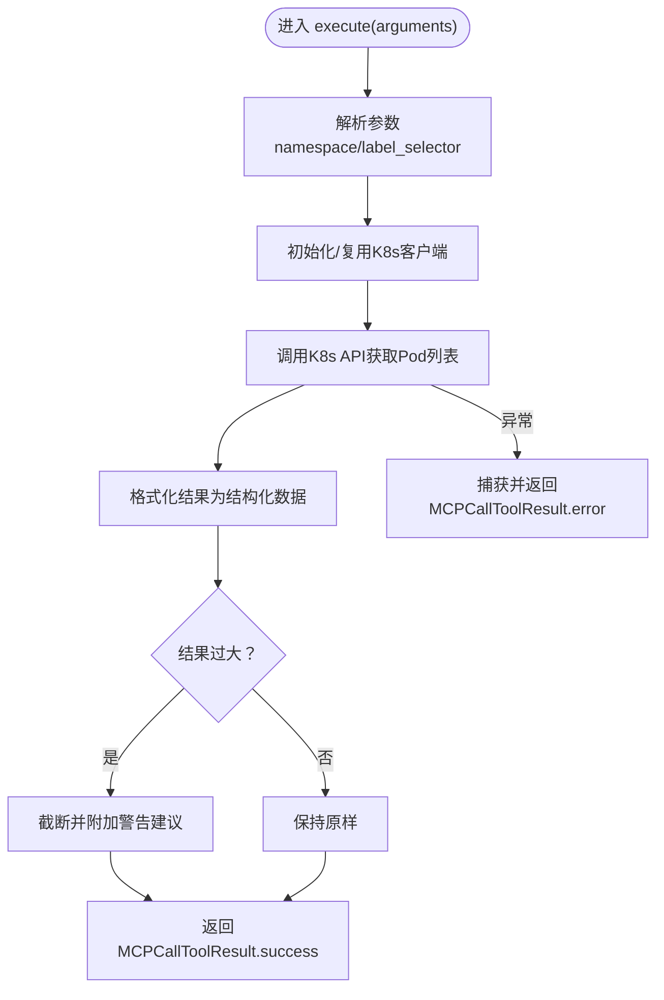
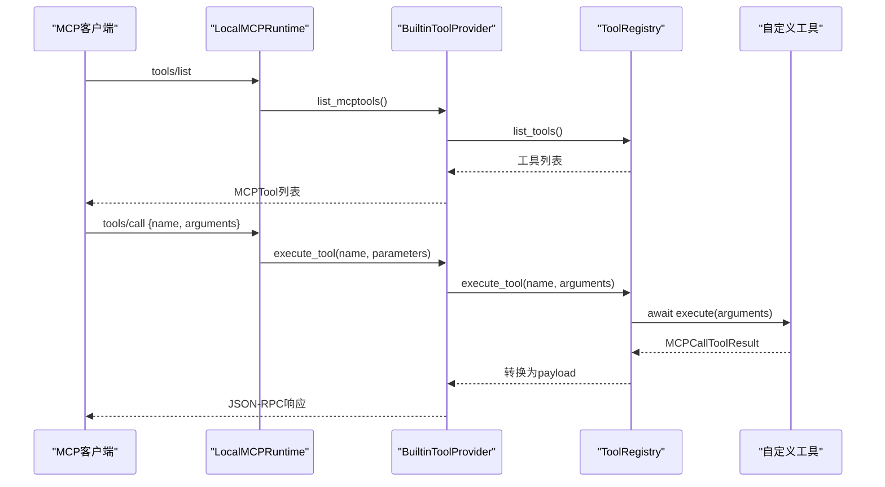
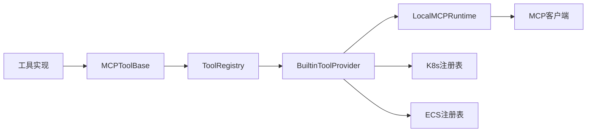

# 自定义工具开发

<cite>
**本文引用的文件**
- [types.py](file://backend/src/mcp/types.py)
- [runtime.py](file://backend/src/mcp/runtime.py)
- [providers.py](file://backend/src/mcp/builtin/providers.py)
- [registry.py](file://backend/src/tools/registry.py)
- [registry.py](file://backend/src/skills/registry.py)
- [tool_registry.py](file://backend/src/k8s_mcp/core/tool_registry.py)
- [mcp_protocol.py](file://backend/src/k8s_mcp/core/mcp_protocol.py)
- [k8s_get_pods.py](file://backend/src/k8s_mcp/tools/k8s_get_pods.py)
- [__init__.py](file://backend/src/k8s_mcp/tools/__init__.py)
- [tool_registry.py](file://backend/src/ecs_mcp/core/tool_registry.py)
- [mcp_protocol.py](file://backend/src/ecs_mcp/core/mcp_protocol.py)
- [ecs_list_instances.py](file://backend/src/ecs_mcp/tools/ecs_list_instances.py)
- [__init__.py](file://backend/src/ecs_mcp/tools/__init__.py)
- [mcp_config.example.json](file://config/mcp_config.example.json)
- [skills.example.json](file://config/skills.example.json)
</cite>

## 目录
1. [简介](#简介)
2. [项目结构](#项目结构)
3. [核心组件](#核心组件)
4. [架构总览](#架构总览)
5. [详细组件分析](#详细组件分析)
6. [依赖分析](#依赖分析)
7. [性能考虑](#性能考虑)
8. [故障排查指南](#故障排查指南)
9. [结论](#结论)
10. [附录](#附录)

## 简介
本指南面向希望为钉钉K8s运维机器人扩展自定义工具的开发者，系统讲解如何基于MCP（Model Context Protocol）工具接口定义规范，设计工具参数schema，实现工具注册与动态发现，并给出Kubernetes资源查询工具与ECS实例管理工具的完整开发示例。同时涵盖测试方法、调试技巧、性能优化策略以及版本管理、错误处理与超时控制的最佳实践。

## 项目结构
本项目采用“后端主工程 + MCP内置工具提供者 + K8s/ECS工具实现”的分层组织方式：
- MCP类型与运行时：定义MCP工具、调用、结果、客户端配置、统计等类型，以及本地运行时与工具提供者抽象。
- 工具执行后端：统一适配MCP客户端，作为工具调用的后端接口。
- 技能权限：通过技能配置限制可调用工具集合。
- K8s/ECS工具：各自提供工具基类、注册表、协议与具体工具实现。
- 配置：MCP全局配置与技能配置示例。

图表来源
- [types.py:19-53](file://backend/src/mcp/types.py#L19-L53)
- [runtime.py:31-98](file://backend/src/mcp/runtime.py#L31-L98)
- [providers.py:53-158](file://backend/src/mcp/builtin/providers.py#L53-L158)
- [registry.py:26-53](file://backend/src/tools/registry.py#L26-L53)
- [registry.py:27-106](file://backend/src/skills/registry.py#L27-L106)
- [tool_registry.py:15-48](file://backend/src/k8s_mcp/core/tool_registry.py#L15-L48)
- [mcp_protocol.py:42-49](file://backend/src/k8s_mcp/core/mcp_protocol.py#L42-L49)
- [k8s_get_pods.py:16-51](file://backend/src/k8s_mcp/tools/k8s_get_pods.py#L16-L51)
- [__init__.py:89-116](file://backend/src/k8s_mcp/tools/__init__.py#L89-L116)
- [tool_registry.py:15-57](file://backend/src/ecs_mcp/core/tool_registry.py#L15-L57)
- [mcp_protocol.py:25-30](file://backend/src/ecs_mcp/core/mcp_protocol.py#L25-L30)
- [ecs_list_instances.py:23-45](file://backend/src/ecs_mcp/tools/ecs_list_instances.py#L23-L45)
- [__init__.py:12-46](file://backend/src/ecs_mcp/tools/__init__.py#L12-L46)

章节来源
- [types.py:19-53](file://backend/src/mcp/types.py#L19-L53)
- [runtime.py:31-98](file://backend/src/mcp/runtime.py#L31-L98)
- [providers.py:53-158](file://backend/src/mcp/builtin/providers.py#L53-L158)
- [registry.py:26-53](file://backend/src/tools/registry.py#L26-L53)
- [registry.py:27-106](file://backend/src/skills/registry.py#L27-L106)
- [tool_registry.py:15-48](file://backend/src/k8s_mcp/core/tool_registry.py#L15-L48)
- [mcp_protocol.py:42-49](file://backend/src/k8s_mcp/core/mcp_protocol.py#L42-L49)
- [k8s_get_pods.py:16-51](file://backend/src/k8s_mcp/tools/k8s_get_pods.py#L16-L51)
- [__init__.py:89-116](file://backend/src/k8s_mcp/tools/__init__.py#L89-L116)
- [tool_registry.py:15-57](file://backend/src/ecs_mcp/core/tool_registry.py#L15-L57)
- [mcp_protocol.py:25-30](file://backend/src/ecs_mcp/core/mcp_protocol.py#L25-L30)
- [ecs_list_instances.py:23-45](file://backend/src/ecs_mcp/tools/ecs_list_instances.py#L23-L45)
- [__init__.py:12-46](file://backend/src/ecs_mcp/tools/__init__.py#L12-L46)

## 核心组件
- MCPTool与调用/结果类型：定义工具名称、描述、输入schema、超时、分类、版本、提供者等字段，以及工具调用请求、结果、错误等结构。
- LocalMCPRuntime：负责注册内置工具提供者、刷新工具映射、执行工具调用、快照统计。
- BuiltinToolProvider：抽象工具提供者，K8s/ECS提供者分别将各自工具注册表中的工具暴露为MCPTool。
- 工具执行后端：统一适配MCP客户端，屏蔽远端/本地差异。
- 技能权限：通过skills.json限制可调用工具集合，支持前缀匹配与白名单。
- K8s/ECS工具基类与注册表：提供工具基类、Schema定义、执行逻辑、注册与批量注册、执行计时与统计。

章节来源
- [types.py:19-53](file://backend/src/mcp/types.py#L19-L53)
- [runtime.py:31-98](file://backend/src/mcp/runtime.py#L31-L98)
- [providers.py:53-158](file://backend/src/mcp/builtin/providers.py#L53-L158)
- [registry.py:26-53](file://backend/src/tools/registry.py#L26-L53)
- [registry.py:27-106](file://backend/src/skills/registry.py#L27-L106)
- [tool_registry.py:15-48](file://backend/src/k8s_mcp/core/tool_registry.py#L15-L48)
- [tool_registry.py:15-57](file://backend/src/ecs_mcp/core/tool_registry.py#L15-L57)

## 架构总览
MCP工具开发遵循“工具实现 → 注册表 → 提供者 → 运行时 → 客户端调用”的路径。本地运行时默认启用，工具以进程内方式提供，无需独立MCP服务。

图表来源
- [tool_registry.py:84-108](file://backend/src/k8s_mcp/core/tool_registry.py#L84-L108)
- [providers.py:74-155](file://backend/src/mcp/builtin/providers.py#L74-L155)
- [runtime.py:46-98](file://backend/src/mcp/runtime.py#L46-L98)
- [registry.py:32-45](file://backend/src/tools/registry.py#L32-L45)

## 详细组件分析

### MCPTool类与字段语义
- 字段说明
  - name：工具唯一标识，建议使用“领域-动作”前缀命名，如“k8s-get-pods”、“ecs-list-instances”。
  - description：对工具用途与行为的简要说明。
  - input_schema：JSON Schema风格的参数定义，包含properties、required、类型约束等。
  - timeout：工具级超时（秒），可覆盖全局配置。
  - category：工具分类，便于按类别筛选与展示。
  - version/provider：工具版本与提供者标识，便于追踪与审计。
- 使用方式
  - 在工具类的get_schema()中返回MCPToolSchema，确保前端与客户端能正确渲染与校验参数。
  - 在execute()中读取并验证参数，必要时进行类型转换与边界检查。

章节来源
- [types.py:19-27](file://backend/src/mcp/types.py#L19-L27)
- [mcp_protocol.py:42-49](file://backend/src/k8s_mcp/core/mcp_protocol.py#L42-L49)

### 工具参数schema设计原则
- 结构定义
  - type: "object"，根节点为对象。
  - properties: 明确每个参数的类型、描述、示例与默认值。
  - required: 明确必填参数列表。
- 参数验证规则
  - 基于JSON Schema进行类型约束与必填校验。
  - 在工具execute()中补充业务规则校验（如枚举值、范围、组合条件）。
- 类型约束
  - 支持string/number/boolean/array/object等常见类型。
  - 对复杂结构建议提供示例与最小可运行样例，便于前端与用户理解。

章节来源
- [mcp_protocol.py:243-275](file://backend/src/k8s_mcp/core/mcp_protocol.py#L243-L275)
- [k8s_get_pods.py:35-50](file://backend/src/k8s_mcp/tools/k8s_get_pods.py#L35-L50)
- [ecs_list_instances.py:35-44](file://backend/src/ecs_mcp/tools/ecs_list_instances.py#L35-L44)

### 工具注册机制
- 工具基类与注册表
  - MCPToolBase：定义工具生命周期、启用/禁用、统计信息与抽象方法。
  - ToolRegistry：提供注册、注销、列表、按分类检索、批量注册、搜索、执行与统计。
- 装饰器注册
  - register_tool(category)：装饰器自动实例化工具并注册到全局注册表。
- 工具提供者
  - BuiltinToolProvider：抽象提供者，K8s/ECS提供者分别从各自注册表收集工具，包装为MCPTool并去重覆盖。
- 动态加载
  - 通过工具包的__init__.py集中导入并注册工具，支持延迟导入与失败保护。

图表来源
- [tool_registry.py:15-73](file://backend/src/k8s_mcp/core/tool_registry.py#L15-L73)
- [tool_registry.py:15-57](file://backend/src/ecs_mcp/core/tool_registry.py#L15-L57)
- [providers.py:53-158](file://backend/src/mcp/builtin/providers.py#L53-L158)

章节来源
- [tool_registry.py:75-113](file://backend/src/k8s_mcp/core/tool_registry.py#L75-L113)
- [tool_registry.py:344-364](file://backend/src/k8s_mcp/core/tool_registry.py#L344-L364)
- [tool_registry.py:60-86](file://backend/src/ecs_mcp/core/tool_registry.py#L60-L86)
- [tool_registry.py:132-139](file://backend/src/ecs_mcp/core/tool_registry.py#L132-L139)
- [providers.py:74-158](file://backend/src/mcp/builtin/providers.py#L74-L158)

### 工具开发示例

#### Kubernetes资源查询工具：k8s-get-pods
- 设计要点
  - Schema：定义namespace与label_selector两个可选参数，支持“all”表示全命名空间。
  - 执行：连接K8s客户端，调用Pod查询API，格式化结果并进行结果规模控制与警告提示。
  - 错误处理：区分客户端错误与通用异常，返回MCPCallToolResult.error。
- 关键实现位置
  - Schema定义：[k8s_get_pods.py:30-51](file://backend/src/k8s_mcp/tools/k8s_get_pods.py#L30-L51)
  - 执行逻辑：[k8s_get_pods.py:53-112](file://backend/src/k8s_mcp/tools/k8s_get_pods.py#L53-L112)
  - 注册入口：[__init__.py:89-116](file://backend/src/k8s_mcp/tools/__init__.py#L89-L116)

图表来源
- [k8s_get_pods.py:53-112](file://backend/src/k8s_mcp/tools/k8s_get_pods.py#L53-L112)

章节来源
- [k8s_get_pods.py:16-169](file://backend/src/k8s_mcp/tools/k8s_get_pods.py#L16-L169)
- [__init__.py:89-116](file://backend/src/k8s_mcp/tools/__init__.py#L89-L116)

#### ECS实例管理工具：ecs-list-instances
- 设计要点
  - Schema：region_id/status/page_number/page_size等参数，支持按状态过滤与分页。
  - 执行：读取配置与AK/SK，构造RPC请求，调用阿里云ECS接口，解析返回并封装结果。
  - 安全：对AK/SK缺失进行显式错误提示，避免凭据泄露。
- 关键实现位置
  - Schema定义：[ecs_list_instances.py:31-45](file://backend/src/ecs_mcp/tools/ecs_list_instances.py#L31-L45)
  - 执行逻辑：[ecs_list_instances.py:47-114](file://backend/src/ecs_mcp/tools/ecs_list_instances.py#L47-L114)
  - 注册入口：[__init__.py:12-46](file://backend/src/ecs_mcp/tools/__init__.py#L12-L46)

章节来源
- [ecs_list_instances.py:23-115](file://backend/src/ecs_mcp/tools/ecs_list_instances.py#L23-L115)
- [__init__.py:12-46](file://backend/src/ecs_mcp/tools/__init__.py#L12-L46)

### 工具调用与结果序列

图表来源
- [runtime.py:88-98](file://backend/src/mcp/runtime.py#L88-L98)
- [providers.py:84-104](file://backend/src/mcp/builtin/providers.py#L84-L104)
- [tool_registry.py:235-267](file://backend/src/k8s_mcp/core/tool_registry.py#L235-L267)

## 依赖分析
- 组件耦合
  - 工具实现依赖工具基类与注册表；提供者依赖注册表；运行时依赖提供者；客户端依赖运行时。
- 外部依赖
  - K8s工具依赖K8s客户端；ECS工具依赖阿里云SDK/RPC客户端。
- 循环依赖
  - 通过延迟导入与注册入口避免循环引用。

图表来源
- [tool_registry.py:15-48](file://backend/src/k8s_mcp/core/tool_registry.py#L15-L48)
- [providers.py:74-158](file://backend/src/mcp/builtin/providers.py#L74-L158)
- [runtime.py:31-98](file://backend/src/mcp/runtime.py#L31-L98)

章节来源
- [tool_registry.py:15-48](file://backend/src/k8s_mcp/core/tool_registry.py#L15-L48)
- [tool_registry.py:15-57](file://backend/src/ecs_mcp/core/tool_registry.py#L15-L57)
- [providers.py:74-158](file://backend/src/mcp/builtin/providers.py#L74-L158)
- [runtime.py:31-98](file://backend/src/mcp/runtime.py#L31-L98)

## 性能考虑
- 并发与超时
  - 工具级别timeout优先于全局配置；合理设置工具超时，避免阻塞。
  - 控制并发调用数，避免对K8s/ECS API造成压力。
- 结果裁剪
  - 对大规模查询结果进行截断与摘要，减少LLM上下文负担。
- 缓存与统计
  - 启用缓存与统计，观察工具命中率与平均执行时间，识别热点与瓶颈。
- I/O与连接复用
  - 复用K8s/ECS客户端连接，避免频繁重建；对断开的客户端进行清理与重连。

## 故障排查指南
- 工具未出现
  - 检查工具是否成功注册（日志与注册表统计）；确认提供者已connect且工具未被禁用。
- 调用失败
  - 查看工具执行日志与异常栈；区分客户端错误与业务异常；核对参数schema与必填项。
- 权限受限
  - 检查skills.json中技能配置，确认工具前缀或名称是否被允许。
- 配置问题
  - 校验MCP全局配置与工具路由；确认只读模式与审计开关。

章节来源
- [runtime.py:46-62](file://backend/src/mcp/runtime.py#L46-L62)
- [tool_registry.py:235-267](file://backend/src/k8s_mcp/core/tool_registry.py#L235-L267)
- [registry.py:90-105](file://backend/src/skills/registry.py#L90-L105)
- [mcp_config.example.json:1-66](file://config/mcp_config.example.json#L1-L66)

## 结论
通过统一的MCP工具接口、Schema驱动的参数校验、进程内工具提供者与运行时，以及灵活的技能权限控制，开发者可以快速、安全地扩展K8s与ECS相关工具。建议在开发中遵循命名规范、完善Schema与错误处理、关注性能与安全，并结合配置文件进行灰度与治理。

## 附录

### 开发步骤清单
- 定义工具类：继承MCPToolBase，实现get_schema与execute。
- 设计Schema：明确参数类型、必填项、默认值与示例。
- 注册工具：使用register_tool装饰器或手动注册到ToolRegistry。
- 集成提供者：确保BuiltinToolProvider能发现并导出该工具。
- 配置与发布：更新MCP配置与技能配置，进行灰度与审计。

### 最佳实践
- 版本管理：为工具添加version字段，配合provider标识进行追踪。
- 错误处理：区分业务错误与系统错误，返回结构化错误信息。
- 超时控制：为高风险工具设置合理超时，避免级联阻塞。
- 测试与调试：编写单元测试与集成测试，利用日志与快照诊断问题。
- 性能优化：结果裁剪、缓存、连接复用与并发控制。