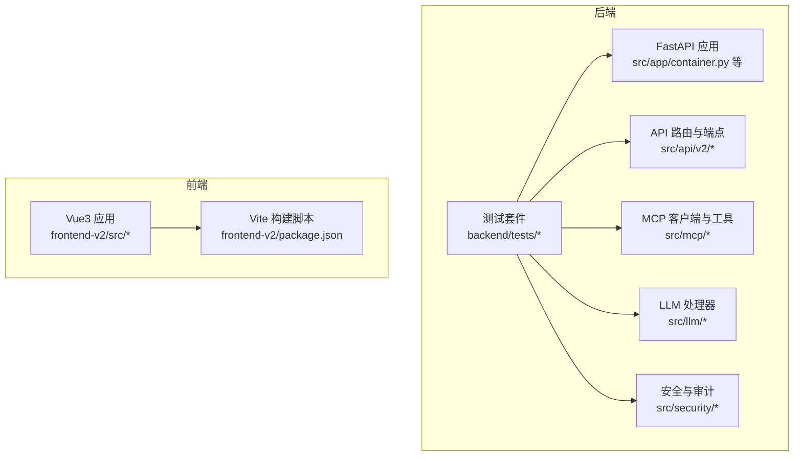
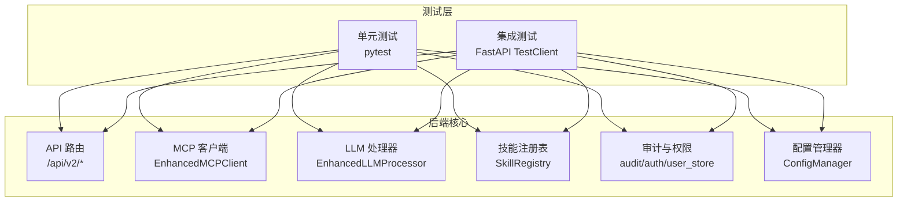
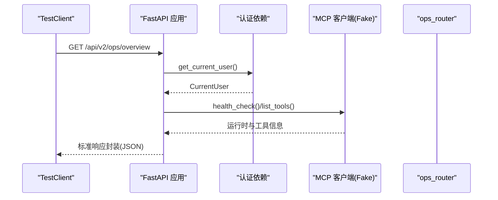
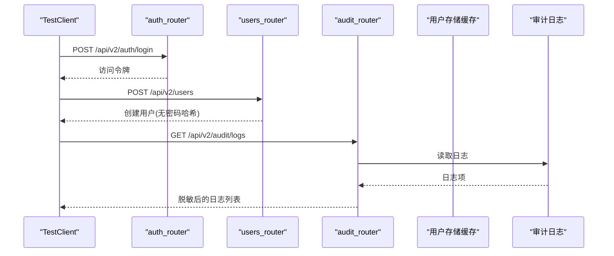
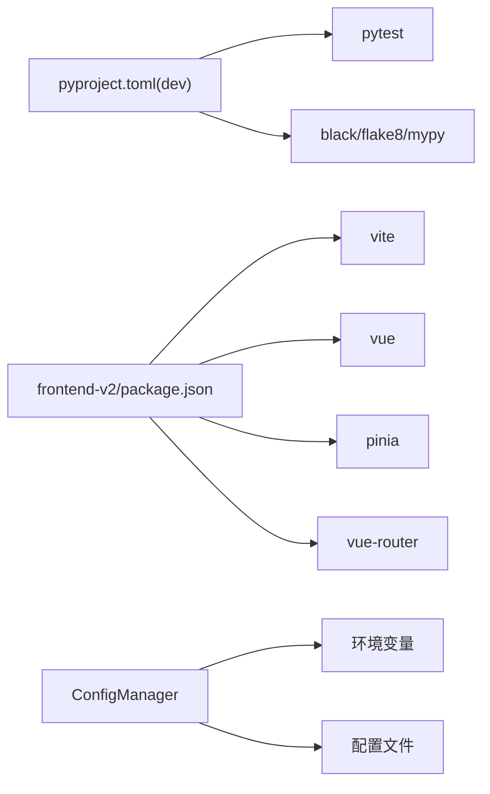

# 测试指南

<cite>
**本文引用的文件**
- [pyproject.toml](file://pyproject.toml)
- [package.json](file://frontend-v2/package.json)
- [backend/tests/test_api_standard_runtime_ops.py](file://backend/tests/test_api_standard_runtime_ops.py)
- [backend/tests/test_config_manager.py](file://backend/tests/test_config_manager.py)
- [backend/tests/test_iam_audit.py](file://backend/tests/test_iam_audit.py)
- [backend/tests/test_skills_registry.py](file://backend/tests/test_skills_registry.py)
- [backend/tests/test_chat_stream_events.py](file://backend/tests/test_chat_stream_events.py)
- [backend/tests/test_llm_processor_stream.py](file://backend/tests/test_llm_processor_stream.py)
- [backend/tests/test_mcp_builtin_skip.py](file://backend/tests/test_mcp_builtin_skip.py)
- [backend/src/config/manager.py](file://backend/src/config/manager.py)
</cite>

## 目录
1. [引言](#引言)
2. [项目结构](#项目结构)
3. [核心组件](#核心组件)
4. [架构总览](#架构总览)
5. [详细组件分析](#详细组件分析)
6. [依赖分析](#依赖分析)
7. [性能考虑](#性能考虑)
8. [故障排查指南](#故障排查指南)
9. [结论](#结论)
10. [附录](#附录)

## 引言
本测试指南面向“钉钉K8s运维机器人”项目，目标是帮助开发者与测试工程师建立完善的测试体系，覆盖单元测试、集成测试、前端集成测试、性能与负载测试、覆盖率监控以及CI/CD自动化。文档基于仓库现有测试文件与配置进行归纳总结，并给出可落地的实施建议。

## 项目结构
该项目采用前后端分离架构，后端使用FastAPI，前端使用Vue3 + Vite。测试主要集中在后端Python工程，前端通过Vite脚本运行。测试相关的关键位置如下：
- 后端测试目录：backend/tests
- 前端测试脚本：frontend-v2/package.json 中的开发与构建脚本
- 项目依赖与测试框架：pyproject.toml 中的pytest与开发依赖

图表来源
- [backend/tests/test_api_standard_runtime_ops.py:1-252](file://backend/tests/test_api_standard_runtime_ops.py#L1-L252)
- [backend/tests/test_iam_audit.py:1-107](file://backend/tests/test_iam_audit.py#L1-L107)
- [backend/tests/test_skills_registry.py:1-34](file://backend/tests/test_skills_registry.py#L1-L34)
- [backend/tests/test_llm_processor_stream.py:1-197](file://backend/tests/test_llm_processor_stream.py#L1-L197)
- [backend/tests/test_mcp_builtin_skip.py:1-346](file://backend/tests/test_mcp_builtin_skip.py#L1-L346)
- [package.json:1-41](file://frontend-v2/package.json#L1-L41)

章节来源
- [pyproject.toml:53-58](file://pyproject.toml#L53-L58)
- [package.json:10-15](file://frontend-v2/package.json#L10-L15)

## 核心组件
- 单元测试框架：pytest（后端），前端测试脚本由Vite与包管理器驱动
- Mock与依赖注入：通过FastAPI TestClient与dependency_overrides进行端点级测试；对MCP客户端、LLM处理器、配置管理器等进行Mock或Fake实现
- 测试数据与环境：通过monkeypatch设置环境变量，使用tmp_path构造临时文件系统，避免污染真实环境
- 关键被测模块：
  - API标准运行时与路由：ops/overview、mcp/config、工具调用权限控制
  - IAM与审计：登录、用户管理、审计日志读取
  - 技能注册表：工具名过滤与权限前缀匹配
  - 流事件标准化：SSE事件编码与历史兼容字段扁平化
  - LLM处理器：流式回退、提示词压缩、重试与令牌限制
  - MCP内置跳过与合并：本地工具合并、服务器白/黑名单、健康检查

章节来源
- [backend/tests/test_api_standard_runtime_ops.py:1-252](file://backend/tests/test_api_standard_runtime_ops.py#L1-L252)
- [backend/tests/test_iam_audit.py:1-107](file://backend/tests/test_iam_audit.py#L1-L107)
- [backend/tests/test_skills_registry.py:1-34](file://backend/tests/test_skills_registry.py#L1-L34)
- [backend/tests/test_chat_stream_events.py:1-65](file://backend/tests/test_chat_stream_events.py#L1-L65)
- [backend/tests/test_llm_processor_stream.py:1-197](file://backend/tests/test_llm_processor_stream.py#L1-L197)
- [backend/tests/test_mcp_builtin_skip.py:1-346](file://backend/tests/test_mcp_builtin_skip.py#L1-L346)

## 架构总览
下图展示了后端测试与核心模块的交互关系，重点体现Mock对象与依赖注入在测试中的作用。

图表来源
- [backend/tests/test_api_standard_runtime_ops.py:1-252](file://backend/tests/test_api_standard_runtime_ops.py#L1-L252)
- [backend/tests/test_mcp_builtin_skip.py:1-346](file://backend/tests/test_mcp_builtin_skip.py#L1-L346)
- [backend/tests/test_llm_processor_stream.py:1-197](file://backend/tests/test_llm_processor_stream.py#L1-L197)
- [backend/tests/test_skills_registry.py:1-34](file://backend/tests/test_skills_registry.py#L1-L34)
- [backend/tests/test_iam_audit.py:1-107](file://backend/tests/test_iam_audit.py#L1-L107)
- [backend/src/config/manager.py:35-221](file://backend/src/config/manager.py#L35-L221)

## 详细组件分析

### API标准运行时与路由测试
- 目标：验证运行时依赖解析、ops概览返回结构、MCP配置更新端点、SPA回退行为、工具调用权限控制（只读/写入）
- 方法：使用FastAPI TestClient与dependency_overrides注入Fake用户与MCP客户端；对静态文件缺失场景进行断言
- 关键断言点：
  - 标准响应封装(success/error/meta)与请求ID透传
  - MCP运行时状态、工具数量与传输方式
  - 配置保存与名称一致性
  - SPA缺失时返回API_ONLY
  - 工具调用权限：只读允许列表内工具、非列表内工具需写权限

图表来源
- [backend/tests/test_api_standard_runtime_ops.py:116-149](file://backend/tests/test_api_standard_runtime_ops.py#L116-L149)

章节来源
- [backend/tests/test_api_standard_runtime_ops.py:1-252](file://backend/tests/test_api_standard_runtime_ops.py#L1-L252)

### IAM与审计测试
- 目标：登录、用户管理、审计日志读取的标准化响应封装与敏感信息脱敏
- 方法：通过monkeypatch设置IAM与审计相关环境变量，使用TestClient发起HTTP请求
- 关键断言点：
  - 登录成功且返回用户权限
  - 用户列表包含创建用户且无密码哈希
  - 审计日志读取返回条目，敏感字段脱敏

图表来源
- [backend/tests/test_iam_audit.py:26-107](file://backend/tests/test_iam_audit.py#L26-L107)

章节来源
- [backend/tests/test_iam_audit.py:1-107](file://backend/tests/test_iam_audit.py#L1-L107)

### 技能注册表测试
- 目标：验证工具名过滤与权限前缀匹配（如k8s_readonly）
- 方法：使用pytest fixture加载示例配置文件，构造SkillRegistry并断言过滤结果
- 关键断言点：
  - full权限允许所有工具
  - k8s_readonly前缀仅允许K8s工具

章节来源
- [backend/tests/test_skills_registry.py:1-34](file://backend/tests/test_skills_registry.py#L1-L34)

### 流事件标准化测试
- 目标：验证消息增量事件、历史兼容字段扁平化、完成标记保留
- 方法：对normalize与encode函数进行单元断言
- 关键断言点：
  - 文本分片转为message_delta事件
  - tool_call_start保持原始payload
  - tool_call_update扁平化为tool_call_result
  - DONE标记保持兼容

章节来源
- [backend/tests/test_chat_stream_events.py:1-65](file://backend/tests/test_chat_stream_events.py#L1-L65)

### LLM处理器测试
- 目标：流式回退、提示词压缩、重试与令牌限制
- 方法：构造Fake OpenAI客户端与异步流，断言不同配置下的行为
- 关键断言点：
  - 无LLM客户端时返回回退文本
  - 大结果压缩提示词长度
  - 配置max_retries与max_tokens在非流与流模式下正确传递

章节来源
- [backend/tests/test_llm_processor_stream.py:1-197](file://backend/tests/test_llm_processor_stream.py#L1-L197)

### MCP内置跳过与合并测试
- 目标：本地工具合并、服务器白/黑名单、健康检查剔除远程连接
- 方法：构造FakeConfigManager与FakeLocalRuntime，断言工具集合与统计
- 关键断言点：
  - 禁用工具不合并
  - 服务器allow/deny生效
  - 本地provider禁用隐藏其工具
  - 刷新工具保留本地工具
  - 健康检查忽略被跳过的远程连接

章节来源
- [backend/tests/test_mcp_builtin_skip.py:1-346](file://backend/tests/test_mcp_builtin_skip.py#L1-L346)

## 依赖分析
- 测试框架与工具
  - 后端：pytest、FastAPI TestClient、unittest（部分）
  - 前端：Vite、Vue3、Element Plus、Pinia、Vue Router
- 关键外部依赖
  - FastAPI、httpx、aiohttp、websockets、kubernetes、openai、pydantic、loguru、tenacity等
- 配置与环境
  - ConfigManager负责从文件与环境变量加载配置，支持LLM与MCP两类配置

图表来源
- [pyproject.toml:53-58](file://pyproject.toml#L53-L58)
- [package.json:10-39](file://frontend-v2/package.json#L10-L39)
- [backend/src/config/manager.py:35-221](file://backend/src/config/manager.py#L35-L221)

章节来源
- [pyproject.toml:53-58](file://pyproject.toml#L53-L58)
- [package.json:10-39](file://frontend-v2/package.json#L10-L39)
- [backend/src/config/manager.py:35-221](file://backend/src/config/manager.py#L35-L221)

## 性能考虑
- 单元测试层面
  - 使用异步测试（pytest+asyncio）减少I/O阻塞
  - 对大结果压缩与流式处理进行边界条件测试，避免内存峰值
- 集成测试层面
  - 使用TestClient替代真实网络请求，降低外部依赖抖动
  - 对MCP与LLM调用进行Mock，避免真实服务延迟影响测试稳定性
- 性能指标建议
  - 接口响应时间分布（P50/P90/P95）
  - 工具调用成功率与平均耗时
  - LLM流式响应吞吐量与首字节延迟
- 负载测试建议
  - 使用locust或自定义并发脚本模拟多用户同时调用工具
  - 关注MCP并发调用上限与缓存命中率

## 故障排查指南
- 常见问题
  - 导入失败：测试中多次尝试不同路径导入，若仍失败需检查PYTHONPATH与包结构
  - 缓存导致状态不一致：重置缓存（如用户存储、鉴权服务、审计日志）后再测试
  - 环境变量未生效：确认.env与config.env路径与内容，必要时强制重新加载
- 排查步骤
  - 回归单测：先运行最小化用例定位问题范围
  - Mock替换：逐步替换为真实依赖，确认问题是否由外部服务引起
  - 日志与断言：增加更细粒度断言，记录关键中间状态

章节来源
- [backend/tests/test_config_manager.py:17-31](file://backend/tests/test_config_manager.py#L17-L31)
- [backend/tests/test_iam_audit.py:12-16](file://backend/tests/test_iam_audit.py#L12-L16)

## 结论
本指南基于现有测试文件总结了后端单元与集成测试实践，并给出了前端测试、性能与覆盖率、CI/CD自动化的实施建议。建议在后续迭代中持续完善测试矩阵，补充端到端集成测试与可视化监控，以保障系统在复杂运维场景下的稳定性与可靠性。

## 附录

### 单元测试编写方法与最佳实践
- pytest框架
  - 使用fixture组织共享资源（如配置路径、临时目录）
  - 使用monkeypatch设置环境变量，避免污染全局状态
  - 使用dependency_overrides注入Fake/Mock对象
- 测试用例设计
  - 覆盖正常路径、边界条件与异常分支
  - 对返回结构进行契约校验（success/error/meta）
  - 对敏感信息进行脱敏断言
- Mock对象使用
  - 为异步接口提供异步Mock（如异步迭代器）
  - 为同步接口提供同步Mock（如返回值与异常）

章节来源
- [backend/tests/test_llm_processor_stream.py:9-53](file://backend/tests/test_llm_processor_stream.py#L9-L53)
- [backend/tests/test_mcp_builtin_skip.py:30-74](file://backend/tests/test_mcp_builtin_skip.py#L30-L74)

### 集成测试策略
- API测试
  - 使用FastAPI TestClient覆盖路由、权限与错误码
  - 对SPAs缺失场景进行降级行为测试
- MCP客户端测试
  - 通过FakeMCPClient与FakeLocalRuntime验证工具合并、权限与健康检查
- 前端集成测试
  - 使用Vite开发服务器与E2E工具（如Cypress）进行端到端验证
  - 关注路由、主题切换、会话与权限控制

章节来源
- [backend/tests/test_api_standard_runtime_ops.py:177-198](file://backend/tests/test_api_standard_runtime_ops.py#L177-L198)
- [backend/tests/test_mcp_builtin_skip.py:16-28](file://backend/tests/test_mcp_builtin_skip.py#L16-L28)
- [package.json:10-15](file://frontend-v2/package.json#L10-L15)

### 测试数据准备与管理
- 测试环境配置
  - 使用tmp_path创建隔离的临时目录，存放用户与审计日志文件
  - 通过monkeypatch设置IAM_USERS_PATH、APP_SESSION_SECRET、APP_ADMIN_PASSWORD、OPERATION_AUDIT_LOG_PATH等
- 数据库与文件
  - 对于无数据库的场景，使用JSON文件与内存结构模拟
  - 对配置文件迁移与路径一致性进行断言

章节来源
- [backend/tests/test_iam_audit.py:26-31](file://backend/tests/test_iam_audit.py#L26-L31)
- [backend/tests/test_config_manager.py:36-46](file://backend/tests/test_config_manager.py#L36-L46)

### 性能测试与负载测试
- 单元与集成阶段
  - 异步Mock与本地Mock减少外部依赖延迟
  - 对大结果压缩与流式处理进行压力测试
- 端到端阶段
  - 使用并发脚本模拟多用户工具调用
  - 关注MCP并发上限与缓存策略

章节来源
- [backend/tests/test_llm_processor_stream.py:77-113](file://backend/tests/test_llm_processor_stream.py#L77-L113)
- [backend/tests/test_mcp_builtin_skip.py:175-185](file://backend/tests/test_mcp_builtin_skip.py#L175-L185)

### 测试覆盖率监控与提升
- 覆盖率工具
  - 在pyproject.toml中启用pytest cov（如需）并生成报告
- 提升策略
  - 优先补齐关键路径与异常分支
  - 对Mock对象的调用路径进行断言
  - 对配置管理器与权限控制模块进行重点覆盖

章节来源
- [pyproject.toml:53-58](file://pyproject.toml#L53-L58)

### 测试自动化与CI/CD集成
- 建议流程
  - 代码提交触发lint（black/flake8/mypy）、单元测试与覆盖率检查
  - PR合并前要求通过所有测试与覆盖率阈值
- 前端测试
  - 在CI中执行Vite构建与预览，确保打包与运行无误
- 配置参考
  - 后端测试命令与脚本位于pyproject.toml的scripts段落
  - 前端脚本位于frontend-v2/package.json

章节来源
- [pyproject.toml:59-78](file://pyproject.toml#L59-L78)
- [package.json:10-15](file://frontend-v2/package.json#L10-L15)