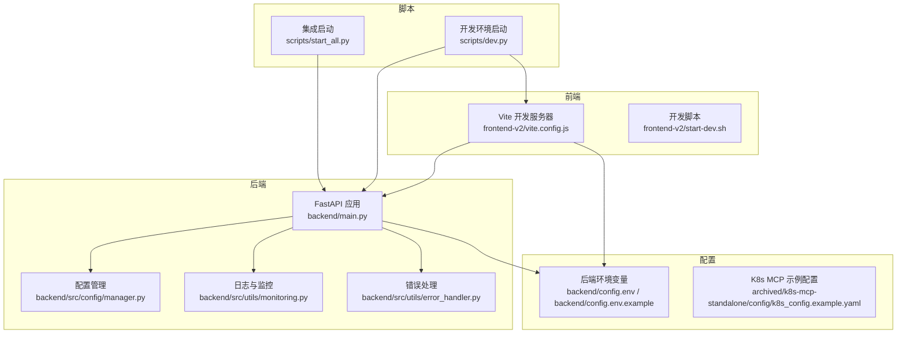
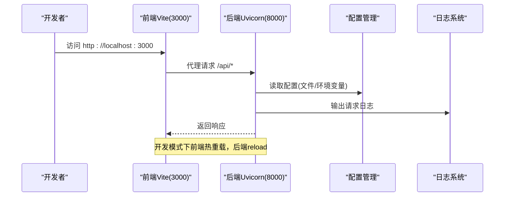
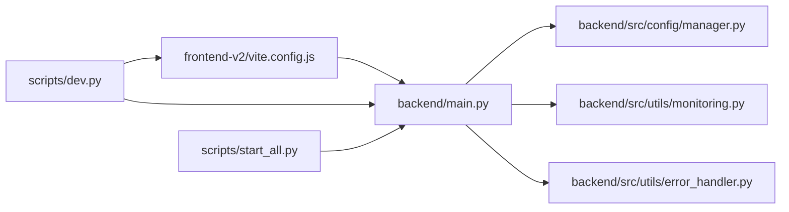

# 调试与开发工具

<cite>
**本文引用的文件**   
- [README.md](file://README.md)
- [backend/main.py](file://backend/main.py)
- [backend/src/utils/monitoring.py](file://backend/src/utils/monitoring.py)
- [backend/src/utils/error_handler.py](file://backend/src/utils/error_handler.py)
- [backend/src/config/manager.py](file://backend/src/config/manager.py)
- [backend/config.env](file://backend/config.env)
- [backend/config.env.example](file://backend/config.env.example)
- [scripts/dev.py](file://scripts/dev.py)
- [scripts/start_all.py](file://scripts/start_all.py)
- [frontend-v2/vite.config.js](file://frontend-v2/vite.config.js)
- [frontend-v2/start-dev.sh](file://frontend-v2/start-dev.sh)
- [archived/k8s-mcp-standalone/config/k8s_config.example.yaml](file://archived/k8s-mcp-standalone/config/k8s_config.example.yaml)
</cite>

## 目录
1. [简介](#简介)
2. [项目结构](#项目结构)
3. [核心组件](#核心组件)
4. [架构总览](#架构总览)
5. [详细组件分析](#详细组件分析)
6. [依赖关系分析](#依赖关系分析)
7. [性能考量](#性能考量)
8. [故障排查指南](#故障排查指南)
9. [结论](#结论)
10. [附录](#附录)

## 简介
本指南面向“钉钉K8s运维机器人”的开发者与调试人员，覆盖后端（Python/FastAPI）、前端（Vue3/Vite）以及日志、性能监控、错误处理、开发与集成启动脚本等主题。内容聚焦于：
- Python调试器与IDE配置、断点设置与热重载
- 前端开发调试工具（Vue DevTools、浏览器开发者工具、网络请求调试）
- 日志系统配置（级别、格式、轮转）
- 性能分析（CPU/内存/网络）与监控
- Docker/Kubernetes环境下的调试技巧
- 常见问题诊断与解决

## 项目结构
项目采用前后端分离与统一入口的组织方式：后端以FastAPI为主，前端通过Vite开发，二者通过代理联调；同时提供一键启动脚本整合后端与可选子进程。

图示来源
- [backend/main.py:1-494](file://backend/main.py#L1-L494)
- [backend/src/config/manager.py:1-221](file://backend/src/config/manager.py#L1-L221)
- [backend/src/utils/monitoring.py:1-396](file://backend/src/utils/monitoring.py#L1-L396)
- [backend/src/utils/error_handler.py:1-334](file://backend/src/utils/error_handler.py#L1-L334)
- [frontend-v2/vite.config.js:1-55](file://frontend-v2/vite.config.js#L1-L55)
- [frontend-v2/start-dev.sh:1-26](file://frontend-v2/start-dev.sh#L1-L26)
- [scripts/dev.py:1-219](file://scripts/dev.py#L1-L219)
- [scripts/start_all.py:1-306](file://scripts/start_all.py#L1-L306)
- [backend/config.env:1-42](file://backend/config.env#L1-L42)
- [backend/config.env.example:1-51](file://backend/config.env.example#L1-L51)
- [archived/k8s-mcp-standalone/config/k8s_config.example.yaml:1-122](file://archived/k8s-mcp-standalone/config/k8s_config.example.yaml#L1-L122)

章节来源
- [README.md:64-76](file://README.md#L64-L76)
- [backend/main.py:302-450](file://backend/main.py#L302-L450)
- [frontend-v2/vite.config.js:13-29](file://frontend-v2/vite.config.js#L13-L29)
- [scripts/dev.py:92-139](file://scripts/dev.py#L92-L139)
- [scripts/start_all.py:225-270](file://scripts/start_all.py#L225-L270)

## 核心组件
- 后端应用与生命周期：FastAPI应用、CORS、静态资源挂载、根路由与SPA回退、健康检查端点、异常处理与审计中间件。
- 配置管理：优先读取配置文件，回退到环境变量；支持LLM/MCP配置读取与重载。
- 日志系统：控制台与文件双通道，支持级别与格式定制、每周轮转与保留策略。
- 错误处理：统一错误分类、友好提示、建议、日志记录与HTTP状态码映射。
- 性能监控：请求追踪、端点统计、系统指标采集（CPU/内存/连接数/错误计数）、调试信息收集。
- 前端开发：Vite代理后端API与钉钉webhook、构建产物输出到后端静态目录、基础路径设置。
- 启动脚本：开发环境并行启动后端+前端；集成启动脚本负责后端服务与可选子进程编排。

章节来源
- [backend/main.py:37-52](file://backend/main.py#L37-L52)
- [backend/main.py:148-270](file://backend/main.py#L148-L270)
- [backend/src/config/manager.py:35-221](file://backend/src/config/manager.py#L35-L221)
- [backend/src/utils/error_handler.py:13-26](file://backend/src/utils/error_handler.py#L13-L26)
- [backend/src/utils/monitoring.py:51-144](file://backend/src/utils/monitoring.py#L51-L144)
- [frontend-v2/vite.config.js:13-29](file://frontend-v2/vite.config.js#L13-L29)
- [scripts/dev.py:92-139](file://scripts/dev.py#L92-L139)

## 架构总览
后端作为统一入口，前端通过Vite代理访问后端API；开发时后端开启reload，前端热重载；生产构建将前端产物输出到后端静态目录，由后端统一提供SPA。

图示来源
- [frontend-v2/vite.config.js:13-29](file://frontend-v2/vite.config.js#L13-L29)
- [backend/main.py:302-450](file://backend/main.py#L302-L450)
- [backend/src/config/manager.py:35-96](file://backend/src/config/manager.py#L35-L96)

## 详细组件分析

### 后端调试与开发工具
- Python调试器与IDE配置
  - 使用标准库pdb或IDE内置调试器在关键路径设置断点，如应用生命周期初始化、MCP客户端连接、LLM处理器创建、钉钉机器人初始化、审计中间件等。
  - 启动参数支持reload，便于热重载开发：[backend/main.py:486-493](file://backend/main.py#L486-L493)。
  - 开发脚本并行启动后端与前端，后端端口默认8000：[scripts/dev.py:98-112](file://scripts/dev.py#L98-L112)。
- 断点设置建议
  - 应用生命周期：[backend/main.py:148-187](file://backend/main.py#L148-L187)
  - 异常处理与审计：[backend/main.py:311-395](file://backend/main.py#L311-L395)
  - 配置加载与回退：[backend/src/config/manager.py:73-173](file://backend/src/config/manager.py#L73-L173)
- 热重载与并发
  - 后端reload开启后，修改代码自动重启；前端Vite热重载；开发脚本统一管理进程并实时输出日志：[scripts/dev.py:51-80](file://scripts/dev.py#L51-L80)。

章节来源
- [backend/main.py:486-493](file://backend/main.py#L486-L493)
- [scripts/dev.py:92-139](file://scripts/dev.py#L92-L139)
- [backend/src/config/manager.py:73-173](file://backend/src/config/manager.py#L73-L173)

### 前端开发调试工具
- Vue DevTools
  - 在开发模式下启用Vue DevTools（Vite配置中定义了生产宏），可在浏览器开发者工具中查看组件树、状态与事件流。
- 浏览器开发者工具
  - 使用Network面板观察API请求与SSE流式响应；Console查看错误与日志；Sources定位源码映射。
- 网络请求调试
  - Vite代理将/api与/dingtalk转发至后端，便于联调：[frontend-v2/vite.config.js:15-27](file://frontend-v2/vite.config.js#L15-L27)。
  - 开发脚本提示后端地址与端口，确保后端已启动：[frontend-v2/start-dev.sh:14-19](file://frontend-v2/start-dev.sh#L14-L19)。

章节来源
- [frontend-v2/vite.config.js:13-29](file://frontend-v2/vite.config.js#L13-L29)
- [frontend-v2/start-dev.sh:14-19](file://frontend-v2/start-dev.sh#L14-L19)

### 日志系统配置与使用
- 控制台与文件日志
  - 控制台格式包含时间与级别；文件日志位于logs/app.log，按周轮转、保留四周：[backend/main.py:37-52](file://backend/main.py#L37-L52)。
- 日志级别与格式
  - 通过环境变量LOG_LEVEL调整级别；控制台与文件格式可分别定制：[backend/main.py:39-41](file://backend/main.py#L39-L41)。
- 配置迁移与验证
  - 首次启动检测并迁移LLM配置，验证配置文件有效性：[backend/main.py:62-128](file://backend/main.py#L62-L128)。
- 配置来源
  - 优先读取config.env，回退到系统环境变量；LLM/MCP配置均支持文件与环境变量混合策略：[backend/src/config/manager.py:35-202](file://backend/src/config/manager.py#L35-L202)。

章节来源
- [backend/main.py:37-52](file://backend/main.py#L37-L52)
- [backend/src/config/manager.py:35-96](file://backend/src/config/manager.py#L35-L96)

### 性能分析与监控
- 请求追踪与统计
  - 通过性能监控器记录请求开始/结束、耗时、状态码、错误与元数据，并维护端点统计与错误排行：[backend/src/utils/monitoring.py:145-242](file://backend/src/utils/monitoring.py#L145-L242)。
- 系统指标采集
  - 定时采集CPU/内存/磁盘/连接数/请求量/错误量/平均响应时间等指标，提供阈值告警：[backend/src/utils/monitoring.py:85-144](file://backend/src/utils/monitoring.py#L85-L144)。
- 调试信息收集
  - 装饰器与上下文管理器记录函数执行耗时、异常与上下文，便于定位瓶颈：[backend/src/utils/monitoring.py:316-383](file://backend/src/utils/monitoring.py#L316-L383)。
- 监控开关
  - 启停监控接口：[backend/src/utils/monitoring.py:387-396](file://backend/src/utils/monitoring.py#L387-L396)。

章节来源
- [backend/src/utils/monitoring.py:51-144](file://backend/src/utils/monitoring.py#L51-L144)
- [backend/src/utils/monitoring.py:145-242](file://backend/src/utils/monitoring.py#L145-L242)
- [backend/src/utils/monitoring.py:316-383](file://backend/src/utils/monitoring.py#L316-L383)

### 错误处理与诊断
- 错误分类与建议
  - 根据异常类型与关键字分类（网络、认证、授权、限流、服务器、客户端、MCP、流式、配置、未知），并提供针对性建议：[backend/src/utils/error_handler.py:13-69](file://backend/src/utils/error_handler.py#L13-L69)。
- 错误响应格式
  - 统一返回结构包含类型、消息、原始错误、建议、时间戳与上下文，开发模式可包含堆栈信息：[backend/src/utils/error_handler.py:159-186](file://backend/src/utils/error_handler.py#L159-L186)。
- 日志记录与状态码映射
  - 按严重程度选择日志级别；HTTP状态码与错误类型映射，便于客户端识别：[backend/src/utils/error_handler.py:218-304](file://backend/src/utils/error_handler.py#L218-L304)。
- 装饰器与中间件
  - API错误处理装饰器与HTTP异常中间件，保证统一的错误呈现与审计记录：[backend/src/utils/error_handler.py:274-334](file://backend/src/utils/error_handler.py#L274-L334)，[backend/main.py:311-395](file://backend/main.py#L311-L395)。

章节来源
- [backend/src/utils/error_handler.py:13-69](file://backend/src/utils/error_handler.py#L13-L69)
- [backend/src/utils/error_handler.py:159-186](file://backend/src/utils/error_handler.py#L159-L186)
- [backend/src/utils/error_handler.py:218-304](file://backend/src/utils/error_handler.py#L218-L304)
- [backend/main.py:311-395](file://backend/main.py#L311-L395)

### 配置管理与迁移
- 文件优先与回退策略
  - 优先从配置文件读取，若无效或缺失则回退到环境变量；LLM/MCP配置均支持该策略：[backend/src/config/manager.py:73-173](file://backend/src/config/manager.py#L73-L173)。
- 配置迁移
  - 首次启动检测并迁移LLM配置，记录迁移日志，便于回溯：[backend/main.py:62-107](file://backend/main.py#L62-L107)。
- 环境变量示例
  - 提供LLM、钉钉、K8s、MCP、脱敏等完整示例，便于快速配置：[backend/config.env.example:1-51](file://backend/config.env.example#L1-L51)。

章节来源
- [backend/src/config/manager.py:73-173](file://backend/src/config/manager.py#L73-L173)
- [backend/main.py:62-107](file://backend/main.py#L62-L107)
- [backend/config.env.example:1-51](file://backend/config.env.example#L1-L51)

### 开发与集成启动流程
- 开发环境启动
  - 并行启动后端（reload）与前端（热重载），自动输出日志与健康提示：[scripts/dev.py:92-139](file://scripts/dev.py#L92-L139)。
- 集成启动
  - 后端服务启动完成后统一输出访问地址与提示，支持Ctrl+C优雅停止：[scripts/start_all.py:225-270](file://scripts/start_all.py#L225-L270)。

章节来源
- [scripts/dev.py:92-139](file://scripts/dev.py#L92-L139)
- [scripts/start_all.py:225-270](file://scripts/start_all.py#L225-L270)

## 依赖关系分析
后端应用依赖配置管理、日志与监控、错误处理模块；前端通过Vite代理与后端通信；开发脚本协调前后端进程。

图示来源
- [backend/main.py:29-35](file://backend/main.py#L29-L35)
- [backend/src/config/manager.py:35-56](file://backend/src/config/manager.py#L35-L56)
- [backend/src/utils/monitoring.py:12](file://backend/src/utils/monitoring.py#L12)
- [backend/src/utils/error_handler.py:9](file://backend/src/utils/error_handler.py#L9)
- [frontend-v2/vite.config.js:13-29](file://frontend-v2/vite.config.js#L13-L29)
- [scripts/dev.py:98-122](file://scripts/dev.py#L98-L122)
- [scripts/start_all.py:225-270](file://scripts/start_all.py#L225-L270)

## 性能考量
- CPU/内存分析
  - 使用系统指标采集与阈值告警，结合请求追踪统计定位热点端点与慢请求：[backend/src/utils/monitoring.py:85-144](file://backend/src/utils/monitoring.py#L85-L144)。
- 网络分析
  - 审计中间件记录请求耗时、状态码、IP与UA，结合错误处理建议优化网络与限流策略：[backend/main.py:348-395](file://backend/main.py#L348-L395)。
- 前端性能
  - Vite构建分包策略与sourcemap配置，便于定位前端性能问题：[frontend-v2/vite.config.js:30-47](file://frontend-v2/vite.config.js#L30-L47)。

章节来源
- [backend/src/utils/monitoring.py:85-144](file://backend/src/utils/monitoring.py#L85-L144)
- [backend/main.py:348-395](file://backend/main.py#L348-L395)
- [frontend-v2/vite.config.js:30-47](file://frontend-v2/vite.config.js#L30-L47)

## 故障排查指南
- 启动失败
  - 检查Python版本与Poetry环境；确认依赖安装与端口占用；查看开发脚本输出的日志：[scripts/dev.py:28-50](file://scripts/dev.py#L28-L50)。
- 配置问题
  - 确认config.env存在且参数有效；若首次启动，检查配置迁移日志；必要时回退到环境变量：[backend/main.py:55-61](file://backend/main.py#L55-L61)，[backend/src/config/manager.py:35-96](file://backend/src/config/manager.py#L35-L96)。
- MCP/LLM连接异常
  - 查看MCP客户端初始化日志与降级提示；核对LLM提供商与API Key；检查网络与限流：[backend/main.py:152-187](file://backend/main.py#L152-L187)。
- 错误分类与建议
  - 使用统一错误响应中的建议字段快速定位问题；在开发模式下查看堆栈信息：[backend/src/utils/error_handler.py:159-186](file://backend/src/utils/error_handler.py#L159-L186)。
- 日志定位
  - 查看控制台与logs/app.log；结合请求ID与审计中间件记录定位问题：[backend/main.py:348-395](file://backend/main.py#L348-L395)。

章节来源
- [scripts/dev.py:28-50](file://scripts/dev.py#L28-L50)
- [backend/main.py:55-61](file://backend/main.py#L55-L61)
- [backend/src/config/manager.py:35-96](file://backend/src/config/manager.py#L35-L96)
- [backend/main.py:152-187](file://backend/main.py#L152-L187)
- [backend/src/utils/error_handler.py:159-186](file://backend/src/utils/error_handler.py#L159-L186)
- [backend/main.py:348-395](file://backend/main.py#L348-L395)

## 结论
本指南提供了从开发环境搭建、调试工具使用到日志与性能监控、错误处理与常见问题排查的完整路径。建议在开发阶段充分利用后端reload与前端热重载，在生产构建后通过统一的静态资源提供SPA应用，配合完善的日志与监控体系保障系统稳定运行。

## 附录
- Docker/Kubernetes环境调试要点
  - 通过环境变量注入配置（如LLM、K8s、MCP），并在容器内设置合适的日志轮转与保留策略；在K8s中使用探针与日志采集组件集中收集日志：[backend/config.env:27-42](file://backend/config.env#L27-L42)。
  - 参考归档的K8s MCP示例配置，了解服务器、集群、安全、日志与监控等维度的典型参数：[archived/k8s-mcp-standalone/config/k8s_config.example.yaml:1-122](file://archived/k8s-mcp-standalone/config/k8s_config.example.yaml#L1-L122)。
- 常用命令
  - 启动开发环境：poetry run dev；启动后端：poetry run serve；启动集成服务：poetry run start-all；构建前端：poetry run build：[README.md:78-86](file://README.md#L78-L86)。

章节来源
- [backend/config.env:27-42](file://backend/config.env#L27-L42)
- [archived/k8s-mcp-standalone/config/k8s_config.example.yaml:1-122](file://archived/k8s-mcp-standalone/config/k8s_config.example.yaml#L1-L122)
- [README.md:78-86](file://README.md#L78-L86)