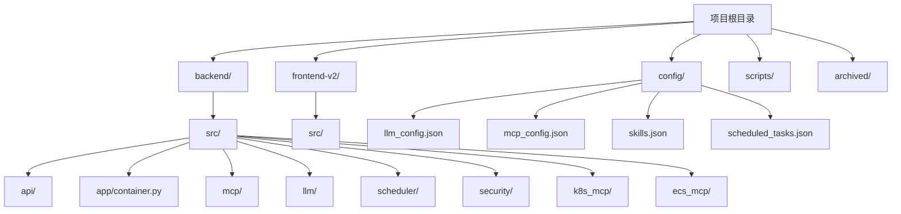
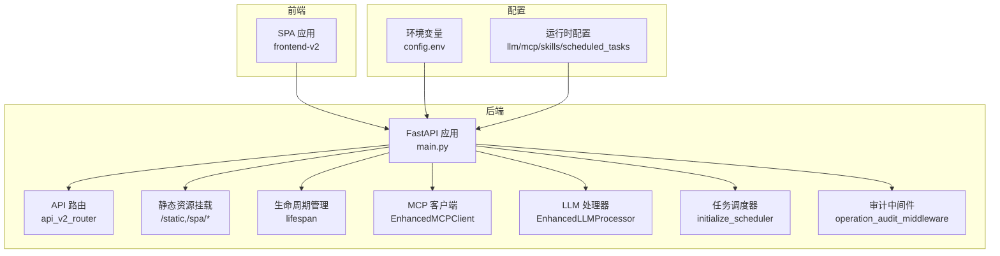
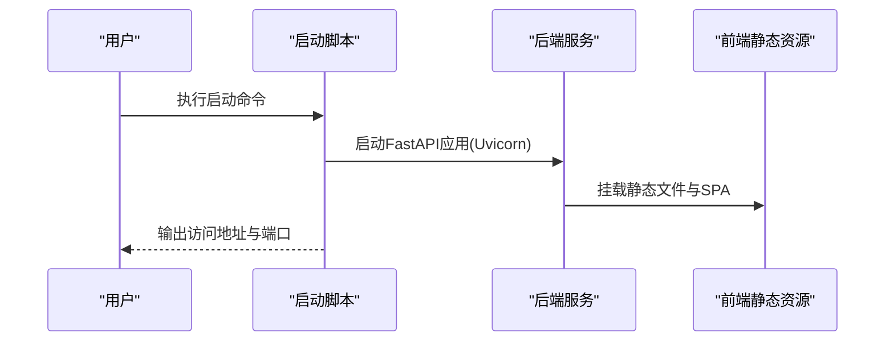
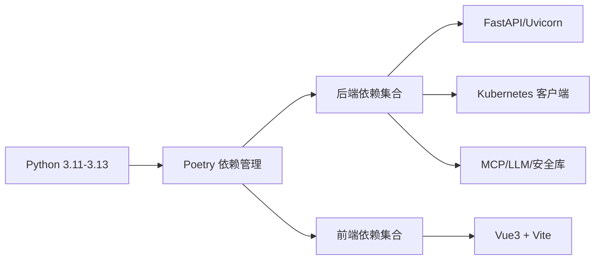

# 快速开始

<cite>
**本文引用的文件**
- [README.md](file://README.md)
- [pyproject.toml](file://pyproject.toml)
- [poetry.toml](file://poetry.toml)
- [backend/config.env.example](file://backend/config.env.example)
- [config/llm_config.example.json](file://config/llm_config.example.json)
- [config/mcp_config.example.json](file://config/mcp_config.example.json)
- [config/skills.example.json](file://config/skills.example.json)
- [config/scheduled_tasks.example.json](file://config/scheduled_tasks.example.json)
- [scripts/start_all.py](file://scripts/start_all.py)
- [scripts/serve.py](file://scripts/serve.py)
- [scripts/dev.py](file://scripts/dev.py)
- [scripts/build.py](file://scripts/build.py)
- [scripts/setup.py](file://scripts/setup.py)
- [frontend-v2/package.json](file://frontend-v2/package.json)
- [frontend-v2/start-dev.sh](file://frontend-v2/start-dev.sh)
- [backend/main.py](file://backend/main.py)
- [backend/src/config/manager.py](file://backend/src/config/manager.py)
- [backend/src/llm/config_manager.py](file://backend/src/llm/config_manager.py)
</cite>

## 目录
1. [简介](#简介)
2. [项目结构](#项目结构)
3. [核心组件](#核心组件)
4. [架构总览](#架构总览)
5. [详细组件分析](#详细组件分析)
6. [依赖分析](#依赖分析)
7. [性能注意事项](#性能注意事项)
8. [故障排除指南](#故障排除指南)
9. [结论](#结论)
10. [附录](#附录)

## 简介
本指南面向首次接触“钉钉K8s运维机器人”的用户，提供从环境准备、依赖安装、配置到启动与验证的全流程说明。项目采用后端Python（FastAPI）与前端Vue3组合，支持通过自然语言进行Kubernetes集群管理与运维操作，并内置MCP工具系统与LLM编排能力。

## 项目结构
项目采用多模块组织方式：
- backend：后端主应用与API服务，包含K8s/ECS工具、MCP运行时、LLM编排、安全与调度等模块
- frontend-v2：现代化Vue3前端界面，提供聊天与运维控制台
- config：统一的运行时配置（LLM、MCP、技能、定时任务）
- scripts：开发、构建、启动与清理脚本
- archived：历史独立MCP工程归档

图表来源
- [README.md:64-76](file://README.md#L64-L76)
- [backend/main.py:1-50](file://backend/main.py#L1-L50)

章节来源
- [README.md:64-76](file://README.md#L64-L76)
- [backend/main.py:1-50](file://backend/main.py#L1-L50)

## 核心组件
- 后端主应用：FastAPI应用，负责路由注册、静态资源挂载、健康检查、生命周期管理与服务初始化
- MCP运行时：集成进程内K8s/ECS工具，支持工具白名单与安全策略
- LLM编排：支持文件配置与环境变量双通道，具备热重载与备份能力
- 安全与审计：IP/主机名/人名脱敏、操作审计中间件
- 调度器：基于asyncio的增强任务调度器
- 前端界面：Vue3 + Vite，提供聊天与运维控制台

章节来源
- [backend/main.py:137-300](file://backend/main.py#L137-L300)
- [backend/src/config/manager.py:35-221](file://backend/src/config/manager.py#L35-L221)
- [backend/src/llm/config_manager.py:150-760](file://backend/src/llm/config_manager.py#L150-L760)

## 架构总览
系统以FastAPI为核心，后端集成MCP工具与LLM编排，前端通过SPA提供交互界面。后端同时提供API与静态资源，实现单端口部署。

图表来源
- [backend/main.py:302-450](file://backend/main.py#L302-L450)
- [backend/src/config/manager.py:35-221](file://backend/src/config/manager.py#L35-L221)
- [backend/src/llm/config_manager.py:150-220](file://backend/src/llm/config_manager.py#L150-L220)

## 详细组件分析

### 环境准备与依赖安装
- Python版本要求：3.11 ≤ Python < 3.14（建议使用3.13），避免3.14对部分依赖的兼容性问题
- Poetry安装与配置：使用项目内置的poetry配置优化网络下载稳定性
- 后端依赖：通过Poetry自动安装，包含FastAPI、Uvicorn、Kubernetes客户端、MCP相关库等
- 前端依赖：仅开发时需要，Node版本建议20/22 LTS（遵循package.json引擎约束）

章节来源
- [README.md:17-28](file://README.md#L17-L28)
- [pyproject.toml:9-51](file://pyproject.toml#L9-L51)
- [poetry.toml:1-7](file://poetry.toml#L1-L7)
- [frontend-v2/package.json:6-9](file://frontend-v2/package.json#L6-L9)

### 配置步骤
1) 环境变量配置
- 复制示例文件并填写实际配置项（LLM、钉钉、K8s、MCP、脱敏等）
- 关键项包括：LLM开关与凭据、DINGTALK_WEBHOOK_URL/SECRET、KUBECONFIG_PATH、K8S_*安全与审计配置、MCP_CONFIG_PATH等

2) LLM配置
- 复制示例文件，配置提供商（如OpenAI兼容端点）、模型、温度、最大token等
- 支持开启数据脱敏、请求/响应日志级别等

3) MCP配置
- 控制全局超时、重试、并发、缓存等
- 可选择启用内置K8s/ECS工具或远程MCP服务器
- 工具白名单与安全策略可通过技能配置实现

4) 技能配置
- 定义不同技能集（如全量工具、K8s只读、运维只读），通过前缀匹配限制可用工具

5) 定时任务配置
- 复制示例文件，启用并配置周期性巡检与告警任务

章节来源
- [README.md:30-41](file://README.md#L30-L41)
- [backend/config.env.example:1-51](file://backend/config.env.example#L1-L51)
- [config/llm_config.example.json:1-45](file://config/llm_config.example.json#L1-L45)
- [config/mcp_config.example.json:1-66](file://config/mcp_config.example.json#L1-L66)
- [config/skills.example.json:1-53](file://config/skills.example.json#L1-L53)
- [config/scheduled_tasks.example.json:1-8](file://config/scheduled_tasks.example.json#L1-L8)

### 启动方式
- 一键启动（推荐）：启动后端主服务，自动集成前端静态资源
- 仅后端启动：适用于仅需API或已构建前端的场景
- 开发环境启动：并行启动后端热重载与前端开发服务器

图表来源
- [scripts/start_all.py:225-270](file://scripts/start_all.py#L225-L270)
- [scripts/serve.py:39-117](file://scripts/serve.py#L39-L117)
- [backend/main.py:406-450](file://backend/main.py#L406-L450)

章节来源
- [README.md:43-55](file://README.md#L43-L55)
- [scripts/start_all.py:1-306](file://scripts/start_all.py#L1-L306)
- [scripts/serve.py:1-119](file://scripts/serve.py#L1-L119)
- [scripts/dev.py:1-219](file://scripts/dev.py#L1-L219)

### 访问方式与基本使用
- 主页：http://localhost:8000
- API文档：http://localhost:8000/docs
- 系统状态：/api/status（生产服务脚本中打印）
- 健康检查：/health（返回MCP/Llm/DingTalk状态）

验证步骤建议：
- 启动后访问主页确认SPA加载
- 访问/docs查看API接口
- 调用/health确认各子系统状态
- 在前端发起一次简单查询（如列出Pods）验证MCP与LLM链路

章节来源
- [README.md:59-63](file://README.md#L59-L63)
- [scripts/serve.py:97-102](file://scripts/serve.py#L97-L102)
- [backend/main.py:464-474](file://backend/main.py#L464-L474)

## 依赖分析
- Python版本与Poetry：严格限定Python范围，避免与crewai、pydantic-core等上游依赖冲突
- 后端依赖：FastAPI/Uvicorn、Kubernetes客户端、MCP相关库、加密与安全库、Cron表达式处理、crewai（条件安装）
- 前端依赖：Vue3、Element Plus、Pinia、Vue Router等，Node版本约束在20-22之间

图表来源
- [pyproject.toml:9-51](file://pyproject.toml#L9-L51)
- [frontend-v2/package.json:24-39](file://frontend-v2/package.json#L24-L39)

章节来源
- [pyproject.toml:9-51](file://pyproject.toml#L9-L51)
- [frontend-v2/package.json:6-9](file://frontend-v2/package.json#L6-L9)

## 性能注意事项
- 前端构建：生产部署前务必执行构建，否则生产服务会拒绝启动
- 日志级别：通过环境变量调整日志等级，避免在高并发场景下产生过多I/O
- LLM与MCP超时：合理设置超时与重试，避免阻塞主线程
- 静态资源：SPA与静态文件合并部署，减少跨域与请求次数

## 故障排除指南
常见问题与解决思路：
- Python版本不符：确保使用3.11-3.13，若Poetry误用3.14请切换回3.13并重新安装
- 依赖安装缓慢：使用项目内置的poetry配置降低并行度，或更换pip镜像源
- 前端依赖未安装：开发环境需先安装npm依赖，或使用提供的启动脚本
- 健康检查失败：检查LLM配置文件是否正确生成与迁移，确认MCP工具启用状态
- 生产服务启动报错：确认已执行构建，静态资源目录存在关键文件

章节来源
- [README.md:17-28](file://README.md#L17-L28)
- [poetry.toml:4-7](file://poetry.toml#L4-L7)
- [scripts/build.py:24-48](file://scripts/build.py#L24-L48)
- [backend/main.py:62-129](file://backend/main.py#L62-L129)

## 结论
通过本指南，您可以在本地快速搭建并验证“钉钉K8s运维机器人”。建议按顺序完成环境准备、依赖安装、配置与启动，随后通过主页与API文档进行功能验证。遇到问题时，优先检查Python/Poetry版本、前端构建与配置文件迁移状态。

## 附录
- 常用命令
  - poetry run start-all：一键启动（后端+前端静态资源）
  - poetry run serve：仅启动后端服务
  - poetry run dev：开发环境（后端热重载+前端）
  - poetry run build：构建前端并集成到后端static目录

章节来源
- [README.md:78-86](file://README.md#L78-L86)
- [scripts/start_all.py:272-306](file://scripts/start_all.py#L272-L306)
- [scripts/serve.py:63-119](file://scripts/serve.py#L63-L119)
- [scripts/dev.py:198-219](file://scripts/dev.py#L198-L219)
- [scripts/build.py:71-181](file://scripts/build.py#L71-L181)