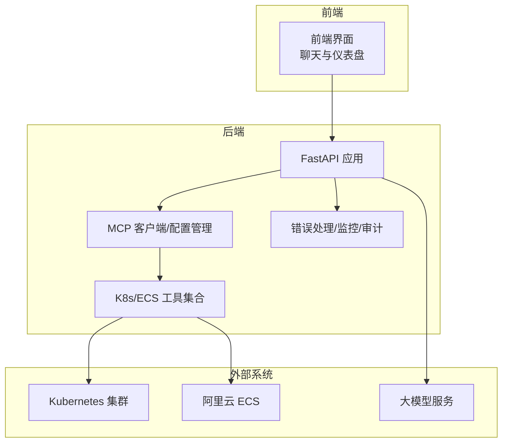
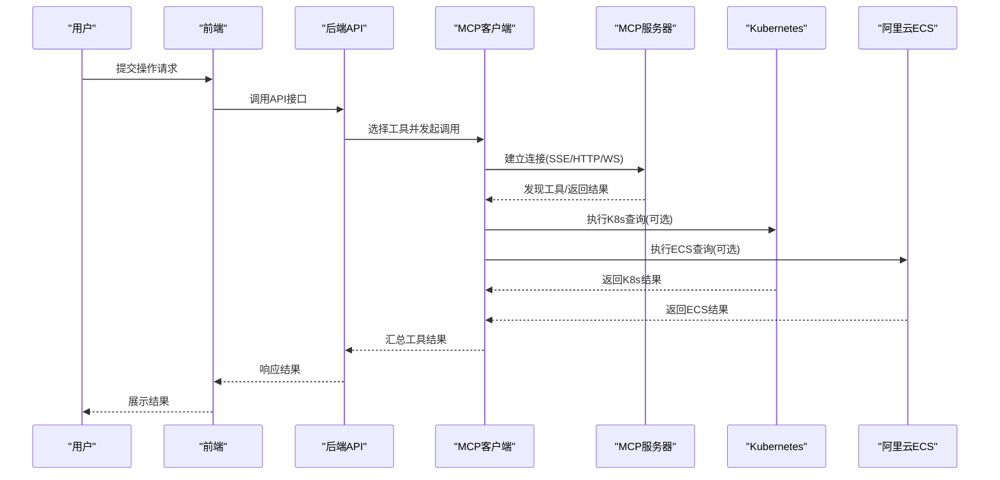
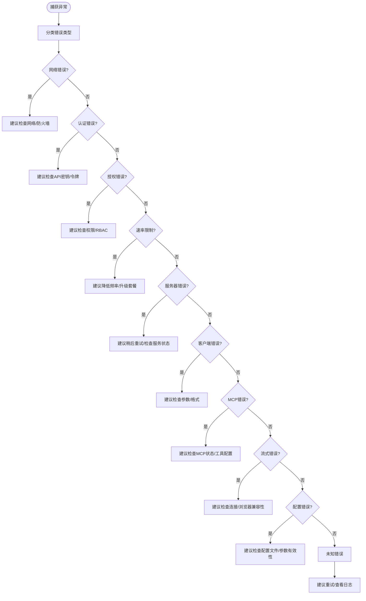
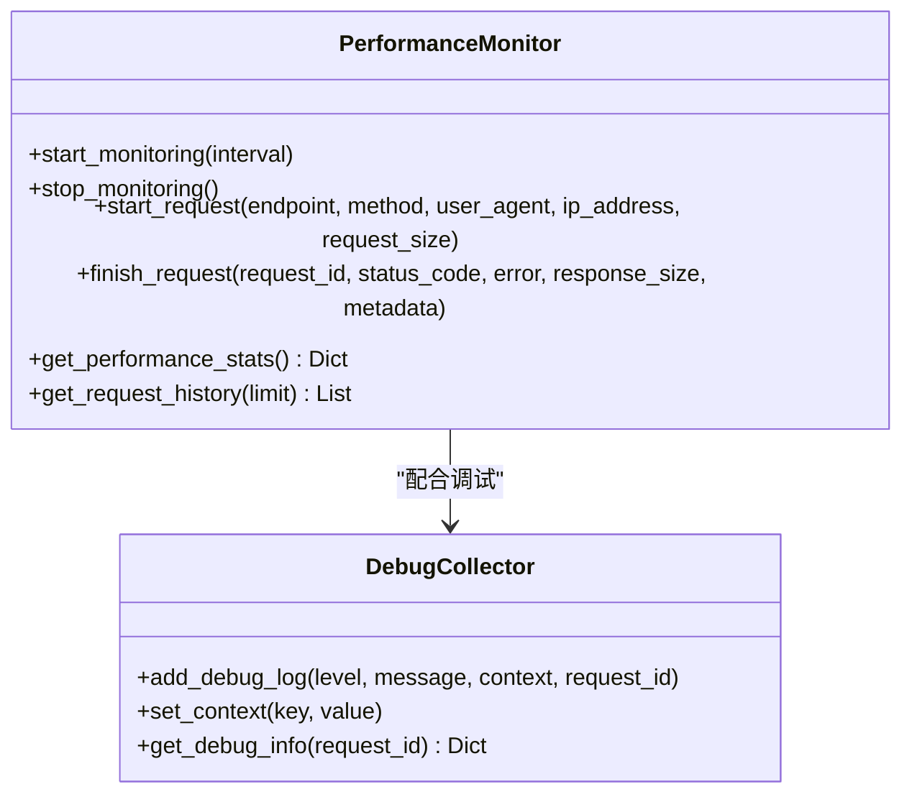
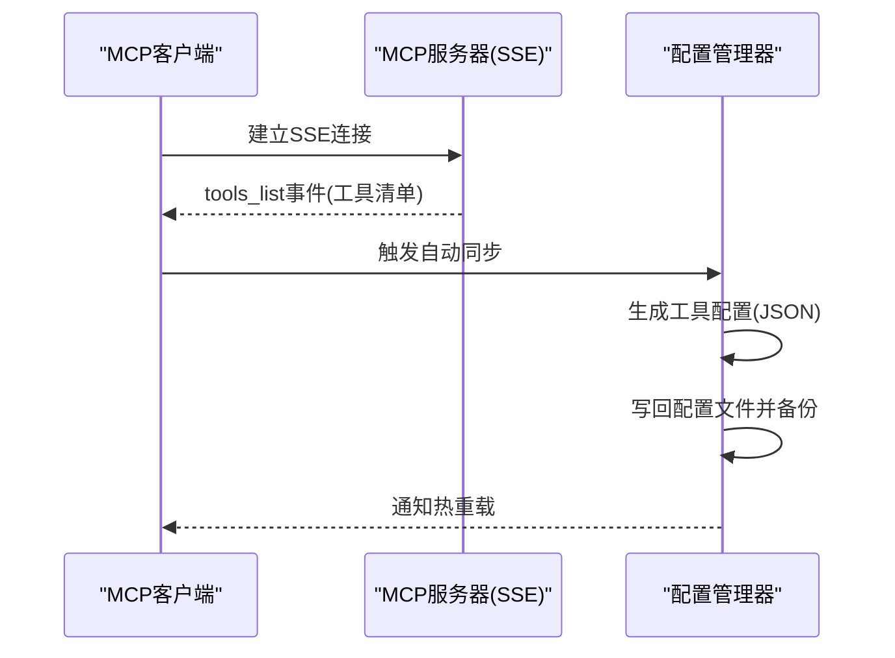
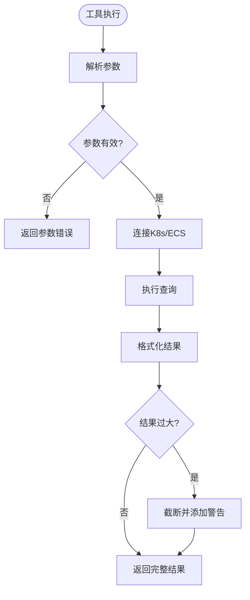
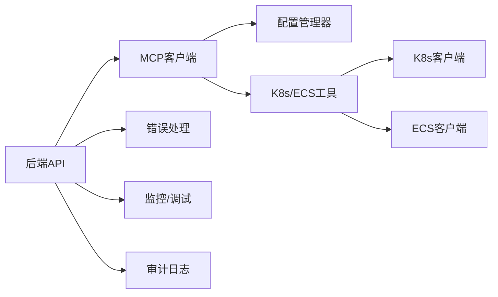

# 故障排除与FAQ

<cite>
**本文引用的文件**
- [故障排除与FAQ](file://project_document/wiki/k8s-ecs-mcp/09-troubleshooting-and-faq.md)
- [统一错误处理系统](file://backend/src/utils/error_handler.py)
- [调试与监控工具](file://backend/src/utils/monitoring.py)
- [审计日志](file://backend/src/security/audit.py)
- [增强的MCP客户端](file://backend/src/mcp/enhanced_client.py)
- [MCP配置管理器](file://backend/src/mcp/config_manager.py)
- [K8s获取Pod列表工具](file://backend/src/k8s_mcp/tools/k8s_get_pods.py)
- [ECS实例列表工具](file://backend/src/ecs_mcp/tools/ecs_list_instances.py)
- [MCP配置示例](file://config/mcp_config.example.json)
- [LLM配置示例](file://config/llm_config.example.json)
- [集成启动脚本](file://scripts/start_all.py)
- [K8s MCP配置](file://backend/src/k8s_mcp/config.py)
- [ECS MCP配置](file://backend/src/ecs_mcp/config.py)
- [后端配置示例](file://backend/config.env.example)
</cite>

## 目录
1. [简介](#简介)
2. [项目结构](#项目结构)
3. [核心组件](#核心组件)
4. [架构总览](#架构总览)
5. [详细组件分析](#详细组件分析)
6. [依赖关系分析](#依赖关系分析)
7. [性能考量](#性能考量)
8. [故障排除指南](#故障排除指南)
9. [结论](#结论)
10. [附录](#附录)

## 简介
本文件面向“钉钉K8s运维机器人”的使用者与维护者，提供系统性的故障排除与常见问题解答。内容覆盖安装、配置、使用过程中的常见问题，以及针对网络连接、配置错误、权限问题、性能问题的诊断与优化建议。同时包含MCP工具集成、Kubernetes连接、ECS访问等特定场景的排障指南，并说明如何收集与分析问题信息以获得更好的技术支持。

## 项目结构
该系统采用前后端一体化设计，核心能力包括：
- 后端服务：提供API、聊天、调度、权限与审计等能力
- MCP工具层：封装K8s与ECS工具，支持本地内置与远端MCP服务器两种模式
- 配置与监控：统一的配置管理、性能监控与调试信息收集
- 文档与示例：配置样例、启动脚本与排障指南

**图表来源**
- [集成启动脚本:225-292](file://scripts/start_all.py#L225-L292)
- [MCP配置示例:1-66](file://config/mcp_config.example.json#L1-L66)
- [K8s MCP配置:1-369](file://backend/src/k8s_mcp/config.py#L1-L369)
- [ECS MCP配置:1-63](file://backend/src/ecs_mcp/config.py#L1-L63)

**章节来源**
- [集成启动脚本:1-306](file://scripts/start_all.py#L1-L306)
- [MCP配置示例:1-66](file://config/mcp_config.example.json#L1-L66)

## 核心组件
- 统一错误处理系统：对网络、认证、授权、速率限制、服务器、客户端、MCP、流式、配置等错误进行分类与建议
- 性能监控与调试：请求追踪、系统指标、错误统计、调试日志收集
- MCP客户端与配置管理：支持SSE/HTTP/WS等连接方式，自动同步工具配置，热重载与备份
- K8s/ECS工具：封装常用查询与分析能力，具备参数校验与结果截断保护
- 审计日志：操作审计与敏感信息脱敏

**章节来源**
- [统一错误处理系统:1-334](file://backend/src/utils/error_handler.py#L1-L334)
- [调试与监控工具:1-396](file://backend/src/utils/monitoring.py#L1-L396)
- [增强的MCP客户端:1-800](file://backend/src/mcp/enhanced_client.py#L1-L800)
- [MCP配置管理器:1-948](file://backend/src/mcp/config_manager.py#L1-L948)
- [K8s获取Pod列表工具:1-169](file://backend/src/k8s_mcp/tools/k8s_get_pods.py#L1-L169)
- [ECS实例列表工具:1-115](file://backend/src/ecs_mcp/tools/ecs_list_instances.py#L1-L115)
- [审计日志:1-96](file://backend/src/security/audit.py#L1-L96)

## 架构总览
MCP工具通过统一客户端连接到本地内置或远端MCP服务器，后端API负责编排与权限控制，工具层对接K8s与ECS，提供查询、分析与告警能力。

**图表来源**
- [增强的MCP客户端:61-95](file://backend/src/mcp/enhanced_client.py#L61-L95)
- [MCP配置管理器:553-716](file://backend/src/mcp/config_manager.py#L553-L716)
- [K8s获取Pod列表工具:53-113](file://backend/src/k8s_mcp/tools/k8s_get_pods.py#L53-L113)
- [ECS实例列表工具:47-115](file://backend/src/ecs_mcp/tools/ecs_list_instances.py#L47-L115)

## 详细组件分析

### 组件A：统一错误处理系统
- 错误分类：网络、API、认证、授权、速率限制、服务器、客户端、MCP、流式、配置、未知
- 建议策略：依据错误类型给出针对性建议（如检查网络、认证方式、配置完整性等）
- 日志记录：按严重程度选择日志级别，便于定位问题

**图表来源**
- [统一错误处理系统:13-156](file://backend/src/utils/error_handler.py#L13-L156)

**章节来源**
- [统一错误处理系统:1-334](file://backend/src/utils/error_handler.py#L1-L334)

### 组件B：性能监控与调试
- 请求追踪：记录请求ID、端点、方法、耗时、状态码、错误与元数据
- 系统指标：CPU/内存/磁盘使用率、活跃连接数、请求量、错误率、平均响应时间
- 调试信息：带上下文的调试日志，支持按请求ID筛选

**图表来源**
- [调试与监控工具:51-396](file://backend/src/utils/monitoring.py#L51-L396)

**章节来源**
- [调试与监控工具:1-396](file://backend/src/utils/monitoring.py#L1-L396)

### 组件C：MCP客户端与配置管理
- 连接类型：SSE、HTTP、WebSocket、本地、子进程
- 自动同步：从SSE事件流自动同步工具配置到本地配置文件
- 验证与热重载：支持连接测试、模板、备份与热重载

**图表来源**
- [增强的MCP客户端:252-390](file://backend/src/mcp/enhanced_client.py#L252-L390)
- [MCP配置管理器:272-310](file://backend/src/mcp/config_manager.py#L272-L310)

**章节来源**
- [增强的MCP客户端:1-800](file://backend/src/mcp/enhanced_client.py#L1-L800)
- [MCP配置管理器:1-948](file://backend/src/mcp/config_manager.py#L1-L948)

### 组件D：K8s与ECS工具
- K8s工具：参数校验、连接K8s API、结果格式化、超大结果截断与警告
- ECS工具：AK配置检查、RPC调用、分页与状态过滤

**图表来源**
- [K8s获取Pod列表工具:53-113](file://backend/src/k8s_mcp/tools/k8s_get_pods.py#L53-L113)
- [ECS实例列表工具:47-115](file://backend/src/ecs_mcp/tools/ecs_list_instances.py#L47-L115)

**章节来源**
- [K8s获取Pod列表工具:1-169](file://backend/src/k8s_mcp/tools/k8s_get_pods.py#L1-L169)
- [ECS实例列表工具:1-115](file://backend/src/ecs_mcp/tools/ecs_list_instances.py#L1-L115)

## 依赖关系分析
- 后端API依赖MCP客户端与工具层
- MCP客户端依赖配置管理器与工具注册表
- 工具层依赖K8s/ECS客户端与配置
- 统一错误处理与监控为各模块提供横切能力

**图表来源**
- [增强的MCP客户端:1-800](file://backend/src/mcp/enhanced_client.py#L1-L800)
- [MCP配置管理器:1-948](file://backend/src/mcp/config_manager.py#L1-L948)
- [K8s获取Pod列表工具:1-169](file://backend/src/k8s_mcp/tools/k8s_get_pods.py#L1-L169)
- [ECS实例列表工具:1-115](file://backend/src/ecs_mcp/tools/ecs_list_instances.py#L1-L115)
- [统一错误处理系统:1-334](file://backend/src/utils/error_handler.py#L1-L334)
- [调试与监控工具:1-396](file://backend/src/utils/monitoring.py#L1-L396)
- [审计日志:1-96](file://backend/src/security/audit.py#L1-L96)

**章节来源**
- [增强的MCP客户端:1-800](file://backend/src/mcp/enhanced_client.py#L1-L800)
- [MCP配置管理器:1-948](file://backend/src/mcp/config_manager.py#L1-L948)

## 性能考量
- 监控指标：CPU/内存/磁盘使用率、活跃连接数、请求量、错误率、平均响应时间
- 调优建议：合理设置同步间隔、图查询深度、缓存策略、并发与超时
- 结果截断：当结果过大时自动截断并提示优化查询条件

**章节来源**
- [调试与监控工具:1-396](file://backend/src/utils/monitoring.py#L1-L396)
- [K8s获取Pod列表工具:89-103](file://backend/src/k8s_mcp/tools/k8s_get_pods.py#L89-L103)

## 故障排除指南

### 通用排障流程
1. 明确现象与错误类型（参考“错误类型与建议”）
2. 检查日志与错误响应（统一错误处理与监控）
3. 核对配置（MCP配置、K8s/ECS配置、后端配置）
4. 验证连接（MCP连接测试、K8s RBAC、ECS AK/SK）
5. 分析性能（监控指标、请求追踪）
6. 收集证据（审计日志、调试信息、请求历史）

**章节来源**
- [统一错误处理系统:1-334](file://backend/src/utils/error_handler.py#L1-L334)
- [调试与监控工具:1-396](file://backend/src/utils/monitoring.py#L1-L396)
- [审计日志:1-96](file://backend/src/security/audit.py#L1-L96)

### 常见问题与解答
- 阿里云相关
  - 现象：未配置阿里云AK/SK
    - 可能原因：环境变量未注入
    - 处理：检查后端配置文件或进程环境中的AK/SK变量
  - 现象：403/权限拒绝
    - 可能原因：Action缺失或Resource过窄
    - 处理：在RAM控制台搜索报错Action，补充策略
  - 现象：监控无数据、地域不对
    - 可能原因：实例不在默认地域
    - 处理：传入region_id或设置区域候选环境变量
  - 现象：连接超时
    - 可能原因：出站被防火墙拦截
    - 处理：放行ECS与CMS相关域名
  - 现象：CMS Action名不一致
    - 可能原因：产品与文档版本差异
    - 处理：以RAM控制台检索到的Action为准替换策略示例

- Kubernetes相关
  - 现象：Kubeconfig文件不存在
    - 可能原因：路径错误
    - 处理：设置KUBECONFIG_PATH或KUBECONFIG，或放置于默认路径
  - 现象：Forbidden/Unauthorized
    - 可能原因：RBAC不足
    - 处理：按RBAC与Kubeconfig指南补充ClusterRole或缩小命名空间
  - 现象：list_pod_for_all_namespaces失败
    - 可能原因：只有Namespace权限
    - 处理：不要使用all命名空间，或改为集群角色
  - 现象：pods/log 403
    - 可能原因：缺少子资源权限
    - 处理：在RBAC中增加pods/log的get权限

- Prometheus相关
  - 现象：未配置Prometheus URL
    - 可能原因：环境变量为空
    - 处理：配置可访问的Prometheus根URL
  - 现象：查询结果为空
    - 可能原因：PromQL与集群标签不一致
    - 处理：检查工具内的正则与命名空间匹配
  - 现象：401认证失败
    - 可能原因：认证方式或凭据错误
    - 处理：设置正确的认证类型与凭据

- Builtin未注册
  - 现象：工具列表无K8s/ECS
    - 可能原因：开关关闭
    - 处理：将BUILTIN_K8S_ECS_TOOLS设为true或删除变量
  - 现象：远程与builtin重复
    - 可能原因：配置问题
    - 处理：使用跳过列表或builtin实现标记

- FAQ
  - Q：进程内工具和远程MCP会重复吗？
    - A：若配置不当可能重复；用跳过列表与implementation=builtin对齐
  - Q：能否用STP替代长期AK？
    - A：当前RPC未传SecurityToken；需改造或走SDK统一凭证
  - Q：k8s_client里有写操作，是否安全？
    - A：当前SAFE_QUERY_TOOLS未暴露写工具；若合并写工具需单独RBAC
  - Q：Wiki与代码不一致听谁的？
    - A：以源码为准；请提PR更新Wiki

**章节来源**
- [故障排除与FAQ:1-56](file://project_document/wiki/k8s-ecs-mcp/09-troubleshooting-and-faq.md#L1-L56)

### 网络连接问题
- 检查MCP服务器连接（SSE/HTTP/WS）
- 使用配置管理器的连接测试功能
- 关注超时与重试配置
- 确认认证头与令牌

**章节来源**
- [MCP配置管理器:553-716](file://backend/src/mcp/config_manager.py#L553-L716)
- [增强的MCP客户端:114-245](file://backend/src/mcp/enhanced_client.py#L114-L245)

### 配置错误
- MCP配置：检查服务器类型、主机、端口、路径、超时、重试、工具启用列表
- K8s配置：检查kubeconfig路径、命名空间、端口、调试开关
- ECS配置：检查AK/SK、区域、调用超时与并发
- 后端配置：检查LLM、钉钉、日志级别等

**章节来源**
- [MCP配置示例:1-66](file://config/mcp_config.example.json#L1-L66)
- [K8s MCP配置:1-369](file://backend/src/k8s_mcp/config.py#L1-L369)
- [ECS MCP配置:1-63](file://backend/src/ecs_mcp/config.py#L1-L63)
- [后端配置示例:1-51](file://backend/config.env.example#L1-L51)

### 权限问题
- Kubernetes：确保RBAC包含所需Action与资源范围
- 阿里云：确保RAM策略包含所需Action与最小权限原则
- 工具权限：MCP工具启用列表与权限映射

**章节来源**
- [故障排除与FAQ:15-31](file://project_document/wiki/k8s-ecs-mcp/09-troubleshooting-and-faq.md#L15-L31)
- [增强的MCP客户端:321-504](file://backend/src/mcp/enhanced_client.py#L321-L504)

### 性能问题
- 使用性能监控查看CPU/内存/磁盘与活跃连接数
- 分析请求历史与端点统计，识别热点与异常
- 调整同步间隔、图查询深度、缓存与并发
- 对超大结果进行截断与分页查询

**章节来源**
- [调试与监控工具:1-396](file://backend/src/utils/monitoring.py#L1-L396)
- [K8s获取Pod列表工具:89-103](file://backend/src/k8s_mcp/tools/k8s_get_pods.py#L89-L103)

### MCP工具集成与Kubernetes连接
- 使用配置管理器创建/更新服务器与工具
- 自动同步工具配置并备份
- 连接测试与热重载
- K8s连接：检查kubeconfig路径与命名空间，确保RBAC权限

**章节来源**
- [MCP配置管理器:1-948](file://backend/src/mcp/config_manager.py#L1-L948)
- [增强的MCP客户端:1-800](file://backend/src/mcp/enhanced_client.py#L1-L800)
- [K8s MCP配置:168-267](file://backend/src/k8s_mcp/config.py#L168-L267)

### ECS访问
- 确认AK/SK配置与区域设置
- 使用RPC调用绕过SDK凭证链兼容问题
- 分页与状态过滤参数校验

**章节来源**
- [ECS实例列表工具:1-115](file://backend/src/ecs_mcp/tools/ecs_list_instances.py#L1-L115)
- [ECS MCP配置:44-63](file://backend/src/ecs_mcp/config.py#L44-L63)

### 如何收集与分析问题信息
- 统一错误响应：包含错误类型、建议、时间戳与上下文
- 错误日志：按严重程度记录，支持traceback
- 性能统计：请求总数、平均耗时、错误率、端点统计
- 调试信息：按请求ID聚合的日志与上下文
- 审计日志：操作审计与敏感信息脱敏

**章节来源**
- [统一错误处理系统:158-244](file://backend/src/utils/error_handler.py#L158-L244)
- [调试与监控工具:207-396](file://backend/src/utils/monitoring.py#L207-L396)
- [审计日志:21-96](file://backend/src/security/audit.py#L21-L96)

### 社区支持与问题反馈
- 以源码为准：若Wiki与代码不一致，以源码为准
- 提交PR更新：欢迎提交Wiki修复与改进
- 问题反馈：结合统一错误响应与性能统计信息，便于技术支持定位

**章节来源**
- [故障排除与FAQ:50-51](file://project_document/wiki/k8s-ecs-mcp/09-troubleshooting-and-faq.md#L50-L51)

### 已知问题与临时方案
- STS替代长期AK：当前RPC未传SecurityToken，需改造或走SDK统一凭证
- 工具重复：进程内与远程MCP重复时，使用跳过列表与builtin实现标记对齐

**章节来源**
- [故障排除与FAQ:44-48](file://project_document/wiki/k8s-ecs-mcp/09-troubleshooting-and-faq.md#L44-L48)

## 结论
通过统一错误处理、性能监控与调试工具、MCP配置管理与连接测试，以及完善的K8s/ECS工具封装，本系统提供了系统化的故障排除与优化能力。建议在日常运维中结合配置示例与排障指南，定期检查连接状态与性能指标，确保工具与权限配置正确，以获得稳定可靠的自动化运维体验。

## 附录
- 启动顺序：先启动MCP服务（如启用），再启动后端服务
- 配置迁移：配置管理器支持迁移与备份，建议统一使用标准路径

**章节来源**
- [集成启动脚本:162-223](file://scripts/start_all.py#L162-L223)
- [MCP配置管理器:94-139](file://backend/src/mcp/config_manager.py#L94-L139)