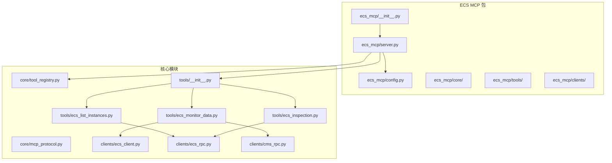
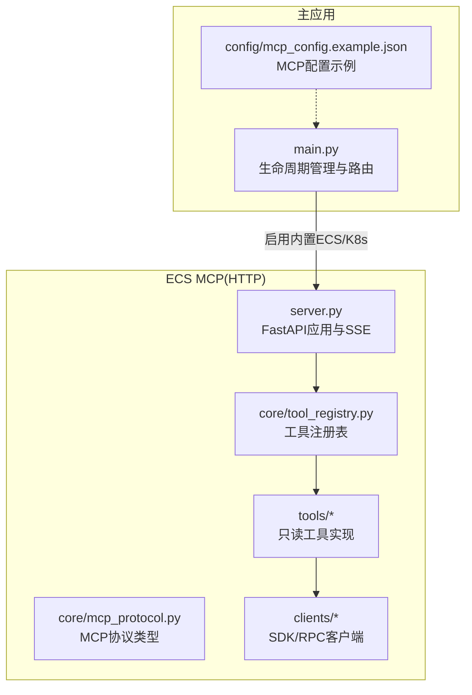
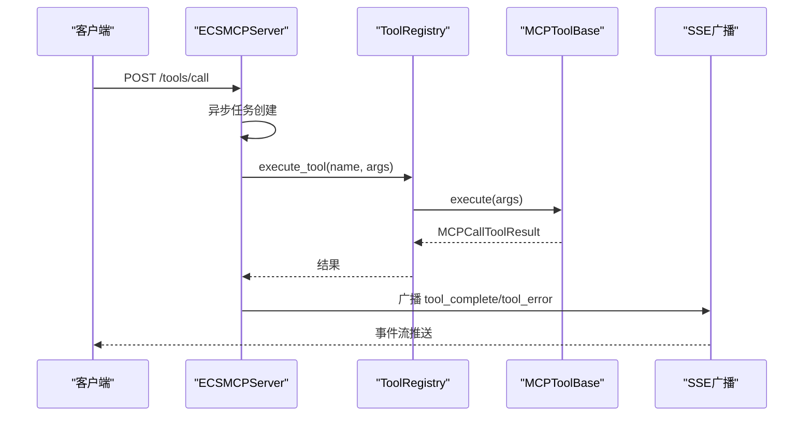
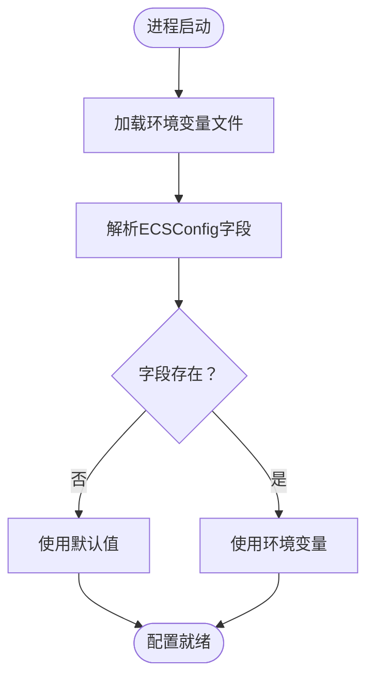
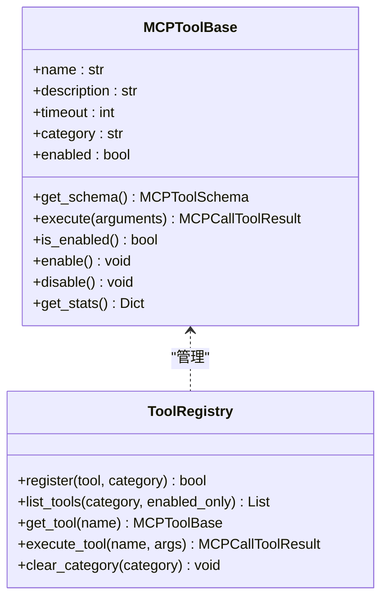
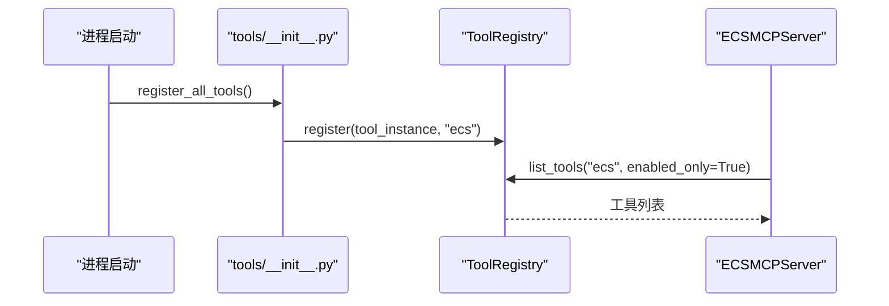
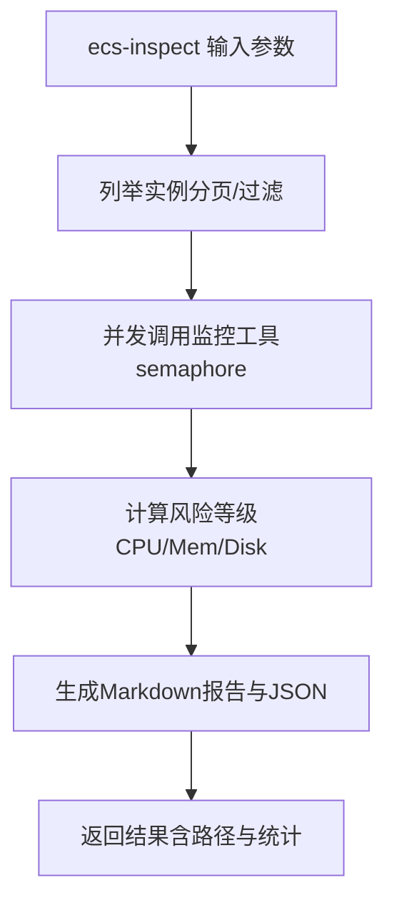
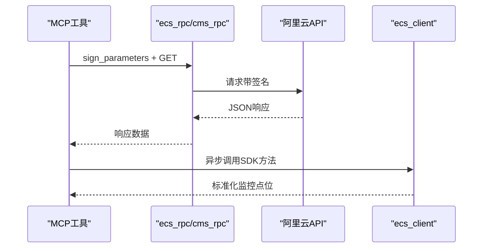
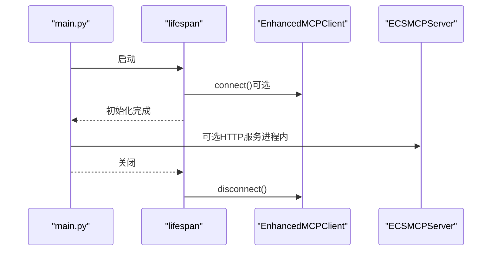
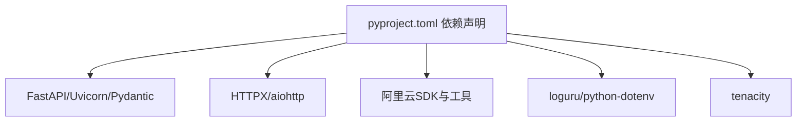

# ECS MCP架构设计

<cite>
**本文引用的文件**
- [backend/src/ecs_mcp/__init__.py](file://backend/src/ecs_mcp/__init__.py)
- [backend/src/ecs_mcp/server.py](file://backend/src/ecs_mcp/server.py)
- [backend/src/ecs_mcp/config.py](file://backend/src/ecs_mcp/config.py)
- [backend/src/ecs_mcp/core/mcp_protocol.py](file://backend/src/ecs_mcp/core/mcp_protocol.py)
- [backend/src/ecs_mcp/core/tool_registry.py](file://backend/src/ecs_mcp/core/tool_registry.py)
- [backend/src/ecs_mcp/tools/__init__.py](file://backend/src/ecs_mcp/tools/__init__.py)
- [backend/src/ecs_mcp/tools/ecs_inspection.py](file://backend/src/ecs_mcp/tools/ecs_inspection.py)
- [backend/src/ecs_mcp/tools/ecs_list_instances.py](file://backend/src/ecs_mcp/tools/ecs_list_instances.py)
- [backend/src/ecs_mcp/tools/ecs_monitor_data.py](file://backend/src/ecs_mcp/tools/ecs_monitor_data.py)
- [backend/src/ecs_mcp/clients/ecs_client.py](file://backend/src/ecs_mcp/clients/ecs_client.py)
- [backend/src/ecs_mcp/clients/ecs_rpc.py](file://backend/src/ecs_mcp/clients/ecs_rpc.py)
- [backend/src/ecs_mcp/clients/cms_rpc.py](file://backend/src/ecs_mcp/clients/cms_rpc.py)
- [backend/main.py](file://backend/main.py)
- [pyproject.toml](file://pyproject.toml)
- [config/mcp_config.example.json](file://config/mcp_config.example.json)
</cite>

## 目录
1. [引言](#引言)
2. [项目结构](#项目结构)
3. [核心组件](#核心组件)
4. [架构总览](#架构总览)
5. [详细组件分析](#详细组件分析)
6. [依赖关系分析](#依赖关系分析)
7. [性能考量](#性能考量)
8. [故障排查指南](#故障排查指南)
9. [结论](#结论)
10. [附录](#附录)

## 引言
本文件面向ECS MCP（Model Context Protocol）架构设计，聚焦于基于阿里云ECS监控的只读巡检工具集与HTTP服务集成方案。文档从包结构组织、核心组件设计、MCP协议集成、服务器初始化与生命周期、配置加载机制、与阿里云ECS服务的集成（认证、API网关、数据传输层）、工具注册系统（发现、路由分发、状态管理）、错误处理与异常恢复（重试、超时、降级）等方面进行系统化阐述，并辅以架构图与组件关系说明，帮助开发者快速理解并扩展该系统。

## 项目结构
ECS MCP相关代码位于后端子包backend/src/ecs_mcp下，采用“按功能域划分”的包结构组织：
- ecs_mcp包：对外提供ECS MCP HTTP服务入口与工具集
- core子包：MCP协议类型定义与工具注册表
- tools子包：具体工具实现（只读查询）
- clients子包：阿里云SDK与RPC客户端封装
- config模块：ECS MCP专用配置加载与解析

**图表来源**
- [backend/src/ecs_mcp/__init__.py:1-6](file://backend/src/ecs_mcp/__init__.py#L1-L6)
- [backend/src/ecs_mcp/server.py:1-280](file://backend/src/ecs_mcp/server.py#L1-L280)
- [backend/src/ecs_mcp/config.py:1-63](file://backend/src/ecs_mcp/config.py#L1-L63)
- [backend/src/ecs_mcp/core/mcp_protocol.py:1-53](file://backend/src/ecs_mcp/core/mcp_protocol.py#L1-L53)
- [backend/src/ecs_mcp/core/tool_registry.py:1-140](file://backend/src/ecs_mcp/core/tool_registry.py#L1-L140)
- [backend/src/ecs_mcp/tools/__init__.py:1-47](file://backend/src/ecs_mcp/tools/__init__.py#L1-L47)
- [backend/src/ecs_mcp/tools/ecs_list_instances.py:1-115](file://backend/src/ecs_mcp/tools/ecs_list_instances.py#L1-L115)
- [backend/src/ecs_mcp/tools/ecs_monitor_data.py:1-479](file://backend/src/ecs_mcp/tools/ecs_monitor_data.py#L1-L479)
- [backend/src/ecs_mcp/tools/ecs_inspection.py:1-324](file://backend/src/ecs_mcp/tools/ecs_inspection.py#L1-L324)
- [backend/src/ecs_mcp/clients/ecs_client.py:1-86](file://backend/src/ecs_mcp/clients/ecs_client.py#L1-L86)
- [backend/src/ecs_mcp/clients/ecs_rpc.py:1-65](file://backend/src/ecs_mcp/clients/ecs_rpc.py#L1-L65)
- [backend/src/ecs_mcp/clients/cms_rpc.py:1-66](file://backend/src/ecs_mcp/clients/cms_rpc.py#L1-L66)

**章节来源**
- [backend/src/ecs_mcp/__init__.py:1-6](file://backend/src/ecs_mcp/__init__.py#L1-L6)
- [backend/src/ecs_mcp/server.py:1-280](file://backend/src/ecs_mcp/server.py#L1-L280)
- [backend/src/ecs_mcp/config.py:1-63](file://backend/src/ecs_mcp/config.py#L1-L63)

## 核心组件
- ECS MCP服务器：基于FastAPI的HTTP服务，提供SSE事件流、工具列表查询、工具调用与刷新接口，内置工具注册与广播事件能力。
- 配置管理：ECSConfig模型负责加载环境变量与默认值，支持主机、端口、调试开关、阿里云AK/SK、区域、调用超时、重试次数、最大并发等。
- MCP协议类型：定义错误码、工具Schema、调用结果封装与请求ID生成。
- 工具注册表：抽象工具基类、注册表、装饰器注册与执行流程，支持启用/禁用、统计信息与错误封装。
- 工具集：提供只读查询工具（实例列表、监控数据、批量巡检），均实现MCPToolBase并注册到注册表。
- 客户端：SDK客户端与RPC客户端（ECS、CMS），统一签名与HTTP调用，支持超时控制与错误传播。

**章节来源**
- [backend/src/ecs_mcp/server.py:43-280](file://backend/src/ecs_mcp/server.py#L43-L280)
- [backend/src/ecs_mcp/config.py:44-63](file://backend/src/ecs_mcp/config.py#L44-L63)
- [backend/src/ecs_mcp/core/mcp_protocol.py:14-53](file://backend/src/ecs_mcp/core/mcp_protocol.py#L14-L53)
- [backend/src/ecs_mcp/core/tool_registry.py:15-140](file://backend/src/ecs_mcp/core/tool_registry.py#L15-L140)
- [backend/src/ecs_mcp/tools/__init__.py:12-47](file://backend/src/ecs_mcp/tools/__init__.py#L12-L47)

## 架构总览
ECS MCP整体架构围绕“HTTP服务 + 工具注册表 + 阿里云客户端”展开，采用事件驱动与异步执行，支持SSE事件推送与工具调用结果广播。主应用backend/main.py通过MCP配置管理器决定是否启用内置ECS/K8s工具，从而在进程内提供工具能力，无需单独启动ECS MCP服务。

**图表来源**
- [backend/main.py:137-270](file://backend/main.py#L137-L270)
- [config/mcp_config.example.json:1-66](file://config/mcp_config.example.json#L1-L66)
- [backend/src/ecs_mcp/server.py:43-280](file://backend/src/ecs_mcp/server.py#L43-L280)
- [backend/src/ecs_mcp/core/tool_registry.py:60-140](file://backend/src/ecs_mcp/core/tool_registry.py#L60-L140)
- [backend/src/ecs_mcp/core/mcp_protocol.py:14-53](file://backend/src/ecs_mcp/core/mcp_protocol.py#L14-L53)
- [backend/src/ecs_mcp/tools/ecs_list_instances.py:23-115](file://backend/src/ecs_mcp/tools/ecs_list_instances.py#L23-L115)
- [backend/src/ecs_mcp/tools/ecs_monitor_data.py:75-479](file://backend/src/ecs_mcp/tools/ecs_monitor_data.py#L75-L479)
- [backend/src/ecs_mcp/tools/ecs_inspection.py:28-324](file://backend/src/ecs_mcp/tools/ecs_inspection.py#L28-L324)
- [backend/src/ecs_mcp/clients/ecs_client.py:18-86](file://backend/src/ecs_mcp/clients/ecs_client.py#L18-L86)
- [backend/src/ecs_mcp/clients/ecs_rpc.py:58-65](file://backend/src/ecs_mcp/clients/ecs_rpc.py#L58-L65)
- [backend/src/ecs_mcp/clients/cms_rpc.py:56-66](file://backend/src/ecs_mcp/clients/cms_rpc.py#L56-L66)

## 详细组件分析

### ECS MCP服务器（FastAPI）
- 初始化与生命周期：构造FastAPI应用、设置日志、注册路由、构建工具集。
- 路由与接口：
  - 根路径与健康检查
  - 工具列表查询（按类别过滤）
  - 工具调用（异步执行，立即返回受理）
  - 工具刷新（清空类别并重新注册）
  - SSE事件流（连接、心跳、工具列表、执行结果广播）
- 事件与序列化：SSE事件格式化、客户端队列管理、结果序列化与错误兜底。
- 启动方式：支持热重载与普通模式，读取ECS MCP配置。

**图表来源**
- [backend/src/ecs_mcp/server.py:131-167](file://backend/src/ecs_mcp/server.py#L131-L167)
- [backend/src/ecs_mcp/server.py:234-246](file://backend/src/ecs_mcp/server.py#L234-L246)
- [backend/src/ecs_mcp/core/tool_registry.py:102-120](file://backend/src/ecs_mcp/core/tool_registry.py#L102-L120)

**章节来源**
- [backend/src/ecs_mcp/server.py:43-280](file://backend/src/ecs_mcp/server.py#L43-L280)

### 配置管理（ECSConfig）
- 环境变量加载：优先加载项目内config.env，其次回退到归档目录与根目录的环境文件。
- ECS MCP配置项：主机、端口、调试、阿里云AK/SK、区域、调用超时、重试次数、最大并发。
- 通用配置：主应用MCP配置示例文件展示了全局超时、重试、并发、缓存、工具启用列表等。

**图表来源**
- [backend/src/ecs_mcp/config.py:11-63](file://backend/src/ecs_mcp/config.py#L11-L63)
- [config/mcp_config.example.json:1-66](file://config/mcp_config.example.json#L1-L66)

**章节来源**
- [backend/src/ecs_mcp/config.py:11-63](file://backend/src/ecs_mcp/config.py#L11-L63)
- [config/mcp_config.example.json:1-66](file://config/mcp_config.example.json#L1-L66)

### MCP协议类型与工具基类
- 错误码：涵盖JSON-RPC与MCP特定错误。
- 工具Schema：名称、描述、输入Schema、超时、分类。
- 调用结果：成功/错误封装，支持文本内容与错误详情。
- 工具基类：抽象方法（get_schema、execute）、启用/禁用、统计信息。
- 注册表：注册、发现、执行、清空分类、装饰器注册。

**图表来源**
- [backend/src/ecs_mcp/core/mcp_protocol.py:14-53](file://backend/src/ecs_mcp/core/mcp_protocol.py#L14-L53)
- [backend/src/ecs_mcp/core/tool_registry.py:15-140](file://backend/src/ecs_mcp/core/tool_registry.py#L15-L140)

**章节来源**
- [backend/src/ecs_mcp/core/mcp_protocol.py:14-53](file://backend/src/ecs_mcp/core/mcp_protocol.py#L14-L53)
- [backend/src/ecs_mcp/core/tool_registry.py:15-140](file://backend/src/ecs_mcp/core/tool_registry.py#L15-L140)

### 工具注册系统（发现、路由分发、状态管理）
- 工具发现与注册：tools/__init__.py集中导入并注册工具，支持清空旧列表避免重复注册。
- 路由分发：ECSMCPServer根据工具名在注册表中查找并异步执行。
- 状态管理：工具启停、执行计数、最近执行时间，便于可观测与治理。

**图表来源**
- [backend/src/ecs_mcp/tools/__init__.py:12-47](file://backend/src/ecs_mcp/tools/__init__.py#L12-L47)
- [backend/src/ecs_mcp/core/tool_registry.py:68-98](file://backend/src/ecs_mcp/core/tool_registry.py#L68-L98)
- [backend/src/ecs_mcp/server.py:108-127](file://backend/src/ecs_mcp/server.py#L108-L127)

**章节来源**
- [backend/src/ecs_mcp/tools/__init__.py:12-47](file://backend/src/ecs_mcp/tools/__init__.py#L12-L47)
- [backend/src/ecs_mcp/core/tool_registry.py:68-127](file://backend/src/ecs_mcp/core/tool_registry.py#L68-L127)
- [backend/src/ecs_mcp/server.py:108-167](file://backend/src/ecs_mcp/server.py#L108-L167)

### 工具实现（只读查询）
- ecs-list-instances：列举实例，支持状态过滤与分页，使用RPC调用ECS接口。
- ecs-describe-instance-monitor-data：查询实例监控数据，自动选择period、分片聚合、下采样与统计。
- ecs-inspect：批量巡检，按条件筛选实例，调用监控工具聚合风险并生成报告。

**图表来源**
- [backend/src/ecs_mcp/tools/ecs_inspection.py:77-324](file://backend/src/ecs_mcp/tools/ecs_inspection.py#L77-L324)
- [backend/src/ecs_mcp/tools/ecs_monitor_data.py:103-479](file://backend/src/ecs_mcp/tools/ecs_monitor_data.py#L103-L479)
- [backend/src/ecs_mcp/tools/ecs_list_instances.py:47-115](file://backend/src/ecs_mcp/tools/ecs_list_instances.py#L47-L115)

**章节来源**
- [backend/src/ecs_mcp/tools/ecs_list_instances.py:23-115](file://backend/src/ecs_mcp/tools/ecs_list_instances.py#L23-L115)
- [backend/src/ecs_mcp/tools/ecs_monitor_data.py:75-479](file://backend/src/ecs_mcp/tools/ecs_monitor_data.py#L75-L479)
- [backend/src/ecs_mcp/tools/ecs_inspection.py:28-324](file://backend/src/ecs_mcp/tools/ecs_inspection.py#L28-L324)

### 与阿里云ECS服务的集成
- 认证机制：通过ECSConfig加载AK/SK与SecurityToken，RPC客户端使用HMAC-SHA1签名。
- API网关与数据传输层：
  - ECS接口：ecs_rpc.py封装签名与GET请求，支持自定义endpoint。
  - CMS接口：cms_rpc.py封装签名与GET请求，支持区域域名与公共域名。
  - SDK封装：ecs_client.py异步包装SDK客户端，避免凭证链兼容问题。
- 数据流：工具通过RPC/SDK调用阿里云API，解析响应并返回标准化结果。

**图表来源**
- [backend/src/ecs_mcp/clients/ecs_rpc.py:58-65](file://backend/src/ecs_mcp/clients/ecs_rpc.py#L58-L65)
- [backend/src/ecs_mcp/clients/cms_rpc.py:56-66](file://backend/src/ecs_mcp/clients/cms_rpc.py#L56-L66)
- [backend/src/ecs_mcp/clients/ecs_client.py:34-86](file://backend/src/ecs_mcp/clients/ecs_client.py#L34-L86)
- [backend/src/ecs_mcp/tools/ecs_monitor_data.py:200-250](file://backend/src/ecs_mcp/tools/ecs_monitor_data.py#L200-L250)
- [backend/src/ecs_mcp/tools/ecs_list_instances.py:70-76](file://backend/src/ecs_mcp/tools/ecs_list_instances.py#L70-L76)

**章节来源**
- [backend/src/ecs_mcp/clients/ecs_rpc.py:27-65](file://backend/src/ecs_mcp/clients/ecs_rpc.py#L27-L65)
- [backend/src/ecs_mcp/clients/cms_rpc.py:34-66](file://backend/src/ecs_mcp/clients/cms_rpc.py#L34-L66)
- [backend/src/ecs_mcp/clients/ecs_client.py:18-86](file://backend/src/ecs_mcp/clients/ecs_client.py#L18-L86)
- [backend/src/ecs_mcp/tools/ecs_monitor_data.py:103-479](file://backend/src/ecs_mcp/tools/ecs_monitor_data.py#L103-L479)
- [backend/src/ecs_mcp/tools/ecs_list_instances.py:47-115](file://backend/src/ecs_mcp/tools/ecs_list_instances.py#L47-L115)

### 生命周期管理与主应用集成
- 主应用生命周期：通过lifespan钩子初始化MCP客户端、LLM处理器、钉钉机器人等服务，支持异常降级与清理。
- ECS MCP集成：主应用通过MCP配置管理器决定是否启用内置ECS/K8s工具，从而在进程内提供工具能力，无需单独启动ECS MCP服务。

**图表来源**
- [backend/main.py:137-270](file://backend/main.py#L137-L270)
- [config/mcp_config.example.json:13-54](file://config/mcp_config.example.json#L13-L54)
- [backend/src/ecs_mcp/server.py:248-280](file://backend/src/ecs_mcp/server.py#L248-L280)

**章节来源**
- [backend/main.py:137-270](file://backend/main.py#L137-L270)
- [config/mcp_config.example.json:13-54](file://config/mcp_config.example.json#L13-L54)
- [backend/src/ecs_mcp/server.py:248-280](file://backend/src/ecs_mcp/server.py#L248-L280)

## 依赖关系分析
- 语言与框架：Python 3.11-3.13、FastAPI、Uvicorn、Pydantic、HTTPX。
- 阿里云SDK与客户端：alibabacloud_ecs20140526、alibabacloud_tea_openapi、credentials。
- 工具与安全：loguru、python-dotenv、cryptography、tenacity（重试）。
- 项目脚本：Poetry脚本提供开发、构建、启动与清理。

**图表来源**
- [pyproject.toml:9-51](file://pyproject.toml#L9-L51)

**章节来源**
- [pyproject.toml:9-51](file://pyproject.toml#L9-L51)

## 性能考量
- 并发与限流：工具执行支持信号量限流与最大并发配置，避免资源争用。
- 下采样与分片：监控工具自动选择period、分片聚合与下采样，控制返回点数不超过上限。
- 超时与重试：配置层提供调用超时、重试次数与延迟，客户端层设置HTTP超时。
- SSE心跳：SSE流保持长连接并定期发送心跳，维持连接活跃。

**章节来源**
- [backend/src/ecs_mcp/tools/ecs_monitor_data.py:46-64](file://backend/src/ecs_mcp/tools/ecs_monitor_data.py#L46-L64)
- [backend/src/ecs_mcp/tools/ecs_monitor_data.py:175-198](file://backend/src/ecs_mcp/tools/ecs_monitor_data.py#L175-L198)
- [backend/src/ecs_mcp/config.py:56-58](file://backend/src/ecs_mcp/config.py#L56-L58)
- [backend/src/ecs_mcp/clients/ecs_rpc.py:61-65](file://backend/src/ecs_mcp/clients/ecs_rpc.py#L61-L65)
- [backend/src/ecs_mcp/clients/cms_rpc.py:59-63](file://backend/src/ecs_mcp/clients/cms_rpc.py#L59-L63)
- [backend/src/ecs_mcp/server.py:220-225](file://backend/src/ecs_mcp/server.py#L220-L225)

## 故障排查指南
- 配置加载失败：确认环境变量文件路径与权限，检查ECS MCP与主应用配置文件加载顺序。
- 工具注册失败：查看注册日志，确认工具类正确继承MCPToolBase并通过装饰器或直接注册。
- 阿里云调用失败：核对AK/SK与区域配置，检查RPC签名与HTTP状态码，关注SDK异常并记录堆栈。
- SSE连接异常：检查防火墙与代理，确认SSE心跳与客户端断开日志。
- 重试与降级：MCP客户端初始化失败时会降级为无工具模式，确保主应用仍可运行。

**章节来源**
- [backend/src/ecs_mcp/config.py:11-41](file://backend/src/ecs_mcp/config.py#L11-L41)
- [backend/src/ecs_mcp/core/tool_registry.py:68-86](file://backend/src/ecs_mcp/core/tool_registry.py#L68-L86)
- [backend/src/ecs_mcp/clients/ecs_rpc.py:58-65](file://backend/src/ecs_mcp/clients/ecs_rpc.py#L58-L65)
- [backend/src/ecs_mcp/server.py:201-233](file://backend/src/ecs_mcp/server.py#L201-L233)
- [backend/main.py:183-188](file://backend/main.py#L183-L188)

## 结论
ECS MCP架构以“进程内工具 + HTTP服务 + SSE事件流”为核心，结合MCP协议与工具注册表，实现了对阿里云ECS只读查询的标准化与可扩展化。通过清晰的包结构、严格的生命周期管理、完善的配置与错误处理机制，系统既满足快速迭代需求，又具备良好的稳定性与可观测性。未来可在工具路由、缓存与鉴权方面进一步增强，以适配更复杂的运维场景。

## 附录
- 环境变量与配置文件：参考ECS MCP配置与主应用MCP配置示例，确保AK/SK、区域、超时与并发等参数正确设置。
- 依赖安装：使用Poetry管理依赖，注意Python版本与第三方库兼容性。

**章节来源**
- [backend/src/ecs_mcp/config.py:11-63](file://backend/src/ecs_mcp/config.py#L11-L63)
- [config/mcp_config.example.json:1-66](file://config/mcp_config.example.json#L1-L66)
- [pyproject.toml:9-51](file://pyproject.toml#L9-L51)