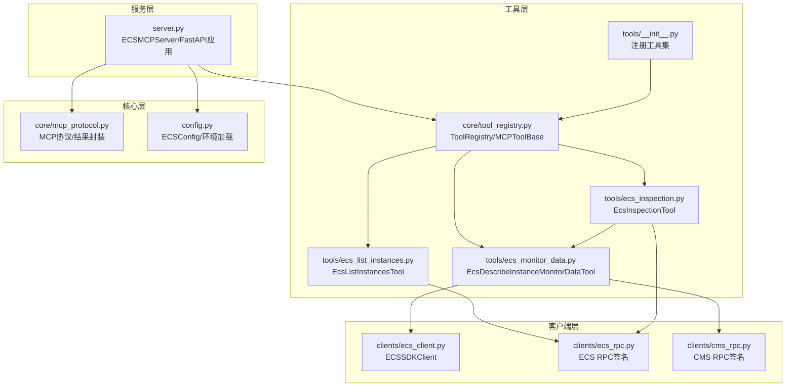
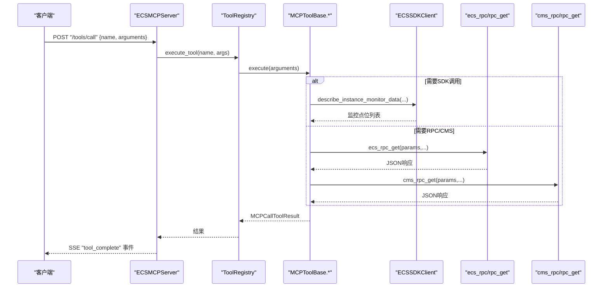
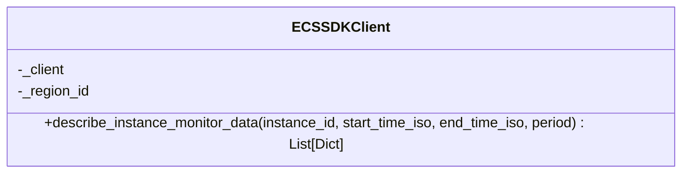
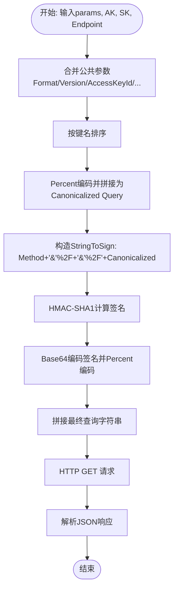
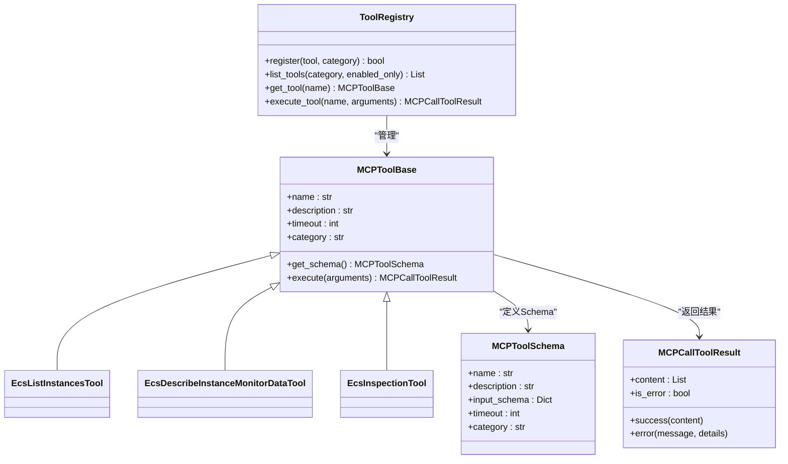
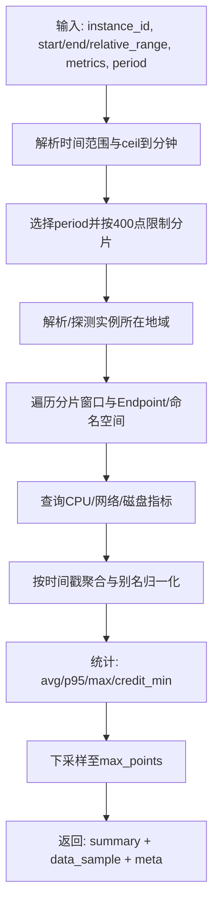
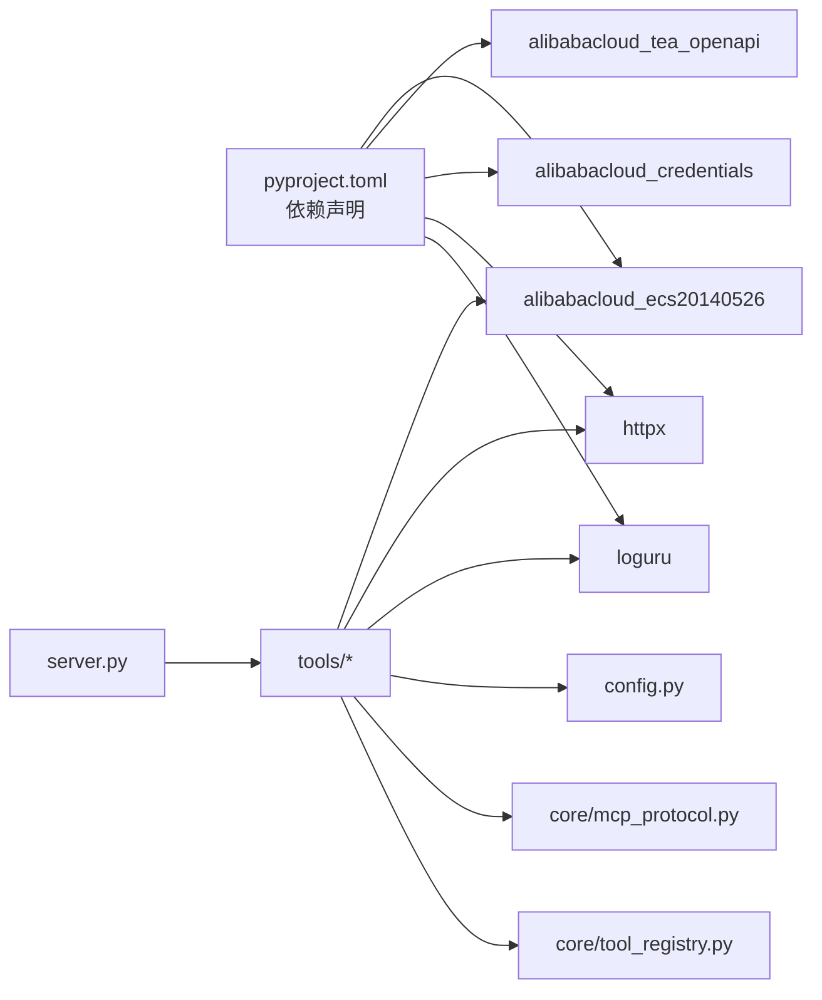

# ECS客户端集成

<cite>
**本文引用的文件**
- [backend/src/ecs_mcp/clients/ecs_client.py](file://backend/src/ecs_mcp/clients/ecs_client.py)
- [backend/src/ecs_mcp/clients/ecs_rpc.py](file://backend/src/ecs_mcp/clients/ecs_rpc.py)
- [backend/src/ecs_mcp/clients/cms_rpc.py](file://backend/src/ecs_mcp/clients/cms_rpc.py)
- [backend/src/ecs_mcp/config.py](file://backend/src/ecs_mcp/config.py)
- [backend/src/ecs_mcp/server.py](file://backend/src/ecs_mcp/server.py)
- [backend/src/ecs_mcp/core/mcp_protocol.py](file://backend/src/ecs_mcp/core/mcp_protocol.py)
- [backend/src/ecs_mcp/core/tool_registry.py](file://backend/src/ecs_mcp/core/tool_registry.py)
- [backend/src/ecs_mcp/tools/__init__.py](file://backend/src/ecs_mcp/tools/__init__.py)
- [backend/src/ecs_mcp/tools/ecs_monitor_data.py](file://backend/src/ecs_mcp/tools/ecs_monitor_data.py)
- [backend/src/ecs_mcp/tools/ecs_list_instances.py](file://backend/src/ecs_mcp/tools/ecs_list_instances.py)
- [backend/src/ecs_mcp/tools/ecs_inspection.py](file://backend/src/ecs_mcp/tools/ecs_inspection.py)
- [pyproject.toml](file://pyproject.toml)
- [backend/config.env.example](file://backend/config.env.example)
</cite>

## 目录
1. [简介](#简介)
2. [项目结构](#项目结构)
3. [核心组件](#核心组件)
4. [架构总览](#架构总览)
5. [详细组件分析](#详细组件分析)
6. [依赖分析](#依赖分析)
7. [性能考虑](#性能考虑)
8. [故障排除指南](#故障排除指南)
9. [结论](#结论)
10. [附录](#附录)

## 简介
本文件面向开发者，系统性说明阿里云ECS客户端在本项目的集成实现，涵盖SDK封装、RPC客户端与CMS RPC适配器、认证配置、请求签名与响应解析、RPC客户端的连接管理与并发控制、CMS适配器的协议转换与兼容性处理、配置管理（凭证、超时与重试）、使用示例与故障排除。目标是帮助你在现有后端架构中正确集成并稳定使用ECS MCP能力。

## 项目结构
ECS MCP相关代码位于 backend/src/ecs_mcp 下，采用“服务 + 工具 + 客户端 + 核心协议”的分层组织：
- 服务层：基于FastAPI的HTTP服务器，提供SSE事件流与工具调用接口
- 工具层：MCP工具集合，封装具体业务操作（实例列表、监控查询、批量巡检）
- 客户端层：SDK封装与RPC签名调用（ECS与CMS）
- 核心层：MCP协议定义与工具注册表

图表来源
- [backend/src/ecs_mcp/server.py:43-280](file://backend/src/ecs_mcp/server.py#L43-L280)
- [backend/src/ecs_mcp/core/tool_registry.py:60-140](file://backend/src/ecs_mcp/core/tool_registry.py#L60-L140)
- [backend/src/ecs_mcp/tools/__init__.py:12-47](file://backend/src/ecs_mcp/tools/__init__.py#L12-L47)
- [backend/src/ecs_mcp/clients/ecs_client.py:18-86](file://backend/src/ecs_mcp/clients/ecs_client.py#L18-L86)
- [backend/src/ecs_mcp/clients/ecs_rpc.py:58-65](file://backend/src/ecs_mcp/clients/ecs_rpc.py#L58-L65)
- [backend/src/ecs_mcp/clients/cms_rpc.py:56-66](file://backend/src/ecs_mcp/clients/cms_rpc.py#L56-L66)
- [backend/src/ecs_mcp/core/mcp_protocol.py:25-53](file://backend/src/ecs_mcp/core/mcp_protocol.py#L25-L53)
- [backend/src/ecs_mcp/config.py:44-63](file://backend/src/ecs_mcp/config.py#L44-L63)

章节来源
- [backend/src/ecs_mcp/server.py:43-280](file://backend/src/ecs_mcp/server.py#L43-L280)
- [backend/src/ecs_mcp/tools/__init__.py:12-47](file://backend/src/ecs_mcp/tools/__init__.py#L12-L47)
- [backend/src/ecs_mcp/config.py:44-63](file://backend/src/ecs_mcp/config.py#L44-L63)

## 核心组件
- ECS SDK封装客户端：对阿里云官方SDK进行异步包装，负责DescribeInstanceMonitorData等接口的调用与结果字典化
- ECS RPC签名客户端：纯HTTP+签名实现，用于DescribeInstances等RPC风格接口
- CMS RPC适配器：针对CloudMonitor（Metrics）的签名与调用，支持多命名空间与多Endpoint兼容
- 工具注册与协议：MCPToolBase抽象、ToolRegistry注册表、MCPCallToolResult统一结果封装
- 服务器与SSE：基于FastAPI的HTTP服务，提供工具列表、调用、刷新与SSE事件流
- 配置管理：ECSConfig统一读取环境变量，支持多候选配置文件加载

章节来源
- [backend/src/ecs_mcp/clients/ecs_client.py:18-86](file://backend/src/ecs_mcp/clients/ecs_client.py#L18-L86)
- [backend/src/ecs_mcp/clients/ecs_rpc.py:27-65](file://backend/src/ecs_mcp/clients/ecs_rpc.py#L27-L65)
- [backend/src/ecs_mcp/clients/cms_rpc.py:34-66](file://backend/src/ecs_mcp/clients/cms_rpc.py#L34-L66)
- [backend/src/ecs_mcp/core/tool_registry.py:15-140](file://backend/src/ecs_mcp/core/tool_registry.py#L15-L140)
- [backend/src/ecs_mcp/core/mcp_protocol.py:25-53](file://backend/src/ecs_mcp/core/mcp_protocol.py#L25-L53)
- [backend/src/ecs_mcp/server.py:43-280](file://backend/src/ecs_mcp/server.py#L43-L280)
- [backend/src/ecs_mcp/config.py:44-63](file://backend/src/ecs_mcp/config.py#L44-L63)

## 架构总览
ECS MCP通过FastAPI提供HTTP接口，工具通过ToolRegistry注册，执行时根据输入参数调用SDK或RPC客户端，最终返回标准化结果并通过SSE广播事件。

图表来源
- [backend/src/ecs_mcp/server.py:131-246](file://backend/src/ecs_mcp/server.py#L131-L246)
- [backend/src/ecs_mcp/core/tool_registry.py:102-120](file://backend/src/ecs_mcp/core/tool_registry.py#L102-L120)
- [backend/src/ecs_mcp/tools/ecs_monitor_data.py:103-436](file://backend/src/ecs_mcp/tools/ecs_monitor_data.py#L103-L436)
- [backend/src/ecs_mcp/tools/ecs_list_instances.py:47-115](file://backend/src/ecs_mcp/tools/ecs_list_instances.py#L47-L115)
- [backend/src/ecs_mcp/clients/ecs_client.py:34-86](file://backend/src/ecs_mcp/clients/ecs_client.py#L34-L86)
- [backend/src/ecs_mcp/clients/ecs_rpc.py:58-65](file://backend/src/ecs_mcp/clients/ecs_rpc.py#L58-L65)
- [backend/src/ecs_mcp/clients/cms_rpc.py:56-66](file://backend/src/ecs_mcp/clients/cms_rpc.py#L56-L66)

## 详细组件分析

### ECS SDK封装客户端（ECSSDKClient）
- 角色：对阿里云官方SDK进行异步包装，屏蔽SDK内部细节，统一返回字典化的监控点位列表
- 关键点：
  - 使用OpenAPI配置与凭证对象构造客户端
  - 异步线程池调用同步SDK方法，避免阻塞事件循环
  - 对响应模型进行字段提取与字典化，便于上层工具处理
- 错误处理：捕获异常并向上抛出，交由工具层统一映射

图表来源
- [backend/src/ecs_mcp/clients/ecs_client.py:18-86](file://backend/src/ecs_mcp/clients/ecs_client.py#L18-L86)

章节来源
- [backend/src/ecs_mcp/clients/ecs_client.py:18-86](file://backend/src/ecs_mcp/clients/ecs_client.py#L18-L86)

### ECS RPC签名客户端（ecs_rpc）
- 角色：实现阿里云RPC风格API的签名与调用，绕过SDK凭证链问题
- 关键点：
  - 签名算法：HMAC-SHA1，参数排序、Percent编码、Canonicalized Query拼装
  - 时间戳与随机串：Timestamp使用UTC ISO8601，SignatureNonce使用UUID
  - 超时控制：httpx.AsyncClient超时30秒
- 适用场景：DescribeInstances等RPC接口

图表来源
- [backend/src/ecs_mcp/clients/ecs_rpc.py:27-65](file://backend/src/ecs_mcp/clients/ecs_rpc.py#L27-L65)

章节来源
- [backend/src/ecs_mcp/clients/ecs_rpc.py:27-65](file://backend/src/ecs_mcp/clients/ecs_rpc.py#L27-L65)

### CMS RPC适配器（cms_rpc）
- 角色：针对CloudMonitor（Metrics）的签名与调用，支持多Endpoint与多命名空间
- 关键点：
  - 签名参数与ECS RPC类似，但API版本为2019-01-01
  - 时间格式：CMS常用UTC字符串格式
  - Endpoint优先使用按地域的metrics.<region>.aliyuncs.com，回退至公共metrics.aliyuncs.com
- 适用场景：CPUUtilization、网络/磁盘等指标查询

图表来源
- [backend/src/ecs_mcp/clients/cms_rpc.py:34-66](file://backend/src/ecs_mcp/clients/cms_rpc.py#L34-L66)

章节来源
- [backend/src/ecs_mcp/clients/cms_rpc.py:34-66](file://backend/src/ecs_mcp/clients/cms_rpc.py#L34-L66)

### 工具注册与协议（ToolRegistry/MCPToolBase/MCPToolSchema）
- 角色：MCP工具的抽象与注册中心，提供统一的Schema定义与执行接口
- 关键点：
  - MCPToolBase定义工具名称、描述、超时、分类与抽象方法
  - ToolRegistry提供注册、查询、执行与统计信息
  - MCPCallToolResult统一成功/错误返回结构

图表来源
- [backend/src/ecs_mcp/core/tool_registry.py:15-140](file://backend/src/ecs_mcp/core/tool_registry.py#L15-L140)
- [backend/src/ecs_mcp/core/mcp_protocol.py:25-53](file://backend/src/ecs_mcp/core/mcp_protocol.py#L25-L53)

章节来源
- [backend/src/ecs_mcp/core/tool_registry.py:15-140](file://backend/src/ecs_mcp/core/tool_registry.py#L15-L140)
- [backend/src/ecs_mcp/core/mcp_protocol.py:25-53](file://backend/src/ecs_mcp/core/mcp_protocol.py#L25-L53)

### 工具实现要点

#### 实例列表工具（EcsListInstancesTool）
- 功能：按地域、状态、分页列出实例ID与元数据
- 实现：使用ecs_rpc的rpc_get进行签名调用，解析返回并标准化输出

章节来源
- [backend/src/ecs_mcp/tools/ecs_list_instances.py:47-115](file://backend/src/ecs_mcp/tools/ecs_list_instances.py#L47-L115)

#### 监控查询工具（EcsDescribeInstanceMonitorDataTool）
- 功能：自动选择period、分片聚合、下采样、统计CPU p95等，返回summary与采样点
- 实现：
  - 通过ecs_rpc确认实例存在与地域候选
  - 使用cms_rpc查询CPU/网络/磁盘等指标，按别名归一化
  - 统计与下采样，控制返回点数不超过上限

图表来源
- [backend/src/ecs_mcp/tools/ecs_monitor_data.py:103-436](file://backend/src/ecs_mcp/tools/ecs_monitor_data.py#L103-L436)

章节来源
- [backend/src/ecs_mcp/tools/ecs_monitor_data.py:103-436](file://backend/src/ecs_mcp/tools/ecs_monitor_data.py#L103-L436)

#### 批量巡检工具（EcsInspectionTool）
- 功能：多地域/多页扫描实例，按阈值打标签并生成报告
- 实现：
  - 使用ecs_rpc列举实例，支持状态/名称/Zone过滤与分页
  - 并发调用监控工具获取各实例摘要
  - 风险评分与Top风险实例排序，生成Markdown与JSON报告

章节来源
- [backend/src/ecs_mcp/tools/ecs_inspection.py:77-324](file://backend/src/ecs_mcp/tools/ecs_inspection.py#L77-L324)

### 服务器与SSE（ECSMCPServer）
- 角色：提供HTTP接口与SSE事件流，支持工具列表、调用、刷新与心跳
- 关键点：
  - 异步执行工具调用，避免阻塞路由
  - 事件广播：connected、tools_list、tool_complete、tool_error、heartbeat
  - 日志：控制台与文件双通道，支持调试开关

章节来源
- [backend/src/ecs_mcp/server.py:43-280](file://backend/src/ecs_mcp/server.py#L43-L280)

## 依赖分析
- 外部依赖：FastAPI、Uvicorn、Pydantic、httpx、loguru、阿里云SDK（ecs20140526、tea_openapi、credentials）
- 内部依赖：工具注册表依赖MCP协议；工具依赖客户端层；服务器依赖配置与工具注册

图表来源
- [pyproject.toml:9-46](file://pyproject.toml#L9-L46)
- [backend/src/ecs_mcp/server.py:21-24](file://backend/src/ecs_mcp/server.py#L21-L24)
- [backend/src/ecs_mcp/tools/ecs_monitor_data.py:17-23](file://backend/src/ecs_mcp/tools/ecs_monitor_data.py#L17-L23)

章节来源
- [pyproject.toml:9-46](file://pyproject.toml#L9-L46)
- [backend/src/ecs_mcp/server.py:21-24](file://backend/src/ecs_mcp/server.py#L21-L24)

## 性能考虑
- 并发控制：工具层普遍使用asyncio.Semaphore限制并发度，避免触发API限流或资源瓶颈
- 分片聚合：监控查询按最大点数限制自动分片，降低单次请求压力
- 下采样：对大时间窗返回点数进行等距下采样，控制响应体量
- 超时与重试：配置层提供call_timeout_seconds与retry_attempts，工具层可结合外部重试库使用
- I/O异步：SDK调用通过线程池异步化，RPC/CMS调用使用httpx异步客户端

章节来源
- [backend/src/ecs_mcp/tools/ecs_inspection.py:175-198](file://backend/src/ecs_mcp/tools/ecs_inspection.py#L175-L198)
- [backend/src/ecs_mcp/tools/ecs_monitor_data.py:474-479](file://backend/src/ecs_mcp/tools/ecs_monitor_data.py#L474-L479)
- [backend/src/ecs_mcp/config.py:56-58](file://backend/src/ecs_mcp/config.py#L56-L58)

## 故障排除指南
- 凭证未配置
  - 现象：工具返回“未配置阿里云AK/SK”
  - 处理：设置ALIBABA_CLOUD_ACCESS_KEY_ID/ALIBABA_CLOUD_ACCESS_KEY_SECRET；参考配置文件示例
- 签名错误或鉴权失败
  - 现象：RPC/CMS调用返回鉴权相关错误
  - 处理：检查AK/SK是否正确、Endpoint是否匹配、时间是否为UTC、SignatureNonce是否唯一
- 地域解析失败
  - 现象：监控查询找不到实例或返回空
  - 处理：确认实例ID是否存在、尝试设置ALIBABA_CLOUD_REGION_CANDIDATES；工具会自动探测候选地域
- 超时与限流
  - 现象：请求超时或返回限流
  - 处理：增大ECS_CALL_TIMEOUT，降低并发度（max_concurrency），或缩短时间窗
- SSE连接异常
  - 现象：客户端无法接收事件或频繁断连
  - 处理：检查服务器日志、确认心跳机制、确保防火墙放行SSE端口

章节来源
- [backend/src/ecs_mcp/tools/ecs_monitor_data.py:188-197](file://backend/src/ecs_mcp/tools/ecs_monitor_data.py#L188-L197)
- [backend/src/ecs_mcp/tools/ecs_list_instances.py:57-58](file://backend/src/ecs_mcp/tools/ecs_list_instances.py#L57-L58)
- [backend/src/ecs_mcp/tools/ecs_inspection.py:79-80](file://backend/src/ecs_mcp/tools/ecs_inspection.py#L79-L80)
- [backend/src/ecs_mcp/server.py:168-232](file://backend/src/ecs_mcp/server.py#L168-L232)

## 结论
本ECS客户端集成以“工具即服务”的理念构建，通过统一的MCP协议与注册表，将SDK与RPC/CMS适配器无缝整合到FastAPI服务中。开发者可通过配置文件注入凭证与运行参数，借助并发控制与分片聚合保障性能与稳定性，并通过SSE事件流实现可观测性与交互体验。

## 附录

### 配置管理（ECSConfig）
- 主机与端口：ECS_MCP_HOST/ECS_MCP_PORT
- 调试模式：ECS_MCP_DEBUG
- 阿里云凭证：ALIBABA_CLOUD_ACCESS_KEY_ID/ALIBABA_CLOUD_ACCESS_KEY_SECRET/ALIBABA_CLOUD_SECURITY_TOKEN/ALIBABA_CLOUD_ECS_REGION_ID
- 调用与并发：ECS_CALL_TIMEOUT/ECS_RETRY_ATTEMPTS/ECS_MAX_CONCURRENCY
- 环境文件加载顺序：backend/config.env → archived/ecs-mcp-standalone/config.env/.env → archived/k8s-mcp-standalone/config.env → 仓库根/.env

章节来源
- [backend/src/ecs_mcp/config.py:44-63](file://backend/src/ecs_mcp/config.py#L44-L63)

### 使用示例（步骤指引）
- 设置凭证
  - 在环境文件中配置AK/SK与区域ID
- 启动服务
  - 使用Uvicorn运行ECS MCP服务（默认端口可在配置中调整）
- 调用工具
  - 通过POST /tools/call提交工具名称与参数
  - 通过GET /events订阅SSE事件流，实时接收执行结果
- 示例参数
  - 实例列表：region_id/status/page_number/page_size
  - 监控查询：instance_id/start_time/end_time/relative_range/period/metrics/max_points
  - 批量巡检：region_ids/status/name_contains/zone_id/max_instances/page_size/scan_all_pages/max_concurrency/thresholds

章节来源
- [backend/src/ecs_mcp/tools/ecs_list_instances.py:31-45](file://backend/src/ecs_mcp/tools/ecs_list_instances.py#L31-L45)
- [backend/src/ecs_mcp/tools/ecs_monitor_data.py:83-101](file://backend/src/ecs_mcp/tools/ecs_monitor_data.py#L83-L101)
- [backend/src/ecs_mcp/tools/ecs_inspection.py:38-75](file://backend/src/ecs_mcp/tools/ecs_inspection.py#L38-L75)
- [backend/src/ecs_mcp/server.py:131-142](file://backend/src/ecs_mcp/server.py#L131-L142)