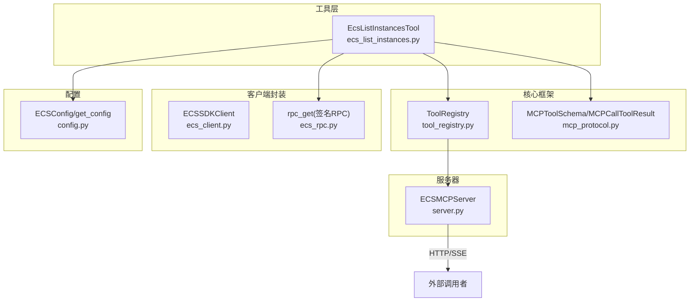
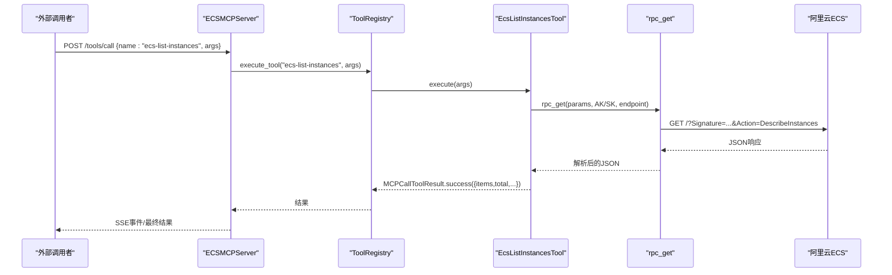
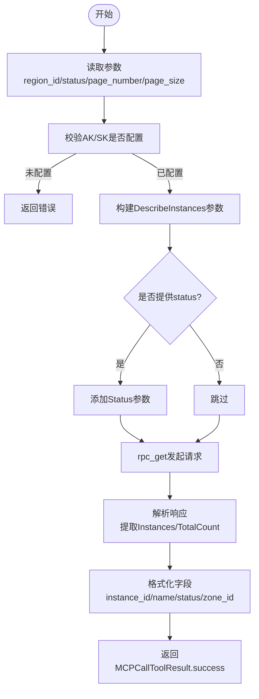
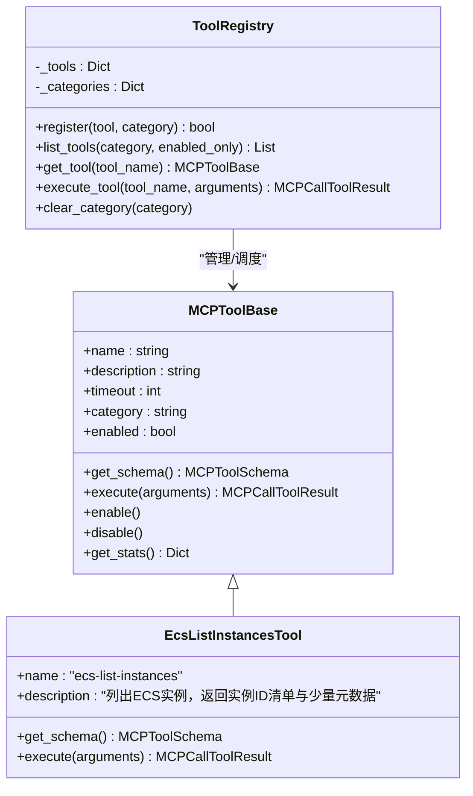
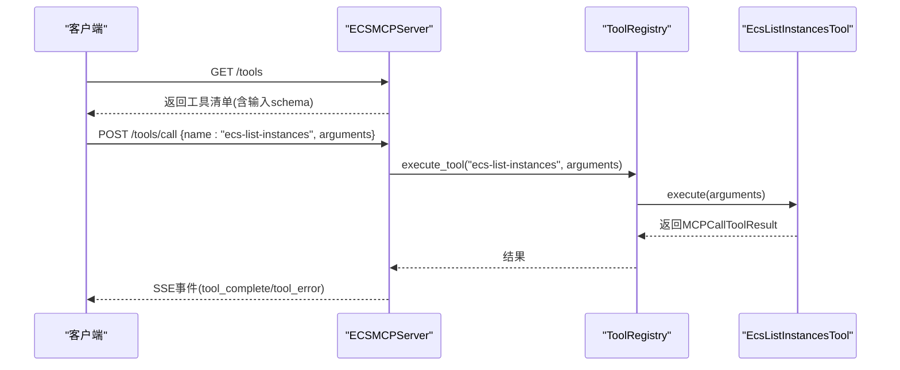
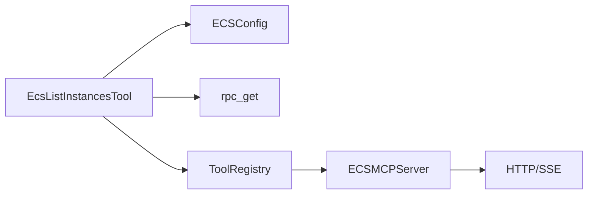

# ECS实例查询工具

<cite>
**本文档引用的文件**
- [ecs_list_instances.py](file://backend/src/ecs_mcp/tools/ecs_list_instances.py)
- [ecs_list_instances.py](file://archived/ecs-mcp-standalone/src/ecs_mcp/tools/ecs_list_instances.py)
- [config.py](file://backend/src/ecs_mcp/config.py)
- [config.py](file://archived/ecs-mcp-standalone/src/ecs_mcp/config.py)
- [tool_registry.py](file://backend/src/ecs_mcp/core/tool_registry.py)
- [tool_registry.py](file://archived/ecs-mcp-standalone/src/ecs_mcp/core/tool_registry.py)
- [mcp_protocol.py](file://backend/src/ecs_mcp/core/mcp_protocol.py)
- [mcp_protocol.py](file://archived/ecs-mcp-standalone/src/ecs_mcp/core/mcp_protocol.py)
- [ecs_client.py](file://backend/src/ecs_mcp/clients/ecs_client.py)
- [ecs_client.py](file://archived/ecs-mcp-standalone/src/ecs_mcp/clients/ecs_client.py)
- [ecs_rpc.py](file://backend/src/ecs_mcp/clients/ecs_rpc.py)
- [ecs_rpc.py](file://archived/ecs-mcp-standalone/src/ecs_mcp/clients/ecs_rpc.py)
- [server.py](file://backend/src/ecs_mcp/server.py)
- [start_ecs_mcp_http_server.py](file://archived/ecs-mcp-standalone/start_ecs_mcp_http_server.py)
</cite>

## 目录
1. [简介](#简介)
2. [项目结构](#项目结构)
3. [核心组件](#核心组件)
4. [架构总览](#架构总览)
5. [详细组件分析](#详细组件分析)
6. [依赖关系分析](#依赖关系分析)
7. [性能考虑](#性能考虑)
8. [故障排查指南](#故障排查指南)
9. [结论](#结论)
10. [附录](#附录)

## 简介
本文件面向ECS实例查询工具ecs_list_instances.py，系统性阐述其功能特性、查询参数与过滤条件、实现原理（API调用封装、数据分页处理、结果格式化）、使用场景与集成方式，并提供实用的查询示例与组合查询技巧，帮助用户高效地管理和监控阿里云ECS实例资源。

## 项目结构
该工具位于ECS MCP（Model Context Protocol）服务中，采用模块化设计：
- 工具层：工具类实现查询逻辑，遵循MCP协议规范
- 核心框架：工具注册与调度、协议定义、日志与统计
- 客户端封装：SDK客户端与RPC签名调用
- 服务器：基于FastAPI的HTTP服务，提供SSE事件流与工具调用接口

图表来源
- [ecs_list_instances.py:23-115](file://backend/src/ecs_mcp/tools/ecs_list_instances.py#L23-L115)
- [tool_registry.py:60-140](file://backend/src/ecs_mcp/core/tool_registry.py#L60-L140)
- [mcp_protocol.py:25-53](file://backend/src/ecs_mcp/core/mcp_protocol.py#L25-L53)
- [ecs_client.py:18-86](file://backend/src/ecs_mcp/clients/ecs_client.py#L18-L86)
- [ecs_rpc.py:58-65](file://backend/src/ecs_mcp/clients/ecs_rpc.py#L58-L65)
- [server.py:43-280](file://backend/src/ecs_mcp/server.py#L43-L280)
- [config.py:44-63](file://backend/src/ecs_mcp/config.py#L44-L63)

章节来源
- [server.py:90-180](file://backend/src/ecs_mcp/server.py#L90-L180)
- [tool_registry.py:60-140](file://backend/src/ecs_mcp/core/tool_registry.py#L60-L140)

## 核心组件
- EcsListInstancesTool：实现ecs-list-instances工具，负责接收参数、构造阿里云RPC请求、解析响应并返回标准化结果
- ToolRegistry：工具注册与执行调度中心，支持异步执行、统计与错误处理
- MCPToolSchema/MCPCallToolResult：MCP协议的输入输出规范与结果封装
- ECSSDKClient：SDK客户端封装（异步包装），用于监控等其他工具
- rpc_get：自签名RPC调用，绕过SDK凭证链兼容问题
- ECSMCPServer：HTTP服务，提供工具清单、调用、SSE事件流等能力

章节来源
- [ecs_list_instances.py:23-115](file://backend/src/ecs_mcp/tools/ecs_list_instances.py#L23-L115)
- [tool_registry.py:15-140](file://backend/src/ecs_mcp/core/tool_registry.py#L15-L140)
- [mcp_protocol.py:25-53](file://backend/src/ecs_mcp/core/mcp_protocol.py#L25-L53)
- [ecs_client.py:18-86](file://backend/src/ecs_mcp/clients/ecs_client.py#L18-L86)
- [ecs_rpc.py:58-65](file://backend/src/ecs_mcp/clients/ecs_rpc.py#L58-L65)
- [server.py:43-280](file://backend/src/ecs_mcp/server.py#L43-L280)

## 架构总览
工具通过HTTP接口被调用，内部经由工具注册表分发至具体工具实现。工具使用自签名RPC直接访问阿里云ECS OpenAPI，避免SDK凭证链问题；返回结果统一为MCPCallToolResult，便于上层消费。

图表来源
- [server.py:131-142](file://backend/src/ecs_mcp/server.py#L131-L142)
- [tool_registry.py:102-120](file://backend/src/ecs_mcp/core/tool_registry.py#L102-L120)
- [ecs_list_instances.py:47-115](file://backend/src/ecs_mcp/tools/ecs_list_instances.py#L47-L115)
- [ecs_rpc.py:58-65](file://backend/src/ecs_mcp/clients/ecs_rpc.py#L58-L65)

## 详细组件分析

### 查询参数与过滤条件
- 地域ID（region_id）：默认使用配置中的region_id，可覆盖
- 状态（status）：支持按实例状态过滤，如Running、Stopped等
- 分页（page_number/page_size）：默认第1页，每页50条，可调整

图表来源
- [ecs_list_instances.py:47-115](file://backend/src/ecs_mcp/tools/ecs_list_instances.py#L47-L115)

章节来源
- [ecs_list_instances.py:31-45](file://backend/src/ecs_mcp/tools/ecs_list_instances.py#L31-L45)
- [ecs_list_instances.py:47-115](file://backend/src/ecs_mcp/tools/ecs_list_instances.py#L47-L115)

### 实现原理
- API调用封装：使用自签名RPC（签名算法、参数编码、URL拼装）直接调用阿里云ECS OpenAPI，避免SDK凭证链兼容问题
- 数据分页处理：根据page_number与page_size构造请求，从响应中读取TotalCount与Instances数组
- 结果格式化：抽取关键字段（实例ID、实例名称、状态、可用区），统一返回结构

章节来源
- [ecs_rpc.py:27-65](file://backend/src/ecs_mcp/clients/ecs_rpc.py#L27-L65)
- [ecs_list_instances.py:60-110](file://backend/src/ecs_mcp/tools/ecs_list_instances.py#L60-L110)

### 类关系图

图表来源
- [tool_registry.py:15-140](file://backend/src/ecs_mcp/core/tool_registry.py#L15-L140)
- [ecs_list_instances.py:23-45](file://backend/src/ecs_mcp/tools/ecs_list_instances.py#L23-L45)

### 服务器与工具调用流程
- 工具注册：服务启动时注册所有工具（包含ecs-list-instances）
- 工具调用：POST /tools/call 接收请求，异步执行并广播SSE事件
- 工具清单：GET /tools 返回工具schema，含输入参数定义

图表来源
- [server.py:108-142](file://backend/src/ecs_mcp/server.py#L108-L142)
- [tool_registry.py:102-120](file://backend/src/ecs_mcp/core/tool_registry.py#L102-L120)
- [ecs_list_instances.py:47-115](file://backend/src/ecs_mcp/tools/ecs_list_instances.py#L47-L115)

章节来源
- [server.py:108-142](file://backend/src/ecs_mcp/server.py#L108-L142)
- [server.py:234-246](file://backend/src/ecs_mcp/server.py#L234-L246)

### 配置与环境变量
- 阿里云AK/SK：ALIBABA_CLOUD_ACCESS_KEY_ID、ALIBABA_CLOUD_ACCESS_KEY_SECRET
- 地域ID：ALIBABA_CLOUD_ECS_REGION_ID（默认cn-hangzhou）
- 服务端口与主机：ECS_MCP_HOST、ECS_MCP_PORT
- 调试与并发：ECS_MCP_DEBUG、ECS_CALL_TIMEOUT、ECS_RETRY_ATTEMPTS、ECS_MAX_CONCURRENCY

章节来源
- [config.py:44-63](file://backend/src/ecs_mcp/config.py#L44-L63)
- [config.py:43-62](file://archived/ecs-mcp-standalone/src/ecs_mcp/config.py#L43-L62)

## 依赖关系分析
- 工具对配置的依赖：通过get_config读取AK/SK与region_id
- 工具对RPC客户端的依赖：通过rpc_get发起签名请求
- 工具对注册表的依赖：通过ToolRegistry统一调度
- 服务器对工具注册表的依赖：提供工具清单与调用入口

图表来源
- [ecs_list_instances.py:29-30](file://backend/src/ecs_mcp/tools/ecs_list_instances.py#L29-L30)
- [ecs_list_instances.py:70-75](file://backend/src/ecs_mcp/tools/ecs_list_instances.py#L70-L75)
- [tool_registry.py:60-140](file://backend/src/ecs_mcp/core/tool_registry.py#L60-L140)
- [server.py:43-280](file://backend/src/ecs_mcp/server.py#L43-L280)

章节来源
- [ecs_list_instances.py:29-30](file://backend/src/ecs_mcp/tools/ecs_list_instances.py#L29-L30)
- [tool_registry.py:60-140](file://backend/src/ecs_mcp/core/tool_registry.py#L60-L140)
- [server.py:90-180](file://backend/src/ecs_mcp/server.py#L90-L180)

## 性能考虑
- 异步执行：工具执行与HTTP处理均为异步，提升并发吞吐
- 分页策略：合理设置page_size以平衡响应时间与网络负载
- 超时与重试：可通过ECS_CALL_TIMEOUT与ECS_RETRY_ATTEMPTS控制调用稳定性
- 并发限制：ECS_MAX_CONCURRENCY限制同时并发数，避免对后端造成压力

## 故障排查指南
- AK/SK未配置：当环境变量未设置时，工具会返回错误提示，需检查ALIBABA_CLOUD_ACCESS_KEY_ID与ALIBABA_CLOUD_ACCESS_KEY_SECRET
- 网络与签名：确认endpoint与签名参数正确，必要时检查网络连通性
- 服务器健康：通过GET /health检查服务状态
- 事件流：通过GET /events订阅SSE事件，观察tool_error与tool_complete事件

章节来源
- [ecs_list_instances.py:57-58](file://backend/src/ecs_mcp/tools/ecs_list_instances.py#L57-L58)
- [server.py:100-107](file://backend/src/ecs_mcp/server.py#L100-L107)
- [server.py:168-179](file://backend/src/ecs_mcp/server.py#L168-L179)

## 结论
ecs_list_instances.py通过清晰的参数定义、稳定的RPC签名调用与统一的结果封装，提供了高效、可扩展的ECS实例查询能力。结合工具注册表与HTTP服务，用户可在多种场景中灵活集成与使用，满足批量查询、条件筛选与结果导出等需求。

## 附录

### 使用场景与集成方式
- 批量查询：通过调整page_number与page_size进行分页拉取
- 条件筛选：利用status参数按运行状态过滤实例
- 结果导出：工具返回标准结构，便于上层应用进一步处理与导出

### 实用查询示例与组合技巧
- 示例1：查询指定地域下所有实例（默认第1页，每页50条）
- 示例2：按状态筛选（如仅查询Running实例）
- 示例3：分页遍历：循环增加page_number直至total_count
- 示例4：组合查询：先按状态过滤，再分页获取完整列表

章节来源
- [ecs_list_instances.py:31-45](file://backend/src/ecs_mcp/tools/ecs_list_instances.py#L31-L45)
- [ecs_list_instances.py:47-115](file://backend/src/ecs_mcp/tools/ecs_list_instances.py#L47-L115)