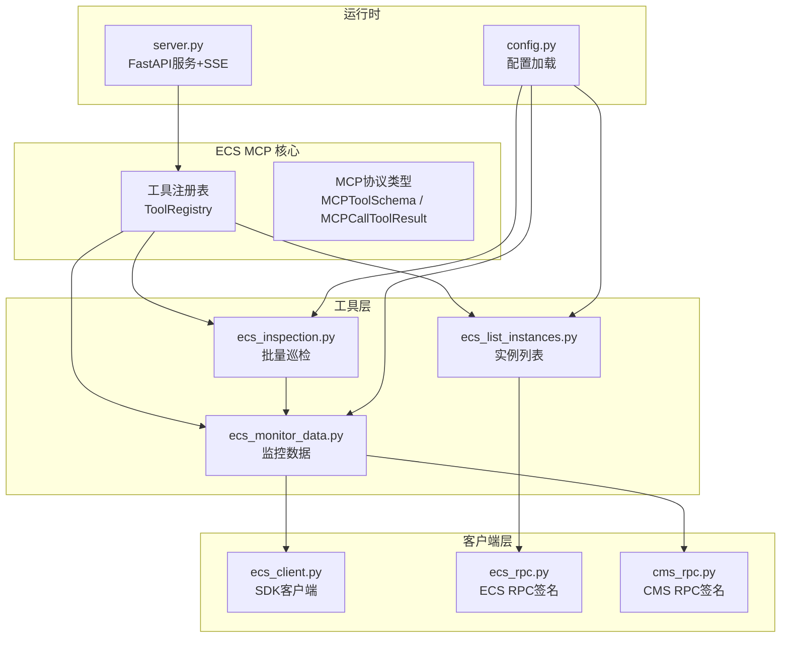
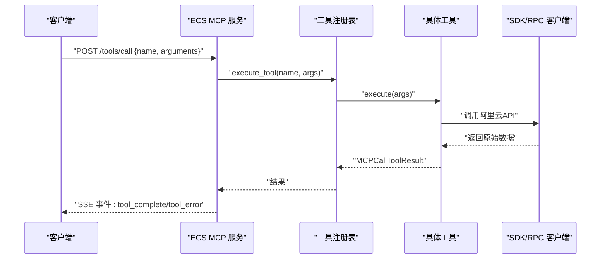
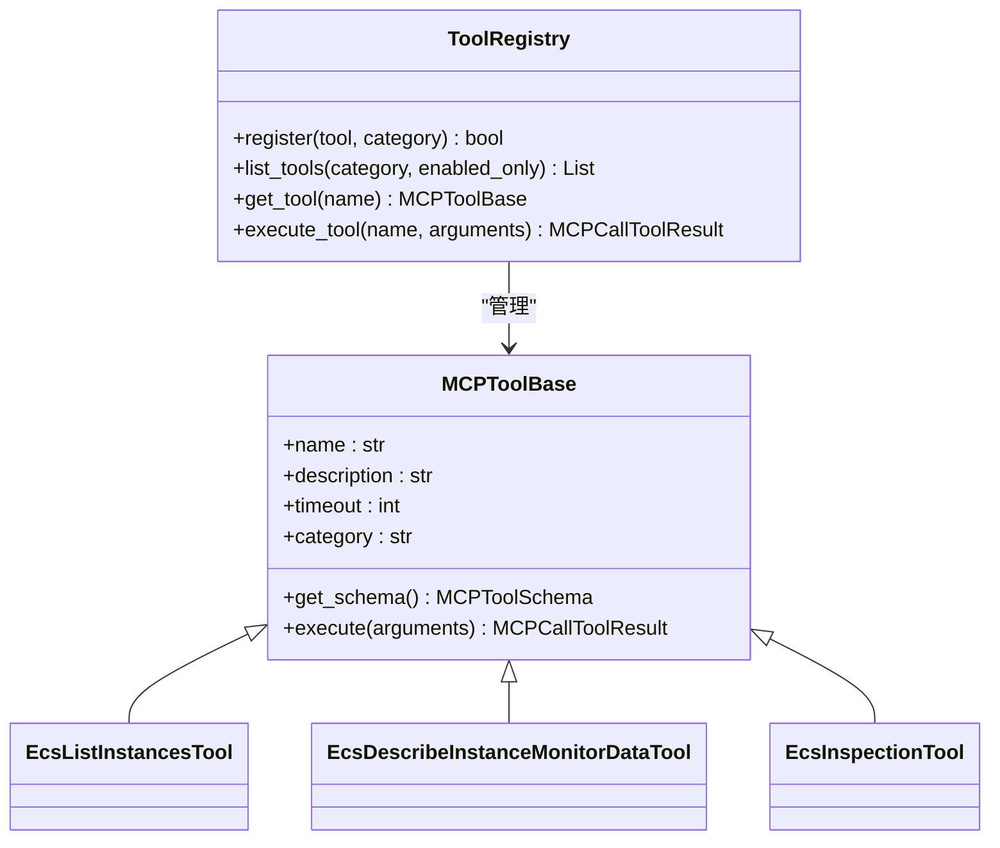
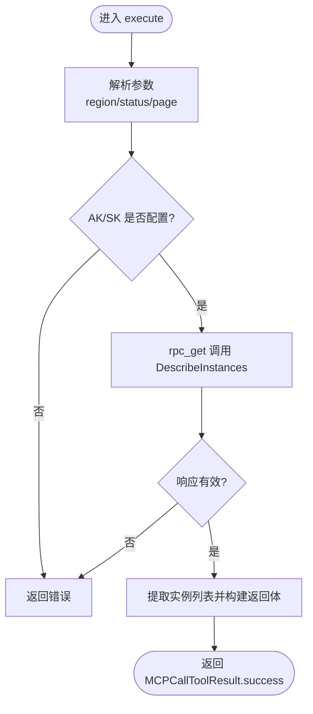
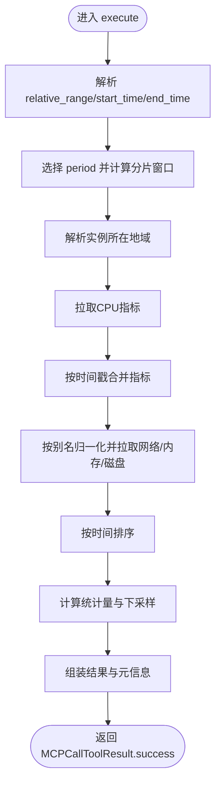
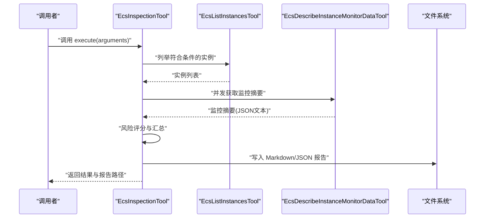
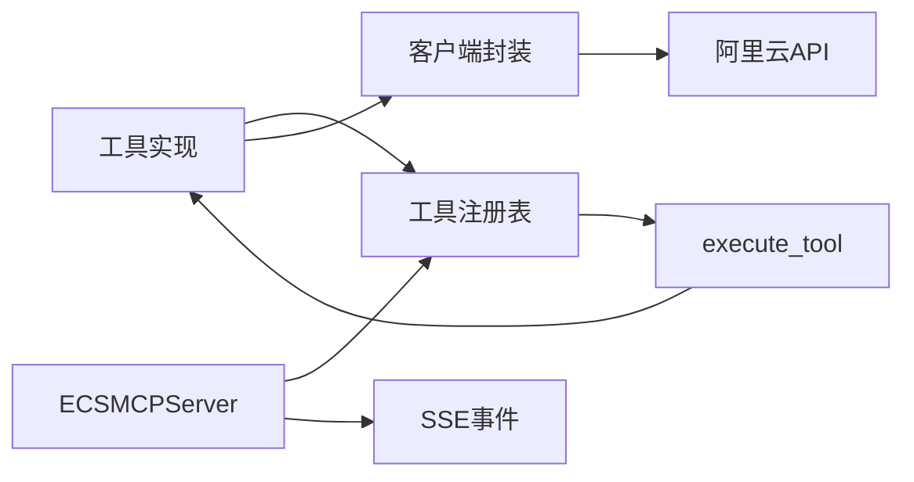

# ECS工具套件

<cite>
**本文引用的文件**
- [backend/src/ecs_mcp/tools/ecs_inspection.py](file://backend/src/ecs_mcp/tools/ecs_inspection.py)
- [backend/src/ecs_mcp/tools/ecs_list_instances.py](file://backend/src/ecs_mcp/tools/ecs_list_instances.py)
- [backend/src/ecs_mcp/tools/ecs_monitor_data.py](file://backend/src/ecs_mcp/tools/ecs_monitor_data.py)
- [backend/src/ecs_mcp/tools/__init__.py](file://backend/src/ecs_mcp/tools/__init__.py)
- [backend/src/ecs_mcp/core/tool_registry.py](file://backend/src/ecs_mcp/core/tool_registry.py)
- [backend/src/ecs_mcp/core/mcp_protocol.py](file://backend/src/ecs_mcp/core/mcp_protocol.py)
- [backend/src/ecs_mcp/clients/ecs_client.py](file://backend/src/ecs_mcp/clients/ecs_client.py)
- [backend/src/ecs_mcp/clients/ecs_rpc.py](file://backend/src/ecs_mcp/clients/ecs_rpc.py)
- [backend/src/ecs_mcp/clients/cms_rpc.py](file://backend/src/ecs_mcp/clients/cms_rpc.py)
- [backend/src/ecs_mcp/config.py](file://backend/src/ecs_mcp/config.py)
- [backend/src/ecs_mcp/server.py](file://backend/src/ecs_mcp/server.py)
</cite>

## 目录
1. [简介](#简介)
2. [项目结构](#项目结构)
3. [核心组件](#核心组件)
4. [架构总览](#架构总览)
5. [详细组件分析](#详细组件分析)
6. [依赖关系分析](#依赖关系分析)
7. [性能考量](#性能考量)
8. [故障排查指南](#故障排查指南)
9. [结论](#结论)
10. [附录](#附录)

## 简介
本文件系统性介绍阿里云ECS工具套件，涵盖实例查询、监控数据获取与资源巡检三大核心能力。文档面向开发者与运维人员，提供工具功能特性、参数配置、使用方法、实现原理（API封装、参数校验、结果处理与错误处理）、注册与发现机制、扩展开发方式以及最佳实践。

## 项目结构
ECS工具套件位于后端子模块 backend/src/ecs_mcp 下，采用“工具+核心协议+客户端+配置+服务”的分层组织方式：
- tools：工具实现（实例查询、监控数据、批量巡检）
- core：工具注册表、MCP协议类型
- clients：阿里云API客户端封装（SDK与RPC）
- config：配置加载与环境变量解析
- server：基于FastAPI的HTTP服务与SSE事件推送

图表来源
- [backend/src/ecs_mcp/core/tool_registry.py:60-140](file://backend/src/ecs_mcp/core/tool_registry.py#L60-L140)
- [backend/src/ecs_mcp/tools/ecs_list_instances.py:23-115](file://backend/src/ecs_mcp/tools/ecs_list_instances.py#L23-L115)
- [backend/src/ecs_mcp/tools/ecs_monitor_data.py:75-479](file://backend/src/ecs_mcp/tools/ecs_monitor_data.py#L75-L479)
- [backend/src/ecs_mcp/tools/ecs_inspection.py:28-324](file://backend/src/ecs_mcp/tools/ecs_inspection.py#L28-L324)
- [backend/src/ecs_mcp/clients/ecs_client.py:18-86](file://backend/src/ecs_mcp/clients/ecs_client.py#L18-L86)
- [backend/src/ecs_mcp/clients/ecs_rpc.py:58-65](file://backend/src/ecs_mcp/clients/ecs_rpc.py#L58-L65)
- [backend/src/ecs_mcp/clients/cms_rpc.py:56-66](file://backend/src/ecs_mcp/clients/cms_rpc.py#L56-L66)
- [backend/src/ecs_mcp/config.py:44-63](file://backend/src/ecs_mcp/config.py#L44-L63)
- [backend/src/ecs_mcp/server.py:43-280](file://backend/src/ecs_mcp/server.py#L43-L280)

章节来源
- [backend/src/ecs_mcp/tools/__init__.py:12-47](file://backend/src/ecs_mcp/tools/__init__.py#L12-L47)
- [backend/src/ecs_mcp/server.py:248-280](file://backend/src/ecs_mcp/server.py#L248-L280)

## 核心组件
- 工具注册表与协议
  - 工具基类与注册表：提供统一的工具生命周期、启用/禁用、统计信息与执行调度
  - MCP协议类型：标准化工具Schema与调用结果封装
- 工具实现
  - 实例列表工具：按地域、状态、分页查询实例ID与基础元数据
  - 监控数据工具：自动周期选择、分片聚合、下采样与统计，输出摘要与采样点
  - 批量巡检工具：结合实例列表与监控摘要，按阈值打标签并生成报告
- 客户端封装
  - ECS SDK客户端：异步包装SDK调用
  - ECS/CMS RPC客户端：手动签名与HTTP调用，避免SDK凭证链问题
- 服务与配置
  - FastAPI服务：提供工具清单、调用、刷新与SSE事件
  - 配置加载：优先级化的环境变量与dotenv文件加载

章节来源
- [backend/src/ecs_mcp/core/tool_registry.py:15-140](file://backend/src/ecs_mcp/core/tool_registry.py#L15-L140)
- [backend/src/ecs_mcp/core/mcp_protocol.py:25-53](file://backend/src/ecs_mcp/core/mcp_protocol.py#L25-L53)
- [backend/src/ecs_mcp/config.py:44-63](file://backend/src/ecs_mcp/config.py#L44-L63)
- [backend/src/ecs_mcp/server.py:43-280](file://backend/src/ecs_mcp/server.py#L43-L280)

## 架构总览
ECS工具套件通过“工具+注册表+协议+客户端+服务”解耦设计，形成清晰的职责边界：
- 工具层负责业务逻辑与API调用
- 注册表负责工具的注册、发现与执行
- 协议层负责工具Schema与结果封装
- 客户端层负责与阿里云API交互
- 服务层提供HTTP接口与事件推送

图表来源
- [backend/src/ecs_mcp/server.py:131-246](file://backend/src/ecs_mcp/server.py#L131-L246)
- [backend/src/ecs_mcp/core/tool_registry.py:102-119](file://backend/src/ecs_mcp/core/tool_registry.py#L102-L119)
- [backend/src/ecs_mcp/core/mcp_protocol.py:33-49](file://backend/src/ecs_mcp/core/mcp_protocol.py#L33-L49)

## 详细组件分析

### 工具注册与发现机制
- 工具基类与注册表
  - 工具基类提供统一的名称、描述、超时、分类与启用状态
  - 注册表支持按分类维护工具清单，提供查询、执行与统计
- 工具装饰器
  - 通过装饰器将工具类注册到全局注册表，简化扩展流程
- 服务端接口
  - 提供工具清单查询、调用接受、刷新工具列表与SSE事件广播

图表来源
- [backend/src/ecs_mcp/core/tool_registry.py:15-140](file://backend/src/ecs_mcp/core/tool_registry.py#L15-L140)
- [backend/src/ecs_mcp/tools/ecs_list_instances.py:23-115](file://backend/src/ecs_mcp/tools/ecs_list_instances.py#L23-L115)
- [backend/src/ecs_mcp/tools/ecs_monitor_data.py:75-479](file://backend/src/ecs_mcp/tools/ecs_monitor_data.py#L75-L479)
- [backend/src/ecs_mcp/tools/ecs_inspection.py:28-324](file://backend/src/ecs_mcp/tools/ecs_inspection.py#L28-L324)

章节来源
- [backend/src/ecs_mcp/core/tool_registry.py:60-140](file://backend/src/ecs_mcp/core/tool_registry.py#L60-L140)
- [backend/src/ecs_mcp/tools/__init__.py:12-47](file://backend/src/ecs_mcp/tools/__init__.py#L12-L47)
- [backend/src/ecs_mcp/server.py:108-167](file://backend/src/ecs_mcp/server.py#L108-L167)

### 实例查询工具（ecs-list-instances）
- 功能
  - 列出指定地域下满足状态/分页条件的实例ID与基础元数据
- 关键参数
  - region_id、status、page_number、page_size
- 实现要点
  - 使用自签名RPC调用DescribeInstances，绕过SDK凭证链兼容问题
  - 对SDK对象与字典两种形态做兼容处理
- 错误处理
  - 缺失AK/SK时直接返回错误
  - 异常捕获并封装为标准结果

图表来源
- [backend/src/ecs_mcp/tools/ecs_list_instances.py:47-115](file://backend/src/ecs_mcp/tools/ecs_list_instances.py#L47-L115)
- [backend/src/ecs_mcp/clients/ecs_rpc.py:58-65](file://backend/src/ecs_mcp/clients/ecs_rpc.py#L58-L65)

章节来源
- [backend/src/ecs_mcp/tools/ecs_list_instances.py:23-115](file://backend/src/ecs_mcp/tools/ecs_list_instances.py#L23-L115)

### 监控数据工具（ecs-describe-instance-monitor-data）
- 功能
  - 查询实例监控数据，自动选择周期、分片聚合与下采样，输出统计摘要与采样点
- 关键参数
  - instance_id、region_id、start_time/end_time、relative_range、period、metrics、max_points
- 实现要点
  - 时间窗口解析与周期选择，确保点数不超过上限
  - 分片窗口聚合，避免单次请求超限
  - 指标别名归一化与单位标注
  - 地域自动解析与候选列表回退
- 性能与可靠性
  - 多Endpoint与多命名空间尝试，提升成功率
  - 下采样控制返回体量

图表来源
- [backend/src/ecs_mcp/tools/ecs_monitor_data.py:103-437](file://backend/src/ecs_mcp/tools/ecs_monitor_data.py#L103-L437)
- [backend/src/ecs_mcp/clients/cms_rpc.py:56-66](file://backend/src/ecs_mcp/clients/cms_rpc.py#L56-L66)

章节来源
- [backend/src/ecs_mcp/tools/ecs_monitor_data.py:75-479](file://backend/src/ecs_mcp/tools/ecs_monitor_data.py#L75-L479)

### 批量巡检工具（ecs-inspect）
- 功能
  - 基于实例筛选条件获取实例集合，调用监控摘要工具并发采集，按阈值打标签，生成Markdown与JSON报告
- 关键参数
  - region_id/region_ids、status/name_contains/zone_id、max_instances/page_size/scan_all_pages、max_concurrency
  - two_phase/quick_window/quick_metrics、relative_range/period、thresholds
- 实现要点
  - 多地域与分页遍历，限制最大实例数
  - 并发信号量控制监控抓取并发度
  - 风险等级判定：CPU p95、内存/磁盘峰值阈值，多命中升级为高风险
  - 报告生成：Markdown与JSON双写，记录时间戳与耗时
- 错误处理
  - AK/SK缺失、工具执行失败、异常捕获与日志记录

图表来源
- [backend/src/ecs_mcp/tools/ecs_inspection.py:77-324](file://backend/src/ecs_mcp/tools/ecs_inspection.py#L77-L324)
- [backend/src/ecs_mcp/tools/ecs_monitor_data.py:75-479](file://backend/src/ecs_mcp/tools/ecs_monitor_data.py#L75-L479)

章节来源
- [backend/src/ecs_mcp/tools/ecs_inspection.py:28-324](file://backend/src/ecs_mcp/tools/ecs_inspection.py#L28-L324)

### API与协议
- MCPToolSchema
  - 工具Schema定义，包含名称、描述、输入Schema与可选超时与分类
- MCPCallToolResult
  - 统一的结果封装，支持成功与错误两类内容，内部以文本块承载JSON
- 错误码
  - 定义工具相关错误码，便于上层识别与处理

章节来源
- [backend/src/ecs_mcp/core/mcp_protocol.py:25-53](file://backend/src/ecs_mcp/core/mcp_protocol.py#L25-L53)

### 客户端封装
- ECS SDK客户端
  - 异步包装SDK调用，将SDK模型转换为字典，便于工具层处理
- ECS/CMS RPC客户端
  - 手动实现签名与HTTP调用，支持自定义Endpoint与超时控制
  - CMS时间格式化与参数编码工具函数

章节来源
- [backend/src/ecs_mcp/clients/ecs_client.py:18-86](file://backend/src/ecs_mcp/clients/ecs_client.py#L18-L86)
- [backend/src/ecs_mcp/clients/ecs_rpc.py:27-65](file://backend/src/ecs_mcp/clients/ecs_rpc.py#L27-L65)
- [backend/src/ecs_mcp/clients/cms_rpc.py:29-66](file://backend/src/ecs_mcp/clients/cms_rpc.py#L29-L66)

### 服务与配置
- ECSMCPServer
  - 提供健康检查、工具清单、调用接受、刷新工具列表与SSE事件流
  - 异步执行工具并广播执行结果或错误
- 配置加载
  - 优先加载后端config.env，其次历史工程的config.env/.env，最后根目录.env
  - ECS专用配置项：主机、端口、AK/SK、默认地域、调用超时、重试次数、最大并发

章节来源
- [backend/src/ecs_mcp/server.py:43-280](file://backend/src/ecs_mcp/server.py#L43-L280)
- [backend/src/ecs_mcp/config.py:11-63](file://backend/src/ecs_mcp/config.py#L11-L63)

## 依赖关系分析
- 工具与注册表
  - 工具通过装饰器注册到全局注册表，服务端通过注册表统一调度
- 工具与客户端
  - 实例查询工具使用ECS RPC客户端
  - 监控数据工具使用SDK客户端与CMS RPC客户端
  - 巡检工具组合实例查询与监控摘要工具
- 服务与注册表
  - 服务端在启动时注册全部工具，并提供刷新接口

图表来源
- [backend/src/ecs_mcp/tools/__init__.py:12-47](file://backend/src/ecs_mcp/tools/__init__.py#L12-L47)
- [backend/src/ecs_mcp/core/tool_registry.py:60-140](file://backend/src/ecs_mcp/core/tool_registry.py#L60-L140)
- [backend/src/ecs_mcp/server.py:131-246](file://backend/src/ecs_mcp/server.py#L131-L246)

章节来源
- [backend/src/ecs_mcp/tools/__init__.py:12-47](file://backend/src/ecs_mcp/tools/__init__.py#L12-L47)
- [backend/src/ecs_mcp/core/tool_registry.py:60-140](file://backend/src/ecs_mcp/core/tool_registry.py#L60-L140)
- [backend/src/ecs_mcp/server.py:248-280](file://backend/src/ecs_mcp/server.py#L248-L280)

## 性能考量
- 并发控制
  - 巡检工具通过信号量限制并发抓取监控摘要，避免对CMS造成过大压力
- 分片聚合与下采样
  - 监控工具根据时间窗口与周期自动分片，点数过多时进行下采样，兼顾精度与性能
- 超时与重试
  - 客户端与服务端均设置合理超时，配置层提供调用超时与重试次数参数
- 资源限制
  - 巡检工具限制最大实例数与分页大小，防止大规模扫描导致资源耗尽

章节来源
- [backend/src/ecs_mcp/tools/ecs_inspection.py:170-199](file://backend/src/ecs_mcp/tools/ecs_inspection.py#L170-L199)
- [backend/src/ecs_mcp/tools/ecs_monitor_data.py:474-479](file://backend/src/ecs_mcp/tools/ecs_monitor_data.py#L474-L479)
- [backend/src/ecs_mcp/config.py:55-59](file://backend/src/ecs_mcp/config.py#L55-L59)

## 故障排查指南
- 常见错误与定位
  - AK/SK未配置：工具执行前会检查AK/SK，缺失时直接返回错误
  - 参数校验失败：工具Schema定义严格，参数缺失或格式不符会导致错误
  - API调用失败：SDK/RPC客户端异常会被上层捕获并记录日志
- 日志与事件
  - 服务端使用loguru输出日志，SSE事件可用于实时观察工具执行状态
- 建议排查步骤
  - 检查环境变量与config.env配置
  - 查看SSE事件流中的tool_error事件
  - 核对工具Schema与调用参数
  - 降低并发与实例规模，逐步定位问题

章节来源
- [backend/src/ecs_mcp/tools/ecs_list_instances.py:57-58](file://backend/src/ecs_mcp/tools/ecs_list_instances.py#L57-L58)
- [backend/src/ecs_mcp/tools/ecs_monitor_data.py:134-136](file://backend/src/ecs_mcp/tools/ecs_monitor_data.py#L134-L136)
- [backend/src/ecs_mcp/server.py:189-246](file://backend/src/ecs_mcp/server.py#L189-L246)

## 结论
ECS工具套件通过模块化设计实现了实例查询、监控数据与批量巡检的完整闭环。其统一的注册表与协议抽象、灵活的客户端封装与完善的SSE事件机制，使得工具易于扩展与集成。遵循本文的最佳实践与排错建议，可高效稳定地使用该工具套件支撑日常运维与巡检工作。

## 附录

### 工具清单与Schema
- 工具清单接口
  - GET /tools：返回启用的工具列表与输入Schema
- 工具调用接口
  - POST /tools/call：提交工具调用请求，异步执行并返回接受状态
- 工具刷新接口
  - POST /tools/refresh：清理并重新注册全部工具，广播更新事件

章节来源
- [backend/src/ecs_mcp/server.py:108-167](file://backend/src/ecs_mcp/server.py#L108-L167)
- [backend/src/ecs_mcp/server.py:131-167](file://backend/src/ecs_mcp/server.py#L131-L167)

### 新工具开发指南
- 步骤
  - 继承工具基类，实现 get_schema 与 execute 方法
  - 在工具模块中导出类并在注册函数中加入
  - 通过装饰器或手动注册到工具注册表
  - 如需HTTP服务，可在服务端路由中暴露对应接口
- 参数验证
  - 使用MCPToolSchema定义输入Schema，确保参数完整性与类型正确
- 集成测试
  - 通过服务端SSE事件观察工具执行状态
  - 使用最小参数集验证基本功能，再逐步增加复杂场景

章节来源
- [backend/src/ecs_mcp/core/tool_registry.py:68-86](file://backend/src/ecs_mcp/core/tool_registry.py#L68-L86)
- [backend/src/ecs_mcp/tools/__init__.py:12-47](file://backend/src/ecs_mcp/tools/__init__.py#L12-L47)
- [backend/src/ecs_mcp/server.py:248-256](file://backend/src/ecs_mcp/server.py#L248-L256)