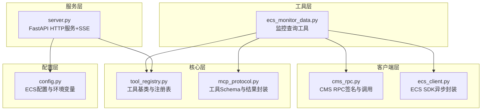
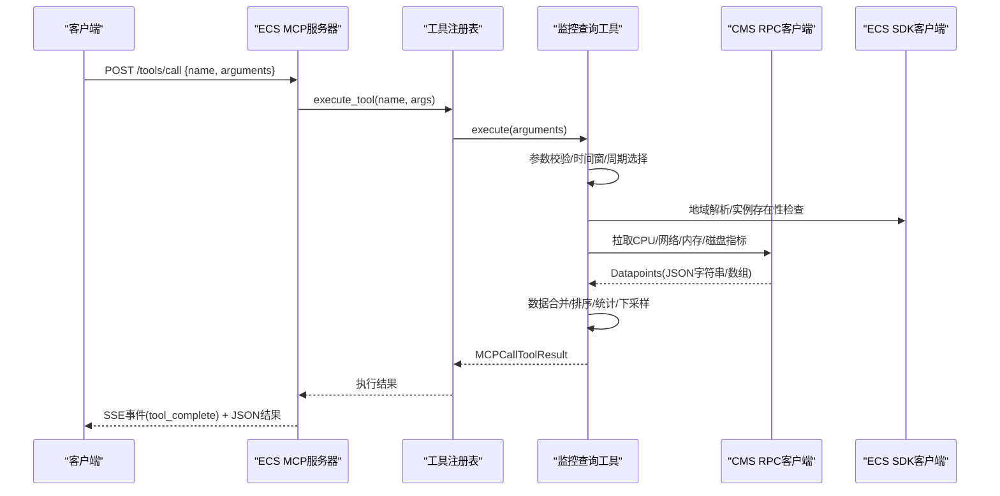
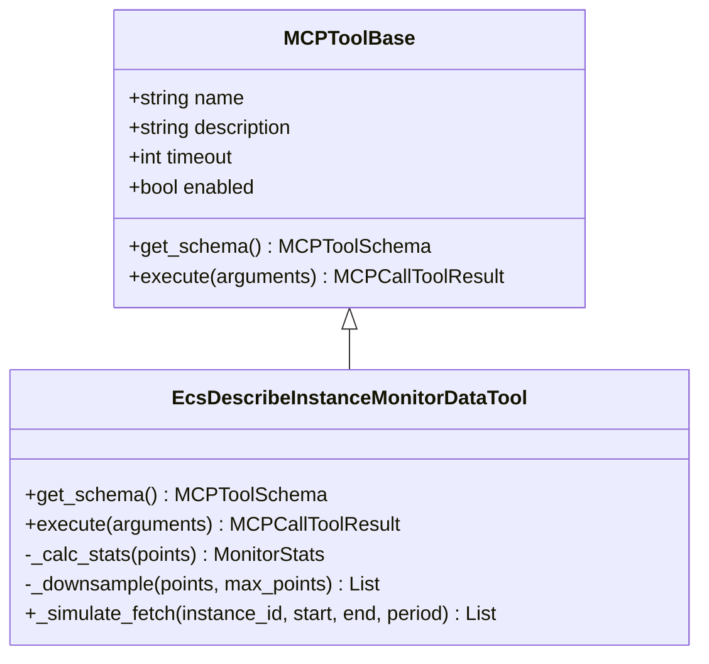
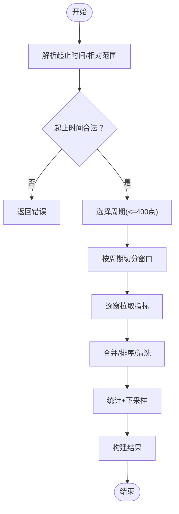
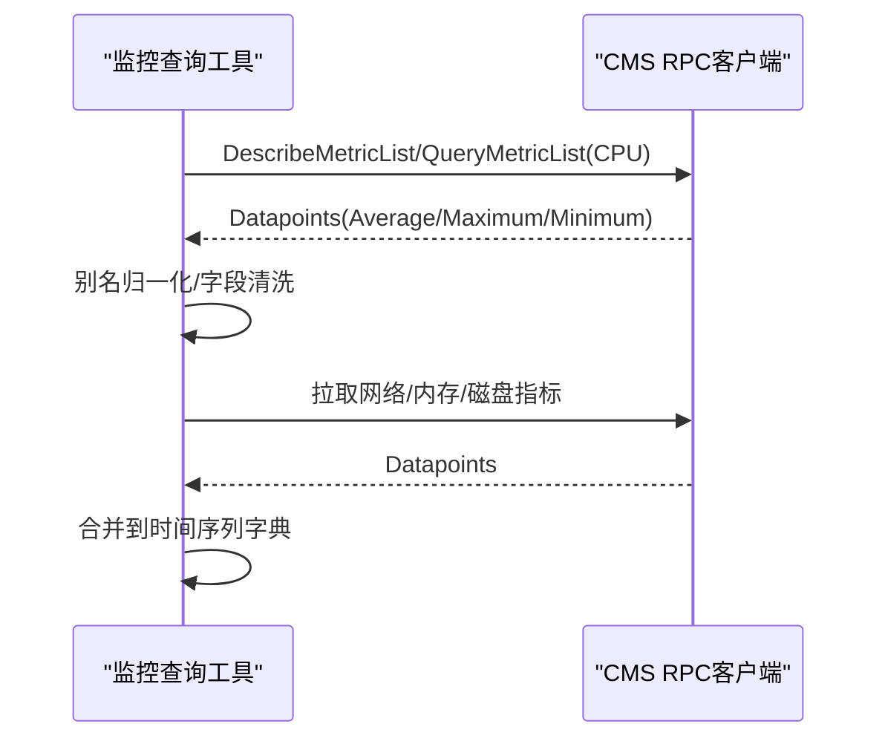
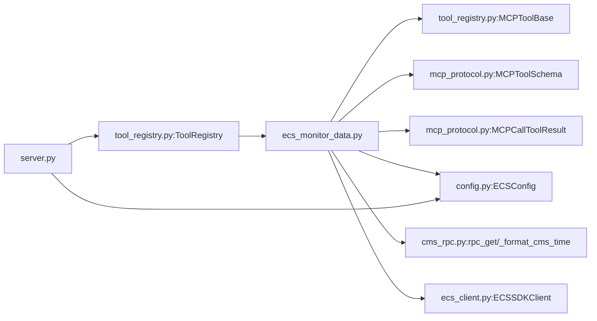

# ECS监控数据工具

<cite>
**本文引用的文件**
- [ecs_monitor_data.py](file://backend/src/ecs_mcp/tools/ecs_monitor_data.py)
- [ecs_monitor_data.py](file://archived/ecs-mcp-standalone/src/ecs_mcp/tools/ecs_monitor_data.py)
- [cms_rpc.py](file://backend/src/ecs_mcp/clients/cms_rpc.py)
- [cms_rpc.py](file://archived/ecs-mcp-standalone/src/ecs_mcp/clients/cms_rpc.py)
- [ecs_client.py](file://backend/src/ecs_mcp/clients/ecs_client.py)
- [ecs_client.py](file://archived/ecs-mcp-standalone/src/ecs_mcp/clients/ecs_client.py)
- [config.py](file://backend/src/ecs_mcp/config.py)
- [config.py](file://archived/ecs-mcp-standalone/src/ecs_mcp/config.py)
- [tool_registry.py](file://backend/src/ecs_mcp/core/tool_registry.py)
- [tool_registry.py](file://archived/ecs-mcp-standalone/src/ecs_mcp/core/tool_registry.py)
- [mcp_protocol.py](file://backend/src/ecs_mcp/core/mcp_protocol.py)
- [mcp_protocol.py](file://archived/ecs-mcp-standalone/src/ecs_mcp/core/mcp_protocol.py)
- [server.py](file://backend/src/ecs_mcp/server.py)
- [tools/__init__.py](file://backend/src/ecs_mcp/tools/__init__.py)
- [tools/__init__.py](file://archived/ecs-mcp-standalone/src/ecs_mcp/tools/__init__.py)
</cite>

## 目录
1. [简介](#简介)
2. [项目结构](#项目结构)
3. [核心组件](#核心组件)
4. [架构总览](#架构总览)
5. [详细组件分析](#详细组件分析)
6. [依赖关系分析](#依赖关系分析)
7. [性能考量](#性能考量)
8. [故障排查指南](#故障排查指南)
9. [结论](#结论)
10. [附录](#附录)

## 简介
本文件面向ECS监控数据工具（工具名称：ecs-describe-instance-monitor-data），系统性梳理其功能、实现与使用方法。该工具基于阿里云CloudMonitor（CMS）接口，自动完成时间窗与周期（Period）选择、分片聚合、下采样与统计汇总，并输出标准化结果，便于进一步图表化与告警。

工具支持的关键指标包括：
- CPU使用率（CPUUtilization）
- 外网/内网带宽（InternetInRate/InternetOutRate、IntranetInRate/IntranetOutRate）
- 内存利用率（vm.MemoryUtilization）
- 磁盘使用率（diskusage_utilization）
- I/O相关（DiskReadIOPS/DiskWriteIOPS）等

此外，工具提供灵活的时间范围设置、采样间隔配置与数据聚合策略，输出包含统计摘要、单位信息与警告提示，便于用户快速理解实例运行状态并制定告警阈值。

## 项目结构
ECS监控数据工具位于后端模块中，采用“工具+客户端+核心协议+服务”的分层组织方式：
- 工具层：ecs_monitor_data.py 实现监控数据查询与聚合
- 客户端层：cms_rpc.py 提供CMS RPC签名与调用；ecs_client.py 提供ECS SDK异步封装
- 核心层：tool_registry.py 定义工具基类与注册表；mcp_protocol.py 定义工具Schema与结果封装
- 服务层：server.py 提供HTTP服务与SSE事件广播
- 配置层：config.py 加载环境变量并提供ECS配置对象

**图示来源**
- [ecs_monitor_data.py:75-101](file://backend/src/ecs_mcp/tools/ecs_monitor_data.py#L75-L101)
- [cms_rpc.py:56-62](file://backend/src/ecs_mcp/clients/cms_rpc.py#L56-L62)
- [ecs_client.py:34-85](file://backend/src/ecs_mcp/clients/ecs_client.py#L34-L85)
- [tool_registry.py:60-101](file://backend/src/ecs_mcp/core/tool_registry.py#L60-L101)
- [mcp_protocol.py:25-49](file://backend/src/ecs_mcp/core/mcp_protocol.py#L25-L49)
- [server.py:90-167](file://backend/src/ecs_mcp/server.py#L90-L167)
- [config.py:44-62](file://backend/src/ecs_mcp/config.py#L44-L62)

**章节来源**
- [server.py:90-167](file://backend/src/ecs_mcp/server.py#L90-L167)
- [tools/__init__.py:12-46](file://backend/src/ecs_mcp/tools/__init__.py#L12-L46)

## 核心组件
- 工具基类与注册表：MCPToolBase定义工具接口，ToolRegistry负责注册、发现与执行；工具通过装饰器注册到注册表
- 工具Schema：定义输入参数（实例ID、起止时间、相对范围、周期、指标过滤、最大点数等）
- 执行流程：参数校验、时间窗与周期选择、地域解析、CMS指标拉取、数据合并与排序、统计与下采样、结果封装
- 结果封装：MCPCallToolResult.success/error统一输出；结果包含窗口信息、统计摘要、元数据与警告

**章节来源**
- [tool_registry.py:15-58](file://backend/src/ecs_mcp/core/tool_registry.py#L15-L58)
- [tool_registry.py:60-127](file://backend/src/ecs_mcp/core/tool_registry.py#L60-L127)
- [mcp_protocol.py:25-49](file://backend/src/ecs_mcp/core/mcp_protocol.py#L25-L49)
- [ecs_monitor_data.py:83-101](file://backend/src/ecs_mcp/tools/ecs_monitor_data.py#L83-L101)
- [ecs_monitor_data.py:103-436](file://backend/src/ecs_mcp/tools/ecs_monitor_data.py#L103-L436)

## 架构总览
ECS监控数据工具通过HTTP服务暴露工具调用接口，客户端发送工具调用请求，服务端经注册表调度至具体工具执行。工具内部通过CMS RPC与ECS SDK客户端拉取监控数据，完成聚合与统计后返回统一格式的结果。

**图示来源**
- [server.py:131-167](file://backend/src/ecs_mcp/server.py#L131-L167)
- [server.py:234-246](file://backend/src/ecs_mcp/server.py#L234-L246)
- [tool_registry.py:102-119](file://backend/src/ecs_mcp/core/tool_registry.py#L102-L119)
- [ecs_monitor_data.py:103-436](file://backend/src/ecs_mcp/tools/ecs_monitor_data.py#L103-L436)
- [cms_rpc.py:56-62](file://backend/src/ecs_mcp/clients/cms_rpc.py#L56-L62)
- [ecs_client.py:34-85](file://backend/src/ecs_mcp/clients/ecs_client.py#L34-L85)

## 详细组件分析

### 工具类与Schema定义
- 工具名称：ecs-describe-instance-monitor-data
- 输入参数：
  - instance_id：ECS实例ID（必填）
  - region_id：地域ID（可覆盖配置）
  - start_time/end_time：ISO8601 UTC时间
  - relative_range：相对范围（如1h/6h/24h/7d/30d）
  - period：周期（60/600/3600，不填则自动选择）
  - metrics：指标过滤列表（支持别名）
  - max_points：最大返回点数（默认400，超出进行下采样）

**图示来源**
- [tool_registry.py:15-58](file://backend/src/ecs_mcp/core/tool_registry.py#L15-L58)
- [ecs_monitor_data.py:75-101](file://backend/src/ecs_mcp/tools/ecs_monitor_data.py#L75-L101)
- [ecs_monitor_data.py:457-479](file://backend/src/ecs_mcp/tools/ecs_monitor_data.py#L457-L479)

**章节来源**
- [ecs_monitor_data.py:83-101](file://backend/src/ecs_mcp/tools/ecs_monitor_data.py#L83-L101)

### 时间范围与周期选择
- 时间解析：支持绝对时间与相对范围；结束时间向上取整到分钟；相对范围解析为秒级偏移
- 周期选择：候选周期60/600/3600，保证点数不超过400；若仍超限，则按3600分片聚合
- 分片策略：按最大点数切分为多个窗口，逐窗拉取并合并

**图示来源**
- [ecs_monitor_data.py:25-64](file://backend/src/ecs_mcp/tools/ecs_monitor_data.py#L25-L64)
- [ecs_monitor_data.py:103-132](file://backend/src/ecs_mcp/tools/ecs_monitor_data.py#L103-L132)
- [ecs_monitor_data.py:199-387](file://backend/src/ecs_mcp/tools/ecs_monitor_data.py#L199-L387)

**章节来源**
- [ecs_monitor_data.py:25-64](file://backend/src/ecs_mcp/tools/ecs_monitor_data.py#L25-L64)
- [ecs_monitor_data.py:103-132](file://backend/src/ecs_mcp/tools/ecs_monitor_data.py#L103-L132)
- [ecs_monitor_data.py:199-387](file://backend/src/ecs_mcp/tools/ecs_monitor_data.py#L199-L387)

### 指标获取与别名归一化
- CPU：从acs_ecs与acs_ecs_dashboard命名空间拉取CPUUtilization，统计Average/Maximum/Minimum
- 网络：外网/内网分别获取In/Out速率，别名映射支持多种输入形式
- 内存/磁盘：vm.MemoryUtilization与diskusage_utilization
- I/O：DiskReadIOPS/DiskWriteIOPS（工具内部具备字段，但当前版本未直接拉取）
- 别名映射：将用户输入的非标准名称统一为CMS标准指标名

**图示来源**
- [ecs_monitor_data.py:208-249](file://backend/src/ecs_mcp/tools/ecs_monitor_data.py#L208-L249)
- [ecs_monitor_data.py:274-296](file://backend/src/ecs_mcp/tools/ecs_monitor_data.py#L274-L296)
- [ecs_monitor_data.py:298-338](file://backend/src/ecs_mcp/tools/ecs_monitor_data.py#L298-L338)
- [ecs_monitor_data.py:340-378](file://backend/src/ecs_mcp/tools/ecs_monitor_data.py#L340-L378)

**章节来源**
- [ecs_monitor_data.py:274-296](file://backend/src/ecs_mcp/tools/ecs_monitor_data.py#L274-L296)
- [ecs_monitor_data.py:298-338](file://backend/src/ecs_mcp/tools/ecs_monitor_data.py#L298-L338)
- [ecs_monitor_data.py:340-378](file://backend/src/ecs_mcp/tools/ecs_monitor_data.py#L340-L378)

### 统计与下采样
- 统计指标：CPU平均值、P95、最大值、CPUCreditBalance最小值
- 下采样策略：当点数超过max_points时，按步长取样，确保返回体量可控
- 输出控制：data_sample仅返回前若干条样本，避免大数据量传输

**章节来源**
- [ecs_monitor_data.py:457-479](file://backend/src/ecs_mcp/tools/ecs_monitor_data.py#L457-L479)
- [ecs_monitor_data.py:389-411](file://backend/src/ecs_mcp/tools/ecs_monitor_data.py#L389-L411)

### 输出格式与数据结构
- 窗口信息：start/end/period/windows/total_points
- 统计摘要：cpu_avg/cpu_p95/cpu_max及对应字符串展示、credit_min、points_truncated
- 元数据：resolved_region、units（指标单位）
- 警告：当时间窗过大且周期为3600时提示分片聚合
- 结果封装：MCPCallToolResult.success返回JSON字符串，error返回错误内容

**章节来源**
- [ecs_monitor_data.py:392-427](file://backend/src/ecs_mcp/tools/ecs_monitor_data.py#L392-L427)
- [mcp_protocol.py:33-49](file://backend/src/ecs_mcp/core/mcp_protocol.py#L33-L49)

## 依赖关系分析
- 工具依赖：工具基类、Schema定义、结果封装、配置对象、CMS RPC客户端、ECS SDK客户端
- 服务依赖：工具注册表、HTTP路由、SSE事件广播
- 配置依赖：环境变量加载、阿里云AK/SK、地域ID、调用超时与并发

**图示来源**
- [ecs_monitor_data.py:17-22](file://backend/src/ecs_mcp/tools/ecs_monitor_data.py#L17-L22)
- [tool_registry.py:60-101](file://backend/src/ecs_mcp/core/tool_registry.py#L60-L101)
- [mcp_protocol.py:25-49](file://backend/src/ecs_mcp/core/mcp_protocol.py#L25-L49)
- [config.py:44-62](file://backend/src/ecs_mcp/config.py#L44-L62)
- [cms_rpc.py:56-62](file://backend/src/ecs_mcp/clients/cms_rpc.py#L56-L62)
- [ecs_client.py:34-85](file://backend/src/ecs_mcp/clients/ecs_client.py#L34-L85)
- [server.py:23-23](file://backend/src/ecs_mcp/server.py#L23-L23)

**章节来源**
- [server.py:23-23](file://backend/src/ecs_mcp/server.py#L23-L23)
- [tools/__init__.py:12-46](file://backend/src/ecs_mcp/tools/__init__.py#L12-L46)

## 性能考量
- 周期与点数：优先选择较小周期以减少点数；当总时长较长时，自动选择最大周期并分片聚合
- 分片聚合：按最大点数切分窗口，避免单次请求超限
- 下采样：在满足可视化需求的前提下降低数据体量
- 异步与并发：CMS与ECS调用均采用异步方式，结合注册表的并发控制参数进行合理配置
- 缓存与重试：当前实现未内置缓存，可通过外部缓存层或调整周期/窗口策略提升复用效率

[本节为通用性能建议，不直接分析具体文件]

## 故障排查指南
- AK/SK未配置：检查环境变量ALIBABA_CLOUD_ACCESS_KEY_ID/SECRET是否正确设置
- 实例不存在或跨区：工具会尝试解析地域并验证实例存在性；若失败请确认实例ID与地域
- 时间范围异常：确保start_time与end_time格式正确，且结束时间不早于开始时间；相对范围格式为15m/30m/1h/6h/24h/7d/30d
- 请求超时：适当增大ECS_CALL_TIMEOUT；检查网络连通性与阿里云Endpoint可用性
- 结果为空：确认指标命名空间与指标名是否正确；工具支持别名映射，确保传入的metrics符合规范

**章节来源**
- [ecs_monitor_data.py:134-135](file://backend/src/ecs_mcp/tools/ecs_monitor_data.py#L134-L135)
- [ecs_monitor_data.py:115-129](file://backend/src/ecs_mcp/tools/ecs_monitor_data.py#L115-L129)
- [config.py:49-58](file://backend/src/ecs_mcp/config.py#L49-L58)

## 结论
ECS监控数据工具提供了对阿里云ECS实例关键性能指标的自动化采集、聚合与统计能力。通过智能的时间窗/周期选择、分片聚合与下采样策略，工具能够在保证数据完整性的同时兼顾性能与可读性。配合标准化的输出格式与单位信息，用户可以轻松进行图表化展示与告警配置。

[本节为总结性内容，不直接分析具体文件]

## 附录

### 支持的监控指标类型与别名
- CPU使用率：CPUUtilization（别名：cpu）
- 外网入/出带宽：InternetInRate/InternetOutRate（别名：networkin/networkout、internetinrate/internetoutrate）
- 内网入/出带宽：IntranetInRate/IntranetOutRate（别名：intranetinrate/intranetoutrate）
- 内存利用率：vm.MemoryUtilization（别名：memoryutilization）
- 磁盘使用率：diskusage_utilization（别名：diskusageutilization）
- I/O相关：DiskReadIOPS/DiskWriteIOPS（工具具备字段，当前版本未直接拉取）

**章节来源**
- [ecs_monitor_data.py:274-296](file://backend/src/ecs_mcp/tools/ecs_monitor_data.py#L274-L296)
- [ecs_monitor_data.py:340-378](file://backend/src/ecs_mcp/tools/ecs_monitor_data.py#L340-L378)

### 输出字段说明
- 窗口信息：start/end/period/windows/total_points
- 统计摘要：cpu_avg/cpu_p95/cpu_max（数值与字符串）、credit_min、points_truncated
- 元数据：resolved_region、units（指标单位）
- 警告：当时间窗较大且周期为3600时提示分片聚合
- 结果封装：success返回JSON字符串，error返回错误内容

**章节来源**
- [ecs_monitor_data.py:392-427](file://backend/src/ecs_mcp/tools/ecs_monitor_data.py#L392-L427)
- [mcp_protocol.py:33-49](file://backend/src/ecs_mcp/core/mcp_protocol.py#L33-L49)

### 监控数据解读与告警阈值建议
- CPU使用率：关注平均值与P95，建议在业务高峰期将P95阈值设为80%-85%，峰值接近100%时触发预警
- 外网/内网带宽：根据实例规格与业务流量设定阈值，建议以95分位带宽为基准设置上限
- 内存利用率：结合应用特性，一般建议在80%以下保持安全余量
- 磁盘使用率：建议在85%左右设置预警，留有空间应对突发写入
- I/O相关：关注IOPS与吞吐，结合存储类型（ESSD/PremiumIoT）设定合理阈值

[本节为通用指导，不直接分析具体文件]