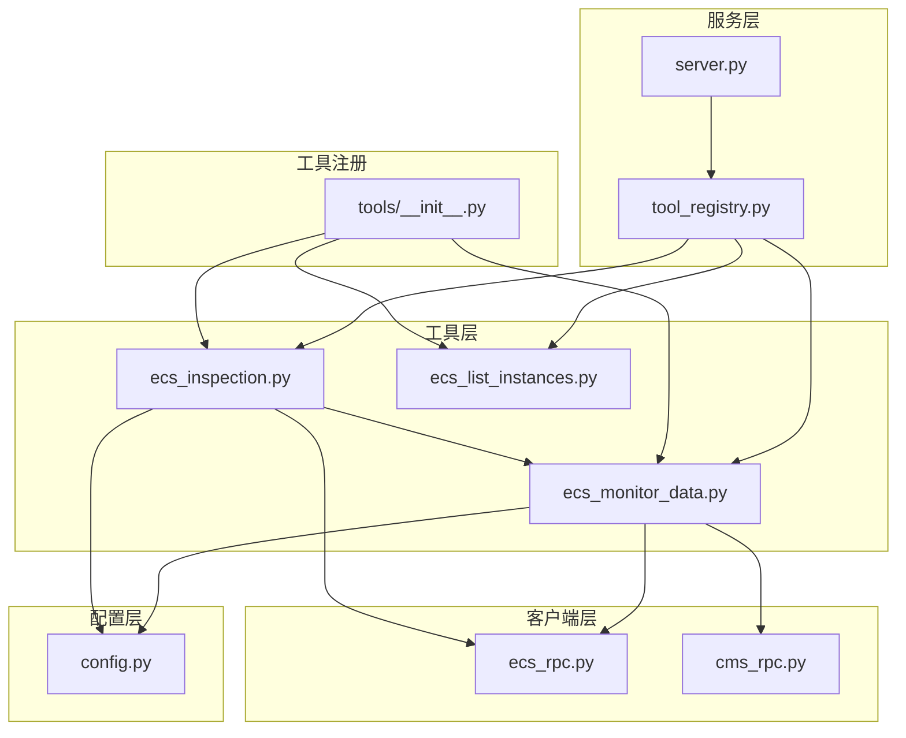
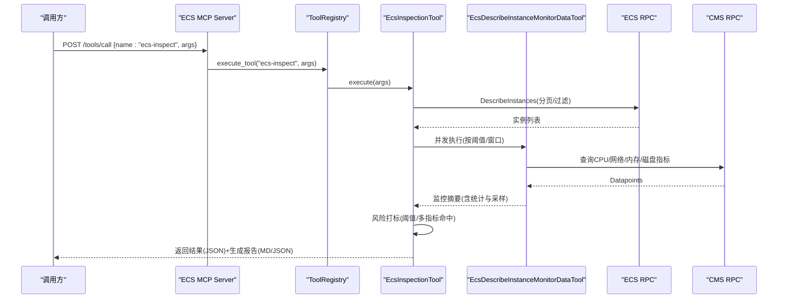
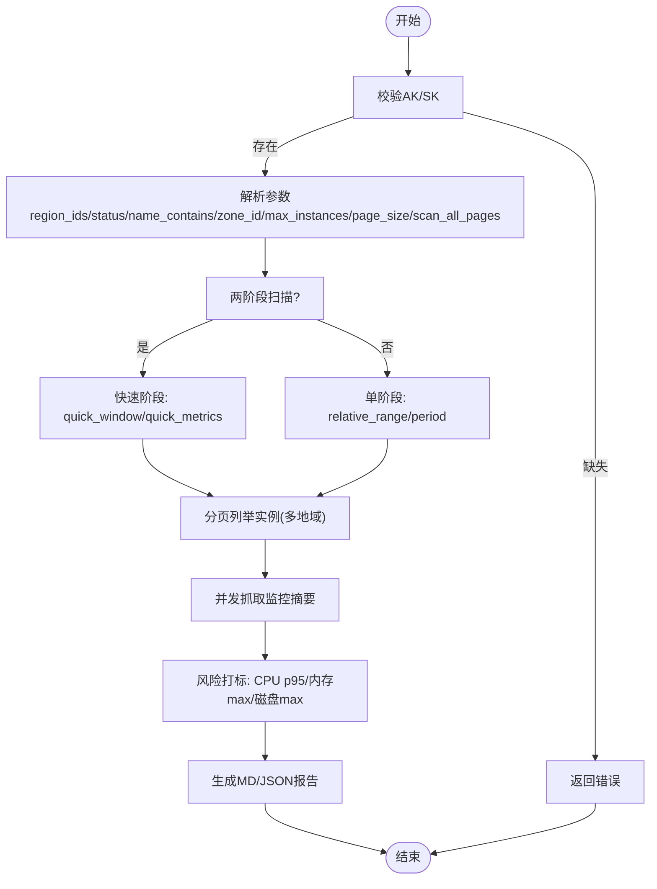
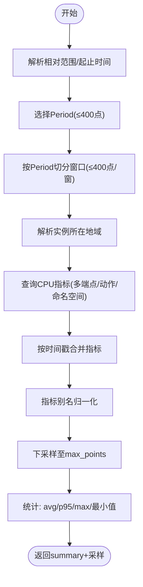
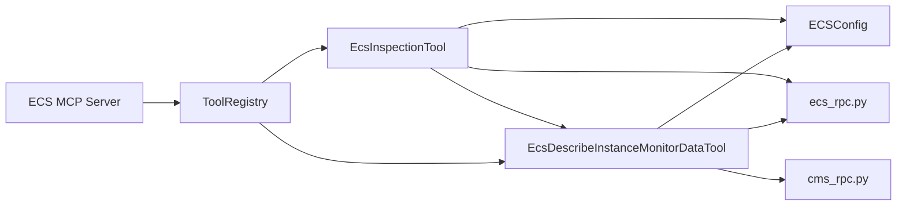

# ECS资源检查工具

<cite>
**本文引用的文件**
- [ecs_inspection.py](file://backend/src/ecs_mcp/tools/ecs_inspection.py)
- [ecs_inspection.py](file://archived/ecs-mcp-standalone/src/ecs_mcp/tools/ecs_inspection.py)
- [config.py](file://backend/src/ecs_mcp/config.py)
- [config.py](file://archived/ecs-mcp-standalone/src/ecs_mcp/config.py)
- [ecs_rpc.py](file://backend/src/ecs_mcp/clients/ecs_rpc.py)
- [ecs_rpc.py](file://archived/ecs-mcp-standalone/src/ecs_mcp/clients/ecs_rpc.py)
- [cms_rpc.py](file://backend/src/ecs_mcp/clients/cms_rpc.py)
- [ecs_monitor_data.py](file://backend/src/ecs_mcp/tools/ecs_monitor_data.py)
- [ecs_monitor_data.py](file://archived/ecs-mcp-standalone/src/ecs_mcp/tools/ecs_monitor_data.py)
- [server.py](file://backend/src/ecs_mcp/server.py)
- [tool_registry.py](file://backend/src/ecs_mcp/core/tool_registry.py)
- [__init__.py](file://backend/src/ecs_mcp/tools/__init__.py)
- [inspection_cn-beijing_20250917_064105.md](file://archived/ecs-mcp-standalone/project_document/reports/ecs/inspection_cn-beijing_20250917_064105.md)
</cite>

## 目录
1. [简介](#简介)
2. [项目结构](#项目结构)
3. [核心组件](#核心组件)
4. [架构总览](#架构总览)
5. [详细组件分析](#详细组件分析)
6. [依赖关系分析](#依赖关系分析)
7. [性能考量](#性能考量)
8. [故障排查指南](#故障排查指南)
9. [结论](#结论)
10. [附录](#附录)

## 简介
ECS资源检查工具（ecs-inspect）是一个基于阿里云ECS的批量巡检工具，支持按地域、状态、可用区、实例名关键字等条件筛选实例，自动拉取监控摘要，应用阈值规则打标风险等级，并生成Markdown巡检报告与JSON结果。工具具备两阶段扫描能力（快速阶段），支持并发控制、分页扫描、多地域聚合、阈值配置与输出定制，适合定期健康评估与自动化运维场景。

## 项目结构
该工具位于后端ECS MCP子系统中，采用模块化设计：
- 工具层：ecs_inspection.py、ecs_monitor_data.py、ecs_list_instances.py（工具注册时统一注册）
- 客户端层：ecs_rpc.py（ECS API）、cms_rpc.py（CloudMonitor API）
- 配置层：config.py（环境变量加载与配置模型）
- 服务层：server.py（FastAPI + SSE事件流）
- 注册中心：tool_registry.py（工具注册与执行）

图表来源
- [ecs_inspection.py:1-324](file://backend/src/ecs_mcp/tools/ecs_inspection.py#L1-324)
- [ecs_monitor_data.py:1-479](file://backend/src/ecs_mcp/tools/ecs_monitor_data.py#L1-479)
- [ecs_rpc.py:1-65](file://backend/src/ecs_mcp/clients/ecs_rpc.py#L1-65)
- [cms_rpc.py:1-66](file://backend/src/ecs_mcp/clients/cms_rpc.py#L1-66)
- [config.py:1-63](file://backend/src/ecs_mcp/config.py#L1-63)
- [server.py:1-280](file://backend/src/ecs_mcp/server.py#L1-280)
- [tool_registry.py:1-140](file://backend/src/ecs_mcp/core/tool_registry.py#L1-140)
- [__init__.py:1-47](file://backend/src/ecs_mcp/tools/__init__.py#L1-47)

章节来源
- [server.py:1-280](file://backend/src/ecs_mcp/server.py#L1-280)
- [tool_registry.py:1-140](file://backend/src/ecs_mcp/core/tool_registry.py#L1-140)
- [__init__.py:1-47](file://backend/src/ecs_mcp/tools/__init__.py#L1-47)

## 核心组件
- EcsInspectionTool：批量巡检工具，负责实例筛选、并发监控抓取、风险打标、报告生成与结果输出。
- EcsDescribeInstanceMonitorDataTool：监控数据查询工具，自动选择Period、分片聚合、下采样与统计。
- ECSConfig：配置模型，支持多环境变量源加载，包含阿里云AK/SK、地域、调用超时与并发等。
- ECS MCP Server：基于FastAPI的HTTP服务，提供工具清单、调用与SSE事件流。
- ToolRegistry：工具注册与执行中心，支持分类管理与异步执行。

章节来源
- [ecs_inspection.py:28-324](file://backend/src/ecs_mcp/tools/ecs_inspection.py#L28-324)
- [ecs_monitor_data.py:75-479](file://backend/src/ecs_mcp/tools/ecs_monitor_data.py#L75-479)
- [config.py:44-63](file://backend/src/ecs_mcp/config.py#L44-63)
- [server.py:43-280](file://backend/src/ecs_mcp/server.py#L43-280)
- [tool_registry.py:60-140](file://backend/src/ecs_mcp/core/tool_registry.py#L60-140)

## 架构总览
ECS巡检流程分为三阶段：
1) 实例筛选与分页：根据地域、状态、可用区、实例名关键字过滤，支持多地域与分页扫描。
2) 并发监控抓取：使用信号量控制并发度，调用监控工具获取各实例的监控摘要。
3) 风险打标与报告：计算CPU p95、内存/磁盘最大值，按阈值打标，生成Markdown与JSON报告。

图表来源
- [server.py:131-246](file://backend/src/ecs_mcp/server.py#L131-246)
- [tool_registry.py:102-119](file://backend/src/ecs_mcp/core/tool_registry.py#L102-119)
- [ecs_inspection.py:77-324](file://backend/src/ecs_mcp/tools/ecs_inspection.py#L77-324)
- [ecs_monitor_data.py:103-436](file://backend/src/ecs_mcp/tools/ecs_monitor_data.py#L103-436)
- [ecs_rpc.py:58-65](file://backend/src/ecs_mcp/clients/ecs_rpc.py#L58-65)
- [cms_rpc.py:56-65](file://backend/src/ecs_mcp/clients/cms_rpc.py#L56-65)

## 详细组件分析

### EcsInspectionTool（巡检工具）
- 功能要点
  - 输入参数：region_id/region_ids、status、name_contains、zone_id、max_instances、page_size、scan_all_pages、max_concurrency、two_phase、quick_window、quick_metrics、relative_range、period、thresholds。
  - 实例筛选：支持多地域、分页、状态/名称/Zone过滤，限制最大实例数。
  - 并发抓取：使用信号量控制并发度，调用监控工具获取摘要。
  - 风险打标：CPU p95阈值、内存/磁盘最大值阈值，多指标命中判定高风险。
  - 报告生成：Markdown报告与JSON结果，包含Top风险实例、明细采样与元信息。
- 关键算法
  - 风险评分：按CPU p95权重最高、内存max次之、磁盘max最低的加权求和，Top风险按该分数降序。
  - 阈值规则：任一指标触发即标记对应风险标志，两项及以上命中为高风险，一项为中风险。
- 输出结构
  - regions、window、instances（含风险等级、阈值标记、统计值）、summary、report_path、finished_at_utc、started_at_utc、duration_seconds、max_concurrency、result_json_path（可选）。

图表来源
- [ecs_inspection.py:77-324](file://backend/src/ecs_mcp/tools/ecs_inspection.py#L77-324)

章节来源
- [ecs_inspection.py:38-75](file://backend/src/ecs_mcp/tools/ecs_inspection.py#L38-75)
- [ecs_inspection.py:113-160](file://backend/src/ecs_mcp/tools/ecs_inspection.py#L113-160)
- [ecs_inspection.py:170-198](file://backend/src/ecs_mcp/tools/ecs_inspection.py#L170-198)
- [ecs_inspection.py:200-229](file://backend/src/ecs_mcp/tools/ecs_inspection.py#L200-229)
- [ecs_inspection.py:236-319](file://backend/src/ecs_mcp/tools/ecs_inspection.py#L236-319)

### EcsDescribeInstanceMonitorDataTool（监控数据工具）
- 功能要点
  - 自动Period选择：保证点数不超过400，必要时分片聚合。
  - 地域解析：尝试指定区域或候选区域，定位实例所在地域。
  - 指标归一化：支持多种别名映射，统一输出字段。
  - 下采样与统计：计算CPU平均、p95、最大值与内存/磁盘最大值。
- 关键算法
  - Period选择：遍历候选周期，满足点数≤400的最小周期，否则使用最大周期并分片。
  - 分片窗口：按最大点数切分时间窗口，逐段聚合。
  - 统计计算：CPU p95按升序取第95百分位，其他统计按均值/最大值计算。
  - 下采样：按步长截取，控制返回点数上限。

图表来源
- [ecs_monitor_data.py:103-436](file://backend/src/ecs_mcp/tools/ecs_monitor_data.py#L103-436)

章节来源
- [ecs_monitor_data.py:46-64](file://backend/src/ecs_mcp/tools/ecs_monitor_data.py#L46-64)
- [ecs_monitor_data.py:131-132](file://backend/src/ecs_mcp/tools/ecs_monitor_data.py#L131-132)
- [ecs_monitor_data.py:199-387](file://backend/src/ecs_mcp/tools/ecs_monitor_data.py#L199-387)
- [ecs_monitor_data.py:457-479](file://backend/src/ecs_mcp/tools/ecs_monitor_data.py#L457-479)

### 配置与认证
- 配置加载顺序（优先级从高到低）：backend/config.env → archived/ecs-mcp-standalone/config.env/.env → archived/k8s-mcp/config.env → 仓库根/.env。
- 关键配置项：ALIBABA_CLOUD_ACCESS_KEY_ID、ALIBABA_CLOUD_ACCESS_KEY_SECRET、ALIBABA_CLOUD_SECURITY_TOKEN、ALIBABA_CLOUD_ECS_REGION_ID、ECS_CALL_TIMEOUT、ECS_RETRY_ATTEMPTS、ECS_MAX_CONCURRENCY。
- ECS MCP服务：host/port/debug、SSE事件流、工具刷新与列表查询。

章节来源
- [config.py:11-41](file://backend/src/ecs_mcp/config.py#L11-41)
- [config.py:44-63](file://backend/src/ecs_mcp/config.py#L44-63)
- [server.py:43-280](file://backend/src/ecs_mcp/server.py#L43-280)

### 服务与工具注册
- 工具注册：延迟导入并注册ECS巡检、监控查询、实例列表等工具。
- 服务路由：/tools/call接收异步工具调用，/tools/refresh刷新工具列表，/tools提供Schema与描述，/events提供SSE事件流。
- 事件流：连接建立、心跳、工具列表推送、执行结果/错误事件。

章节来源
- [__init__.py:12-47](file://backend/src/ecs_mcp/tools/__init__.py#L12-47)
- [server.py:90-246](file://backend/src/ecs_mcp/server.py#L90-246)
- [tool_registry.py:60-140](file://backend/src/ecs_mcp/core/tool_registry.py#L60-140)

## 依赖关系分析
- 工具间依赖：ecs_inspection.py依赖ecs_monitor_data.py进行监控摘要获取；两者均依赖配置与RPC客户端。
- 客户端依赖：ecs_rpc.py与cms_rpc.py分别封装阿里云ECS与CMS的签名与HTTP调用。
- 服务依赖：server.py依赖tool_registry进行工具执行与事件广播。

图表来源
- [ecs_inspection.py:23-25](file://backend/src/ecs_mcp/tools/ecs_inspection.py#L23-25)
- [ecs_monitor_data.py:18-22](file://backend/src/ecs_mcp/tools/ecs_monitor_data.py#L18-22)
- [ecs_rpc.py:58-65](file://backend/src/ecs_mcp/clients/ecs_rpc.py#L58-65)
- [cms_rpc.py:56-65](file://backend/src/ecs_mcp/clients/cms_rpc.py#L56-65)
- [server.py:21-23](file://backend/src/ecs_mcp/server.py#L21-23)
- [tool_registry.py:102-119](file://backend/src/ecs_mcp/core/tool_registry.py#L102-119)

章节来源
- [ecs_inspection.py:23-25](file://backend/src/ecs_mcp/tools/ecs_inspection.py#L23-25)
- [ecs_monitor_data.py:18-22](file://backend/src/ecs_mcp/tools/ecs_monitor_data.py#L18-22)
- [server.py:21-23](file://backend/src/ecs_mcp/server.py#L21-23)
- [tool_registry.py:102-119](file://backend/src/ecs_mcp/core/tool_registry.py#L102-119)

## 性能考量
- 并发控制：通过信号量限制并发抓取，避免对监控API造成压力；默认并发度可配置。
- 分页与实例上限：分页大小最大100，实例总数受max_instances限制，防止大规模扫描。
- 周期选择与分片：监控工具自动选择周期并分片聚合，确保点数不超过400，提升稳定性。
- 下采样：对返回点数进行下采样，控制报告体量与传输成本。
- 超时与重试：配置层提供调用超时与重试次数，服务层工具级别超时可调。

章节来源
- [ecs_inspection.py:93-94](file://backend/src/ecs_mcp/tools/ecs_inspection.py#L93-94)
- [ecs_inspection.py:173-175](file://backend/src/ecs_mcp/tools/ecs_inspection.py#L173-175)
- [ecs_monitor_data.py:46-52](file://backend/src/ecs_mcp/tools/ecs_monitor_data.py#L46-52)
- [ecs_monitor_data.py:474-479](file://backend/src/ecs_mcp/tools/ecs_monitor_data.py#L474-479)
- [config.py:56-58](file://backend/src/ecs_mcp/config.py#L56-58)

## 故障排查指南
- AK/SK未配置：巡检工具会直接返回错误提示，请检查环境变量或配置文件。
- 网络与超时：若监控查询失败，检查网络连通性与超时设置；监控工具内部有分片与端点回退策略。
- 参数非法：relative_range格式错误、时间范围非法、实例不存在等情况会返回错误。
- 并发过高：适当降低max_concurrency，避免触发阿里云限流或服务端压力。
- 报告未生成：确认项目根目录下project_document/reports/ecs存在写权限，或检查工作目录。

章节来源
- [ecs_inspection.py:79-80](file://backend/src/ecs_mcp/tools/ecs_inspection.py#L79-80)
- [ecs_monitor_data.py:127-129](file://backend/src/ecs_mcp/tools/ecs_monitor_data.py#L127-129)
- [ecs_monitor_data.py:434-436](file://backend/src/ecs_mcp/tools/ecs_monitor_data.py#L434-436)

## 结论
ECS资源检查工具提供了完整的批量巡检能力，涵盖实例筛选、并发监控抓取、阈值风险打标与报告生成。其设计强调可配置性、可扩展性与可观测性，适合在生产环境中进行定期健康评估与自动化运维。通过SSE事件流与工具注册中心，工具可无缝集成到更大的MCP生态中。

## 附录

### 使用方法与集成方式
- 命令行调用（历史独立服务）
  - 启动独立HTTP服务：通过start_ecs_mcp_http_server.py运行，监听ECS MCP端口。
  - 调用工具：POST /tools/call，传入工具名“ecs-inspect”与参数。
  - 刷新工具：POST /tools/refresh，重新注册工具。
  - 查看工具：GET /tools，获取工具Schema与描述。
  - 事件流：GET /events，订阅SSE事件。
- API接口
  - /tools/call：异步调用工具，返回“已接受”响应，执行结果通过SSE推送。
  - /tools/refresh：刷新工具列表。
  - /tools：列出可用工具及其输入Schema。
  - /events：SSE事件流，推送连接、心跳、工具列表与执行结果。
- 自动化脚本集成
  - 在CI/CD中定时调用/refresh与/tools/call，结合SSE事件流收集结果。
  - 将生成的报告路径与JSON结果纳入工件或告警系统。

章节来源
- [server.py:90-246](file://backend/src/ecs_mcp/server.py#L90-246)
- [start_ecs_mcp_http_server.py:1-11](file://archived/ecs-mcp-standalone/start_ecs_mcp_http_server.py#L1-11)

### 参数配置选项
- 检查范围设置
  - region_id/region_ids：地域ID或数组，多地域扫描优先使用region_ids。
  - status：实例状态过滤（如Running/Stopped）。
  - name_contains：实例名关键字包含。
  - zone_id：可用区过滤。
  - max_instances：最大实例数限制。
  - page_size：分页大小（最大100）。
  - scan_all_pages：是否遍历所有页直至达到上限或无更多数据。
- 并发与扫描模式
  - max_concurrency：并发抓取并发度。
  - two_phase：是否启用两阶段扫描（快速阶段）。
  - quick_window：快速阶段时间窗口（如15m/30m）。
  - quick_metrics：快速阶段指标列表。
  - relative_range：单阶段时的时间窗口。
  - period：周期（60/600/3600）。
- 阈值配置
  - thresholds.cpu_p95_high：CPU p95阈值。
  - thresholds.memory_util_high：内存使用率阈值。
  - thresholds.disk_util_high：磁盘使用率阈值。
- 输出与行为
  - 输出：返回JSON结果与生成Markdown/JSON报告文件路径。

章节来源
- [ecs_inspection.py:38-75](file://backend/src/ecs_mcp/tools/ecs_inspection.py#L38-75)

### 核心算法详解
- 风险打标
  - CPU p95：来自监控工具统计；内存/磁盘最大值：从采样点估算。
  - 风险等级：任一指标触发为中风险；两项及以上为高风险；否则低风险。
- 报告生成
  - 汇总：统计高/中/低风险数量。
  - Top风险：按风险评分降序展示前N个实例。
  - 明细：每个实例展示风险等级、标记与CPU统计与采样点。

章节来源
- [ecs_inspection.py:200-229](file://backend/src/ecs_mcp/tools/ecs_inspection.py#L200-229)
- [ecs_inspection.py:236-289](file://backend/src/ecs_mcp/tools/ecs_inspection.py#L236-289)

### 使用示例与最佳实践
- 示例：按地域与状态筛选，设置CPU p95阈值为80%，并发度为5，生成报告。
- 最佳实践
  - 定期巡检：建议每日或每小时执行一次快速阶段扫描。
  - 阈值调优：根据业务负载调整阈值，避免误报与漏报。
  - 并发控制：结合实例规模与API配额，合理设置max_concurrency。
  - 报告归档：将报告保存至版本库或日志系统，便于审计与回溯。
  - 事件驱动：通过SSE事件流与告警系统联动，实现自动化处置。

章节来源
- [inspection_cn-beijing_20250917_064105.md:1-218](file://archived/ecs-mcp-standalone/project_document/reports/ecs/inspection_cn-beijing_20250917_064105.md#L1-218)