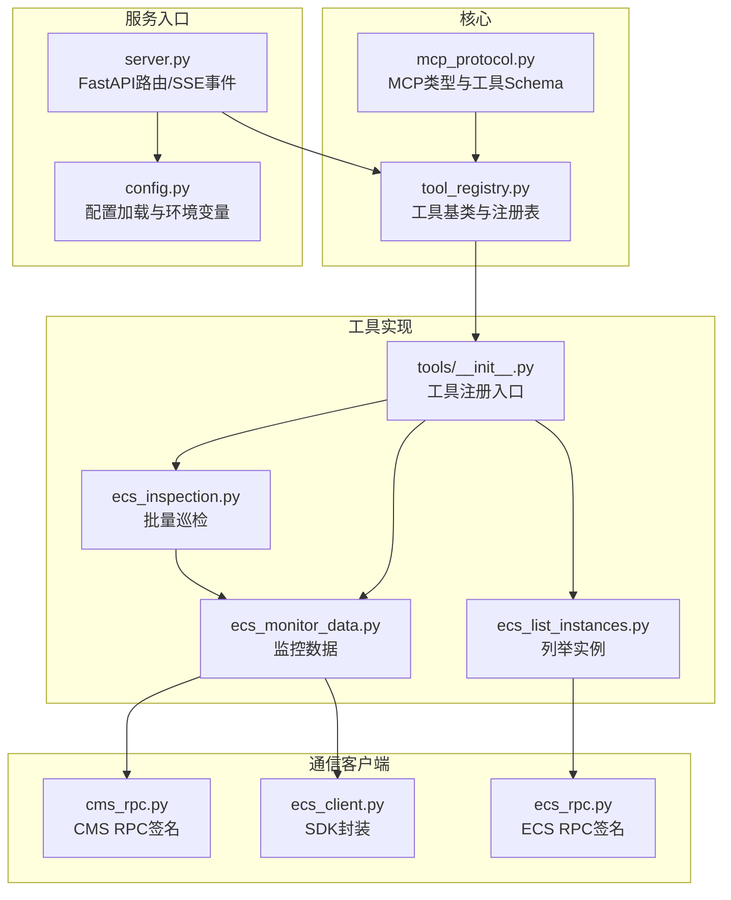
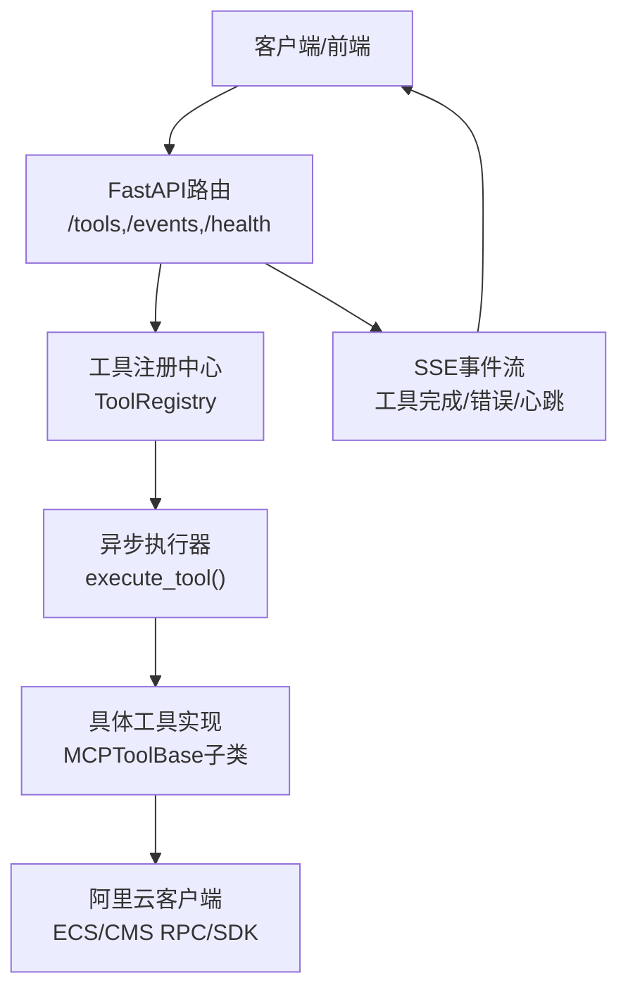
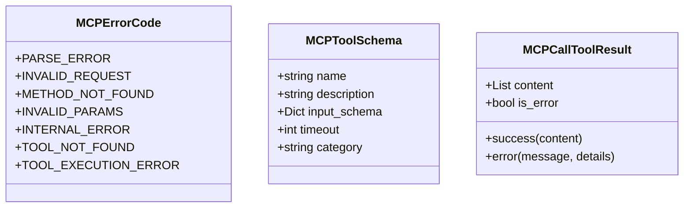
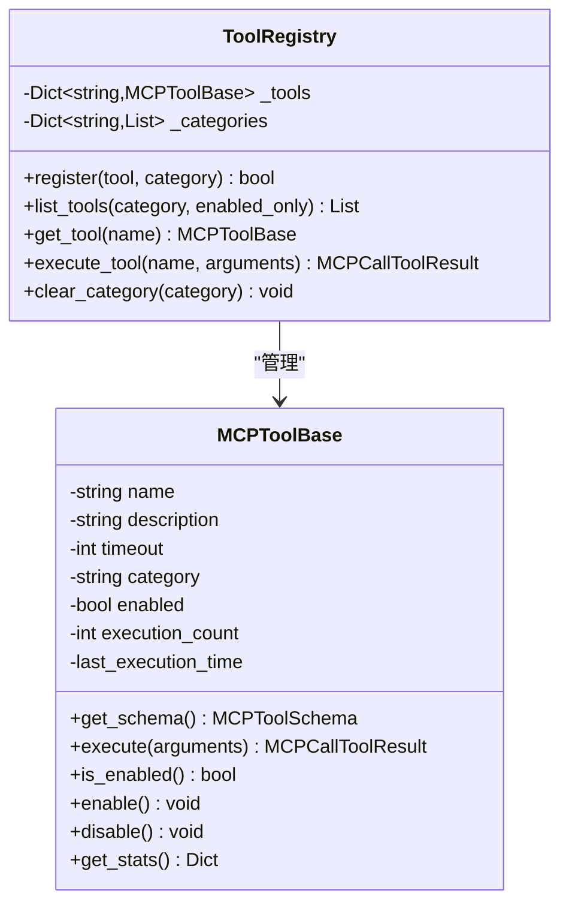
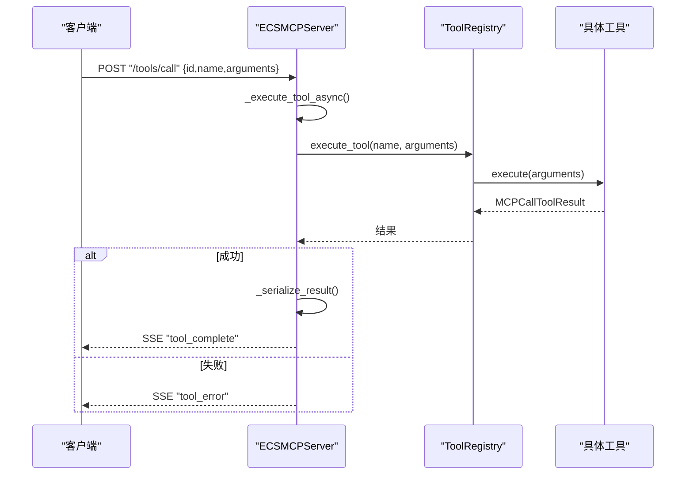
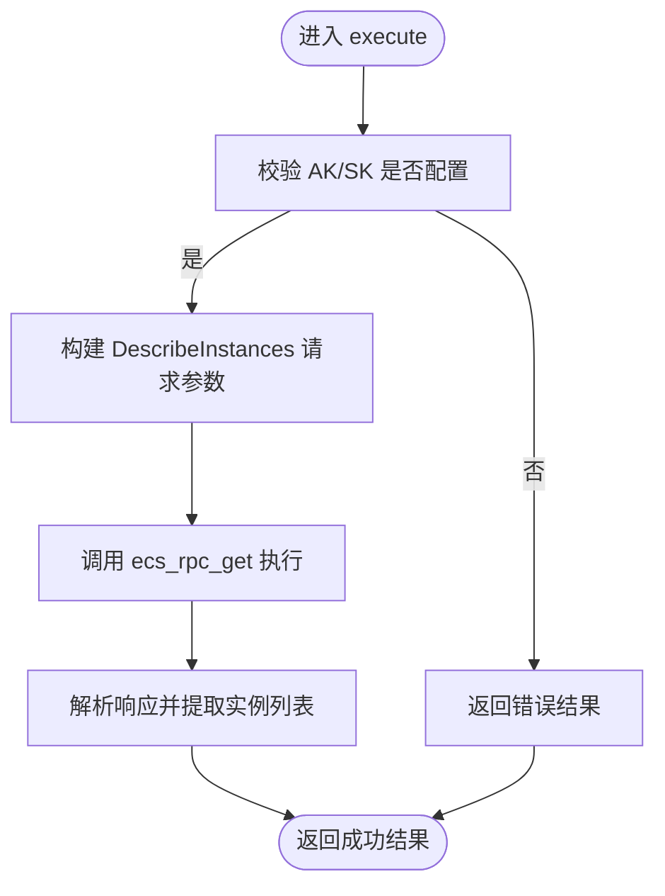
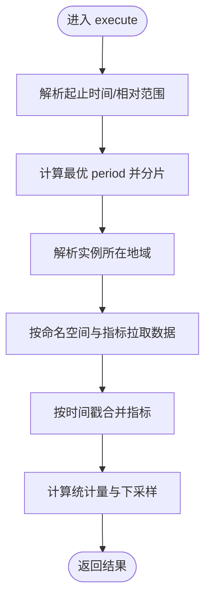
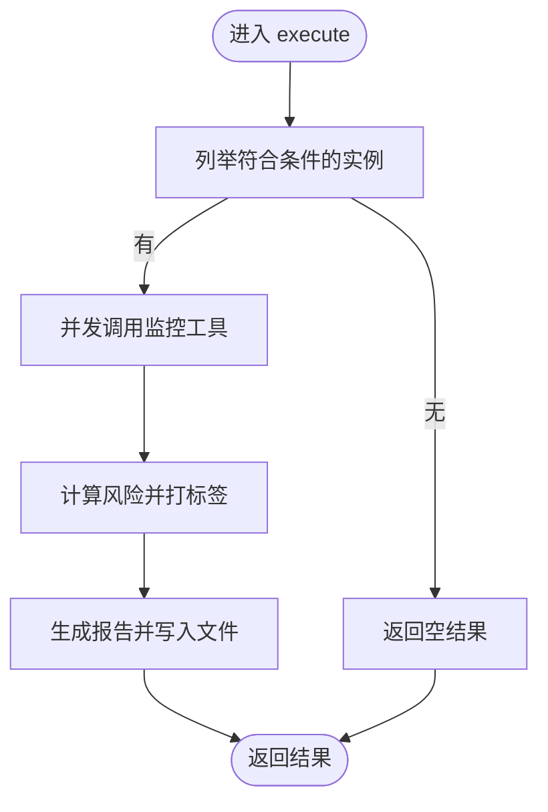
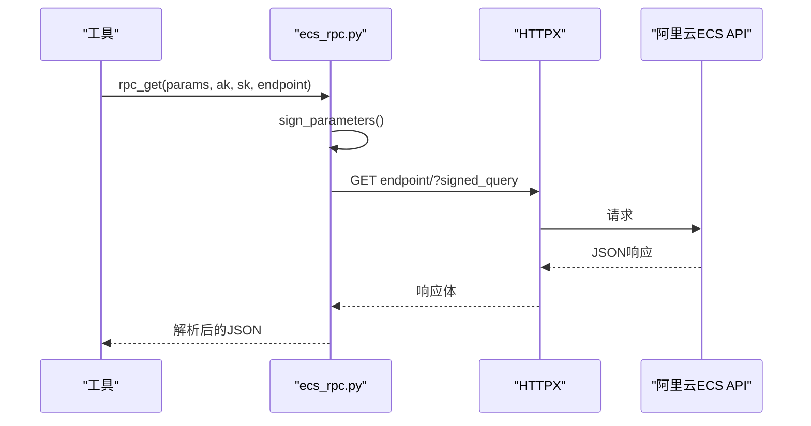
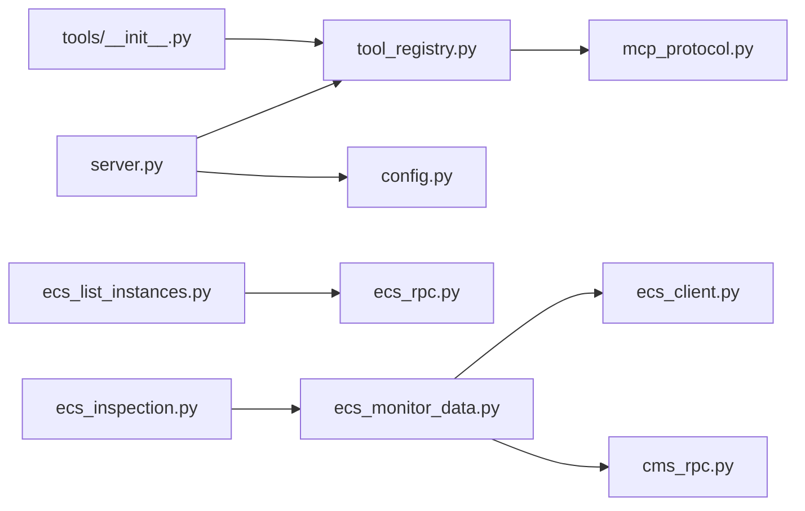

# ECS核心组件

<cite>
**本文引用的文件**
- [mcp_protocol.py](file://backend/src/ecs_mcp/core/mcp_protocol.py)
- [tool_registry.py](file://backend/src/ecs_mcp/core/tool_registry.py)
- [server.py](file://backend/src/ecs_mcp/server.py)
- [config.py](file://backend/src/ecs_mcp/config.py)
- [tools/__init__.py](file://backend/src/ecs_mcp/tools/__init__.py)
- [ecs_inspection.py](file://backend/src/ecs_mcp/tools/ecs_inspection.py)
- [ecs_list_instances.py](file://backend/src/ecs_mcp/tools/ecs_list_instances.py)
- [ecs_monitor_data.py](file://backend/src/ecs_mcp/tools/ecs_monitor_data.py)
- [ecs_client.py](file://backend/src/ecs_mcp/clients/ecs_client.py)
- [ecs_rpc.py](file://backend/src/ecs_mcp/clients/ecs_rpc.py)
- [cms_rpc.py](file://backend/src/ecs_mcp/clients/cms_rpc.py)
</cite>

## 目录
1. [简介](#简介)
2. [项目结构](#项目结构)
3. [核心组件](#核心组件)
4. [架构总览](#架构总览)
5. [详细组件分析](#详细组件分析)
6. [依赖分析](#依赖分析)
7. [性能考虑](#性能考虑)
8. [故障排查指南](#故障排查指南)
9. [结论](#结论)
10. [附录](#附录)

## 简介
本文件面向ECS MCP系统的核心组件，围绕MCP协议适配器、工具注册中心与通信协议处理展开，系统性说明以下内容：
- MCP协议实现细节：消息格式、连接管理、数据传输与事件广播
- 工具注册中心：工具发现、元数据管理、动态加载与执行统计
- 协议转换器：请求解析、响应生成、错误映射与SSE事件推送
- 组件协作机制：依赖注入、事件处理、状态同步与并发控制
- 使用示例与扩展开发指南：帮助开发者理解与定制核心功能

## 项目结构
ECS MCP后端采用“核心协议 + 工具注册中心 + 工具实现 + 通信客户端”的分层组织：
- 核心协议与注册中心位于 core 目录，提供MCP类型、工具基类与注册表
- 工具实现位于 tools 目录，通过装饰器与注册函数集中注册
- 通信客户端位于 clients 目录，封装阿里云ECS/CMS的RPC签名与调用
- 服务入口位于 server.py，提供FastAPI路由、SSE事件流与健康检查

图表来源
- [mcp_protocol.py:1-53](file://backend/src/ecs_mcp/core/mcp_protocol.py#L1-L53)
- [tool_registry.py:1-140](file://backend/src/ecs_mcp/core/tool_registry.py#L1-L140)
- [tools/__init__.py:1-47](file://backend/src/ecs_mcp/tools/__init__.py#L1-L47)
- [ecs_list_instances.py:1-115](file://backend/src/ecs_mcp/tools/ecs_list_instances.py#L1-L115)
- [ecs_monitor_data.py:1-479](file://backend/src/ecs_mcp/tools/ecs_monitor_data.py#L1-L479)
- [ecs_inspection.py:1-324](file://backend/src/ecs_mcp/tools/ecs_inspection.py#L1-L324)
- [ecs_client.py:1-86](file://backend/src/ecs_mcp/clients/ecs_client.py#L1-L86)
- [ecs_rpc.py:1-65](file://backend/src/ecs_mcp/clients/ecs_rpc.py#L1-L65)
- [cms_rpc.py:1-66](file://backend/src/ecs_mcp/clients/cms_rpc.py#L1-L66)
- [server.py:1-280](file://backend/src/ecs_mcp/server.py#L1-L280)
- [config.py:1-63](file://backend/src/ecs_mcp/config.py#L1-L63)

章节来源
- [server.py:1-280](file://backend/src/ecs_mcp/server.py#L1-L280)
- [config.py:1-63](file://backend/src/ecs_mcp/config.py#L1-L63)

## 核心组件
本节聚焦三个关键组件：MCP协议适配器、工具注册中心、协议转换器。

- MCP协议适配器
  - 提供MCP错误码枚举、工具Schema定义与工具调用结果封装
  - 规范请求ID生成与统一的文本型内容承载结构
  - 为工具执行提供一致的输入/输出契约

- 工具注册中心
  - 工具基类抽象出Schema与异步执行接口
  - 注册表负责工具注册、分类索引、启用/禁用与执行统计
  - 提供装饰器式注册与批量注册能力

- 协议转换器（服务端）
  - 基于FastAPI提供HTTP接口：工具列表、调用、刷新与SSE事件
  - 异步执行工具调用，广播执行结果与错误事件
  - 自动序列化结果，兼容多种数据结构

章节来源
- [mcp_protocol.py:14-52](file://backend/src/ecs_mcp/core/mcp_protocol.py#L14-L52)
- [tool_registry.py:15-139](file://backend/src/ecs_mcp/core/tool_registry.py#L15-L139)
- [server.py:43-280](file://backend/src/ecs_mcp/server.py#L43-L280)

## 架构总览
ECS MCP系统采用“服务端 + 工具注册中心 + 工具实现 + 通信客户端”的分层架构。服务端通过FastAPI暴露REST接口与SSE事件通道，工具注册中心集中管理工具生命周期，工具实现通过客户端访问阿里云API，最终统一以MCPCallToolResult返回。

图表来源
- [server.py:90-280](file://backend/src/ecs_mcp/server.py#L90-L280)
- [tool_registry.py:60-139](file://backend/src/ecs_mcp/core/tool_registry.py#L60-L139)
- [ecs_list_instances.py:23-115](file://backend/src/ecs_mcp/tools/ecs_list_instances.py#L23-L115)
- [ecs_monitor_data.py:75-479](file://backend/src/ecs_mcp/tools/ecs_monitor_data.py#L75-L479)
- [ecs_inspection.py:28-324](file://backend/src/ecs_mcp/tools/ecs_inspection.py#L28-L324)
- [ecs_rpc.py:58-65](file://backend/src/ecs_mcp/clients/ecs_rpc.py#L58-L65)
- [cms_rpc.py:56-66](file://backend/src/ecs_mcp/clients/cms_rpc.py#L56-L66)

## 详细组件分析

### MCP协议适配器
- 错误码体系：涵盖通用MCP错误与工具专属错误，便于前端与上层系统统一处理
- 工具Schema：标准化工具元信息与输入参数约束，支持超时与分类
- 调用结果：统一以内容数组承载，支持成功与错误两种形态，并提供便捷构造方法

图表来源
- [mcp_protocol.py:14-52](file://backend/src/ecs_mcp/core/mcp_protocol.py#L14-L52)

章节来源
- [mcp_protocol.py:14-52](file://backend/src/ecs_mcp/core/mcp_protocol.py#L14-L52)

### 工具注册中心
- 工具基类：抽象出get_schema与execute接口，内置启用/禁用、执行计数与统计信息
- 注册表：维护工具字典与分类索引，支持按分类与启用状态检索
- 执行流程：异步执行工具，记录耗时与时间戳，异常统一映射为错误结果

图表来源
- [tool_registry.py:15-139](file://backend/src/ecs_mcp/core/tool_registry.py#L15-L139)

章节来源
- [tool_registry.py:60-139](file://backend/src/ecs_mcp/core/tool_registry.py#L60-L139)

### 协议转换器（服务端）
- 路由设计：根路径、健康检查、工具列表、工具调用、刷新工具、SSE事件流
- 异步执行：工具调用以任务形式提交，完成后通过SSE广播事件
- 序列化策略：递归序列化结果，优先使用模型dump，兜底为字符串
- 事件广播：支持工具完成、错误与心跳事件，客户端可订阅工具列表更新

图表来源
- [server.py:131-246](file://backend/src/ecs_mcp/server.py#L131-L246)
- [tool_registry.py:102-119](file://backend/src/ecs_mcp/core/tool_registry.py#L102-L119)

章节来源
- [server.py:90-280](file://backend/src/ecs_mcp/server.py#L90-L280)

### 工具实现与客户端集成

#### ECS实例列表工具
- 功能：按地域、状态、分页列举实例，返回实例ID与基础元数据
- 输入Schema：包含region_id、status、page_number、page_size等
- 执行流程：校验AK/SK，构造DescribeInstances请求，调用RPC客户端，解析响应

图表来源
- [ecs_list_instances.py:47-115](file://backend/src/ecs_mcp/tools/ecs_list_instances.py#L47-L115)
- [ecs_rpc.py:58-65](file://backend/src/ecs_mcp/clients/ecs_rpc.py#L58-L65)

章节来源
- [ecs_list_instances.py:23-115](file://backend/src/ecs_mcp/tools/ecs_list_instances.py#L23-L115)
- [ecs_rpc.py:1-65](file://backend/src/ecs_mcp/clients/ecs_rpc.py#L1-L65)

#### ECS监控数据工具
- 功能：自动选择period、分片聚合、下采样与统计，返回CPU/网络/磁盘等指标摘要
- 时间处理：支持绝对时间与相对范围，自动进位至分钟边界
- 地域解析：尝试指定区域或候选区域，定位实例所在地域
- 指标别名：统一网络与磁盘指标别名，按需过滤返回

图表来源
- [ecs_monitor_data.py:103-479](file://backend/src/ecs_mcp/tools/ecs_monitor_data.py#L103-L479)
- [cms_rpc.py:56-66](file://backend/src/ecs_mcp/clients/cms_rpc.py#L56-L66)

章节来源
- [ecs_monitor_data.py:75-479](file://backend/src/ecs_mcp/tools/ecs_monitor_data.py#L75-L479)
- [cms_rpc.py:1-66](file://backend/src/ecs_mcp/clients/cms_rpc.py#L1-L66)

#### ECS批量巡检工具
- 功能：按条件筛选实例，调用监控工具并发采集，打标签并生成报告
- 并发控制：使用信号量限制并发度，避免触发限流
- 风险评估：综合CPU p95、内存/磁盘峰值，给出高/中/低风险等级
- 报告生成：输出Markdown与JSON报告，保存至仓库目录

图表来源
- [ecs_inspection.py:77-324](file://backend/src/ecs_mcp/tools/ecs_inspection.py#L77-L324)

章节来源
- [ecs_inspection.py:28-324](file://backend/src/ecs_mcp/tools/ecs_inspection.py#L28-L324)

### 通信协议处理
- ECS RPC签名：实现阿里云RPC签名算法，支持GET请求与查询参数拼装
- CMS RPC签名：针对CloudMonitor API的签名与调用，支持区域域名切换
- SDK封装：对阿里云ECS SDK进行异步包装，避免凭证链兼容问题

图表来源
- [ecs_rpc.py:58-65](file://backend/src/ecs_mcp/clients/ecs_rpc.py#L58-L65)

章节来源
- [ecs_rpc.py:1-65](file://backend/src/ecs_mcp/clients/ecs_rpc.py#L1-L65)
- [cms_rpc.py:1-66](file://backend/src/ecs_mcp/clients/cms_rpc.py#L1-L66)
- [ecs_client.py:1-86](file://backend/src/ecs_mcp/clients/ecs_client.py#L1-L86)

## 依赖分析
- 组件耦合
  - 服务端依赖注册中心与配置模块，通过装饰器与注册函数集中加载工具
  - 工具实现依赖客户端模块，间接依赖阿里云API
  - 注册中心依赖协议适配器提供的Schema与结果类型
- 外部依赖
  - FastAPI用于HTTP路由与SSE
  - httpx用于异步HTTP请求
  - loguru用于日志记录
- 循环依赖
  - 通过延迟导入避免工具与注册中心之间的循环引用

图表来源
- [server.py:21-24](file://backend/src/ecs_mcp/server.py#L21-L24)
- [tools/__init__.py:12-47](file://backend/src/ecs_mcp/tools/__init__.py#L12-L47)
- [tool_registry.py:12-12](file://backend/src/ecs_mcp/core/tool_registry.py#L12-L12)
- [mcp_protocol.py:5-11](file://backend/src/ecs_mcp/core/mcp_protocol.py#L5-L11)
- [ecs_list_instances.py:17-21](file://backend/src/ecs_mcp/tools/ecs_list_instances.py#L17-L21)
- [ecs_monitor_data.py:17-23](file://backend/src/ecs_mcp/tools/ecs_monitor_data.py#L17-L23)
- [ecs_inspection.py:21-25](file://backend/src/ecs_mcp/tools/ecs_inspection.py#L21-L25)
- [ecs_client.py:11-16](file://backend/src/ecs_mcp/clients/ecs_client.py#L11-L16)
- [ecs_rpc.py:15-17](file://backend/src/ecs_mcp/clients/ecs_rpc.py#L15-L17)
- [cms_rpc.py:18-19](file://backend/src/ecs_mcp/clients/cms_rpc.py#L18-L19)

章节来源
- [server.py:1-280](file://backend/src/ecs_mcp/server.py#L1-L280)
- [tools/__init__.py:1-47](file://backend/src/ecs_mcp/tools/__init__.py#L1-L47)

## 性能考虑
- 并发与限流
  - 巡检工具使用信号量控制并发，避免触发阿里云限流
  - 监控工具自动选择period并分片聚合，确保点数不超过上限
- 序列化与传输
  - 服务端对复杂对象进行递归序列化，保证SSE事件数据可传输
  - 对不可序列化对象降级为字符串，避免中断事件流
- 超时与重试
  - 配置模块提供调用超时、重试次数与最大并发参数，便于在不同环境中调整
- 日志与可观测性
  - 关键路径记录执行耗时与状态，便于性能分析与问题定位

## 故障排查指南
- 常见错误
  - 未配置AK/SK：工具会返回明确的错误提示，检查环境变量
  - 工具不存在或被禁用：注册中心会返回相应错误，确认工具是否正确注册与启用
  - 超时或限流：适当降低并发或增大超时，关注SSE事件中的错误信息
- 日志定位
  - 服务端日志包含请求ID、工具名称与执行耗时，便于追踪
  - 工具内部捕获异常并统一映射为错误结果，便于前端展示
- 事件流
  - SSE事件包含工具完成与错误两类，客户端应监听并显示对应消息

章节来源
- [server.py:189-246](file://backend/src/ecs_mcp/server.py#L189-L246)
- [tool_registry.py:102-119](file://backend/src/ecs_mcp/core/tool_registry.py#L102-L119)
- [ecs_list_instances.py:57-58](file://backend/src/ecs_mcp/tools/ecs_list_instances.py#L57-L58)
- [ecs_monitor_data.py:134-135](file://backend/src/ecs_mcp/tools/ecs_monitor_data.py#L134-L135)

## 结论
ECS MCP系统通过清晰的分层设计与标准化协议，实现了工具的统一注册、灵活扩展与稳定运行。服务端提供REST与SSE双通道，工具侧以装饰器与注册函数实现零样板代码，客户端封装阿里云API，整体具备良好的可维护性与可扩展性。建议在生产环境中结合配置模块参数与SSE事件流，完善监控与告警机制。

## 附录

### 组件使用示例
- 启动服务
  - 设置环境变量后直接运行服务入口，或通过Uvicorn启动
  - 服务默认监听配置中的主机与端口，支持热重载
- 调用工具
  - 通过POST /tools/call提交工具名称与参数，异步执行并接收SSE事件
  - 通过GET /tools获取已启用工具的Schema与描述
- 刷新工具
  - 通过POST /tools/refresh重新注册工具，触发SSE工具列表更新事件

章节来源
- [server.py:248-280](file://backend/src/ecs_mcp/server.py#L248-L280)
- [tools/__init__.py:12-47](file://backend/src/ecs_mcp/tools/__init__.py#L12-L47)

### 扩展开发指南
- 新增工具
  - 继承工具基类，实现get_schema与execute方法
  - 在tools/__init__.py中追加导入与注册，或使用装饰器注册
- 修改Schema
  - 在工具的get_schema中定义输入参数约束与默认值
- 自定义客户端
  - 如需新增API，参考ecs_rpc.py或cms_rpc.py的签名与调用模式
- 配置管理
  - 通过config.py加载环境变量，统一管理主机、端口、AK/SK与并发参数

章节来源
- [tool_registry.py:15-139](file://backend/src/ecs_mcp/core/tool_registry.py#L15-L139)
- [tools/__init__.py:12-47](file://backend/src/ecs_mcp/tools/__init__.py#L12-L47)
- [config.py:44-63](file://backend/src/ecs_mcp/config.py#L44-L63)