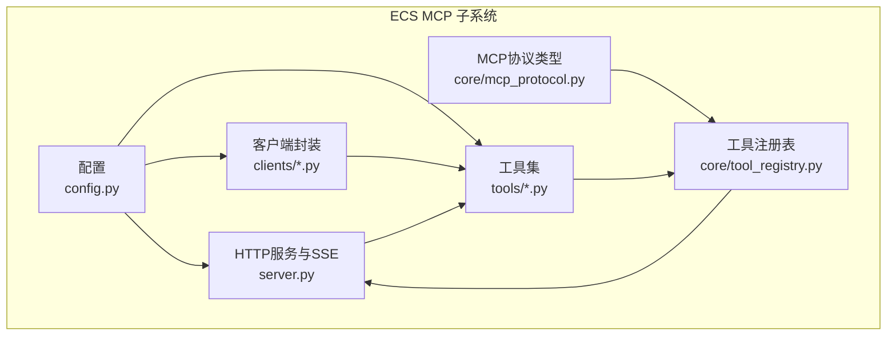
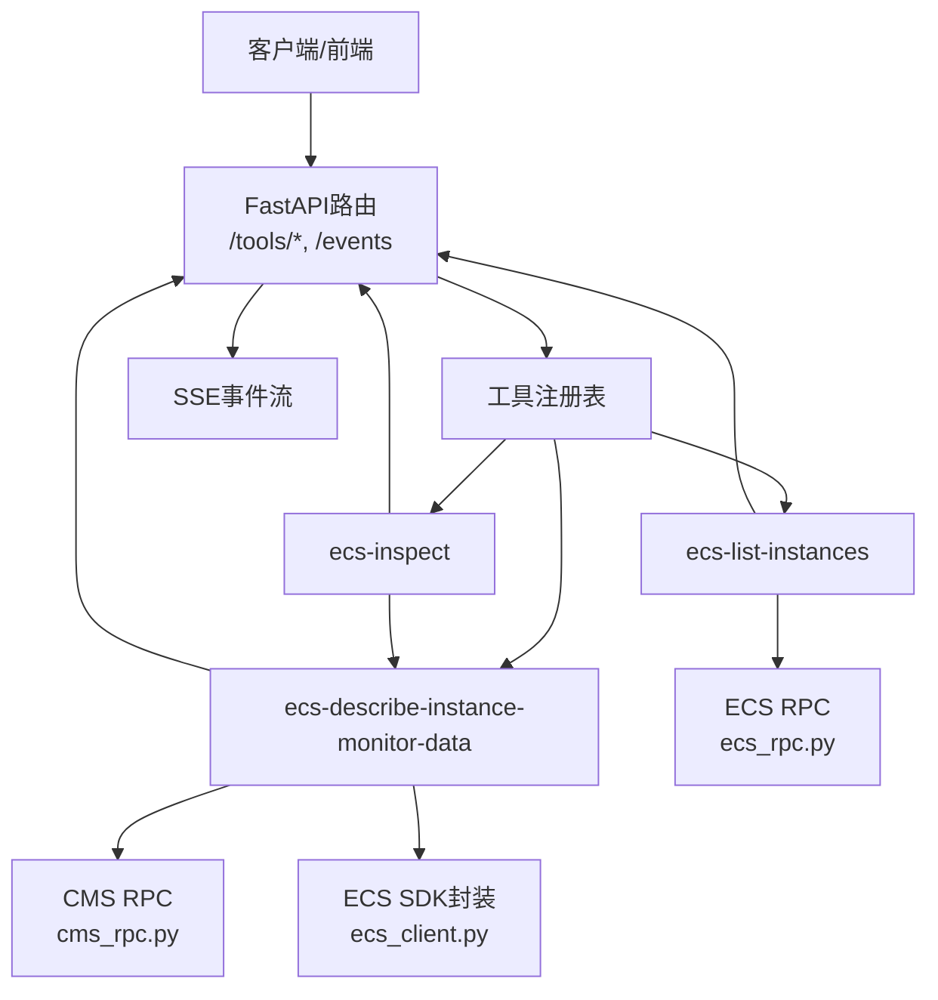
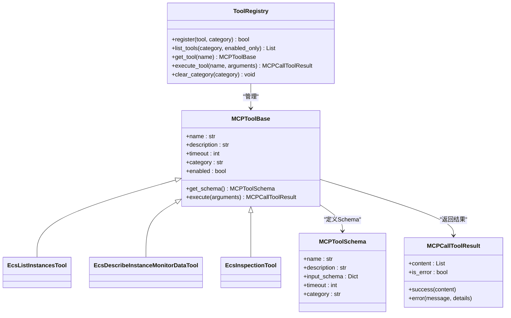
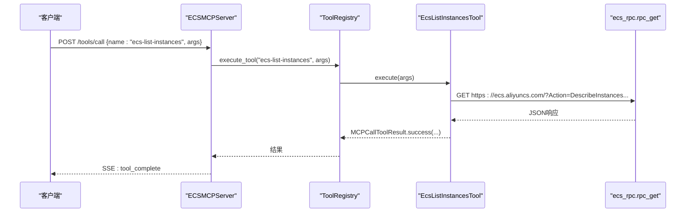
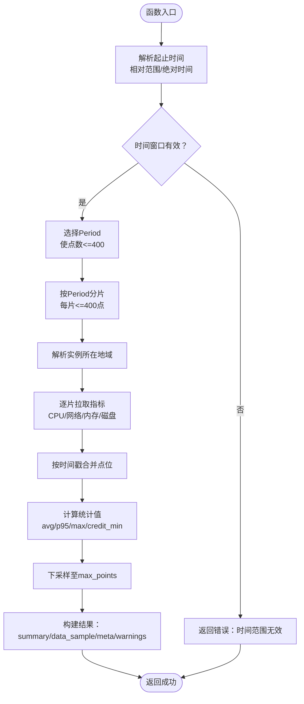
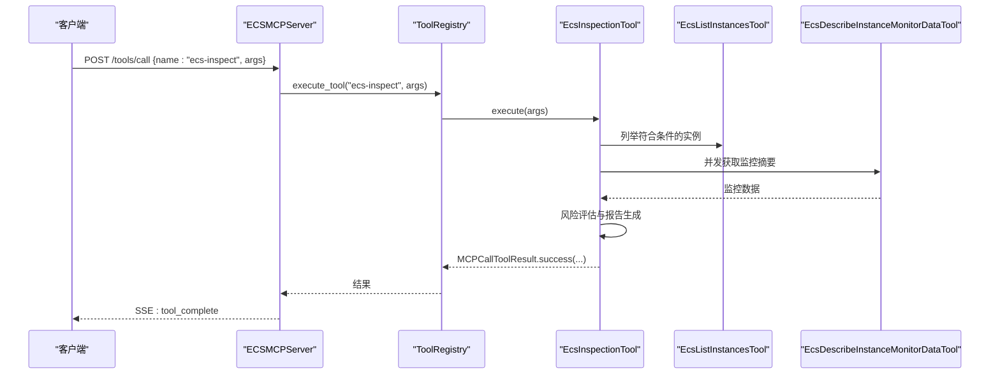
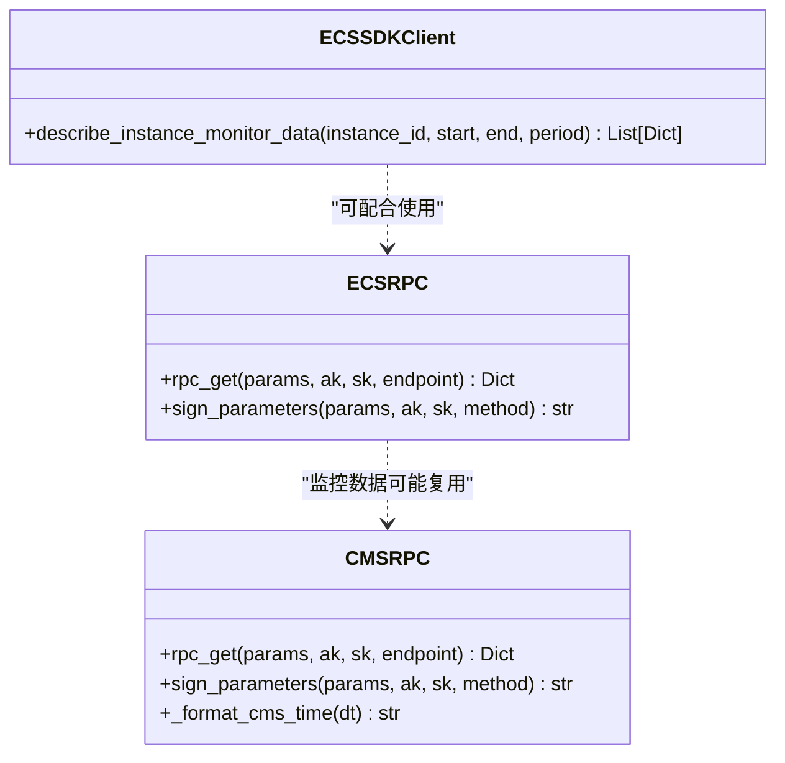
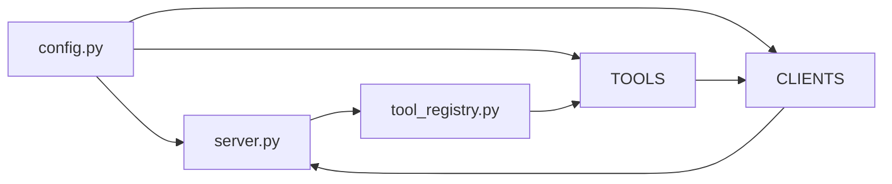

# ECS资源管理

<cite>
**本文引用的文件**
- [backend/src/ecs_mcp/__init__.py](file://backend/src/ecs_mcp/__init__.py)
- [backend/src/ecs_mcp/config.py](file://backend/src/ecs_mcp/config.py)
- [backend/src/ecs_mcp/server.py](file://backend/src/ecs_mcp/server.py)
- [backend/src/ecs_mcp/core/tool_registry.py](file://backend/src/ecs_mcp/core/tool_registry.py)
- [backend/src/ecs_mcp/core/mcp_protocol.py](file://backend/src/ecs_mcp/core/mcp_protocol.py)
- [backend/src/ecs_mcp/tools/__init__.py](file://backend/src/ecs_mcp/tools/__init__.py)
- [backend/src/ecs_mcp/tools/ecs_list_instances.py](file://backend/src/ecs_mcp/tools/ecs_list_instances.py)
- [backend/src/ecs_mcp/tools/ecs_monitor_data.py](file://backend/src/ecs_mcp/tools/ecs_monitor_data.py)
- [backend/src/ecs_mcp/tools/ecs_inspection.py](file://backend/src/ecs_mcp/tools/ecs_inspection.py)
- [backend/src/ecs_mcp/clients/ecs_client.py](file://backend/src/ecs_mcp/clients/ecs_client.py)
- [backend/src/ecs_mcp/clients/ecs_rpc.py](file://backend/src/ecs_mcp/clients/ecs_rpc.py)
- [backend/src/ecs_mcp/clients/cms_rpc.py](file://backend/src/ecs_mcp/clients/cms_rpc.py)
- [config/mcp_config.example.json](file://config/mcp_config.example.json)
</cite>

## 目录
1. [简介](#简介)
2. [项目结构](#项目结构)
3. [核心组件](#核心组件)
4. [架构总览](#架构总览)
5. [详细组件分析](#详细组件分析)
6. [依赖分析](#依赖分析)
7. [性能考虑](#性能考虑)
8. [故障排查指南](#故障排查指南)
9. [结论](#结论)
10. [附录](#附录)

## 简介
本文件面向ECS资源管理功能，系统性阐述基于阿里云ECS的工具体系架构与实现，涵盖实例查询、监控数据获取与资源检查能力。文档重点说明：
- 工具实现：API调用封装、参数校验、结果处理与错误处理
- 与阿里云SDK/自研RPC的集成：认证配置、请求签名与响应解析
- 监控数据采集与处理：指标聚合、分片与下采样、实时更新
- 资源检查与分析：健康状态评估、性能指标分析与报告生成
- 配置示例、使用指南与最佳实践
- 与MCP协议的集成方式与扩展开发指南

## 项目结构
ECS MCP子系统位于后端目录，采用“工具+客户端+核心协议+服务”的分层组织：
- 配置层：ECS配置与环境变量加载
- 工具层：实例查询、监控数据查询、批量巡检等工具
- 客户端层：SDK封装与RPC签名调用（ECS/CMS）
- 核心协议层：MCP工具协议与注册表
- 服务层：FastAPI驱动的HTTP服务与SSE事件推送

图表来源
- [backend/src/ecs_mcp/config.py:1-63](file://backend/src/ecs_mcp/config.py#L1-L63)
- [backend/src/ecs_mcp/server.py:1-280](file://backend/src/ecs_mcp/server.py#L1-L280)
- [backend/src/ecs_mcp/core/tool_registry.py:1-140](file://backend/src/ecs_mcp/core/tool_registry.py#L1-L140)
- [backend/src/ecs_mcp/core/mcp_protocol.py:1-53](file://backend/src/ecs_mcp/core/mcp_protocol.py#L1-L53)
- [backend/src/ecs_mcp/tools/__init__.py:1-47](file://backend/src/ecs_mcp/tools/__init__.py#L1-L47)
- [backend/src/ecs_mcp/clients/ecs_client.py:1-86](file://backend/src/ecs_mcp/clients/ecs_client.py#L1-L86)
- [backend/src/ecs_mcp/clients/ecs_rpc.py:1-65](file://backend/src/ecs_mcp/clients/ecs_rpc.py#L1-L65)
- [backend/src/ecs_mcp/clients/cms_rpc.py:1-66](file://backend/src/ecs_mcp/clients/cms_rpc.py#L1-L66)

章节来源
- [backend/src/ecs_mcp/__init__.py:1-6](file://backend/src/ecs_mcp/__init__.py#L1-L6)
- [backend/src/ecs_mcp/config.py:1-63](file://backend/src/ecs_mcp/config.py#L1-L63)
- [backend/src/ecs_mcp/server.py:1-280](file://backend/src/ecs_mcp/server.py#L1-L280)
- [backend/src/ecs_mcp/core/tool_registry.py:1-140](file://backend/src/ecs_mcp/core/tool_registry.py#L1-L140)
- [backend/src/ecs_mcp/core/mcp_protocol.py:1-53](file://backend/src/ecs_mcp/core/mcp_protocol.py#L1-L53)
- [backend/src/ecs_mcp/tools/__init__.py:1-47](file://backend/src/ecs_mcp/tools/__init__.py#L1-L47)
- [backend/src/ecs_mcp/clients/ecs_client.py:1-86](file://backend/src/ecs_mcp/clients/ecs_client.py#L1-L86)
- [backend/src/ecs_mcp/clients/ecs_rpc.py:1-65](file://backend/src/ecs_mcp/clients/ecs_rpc.py#L1-L65)
- [backend/src/ecs_mcp/clients/cms_rpc.py:1-66](file://backend/src/ecs_mcp/clients/cms_rpc.py#L1-L66)

## 核心组件
- 配置管理：集中管理ECS MCP运行参数、阿里云访问凭据与调用并发策略
- 工具注册表：统一注册、发现与执行工具，支持超时统计与启用/禁用控制
- MCP协议：标准化工具Schema与结果封装，支持错误码与文本内容
- 工具集：
  - 实例查询：列举实例ID与基础元数据
  - 监控数据：按实例ID与时间窗聚合CPU/网络/内存/磁盘等指标
  - 巡检工具：批量筛选实例、并发拉取监控摘要、打标风险等级并生成报告
- 客户端：
  - ECS SDK封装：异步包装SDK方法
  - ECS RPC：自研签名与调用，绕过SDK凭证链
  - CMS RPC：监控指标查询的签名与调用

章节来源
- [backend/src/ecs_mcp/config.py:44-63](file://backend/src/ecs_mcp/config.py#L44-L63)
- [backend/src/ecs_mcp/core/tool_registry.py:60-140](file://backend/src/ecs_mcp/core/tool_registry.py#L60-L140)
- [backend/src/ecs_mcp/core/mcp_protocol.py:25-53](file://backend/src/ecs_mcp/core/mcp_protocol.py#L25-L53)
- [backend/src/ecs_mcp/tools/ecs_list_instances.py:23-115](file://backend/src/ecs_mcp/tools/ecs_list_instances.py#L23-L115)
- [backend/src/ecs_mcp/tools/ecs_monitor_data.py:75-479](file://backend/src/ecs_mcp/tools/ecs_monitor_data.py#L75-L479)
- [backend/src/ecs_mcp/tools/ecs_inspection.py:28-324](file://backend/src/ecs_mcp/tools/ecs_inspection.py#L28-L324)
- [backend/src/ecs_mcp/clients/ecs_client.py:18-86](file://backend/src/ecs_mcp/clients/ecs_client.py#L18-L86)
- [backend/src/ecs_mcp/clients/ecs_rpc.py:58-65](file://backend/src/ecs_mcp/clients/ecs_rpc.py#L58-L65)
- [backend/src/ecs_mcp/clients/cms_rpc.py:56-66](file://backend/src/ecs_mcp/clients/cms_rpc.py#L56-L66)

## 架构总览
ECS MCP通过FastAPI提供HTTP接口与SSE事件通道，工具通过注册表统一调度。监控数据查询结合CMS RPC与ECS RPC，自动选择Period、分片聚合与下采样，确保返回点数不超过上限。

图表来源
- [backend/src/ecs_mcp/server.py:90-280](file://backend/src/ecs_mcp/server.py#L90-L280)
- [backend/src/ecs_mcp/core/tool_registry.py:60-140](file://backend/src/ecs_mcp/core/tool_registry.py#L60-L140)
- [backend/src/ecs_mcp/tools/ecs_list_instances.py:70-75](file://backend/src/ecs_mcp/tools/ecs_list_instances.py#L70-L75)
- [backend/src/ecs_mcp/tools/ecs_monitor_data.py:200-250](file://backend/src/ecs_mcp/tools/ecs_monitor_data.py#L200-L250)
- [backend/src/ecs_mcp/clients/ecs_client.py:34-86](file://backend/src/ecs_mcp/clients/ecs_client.py#L34-L86)
- [backend/src/ecs_mcp/clients/ecs_rpc.py:58-65](file://backend/src/ecs_mcp/clients/ecs_rpc.py#L58-L65)
- [backend/src/ecs_mcp/clients/cms_rpc.py:56-66](file://backend/src/ecs_mcp/clients/cms_rpc.py#L56-L66)

## 详细组件分析

### 配置与环境变量加载
- 加载顺序：优先加载后端配置文件，其次历史归档中的配置文件
- 关键参数：服务监听地址、端口、调试开关；阿里云AK/SK、安全令牌、地域；调用超时、重试次数、最大并发
- 作用：为工具与客户端提供统一的运行参数与凭据

章节来源
- [backend/src/ecs_mcp/config.py:11-41](file://backend/src/ecs_mcp/config.py#L11-L41)
- [backend/src/ecs_mcp/config.py:44-63](file://backend/src/ecs_mcp/config.py#L44-L63)

### 工具注册表与MCP协议
- 工具基类：统一Schema定义、执行接口、启用/禁用与统计信息
- 注册表：按分类维护工具清单，支持按分类列出、执行与清理
- MCP协议：标准化工具Schema与结果封装，支持错误码与文本内容

图表来源
- [backend/src/ecs_mcp/core/tool_registry.py:15-140](file://backend/src/ecs_mcp/core/tool_registry.py#L15-L140)
- [backend/src/ecs_mcp/core/mcp_protocol.py:25-53](file://backend/src/ecs_mcp/core/mcp_protocol.py#L25-L53)
- [backend/src/ecs_mcp/tools/ecs_list_instances.py:23-46](file://backend/src/ecs_mcp/tools/ecs_list_instances.py#L23-L46)
- [backend/src/ecs_mcp/tools/ecs_monitor_data.py:83-101](file://backend/src/ecs_mcp/tools/ecs_monitor_data.py#L83-L101)
- [backend/src/ecs_mcp/tools/ecs_inspection.py:38-75](file://backend/src/ecs_mcp/tools/ecs_inspection.py#L38-L75)

章节来源
- [backend/src/ecs_mcp/core/tool_registry.py:60-140](file://backend/src/ecs_mcp/core/tool_registry.py#L60-L140)
- [backend/src/ecs_mcp/core/mcp_protocol.py:14-53](file://backend/src/ecs_mcp/core/mcp_protocol.py#L14-L53)

### 实例查询工具（ecs-list-instances）
- 功能：按地域、状态、分页列出实例ID与基础元数据
- 参数校验：安全处理整型参数，缺失AK/SK直接返回错误
- 调用链：自研RPC直连ECS接口，兼容SDK对象
- 结果处理：提取实例列表与总数，构造标准结果

图表来源
- [backend/src/ecs_mcp/server.py:131-142](file://backend/src/ecs_mcp/server.py#L131-L142)
- [backend/src/ecs_mcp/server.py:234-246](file://backend/src/ecs_mcp/server.py#L234-L246)
- [backend/src/ecs_mcp/core/tool_registry.py:102-120](file://backend/src/ecs_mcp/core/tool_registry.py#L102-L120)
- [backend/src/ecs_mcp/tools/ecs_list_instances.py:47-115](file://backend/src/ecs_mcp/tools/ecs_list_instances.py#L47-L115)
- [backend/src/ecs_mcp/clients/ecs_rpc.py:58-65](file://backend/src/ecs_mcp/clients/ecs_rpc.py#L58-L65)

章节来源
- [backend/src/ecs_mcp/tools/ecs_list_instances.py:23-115](file://backend/src/ecs_mcp/tools/ecs_list_instances.py#L23-L115)

### 监控数据工具（ecs-describe-instance-monitor-data）
- 功能：按实例ID与时间窗查询监控数据，自动Period选择、分片聚合与下采样
- 时间窗处理：支持绝对时间与相对范围，自动向上取整至分钟边界
- 地域解析：先尝试指定地域，再按候选列表探测实例是否存在
- 指标聚合：CPU/网络/内存/磁盘，别名归一化，百分比限幅
- 下采样：点数超过上限时按步长下采样，保留采样点
- 结果封装：返回统计摘要、单位与警告提示

图表来源
- [backend/src/ecs_mcp/tools/ecs_monitor_data.py:103-437](file://backend/src/ecs_mcp/tools/ecs_monitor_data.py#L103-L437)
- [backend/src/ecs_mcp/clients/cms_rpc.py:34-66](file://backend/src/ecs_mcp/clients/cms_rpc.py#L34-L66)

章节来源
- [backend/src/ecs_mcp/tools/ecs_monitor_data.py:75-479](file://backend/src/ecs_mcp/tools/ecs_monitor_data.py#L75-L479)

### 巡检工具（ecs-inspect）
- 功能：按条件筛选实例，批量并发拉取监控摘要，打标风险等级并生成报告
- 参数：多地域、状态/名称/Zone过滤、最大实例数、分页策略、并发度、阈值
- 并发控制：信号量限制最大并发，避免对CMS/ECS接口造成压力
- 风险评估：综合CPU p95、内存/磁盘最大值，多指标命中判定高风险
- 报告生成：写入Markdown与JSON报告，记录时间戳与耗时

图表来源
- [backend/src/ecs_mcp/server.py:131-142](file://backend/src/ecs_mcp/server.py#L131-L142)
- [backend/src/ecs_mcp/server.py:234-246](file://backend/src/ecs_mcp/server.py#L234-L246)
- [backend/src/ecs_mcp/tools/ecs_inspection.py:77-324](file://backend/src/ecs_mcp/tools/ecs_inspection.py#L77-L324)
- [backend/src/ecs_mcp/tools/ecs_list_instances.py:47-115](file://backend/src/ecs_mcp/tools/ecs_list_instances.py#L47-L115)
- [backend/src/ecs_mcp/tools/ecs_monitor_data.py:103-437](file://backend/src/ecs_mcp/tools/ecs_monitor_data.py#L103-L437)

章节来源
- [backend/src/ecs_mcp/tools/ecs_inspection.py:28-324](file://backend/src/ecs_mcp/tools/ecs_inspection.py#L28-L324)

### 客户端与SDK集成
- ECS SDK封装：显式配置凭证，异步调用SDK方法，转换为字典结构
- ECS RPC：手动签名与调用，兼容不同地域与SDK凭证链问题
- CMS RPC：监控指标查询的签名与调用，支持多个Endpoint与Namespace

图表来源
- [backend/src/ecs_mcp/clients/ecs_client.py:18-86](file://backend/src/ecs_mcp/clients/ecs_client.py#L18-L86)
- [backend/src/ecs_mcp/clients/ecs_rpc.py:27-65](file://backend/src/ecs_mcp/clients/ecs_rpc.py#L27-L65)
- [backend/src/ecs_mcp/clients/cms_rpc.py:34-66](file://backend/src/ecs_mcp/clients/cms_rpc.py#L34-L66)

章节来源
- [backend/src/ecs_mcp/clients/ecs_client.py:18-86](file://backend/src/ecs_mcp/clients/ecs_client.py#L18-L86)
- [backend/src/ecs_mcp/clients/ecs_rpc.py:19-65](file://backend/src/ecs_mcp/clients/ecs_rpc.py#L19-L65)
- [backend/src/ecs_mcp/clients/cms_rpc.py:1-66](file://backend/src/ecs_mcp/clients/cms_rpc.py#L1-L66)

### HTTP服务与SSE事件
- 路由：根路径、健康检查、工具列表、工具调用、刷新工具、SSE事件流
- 异步执行：工具调用创建任务异步执行，避免阻塞请求
- 事件广播：工具执行完成或错误时，通过SSE推送事件
- 结果序列化：兼容多种返回类型，保证SSE数据可序列化

章节来源
- [backend/src/ecs_mcp/server.py:90-280](file://backend/src/ecs_mcp/server.py#L90-L280)

## 依赖分析
- 工具到注册表：工具通过注册表统一调度与统计
- 工具到客户端：实例查询走ECS RPC，监控查询走CMS RPC与ECS SDK封装
- 服务到工具：HTTP路由将请求转发至注册表，再由工具执行
- 配置到工具/客户端：统一提供AK/SK、地域、超时与并发参数

图表来源
- [backend/src/ecs_mcp/config.py:44-63](file://backend/src/ecs_mcp/config.py#L44-L63)
- [backend/src/ecs_mcp/server.py:21-24](file://backend/src/ecs_mcp/server.py#L21-L24)
- [backend/src/ecs_mcp/core/tool_registry.py:60-140](file://backend/src/ecs_mcp/core/tool_registry.py#L60-L140)
- [backend/src/ecs_mcp/tools/__init__.py:12-47](file://backend/src/ecs_mcp/tools/__init__.py#L12-L47)
- [backend/src/ecs_mcp/clients/ecs_client.py:18-86](file://backend/src/ecs_mcp/clients/ecs_client.py#L18-L86)
- [backend/src/ecs_mcp/clients/ecs_rpc.py:58-65](file://backend/src/ecs_mcp/clients/ecs_rpc.py#L58-L65)
- [backend/src/ecs_mcp/clients/cms_rpc.py:56-66](file://backend/src/ecs_mcp/clients/cms_rpc.py#L56-L66)

章节来源
- [backend/src/ecs_mcp/tools/__init__.py:12-47](file://backend/src/ecs_mcp/tools/__init__.py#L12-L47)
- [backend/src/ecs_mcp/server.py:21-24](file://backend/src/ecs_mcp/server.py#L21-L24)

## 性能考虑
- 并发控制：巡检工具通过信号量限制并发，避免接口限流与资源争用
- 分片聚合：监控查询按Period分片，确保点数不超过上限
- 下采样：超过最大点数时按步长下采样，平衡精度与体积
- 超时与重试：配置统一的调用超时与重试次数，提升稳定性
- 缓存策略：全局配置支持缓存与超时，可在上层结合业务场景启用

章节来源
- [backend/src/ecs_mcp/tools/ecs_inspection.py:173-198](file://backend/src/ecs_mcp/tools/ecs_inspection.py#L173-L198)
- [backend/src/ecs_mcp/tools/ecs_monitor_data.py:46-64](file://backend/src/ecs_mcp/tools/ecs_monitor_data.py#L46-L64)
- [backend/src/ecs_mcp/tools/ecs_monitor_data.py:474-479](file://backend/src/ecs_mcp/tools/ecs_monitor_data.py#L474-L479)
- [backend/src/ecs_mcp/config.py:55-58](file://backend/src/ecs_mcp/config.py#L55-L58)
- [config/mcp_config.example.json:5-12](file://config/mcp_config.example.json#L5-L12)

## 故障排查指南
- 凭据相关
  - 现象：工具返回未配置AK/SK
  - 处理：检查环境变量或配置文件，确认AK/SK与安全令牌正确
- 时间参数
  - 现象：监控查询报时间范围无效或结束时间早于开始时间
  - 处理：确认ISO8601 UTC格式、相对范围格式与起止时间逻辑
- 地域解析
  - 现象：实例ID跨地域无法定位
  - 处理：设置候选地域环境变量，或明确传入region_id
- 接口限流
  - 现象：并发过高导致失败
  - 处理：降低并发度或增大重试间隔，观察SSE事件中的执行耗时
- 错误事件
  - 触发：工具执行异常会通过SSE推送tool_error事件
  - 处理：根据事件中的错误信息定位具体工具与参数

章节来源
- [backend/src/ecs_mcp/tools/ecs_list_instances.py:57-58](file://backend/src/ecs_mcp/tools/ecs_list_instances.py#L57-L58)
- [backend/src/ecs_mcp/tools/ecs_monitor_data.py:115-129](file://backend/src/ecs_mcp/tools/ecs_monitor_data.py#L115-L129)
- [backend/src/ecs_mcp/tools/ecs_monitor_data.py:188-196](file://backend/src/ecs_mcp/tools/ecs_monitor_data.py#L188-L196)
- [backend/src/ecs_mcp/server.py:189-246](file://backend/src/ecs_mcp/server.py#L189-L246)

## 结论
该ECS MCP子系统以MCP协议为核心，通过统一的工具注册与调度机制，实现了对阿里云ECS实例的只读查询、监控数据聚合与批量巡检。其关键优势在于：
- 明确的参数校验与错误处理，保障调用稳定性
- 自动化的周期选择、分片与下采样，兼顾性能与精度
- 并发控制与SSE事件推送，满足实时性与可观测性需求
- 清晰的扩展点，便于新增工具与接入新指标

## 附录

### 配置示例与使用指南
- MCP配置示例：包含全局超时、重试、并发与工具启用列表
- ECS MCP服务：默认监听地址与端口可通过环境变量配置
- 工具启用：在配置中启用ecs相关工具，即可通过SSE事件流调用

章节来源
- [config/mcp_config.example.json:13-54](file://config/mcp_config.example.json#L13-L54)
- [backend/src/ecs_mcp/config.py:44-58](file://backend/src/ecs_mcp/config.py#L44-L58)

### 最佳实践
- 凭据管理：优先使用安全令牌与最小权限策略
- 并发与限流：根据接口配额合理设置并发度与重试
- 报告与审计：启用工具审计与日志轮转，定期归档巡检报告
- 监控与告警：结合巡检结果与阈值策略，建立自动化告警

### 扩展开发指南
- 新增工具：继承工具基类，实现Schema与execute方法，使用装饰器注册
- 新增客户端：遵循签名与调用规范，保持与现有客户端风格一致
- 集成MCP：通过工具注册表与SSE事件流，无缝接入MCP生态

章节来源
- [backend/src/ecs_mcp/core/tool_registry.py:132-140](file://backend/src/ecs_mcp/core/tool_registry.py#L132-L140)
- [backend/src/ecs_mcp/tools/__init__.py:12-47](file://backend/src/ecs_mcp/tools/__init__.py#L12-L47)