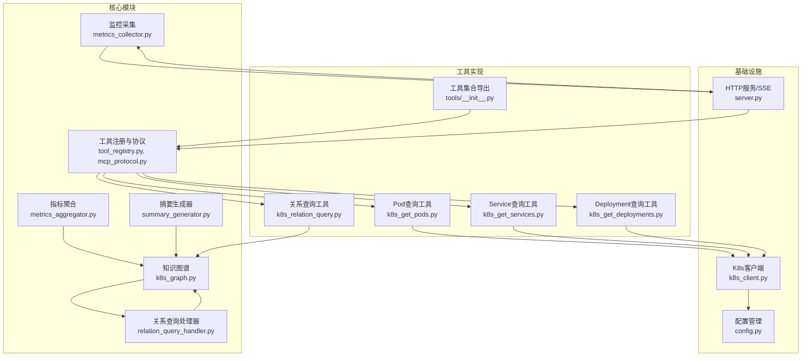
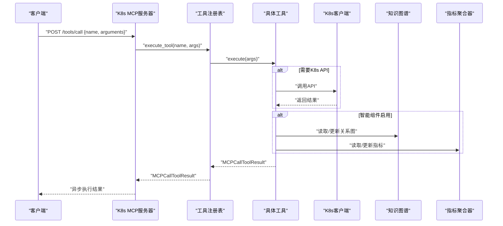
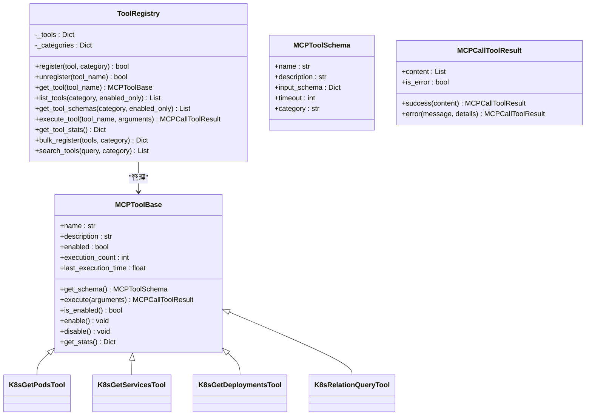
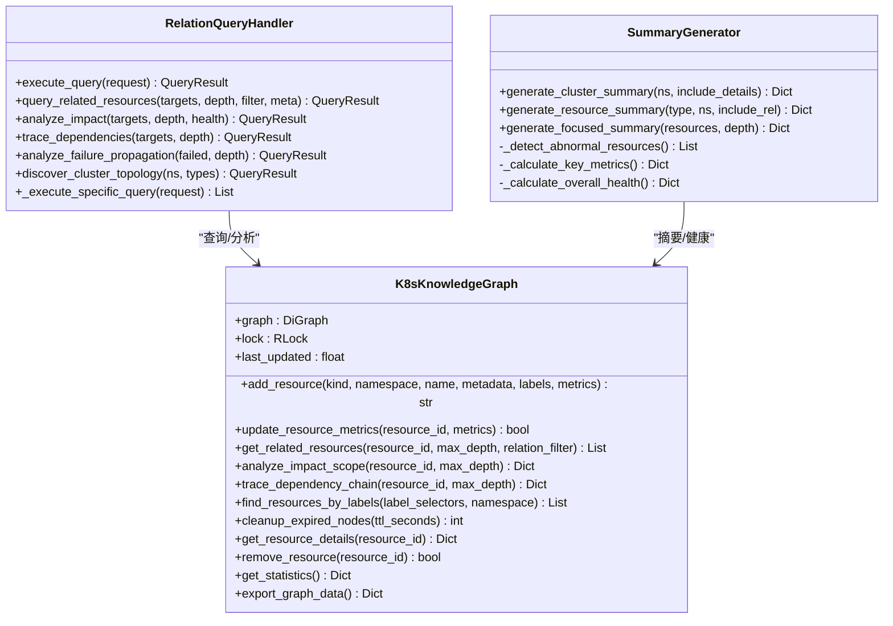
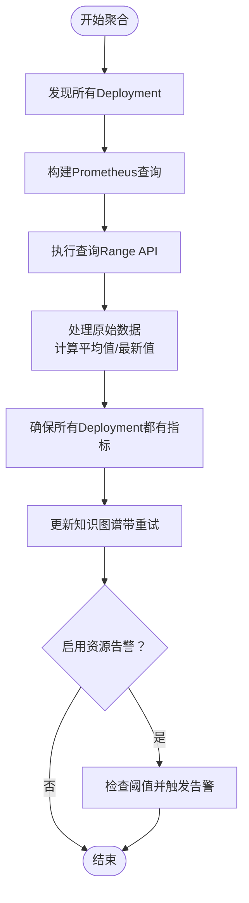
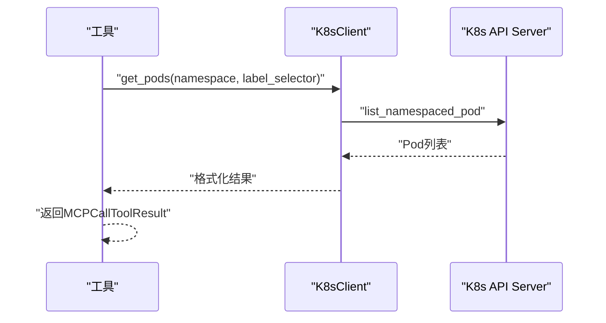
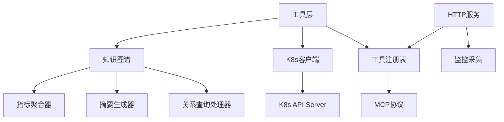

# Kubernetes管理

<cite>
**本文档引用的文件**
- [tool_registry.py](file://backend/src/k8s_mcp/core/tool_registry.py)
- [mcp_protocol.py](file://backend/src/k8s_mcp/core/mcp_protocol.py)
- [k8s_graph.py](file://backend/src/k8s_mcp/core/k8s_graph.py)
- [metrics_aggregator.py](file://backend/src/k8s_mcp/core/metrics_aggregator.py)
- [metrics_collector.py](file://backend/src/k8s_mcp/core/metrics_collector.py)
- [relation_query_handler.py](file://backend/src/k8s_mcp/core/relation_query_handler.py)
- [summary_generator.py](file://backend/src/k8s_mcp/core/summary_generator.py)
- [k8s_client.py](file://backend/src/k8s_mcp/k8s_client.py)
- [server.py](file://backend/src/k8s_mcp/server.py)
- [config.py](file://backend/src/k8s_mcp/config.py)
- [tools/__init__.py](file://backend/src/k8s_mcp/tools/__init__.py)
- [k8s_get_pods.py](file://backend/src/k8s_mcp/tools/k8s_get_pods.py)
- [k8s_get_services.py](file://backend/src/k8s_mcp/tools/k8s_get_services.py)
- [k8s_get_deployments.py](file://backend/src/k8s_mcp/tools/k8s_get_deployments.py)
- [k8s_relation_query.py](file://backend/src/k8s_mcp/tools/k8s_relation_query.py)
</cite>

## 目录
1. [简介](#简介)
2. [项目结构](#项目结构)
3. [核心组件](#核心组件)
4. [架构总览](#架构总览)
5. [详细组件分析](#详细组件分析)
6. [依赖关系分析](#依赖关系分析)
7. [性能考虑](#性能考虑)
8. [故障排除指南](#故障排除指南)
9. [结论](#结论)
10. [附录](#附录)

## 简介
本项目为Kubernetes管理功能的进程内工具集，围绕MCP（Model Context Protocol）协议构建，提供对K8s核心资源（Pod、Service、Deployment、ConfigMap、Secret等）的查询与管理能力。系统采用模块化设计，包含工具注册与调度、MCP协议适配、K8s客户端、知识图谱关系查询、指标聚合与监控、以及与后端的集成与扩展机制。

## 项目结构
项目采用按功能域划分的目录结构，核心模块包括：
- core：协议、工具注册、知识图谱、指标聚合、监控中间件等
- tools：各类K8s工具实现
- k8s_client：与K8s API Server交互的客户端封装
- server：基于FastAPI的HTTP服务与SSE事件流
- config：统一配置管理

**图表来源**
- [tool_registry.py:75-401](file://backend/src/k8s_mcp/core/tool_registry.py#L75-L401)
- [mcp_protocol.py:42-348](file://backend/src/k8s_mcp/core/mcp_protocol.py#L42-L348)
- [k8s_graph.py:32-663](file://backend/src/k8s_mcp/core/k8s_graph.py#L32-L663)
- [metrics_aggregator.py:42-653](file://backend/src/k8s_mcp/core/metrics_aggregator.py#L42-L653)
- [metrics_collector.py:88-446](file://backend/src/k8s_mcp/core/metrics_collector.py#L88-L446)
- [relation_query_handler.py:71-1099](file://backend/src/k8s_mcp/core/relation_query_handler.py#L71-L1099)
- [summary_generator.py:22-1060](file://backend/src/k8s_mcp/core/summary_generator.py#L22-L1060)
- [k8s_client.py:28-1686](file://backend/src/k8s_mcp/k8s_client.py#L28-L1686)
- [server.py:50-1001](file://backend/src/k8s_mcp/server.py#L50-L1001)
- [config.py:17-369](file://backend/src/k8s_mcp/config.py#L17-L369)
- [tools/__init__.py:1-141](file://backend/src/k8s_mcp/tools/__init__.py#L1-L141)

**章节来源**
- [server.py:50-1001](file://backend/src/k8s_mcp/server.py#L50-L1001)
- [tools/__init__.py:1-141](file://backend/src/k8s_mcp/tools/__init__.py#L1-L141)
- [config.py:17-369](file://backend/src/k8s_mcp/config.py#L17-L369)

## 核心组件
- 工具注册与协议适配：提供MCP工具基类、注册表、Schema校验、参数验证与执行流程。
- 知识图谱：基于NetworkX构建K8s资源关系图，支持节点与关系的增删改查、深度遍历、影响分析与依赖追踪。
- 指标聚合：定时从Prometheus抓取资源使用率，计算14天平均值并写入知识图谱。
- 监控采集：系统指标、API调用统计、工具调用统计、智能组件指标的采集与导出。
- 关系查询处理器：支持关联资源查询、影响分析、依赖追踪、故障传播分析、拓扑发现等高级查询。
- 摘要生成器：对集群数据进行智能摘要、异常检测、关键指标提取与上下文优化。
- K8s客户端：封装kubernetes-client，提供Pod、Service、Deployment等资源的查询与管理。
- HTTP服务与SSE：提供REST API与SSE事件流，支持工具列表、调用、健康检查、监控指标查询等。

**章节来源**
- [tool_registry.py:15-401](file://backend/src/k8s_mcp/core/tool_registry.py#L15-L401)
- [mcp_protocol.py:42-348](file://backend/src/k8s_mcp/core/mcp_protocol.py#L42-L348)
- [k8s_graph.py:32-663](file://backend/src/k8s_mcp/core/k8s_graph.py#L32-L663)
- [metrics_aggregator.py:42-653](file://backend/src/k8s_mcp/core/metrics_aggregator.py#L42-L653)
- [metrics_collector.py:88-446](file://backend/src/k8s_mcp/core/metrics_collector.py#L88-L446)
- [relation_query_handler.py:71-1099](file://backend/src/k8s_mcp/core/relation_query_handler.py#L71-L1099)
- [summary_generator.py:22-1060](file://backend/src/k8s_mcp/core/summary_generator.py#L22-L1060)
- [k8s_client.py:28-1686](file://backend/src/k8s_mcp/k8s_client.py#L28-L1686)
- [server.py:50-1001](file://backend/src/k8s_mcp/server.py#L50-L1001)

## 架构总览
系统采用“协议适配 + 工具注册 + 智能组件 + K8s客户端”的分层架构。MCP协议作为统一入口，工具注册表负责工具生命周期管理，智能组件（知识图谱、关系查询、摘要生成、指标聚合）提供高级分析能力，K8s客户端负责与API Server交互，HTTP服务提供REST与SSE接口。

**图表来源**
- [server.py:617-724](file://backend/src/k8s_mcp/server.py#L617-L724)
- [tool_registry.py:235-268](file://backend/src/k8s_mcp/core/tool_registry.py#L235-L268)
- [k8s_client.py:122-236](file://backend/src/k8s_mcp/k8s_client.py#L122-L236)
- [k8s_graph.py:65-116](file://backend/src/k8s_mcp/core/k8s_graph.py#L65-L116)
- [metrics_aggregator.py:508-584](file://backend/src/k8s_mcp/core/metrics_aggregator.py#L508-L584)

## 详细组件分析

### 工具注册与协议适配
- 工具基类MCPToolBase提供统一的Schema定义与执行接口，支持启用/禁用、统计信息与执行计时。
- 工具注册表ToolRegistry支持单个/批量注册、分类管理、搜索、启用/禁用、执行与统计。
- MCP协议适配mcp_protocol.py提供请求/响应模型、错误码、工具Schema、参数校验与结果格式化。

**图表来源**
- [tool_registry.py:15-401](file://backend/src/k8s_mcp/core/tool_registry.py#L15-L401)
- [mcp_protocol.py:42-147](file://backend/src/k8s_mcp/core/mcp_protocol.py#L42-L147)
- [k8s_get_pods.py:16-169](file://backend/src/k8s_mcp/tools/k8s_get_pods.py#L16-L169)
- [k8s_get_services.py:12-63](file://backend/src/k8s_mcp/tools/k8s_get_services.py#L12-L63)
- [k8s_get_deployments.py:9-56](file://backend/src/k8s_mcp/tools/k8s_get_deployments.py#L9-L56)
- [k8s_relation_query.py:27-540](file://backend/src/k8s_mcp/tools/k8s_relation_query.py#L27-L540)

**章节来源**
- [tool_registry.py:75-401](file://backend/src/k8s_mcp/core/tool_registry.py#L75-L401)
- [mcp_protocol.py:42-147](file://backend/src/k8s_mcp/core/mcp_protocol.py#L42-L147)

### 知识图谱与关系查询
- K8sKnowledgeGraph使用有向图存储资源节点与关系，支持线程安全的并发操作、内存管理与TTL清理。
- RelationQueryHandler提供多种查询类型：关联资源、影响分析、依赖追踪、故障传播、拓扑发现、异常关联分析。
- SummaryGenerator负责异常检测、关键指标计算、摘要压缩与上下文优化。

**图表来源**
- [k8s_graph.py:32-663](file://backend/src/k8s_mcp/core/k8s_graph.py#L32-L663)
- [relation_query_handler.py:71-1099](file://backend/src/k8s_mcp/core/relation_query_handler.py#L71-L1099)
- [summary_generator.py:22-1060](file://backend/src/k8s_mcp/core/summary_generator.py#L22-L1060)

**章节来源**
- [k8s_graph.py:32-663](file://backend/src/k8s_mcp/core/k8s_graph.py#L32-L663)
- [relation_query_handler.py:71-1099](file://backend/src/k8s_mcp/core/relation_query_handler.py#L71-L1099)
- [summary_generator.py:22-1060](file://backend/src/k8s_mcp/core/summary_generator.py#L22-L1060)

### 指标聚合与监控
- K8sMetricsAggregator定时从Prometheus抓取CPU/内存使用率，计算14天平均值并更新知识图谱，同时支持资源告警与重试机制。
- MetricsCollector负责系统指标、API调用统计、工具调用统计、智能组件指标的采集与导出，支持Prometheus格式输出。

**图表来源**
- [metrics_aggregator.py:167-211](file://backend/src/k8s_mcp/core/metrics_aggregator.py#L167-L211)
- [metrics_aggregator.py:261-302](file://backend/src/k8s_mcp/core/metrics_aggregator.py#L261-L302)
- [metrics_aggregator.py:304-384](file://backend/src/k8s_mcp/core/metrics_aggregator.py#L304-L384)
- [metrics_aggregator.py:508-584](file://backend/src/k8s_mcp/core/metrics_aggregator.py#L508-L584)

**章节来源**
- [metrics_aggregator.py:42-653](file://backend/src/k8s_mcp/core/metrics_aggregator.py#L42-L653)
- [metrics_collector.py:88-446](file://backend/src/k8s_mcp/core/metrics_collector.py#L88-L446)

### K8s客户端与资源管理
- K8sClient封装kubernetes-client，提供Pod、Service、Deployment、Node等资源的查询与管理，支持连接测试、错误处理与安全属性访问。
- 工具层通过K8sClient实现具体资源的查询与展示，如Pod列表、Service详情、Deployment历史等。

**图表来源**
- [k8s_client.py:122-236](file://backend/src/k8s_mcp/k8s_client.py#L122-L236)
- [k8s_get_pods.py:53-113](file://backend/src/k8s_mcp/tools/k8s_get_pods.py#L53-L113)

**章节来源**
- [k8s_client.py:28-1686](file://backend/src/k8s_mcp/k8s_client.py#L28-L1686)
- [k8s_get_pods.py:16-169](file://backend/src/k8s_mcp/tools/k8s_get_pods.py#L16-L169)
- [k8s_get_services.py:12-63](file://backend/src/k8s_mcp/tools/k8s_get_services.py#L12-L63)
- [k8s_get_deployments.py:9-56](file://backend/src/k8s_mcp/tools/k8s_get_deployments.py#L9-L56)

### HTTP服务与SSE事件流
- K8sMCPServer基于FastAPI提供REST API与SSE事件流，支持工具列表、调用、健康检查、监控指标查询、智能状态查询等。
- 支持异步工具执行与事件广播，便于前端实时展示工具执行状态与结果。

**章节来源**
- [server.py:50-1001](file://backend/src/k8s_mcp/server.py#L50-L1001)

## 依赖关系分析
- 工具层依赖工具注册表与MCP协议，通过装饰器与注册函数集中管理工具。
- 智能组件（知识图谱、关系查询、摘要生成、指标聚合）相互协作，共同提供高级分析能力。
- K8s客户端为工具层提供底层API访问能力。
- HTTP服务作为统一入口，协调工具执行与监控采集。

**图表来源**
- [tools/__init__.py:89-141](file://backend/src/k8s_mcp/tools/__init__.py#L89-L141)
- [tool_registry.py:344-401](file://backend/src/k8s_mcp/core/tool_registry.py#L344-L401)
- [k8s_client.py:28-1686](file://backend/src/k8s_mcp/k8s_client.py#L28-L1686)
- [k8s_graph.py:32-663](file://backend/src/k8s_mcp/core/k8s_graph.py#L32-L663)
- [relation_query_handler.py:71-1099](file://backend/src/k8s_mcp/core/relation_query_handler.py#L71-L1099)
- [summary_generator.py:22-1060](file://backend/src/k8s_mcp/core/summary_generator.py#L22-L1060)
- [metrics_aggregator.py:42-653](file://backend/src/k8s_mcp/core/metrics_aggregator.py#L42-L653)
- [server.py:50-1001](file://backend/src/k8s_mcp/server.py#L50-L1001)
- [metrics_collector.py:88-446](file://backend/src/k8s_mcp/core/metrics_collector.py#L88-L446)

**章节来源**
- [tools/__init__.py:1-141](file://backend/src/k8s_mcp/tools/__init__.py#L1-L141)
- [server.py:50-1001](file://backend/src/k8s_mcp/server.py#L50-L1001)

## 性能考虑
- 知识图谱的内存管理与TTL：通过节点时间戳与内存估算实现自动清理，避免无限增长。
- 指标聚合的重试与冷却：聚合失败自动重试，告警冷却避免频繁触发。
- 查询深度与结果限制：关系查询处理器提供最大深度与结果数量限制，防止大规模遍历导致性能问题。
- 监控采样与导出：监控采集器支持滑动窗口与历史长度控制，Prometheus导出格式便于外部监控系统消费。
- 工具执行异步化：HTTP服务异步执行工具，避免阻塞请求处理。

[本节为通用指导，无需特定文件分析]

## 故障排除指南
- 连接K8s失败：检查kubeconfig路径与命名空间配置，确认API Server可达与认证信息正确。
- 工具执行错误：查看工具返回的错误内容，定位参数校验、权限或资源不存在等问题。
- 智能功能不可用：确认ENABLE_KNOWLEDGE_GRAPH已启用，Prometheus URL配置正确，集群同步引擎与指标聚合器已启动。
- 监控指标缺失：检查监控功能开关、采集间隔与历史长度配置，确认Prometheus可达与查询正常。
- SSE事件流异常：检查客户端连接状态与事件队列，确认服务器端未出现序列化错误。

**章节来源**
- [k8s_client.py:50-106](file://backend/src/k8s_mcp/k8s_client.py#L50-L106)
- [server.py:617-724](file://backend/src/k8s_mcp/server.py#L617-L724)
- [config.py:168-267](file://backend/src/k8s_mcp/config.py#L168-L267)

## 结论
本项目通过MCP协议与工具注册体系，实现了对Kubernetes核心资源的统一查询与管理，并通过知识图谱、关系查询、指标聚合与监控采集等智能组件，提供了强大的关联分析与运维辅助能力。系统具备良好的扩展性与稳定性，适合在生产环境中进行持续演进与优化。

[本节为总结性内容，无需特定文件分析]

## 附录

### 常用操作示例
- 获取Pod列表：调用工具“k8s-get-pods”，支持namespace与label_selector过滤。
- 获取Service列表：调用工具“k8s-get-services”，支持namespace、label_selector与name查询。
- 获取Deployment列表：调用工具“k8s-get-deployments”，支持namespace、label_selector与name查询。
- 关联查询：调用工具“k8s-relation-query”，支持关联资源、影响分析、依赖追踪、故障传播分析与拓扑发现。

**章节来源**
- [k8s_get_pods.py:30-113](file://backend/src/k8s_mcp/tools/k8s_get_pods.py#L30-L113)
- [k8s_get_services.py:21-63](file://backend/src/k8s_mcp/tools/k8s_get_services.py#L21-L63)
- [k8s_get_deployments.py:15-56](file://backend/src/k8s_mcp/tools/k8s_get_deployments.py#L15-L56)
- [k8s_relation_query.py:74-215](file://backend/src/k8s_mcp/tools/k8s_relation_query.py#L74-L215)

### 与MCP协议的集成方式
- 协议适配：遵循MCP标准的消息格式与方法枚举，提供initialize、tools/list、tools/call、ping等方法。
- 工具Schema：每个工具定义清晰的输入参数Schema，便于客户端与LLM理解与调用。
- 结果格式：统一使用MCPCallToolResult封装结果与错误，支持文本与结构化内容。

**章节来源**
- [mcp_protocol.py:33-147](file://backend/src/k8s_mcp/core/mcp_protocol.py#L33-L147)
- [tool_registry.py:348-401](file://backend/src/k8s_mcp/core/tool_registry.py#L348-L401)

### 扩展机制
- 工具扩展：通过继承MCPToolBase并使用@register_tool装饰器注册新工具，自动纳入工具列表。
- 智能组件扩展：新增关系查询类型或摘要生成规则，只需扩展对应处理器或生成器。
- 配置扩展：通过环境变量或配置类扩展功能开关、阈值与行为参数。

**章节来源**
- [tool_registry.py:348-401](file://backend/src/k8s_mcp/core/tool_registry.py#L348-L401)
- [relation_query_handler.py:24-1099](file://backend/src/k8s_mcp/core/relation_query_handler.py#L24-L1099)
- [summary_generator.py:22-1060](file://backend/src/k8s_mcp/core/summary_generator.py#L22-L1060)
- [config.py:65-166](file://backend/src/k8s_mcp/config.py#L65-L166)