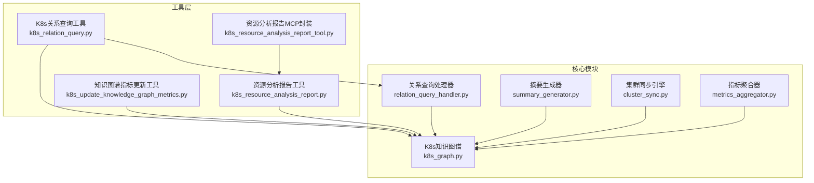
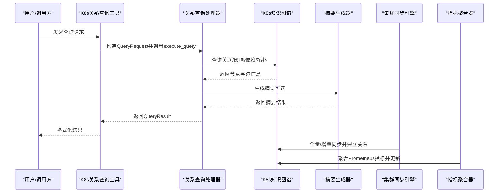
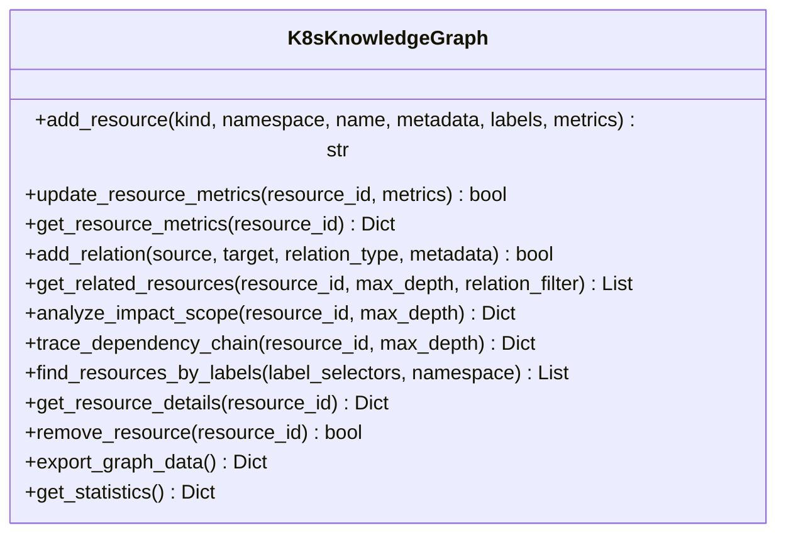
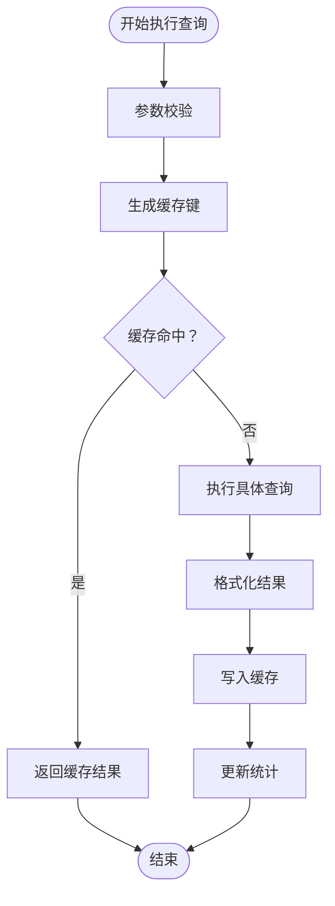
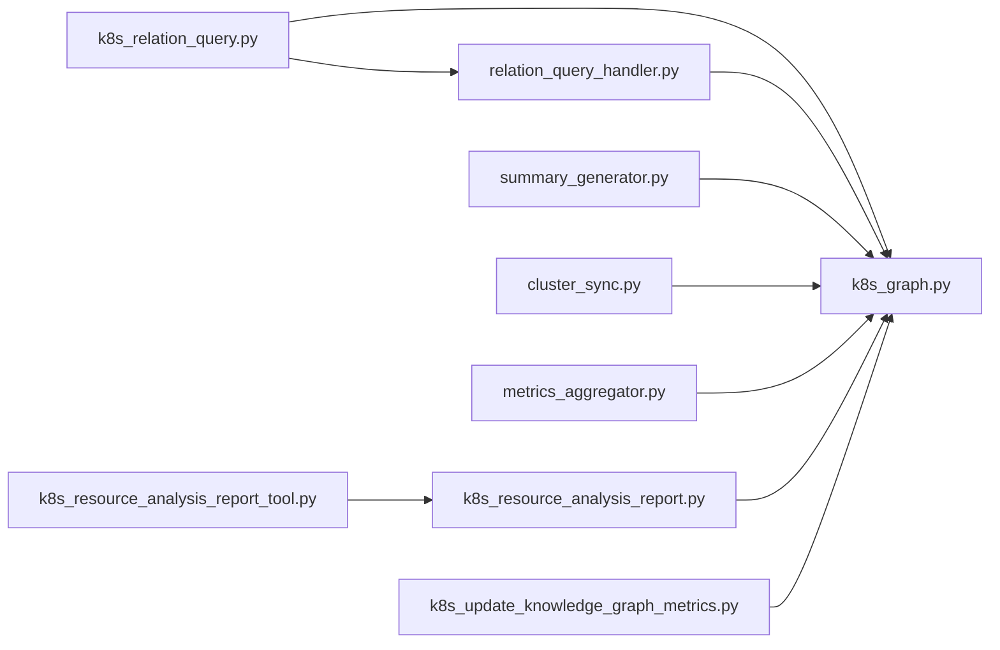

# 关系分析工具

<cite>
**本文档引用的文件**
- [k8s_graph.py](file://backend/src/k8s_mcp/core/k8s_graph.py)
- [relation_query_handler.py](file://backend/src/k8s_mcp/core/relation_query_handler.py)
- [k8s_relation_query.py](file://backend/src/k8s_mcp/tools/k8s_relation_query.py)
- [k8s_resource_analysis_report.py](file://backend/src/k8s_mcp/tools/k8s_resource_analysis_report.py)
- [k8s_resource_analysis_report_tool.py](file://backend/src/k8s_mcp/tools/k8s_resource_analysis_report_tool.py)
- [summary_generator.py](file://backend/src/k8s_mcp/core/summary_generator.py)
- [metrics_aggregator.py](file://backend/src/k8s_mcp/core/metrics_aggregator.py)
- [k8s_update_knowledge_graph_metrics.py](file://backend/src/k8s_mcp/tools/k8s_update_knowledge_graph_metrics.py)
- [cluster_sync.py](file://backend/src/k8s_mcp/core/cluster_sync.py)
</cite>

## 目录
1. [简介](#简介)
2. [项目结构](#项目结构)
3. [核心组件](#核心组件)
4. [架构总览](#架构总览)
5. [详细组件分析](#详细组件分析)
6. [依赖关系分析](#依赖关系分析)
7. [性能考虑](#性能考虑)
8. [故障排查指南](#故障排查指南)
9. [结论](#结论)
10. [附录](#附录)

## 简介
本项目提供一套面向 Kubernetes 的关系分析工具，围绕知识图谱构建资源关系，支持：
- 自动发现与可视化：Pod 依赖关系、Service 暴露关系、Deployment 控制器关系等
- 知识图谱构建：节点与边的定义规则、关系建立与维护
- 关系查询处理器：查询类型、优化策略与结果缓存
- 资源分析报告：健康状态评估、性能瓶颈识别、容量规划建议
- 图算法应用：最短路径、连通性分析、环路检测
- 与图数据库的集成与扩展思路

## 项目结构
后端采用模块化设计，核心围绕知识图谱（K8sKnowledgeGraph）与查询处理器（RelationQueryHandler）展开，配套工具提供对外接口与报告生成。

图表来源
- [k8s_graph.py:32-663](file://backend/src/k8s_mcp/core/k8s_graph.py#L32-L663)
- [relation_query_handler.py:71-125](file://backend/src/k8s_mcp/core/relation_query_handler.py#L71-L125)
- [k8s_relation_query.py:27-73](file://backend/src/k8s_mcp/tools/k8s_relation_query.py#L27-L73)
- [k8s_resource_analysis_report.py:32-627](file://backend/src/k8s_mcp/tools/k8s_resource_analysis_report.py#L32-L627)
- [k8s_resource_analysis_report_tool.py:14-104](file://backend/src/k8s_mcp/tools/k8s_resource_analysis_report_tool.py#L14-L104)
- [summary_generator.py:22-80](file://backend/src/k8s_mcp/core/summary_generator.py#L22-L80)
- [metrics_aggregator.py:42-87](file://backend/src/k8s_mcp/core/metrics_aggregator.py#L42-L87)
- [cluster_sync.py:25-105](file://backend/src/k8s_mcp/core/cluster_sync.py#L25-L105)
- [k8s_update_knowledge_graph_metrics.py:18-71](file://backend/src/k8s_mcp/tools/k8s_update_knowledge_graph_metrics.py#L18-L71)

章节来源
- [k8s_graph.py:1-663](file://backend/src/k8s_mcp/core/k8s_graph.py#L1-L663)
- [relation_query_handler.py:1-1099](file://backend/src/k8s_mcp/core/relation_query_handler.py#L1-L1099)
- [k8s_relation_query.py:1-540](file://backend/src/k8s_mcp/tools/k8s_relation_query.py#L1-L540)
- [k8s_resource_analysis_report.py:1-627](file://backend/src/k8s_mcp/tools/k8s_resource_analysis_report.py#L1-L627)
- [k8s_resource_analysis_report_tool.py:1-104](file://backend/src/k8s_mcp/tools/k8s_resource_analysis_report_tool.py#L1-L104)
- [summary_generator.py:1-1060](file://backend/src/k8s_mcp/core/summary_generator.py#L1-L1060)
- [metrics_aggregator.py:1-653](file://backend/src/k8s_mcp/core/metrics_aggregator.py#L1-L653)
- [cluster_sync.py:1-694](file://backend/src/k8s_mcp/core/cluster_sync.py#L1-L694)
- [k8s_update_knowledge_graph_metrics.py:1-331](file://backend/src/k8s_mcp/tools/k8s_update_knowledge_graph_metrics.py#L1-L331)

## 核心组件
- 知识图谱（K8sKnowledgeGraph）
  - 有向图存储资源节点与关系边，支持线程安全、内存管理与TTL清理
  - 提供节点增删改查、指标更新、标签查询、影响范围与依赖链分析、拓扑统计等能力
- 关系查询处理器（RelationQueryHandler）
  - 统一封装查询类型（关联资源、影响分析、依赖追踪、故障传播、拓扑发现、异常关联）
  - 实现查询缓存、超时控制、结果限制与统计
- 摘要生成器（SummaryGenerator）
  - 生成集群/资源/聚焦摘要，异常检测与优先级排序，关键指标计算
- 集群同步引擎（ClusterSyncEngine）
  - 全量+增量同步，基于K8s Watch API，自动建立关系（所有者、Service-Pod、Node-Pod等）
- 指标聚合器（K8sMetricsAggregator）
  - 定期从Prometheus抓取并聚合14天平均利用率，写回知识图谱，支持告警与冷却
- 工具层
  - K8s关系查询工具：MCP工具封装，Schema定义与结果格式化
  - 资源分析报告工具：异常资源检测、健康评估、优化建议与钉钉通知
  - 知识图谱指标更新工具：批量更新指标，支持并发与报告

章节来源
- [k8s_graph.py:32-663](file://backend/src/k8s_mcp/core/k8s_graph.py#L32-L663)
- [relation_query_handler.py:71-125](file://backend/src/k8s_mcp/core/relation_query_handler.py#L71-L125)
- [summary_generator.py:22-80](file://backend/src/k8s_mcp/core/summary_generator.py#L22-L80)
- [cluster_sync.py:25-105](file://backend/src/k8s_mcp/core/cluster_sync.py#L25-L105)
- [metrics_aggregator.py:42-87](file://backend/src/k8s_mcp/core/metrics_aggregator.py#L42-L87)
- [k8s_relation_query.py:27-73](file://backend/src/k8s_mcp/tools/k8s_relation_query.py#L27-L73)
- [k8s_resource_analysis_report.py:32-62](file://backend/src/k8s_mcp/tools/k8s_resource_analysis_report.py#L32-L62)
- [k8s_update_knowledge_graph_metrics.py:18-71](file://backend/src/k8s_mcp/tools/k8s_update_knowledge_graph_metrics.py#L18-L71)

## 架构总览
关系分析工具以知识图谱为核心，通过同步引擎与指标聚合器持续注入数据，查询处理器提供统一查询入口，工具层对外暴露MCP接口与报告生成能力。

图表来源
- [k8s_relation_query.py:155-214](file://backend/src/k8s_mcp/tools/k8s_relation_query.py#L155-L214)
- [relation_query_handler.py:126-186](file://backend/src/k8s_mcp/core/relation_query_handler.py#L126-L186)
- [k8s_graph.py:194-282](file://backend/src/k8s_mcp/core/k8s_graph.py#L194-L282)
- [summary_generator.py:81-156](file://backend/src/k8s_mcp/core/summary_generator.py#L81-L156)
- [cluster_sync.py:168-224](file://backend/src/k8s_mcp/core/cluster_sync.py#L168-L224)
- [metrics_aggregator.py:167-211](file://backend/src/k8s_mcp/core/metrics_aggregator.py#L167-L211)

## 详细组件分析

### 知识图谱（K8sKnowledgeGraph）
- 节点定义
  - kind：资源类型（pod/deployment/service/node等）
  - namespace：命名空间（集群级资源为None）
  - name：资源名称
  - metadata：资源状态与容器信息等
  - labels：标签
  - metrics：指标数据（CPU/内存利用率、请求量等）
- 边定义
  - ownedBy：所有者关系（Pod -> Deployment/ReplicaSet）
  - hosts：托管关系（Node -> Pod）
  - routes/connects/loadBalances：网络关系（Service -> Pod）
  - dependsOn/uses/consumes：依赖关系（应用 -> 数据库/缓存等）
- 关系查询
  - get_related_resources：广度优先遍历，支持max_depth与relation_filter
  - analyze_impact_scope：下游影响范围分析
  - trace_dependency_chain：上游依赖链追踪
- 统计与清理
  - 内存使用估算与TTL清理
  - 节点/边数量统计、查询次数统计、清理次数统计

图表来源
- [k8s_graph.py:32-663](file://backend/src/k8s_mcp/core/k8s_graph.py#L32-L663)

章节来源
- [k8s_graph.py:32-663](file://backend/src/k8s_mcp/core/k8s_graph.py#L32-L663)

### 关系查询处理器（RelationQueryHandler）
- 查询类型
  - RELATED_RESOURCES：关联资源查询
  - IMPACT_ANALYSIS：影响分析
  - DEPENDENCY_TRACE：依赖追踪
  - FAILURE_PROPAGATION：故障传播分析
  - CLUSTER_TOPOLOGY：集群拓扑发现
  - ANOMALY_CORRELATION：异常关联分析
- 查询流程
  - 参数校验 → 缓存命中 → 执行查询 → 结果格式化 → 缓存写入 → 统计更新
- 优化与缓存
  - 时间窗口缓存（默认5分钟TTL）
  - 结果数量限制（默认100）
  - 超时控制（默认30秒）
- 图算法应用
  - 最短路径：BFS查找两点间最短路径（长度≤max_depth+1）
  - 连通性分析：基于邻接关系的可达性
  - 环路检测：BFS中避免重复访问（visited集合）

图表来源
- [relation_query_handler.py:126-186](file://backend/src/k8s_mcp/core/relation_query_handler.py#L126-L186)
- [relation_query_handler.py:494-516](file://backend/src/k8s_mcp/core/relation_query_handler.py#L494-L516)
- [relation_query_handler.py:656-702](file://backend/src/k8s_mcp/core/relation_query_handler.py#L656-L702)

章节来源
- [relation_query_handler.py:24-125](file://backend/src/k8s_mcp/core/relation_query_handler.py#L24-L125)
- [relation_query_handler.py:296-326](file://backend/src/k8s_mcp/core/relation_query_handler.py#L296-L326)
- [relation_query_handler.py:494-516](file://backend/src/k8s_mcp/core/relation_query_handler.py#L494-L516)
- [relation_query_handler.py:656-702](file://backend/src/k8s_mcp/core/relation_query_handler.py#L656-L702)

### 摘要生成器（SummaryGenerator）
- 能力
  - 集群总体摘要：资源统计、健康状态、关键指标、命名空间分解、异常资源
  - 资源类型摘要：状态分布、异常检测、关键指标、关系（少量时）
  - 聚焦摘要：围绕目标资源的上下文、影响范围、依赖、风险评估
- 异常检测
  - 基于状态与重启次数的异常判定
  - 容器状态细化（waiting/running/terminated）
  - 严重程度评分（1-10）
- 数据压缩
  - 控制摘要大小（默认<10KB），保证LLM上下文友好

章节来源
- [summary_generator.py:81-156](file://backend/src/k8s_mcp/core/summary_generator.py#L81-L156)
- [summary_generator.py:157-216](file://backend/src/k8s_mcp/core/summary_generator.py#L157-L216)
- [summary_generator.py:217-288](file://backend/src/k8s_mcp/core/summary_generator.py#L217-L288)

### 集群同步引擎（ClusterSyncEngine）
- 同步策略
  - 全量同步：定时执行，覆盖核心资源类型（Pod/Service/Deployment/ReplicaSet/Node/Namespace）
  - 增量同步：Watch API监听关键资源，自动重连与410资源版本过期处理
- 关系建立
  - 所有者引用（ownerReferences）建立父子关系
  - Service -> Pod：基于标签选择器与命名约定
  - Node -> Pod：基于node_name
- 统计与健康
  - 全量同步次数、资源同步数、Watch事件数、错误数、关系建立次数
  - 健康状态：运行中/停滞/降级/停止

章节来源
- [cluster_sync.py:168-224](file://backend/src/k8s_mcp/core/cluster_sync.py#L168-L224)
- [cluster_sync.py:409-428](file://backend/src/k8s_mcp/core/cluster_sync.py#L409-L428)
- [cluster_sync.py:502-588](file://backend/src/k8s_mcp/core/cluster_sync.py#L502-L588)
- [cluster_sync.py:626-644](file://backend/src/k8s_mcp/core/cluster_sync.py#L626-L644)

### 指标聚合器（K8sMetricsAggregator）
- 功能
  - Prometheus查询：CPU/内存利用率、请求量
  - 聚合：14天平均值，按namespace/app维度
  - 写回：更新知识图谱节点metrics字段
  - 告警：阈值触发与冷却（默认5分钟）
- 配置
  - 聚合间隔、分析天数、阈值、冷却时间、认证方式
- 统计
  - 聚合次数、处理时延、部署发现/更新/失败数、失败列表

章节来源
- [metrics_aggregator.py:167-211](file://backend/src/k8s_mcp/core/metrics_aggregator.py#L167-L211)
- [metrics_aggregator.py:387-453](file://backend/src/k8s_mcp/core/metrics_aggregator.py#L387-L453)
- [metrics_aggregator.py:585-596](file://backend/src/k8s_mcp/core/metrics_aggregator.py#L585-L596)

### 工具层
- K8s关系查询工具（MCP）
  - Schema定义：查询类型、目标资源、深度、过滤器、结果限制等
  - 执行流程：参数校验 → 智能模式/基础模式 → 执行查询 → 结果格式化
- 资源分析报告工具
  - 异常检测：CPU/内存利用率阈值、极端值检测、配置问题检测、数据质量检测
  - 健康评估：正常/异常资源统计、平均利用率、严重程度分级
  - 优化建议：CPU/内存优化、低利用率缩容、批量处理建议、预防措施
  - 钉钉通知：可选发送异常资源与建议
- 知识图谱指标更新工具
  - 批量更新：并发控制、命名空间/应用过滤、14天/1天模式
  - 报告：成功率、失败列表、更新时间

章节来源
- [k8s_relation_query.py:74-153](file://backend/src/k8s_mcp/tools/k8s_relation_query.py#L74-L153)
- [k8s_relation_query.py:155-214](file://backend/src/k8s_mcp/tools/k8s_relation_query.py#L155-L214)
- [k8s_resource_analysis_report.py:62-123](file://backend/src/k8s_mcp/tools/k8s_resource_analysis_report.py#L62-L123)
- [k8s_resource_analysis_report.py:162-371](file://backend/src/k8s_mcp/tools/k8s_resource_analysis_report.py#L162-L371)
- [k8s_resource_analysis_report.py:508-547](file://backend/src/k8s_mcp/tools/k8s_resource_analysis_report.py#L508-L547)
- [k8s_update_knowledge_graph_metrics.py:80-124](file://backend/src/k8s_mcp/tools/k8s_update_knowledge_graph_metrics.py#L80-L124)
- [k8s_update_knowledge_graph_metrics.py:165-191](file://backend/src/k8s_mcp/tools/k8s_update_knowledge_graph_metrics.py#L165-L191)
- [k8s_update_knowledge_graph_metrics.py:294-331](file://backend/src/k8s_mcp/tools/k8s_update_knowledge_graph_metrics.py#L294-L331)

## 依赖关系分析

图表来源
- [k8s_relation_query.py:18-25](file://backend/src/k8s_mcp/tools/k8s_relation_query.py#L18-L25)
- [relation_query_handler.py:20-21](file://backend/src/k8s_mcp/core/relation_query_handler.py#L20-L21)
- [summary_generator.py](file://backend/src/k8s_mcp/core/summary_generator.py#L19)
- [cluster_sync.py](file://backend/src/k8s_mcp/core/cluster_sync.py#L21)
- [metrics_aggregator.py](file://backend/src/k8s_mcp/core/metrics_aggregator.py#L18)
- [k8s_resource_analysis_report.py:14-17](file://backend/src/k8s_mcp/tools/k8s_resource_analysis_report.py#L14-L17)
- [k8s_resource_analysis_report_tool.py:10-12](file://backend/src/k8s_mcp/tools/k8s_resource_analysis_report_tool.py#L10-L12)
- [k8s_update_knowledge_graph_metrics.py:14-15](file://backend/src/k8s_mcp/tools/k8s_update_knowledge_graph_metrics.py#L14-L15)

章节来源
- [k8s_relation_query.py:18-25](file://backend/src/k8s_mcp/tools/k8s_relation_query.py#L18-L25)
- [relation_query_handler.py:20-21](file://backend/src/k8s_mcp/core/relation_query_handler.py#L20-L21)
- [summary_generator.py](file://backend/src/k8s_mcp/core/summary_generator.py#L19)
- [cluster_sync.py](file://backend/src/k8s_mcp/core/cluster_sync.py#L21)
- [metrics_aggregator.py](file://backend/src/k8s_mcp/core/metrics_aggregator.py#L18)
- [k8s_resource_analysis_report.py:14-17](file://backend/src/k8s_mcp/tools/k8s_resource_analysis_report.py#L14-L17)
- [k8s_resource_analysis_report_tool.py:10-12](file://backend/src/k8s_mcp/tools/k8s_resource_analysis_report_tool.py#L10-L12)
- [k8s_update_knowledge_graph_metrics.py:14-15](file://backend/src/k8s_mcp/tools/k8s_update_knowledge_graph_metrics.py#L14-L15)

## 性能考虑
- 知识图谱
  - 内存估算与TTL清理，避免无限增长
  - 广度优先遍历的max_depth限制，防止深度爆炸
- 查询优化
  - 查询缓存（时间窗口），降低重复查询开销
  - 结果数量限制与超时控制，保障响应时间
- 同步与聚合
  - 全量同步间隔可配置，Watch监听减少实时压力
  - 指标聚合异步执行，支持冷却与重试
- 并发控制
  - 指标批量更新使用信号量控制并发度

[本节为通用指导，无需列出章节来源]

## 故障排查指南
- 知识图谱相关
  - 节点不存在：检查资源ID格式与命名空间
  - 内存不足：调整TTL与内存限制配置，触发清理
- 查询处理器
  - 缓存未命中：检查缓存键生成与TTL设置
  - 超时：增大timeout或缩小max_depth
- 同步引擎
  - Watch 410错误：自动重连，必要时重启监听线程
  - 同步停滞：检查last_full_sync与watch线程状态
- 指标聚合
  - Prometheus连接失败：检查URL、认证与网络
  - 告警频繁触发：调整阈值或冷却时间
- 报告工具
  - 异常资源为空：确认指标是否已更新至知识图谱
  - 钉钉通知失败：检查后端通知接口可用性

章节来源
- [k8s_graph.py:425-461](file://backend/src/k8s_mcp/core/k8s_graph.py#L425-L461)
- [relation_query_handler.py:175-186](file://backend/src/k8s_mcp/core/relation_query_handler.py#L175-L186)
- [cluster_sync.py:572-588](file://backend/src/k8s_mcp/core/cluster_sync.py#L572-L588)
- [metrics_aggregator.py:160-166](file://backend/src/k8s_mcp/core/metrics_aggregator.py#L160-L166)
- [k8s_resource_analysis_report.py:508-547](file://backend/src/k8s_mcp/tools/k8s_resource_analysis_report.py#L508-L547)

## 结论
本关系分析工具以知识图谱为核心，结合同步与指标聚合，提供从资源关系发现到健康评估与优化建议的完整能力。通过查询处理器的统一入口与工具层的MCP封装，满足运维与平台团队对Kubernetes资源关系的可视化与智能化分析需求。配合图算法与摘要生成，能够快速定位问题、评估影响并制定容量规划与优化策略。

[本节为总结，无需列出章节来源]

## 附录
- 关系类型与边的定义
  - ownedBy：所有者关系（Pod/RS -> Deployment/RS）
  - hosts：托管关系（Node -> Pod）
  - routes/connects/loadBalances：网络关系（Service -> Pod）
  - dependsOn/uses/consumes：依赖关系（应用 -> 数据库/缓存等）
- 查询类型与典型场景
  - 关联资源：快速定位与某Pod/Service相关的控制器与工作负载
  - 影响分析：变更Deployment/ConfigMap等对下游Pod的影响范围
  - 依赖追踪：向上追溯到父级控制器与命名空间
  - 故障传播：评估故障从上游组件向下游扩散的概率与时效
  - 集群拓扑：按Node/命名空间视角查看资源分布与健康度
  - 异常关联：结合摘要生成器识别异常资源并分析关联性
- 与图数据库的集成与扩展
  - 可将知识图谱导出为标准格式（节点/边），导入图数据库进行复杂分析
  - 扩展自定义关系类型与权重，支持更精细的路径与中心性分析
  - 通过插件化工具接入更多外部系统（如告警平台、CMDB）

[本节为概念性内容，无需列出章节来源]