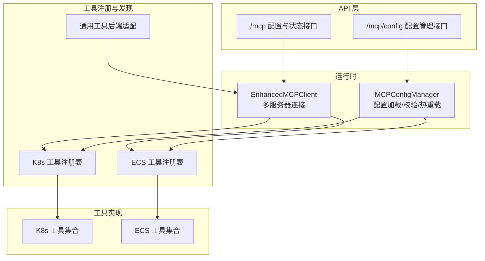
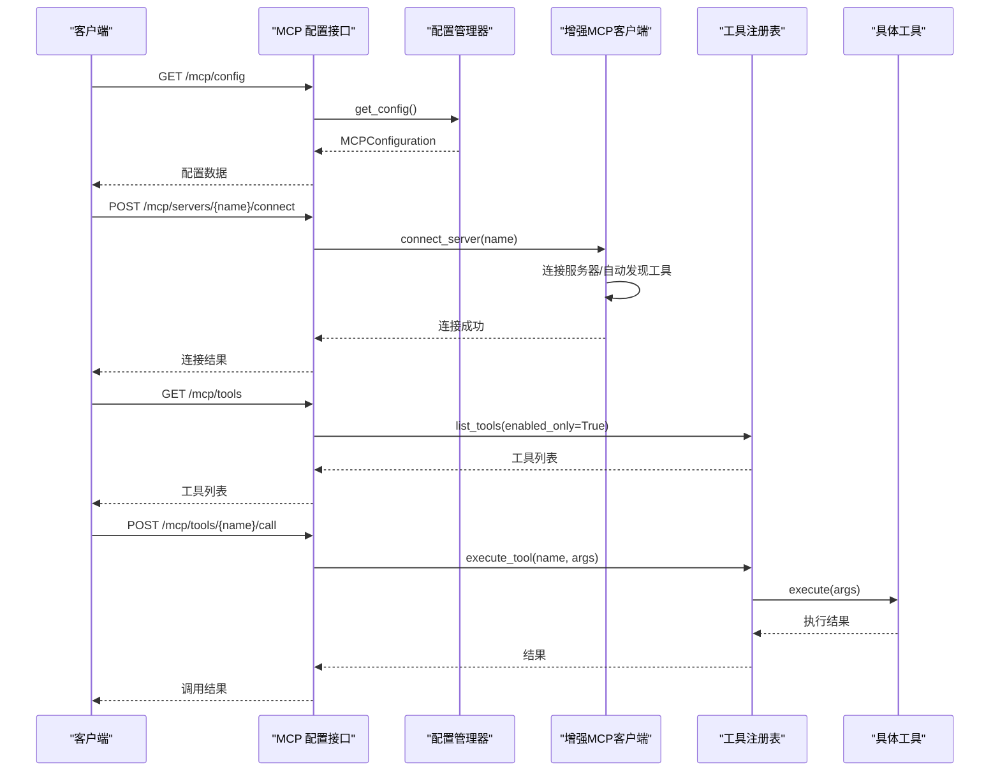
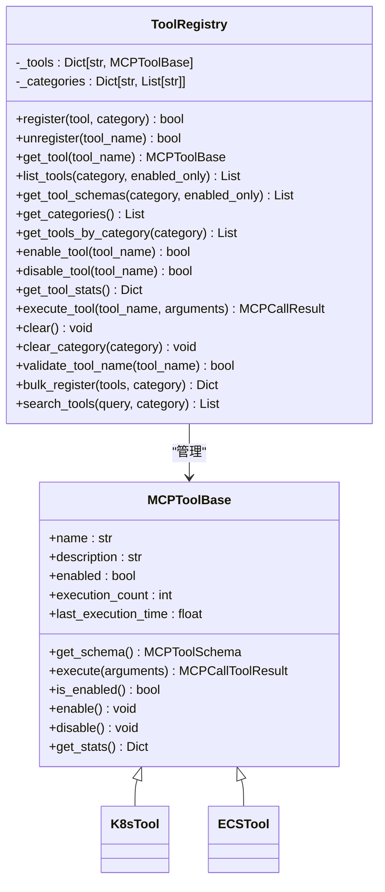
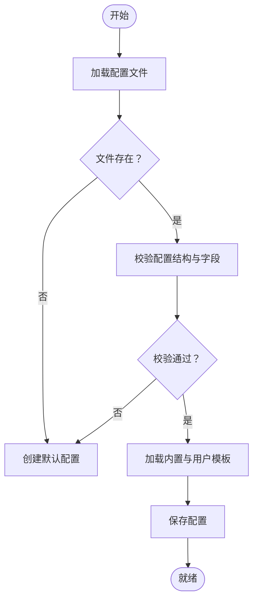
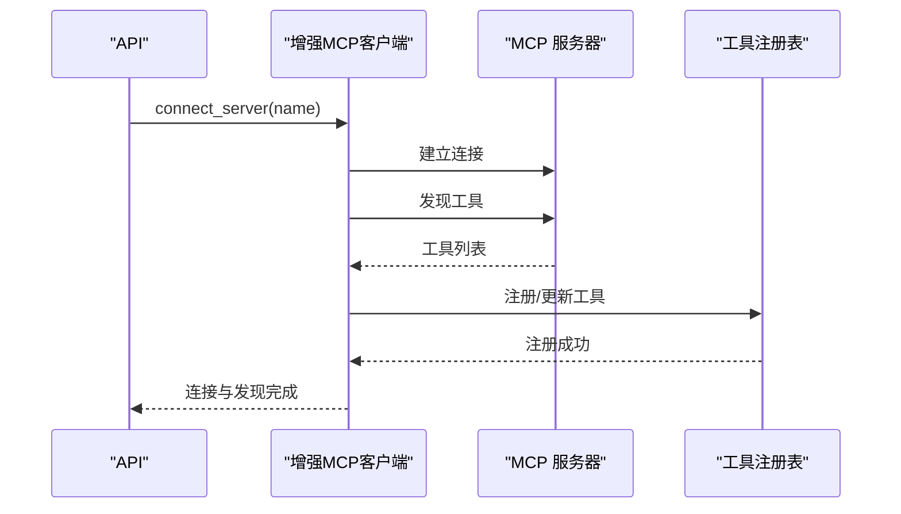
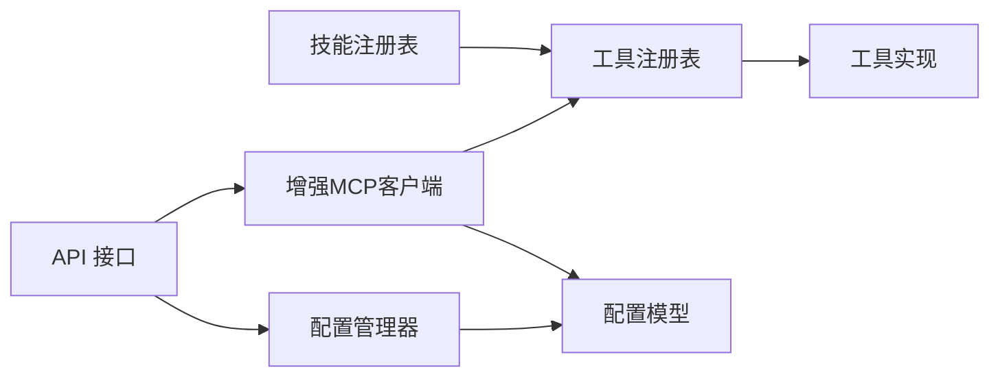

# 工具注册与管理

<cite>
**本文档引用的文件**
- [backend/src/k8s_mcp/core/tool_registry.py](file://backend/src/k8s_mcp/core/tool_registry.py)
- [backend/src/ecs_mcp/core/tool_registry.py](file://backend/src/ecs_mcp/core/tool_registry.py)
- [backend/src/tools/registry.py](file://backend/src/tools/registry.py)
- [backend/src/skills/registry.py](file://backend/src/skills/registry.py)
- [backend/src/mcp/config_manager.py](file://backend/src/mcp/config_manager.py)
- [backend/src/mcp/config.py](file://backend/src/mcp/config.py)
- [backend/src/mcp/types.py](file://backend/src/mcp/types.py)
- [backend/src/mcp/enhanced_client.py](file://backend/src/mcp/enhanced_client.py)
- [backend/src/k8s_mcp/tools/__init__.py](file://backend/src/k8s_mcp/tools/__init__.py)
- [backend/src/ecs_mcp/tools/__init__.py](file://backend/src/ecs_mcp/tools/__init__.py)
- [backend/src/k8s_mcp/tools/k8s_get_pods.py](file://backend/src/k8s_mcp/tools/k8s_get_pods.py)
- [backend/src/ecs_mcp/tools/ecs_list_instances.py](file://backend/src/ecs_mcp/tools/ecs_list_instances.py)
- [backend/src/api/v2/endpoints/mcp.py](file://backend/src/api/v2/endpoints/mcp.py)
- [backend/src/api/v2/endpoints/mcp_config.py](file://backend/src/api/v2/endpoints/mcp_config.py)
- [config/mcp_config.example.json](file://config/mcp_config.example.json)
- [config/skills.example.json](file://config/skills.example.json)
</cite>

## 目录
1. [简介](#简介)
2. [项目结构](#项目结构)
3. [核心组件](#核心组件)
4. [架构总览](#架构总览)
5. [详细组件分析](#详细组件分析)
6. [依赖关系分析](#依赖关系分析)
7. [性能考量](#性能考量)
8. [故障排查指南](#故障排查指南)
9. [结论](#结论)
10. [附录](#附录)

## 简介
本项目为 Kubernetes 与 ECS 工具注册与管理系统，围绕 MCP（Model Context Protocol）构建，提供工具注册中心、配置管理、工具发现与调用、权限与技能控制、以及热重载与验证能力。系统支持本地内置工具与远端 MCP 服务器两种运行模式，具备统一的工具后端抽象、可插拔的工具注册表、灵活的配置模板与校验、以及基于技能的访问控制。

## 项目结构
系统采用“按域分层+按功能聚合”的混合组织方式：
- 后端核心
  - 工具注册与生命周期管理：K8s/ECS 工具注册表、通用工具后端适配
  - 配置管理：MCP 配置模型、配置管理器、模板与热重载
  - 运行时客户端：增强的 MCP 客户端，支持多服务器连接与工具路由
  - 技能与权限：基于配置的工具访问控制
- API 层：提供 MCP 配置与状态查询、工具列表与分类、服务器连接与切换等接口
- 工具实现：K8s 与 ECS 的具体工具，遵循统一的工具基类与 Schema 规范

图表来源
- [backend/src/api/v2/endpoints/mcp.py:1-628](file://backend/src/api/v2/endpoints/mcp.py#L1-L628)
- [backend/src/api/v2/endpoints/mcp_config.py:1-563](file://backend/src/api/v2/endpoints/mcp_config.py#L1-L563)
- [backend/src/mcp/enhanced_client.py:1-200](file://backend/src/mcp/enhanced_client.py#L1-L200)
- [backend/src/mcp/config_manager.py:1-948](file://backend/src/mcp/config_manager.py#L1-L948)
- [backend/src/k8s_mcp/core/tool_registry.py:1-401](file://backend/src/k8s_mcp/core/tool_registry.py#L1-L401)
- [backend/src/ecs_mcp/core/tool_registry.py:1-140](file://backend/src/ecs_mcp/core/tool_registry.py#L1-L140)

章节来源
- [backend/src/k8s_mcp/core/tool_registry.py:1-401](file://backend/src/k8s_mcp/core/tool_registry.py#L1-L401)
- [backend/src/ecs_mcp/core/tool_registry.py:1-140](file://backend/src/ecs_mcp/core/tool_registry.py#L1-L140)
- [backend/src/mcp/config_manager.py:1-948](file://backend/src/mcp/config_manager.py#L1-L948)
- [backend/src/mcp/enhanced_client.py:1-200](file://backend/src/mcp/enhanced_client.py#L1-L200)
- [backend/src/api/v2/endpoints/mcp.py:1-628](file://backend/src/api/v2/endpoints/mcp.py#L1-L628)
- [backend/src/api/v2/endpoints/mcp_config.py:1-563](file://backend/src/api/v2/endpoints/mcp_config.py#L1-L563)

## 核心组件
- 工具注册中心
  - K8s/ECS 工具注册表：提供工具注册、分类、启用/禁用、统计、执行与批量注册等能力
  - 通用工具后端适配：将 MCP 客户端适配为统一工具后端接口，支持动态切换
- 配置管理
  - MCP 配置模型：服务器、工具、路由、安全与日志等配置
  - 配置管理器：加载/保存/迁移/模板/验证/热重载/备份/导入导出
- 运行时客户端
  - 增强 MCP 客户端：支持 SSE/stdio/local 等多种连接类型，自动发现工具、连接状态管理与重连
- 技能与权限
  - 技能注册表：基于配置的工具白名单/前缀过滤，支持默认技能与公共列表导出
- API 接口
  - MCP 配置与状态接口：服务器/工具列表、连接/断开/重连、分类统计、上下文范围切换
  - 配置管理接口：服务器/工具 CRUD、模板创建、配置验证、导入导出、备份恢复

章节来源
- [backend/src/k8s_mcp/core/tool_registry.py:75-401](file://backend/src/k8s_mcp/core/tool_registry.py#L75-L401)
- [backend/src/ecs_mcp/core/tool_registry.py:60-140](file://backend/src/ecs_mcp/core/tool_registry.py#L60-L140)
- [backend/src/tools/registry.py:1-54](file://backend/src/tools/registry.py#L1-L54)
- [backend/src/mcp/config_manager.py:41-948](file://backend/src/mcp/config_manager.py#L41-L948)
- [backend/src/mcp/config.py:16-132](file://backend/src/mcp/config.py#L16-L132)
- [backend/src/skills/registry.py:27-116](file://backend/src/skills/registry.py#L27-L116)
- [backend/src/api/v2/endpoints/mcp.py:70-628](file://backend/src/api/v2/endpoints/mcp.py#L70-L628)
- [backend/src/api/v2/endpoints/mcp_config.py:135-563](file://backend/src/api/v2/endpoints/mcp_config.py#L135-L563)

## 架构总览
系统采用“配置驱动 + 运行时客户端 + 工具注册表”的架构：
- 配置驱动：通过 JSON 配置文件与 API 管理 MCP 服务器与工具，支持模板、校验与热重载
- 运行时客户端：根据配置连接远端或内置工具，自动发现工具并维护工具集合
- 工具注册表：统一管理工具的生命周期、分类与执行，提供装饰器注册与批量注册
- 技能控制：基于配置对工具调用进行白名单/前缀过滤，保障安全

图表来源
- [backend/src/api/v2/endpoints/mcp.py:144-628](file://backend/src/api/v2/endpoints/mcp.py#L144-L628)
- [backend/src/mcp/config_manager.py:312-948](file://backend/src/mcp/config_manager.py#L312-L948)
- [backend/src/mcp/enhanced_client.py:61-112](file://backend/src/mcp/enhanced_client.py#L61-L112)
- [backend/src/k8s_mcp/core/tool_registry.py:235-268](file://backend/src/k8s_mcp/core/tool_registry.py#L235-L268)

## 详细组件分析

### 工具注册中心（K8s/ECS）
- 设计要点
  - 工具基类统一定义 Schema 与执行接口，确保工具实现的一致性
  - 注册表支持分类、启用/禁用、统计、批量注册、搜索与验证工具名
  - 提供装饰器与函数式注册，简化工具接入
- 生命周期管理
  - 支持启用/禁用、统计信息收集、执行计时与错误处理
  - 提供清空与分类清空能力，便于调试与重置
- 数据结构与复杂度
  - 工具字典 O(1) 查找，分类映射 O(1) 插入与查找
  - 列表与过滤操作取决于工具数量 N，搜索为 O(N)

图表来源
- [backend/src/k8s_mcp/core/tool_registry.py:15-401](file://backend/src/k8s_mcp/core/tool_registry.py#L15-L401)
- [backend/src/ecs_mcp/core/tool_registry.py:15-140](file://backend/src/ecs_mcp/core/tool_registry.py#L15-L140)

章节来源
- [backend/src/k8s_mcp/core/tool_registry.py:75-401](file://backend/src/k8s_mcp/core/tool_registry.py#L75-L401)
- [backend/src/ecs_mcp/core/tool_registry.py:60-140](file://backend/src/ecs_mcp/core/tool_registry.py#L60-L140)

### 配置管理系统
- 配置模型
  - 服务器配置：类型（sse/stdio/local）、连接参数、认证、超时、工具白名单等
  - 工具配置：名称、描述、分类、Schema、默认参数、超时与缓存策略
  - 完整配置：全局客户端配置、服务器列表、工具列表、路由、安全与日志
- 配置管理器能力
  - 加载/保存/迁移/模板/验证/热重载/备份/导入导出/连接测试
  - 模板内置 K8s/SSE、SSH stdio、文件系统等常用模板
- 配置验证
  - 对服务器类型与必填项进行校验，并对启用服务器进行连接测试
  - 对工具进行“是否绑定服务器”的验证，生成校验结果

图表来源
- [backend/src/mcp/config_manager.py:141-183](file://backend/src/mcp/config_manager.py#L141-L183)
- [backend/src/mcp/config.py:16-132](file://backend/src/mcp/config.py#L16-L132)

章节来源
- [backend/src/mcp/config_manager.py:41-948](file://backend/src/mcp/config_manager.py#L41-L948)
- [backend/src/mcp/config.py:16-132](file://backend/src/mcp/config.py#L16-L132)
- [config/mcp_config.example.json:1-66](file://config/mcp_config.example.json#L1-L66)

### 工具发现与枚举
- 工具发现
  - 增强客户端根据服务器类型连接并自动发现工具，维护工具集合
  - 支持 SSE/stdio/local 等连接方式，连接后进行工具列表拉取
- 枚举与过滤
  - API 提供工具列表、分类统计、按分类与启用状态过滤
  - 技能注册表支持基于工具名与前缀的白名单过滤
- 工具分类与排序
  - 注册表维护分类映射，API 提供分类汇总与启用计数

图表来源
- [backend/src/mcp/enhanced_client.py:61-87](file://backend/src/mcp/enhanced_client.py#L61-L87)
- [backend/src/api/v2/endpoints/mcp.py:144-183](file://backend/src/api/v2/endpoints/mcp.py#L144-L183)

章节来源
- [backend/src/mcp/enhanced_client.py:33-112](file://backend/src/mcp/enhanced_client.py#L33-L112)
- [backend/src/api/v2/endpoints/mcp.py:301-361](file://backend/src/api/v2/endpoints/mcp.py#L301-L361)

### 工具调用接口与结果处理
- 调用标准化
  - 统一的工具 Schema 定义与调用参数结构
  - 执行结果封装为标准结构，包含成功标志、结果体、错误信息与时间戳
- 参数传递与验证
  - 工具实现内部进行参数校验与处理，必要时进行结果截断与告警
- 结果处理
  - API 层将工具执行结果标准化返回，便于前端展示与后续处理

章节来源
- [backend/src/k8s_mcp/tools/k8s_get_pods.py:53-112](file://backend/src/k8s_mcp/tools/k8s_get_pods.py#L53-L112)
- [backend/src/ecs_mcp/tools/ecs_list_instances.py:47-114](file://backend/src/ecs_mcp/tools/ecs_list_instances.py#L47-L114)
- [backend/src/mcp/types.py:45-54](file://backend/src/mcp/types.py#L45-L54)

### 技能与权限控制
- 技能定义
  - 支持默认技能 ID、显示名、描述与工具白名单/前缀列表
- 过滤机制
  - 基于技能 ID 获取技能定义，判断工具名是否在白名单或匹配前缀
  - 提供工具名过滤与 MCPTool 列表过滤
- 配置示例
  - 提供 K8s 只读、运维只读等预设技能，便于快速启用

章节来源
- [backend/src/skills/registry.py:18-116](file://backend/src/skills/registry.py#L18-L116)
- [config/skills.example.json:1-53](file://config/skills.example.json#L1-L53)

### 自定义工具开发指南
- 接口规范
  - 继承工具基类，实现 Schema 定义与执行逻辑
  - 使用注册装饰器或函数式注册，指定分类
- 测试方法
  - 在本地配置中启用对应服务器，使用 API 进行工具调用测试
  - 关注参数校验、异常处理与结果格式
- 部署流程
  - 将工具注册到注册表，确保分类正确
  - 通过配置管理器或 API 设置工具 Schema 与默认参数
  - 如需远端运行，配置相应服务器并进行连接测试

章节来源
- [backend/src/k8s_mcp/core/tool_registry.py:348-364](file://backend/src/k8s_mcp/core/tool_registry.py#L348-L364)
- [backend/src/ecs_mcp/core/tool_registry.py:132-140](file://backend/src/ecs_mcp/core/tool_registry.py#L132-L140)
- [backend/src/k8s_mcp/tools/__init__.py:89-116](file://backend/src/k8s_mcp/tools/__init__.py#L89-L116)
- [backend/src/ecs_mcp/tools/__init__.py:12-46](file://backend/src/ecs_mcp/tools/__init__.py#L12-L46)

### 扩展机制与插件化架构
- 插件化工具
  - 工具注册表支持批量注册与分类管理，便于按模块扩展
  - 工具后端适配器将外部 MCP 客户端统一为工具后端，便于引入第三方工具
- 配置驱动扩展
  - 模板系统支持快速创建服务器配置，便于引入新的工具生态
  - 配置热重载与备份恢复保障变更的平滑过渡

章节来源
- [backend/src/tools/registry.py:26-54](file://backend/src/tools/registry.py#L26-L54)
- [backend/src/mcp/config_manager.py:164-183](file://backend/src/mcp/config_manager.py#L164-L183)
- [backend/src/mcp/config_manager.py:785-796](file://backend/src/mcp/config_manager.py#L785-L796)

## 依赖关系分析
- 组件耦合
  - API 层依赖配置管理器与增强客户端，实现配置读取、服务器连接与工具调用
  - 工具注册表与工具实现解耦，通过统一基类与 Schema 进行契约约束
  - 技能注册表与工具注册表解耦，通过工具名与前缀进行访问控制
- 外部依赖
  - 增强客户端依赖 websockets/aiohttp/subprocess 等库，支持不同连接类型
  - 配置管理器依赖 pydantic 进行配置校验与序列化

图表来源
- [backend/src/api/v2/endpoints/mcp.py:1-628](file://backend/src/api/v2/endpoints/mcp.py#L1-L628)
- [backend/src/mcp/config_manager.py:1-948](file://backend/src/mcp/config_manager.py#L1-L948)
- [backend/src/mcp/enhanced_client.py:1-200](file://backend/src/mcp/enhanced_client.py#L1-L200)
- [backend/src/skills/registry.py:1-116](file://backend/src/skills/registry.py#L1-L116)

章节来源
- [backend/src/api/v2/endpoints/mcp.py:1-628](file://backend/src/api/v2/endpoints/mcp.py#L1-L628)
- [backend/src/mcp/config_manager.py:1-948](file://backend/src/mcp/config_manager.py#L1-L948)
- [backend/src/mcp/enhanced_client.py:1-200](file://backend/src/mcp/enhanced_client.py#L1-L200)
- [backend/src/skills/registry.py:1-116](file://backend/src/skills/registry.py#L1-L116)

## 性能考量
- 工具执行性能
  - 注册表记录执行次数与耗时，便于性能监控与优化
  - 工具实现中对大结果进行截断与告警，避免上下文超限
- 连接与发现
  - 增强客户端对 SSE/stdio/local 连接进行超时与重试控制，提升稳定性
  - 自动发现工具后维护工具集合，减少重复查询
- 配置管理
  - 配置热重载与备份恢复降低变更风险，提高可用性

## 故障排查指南
- 配置问题
  - 使用配置验证接口检查服务器类型、必填字段与连接状态
  - 通过导入导出与备份恢复进行配置回滚
- 连接问题
  - 使用连接测试接口检查服务器可达性与认证配置
  - 查看增强客户端的日志与状态，确认连接阶段与工具发现过程
- 工具调用问题
  - 检查工具 Schema 与参数，关注工具实现中的异常处理与错误返回
  - 通过技能注册表确认工具是否在当前技能范围内

章节来源
- [backend/src/api/v2/endpoints/mcp_config.py:442-563](file://backend/src/api/v2/endpoints/mcp_config.py#L442-L563)
- [backend/src/api/v2/endpoints/mcp.py:531-574](file://backend/src/api/v2/endpoints/mcp.py#L531-L574)
- [backend/src/mcp/config_manager.py:486-551](file://backend/src/mcp/config_manager.py#L486-L551)

## 结论
本系统通过统一的工具注册中心、配置驱动的运行时客户端与技能控制，实现了 Kubernetes 与 ECS 工具的标准化管理与安全可控的调用。其插件化架构与模板系统便于扩展新工具与工具生态，配置热重载与验证机制保障了系统的稳定性与可维护性。

## 附录
- 示例配置
  - MCP 配置示例：包含服务器类型、工具白名单与安全设置
  - 技能配置示例：提供 K8s 只读、运维只读等预设技能
- 工具实现参考
  - K8s 获取 Pod 列表工具：展示参数校验、结果格式化与截断策略
  - ECS 实例列表工具：展示 RPC 调用与错误处理

章节来源
- [config/mcp_config.example.json:1-66](file://config/mcp_config.example.json#L1-L66)
- [config/skills.example.json:1-53](file://config/skills.example.json#L1-L53)
- [backend/src/k8s_mcp/tools/k8s_get_pods.py:53-112](file://backend/src/k8s_mcp/tools/k8s_get_pods.py#L53-L112)
- [backend/src/ecs_mcp/tools/ecs_list_instances.py:47-114](file://backend/src/ecs_mcp/tools/ecs_list_instances.py#L47-L114)