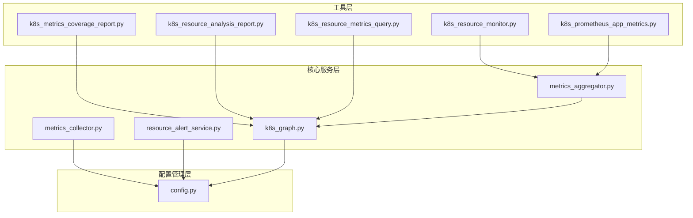
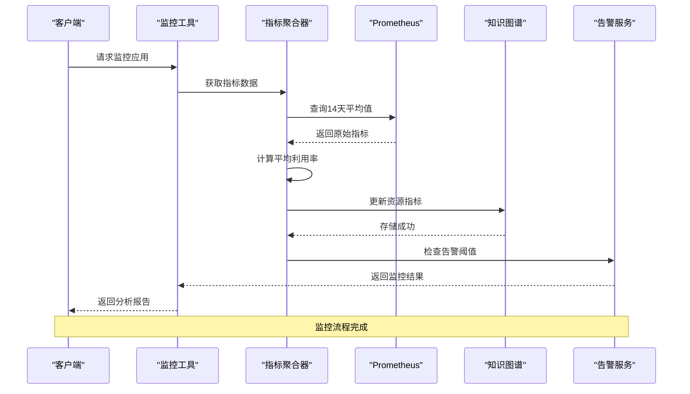
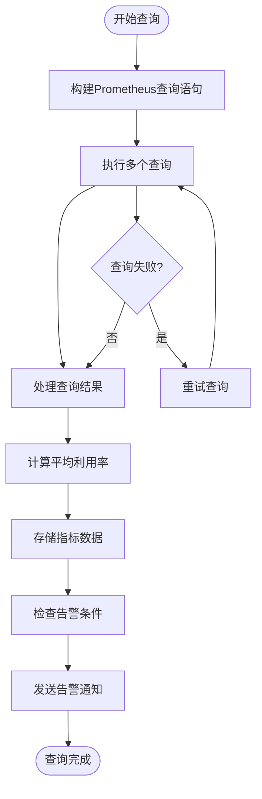
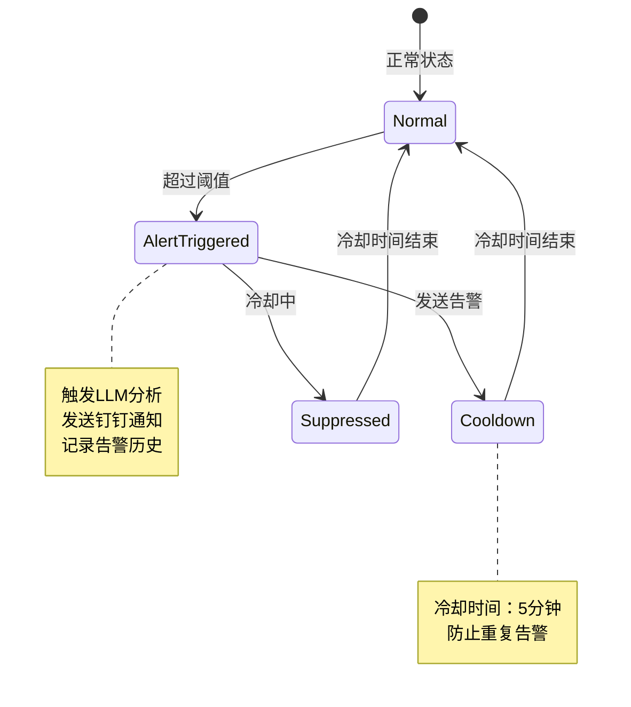
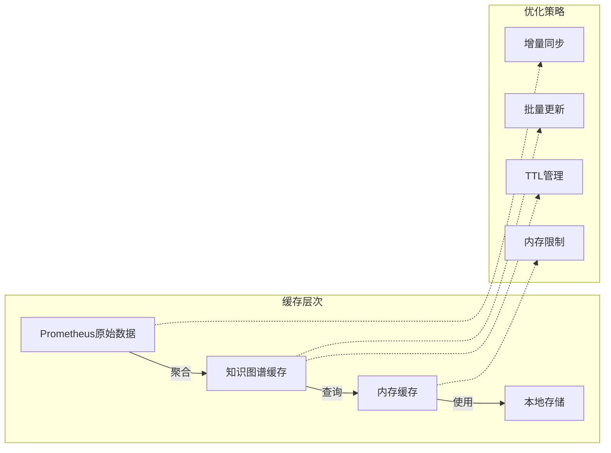
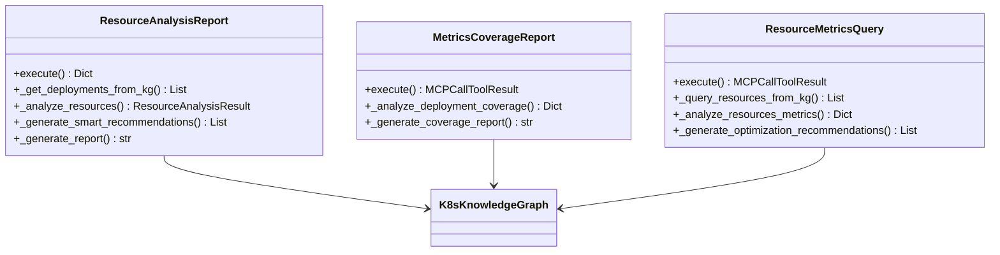
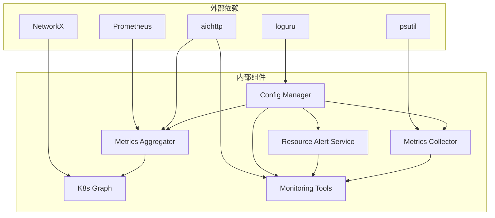

# 监控分析工具

<cite>
**本文档引用的文件**
- [k8s_resource_monitor.py](file://backend/src/k8s_mcp/tools/k8s_resource_monitor.py)
- [k8s_metrics_coverage_report.py](file://backend/src/k8s_mcp/tools/k8s_metrics_coverage_report.py)
- [k8s_prometheus_app_metrics.py](file://backend/src/k8s_mcp/tools/k8s_prometheus_app_metrics.py)
- [metrics_aggregator.py](file://backend/src/k8s_mcp/core/metrics_aggregator.py)
- [metrics_collector.py](file://backend/src/k8s_mcp/core/metrics_collector.py)
- [resource_alert_service.py](file://backend/src/k8s_mcp/core/resource_alert_service.py)
- [k8s_graph.py](file://backend/src/k8s_mcp/core/k8s_graph.py)
- [k8s_resource_analysis_report.py](file://backend/src/k8s_mcp/tools/k8s_resource_analysis_report.py)
- [k8s_resource_metrics_query.py](file://backend/src/k8s_mcp/tools/k8s_resource_metrics_query.py)
- [config.py](file://backend/src/k8s_mcp/config.py)
</cite>

## 目录
1. [简介](#简介)
2. [项目结构](#项目结构)
3. [核心组件](#核心组件)
4. [架构概览](#架构概览)
5. [详细组件分析](#详细组件分析)
6. [依赖关系分析](#依赖关系分析)
7. [性能考虑](#性能考虑)
8. [故障排除指南](#故障排除指南)
9. [结论](#结论)
10. [附录](#附录)

## 简介

Kubernetes监控分析工具是一个基于MCP（Model Context Protocol）的智能监控系统，专门设计用于收集、分析和可视化Kubernetes集群的监控数据。该工具提供了完整的监控解决方案，包括节点指标、Pod指标和应用指标的获取与处理，以及与Prometheus的深度集成。

该系统的核心特点包括：

- **多层监控架构**：支持从Prometheus获取原始指标，通过知识图谱进行数据聚合和存储，提供高效的查询能力
- **智能分析功能**：集成LLM（大语言模型）进行资源使用分析和优化建议生成
- **自动化告警**：基于阈值的资源告警机制，支持钉钉通知和冷却机制
- **可视化报告**：生成详细的指标覆盖报告和资源分析报告
- **灵活配置**：支持多种配置选项，包括阈值设置、更新频率和存储优化

## 项目结构

该项目采用模块化设计，主要分为以下几个核心模块：



**图表来源**
- [k8s_resource_monitor.py:1-508](file://backend/src/k8s_mcp/tools/k8s_resource_monitor.py#L1-L508)
- [metrics_aggregator.py:1-653](file://backend/src/k8s_mcp/core/metrics_aggregator.py#L1-L653)
- [k8s_graph.py:1-663](file://backend/src/k8s_mcp/core/k8s_graph.py#L1-L663)

**章节来源**
- [k8s_resource_monitor.py:1-508](file://backend/src/k8s_mcp/tools/k8s_resource_monitor.py#L1-L508)
- [metrics_aggregator.py:1-653](file://backend/src/k8s_mcp/core/metrics_aggregator.py#L1-L653)
- [k8s_graph.py:1-663](file://backend/src/k8s_mcp/core/k8s_graph.py#L1-L663)

## 核心组件

### 指标聚合器（Metrics Aggregator）

指标聚合器是整个监控系统的核心组件，负责定期从Prometheus获取资源使用率数据，计算14天平均值，并将结果存储到知识图谱中。

**主要功能**：
- 定期从Prometheus获取CPU和内存使用率数据
- 计算14天内平均利用率
- 将聚合结果存储到知识图谱
- 提供指标查询和分析能力
- 实现资源告警检查

**配置参数**：
- 聚合间隔：默认2周（14天）
- 分析天数：默认14天
- CPU阈值：默认60%
- 内存阈值：默认60%

### 知识图谱（K8s Knowledge Graph）

知识图谱模块使用NetworkX构建Kubernetes资源关系图，支持资源节点管理、关系建立和查询。

**核心特性**：
- 资源节点管理（Pod、Deployment、Service等）
- 关系建立和查询（ownedBy、manages、routes等）
- 深度遍历和影响范围分析
- 内存管理和TTL（生存时间）
- 线程安全操作

### 资源监控工具

资源监控工具提供手动触发资源监控和告警测试的功能，支持实时资源分析、告警测试和统计查询。

**支持的操作**：
- monitor：监控指定应用的资源状态
- test-alert：测试告警功能
- get-stats：获取统计信息
- list-apps：列出可监控的应用

### 指标覆盖报告工具

该工具分析知识图谱中所有deployment的指标覆盖情况，显示指标更新统计和错误处理信息。

**报告内容**：
- 总Deployment数统计
- 有指标数据和缺少指标的Deployment数量
- 指标过期的Deployment统计
- 整体覆盖率计算
- 聚合器状态和配置信息

**章节来源**
- [metrics_aggregator.py:42-653](file://backend/src/k8s_mcp/core/metrics_aggregator.py#L42-L653)
- [k8s_graph.py:32-663](file://backend/src/k8s_mcp/core/k8s_graph.py#L32-L663)
- [k8s_resource_monitor.py:47-508](file://backend/src/k8s_mcp/tools/k8s_resource_monitor.py#L47-L508)
- [k8s_metrics_coverage_report.py:18-316](file://backend/src/k8s_mcp/tools/k8s_metrics_coverage_report.py#L18-L316)

## 架构概览

系统采用分层架构设计，实现了监控数据的完整生命周期管理：



**图表来源**
- [metrics_aggregator.py:137-211](file://backend/src/k8s_mcp/core/metrics_aggregator.py#L137-L211)
- [k8s_resource_monitor.py:151-246](file://backend/src/k8s_mcp/tools/k8s_resource_monitor.py#L151-L246)
- [resource_alert_service.py:136-186](file://backend/src/k8s_mcp/core/resource_alert_service.py#L136-L186)

系统架构的关键特点：

1. **异步处理**：使用asyncio实现非阻塞I/O操作
2. **缓存机制**：知识图谱提供内存缓存，提高查询性能
3. **错误处理**：完善的异常捕获和重试机制
4. **监控集成**：内置指标收集器，监控系统自身性能

## 详细组件分析

### Prometheus集成分析

Prometheus集成是系统的核心功能之一，提供了强大的指标查询和分析能力。



**图表来源**
- [k8s_prometheus_app_metrics.py:126-196](file://backend/src/k8s_mcp/tools/k8s_prometheus_app_metrics.py#L126-L196)
- [metrics_aggregator.py:261-302](file://backend/src/k8s_mcp/core/metrics_aggregator.py#L261-L302)

**查询语句特点**：
- 支持14天平均值计算
- 包含CPU和内存使用率查询
- 包含资源请求和限制查询
- 支持多种时间范围和步长

**数据处理流程**：
1. 从Prometheus获取原始时间序列数据
2. 计算14天内的平均利用率
3. 处理Pod级别的详细信息
4. 生成使用率分析和优化建议

### 资源告警机制

告警机制实现了多层次的监控和通知功能：



**图表来源**
- [metrics_aggregator.py:387-453](file://backend/src/k8s_mcp/core/metrics_aggregator.py#L387-L453)
- [resource_alert_service.py:136-186](file://backend/src/k8s_mcp/core/resource_alert_service.py#L136-L186)

**告警配置**：
- 内存告警阈值：默认70%
- CPU告警阈值：默认80%
- 冷却时间：默认5分钟
- 支持LLM智能分析
- 支持钉钉通知

### 指标缓存和存储优化

系统采用了多层缓存策略来优化性能：



**图表来源**
- [k8s_graph.py:425-460](file://backend/src/k8s_mcp/core/k8s_graph.py#L425-L460)
- [metrics_aggregator.py:508-583](file://backend/src/k8s_mcp/core/metrics_aggregator.py#L508-L583)

**优化特性**：
- 知识图谱节点TTL管理（默认1小时）
- 内存使用限制（默认1GB）
- 批量更新机制
- 增量同步策略

### 可视化报告生成

系统提供了多种类型的可视化报告：



**图表来源**
- [k8s_resource_analysis_report.py:32-627](file://backend/src/k8s_mcp/tools/k8s_resource_analysis_report.py#L32-L627)
- [k8s_metrics_coverage_report.py:18-316](file://backend/src/k8s_mcp/tools/k8s_metrics_coverage_report.py#L18-L316)
- [k8s_resource_metrics_query.py:19-445](file://backend/src/k8s_mcp/tools/k8s_resource_metrics_query.py#L19-L445)

**报告类型**：
- 资源分析报告：包含正常和异常资源的详细分析
- 指标覆盖报告：显示Deployment指标的覆盖率和健康度
- 资源指标查询：提供快速的资源利用率查询和优化建议

**章节来源**
- [k8s_prometheus_app_metrics.py:22-535](file://backend/src/k8s_mcp/tools/k8s_prometheus_app_metrics.py#L22-L535)
- [resource_alert_service.py:94-789](file://backend/src/k8s_mcp/core/resource_alert_service.py#L94-L789)
- [k8s_resource_analysis_report.py:32-627](file://backend/src/k8s_mcp/tools/k8s_resource_analysis_report.py#L32-L627)
- [k8s_metrics_coverage_report.py:18-316](file://backend/src/k8s_mcp/tools/k8s_metrics_coverage_report.py#L18-L316)
- [k8s_resource_metrics_query.py:19-445](file://backend/src/k8s_mcp/tools/k8s_resource_metrics_query.py#L19-L445)

## 依赖关系分析

系统采用松耦合的设计，各组件之间的依赖关系清晰明确：



**图表来源**
- [metrics_aggregator.py:8-20](file://backend/src/k8s_mcp/core/metrics_aggregator.py#L8-L20)
- [k8s_graph.py:13-20](file://backend/src/k8s_mcp/core/k8s_graph.py#L13-L20)
- [metrics_collector.py:13-23](file://backend/src/k8s_mcp/core/metrics_collector.py#L13-L23)

**核心依赖**：
- **Prometheus**：提供指标数据源
- **NetworkX**：构建和管理知识图谱
- **aiohttp**：异步HTTP客户端
- **psutil**：系统资源监控
- **loguru**：日志管理

**章节来源**
- [config.py:17-369](file://backend/src/k8s_mcp/config.py#L17-L369)
- [metrics_aggregator.py:1-653](file://backend/src/k8s_mcp/core/metrics_aggregator.py#L1-L653)
- [k8s_graph.py:1-663](file://backend/src/k8s_mcp/core/k8s_graph.py#L1-L663)

## 性能考虑

系统在设计时充分考虑了性能优化，采用了多种策略来确保高效运行：

### 并发处理
- 使用asyncio实现异步I/O操作
- 多个Prometheus查询并行执行
- 线程安全的共享资源访问

### 缓存策略
- 知识图谱提供内存缓存
- TTL机制防止内存无限增长
- 批量更新减少数据库压力

### 查询优化
- 精确的过滤条件减少数据扫描
- 指标预计算避免重复计算
- 分页查询处理大量数据

### 监控开销
- 内置指标收集器监控系统性能
- 可配置的监控间隔
- 历史数据限制防止内存溢出

## 故障排除指南

### 常见问题和解决方案

**Prometheus连接问题**：
- 检查PROMETHEUS_URL环境变量配置
- 验证认证凭据设置
- 确认网络连通性和防火墙设置

**指标数据缺失**：
- 检查ServiceMonitor配置
- 验证Pod标签选择器
- 确认指标抓取间隔设置

**告警通知失败**：
- 检查钉钉Webhook配置
- 验证网络连接
- 查看告警服务日志

**性能问题**：
- 调整聚合间隔配置
- 优化查询过滤条件
- 检查系统资源使用情况

### 日志分析

系统使用loguru框架进行日志管理，支持不同级别的日志输出：

- **DEBUG**：详细的操作信息和调试数据
- **INFO**：正常操作状态和进度信息
- **WARNING**：潜在问题和需要注意的情况
- **ERROR**：错误事件和异常情况

**章节来源**
- [metrics_collector.py:134-164](file://backend/src/k8s_mcp/core/metrics_collector.py#L134-L164)
- [metrics_aggregator.py:162-166](file://backend/src/k8s_mcp/core/metrics_aggregator.py#L162-L166)

## 结论

Kubernetes监控分析工具提供了一个完整、高效且智能化的监控解决方案。通过Prometheus集成、知识图谱存储和智能分析功能，该系统能够：

1. **全面监控**：覆盖节点、Pod和应用层面的资源使用情况
2. **智能分析**：利用LLM提供专业的资源优化建议
3. **自动化告警**：基于阈值的智能告警和通知机制
4. **可视化报告**：生成详细的指标覆盖和资源分析报告
5. **性能优化**：多层缓存和优化策略确保高效运行

该工具特别适合需要精细化资源管理和智能运维的Kubernetes集群，能够帮助运维团队及时发现和解决资源使用问题，提高集群的整体效率和稳定性。

## 附录

### 配置选项参考

**核心配置参数**：
- PROMETHEUS_URL：Prometheus服务器地址
- PROMETHEUS_ACCESS_KEY：访问密钥
- PROMETHEUS_SECRET_KEY：秘密密钥
- PROMETHEUS_AUTH_TYPE：认证类型（none/basic/bearer）

**监控配置**：
- METRICS_AGGREGATION_INTERVAL：指标聚合间隔（秒）
- METRICS_ANALYSIS_DAYS：分析天数
- METRICS_CPU_THRESHOLD：CPU阈值（百分比）
- METRICS_MEMORY_THRESHOLD：内存阈值（百分比）

**告警配置**：
- MEMORY_ALERT_THRESHOLD：内存告警阈值（0.0-1.0）
- CPU_ALERT_THRESHOLD：CPU告警阈值（0.0-1.0）
- ALERT_COOLDOWN_SECONDS：告警冷却时间（秒）
- ENABLE_RESOURCE_ALERTS：启用资源告警

### API使用示例

**监控应用资源**：
```bash
curl -X POST http://localhost:8766/api/tools/k8s-resource-monitor \
  -H "Content-Type: application/json" \
  -d '{
    "action": "monitor",
    "app_name": "my-app",
    "namespace": "production"
  }'
```

**查询指标覆盖**：
```bash
curl -X POST http://localhost:8766/api/tools/k8s-metrics-coverage-report \
  -H "Content-Type: application/json" \
  -d '{
    "include_details": true,
    "filter_namespace": "production"
  }'
```

**查询应用指标**：
```bash
curl -X POST http://localhost:8766/api/tools/k8s-prometheus-app-metrics \
  -H "Content-Type: application/json" \
  -d '{
    "app_name": "my-app",
    "namespace": "production",
    "days": 14,
    "time_period": "14d"
  }'
```