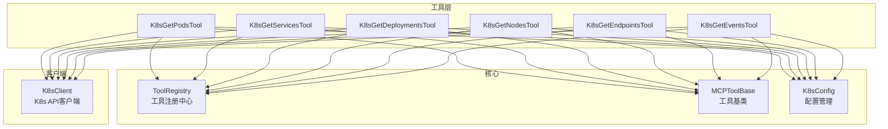
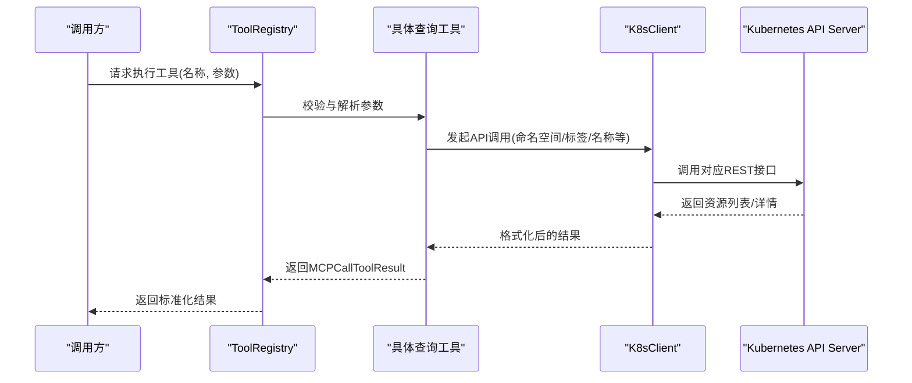
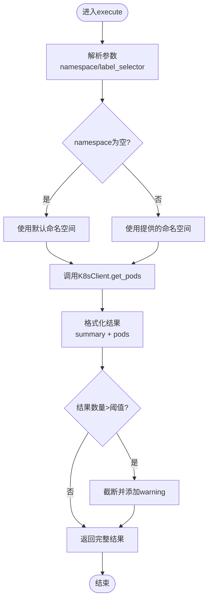
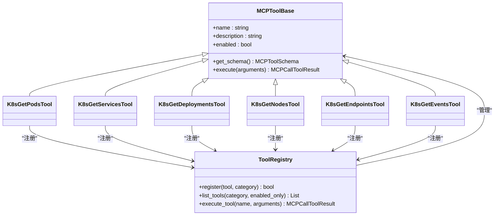

# 资源查询工具

<cite>
**本文档引用的文件**
- [k8s_get_pods.py](file://backend/src/k8s_mcp/tools/k8s_get_pods.py)
- [k8s_get_services.py](file://backend/src/k8s_mcp/tools/k8s_get_services.py)
- [k8s_get_deployments.py](file://backend/src/k8s_mcp/tools/k8s_get_deployments.py)
- [k8s_get_nodes.py](file://backend/src/k8s_mcp/tools/k8s_get_nodes.py)
- [k8s_get_endpoints.py](file://backend/src/k8s_mcp/tools/k8s_get_endpoints.py)
- [k8s_get_events.py](file://backend/src/k8s_mcp/tools/k8s_get_events.py)
- [k8s_client.py](file://backend/src/k8s_mcp/k8s_client.py)
- [config.py](file://backend/src/k8s_mcp/config.py)
- [tool_registry.py](file://backend/src/k8s_mcp/core/tool_registry.py)
- [__init__.py](file://backend/src/k8s_mcp/tools/__init__.py)
</cite>

## 目录
1. [简介](#简介)
2. [项目结构](#项目结构)
3. [核心组件](#核心组件)
4. [架构总览](#架构总览)
5. [详细组件分析](#详细组件分析)
6. [依赖关系分析](#依赖关系分析)
7. [性能考虑](#性能考虑)
8. [故障排查指南](#故障排查指南)
9. [结论](#结论)
10. [附录](#附录)

## 简介
本文件面向Kubernetes资源查询工具，系统性梳理了Pod、Service、Deployment、Node、Endpoint、Event等核心资源的查询能力，涵盖参数定义、过滤规则、结果格式、调用方式、错误处理与性能优化策略，并解释与Kubernetes API Server的交互机制及认证授权流程。文档同时提供常见查询场景示例与最佳实践，帮助开发者快速集成与扩展。

## 项目结构
Kubernetes查询工具位于后端模块的k8s_mcp/tools目录，围绕统一的工具基类与注册中心构建，K8sClient负责与Kubernetes API Server交互，K8sConfig提供配置管理与默认参数。

**图表来源**
- [k8s_get_pods.py:16-169](file://backend/src/k8s_mcp/tools/k8s_get_pods.py#L16-L169)
- [k8s_get_services.py:12-63](file://backend/src/k8s_mcp/tools/k8s_get_services.py#L12-L63)
- [k8s_get_deployments.py:9-56](file://backend/src/k8s_mcp/tools/k8s_get_deployments.py#L9-L56)
- [k8s_get_nodes.py:9-30](file://backend/src/k8s_mcp/tools/k8s_get_nodes.py#L9-L30)
- [k8s_get_endpoints.py:12-77](file://backend/src/k8s_mcp/tools/k8s_get_endpoints.py#L12-L77)
- [k8s_get_events.py:9-40](file://backend/src/k8s_mcp/tools/k8s_get_events.py#L9-L40)
- [tool_registry.py:75-401](file://backend/src/k8s_mcp/core/tool_registry.py#L75-L401)
- [config.py:17-369](file://backend/src/k8s_mcp/config.py#L17-L369)
- [k8s_client.py:28-1686](file://backend/src/k8s_mcp/k8s_client.py#L28-L1686)

**章节来源**
- [__init__.py:1-141](file://backend/src/k8s_mcp/tools/__init__.py#L1-L141)
- [tool_registry.py:75-401](file://backend/src/k8s_mcp/core/tool_registry.py#L75-L401)
- [config.py:17-369](file://backend/src/k8s_mcp/config.py#L17-L369)

## 核心组件
- 工具基类与注册中心
  - MCPToolBase：定义工具名称、描述、启用状态与执行计数等元信息，提供抽象的get_schema与execute接口。
  - ToolRegistry：提供工具注册、发现、执行、统计与搜索能力，支持异步执行与错误包装。
- Kubernetes客户端
  - K8sClient：封装kubernetes-client SDK，负责连接、认证、调用API、异常转换与结果格式化。
- 配置管理
  - K8sConfig：从环境变量加载kubeconfig路径、默认命名空间、服务器绑定地址与端口等；提供工具默认参数与配置校验。

**章节来源**
- [tool_registry.py:15-73](file://backend/src/k8s_mcp/core/tool_registry.py#L15-L73)
- [tool_registry.py:75-220](file://backend/src/k8s_mcp/core/tool_registry.py#L75-L220)
- [k8s_client.py:28-116](file://backend/src/k8s_mcp/k8s_client.py#L28-L116)
- [config.py:17-167](file://backend/src/k8s_mcp/config.py#L17-L167)

## 架构总览
工具通过MCP协议暴露给外部调用，内部由ToolRegistry统一调度，最终委托K8sClient与Kubernetes API Server交互。配置由K8sConfig统一管理，确保连接参数与默认行为一致。

**图表来源**
- [tool_registry.py:235-268](file://backend/src/k8s_mcp/core/tool_registry.py#L235-L268)
- [k8s_client.py:50-116](file://backend/src/k8s_mcp/k8s_client.py#L50-L116)
- [k8s_get_pods.py:53-113](file://backend/src/k8s_mcp/tools/k8s_get_pods.py#L53-L113)

## 详细组件分析

### Pod查询工具（K8sGetPodsTool）
- 功能概述
  - 支持按命名空间与标签选择器查询Pod列表，支持“全部命名空间”模式。
  - 对结果进行二次格式化，输出摘要与详细列表，并对大量结果进行截断与警告提示。
- 参数定义
  - namespace：命名空间名称，支持"all"表示全集群；为空字符串将被转换为None使用默认命名空间。
  - label_selector：Kubernetes标签选择器，如"key=value"或逗号分隔的多键值对。
- 过滤规则
  - 若未提供namespace，使用K8sConfig默认命名空间；若提供"all"，调用全集群列表接口。
  - label_selector直接传递给API，遵循标准Kubernetes选择器语法。
- 结果格式
  - summary：包含namespace、total_pods与按phase的状态摘要。
  - pods：每项包含name、namespace、status、ready、restarts、age、node、ip、containers等字段。
  - 当结果超过阈值时追加warning字段，建议使用更精确的过滤条件。
- 错误处理
  - 捕获K8sClientError与通用异常，返回MCPCallToolResult.error。
- 性能优化
  - 对超大结果集进行截断，避免上下文溢出；建议优先使用命名空间与标签过滤。

**图表来源**
- [k8s_get_pods.py:53-113](file://backend/src/k8s_mcp/tools/k8s_get_pods.py#L53-L113)
- [k8s_get_pods.py:114-169](file://backend/src/k8s_mcp/tools/k8s_get_pods.py#L114-L169)

**章节来源**
- [k8s_get_pods.py:16-169](file://backend/src/k8s_mcp/tools/k8s_get_pods.py#L16-L169)

### Service查询工具（K8sGetServicesTool）
- 功能概述
  - 支持查询命名空间内Service列表或读取单个Service详情。
- 参数定义
  - namespace：命名空间名称。
  - label_selector：标签选择器。
  - name：当提供时仅返回该Service的详细信息。
- 过滤规则
  - name存在时走读取接口；否则走列表接口，支持全命名空间或指定命名空间。
- 结果格式
  - items包含name、namespace、type、cluster_ip、external_ips、ports、selector、age等字段。
- 错误处理
  - 捕获异常并返回MCPCallToolResult.error。

**章节来源**
- [k8s_get_services.py:12-63](file://backend/src/k8s_mcp/tools/k8s_get_services.py#L12-L63)

### Deployment查询工具（K8sGetDeploymentsTool）
- 功能概述
  - 支持查询命名空间内Deployment列表或读取单个Deployment详情。
- 参数定义
  - namespace：命名空间名称。
  - label_selector：标签选择器。
  - name：当提供时仅返回该Deployment的详细信息。
- 结果格式
  - items包含name、namespace、replicas、ready_replicas、available_replicas、unavailable_replicas、strategy、labels、selector、age等字段。
- 错误处理
  - 捕获异常并返回MCPCallToolResult.error。

**章节来源**
- [k8s_get_deployments.py:9-56](file://backend/src/k8s_mcp/tools/k8s_get_deployments.py#L9-L56)

### Node查询工具（K8sGetNodesTool）
- 功能概述
  - 获取Node列表，支持标签选择器。
- 参数定义
  - 无输入参数。
- 结果格式
  - items包含name、status、roles、age、version、internal_ip、external_ip、os、kernel、container_runtime、labels、capacity、allocatable等字段。
- 错误处理
  - 捕获异常并返回MCPCallToolResult.error。

**章节来源**
- [k8s_get_nodes.py:9-30](file://backend/src/k8s_mcp/tools/k8s_get_nodes.py#L9-L30)

### Endpoint查询工具（K8sGetEndpointsTool）
- 功能概述
  - 获取Service端点信息，展示实际的Pod IP、端口与就绪状态。
- 参数定义
  - namespace：命名空间名称。
  - name：Service名称；为空时返回命名空间下所有端点。
  - label_selector：标签选择器。
- 结果格式
  - items包含name、namespace、subsets；subsets包含addresses、not_ready_addresses、ports等字段。
- 错误处理
  - 捕获K8sClientError与通用异常，返回MCPCallToolResult.error。

**章节来源**
- [k8s_get_endpoints.py:12-77](file://backend/src/k8s_mcp/tools/k8s_get_endpoints.py#L12-L77)
- [k8s_client.py:1464-1574](file://backend/src/k8s_mcp/k8s_client.py#L1464-L1574)

### Event查询工具（K8sGetEventsTool）
- 功能概述
  - 获取集群事件列表，支持命名空间与数量限制。
- 参数定义
  - namespace：命名空间。
  - limit：返回事件数量限制。
- 结果格式
  - items包含namespace、type、reason、message、object(kind/name/namespace)、first_time、last_time、count等字段，并按时间倒序排列。
- 错误处理
  - 捕获异常并返回MCPCallToolResult.error。

**章节来源**
- [k8s_get_events.py:9-40](file://backend/src/k8s_mcp/tools/k8s_get_events.py#L9-L40)
- [k8s_client.py:1076-1144](file://backend/src/k8s_mcp/k8s_client.py#L1076-L1144)

## 依赖关系分析
- 工具与客户端
  - 各查询工具均依赖K8sClient进行API调用，K8sClient负责连接建立、权限检查与结果格式化。
- 工具与注册中心
  - 工具通过MCPToolBase继承，经ToolRegistry注册与统一调度，支持启用/禁用、统计与搜索。
- 工具与配置
  - 工具通过K8sConfig获取默认命名空间、默认参数与工具默认参数，保证一致性。
- 工具清单
  - __init__.py集中导出并注册安全查询工具，形成可用工具列表。

**图表来源**
- [tool_registry.py:15-73](file://backend/src/k8s_mcp/core/tool_registry.py#L15-L73)
- [tool_registry.py:75-220](file://backend/src/k8s_mcp/core/tool_registry.py#L75-L220)
- [k8s_get_pods.py:16-169](file://backend/src/k8s_mcp/tools/k8s_get_pods.py#L16-L169)
- [k8s_get_services.py:12-63](file://backend/src/k8s_mcp/tools/k8s_get_services.py#L12-L63)
- [k8s_get_deployments.py:9-56](file://backend/src/k8s_mcp/tools/k8s_get_deployments.py#L9-L56)
- [k8s_get_nodes.py:9-30](file://backend/src/k8s_mcp/tools/k8s_get_nodes.py#L9-L30)
- [k8s_get_endpoints.py:12-77](file://backend/src/k8s_mcp/tools/k8s_get_endpoints.py#L12-L77)
- [k8s_get_events.py:9-40](file://backend/src/k8s_mcp/tools/k8s_get_events.py#L9-L40)

**章节来源**
- [__init__.py:44-141](file://backend/src/k8s_mcp/tools/__init__.py#L44-L141)
- [tool_registry.py:75-220](file://backend/src/k8s_mcp/core/tool_registry.py#L75-L220)

## 性能考虑
- 结果截断与上下文控制
  - Pod查询工具对超大结果集进行截断并给出警告，建议通过更精确的namespace与label_selector缩小范围。
- API调用限制
  - 客户端在部分列表接口设置了默认limit，避免一次性拉取过多资源导致性能问题。
- 连接与重试
  - K8sClient负责连接测试与异常转换，建议结合配置中的超时与重试参数进行调优。
- 建议
  - 优先使用命名空间与标签过滤；对高频查询可考虑缓存与增量更新策略（需在上层实现）。

[本节为通用指导，无需特定文件来源]

## 故障排查指南
- 连接失败
  - 检查kubeconfig路径与默认命名空间配置；确认K8sClient连接测试通过。
- 权限不足
  - 确认当前用户/服务账号具有相应资源的读取权限；必要时调整RBAC策略。
- 参数错误
  - label_selector格式应符合Kubernetes规范；空字符串会被转换为None。
- 结果异常
  - 对于复杂资源（如Pod），客户端提供安全访问与默认值填充，避免属性缺失导致的异常。
- 常见错误码
  - 404：资源不存在；403：权限不足；其他API异常：参考K8sClientError消息。

**章节来源**
- [k8s_client.py:50-116](file://backend/src/k8s_mcp/k8s_client.py#L50-L116)
- [k8s_client.py:1076-1144](file://backend/src/k8s_mcp/k8s_client.py#L1076-L1144)
- [k8s_get_pods.py:107-113](file://backend/src/k8s_mcp/tools/k8s_get_pods.py#L107-L113)

## 结论
本工具体系以统一的工具基类与注册中心为核心，结合K8sClient与K8sConfig，提供了稳定、可扩展的Kubernetes资源查询能力。通过明确的参数定义、过滤规则与结果格式，配合完善的错误处理与性能优化策略，能够满足日常运维与监控场景的需求。建议在生产环境中结合命名空间与标签过滤、合理设置limit与超时，并持续关注工具注册与统计信息以保障稳定性。

[本节为总结，无需特定文件来源]

## 附录

### 常用查询场景示例（步骤说明）
- 按标签过滤Pod
  - 步骤：调用k8s-get-pods，传入namespace与label_selector；根据返回的summary与pods字段分析状态与容器信息。
  - 参考参数：namespace、label_selector。
- 按命名空间查询Service
  - 步骤：调用k8s-get-services，传入namespace；若需单个Service详情，额外传入name。
  - 参考参数：namespace、name。
- 按标签筛选Deployment
  - 步骤：调用k8s-get-deployments，传入namespace与label_selector；查看replicas与ready_replicas。
  - 参考参数：namespace、label_selector。
- 查询Node列表
  - 步骤：调用k8s-get-nodes；若需按标签筛选，可在客户端侧使用label_selector参数（如后续扩展）。
  - 参考参数：无。
- 查询Endpoint
  - 步骤：调用k8s-get-endpoints，传入namespace与name（可选）；查看subsets中的addresses与ports。
  - 参考参数：namespace、name、label_selector。
- 查询事件
  - 步骤：调用k8s-get-events，传入namespace与limit；按last_time排序查看最新事件。
  - 参考参数：namespace、limit。

[本节为概念性说明，无需特定文件来源]

### 与Kubernetes API Server的交互机制与认证授权
- 连接与认证
  - 通过kubeconfig文件加载集群配置；客户端连接后进行版本与节点信息测试，确保可达性。
- 授权流程
  - 工具均为只读查询，不涉及修改操作；实际权限取决于当前用户/服务账号的角色绑定。
- 命名空间与权限
  - 客户端提供命名空间权限检查占位，便于后续增强；当前实现简化处理。

**章节来源**
- [k8s_client.py:50-116](file://backend/src/k8s_mcp/k8s_client.py#L50-L116)
- [k8s_client.py:112-121](file://backend/src/k8s_mcp/k8s_client.py#L112-L121)

### 查询结果数据结构与字段说明（示例）
- Pod列表
  - summary.namespace、summary.total_pods、summary.status_summary
  - pods[].name、namespace、status、ready、restarts、age、node、ip、containers[]
- Service列表
  - items[].name、namespace、type、cluster_ip、external_ips、ports[]、selector、age
- Deployment列表
  - items[].name、namespace、replicas、ready_replicas、available_replicas、unavailable_replicas、strategy、labels、selector、age
- Node列表
  - items[].name、status、roles、age、version、internal_ip、external_ip、os、kernel、container_runtime、labels、capacity、allocatable
- Endpoint列表
  - items[].name、namespace、subsets[].addresses[]/not_ready_addresses[]/ports[]
- 事件列表
  - items[].namespace、type、reason、message、object、first_time、last_time、count

**章节来源**
- [k8s_get_pods.py:114-169](file://backend/src/k8s_mcp/tools/k8s_get_pods.py#L114-L169)
- [k8s_get_services.py:21-43](file://backend/src/k8s_mcp/tools/k8s_get_services.py#L21-L43)
- [k8s_get_deployments.py:15-37](file://backend/src/k8s_mcp/tools/k8s_get_deployments.py#L15-L37)
- [k8s_get_nodes.py:15-20](file://backend/src/k8s_mcp/tools/k8s_get_nodes.py#L15-L20)
- [k8s_get_endpoints.py:22-44](file://backend/src/k8s_mcp/tools/k8s_get_endpoints.py#L22-L44)
- [k8s_get_events.py:15-27](file://backend/src/k8s_mcp/tools/k8s_get_events.py#L15-L27)
- [k8s_client.py:1464-1574](file://backend/src/k8s_mcp/k8s_client.py#L1464-L1574)
- [k8s_client.py:1076-1144](file://backend/src/k8s_mcp/k8s_client.py#L1076-L1144)