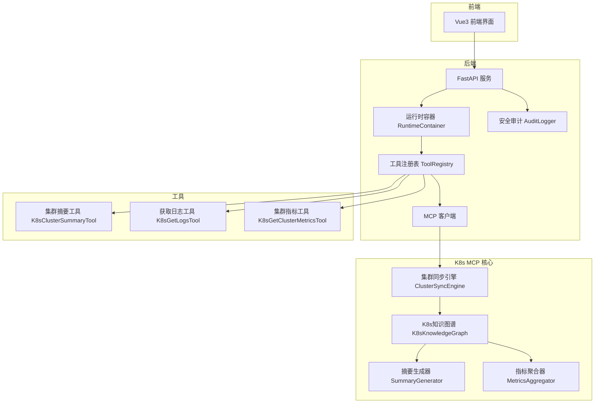
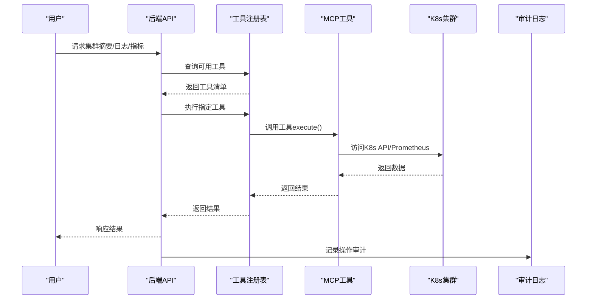
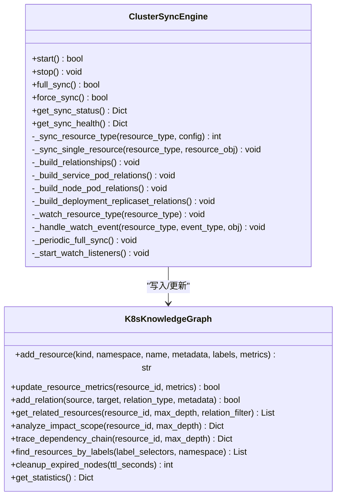
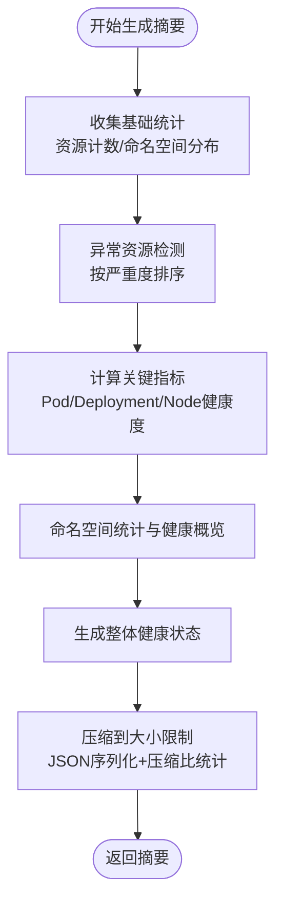
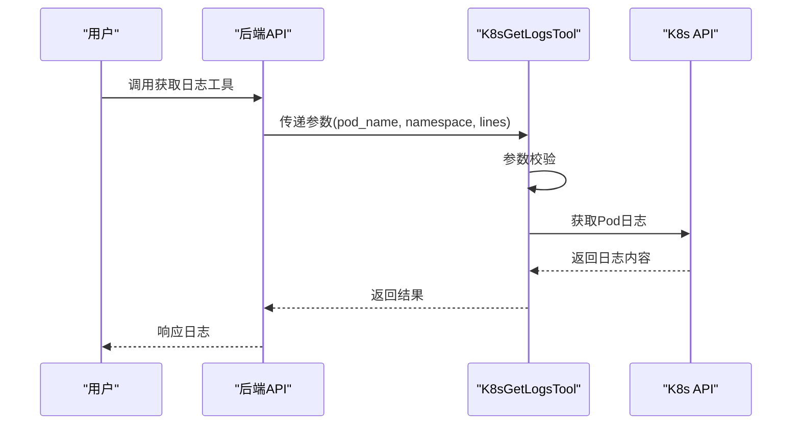
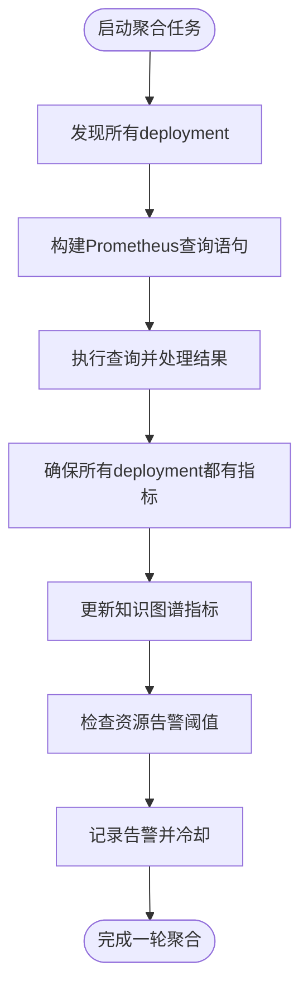
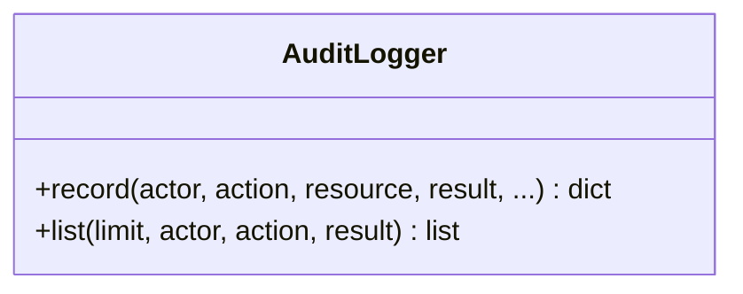
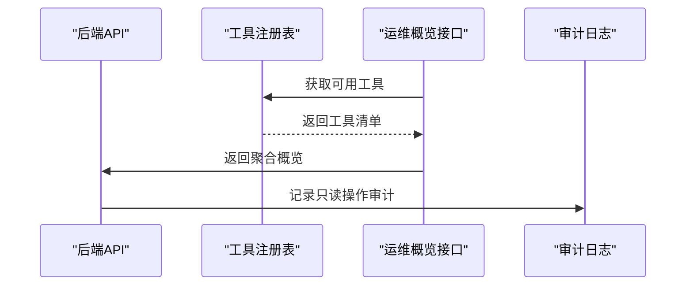
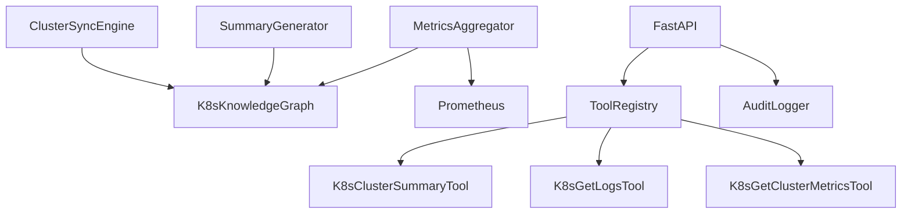

# 集群运维工具

<cite>
**本文档引用的文件**
- [cluster_sync.py](file://backend/src/k8s_mcp/core/cluster_sync.py)
- [summary_generator.py](file://backend/src/k8s_mcp/core/summary_generator.py)
- [k8s_cluster_summary.py](file://backend/src/k8s_mcp/tools/k8s_cluster_summary.py)
- [k8s_get_logs.py](file://backend/src/k8s_mcp/tools/k8s_get_logs.py)
- [metrics_aggregator.py](file://backend/src/k8s_mcp/core/metrics_aggregator.py)
- [k8s_graph.py](file://backend/src/k8s_mcp/core/k8s_graph.py)
- [k8s_get_cluster_metrics.py](file://backend/src/k8s_mcp/tools/k8s_get_cluster_metrics.py)
- [tool_registry.py](file://backend/src/k8s_mcp/core/tool_registry.py)
- [audit.py](file://backend/src/security/audit.py)
- [ops.py](file://backend/src/api/v2/endpoints/ops.py)
- [config.py](file://backend/src/k8s_mcp/config.py)
- [README.md](file://README.md)
</cite>

## 目录
1. [简介](#简介)
2. [项目结构](#项目结构)
3. [核心组件](#核心组件)
4. [架构总览](#架构总览)
5. [详细组件分析](#详细组件分析)
6. [依赖关系分析](#依赖关系分析)
7. [性能考虑](#性能考虑)
8. [故障排查指南](#故障排查指南)
9. [结论](#结论)
10. [附录](#附录)

## 简介
本项目是一个基于钉钉的智能 Kubernetes 运维机器人，提供集群状态概览、智能摘要生成、日志获取、配置同步与监控告警等能力。系统采用 MCP 协议扩展工具体系，支持知识图谱驱动的实时同步与关系分析，并通过统一的安全审计机制保障操作合规。

## 项目结构
项目采用前后端分离与工具内嵌的架构设计：
- 后端包含统一的 FastAPI 服务与 MCP 工具运行时，K8s/ECS 工具作为进程内模块运行
- 前端为现代化 Vue3 界面，提供流式对话与运维工作台
- 配置集中管理，支持环境变量与本地 JSON 文件
- 安全审计模块提供只读追加式操作审计日志

**图表来源**
- [ops.py:1-313](file://backend/src/api/v2/endpoints/ops.py#L1-L313)
- [tool_registry.py:75-401](file://backend/src/k8s_mcp/core/tool_registry.py#L75-L401)
- [cluster_sync.py:25-694](file://backend/src/k8s_mcp/core/cluster_sync.py#L25-L694)
- [k8s_graph.py:32-663](file://backend/src/k8s_mcp/core/k8s_graph.py#L32-L663)
- [summary_generator.py:22-800](file://backend/src/k8s_mcp/core/summary_generator.py#L22-L800)
- [metrics_aggregator.py:42-653](file://backend/src/k8s_mcp/core/metrics_aggregator.py#L42-L653)
- [k8s_cluster_summary.py:26-899](file://backend/src/k8s_mcp/tools/k8s_cluster_summary.py#L26-L899)
- [k8s_get_logs.py:16-91](file://backend/src/k8s_mcp/tools/k8s_get_logs.py#L16-L91)
- [k8s_get_cluster_metrics.py:23-299](file://backend/src/k8s_mcp/tools/k8s_get_cluster_metrics.py#L23-L299)
- [audit.py:21-96](file://backend/src/security/audit.py#L21-L96)

**章节来源**
- [README.md:1-98](file://README.md#L1-L98)

## 核心组件
- 集群同步引擎：负责全量与增量同步、关系建立、错误恢复与性能优化
- 知识图谱：存储资源节点与关系，支持查询、影响分析与依赖追踪
- 摘要生成器：智能压缩与优先级排序，输出异常检测与关键指标
- 指标聚合器：定时从 Prometheus 聚合 CPU/内存使用率，更新知识图谱并触发告警
- 工具注册表：统一管理 MCP 工具的注册、发现与执行
- 审计日志：只读追加式操作审计，支持过滤与查询

**章节来源**
- [cluster_sync.py:25-694](file://backend/src/k8s_mcp/core/cluster_sync.py#L25-L694)
- [k8s_graph.py:32-663](file://backend/src/k8s_mcp/core/k8s_graph.py#L32-L663)
- [summary_generator.py:22-800](file://backend/src/k8s_mcp/core/summary_generator.py#L22-L800)
- [metrics_aggregator.py:42-653](file://backend/src/k8s_mcp/core/metrics_aggregator.py#L42-L653)
- [tool_registry.py:75-401](file://backend/src/k8s_mcp/core/tool_registry.py#L75-L401)
- [audit.py:21-96](file://backend/src/security/audit.py#L21-L96)

## 架构总览
系统通过 MCP 工具体系实现运维能力的模块化与可扩展性。后端 API 聚合运行时状态，工具注册表统一调度，知识图谱提供关系与指标支撑，审计模块贯穿所有操作。

**图表来源**
- [ops.py:87-313](file://backend/src/api/v2/endpoints/ops.py#L87-L313)
- [tool_registry.py:235-268](file://backend/src/k8s_mcp/core/tool_registry.py#L235-L268)
- [k8s_cluster_summary.py:164-229](file://backend/src/k8s_mcp/tools/k8s_cluster_summary.py#L164-L229)
- [k8s_get_logs.py:59-91](file://backend/src/k8s_mcp/tools/k8s_get_logs.py#L59-L91)
- [k8s_get_cluster_metrics.py:59-84](file://backend/src/k8s_mcp/tools/k8s_get_cluster_metrics.py#L59-L84)
- [audit.py:27-62](file://backend/src/security/audit.py#L27-L62)

## 详细组件分析

### 集群同步机制
集群同步引擎同时支持全量与增量同步，通过 Watch API 实时监听关键资源变化，并在异常时自动重连与退避重试。同步完成后建立资源间关系（如 Service-Pod、Node-Pod、Deployment-ReplicaSet），并清理过期节点。

**图表来源**
- [cluster_sync.py:25-694](file://backend/src/k8s_mcp/core/cluster_sync.py#L25-L694)
- [k8s_graph.py:32-663](file://backend/src/k8s_mcp/core/k8s_graph.py#L32-L663)

**章节来源**
- [cluster_sync.py:106-155](file://backend/src/k8s_mcp/core/cluster_sync.py#L106-L155)
- [cluster_sync.py:176-224](file://backend/src/k8s_mcp/core/cluster_sync.py#L176-L224)
- [cluster_sync.py:502-588](file://backend/src/k8s_mcp/core/cluster_sync.py#L502-L588)
- [cluster_sync.py:589-625](file://backend/src/k8s_mcp/core/cluster_sync.py#L589-L625)
- [k8s_graph.py:65-116](file://backend/src/k8s_mcp/core/k8s_graph.py#L65-L116)
- [k8s_graph.py:163-193](file://backend/src/k8s_mcp/core/k8s_graph.py#L163-L193)

### 摘要生成器工作流程
摘要生成器从知识图谱中抽取资源统计、异常检测与关键指标，进行智能压缩与优先级排序，确保输出在 LLM 上下文限制内。支持集群级、命名空间级、健康度、资源统计、异常检测与性能指标等多种摘要模式。

**图表来源**
- [summary_generator.py:81-156](file://backend/src/k8s_mcp/core/summary_generator.py#L81-L156)
- [summary_generator.py:289-321](file://backend/src/k8s_mcp/core/summary_generator.py#L289-L321)
- [summary_generator.py:322-346](file://backend/src/k8s_mcp/core/summary_generator.py#L322-L346)
- [summary_generator.py:517-539](file://backend/src/k8s_mcp/core/summary_generator.py#L517-L539)
- [summary_generator.py:659-691](file://backend/src/k8s_mcp/core/summary_generator.py#L659-L691)
- [summary_generator.py:723-749](file://backend/src/k8s_mcp/core/summary_generator.py#L723-L749)

**章节来源**
- [summary_generator.py:81-156](file://backend/src/k8s_mcp/core/summary_generator.py#L81-L156)
- [summary_generator.py:289-346](file://backend/src/k8s_mcp/core/summary_generator.py#L289-L346)
- [summary_generator.py:517-658](file://backend/src/k8s_mcp/core/summary_generator.py#L517-L658)
- [k8s_cluster_summary.py:285-378](file://backend/src/k8s_mcp/tools/k8s_cluster_summary.py#L285-L378)

### 日志获取工具
日志工具支持按 Pod 名称与命名空间获取日志，支持行数限制与客户端连接复用。参数校验严格，错误处理清晰，适合快速定位问题。

**图表来源**
- [k8s_get_logs.py:59-91](file://backend/src/k8s_mcp/tools/k8s_get_logs.py#L59-L91)

**章节来源**
- [k8s_get_logs.py:59-91](file://backend/src/k8s_mcp/tools/k8s_get_logs.py#L59-L91)

### 指标聚合与告警
指标聚合器定时从 Prometheus 拉取 CPU/内存使用率与请求量，计算 14 天平均值并更新知识图谱中的 deployment 指标，同时基于阈值触发告警并记录冷却。

**图表来源**
- [metrics_aggregator.py:137-166](file://backend/src/k8s_mcp/core/metrics_aggregator.py#L137-L166)
- [metrics_aggregator.py:167-211](file://backend/src/k8s_mcp/core/metrics_aggregator.py#L167-L211)
- [metrics_aggregator.py:212-259](file://backend/src/k8s_mcp/core/metrics_aggregator.py#L212-L259)
- [metrics_aggregator.py:261-303](file://backend/src/k8s_mcp/core/metrics_aggregator.py#L261-L303)
- [metrics_aggregator.py:304-384](file://backend/src/k8s_mcp/core/metrics_aggregator.py#L304-L384)
- [metrics_aggregator.py:387-426](file://backend/src/k8s_mcp/core/metrics_aggregator.py#L387-L426)
- [metrics_aggregator.py:427-453](file://backend/src/k8s_mcp/core/metrics_aggregator.py#L427-L453)

**章节来源**
- [metrics_aggregator.py:88-136](file://backend/src/k8s_mcp/core/metrics_aggregator.py#L88-L136)
- [metrics_aggregator.py:167-211](file://backend/src/k8s_mcp/core/metrics_aggregator.py#L167-L211)
- [metrics_aggregator.py:387-453](file://backend/src/k8s_mcp/core/metrics_aggregator.py#L387-L453)

### 安全控制与审计日志
系统提供只读审计日志，记录操作者、动作、资源、结果等关键信息，并支持按条件过滤查询。审计日志文件采用 JSON Lines 格式，线程安全写入。

**图表来源**
- [audit.py:21-96](file://backend/src/security/audit.py#L21-L96)

**章节来源**
- [audit.py:27-62](file://backend/src/security/audit.py#L27-L62)
- [audit.py:63-91](file://backend/src/security/audit.py#L63-L91)

### 运维操作与集成
- 工具注册与执行：通过工具注册表统一管理与执行，支持启用/禁用与批量注册
- API 概览：提供只读运维工作台概览，聚合运行时、工具与通知状态
- 配置管理：集中配置 K8s 连接、智能功能开关、监控与告警阈值等

**图表来源**
- [ops.py:87-313](file://backend/src/api/v2/endpoints/ops.py#L87-L313)
- [tool_registry.py:141-174](file://backend/src/k8s_mcp/core/tool_registry.py#L141-L174)
- [audit.py:27-62](file://backend/src/security/audit.py#L27-L62)

**章节来源**
- [tool_registry.py:75-401](file://backend/src/k8s_mcp/core/tool_registry.py#L75-L401)
- [ops.py:19-34](file://backend/src/api/v2/endpoints/ops.py#L19-L34)
- [ops.py:87-313](file://backend/src/api/v2/endpoints/ops.py#L87-L313)
- [config.py:17-167](file://backend/src/k8s_mcp/config.py#L17-L167)

## 依赖关系分析
- 组件耦合：同步引擎依赖知识图谱；摘要生成器依赖知识图谱；指标聚合器依赖 Prometheus 与知识图谱
- 工具解耦：工具通过注册表统一调度，降低调用方与实现的耦合
- 外部依赖：Kubernetes API、Prometheus、网络传输（HTTP/WS）

**图表来源**
- [cluster_sync.py:25-694](file://backend/src/k8s_mcp/core/cluster_sync.py#L25-L694)
- [k8s_graph.py:32-663](file://backend/src/k8s_mcp/core/k8s_graph.py#L32-L663)
- [summary_generator.py:22-800](file://backend/src/k8s_mcp/core/summary_generator.py#L22-L800)
- [metrics_aggregator.py:42-653](file://backend/src/k8s_mcp/core/metrics_aggregator.py#L42-L653)
- [tool_registry.py:75-401](file://backend/src/k8s_mcp/core/tool_registry.py#L75-L401)
- [k8s_cluster_summary.py:26-899](file://backend/src/k8s_mcp/tools/k8s_cluster_summary.py#L26-L899)
- [k8s_get_logs.py:16-91](file://backend/src/k8s_mcp/tools/k8s_get_logs.py#L16-L91)
- [k8s_get_cluster_metrics.py:23-299](file://backend/src/k8s_mcp/tools/k8s_get_cluster_metrics.py#L23-L299)
- [ops.py:1-313](file://backend/src/api/v2/endpoints/ops.py#L1-L313)
- [audit.py:21-96](file://backend/src/security/audit.py#L21-L96)

**章节来源**
- [cluster_sync.py:25-694](file://backend/src/k8s_mcp/core/cluster_sync.py#L25-L694)
- [summary_generator.py:22-800](file://backend/src/k8s_mcp/core/summary_generator.py#L22-L800)
- [metrics_aggregator.py:42-653](file://backend/src/k8s_mcp/core/metrics_aggregator.py#L42-L653)
- [tool_registry.py:75-401](file://backend/src/k8s_mcp/core/tool_registry.py#L75-L401)

## 性能考虑
- 同步性能：全量同步周期可配置，Watch 超时与重试次数可控，避免频繁 API 调用
- 图谱性能：节点 TTL 与内存限制防止膨胀，查询深度限制避免深度遍历开销
- 摘要压缩：输出大小限制与压缩比统计，确保 LLM 输入上下文约束
- 指标聚合：批量查询与缓存，冷却机制减少告警风暴
- 线程安全：锁保护与异步执行，避免并发写入冲突

[本节为通用指导，无需特定文件引用]

## 故障排查指南
- 同步异常：检查 Watch 资源版本过期（410 Gone）与重试上限，确认集群连接与权限
- 摘要过大：调整输出大小限制与摘要范围，减少详细信息
- 指标缺失：检查 Prometheus 连接、认证与查询语句，确认 deployment 覆盖
- 审计日志：确认审计文件路径与权限，按条件过滤查询历史记录
- API 概览：确认 MCP 工具可用性与后端运行时状态

**章节来源**
- [cluster_sync.py:572-644](file://backend/src/k8s_mcp/core/cluster_sync.py#L572-L644)
- [metrics_aggregator.py:585-596](file://backend/src/k8s_mcp/core/metrics_aggregator.py#L585-L596)
- [audit.py:63-91](file://backend/src/security/audit.py#L63-L91)
- [ops.py:87-313](file://backend/src/api/v2/endpoints/ops.py#L87-L313)

## 结论
本系统通过知识图谱与 MCP 工具体系实现了 Kubernetes 集群的智能运维：实时同步与关系分析、智能摘要与异常检测、指标聚合与告警、以及只读审计与安全控制。配置灵活、扩展性强，适合在生产环境中进行自动化与智能化运维。

[本节为总结性内容，无需特定文件引用]

## 附录
- 常用命令与启动方式参见项目根目录说明
- 配置项涵盖 K8s 连接、智能功能、监控与告警等，可通过环境变量或本地文件设置

**章节来源**
- [README.md:15-56](file://README.md#L15-L56)
- [config.py:65-167](file://backend/src/k8s_mcp/config.py#L65-L167)