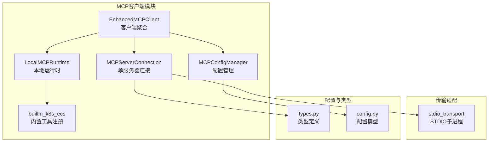
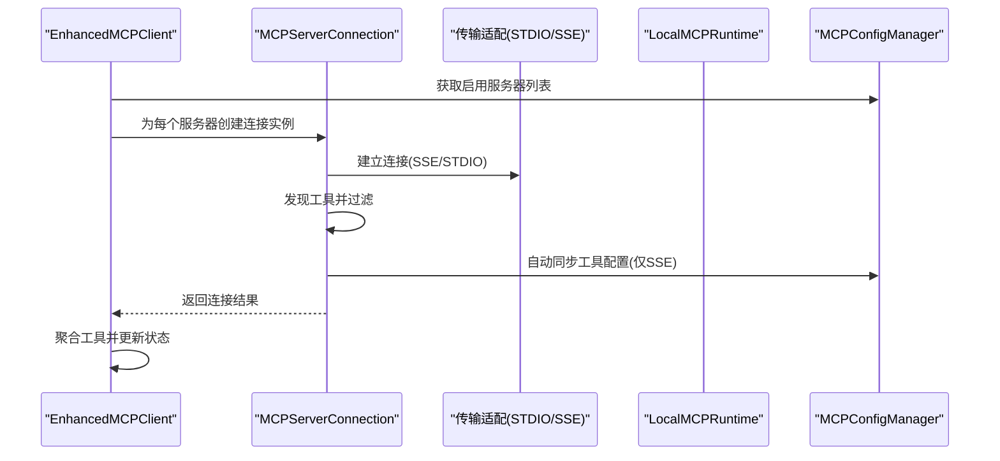
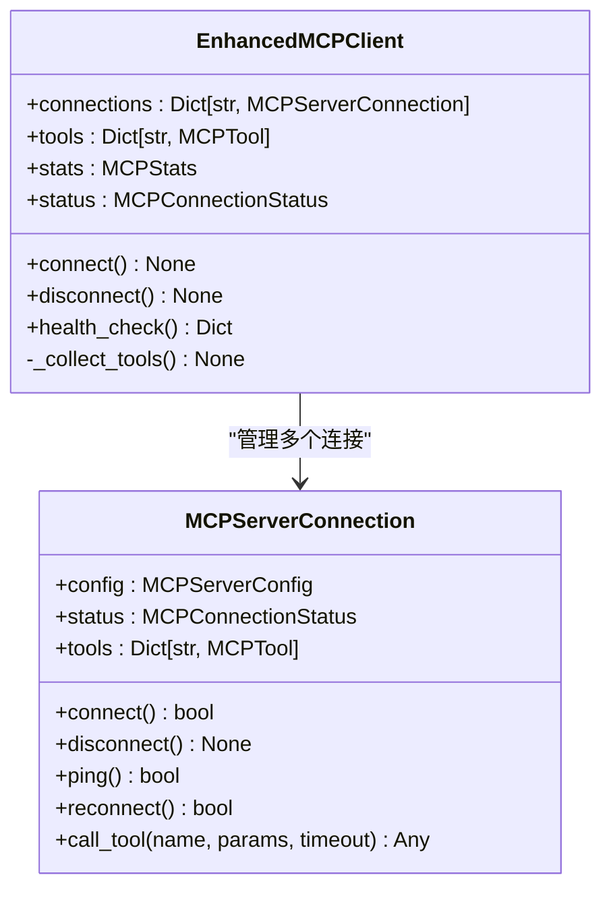
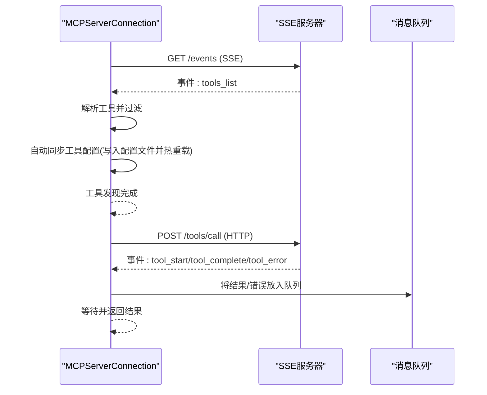
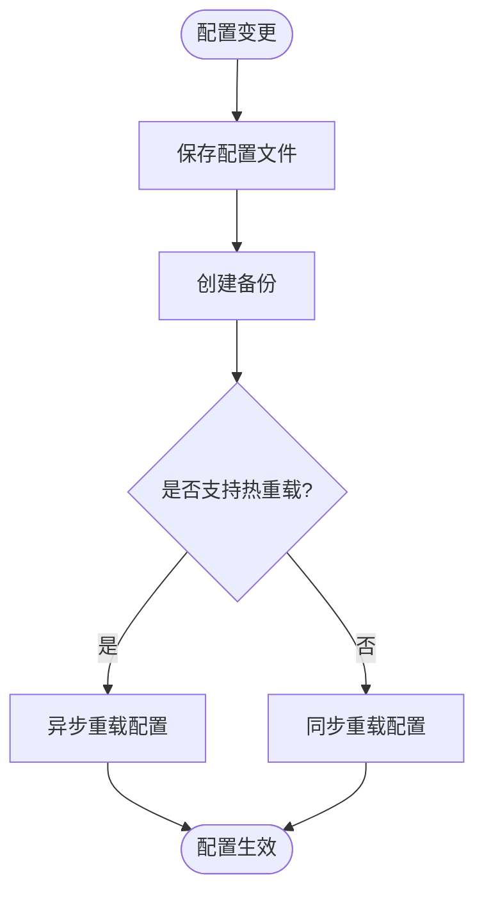
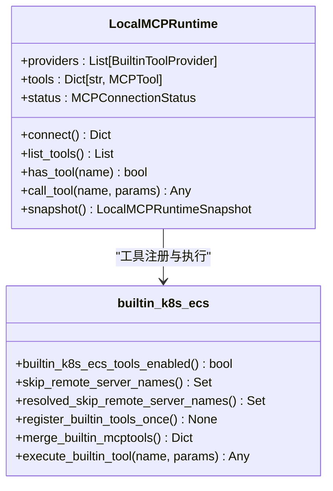
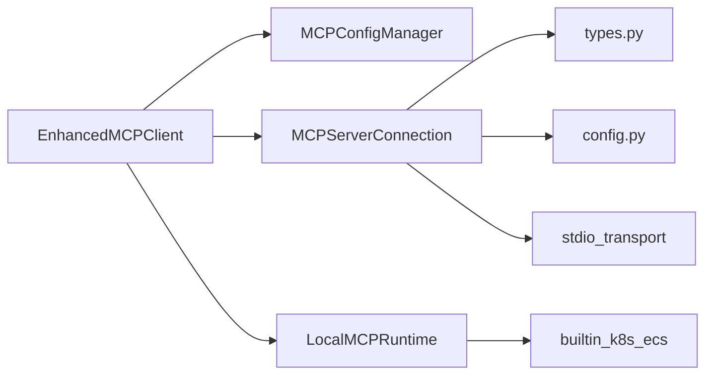

# MCP客户端管理

<cite>
**本文档引用的文件**
- [enhanced_client.py](file://backend/src/mcp/enhanced_client.py)
- [config_manager.py](file://backend/src/mcp/config_manager.py)
- [stdio_transport.py](file://backend/src/mcp/stdio_transport.py)
- [types.py](file://backend/src/mcp/types.py)
- [runtime.py](file://backend/src/mcp/runtime.py)
- [config.py](file://backend/src/mcp/config.py)
- [builtin_k8s_ecs.py](file://backend/src/mcp/builtin_k8s_ecs.py)
- [mcp_config.example.json](file://config/mcp_config.example.json)
</cite>

## 目录
1. [简介](#简介)
2. [项目结构](#项目结构)
3. [核心组件](#核心组件)
4. [架构总览](#架构总览)
5. [详细组件分析](#详细组件分析)
6. [依赖关系分析](#依赖关系分析)
7. [性能考量](#性能考量)
8. [故障排除指南](#故障排除指南)
9. [结论](#结论)
10. [附录](#附录)

## 简介
本文件面向MCP客户端管理系统，系统性梳理EnhancedMCPClient的整体架构设计，重点覆盖：
- 多服务器连接池管理与并发连接策略
- 连接状态监控与心跳检测机制
- 自动重连与错误恢复策略
- MCPServerConnection类的实现细节（SSE与STDIO两种传输协议）
- 配置管理器的集成机制（动态配置更新、热重载、配置文件同步）
- 客户端初始化流程、连接生命周期管理与资源清理最佳实践
- 具体代码示例路径与故障排除指南

## 项目结构
MCP客户端相关代码主要位于后端的`backend/src/mcp/`目录下，核心文件包括：
- 客户端与连接管理：enhanced_client.py
- 配置管理：config.py、config_manager.py
- 传输适配：stdio_transport.py
- 运行时与内置工具：runtime.py、builtin_k8s_ecs.py
- 类型定义：types.py
- 示例配置：config/mcp_config.example.json

**图表来源**
- [enhanced_client.py](file://backend/src/mcp/enhanced_client.py)
- [config_manager.py](file://backend/src/mcp/config_manager.py)
- [stdio_transport.py](file://backend/src/mcp/stdio_transport.py)
- [types.py](file://backend/src/mcp/types.py)
- [runtime.py](file://backend/src/mcp/runtime.py)
- [config.py](file://backend/src/mcp/config.py)
- [builtin_k8s_ecs.py](file://backend/src/mcp/builtin_k8s_ecs.py)

**章节来源**
- [enhanced_client.py](file://backend/src/mcp/enhanced_client.py)
- [config_manager.py](file://backend/src/mcp/config_manager.py)
- [config.py](file://backend/src/mcp/config.py)

## 核心组件
- EnhancedMCPClient：负责管理多个MCPServerConnection，聚合工具，执行健康检查与统计。
- MCPServerConnection：封装单个MCP服务器的连接、工具发现、SSE/STDIO传输、心跳与重连。
- MCPConfigManager：统一加载、校验、备份、迁移、热重载配置，提供连接测试与模板管理。
- LocalMCPRuntime：进程内K8s/ECS工具注册与执行，支持builtin/local类型服务器。
- stdio_transport：STDIO子进程连接与工具发现的传输适配。
- 类型与配置：types.py与config.py定义了MCP连接状态、工具、客户端配置、服务器配置等。

**章节来源**
- [enhanced_client.py](file://backend/src/mcp/enhanced_client.py)
- [config_manager.py](file://backend/src/mcp/config_manager.py)
- [types.py](file://backend/src/mcp/types.py)
- [config.py](file://backend/src/mcp/config.py)
- [runtime.py](file://backend/src/mcp/runtime.py)
- [builtin_k8s_ecs.py](file://backend/src/mcp/builtin_k8s_ecs.py)
- [stdio_transport.py](file://backend/src/mcp/stdio_transport.py)

## 架构总览
系统采用“客户端聚合 + 多服务器连接 + 传输适配”的架构：
- 客户端聚合：EnhancedMCPClient并发连接多个服务器，收集工具并维护全局状态。
- 服务器连接：MCPServerConnection针对不同传输类型（SSE/STDIO/local）分别处理。
- 配置驱动：MCPConfigManager集中管理配置，支持热重载与自动同步工具配置。
- 内置工具：builtin/local类型通过LocalMCPRuntime在进程内注册工具，减少远程依赖。

**图表来源**
- [enhanced_client.py](file://backend/src/mcp/enhanced_client.py)
- [config_manager.py](file://backend/src/mcp/config_manager.py)
- [stdio_transport.py](file://backend/src/mcp/stdio_transport.py)

## 详细组件分析

### EnhancedMCPClient：多服务器连接池与聚合管理
- 并发连接：对启用的服务器并行发起连接，使用gather聚合结果，提升整体连接效率。
- 工具聚合：仅收集状态为已连接的服务器工具，并结合工具配置决定最终可用工具集。
- 健康检查：遍历各连接执行ping，汇总服务器健康状态、工具数量与最后心跳时间。
- 生命周期：支持断开连接、重连、统计更新等。

**图表来源**
- [enhanced_client.py](file://backend/src/mcp/enhanced_client.py)

**章节来源**
- [enhanced_client.py](file://backend/src/mcp/enhanced_client.py)

### MCPServerConnection：SSE与STDIO传输实现
- SSE连接：
  - 通过aiohttp发起GET请求监听SSE事件流，支持超时与指数退避重试。
  - 事件处理：connected、tools_list、tool_start、tool_complete、tool_error、heartbeat等。
  - 自动同步工具配置：解析tools_list事件后，自动更新配置文件并触发热重载。
  - 心跳检测：基于last_ping时间判断连接健康。
- STDIO连接：
  - 通过子进程启动远程MCP服务器，使用JSON-RPC协议进行工具发现与调用。
  - 传输适配独立于主客户端，便于扩展其他传输类型。
- 工具调用：
  - SSE模式下通过HTTP POST提交工具调用请求，随后通过SSE事件队列等待结果。
  - 参数类型校验与超时控制，确保调用稳定性。

**图表来源**
- [enhanced_client.py](file://backend/src/mcp/enhanced_client.py)

**章节来源**
- [enhanced_client.py](file://backend/src/mcp/enhanced_client.py)
- [stdio_transport.py](file://backend/src/mcp/stdio_transport.py)

### 配置管理器：动态配置更新与热重载
- 配置加载与迁移：统一路径config/mcp_config.json，支持从旧路径迁移并创建备份。
- 模板管理：内置Kubernetes SSE、SSH stdio、文件系统等模板，支持用户自定义模板。
- 验证与连接测试：对不同类型的服务器执行连接测试，返回状态码便于诊断。
- 热重载：保存配置后可触发异步/同步重载，确保运行时配置生效。
- 自动同步：SSE工具发现完成后自动更新配置文件并触发热重载。

**图表来源**
- [config_manager.py](file://backend/src/mcp/config_manager.py)

**章节来源**
- [config_manager.py](file://backend/src/mcp/config_manager.py)
- [config.py](file://backend/src/mcp/config.py)

### 内置工具与本地运行时
- LocalMCPRuntime：注册并执行进程内的K8s/ECS工具，支持快照与状态管理。
- builtin_k8s_ecs：根据环境变量与配置决定是否启用内置工具，支持跳过远程服务器名集合。
- 工具路由：根据工具名称前缀自动分配到对应服务器，或映射到逻辑builtin服务器。

**图表来源**
- [runtime.py](file://backend/src/mcp/runtime.py)
- [builtin_k8s_ecs.py](file://backend/src/mcp/builtin_k8s_ecs.py)

**章节来源**
- [runtime.py](file://backend/src/mcp/runtime.py)
- [builtin_k8s_ecs.py](file://backend/src/mcp/builtin_k8s_ecs.py)

## 依赖关系分析
- EnhancedMCPClient依赖MCPConfigManager获取服务器配置，依赖MCPServerConnection管理连接。
- MCPServerConnection依赖types.py中的MCPTool/MCPConnectionStatus等类型，依赖config.py中的MCPServerConfig/MCPToolConfig。
- stdio_transport与MCPServerConnection解耦，便于扩展其他传输类型。
- LocalMCPRuntime与builtin_k8s_ecs配合，实现builtin/local类型服务器的工具注册与执行。

**图表来源**
- [enhanced_client.py](file://backend/src/mcp/enhanced_client.py)
- [config_manager.py](file://backend/src/mcp/config_manager.py)
- [types.py](file://backend/src/mcp/types.py)
- [config.py](file://backend/src/mcp/config.py)
- [stdio_transport.py](file://backend/src/mcp/stdio_transport.py)
- [runtime.py](file://backend/src/mcp/runtime.py)
- [builtin_k8s_ecs.py](file://backend/src/mcp/builtin_k8s_ecs.py)

**章节来源**
- [enhanced_client.py](file://backend/src/mcp/enhanced_client.py)
- [config_manager.py](file://backend/src/mcp/config_manager.py)
- [types.py](file://backend/src/mcp/types.py)
- [config.py](file://backend/src/mcp/config.py)
- [stdio_transport.py](file://backend/src/mcp/stdio_transport.py)
- [runtime.py](file://backend/src/mcp/runtime.py)
- [builtin_k8s_ecs.py](file://backend/src/mcp/builtin_k8s_ecs.py)

## 性能考量
- 并发连接：EnhancedMCPClient对启用服务器并行连接，缩短整体连接时间。
- SSE事件处理：使用异步事件流与队列机制，避免阻塞主线程。
- 超时与重试：SSE连接采用指数退避重试，降低网络抖动影响。
- 内置工具：builtin/local类型减少远程通信开销，提升工具调用性能。
- 缓存与统计：MCPClientConfig支持缓存与统计，有助于优化重复调用。

[本节为通用性能讨论，不直接分析具体文件]

## 故障排除指南
- 连接失败排查
  - 检查服务器类型与配置：WebSocket/HTTP/SSE/STDIO的URI与端口是否正确。
  - 使用MCPConfigManager.validate_config与_test_server_connection进行连接测试。
  - 查看SSE连接状态与事件流，确认tools_list事件是否到达。
- SSE工具调用失败
  - 确认HTTP POST请求成功且SSE事件队列中有tool_complete或tool_error事件。
  - 检查参数类型与超时设置，确保参数为字典类型且超时合理。
- 配置热重载问题
  - 确认配置文件保存后触发reload_config_async或reload_config。
  - 检查备份目录与最近备份文件，必要时进行恢复。
- 内置工具不可用
  - 检查环境变量BUILTIN_K8S_ECS_TOOLS与skip_remote_server_names配置。
  - 确认LocalMCPRuntime已注册并处于CONNECTED状态。

**章节来源**
- [config_manager.py](file://backend/src/mcp/config_manager.py)
- [enhanced_client.py](file://backend/src/mcp/enhanced_client.py)

## 结论
本系统通过EnhancedMCPClient实现多服务器连接池管理，结合MCPServerConnection对SSE/STDIO等传输协议的支持，以及MCPConfigManager的动态配置与热重载能力，形成了稳定、可扩展的MCP客户端管理方案。内置工具与本地运行时进一步降低了远程依赖，提升了整体性能与可靠性。建议在生产环境中：
- 合理设置超时与重试参数，平衡稳定性与性能。
- 使用配置模板与自动同步工具配置，减少手工维护成本。
- 定期进行健康检查与备份，确保系统可观测与可恢复。

[本节为总结性内容，不直接分析具体文件]

## 附录

### 客户端初始化流程与最佳实践
- 初始化顺序
  - 获取全局MCPConfigManager实例。
  - 创建EnhancedMCPClient并设置配置管理器。
  - 调用connect()并发连接所有启用的服务器。
  - 收集工具并更新状态。
- 生命周期管理
  - 在应用启动时初始化，在应用关闭时调用disconnect()清理资源。
  - 定期执行health_check()监控连接健康。
- 资源清理
  - 断开连接时取消SSE任务、关闭HTTP会话、终止STDIO子进程。
  - 清理消息队列与活跃工具调用记录，防止内存泄漏。

**章节来源**
- [enhanced_client.py](file://backend/src/mcp/enhanced_client.py)
- [config_manager.py](file://backend/src/mcp/config_manager.py)

### 配置文件示例与字段说明
- 示例配置文件位置：config/mcp_config.example.json
- 关键字段
  - global_config：全局超时、重试次数、并发限制、缓存开关等。
  - servers：服务器列表，包含name、type、enabled、host/port/path、timeout、retry_attempts、enabled_tools等。
  - tools：工具配置列表，包含name、description、category、enabled、server_name、input_schema等。
  - tool_routing：工具路由规则，支持按前缀自动分配服务器。
  - security/logging：安全审计与日志级别配置。

**章节来源**
- [mcp_config.example.json](file://config/mcp_config.example.json)
- [config.py](file://backend/src/mcp/config.py)