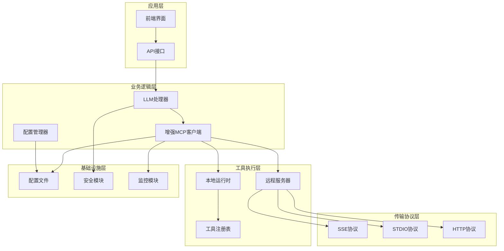
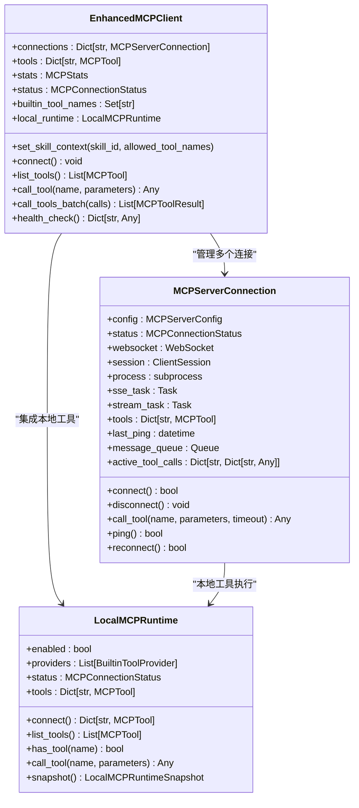
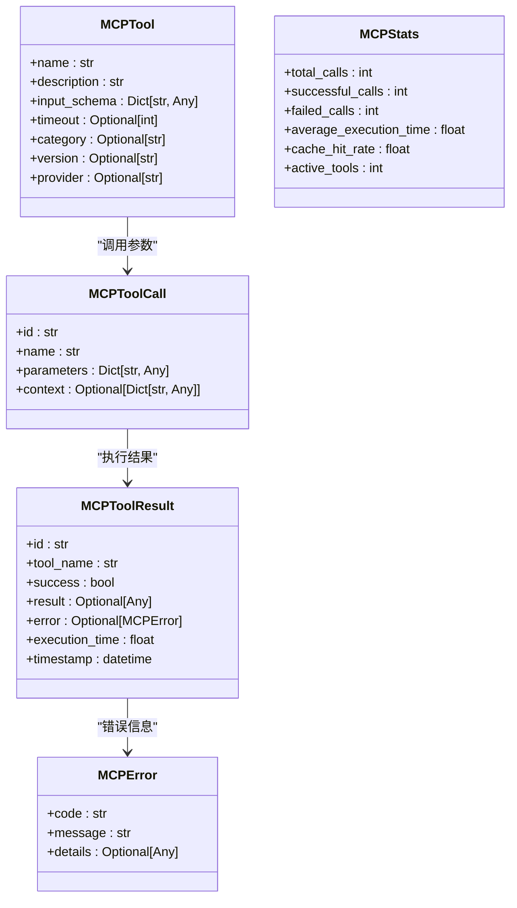
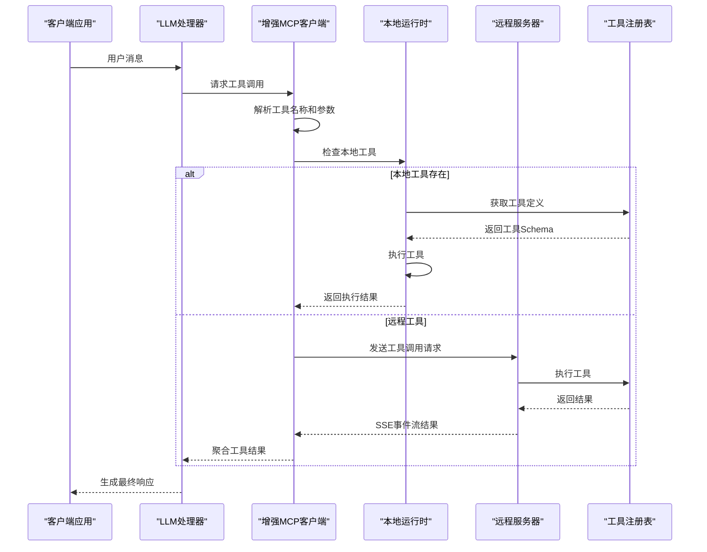
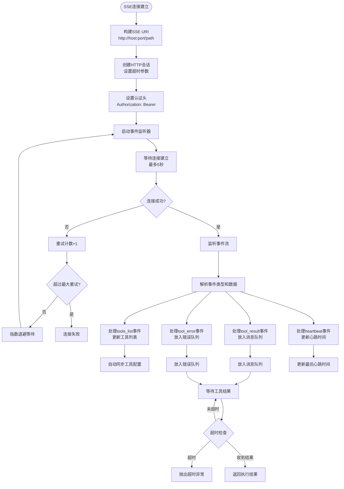
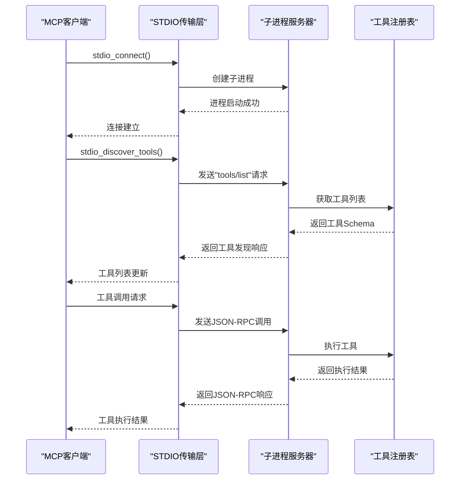
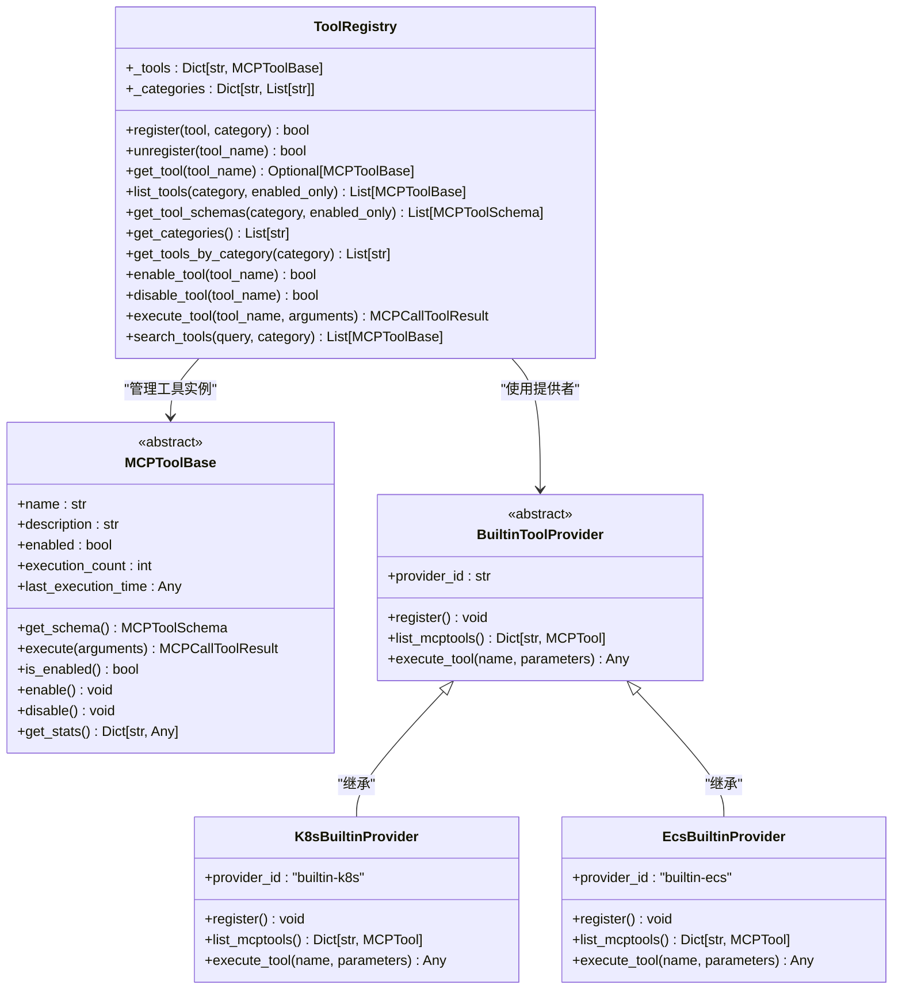
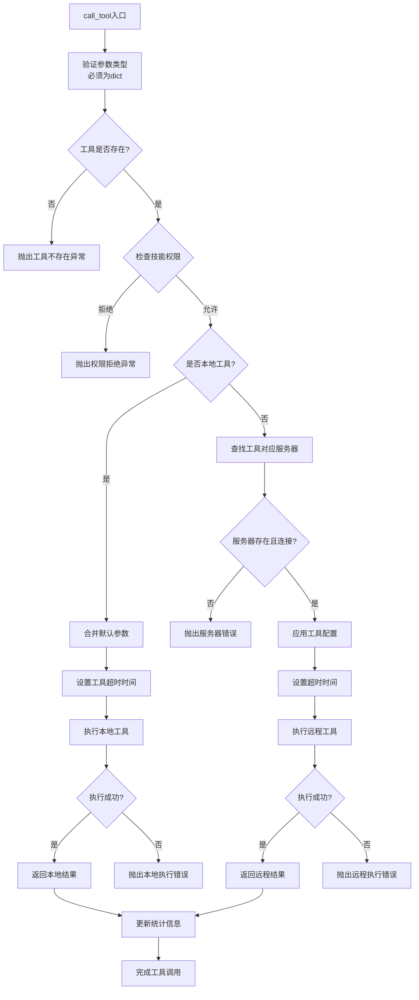
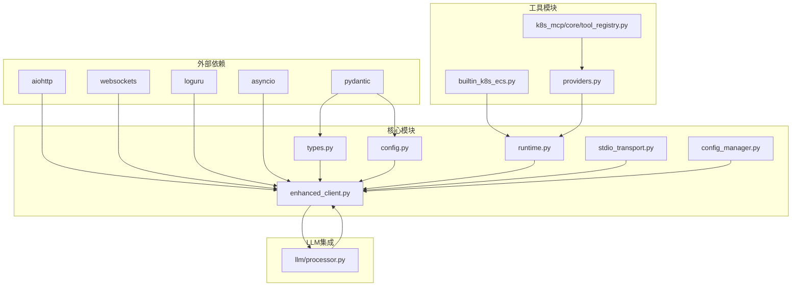

# MCP工具系统

<cite>
**本文档引用的文件**
- [enhanced_client.py](file://backend/src/mcp/enhanced_client.py)
- [types.py](file://backend/src/mcp/types.py)
- [stdio_transport.py](file://backend/src/mcp/stdio_transport.py)
- [runtime.py](file://backend/src/mcp/runtime.py)
- [config.py](file://backend/src/mcp/config.py)
- [config_manager.py](file://backend/src/mcp/config_manager.py)
- [builtin_k8s_ecs.py](file://backend/src/mcp/builtin_k8s_ecs.py)
- [providers.py](file://backend/src/mcp/builtin/providers.py)
- [tool_registry.py](file://backend/src/k8s_mcp/core/tool_registry.py)
- [processor.py](file://backend/src/llm/processor.py)
</cite>

## 目录
1. [简介](#简介)
2. [项目结构](#项目结构)
3. [核心组件](#核心组件)
4. [架构概览](#架构概览)
5. [详细组件分析](#详细组件分析)
6. [依赖关系分析](#依赖关系分析)
7. [性能考虑](#性能考虑)
8. [故障排除指南](#故障排除指南)
9. [结论](#结论)
10. [附录](#附录)

## 简介

MCP工具系统是一个基于Model Context Protocol (MCP) 的智能化工具调用平台，专为Kubernetes和ECS云资源管理而设计。该系统提供了统一的工具发现、注册、路由和执行机制，支持多种传输协议（SSE和STDIO），并集成了LLM处理器以实现智能的工具选择和结果处理。

系统的核心特性包括：
- 多服务器连接管理：支持同时连接多个MCP服务器
- 智能工具路由：基于工具名称和配置的自动路由机制
- 动态负载均衡：通过连接池和并发控制实现负载均衡
- 工具生命周期管理：从发现到执行再到结果聚合的完整流程
- 安全的权限控制：基于技能（Skill）的工具访问控制
- 高性能的本地执行：内置K8s/ECS工具的本地执行能力

## 项目结构

MCP工具系统采用模块化架构设计，主要分为以下几个核心层次：

**图表来源**
- [enhanced_client.py:942-1519](file://backend/src/mcp/enhanced_client.py#L942-L1519)
- [config_manager.py:41-800](file://backend/src/mcp/config_manager.py#L41-L800)

**章节来源**
- [enhanced_client.py:1-1519](file://backend/src/mcp/enhanced_client.py#L1-L1519)
- [config_manager.py:1-948](file://backend/src/mcp/config_manager.py#L1-L948)

## 核心组件

### 增强MCP客户端

增强MCP客户端是整个系统的核心组件，负责管理多个MCP服务器的连接、工具发现、路由和执行。

**图表来源**
- [enhanced_client.py:942-1519](file://backend/src/mcp/enhanced_client.py#L942-L1519)
- [runtime.py:31-119](file://backend/src/mcp/runtime.py#L31-L119)

### 工具类型系统

系统定义了完整的工具类型体系，确保工具调用的一致性和安全性。

**图表来源**
- [types.py:19-186](file://backend/src/mcp/types.py#L19-L186)

**章节来源**
- [enhanced_client.py:942-1519](file://backend/src/mcp/enhanced_client.py#L942-L1519)
- [types.py:1-186](file://backend/src/mcp/types.py#L1-L186)

## 架构概览

MCP工具系统采用分层架构设计，实现了高度的模块化和可扩展性：

**图表来源**
- [processor.py:520-757](file://backend/src/llm/processor.py#L520-L757)
- [enhanced_client.py:1178-1291](file://backend/src/mcp/enhanced_client.py#L1178-L1291)

系统架构的关键特点：

1. **双路径执行模式**：支持本地工具（内置K8s/ECS工具）和远程工具两种执行路径
2. **智能路由机制**：根据工具名称和配置自动选择最优执行路径
3. **统一结果处理**：无论工具在何处执行，都返回标准化的结果格式
4. **安全的权限控制**：通过技能（Skill）系统实现细粒度的工具访问控制

## 详细组件分析

### SSE传输协议实现

SSE（Server-Sent Events）协议是系统的主要传输方式，提供了高效的双向通信能力。

**图表来源**
- [enhanced_client.py:114-320](file://backend/src/mcp/enhanced_client.py#L114-L320)
- [enhanced_client.py:506-522](file://backend/src/mcp/enhanced_client.py#L506-L522)

SSE协议的关键特性：

1. **连接管理**：支持自动重连和指数退避机制
2. **事件处理**：专门的事件解析和处理逻辑
3. **工具发现**：通过tools_list事件动态发现工具
4. **结果聚合**：通过消息队列实现异步结果收集

**章节来源**
- [enhanced_client.py:114-320](file://backend/src/mcp/enhanced_client.py#L114-L320)
- [enhanced_client.py:506-522](file://backend/src/mcp/enhanced_client.py#L506-L522)

### STDIO传输协议实现

STDIO协议用于与本地子进程进行通信，特别适用于需要直接访问系统资源的场景。

**图表来源**
- [stdio_transport.py:17-91](file://backend/src/mcp/stdio_transport.py#L17-L91)

STDIO协议的特点：

1. **进程管理**：完整的子进程生命周期管理
2. **JSON-RPC通信**：标准化的进程间通信协议
3. **工具发现**：通过tools/list方法动态发现工具
4. **错误处理**：完善的异常捕获和错误传播机制

**章节来源**
- [stdio_transport.py:1-91](file://backend/src/mcp/stdio_transport.py#L1-L91)

### 工具注册中心设计

工具注册中心是系统的核心管理组件，负责工具的发现、注册、分类和权限控制。

**图表来源**
- [tool_registry.py:75-401](file://backend/src/k8s_mcp/core/tool_registry.py#L75-L401)
- [providers.py:53-171](file://backend/src/mcp/builtin/providers.py#L53-L171)

工具注册中心的关键功能：

1. **工具生命周期管理**：从注册到执行再到统计的完整生命周期
2. **分类管理**：支持工具的分类组织和查询
3. **权限控制**：通过技能（Skill）系统实现细粒度的访问控制
4. **批量操作**：支持批量注册、启用、禁用等操作
5. **搜索功能**：提供全文搜索和分类筛选功能

**章节来源**
- [tool_registry.py:1-401](file://backend/src/k8s_mcp/core/tool_registry.py#L1-L401)
- [providers.py:1-171](file://backend/src/mcp/builtin/providers.py#L1-L171)

### 工具调用生命周期管理

系统实现了完整的工具调用生命周期管理，从参数解析到结果聚合的全过程控制。

**图表来源**
- [enhanced_client.py:1178-1291](file://backend/src/mcp/enhanced_client.py#L1178-L1291)

工具调用生命周期的关键特性：

1. **参数验证**：严格的参数类型检查和验证
2. **权限控制**：基于技能（Skill）的工具访问控制
3. **超时管理**：灵活的超时配置和控制机制
4. **错误处理**：完整的异常捕获和错误传播
5. **统计监控**：实时的执行统计和性能监控

**章节来源**
- [enhanced_client.py:1178-1291](file://backend/src/mcp/enhanced_client.py#L1178-L1291)

## 依赖关系分析

系统采用清晰的依赖关系设计，确保模块间的松耦合和高内聚：

**图表来源**
- [enhanced_client.py:6-31](file://backend/src/mcp/enhanced_client.py#L6-L31)
- [types.py:5-8](file://backend/src/mcp/types.py#L5-L8)

**章节来源**
- [enhanced_client.py:6-31](file://backend/src/mcp/enhanced_client.py#L6-L31)
- [types.py:5-8](file://backend/src/mcp/types.py#L5-L8)

## 性能考虑

系统在设计时充分考虑了性能优化，采用了多种技术和策略：

### 连接池和并发控制

1. **异步I/O**：全面使用asyncio实现非阻塞I/O操作
2. **连接复用**：SSE连接支持长时间保持和事件流处理
3. **并发限制**：通过配置管理器控制最大并发调用数
4. **资源清理**：完善的连接清理和资源回收机制

### 缓存策略

1. **工具配置缓存**：自动同步的工具配置缓存
2. **执行结果缓存**：可配置的工具执行结果缓存
3. **连接状态缓存**：服务器连接状态的快速检查
4. **统计信息缓存**：性能统计数据的实时更新

### 优化建议

1. **连接池配置**：根据服务器性能调整连接池大小
2. **超时参数优化**：针对不同类型工具设置合适的超时时间
3. **批量处理**：对于相似工具调用使用批量处理机制
4. **监控指标**：定期检查系统性能指标并进行调优

## 故障排除指南

### 常见问题及解决方案

#### 连接问题

**问题**：SSE连接失败
- 检查服务器地址和端口配置
- 验证网络连通性和防火墙设置
- 查看认证配置是否正确
- 检查服务器日志获取详细错误信息

**问题**：STDIO进程启动失败
- 确认子进程命令和参数正确
- 检查工作目录和环境变量设置
- 验证进程权限和依赖库
- 查看进程标准错误输出

#### 工具执行问题

**问题**：工具调用超时
- 检查工具本身的执行时间
- 调整工具超时配置
- 优化工具执行逻辑
- 考虑使用异步执行方式

**问题**：工具结果格式错误
- 验证工具返回的数据格式
- 检查工具Schema定义
- 确认数据类型转换逻辑
- 查看工具执行日志

#### 配置问题

**问题**：工具配置不生效
- 检查配置文件格式和语法
- 验证配置项的有效性
- 确认配置文件的加载顺序
- 查看配置验证结果

**章节来源**
- [enhanced_client.py:89-94](file://backend/src/mcp/enhanced_client.py#L89-L94)
- [config_manager.py:486-551](file://backend/src/mcp/config_manager.py#L486-L551)

## 结论

MCP工具系统通过其精心设计的架构和实现，为Kubernetes和ECS云资源管理提供了一个强大、灵活且高性能的工具调用平台。系统的主要优势包括：

1. **模块化设计**：清晰的分层架构和职责分离
2. **多协议支持**：灵活的传输协议选择和适配
3. **智能路由**：基于配置的自动工具路由机制
4. **安全控制**：细粒度的权限控制和审计功能
5. **性能优化**：全面的性能优化和监控机制

系统在实际应用中展现了良好的稳定性和扩展性，能够满足复杂的企业级应用场景需求。通过持续的优化和改进，MCP工具系统将继续为用户提供更好的工具管理和执行体验。

## 附录

### 配置示例

系统支持多种配置方式，包括JSON配置文件、环境变量和动态配置管理。

### 开发指南

1. **工具开发**：遵循MCP协议规范开发新的工具
2. **集成测试**：使用提供的测试框架进行工具集成测试
3. **性能测试**：通过基准测试评估工具性能
4. **安全审计**：定期进行安全审计和漏洞扫描

### 最佳实践

1. **工具命名**：使用清晰、一致的工具命名约定
2. **参数验证**：实现严格的参数验证和错误处理
3. **日志记录**：提供详细的日志记录和调试信息
4. **文档编写**：为每个工具编写完整的使用文档
5. **版本管理**：实施严格的版本控制和变更管理