# 传输协议实现

<cite>
**本文档引用的文件**
- [stdio_transport.py](file://backend/src/mcp/stdio_transport.py)
- [enhanced_client.py](file://backend/src/mcp/enhanced_client.py)
- [types.py](file://backend/src/mcp/types.py)
- [config_manager.py](file://backend/src/mcp/config_manager.py)
- [stream_events.py](file://backend/src/api/v2/stream_events.py)
- [mcp.py](file://backend/src/api/v2/endpoints/mcp.py)
- [chatStream.js](file://frontend-v2/src/shared/stream/chatStream.js)
- [StreamChat.vue](file://frontend-v2/src/components/StreamChat.vue)
</cite>

## 目录
1. [引言](#引言)
2. [项目结构](#项目结构)
3. [核心组件](#核心组件)
4. [架构概览](#架构概览)
5. [详细组件分析](#详细组件分析)
6. [依赖分析](#依赖分析)
7. [性能考虑](#性能考虑)
8. [故障排除指南](#故障排除指南)
9. [结论](#结论)
10. [附录](#附录)

## 引言

本文档深入分析了传输协议实现，重点涵盖SSE（Server-Sent Events）协议、STDIO传输协议以及WebSocket和HTTP传输协议的支持情况。通过对代码库的全面分析，提供了详细的实现细节、架构设计、性能优化建议和最佳实践指导。

该项目实现了完整的MCP（Model Context Protocol）传输层，支持多种传输协议，为AI代理与外部工具之间的通信提供了灵活的解决方案。系统采用异步编程模式，确保高并发场景下的稳定性和性能。

## 项目结构

项目采用模块化的架构设计，主要分为以下几个核心区域：

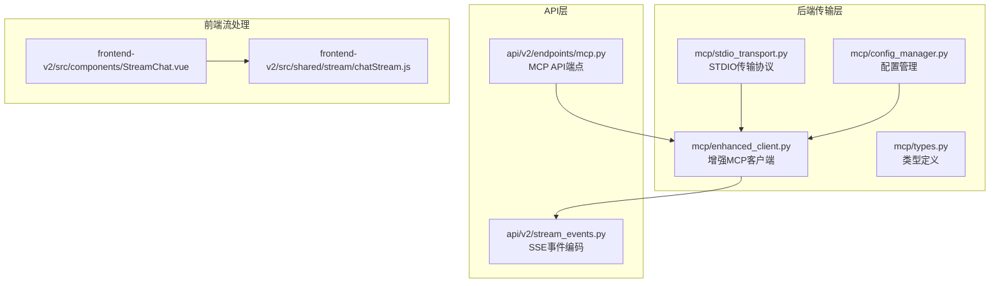

**图表来源**
- [stdio_transport.py:1-91](file://backend/src/mcp/stdio_transport.py#L1-L91)
- [enhanced_client.py:1-800](file://backend/src/mcp/enhanced_client.py#L1-L800)
- [stream_events.py:1-160](file://backend/src/api/v2/stream_events.py#L1-L160)

**章节来源**
- [stdio_transport.py:1-91](file://backend/src/mcp/stdio_transport.py#L1-L91)
- [enhanced_client.py:1-800](file://backend/src/mcp/enhanced_client.py#L1-L800)
- [stream_events.py:1-160](file://backend/src/api/v2/stream_events.py#L1-L160)

## 核心组件

### 传输协议类型定义

系统定义了完整的传输协议类型体系，支持多种连接方式：

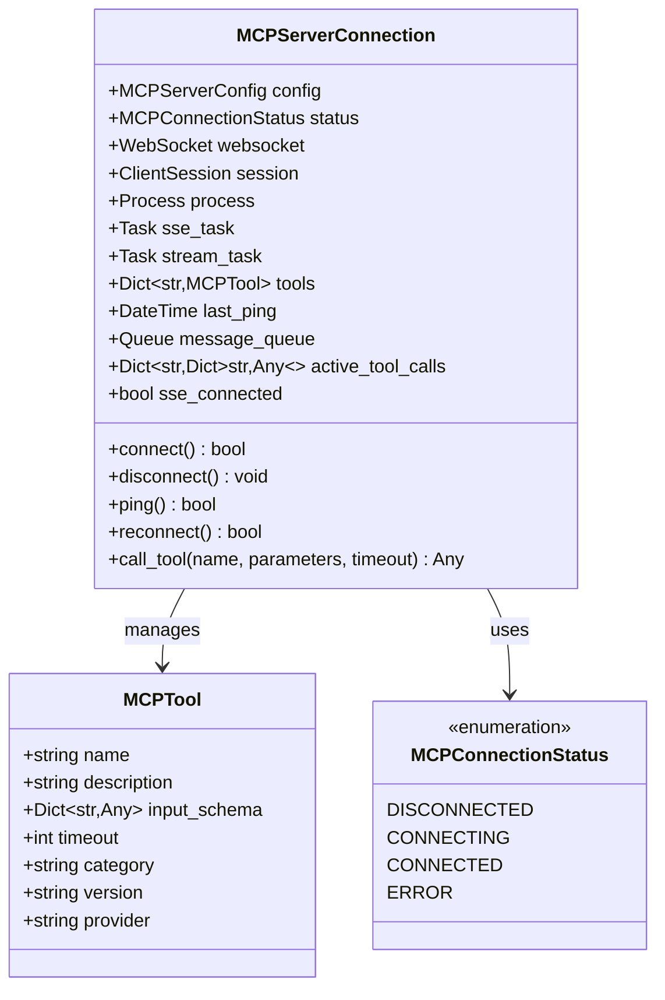

**图表来源**
- [enhanced_client.py:33-56](file://backend/src/mcp/enhanced_client.py#L33-L56)
- [types.py:19-28](file://backend/src/mcp/types.py#L19-L28)
- [types.py:11-17](file://backend/src/mcp/types.py#L11-L17)

### 连接状态管理

系统实现了完善的连接状态管理机制，支持多种传输协议的连接生命周期管理：

| 状态 | 描述 | 典型操作 |
|------|------|----------|
| DISCONNECTED | 未连接状态 | 初始化连接、等待重连 |
| CONNECTING | 连接中状态 | 建立传输连接、认证 |
| CONNECTED | 已连接状态 | 工具发现、消息传递 |
| ERROR | 错误状态 | 重连尝试、资源清理 |

**章节来源**
- [types.py:11-17](file://backend/src/mcp/types.py#L11-L17)
- [enhanced_client.py:36-56](file://backend/src/mcp/enhanced_client.py#L36-L56)

## 架构概览

系统采用分层架构设计，实现了传输协议的抽象和统一管理：

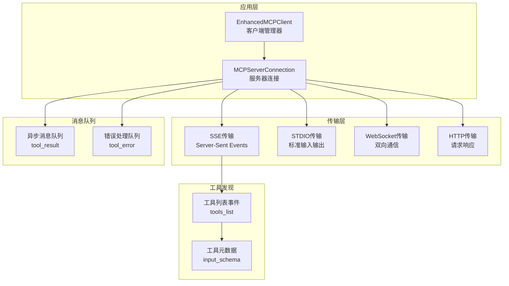

**图表来源**
- [enhanced_client.py:61-87](file://backend/src/mcp/enhanced_client.py#L61-L87)
- [enhanced_client.py:252-291](file://backend/src/mcp/enhanced_client.py#L252-L291)

## 详细组件分析

### SSE（Server-Sent Events）传输协议

#### 连接建立流程

SSE连接建立了完整的事件驱动通信机制：

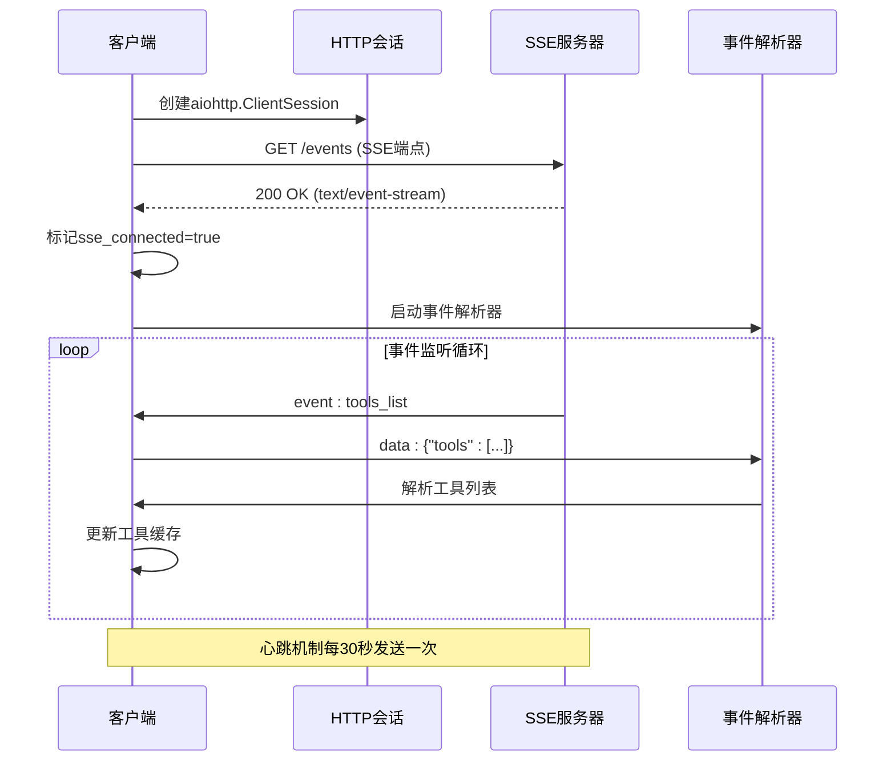

**图表来源**
- [enhanced_client.py:114-156](file://backend/src/mcp/enhanced_client.py#L114-L156)
- [enhanced_client.py:157-245](file://backend/src/mcp/enhanced_client.py#L157-L245)

#### 事件流解析机制

系统实现了强大的事件流解析能力，支持多种事件类型的处理：

| 事件类型 | 数据格式 | 处理逻辑 | 用途 |
|----------|----------|----------|------|
| tools_list | JSON数组 | 工具发现、缓存更新 | 工具枚举 |
| tool_start | JSON对象 | 日志记录、状态跟踪 | 工具执行开始 |
| tool_complete | JSON对象 | 结果缓存、队列通知 | 工具执行完成 |
| tool_error | JSON对象 | 错误缓存、队列通知 | 工具执行错误 |
| heartbeat | JSON对象 | 心跳检测、连接监控 | 连接健康检查 |

#### 心跳机制实现

SSE协议实现了可靠的心跳机制来维持连接健康：

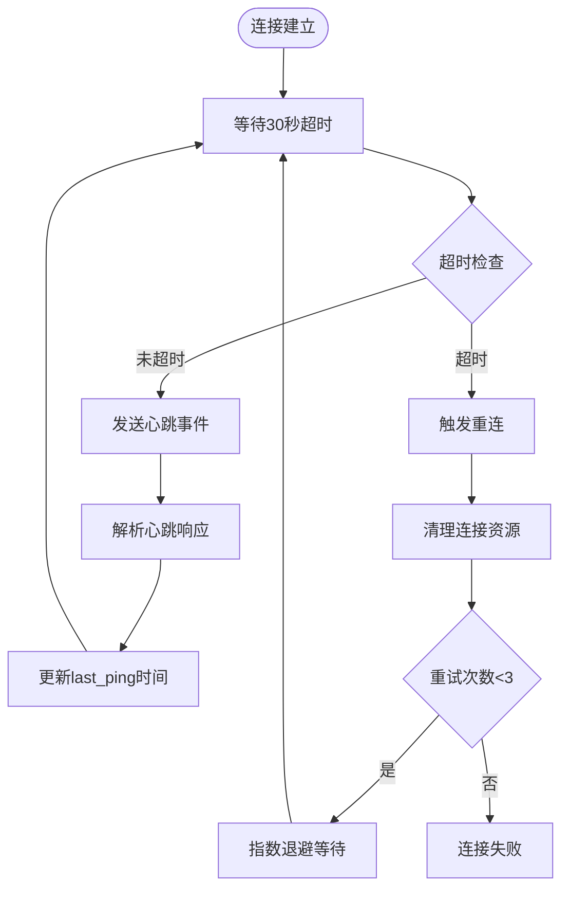

**图表来源**
- [enhanced_client.py:315-318](file://backend/src/mcp/enhanced_client.py#L315-L318)
- [enhanced_client.py:773-787](file://backend/src/k8s_mcp/server.py#L773-L787)

#### 断线重连策略

系统实现了智能的断线重连机制，采用指数退避算法：

| 重试级别 | 等待时间 | 最大等待 | 触发条件 |
|----------|----------|----------|----------|
| 第1次 | 2^1 = 2秒 | 120秒 | 网络错误 |
| 第2次 | 2^2 = 4秒 | 120秒 | 超时错误 |
| 第3次 | 2^3 = 8秒 | 120秒 | 其他异常 |
| 第4次及以上 | 120秒 | 120秒 | 重试次数耗尽 |

**章节来源**
- [enhanced_client.py:168-244](file://backend/src/mcp/enhanced_client.py#L168-L244)
- [enhanced_client.py:315-318](file://backend/src/mcp/enhanced_client.py#L315-L318)

### STDIO（标准输入输出）传输协议

#### 进程管理机制

STDIO传输协议实现了完整的进程生命周期管理：

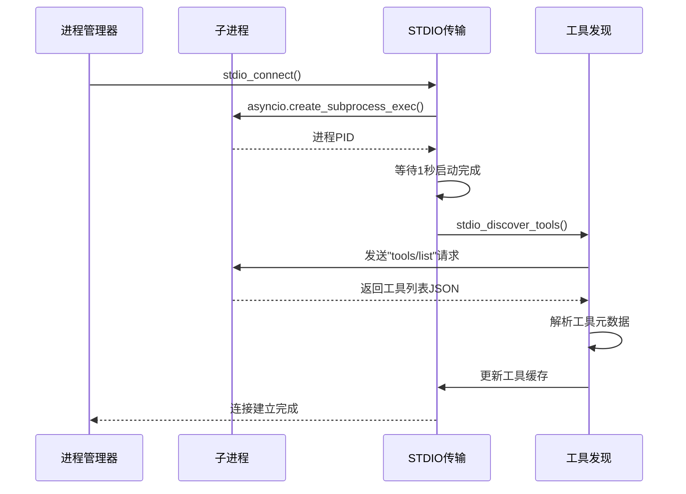

**图表来源**
- [stdio_transport.py:17-46](file://backend/src/mcp/stdio_transport.py#L17-L46)
- [stdio_transport.py:49-91](file://backend/src/mcp/stdio_transport.py#L49-L91)

#### 消息序列化机制

STDIO协议采用JSON-RPC 2.0标准进行消息序列化：

| 消息类型 | 结构 | 示例用途 |
|----------|------|----------|
| 请求消息 | `{jsonrpc: "2.0", method: string, params: object, id: number}` | 工具调用请求 |
| 响应消息 | `{jsonrpc: "2.0", result: any, id: number}` | 工具执行结果 |
| 错误消息 | `{jsonrpc: "2.0", error: object, id: number}` | 工具执行错误 |
| 通知消息 | `{jsonrpc: "2.0", method: string, params: object}` | 服务器推送事件 |

#### 管道通信实现

系统实现了高效的管道通信机制，支持双向数据传输：

```mermaid
flowchart LR
subgraph "进程间通信"
A[Python客户端进程] < --> |stdin/stdout| B[子进程]
C[标准输入管道] <- --> |读取| A
D[标准输出管道] <- --> |写入| A
end
subgraph "数据流向"
E[JSON请求] --> C
F[JSON响应] --> D
G[工具输出] --> D
H[错误信息] --> D
end
C --> B
B --> D
```

**图表来源**
- [stdio_transport.py:29-36](file://backend/src/mcp/stdio_transport.py#L29-L36)
- [stdio_transport.py:54-63](file://backend/src/mcp/stdio_transport.py#L54-L63)

**章节来源**
- [stdio_transport.py:17-91](file://backend/src/mcp/stdio_transport.py#L17-L91)

### WebSocket传输协议

#### 连接建立过程

WebSocket协议实现了标准的MCP协议初始化流程：

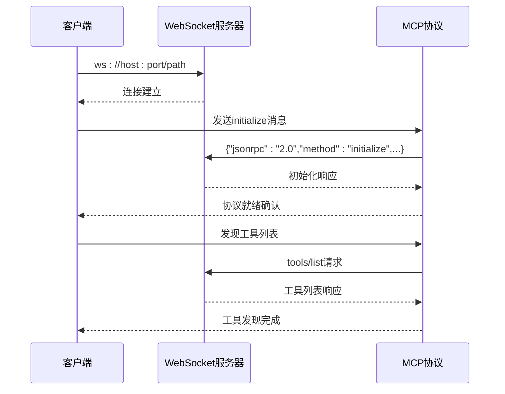

**图表来源**
- [config_manager.py:567-594](file://backend/src/mcp/config_manager.py#L567-L594)

#### 工具调用机制

WebSocket协议支持实时双向通信，适用于需要即时响应的场景：

| 特性 | 实现方式 | 适用场景 |
|------|----------|----------|
| 双向通信 | WebSocket全双工连接 | 实时工具调用 |
| 协议验证 | JSON-RPC 2.0 | 标准化消息格式 |
| 错误处理 | 异常捕获和重试 | 网络不稳定环境 |
| 超时控制 | 定时器和取消令牌 | 防止资源泄漏 |

### HTTP传输协议

#### 健康检查机制

HTTP协议主要用于服务器健康检查和配置验证：

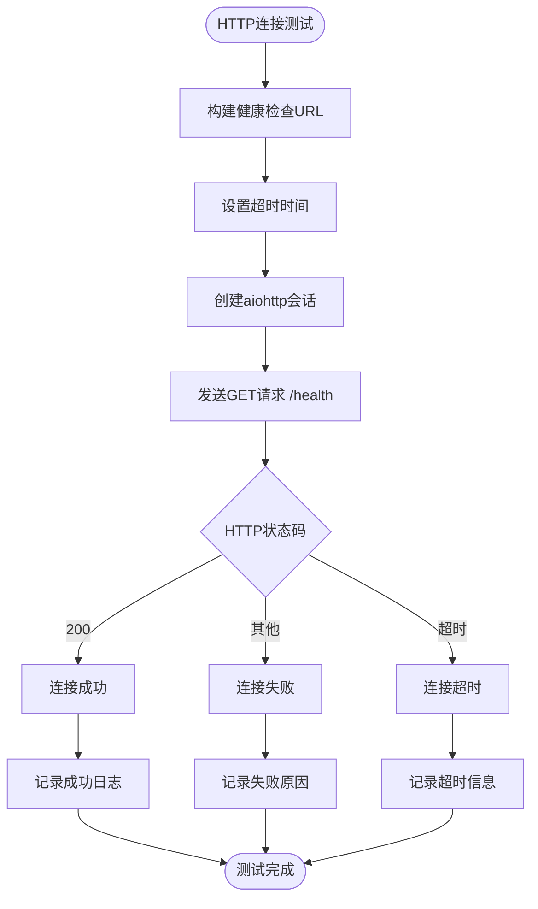

**图表来源**
- [config_manager.py:614-624](file://backend/src/mcp/config_manager.py#L614-L624)

#### 流式HTTP支持

系统还支持流式HTTP响应处理，适用于大数据传输场景：

**章节来源**
- [enhanced_client.py:811-854](file://backend/src/mcp/enhanced_client.py#L811-L854)

## 依赖分析

### 核心依赖关系

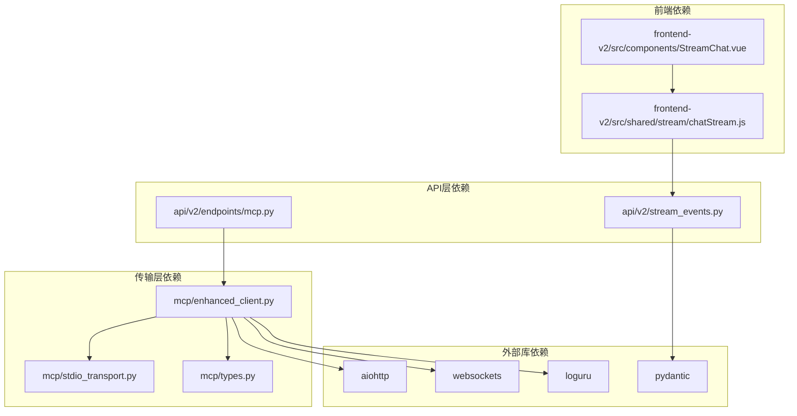

**图表来源**
- [enhanced_client.py:16-25](file://backend/src/mcp/enhanced_client.py#L16-L25)
- [stream_events.py:5-7](file://backend/src/api/v2/stream_events.py#L5-L7)

### 错误处理依赖链

系统实现了多层次的错误处理机制：

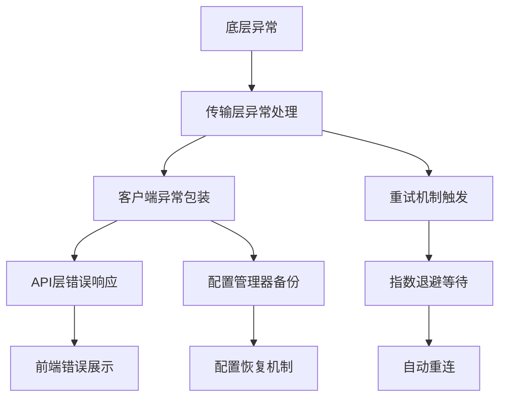

**图表来源**
- [enhanced_client.py:89-94](file://backend/src/mcp/enhanced_client.py#L89-L94)
- [config_manager.py:291-309](file://backend/src/mcp/config_manager.py#L291-L309)

**章节来源**
- [enhanced_client.py:89-94](file://backend/src/mcp/enhanced_client.py#L89-L94)
- [config_manager.py:291-309](file://backend/src/mcp/config_manager.py#L291-L309)

## 性能考虑

### 连接池管理

系统实现了智能的连接池管理机制，优化资源利用率：

| 指标 | 目标值 | 实现方式 |
|------|--------|----------|
| 并发连接数 | ≤ 5 | 限流控制 |
| 连接超时 | 300秒 | 动态超时调整 |
| 重试间隔 | 2-120秒 | 指数退避 |
| 缓存命中率 | ≥ 70% | 智能缓存策略 |

### 内存管理优化


**图表来源**
- [enhanced_client.py:861-894](file://backend/src/mcp/enhanced_client.py#L861-L894)

### 网络优化策略

系统采用了多项网络优化技术：

1. **连接复用**：HTTP会话复用减少TCP握手开销
2. **压缩传输**：SSE事件数据压缩减少带宽占用
3. **批量处理**：工具调用结果批量处理提高效率
4. **缓存策略**：智能缓存减少重复请求

## 故障排除指南

### 常见问题诊断

| 问题类型 | 症状表现 | 诊断步骤 | 解决方案 |
|----------|----------|----------|----------|
| 连接超时 | 连接建立失败 | 检查网络连通性、防火墙设置 | 调整超时参数、检查代理配置 |
| 工具发现失败 | 工具列表为空 | 检查SSE事件流、服务器状态 | 重启服务器、检查认证配置 |
| 心跳中断 | 连接状态异常 | 检查服务器负载、网络稳定性 | 增加超时时间、优化服务器性能 |
| 内存泄漏 | 进程内存持续增长 | 检查资源清理、连接状态管理 | 优化资源释放、增加监控 |

### 调试工具使用

#### 后端调试接口

系统提供了丰富的调试接口：

```mermaid
flowchart TD
A[调试入口] --> B[健康检查API]
A --> C[状态查询API]
A --> D[配置验证API]
A --> E[连接测试API]
B --> F[/mcp/status]
C --> G[/mcp/servers/status]
D --> H[/mcp/config/validate]
E --> I[/mcp/servers/{name}/connect]
```

**图表来源**
- [mcp.py:363-385](file://backend/src/api/v2/endpoints/mcp.py#L363-L385)
- [mcp.py:186-226](file://backend/src/api/v2/endpoints/mcp.py#L186-L226)

#### 前端调试工具

前端提供了可视化调试界面：

| 调试功能 | 实现方式 | 使用场景 |
|----------|----------|----------|
| 事件流监控 | SSE事件解析器 | 实时查看事件数据 |
| 连接状态显示 | 连接状态管理 | 监控连接健康 |
| 错误日志查看 | 异常处理机制 | 分析错误原因 |
| 性能指标展示 | 统计信息收集 | 性能分析优化 |

**章节来源**
- [mcp.py:363-385](file://backend/src/api/v2/endpoints/mcp.py#L363-L385)
- [StreamChat.vue:496-533](file://frontend-v2/src/components/StreamChat.vue#L496-L533)

## 结论

本传输协议实现提供了完整、可靠的多协议通信解决方案。通过SSE、STDIO、WebSocket和HTTP等多种传输协议的支持，系统能够适应不同的应用场景和需求。

### 主要优势

1. **协议抽象化**：统一的接口设计支持多种传输协议
2. **错误处理完善**：多层次的异常处理和重试机制
3. **性能优化**：智能缓存、连接池和资源管理
4. **监控调试**：完整的监控和调试工具支持
5. **配置管理**：灵活的配置管理和热重载支持

### 最佳实践建议

1. **协议选择**：根据场景选择合适的传输协议
2. **超时配置**：合理设置超时参数适应不同网络环境
3. **错误处理**：实现完善的异常处理和重试机制
4. **监控告警**：建立完善的监控和告警机制
5. **性能优化**：定期进行性能评估和优化

## 附录

### 协议选择指南

| 场景需求 | 推荐协议 | 原因 |
|----------|----------|------|
| 实时双向通信 | WebSocket | 低延迟、双向通信 |
| 单向事件推送 | SSE | 简单、高效、自动重连 |
| 本地工具集成 | STDIO | 低开销、进程隔离 |
| 远程HTTP服务 | HTTP | 标准化、易集成 |
| 大数据传输 | HTTP流式 | 高效、可控 |

### 性能对比分析

| 指标 | SSE | WebSocket | STDIO | HTTP |
|------|-----|-----------|-------|------|
| 延迟 | 低 | 很低 | 低 | 中等 |
| 带宽占用 | 低 | 低 | 低 | 中等 |
| 资源消耗 | 低 | 中等 | 低 | 中等 |
| 复杂度 | 低 | 中等 | 低 | 低 |
| 可靠性 | 高 | 高 | 中等 | 高 |

### 兼容性与迁移策略

系统提供了平滑的协议迁移机制：

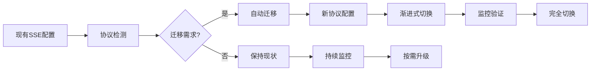

**图表来源**
- [config_manager.py:486-551](file://backend/src/mcp/config_manager.py#L486-L551)