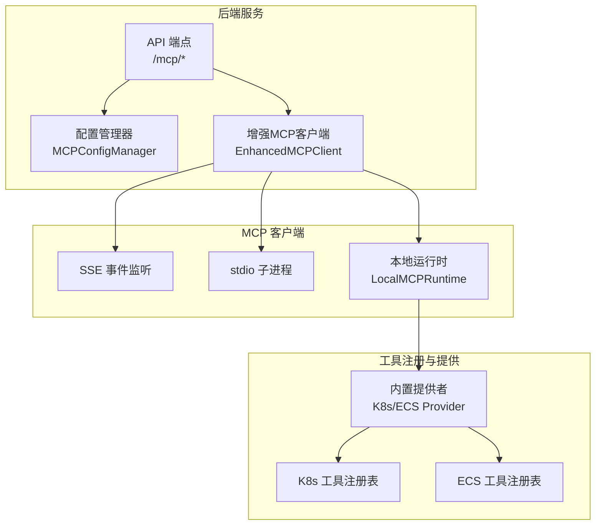
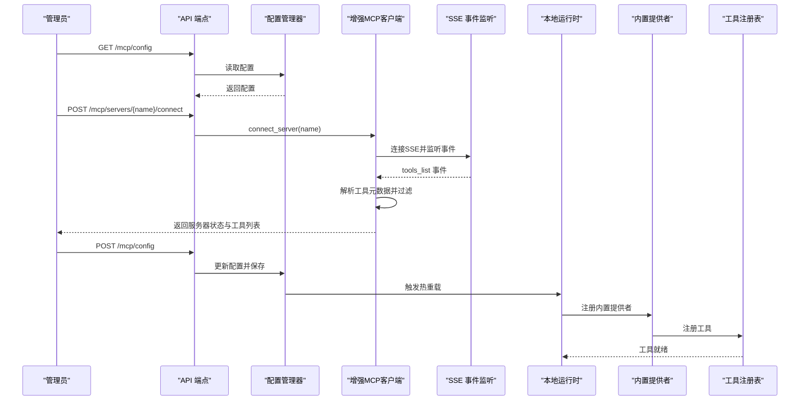
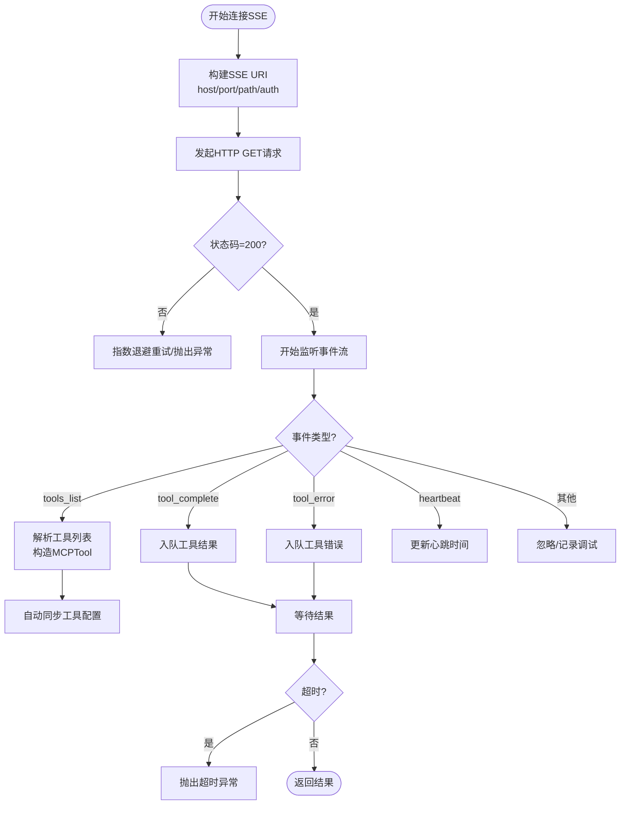
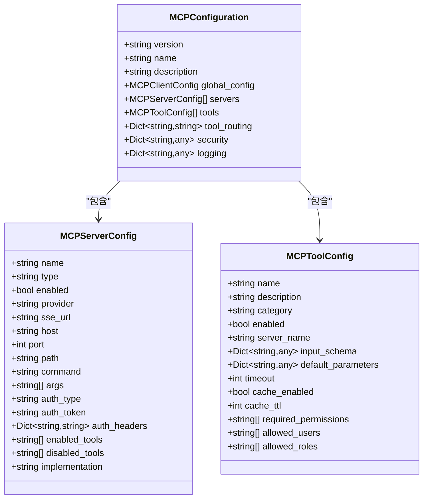
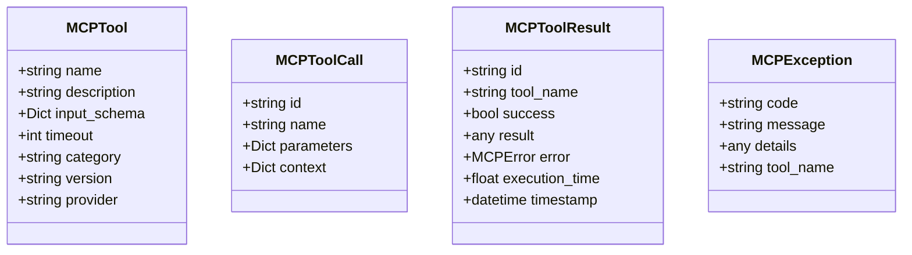
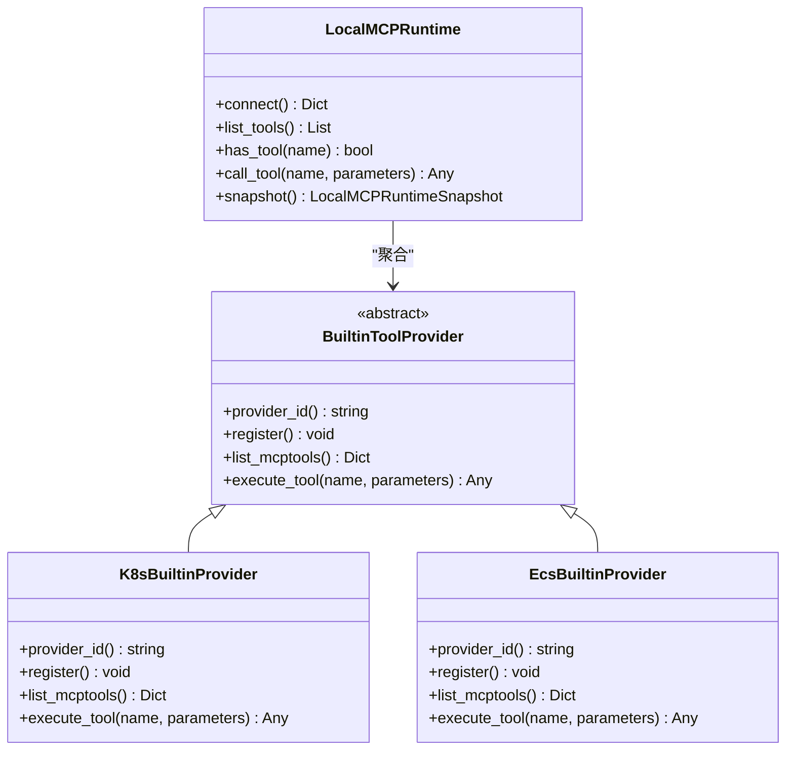
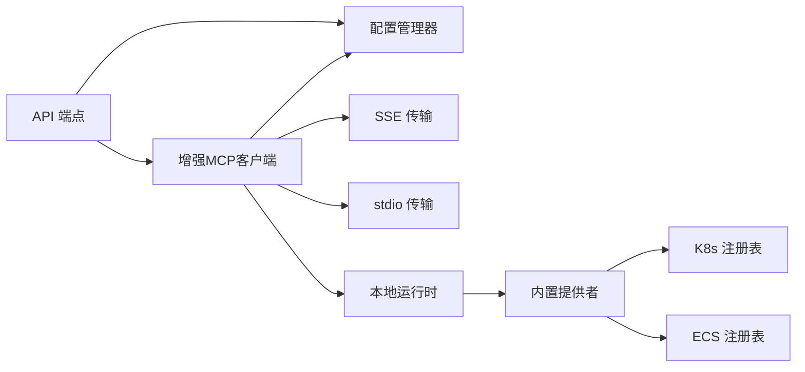

# 工具发现与注册

<cite>
**本文档引用的文件**
- [builtin_k8s_ecs.py](file://backend/src/mcp/builtin_k8s_ecs.py)
- [providers.py](file://backend/src/mcp/builtin/providers.py)
- [types.py](file://backend/src/mcp/types.py)
- [enhanced_client.py](file://backend/src/mcp/enhanced_client.py)
- [runtime.py](file://backend/src/mcp/runtime.py)
- [config.py](file://backend/src/mcp/config.py)
- [config_manager.py](file://backend/src/mcp/config_manager.py)
- [stdio_transport.py](file://backend/src/mcp/stdio_transport.py)
- [tool_registry.py (K8s)](file://backend/src/k8s_mcp/core/tool_registry.py)
- [tool_registry.py (ECS)](file://backend/src/ecs_mcp/core/tool_registry.py)
- [k8s_get_pods.py](file://backend/src/k8s_mcp/tools/k8s_get_pods.py)
- [ecs_list_instances.py](file://backend/src/ecs_mcp/tools/ecs_list_instances.py)
- [mcp.py](file://backend/src/api/v2/endpoints/mcp.py)
- [mcp_config.example.json](file://config/mcp_config.example.json)
</cite>

## 目录
1. [简介](#简介)
2. [项目结构](#项目结构)
3. [核心组件](#核心组件)
4. [架构总览](#架构总览)
5. [详细组件分析](#详细组件分析)
6. [依赖分析](#依赖分析)
7. [性能考量](#性能考量)
8. [故障排查指南](#故障排查指南)
9. [结论](#结论)
10. [附录](#附录)

## 简介
本项目实现了基于 Model Context Protocol (MCP) 的工具发现与注册系统，支持通过 SSE 事件流、本地进程内运行以及 stdio 子进程等多种传输方式接入外部 MCP 服务器。系统提供：
- 工具发现机制：SSE 事件监听、工具列表接收与元数据解析
- 工具注册中心：服务器与工具的配置管理、权限控制与版本兼容性检查
- MCPTool 数据模型：输入参数校验、输出格式标准化与错误处理
- 内置工具提供商：Kubernetes 与 ECS 工具的自动发现与配置
- 工具开发指南：注册流程与调试技巧
- 生命周期管理与性能优化建议

## 项目结构
系统采用“后端服务 + MCP 客户端 + 工具注册表 + 配置管理”的分层架构，核心模块如下：
- MCP 客户端与传输：EnhancedMCPClient、SSE/stdio 传输、本地运行时
- 工具注册与提供：K8s/ECS 工具注册表、内置提供者抽象与实现
- 配置与管理：MCP 配置模型、配置管理器、API 端点
- 工具实现：K8s/ECS 工具的具体实现与模式

图表来源
- [mcp.py:1-628](file://backend/src/api/v2/endpoints/mcp.py#L1-L628)
- [config_manager.py:1-948](file://backend/src/mcp/config_manager.py#L1-L948)
- [enhanced_client.py:1-800](file://backend/src/mcp/enhanced_client.py#L1-L800)
- [runtime.py:1-119](file://backend/src/mcp/runtime.py#L1-L119)
- [providers.py:1-171](file://backend/src/mcp/builtin/providers.py#L1-L171)
- [tool_registry.py (K8s):1-401](file://backend/src/k8s_mcp/core/tool_registry.py#L1-L401)
- [tool_registry.py (ECS):1-140](file://backend/src/ecs_mcp/core/tool_registry.py#L1-L140)

章节来源
- [mcp.py:1-628](file://backend/src/api/v2/endpoints/mcp.py#L1-L628)
- [config_manager.py:1-948](file://backend/src/mcp/config_manager.py#L1-L948)
- [enhanced_client.py:1-800](file://backend/src/mcp/enhanced_client.py#L1-L800)
- [runtime.py:1-119](file://backend/src/mcp/runtime.py#L1-L119)
- [providers.py:1-171](file://backend/src/mcp/builtin/providers.py#L1-L171)
- [tool_registry.py (K8s):1-401](file://backend/src/k8s_mcp/core/tool_registry.py#L1-L401)
- [tool_registry.py (ECS):1-140](file://backend/src/ecs_mcp/core/tool_registry.py#L1-L140)

## 核心组件
- MCPTool 数据模型：定义工具名称、描述、输入 Schema、超时、分类、版本、提供者等字段，统一工具元数据结构。
- EnhancedMCPClient：支持多服务器连接、SSE/stdio/stdout 传输、工具发现与调用、自动同步工具配置。
- LocalMCPRuntime：进程内工具运行时，聚合内置提供者（K8s/ECS），统一注册、列举与执行。
- MCPConfigManager：配置加载、校验、热重载、备份与恢复，提供模板与连接测试能力。
- 工具注册表：K8s/ECS 工具注册与执行入口，提供工具分类、启用/禁用、统计与批量注册。

章节来源
- [types.py:1-186](file://backend/src/mcp/types.py#L1-L186)
- [enhanced_client.py:1-800](file://backend/src/mcp/enhanced_client.py#L1-L800)
- [runtime.py:1-119](file://backend/src/mcp/runtime.py#L1-L119)
- [config_manager.py:1-948](file://backend/src/mcp/config_manager.py#L1-L948)
- [tool_registry.py (K8s):1-401](file://backend/src/k8s_mcp/core/tool_registry.py#L1-L401)
- [tool_registry.py (ECS):1-140](file://backend/src/ecs_mcp/core/tool_registry.py#L1-L140)

## 架构总览
系统通过 API 端点暴露 MCP 配置与状态管理，配置管理器负责加载与校验配置，增强客户端负责连接与工具发现，本地运行时负责进程内工具的注册与执行，工具注册表承载具体工具实现。

图表来源
- [mcp.py:1-628](file://backend/src/api/v2/endpoints/mcp.py#L1-L628)
- [config_manager.py:1-948](file://backend/src/mcp/config_manager.py#L1-L948)
- [enhanced_client.py:1-800](file://backend/src/mcp/enhanced_client.py#L1-L800)
- [runtime.py:1-119](file://backend/src/mcp/runtime.py#L1-L119)
- [providers.py:1-171](file://backend/src/mcp/builtin/providers.py#L1-L171)
- [tool_registry.py (K8s):1-401](file://backend/src/k8s_mcp/core/tool_registry.py#L1-L401)
- [tool_registry.py (ECS):1-140](file://backend/src/ecs_mcp/core/tool_registry.py#L1-L140)

## 详细组件分析

### 工具发现机制（SSE 事件监听、工具列表接收与元数据解析）
- SSE 连接：构建 URI，设置认证头，使用长连接监听事件流，支持指数退避重试与超时处理。
- 事件处理：识别 connected、tools_list、tool_start、tool_complete、tool_error、heartbeat 等事件类型。
- 工具列表解析：从 tools_list 事件中提取工具数组，构造 MCPTool 对象（名称、描述、输入 Schema、超时、分类、版本、提供者），并进行自动同步工具配置到配置文件。
- 结果等待：通过消息队列等待 tool_complete/tool_error 事件，超时或错误时抛出相应异常。

图表来源
- [enhanced_client.py:114-320](file://backend/src/mcp/enhanced_client.py#L114-L320)

章节来源
- [enhanced_client.py:114-320](file://backend/src/mcp/enhanced_client.py#L114-L320)

### 工具注册中心（架构设计、权限控制与版本兼容性）
- 服务器与工具配置：支持通过 JSON 配置文件管理服务器类型（sse/stdio/local）、认证、超时、启用/禁用工具列表、路由规则与安全策略。
- 配置管理器：提供配置加载、校验、热重载、备份与恢复、模板管理、连接测试（WebSocket/HTTP/SSE/本地/子进程）。
- 权限控制：工具配置支持 required_permissions、allowed_users、allowed_roles 等字段，结合安全配置启用审计与限流。
- 版本兼容性：配置包含 version 字段，迁移逻辑确保配置文件路径一致性与版本演进。

图表来源
- [config.py:1-132](file://backend/src/mcp/config.py#L1-L132)
- [config_manager.py:1-948](file://backend/src/mcp/config_manager.py#L1-L948)

章节来源
- [config.py:1-132](file://backend/src/mcp/config.py#L1-L132)
- [config_manager.py:1-948](file://backend/src/mcp/config_manager.py#L1-L948)

### MCPTool 数据模型（输入参数验证、输出格式标准化与错误处理）
- 数据模型：MCPTool、MCPToolCall、MCPToolResult、MCPError、MCPClientConfig、MCPStats 等，统一工具调用与结果结构。
- 输入参数验证：SSE 工具调用前对参数类型进行校验（必须为字典），避免非法参数导致的下游错误。
- 输出格式标准化：工具执行结果封装为 MCPCallToolResult，统一 success/error 格式；内置提供者将历史结果转换为应用层负载，错误时抛出 MCPException。
- 错误处理：SSE 连接失败、超时、网络错误均通过 MCPException 抛出，便于上层捕获与处理。

图表来源
- [types.py:1-186](file://backend/src/mcp/types.py#L1-L186)

章节来源
- [types.py:1-186](file://backend/src/mcp/types.py#L1-L186)
- [enhanced_client.py:652-735](file://backend/src/mcp/enhanced_client.py#L652-L735)
- [providers.py:26-51](file://backend/src/mcp/builtin/providers.py#L26-L51)

### 内置工具提供商（Kubernetes 与 ECS 自动发现与配置）
- 提供者抽象：BuiltinToolProvider 定义 provider_id、register、list_mcptools、execute_tool 接口。
- K8s/ECS 提供者：分别注册对应工具注册表，枚举工具 Schema 并转换为 MCPTool，执行时将历史结果转换为应用层负载。
- 本地运行时：LocalMCPRuntime 聚合内置提供者，统一注册、刷新工具映射、执行工具并快照运行状态。
- 环境变量控制：BUILTIN_K8S_ECS_TOOLS 控制是否启用内置工具；MCP_SKIP_REMOTE_SERVER_NAMES 控制跳过远程服务器名集合。

图表来源
- [providers.py:53-171](file://backend/src/mcp/builtin/providers.py#L53-L171)
- [runtime.py:31-119](file://backend/src/mcp/runtime.py#L31-L119)
- [builtin_k8s_ecs.py:1-92](file://backend/src/mcp/builtin_k8s_ecs.py#L1-L92)

章节来源
- [providers.py:53-171](file://backend/src/mcp/builtin/providers.py#L53-L171)
- [runtime.py:31-119](file://backend/src/mcp/runtime.py#L31-L119)
- [builtin_k8s_ecs.py:1-92](file://backend/src/mcp/builtin_k8s_ecs.py#L1-L92)

### 工具开发指南（注册流程与调试技巧）
- 工具注册：在 K8s/ECS 工具注册表中注册工具类，工具需继承 MCPToolBase，实现 get_schema 与 execute 方法。
- Schema 定义：在 get_schema 中返回 MCPToolSchema，明确输入参数类型、必填项与示例。
- 执行实现：在 execute 中进行参数校验、调用底层客户端、格式化结果并返回 MCPCallToolResult。
- 调试技巧：利用日志记录参数、中间结果与异常；在 SSE 工具调用中打印请求 ID 与响应内容；在增强客户端中开启调试日志查看事件与队列行为。

章节来源
- [tool_registry.py (K8s):15-73](file://backend/src/k8s_mcp/core/tool_registry.py#L15-L73)
- [tool_registry.py (ECS):15-58](file://backend/src/ecs_mcp/core/tool_registry.py#L15-L58)
- [k8s_get_pods.py:30-113](file://backend/src/k8s_mcp/tools/k8s_get_pods.py#L30-L113)
- [ecs_list_instances.py:31-115](file://backend/src/ecs_mcp/tools/ecs_list_instances.py#L31-L115)
- [enhanced_client.py:652-735](file://backend/src/mcp/enhanced_client.py#L652-L735)

### 工具生命周期管理与性能优化
- 生命周期：工具注册、启用/禁用、统计与批量注册；服务器连接/断开/重连；配置热重载与备份。
- 性能优化：合理设置超时与重试；启用/禁用工具以减少上下文负担；对大结果进行截断与警告提示；使用本地运行时减少网络往返；在 SSE 工具调用中避免阻塞主线程。

章节来源
- [tool_registry.py (K8s):235-268](file://backend/src/k8s_mcp/core/tool_registry.py#L235-L268)
- [tool_registry.py (ECS):102-119](file://backend/src/ecs_mcp/core/tool_registry.py#L102-L119)
- [k8s_get_pods.py:89-103](file://backend/src/k8s_mcp/tools/k8s_get_pods.py#L89-L103)
- [enhanced_client.py:736-800](file://backend/src/mcp/enhanced_client.py#L736-L800)

## 依赖分析
- 组件耦合：API 端点依赖配置管理器与增强客户端；增强客户端依赖配置模型与传输适配；本地运行时依赖内置提供者与工具注册表。
- 外部依赖：aiohttp/websockets/asyncio 用于网络与异步；loguru 用于日志；pydantic 用于配置与数据模型校验。
- 循环依赖规避：配置管理器延迟导入避免循环；工具注册表通过装饰器与全局实例注册工具。

图表来源
- [mcp.py:1-628](file://backend/src/api/v2/endpoints/mcp.py#L1-L628)
- [config_manager.py:1-948](file://backend/src/mcp/config_manager.py#L1-L948)
- [enhanced_client.py:1-800](file://backend/src/mcp/enhanced_client.py#L1-L800)
- [runtime.py:1-119](file://backend/src/mcp/runtime.py#L1-L119)
- [providers.py:1-171](file://backend/src/mcp/builtin/providers.py#L1-L171)
- [tool_registry.py (K8s):1-401](file://backend/src/k8s_mcp/core/tool_registry.py#L1-L401)
- [tool_registry.py (ECS):1-140](file://backend/src/ecs_mcp/core/tool_registry.py#L1-L140)

章节来源
- [mcp.py:1-628](file://backend/src/api/v2/endpoints/mcp.py#L1-L628)
- [config_manager.py:1-948](file://backend/src/mcp/config_manager.py#L1-L948)
- [enhanced_client.py:1-800](file://backend/src/mcp/enhanced_client.py#L1-L800)
- [runtime.py:1-119](file://backend/src/mcp/runtime.py#L1-L119)
- [providers.py:1-171](file://backend/src/mcp/builtin/providers.py#L1-L171)
- [tool_registry.py (K8s):1-401](file://backend/src/k8s_mcp/core/tool_registry.py#L1-L401)
- [tool_registry.py (ECS):1-140](file://backend/src/ecs_mcp/core/tool_registry.py#L1-L140)

## 性能考量
- 连接与重试：SSE 连接采用指数退避重试，避免频繁重试造成资源浪费；超时设置与心跳检测提升稳定性。
- 工具调用：参数类型校验与结果格式标准化减少异常处理成本；对大结果进行截断与警告，避免上下文超限。
- 并发与缓存：客户端配置支持最大并发调用数与缓存策略，结合工具配置的缓存 TTL 优化性能。
- 本地运行时：内置工具在进程内执行，降低网络延迟与外部依赖。

## 故障排查指南
- SSE 连接失败：检查 host/port/path/auth 配置，查看 HTTP 状态码与错误信息；关注网络错误与超时重试日志。
- 工具调用超时：调整工具超时与客户端超时配置；检查工具执行耗时与结果大小；必要时启用缓存。
- 配置校验：使用配置管理器的 validate_config 接口检查服务器与工具配置有效性；查看连接测试结果。
- 日志与调试：开启详细日志，关注事件流、消息队列与工具执行过程；利用工具实现中的参数日志定位问题。

章节来源
- [enhanced_client.py:114-320](file://backend/src/mcp/enhanced_client.py#L114-L320)
- [enhanced_client.py:652-800](file://backend/src/mcp/enhanced_client.py#L652-L800)
- [config_manager.py:486-551](file://backend/src/mcp/config_manager.py#L486-L551)
- [k8s_get_pods.py:60-113](file://backend/src/k8s_mcp/tools/k8s_get_pods.py#L60-L113)

## 结论
本系统通过统一的 MCPTool 数据模型与增强客户端，实现了灵活的工具发现与注册机制，支持 SSE、stdio 与本地运行时多种传输方式。配置管理器提供了完善的配置、校验与热重载能力，内置提供者抽象使得 Kubernetes 与 ECS 工具能够统一注册与执行。配合严格的权限控制与版本兼容性检查，系统在保证安全性的同时具备良好的扩展性与可维护性。

## 附录
- 示例配置：参考 mcp_config.example.json，了解服务器类型、工具启用列表与安全配置。
- API 端点：/mcp/config、/mcp/status、/mcp/tools、/mcp/servers 等，支持配置读取、状态查询、工具管理与服务器连接控制。

章节来源
- [mcp_config.example.json:1-66](file://config/mcp_config.example.json#L1-L66)
- [mcp.py:1-628](file://backend/src/api/v2/endpoints/mcp.py#L1-L628)